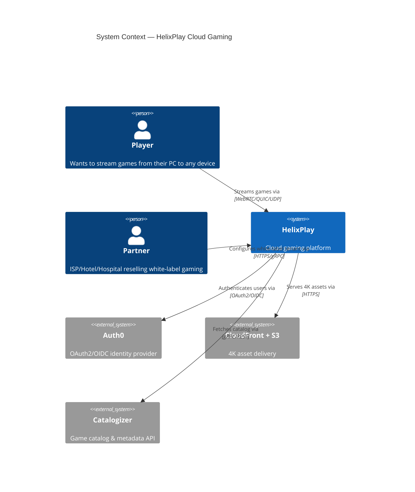
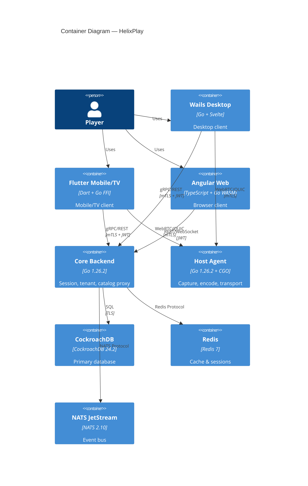
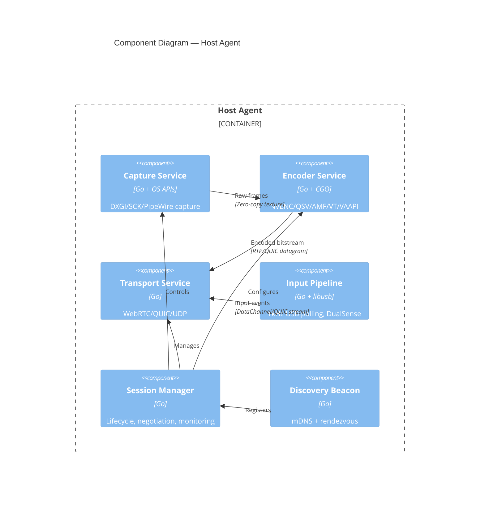

# HelixPlay Architecture

## C4 Model Diagrams

### Level 1: System Context



### Level 2: Container Diagram



### Level 3: Component Diagram (Host Agent)



## Data Flow

```
Controller Input → USB HID → SPSC Ring Buffer → gRPC/QUIC → Host Agent
                                                          ↓
Game Frame → Capture (DXGI/SCK/PipeWire) → Encoder (NVENC/QSV/AMF) →
                                                          ↓
Transport (WebRTC SRTP / QUIC datagram / UDP DTLS) → Network →
                                                          ↓
Client Decode (WebCodecs/native) → Display (OpenGL/Metal/DirectX)
```

## Technology Decisions

| Decision | Choice | Rationale |
|----------|--------|-----------|
| Language | Go 1.26.2 | Green Tea GC, reduced CGO overhead, SIMD |
| Desktop | Wails v2 | Stable, battle-tested, native OS integration |
| Mobile/TV | Flutter 3.29+ | Impeller, Go FFI, Android TV support |
| Web | Angular 17+ | Signals, standalone components, Go WASM |
| Database | CockroachDB 24.2 | Serializable default, geo-partitioning |
| Streaming | WebRTC Pion v4 | Pure Go, cross-compilable, ICE/STUN/TURN |
| Events | NATS JetStream | At-least-once, geo-replication, consumer groups |

## Performance Budgets

| Stage | LAN | WAN | Measurement |
|-------|-----|-----|-------------|
| Controller input | 2ms | 15ms | `hid-bpf` trace |
| Network transit | 5ms | 25ms | QUIC RTT sample |
| Capture | 3ms | 3ms | GPU timestamp |
| Encode | 5ms | 5ms | Encoder API timestamp |
| Decode | 8ms | 8ms | WebCodecs callback |
| Display | 7ms | 7ms | `presentmon` |
| **Total p999** | **≤30ms** | **≤50ms** | HDR Histogram |

## Security Model

- mTLS between all services
- JWT (RS256) with short expiry + refresh rotation
- RBAC: player → host_admin → tenant_admin → super_admin
- Row-level security in CockroachDB per tenant
- Container isolation (rootless Podman in prod)
- Anti-bluff CI lane (non-overridable)

---

*Architecture v1.0.0 — 2026-05-02*
