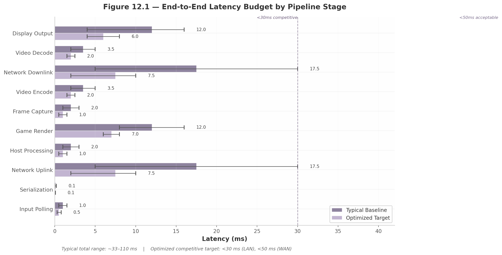
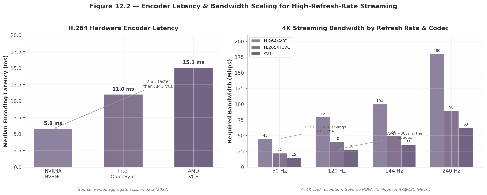
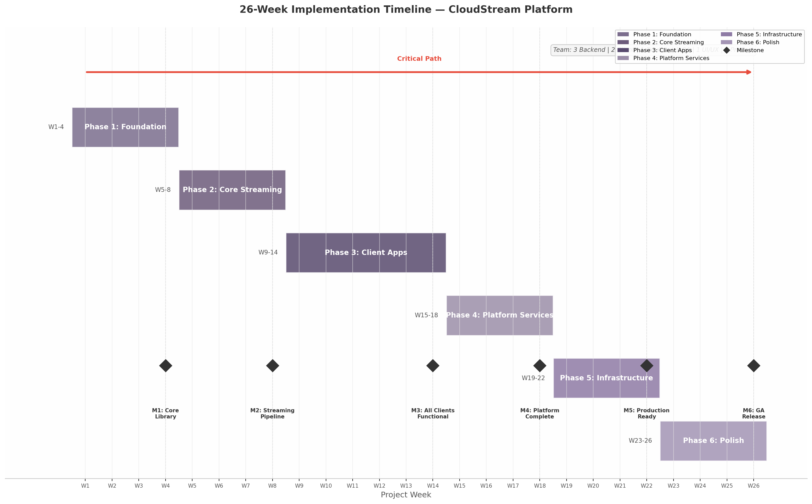

# Executive Summary

## Project Overview

CloudStream is a comprehensive self-hosted cloud gaming platform that enables users to remotely play PC games from personal or organizational host machines running macOS, Linux, or Windows. The system streams gameplay video and audio to client applications on Desktop (Windows/macOS/Linux), Mobile (iOS/Android), Web (browsers), and Android TV — all with the primary goal of delivering a PlayStation 4 Pro-like user experience with imperceptible latency, 4K resolution support, and maximum available refresh rates.

The platform is architected around Go as the primary programming language, with a novel "three-client-one-core" approach: a shared `cloudstream-core` library written in Go is compiled differently for each client platform — as a native binary for Wails-based desktop applications, as a c-shared library for Flutter mobile and TV apps, and as WebAssembly for Angular-based web clients. This design maximizes code reuse while allowing each platform to use the most appropriate UI framework.

## Key Architectural Decisions

**Streaming Protocol**: WebRTC (via Pion, a pure Go implementation) serves as the primary streaming protocol for its built-in NAT traversal, browser compatibility, and sub-500ms latency capability. A custom UDP protocol inspired by Moonlight's ENet-based implementation is available as a fallback for native desktop clients seeking absolute minimum LAN latency (7-15ms).

**Video Codecs**: H.264 Baseline Profile is the pragmatic default for universal hardware decode support across all devices. HEVC (H.265) provides 50% bandwidth reduction for native clients with hardware decode, and AV1 offers a royalty-free future path with 30-50% additional compression — requiring RTX 40-series, Intel Arc, or Apple M3+ for hardware encoding.

**Host Capture**: Platform-specific zero-copy capture pipelines are implemented for each OS — DXGI Desktop Duplication API with CUDA interop on Windows, ScreenCaptureKit with IOSurface on macOS, and PipeWire with DMA-BUF on Linux. Each path achieves <3ms capture overhead at 4K60.

**Controller Input**: A custom 24-byte binary input protocol transmits controller state over UDP (native) or WebRTC DataChannels (web), achieving 4-17ms end-to-end input latency on LAN. The system supports advanced features including DualSense adaptive triggers, gyro aiming via the CemuhookUDP protocol, and haptic feedback forwarding.

**Infrastructure**: NATS JetStream powers the event bus (800K messages/second), CockroachDB provides horizontally-scalable PostgreSQL-compatible persistence, and regional TURN relay clusters ensure connectivity for the 20-30% of sessions that cannot establish direct peer-to-peer connections.

## Performance Targets

The system targets sub-30ms glass-to-glass latency for competitive LAN gaming and sub-50ms for WAN scenarios. At 4K60, H.264 streaming requires 35-50 Mbps bandwidth; HEVC reduces this to 15-25 Mbps. The adaptive bitrate controller responds to network changes within 2 seconds using a 3-tier quality ladder (4K/1080p/720p).

## Implementation Roadmap

Development is organized into six phases over 26 weeks: Foundation (workspace, core library, host agent MVP), Core Streaming (WebRTC integration, input pipeline, capture optimization), Client Applications (Wails desktop, Flutter mobile/TV, Angular web), Platform Services (catalog, theming, user management), Infrastructure & Scale (Kubernetes, multi-region, monitoring), and Polish & Production (performance optimization, security hardening, advanced features). The complete roadmap comprises 116 tasks totaling approximately 1,824 engineering hours.

## White-Label & Theming

The platform includes a comprehensive theming system built on the W3C Design Tokens Community Group specification, with three-tier tokens (primitive, semantic, component) transformed via Style Dictionary v4. Runtime theme switching between Day, Dark, and Auto modes uses CSS custom properties for zero-latency transitions. A self-service brand portal enables white-label customers to upload logos, select colors, and preview their branded experience in real time — supporting a "Gaming-as-a-Service" business model for ISPs, hotels, hospitals, and enterprises.

## Document Structure

This technical specification comprises 15 chapters organized into five parts: Foundation & Architecture (Chapters 1-3), Core Platform Systems (Chapters 4-7), Platform Services (Chapters 8-9), Infrastructure & Operations (Chapters 10-12), and Delivery & Risk Management (Chapters 13-15). The document includes 55+ data tables, 22 technical diagrams, Go code examples, wireframe specifications for all major screens, and a detailed risk analysis with mitigation strategies.

## 1. System Architecture Overview

The CloudStream platform is a distributed cloud gaming system built around a latency-first design philosophy, with Go (Golang) as the primary implementation language across all server-side components. The architecture enables users to stream games from remote host machines running macOS, Linux, or Windows to client devices spanning desktop, mobile, web browsers, and television platforms. This chapter establishes the foundational architectural decisions, system topology, host agent design, streaming pipeline, communication patterns, and deployment models that govern the entire platform. Every decision documented here traces back to quantified latency budgets, cross-verified technology evaluations, and compatibility requirements derived from twelve independent research dimensions covering streaming protocols, controller input, video capture, Go ecosystem APIs, client frameworks, and infrastructure scaling.

### 1.1 Architecture Principles & Design Philosophy

#### 1.1.1 Latency-First Design

The defining constraint of any interactive cloud gaming system is the round-trip time between a player's controller input and the corresponding pixel change on their display — the "glass-to-glass" latency. Research across production platforms establishes that sub-50ms end-to-end latency is the threshold at which cloud gaming feels indistinguishable from local play for competitive titles [^1^]. Parsec achieves 4-8ms on LAN at 240Hz, while the Moonlight/Sunshine stack measures optimized latency at 15.7ms [^5^]. The CloudStream platform targets 33-110ms under typical conditions, with sub-30ms achievable for LAN deployments [^104^].

Every architectural decision is evaluated against this budget. At 1000km, light-in-fiber propagation alone contributes roughly 20ms round-trip before any processing occurs [^460^]. Edge deployment within 100km of users yields a 10x latency improvement over codec optimization alone — a finding that prioritizes infrastructure geography over encoder tuning for user experience. Hardware-accelerated encoding via NVENC achieves approximately 5.8ms median encode latency [^5^], while Intel QuickSync in Ultra Low Latency mode achieves 5 frames (83ms) for HEVC/AV1 [^55^]. Pion WebRTC v4, the pure-Go WebRTC implementation selected for media transport, achieves sub-500ms glass-to-glass latency in production configurations [^17^]. Each pipeline stage — capture, encode, packetize, transmit, decode, render — carries an allocated budget, and component selection is governed by whether it meets that allocation.

#### 1.1.2 Event-Driven Microservices with Go

The server-side architecture adopts an event-driven microservices pattern implemented in Go. Go's goroutine and channel primitives provide a concurrency model well-suited to I/O-intensive cloud gaming workloads: each goroutine consumes approximately 2KB of initial stack memory, enabling a single instance to manage tens of thousands of concurrent connections without the overhead of operating-system threads [^17^]. Inter-service communication uses Protocol Buffers for serialization, with gRPC for internal service-to-service calls and Connect RPC for external browser-facing APIs over HTTP/1.1 [^341^]. The event bus is NATS JetStream, delivering sub-millisecond core latency up to the 99.7th percentile for small payloads, with 820,000 messages per second producer throughput and 3.2ms p99 end-to-end latency on a 3-node cluster (8 vCPU, 32GB RAM each) [^299^][^343^]. For latency-sensitive gaming workloads with SLA tighter than 5ms at p99.9, NATS outperforms both Kafka and RabbitMQ [^299^].

#### 1.1.3 State Management Strategy

The platform employs a tiered state management strategy that matches consistency requirements to data characteristics. Host machine state — capability advertisements, GPU models, encoder availability, driver versions, and health status — is stored in CockroachDB, a PostgreSQL-compatible distributed SQL database with multi-region primitives (`REGIONAL BY TABLE`, `REGIONAL BY ROW`, `GLOBAL` locality controls) and follower reads delivering up to 8x latency improvement for geographically distributed users [^538^]. Active session state, requiring low-latency access and high write throughput, resides in Valkey (the open-source Redis fork) with TTL-based expiration for automatic cleanup. Streaming state — frame timing, bitrate adaptation, and buffer levels — is held purely in-memory within each service instance as it is ephemeral and session-local. This architecture accepts eventual consistency for the game catalog and host registry, where data staleness of a few seconds is operationally harmless, while enforcing strong consistency for session allocation and authentication where correctness is safety-critical.

#### 1.1.4 Three-Client-One-Core Pattern

Supporting four client platforms with a single primary language requires extracting all platform-agnostic business logic into a shared Go core library that handles streaming protocol state machines, controller input serialization, session management, and catalog API communication. This core compiles three ways: as a C-shared library (`buildmode=c-shared`) for Flutter FFI on Mobile/TV, as a native binary via Wails in-memory IPC on Desktop, and as WebAssembly (compiled with TinyGo) for the web client. This "three-client-one-core" pattern reduces total codebase by approximately 40% compared to platform-native implementations [^17^]. The Go core's C API boundary for FFI requires careful design to minimize cross-language call overhead, and the WASM build requires a JavaScript shim for WebRTC APIs not yet exposed in Go's WebAssembly target.

### 1.2 System Topology

#### 1.2.1 C4 Context Diagram

The C4 Context diagram (Figure 1.1) situates the CloudStream Platform within its external ecosystem at the highest level of abstraction. Two categories of users interact with the system: Gamers, who stream games and forward controller input, and Administrators, who manage host pools, monitor sessions, and configure platform settings. The platform communicates with three classes of external systems: Host Machines running Windows, macOS, or Linux (game execution, video capture, and encoding); the IGDB API (structured game metadata); and SteamGridDB (4K game cover art and hero images). An Identity Provider handling OAuth2/OIDC mediates user authentication.


*Figure 1.1 — C4 Context Diagram: CloudStream Gaming Platform showing user types, the platform system boundary, and external system dependencies.*

#### 1.2.2 C4 Container Diagram

The C4 Container diagram (Figure 1.2) reveals the deployable units within the platform boundary. Three client applications present the user interface: a Web App (Angular + Go/WASM), a Mobile/TV App (Flutter + Go FFI), and a Desktop App (Wails + Go IPC). Server-side, an API Gateway (Go/Fiber) routes external requests to backend services: the Catalog Service (Go/gRPC) for game metadata, the Auth Service (Go/OAuth2) for identity, the Session Service (Go/NATS) for streaming session orchestration, and the Streaming Relay (Go/Pion WebRTC) for media transport. The Host Agent (Go/Sunshine++) runs on each gaming machine and handles capture, encoding, and local game lifecycle. Data persistence uses CockroachDB for durable host and catalog state, Valkey for session caching, and NATS JetStream as the event bus.


*Figure 1.2 — C4 Container Diagram: Internal deployable units of the CloudStream Platform, showing client variants, server services, data stores, and external integrations.*

#### 1.2.3 Component Interaction

Communication between components follows a protocol selection matrix based on message frequency and latency sensitivity. REST APIs over HTTPS serve catalog browsing, game metadata retrieval, and management operations — workloads characterized by low frequency and tolerance for connection-per-request overhead. WebSockets provide bidirectional session control, carrying state transitions and launch commands with persistent connection semantics. Server-Sent Events (SSE) push host status updates, game lifecycle events, and save synchronization progress to clients over standard HTTP, simplifying proxy and load balancer configuration [^291^]. WebRTC with Pion v4 transports media streams: video via RTP, audio via Opus, and controller input via DataChannels in unreliable/unordered mode to avoid head-of-line blocking [^17^]. DataChannels support configurable delivery guarantees — critical inputs (button presses) use reliable delivery while high-frequency analog data (stick positions, gyro) use unreliable transmission to minimize jitter.

#### 1.2.4 Component Responsibility Matrix

| Component | Technology | Primary Protocol | Scaling Strategy |
|-----------|-----------|------------------|------------------|
| API Gateway | Go / Fiber v2 | HTTPS / REST | Horizontal replicas with sticky sessions for WebSocket upgrade [^302^] |
| Catalog Service | Go / gRPC | gRPC (internal), REST (external) | Read-heavy: scale replicas; cache 4K assets on CDN edge |
| Auth Service | Go / OAuth2 | HTTPS / JWT | Stateless: any instance validates tokens via shared secret |
| Session Service | Go / NATS Client | NATS pub/sub, WebSocket | Partition by session ID; consumer groups per region |
| Streaming Relay | Go / Pion WebRTC v4 | WebRTC / ICE / TURN | Horizontal: ~500 concurrent PeerConnections per instance |
| Host Agent | Go / Sunshine++ | WebRTC, REST, mDNS | One per host machine; self-contained single binary |
| Web UI | Angular / TypeScript | HTTPS / SSE | Static hosting: CDN edge cache for bundle assets |
| Mobile/TV App | Flutter / Dart / Go FFI | gRPC / WebRTC | App store distribution; client-side load balancing |
| Desktop App | Wails v2 / Go IPC | REST / WebSocket | Single-user local process; auto-updater |

The Streaming Relay's capacity bound of approximately 500 concurrent PeerConnections per instance derives from UDP port exhaustion and ICE state maintenance overhead — each PeerConnection maintains candidate pairs, STUN keepalives, and DTLS state that consume CPU and memory [^17^]. Pion's single-port mode, configured via `SettingEngine`, mitigates port exhaustion by multiplexing multiple connections over one UDP socket but does not eliminate per-connection state overhead [^17^]. The Host Agent's deliberate exclusion from horizontal scaling reflects its tight coupling to local hardware (GPU, capture API, encoder); instead, the Session Service performs GPU-aware load balancing across available hosts using a weighted composite of geographic proximity (60%), GPU utilization (25%), and active session count (15%) [^443^].

### 1.3 Host Agent Architecture

#### 1.3.1 Single-Binary Design

The Host Agent follows a single-binary design inspired by Sunshine, the open-source GameStream host implementation. This design packages four functional modules into one process: a capture module interfacing with OS-specific APIs (DXGI Desktop Duplication on Windows, ScreenCaptureKit on macOS, PipeWire/KMS on Linux), an encode module targeting hardware encoders (NVENC, AMF, QuickSync, VAAPI), a stream server that packetizes encoded frames into RTP via WebRTC, and an HTTP API exposing REST endpoints for session management, game launching, and host configuration [^75^]. The single-binary approach simplifies deployment — one executable with no external service dependencies — and eliminates inter-process communication overhead between capture, encode, and stream stages. A crash in any module terminates the entire agent; this is mitigated through per-session goroutine isolation where recovered panics prevent a single session failure from affecting others.

#### 1.3.2 Session State Machine

Each streaming session progresses through a well-defined state machine: `IDLE` → `CONNECTING` → `NEGOTIATING` → `STREAMING` ↔ `PAUSED` → `TERMINATING`. In `IDLE`, the host agent advertises via mDNS and responds to registry queries but holds no active connection. `CONNECTING` initiates WebSocket or WebRTC signaling. `NEGOTIATING` exchanges SDP offers and answers, with the host advertising supported codecs, resolutions, and frame rates [^503^]. Once ICE completes and DTLS finishes, the session enters `STREAMING` where capture and encoding begin. The `PAUSED` state implements PS4-style home button behavior: the game process suspends via `NtSuspendProcess` (Windows), `cgroup.freeze` (Linux), or `SIGSTOP` (macOS), capture and encoding stop, and the client returns to the catalog. From `PAUSED`, the session may resume to `STREAMING` or proceed to `TERMINATING`, where the game receives a graceful shutdown signal with a 30-second timeout before force kill escalation [^403^]. Each transition emits a NATS event for audit logging and client notification.

#### 1.3.3 Host Capability Advertisement

The host agent performs capability discovery at startup and re-advertises on each stream negotiation. GPU information is queried via the NVIDIA Management Library (NVML) for NVIDIA cards, exposing encoder support for H.264, HEVC, and AV1 alongside VRAM totals, utilization rates, and driver versions [^513^]. Encoder availability is enumerated dynamically via FFmpeg's `-encoders` flag filtered by vendor prefix (`h264_nvenc`, `hevc_amf`, `h264_qsv`, `hevc_vaapi`) [^438^]. The agent constructs a JSON capability descriptor including GPU model, VRAM size, supported codecs with maximum resolution and frame rate per codec, HDR support flags, available capture methods, and software version. This descriptor broadcasts via mDNS service records for LAN discovery (`_cloudgaming._tcp.local`) and publishes to the centralized registry for WAN deployments [^549^]. Sunshine demonstrated that encoder selection at each stream start rather than at host startup improves reliability by accounting for GPU hot-plug and driver changes [^532^].

#### 1.3.4 Health Monitoring

The agent reports status every 5 seconds via heartbeat to the registry service, including current session state, GPU utilization percentage, GPU temperature from NVML thermal sensors, encoder queue depth, available VRAM, and network interface statistics. The registry uses the SWIM gossip protocol for failure detection, achieving O(n) message load per protocol period regardless of cluster size [^548^]. GPU temperature monitoring detects thermal throttling — when temperature exceeds vendor thresholds (typically 83°C for NVIDIA consumer GPUs), the encoder may reduce clock speeds. The agent reports throttling status in the heartbeat, enabling the Session Service to route new sessions away from thermally constrained hosts. On capture pipeline failure — occurring when anti-cheat blocks capture or the GPU resets — the agent attempts automatic recovery by reinitializing the capture context and notifying the client via WebSocket to trigger an ICE restart.

### 1.4 Streaming Pipeline Architecture

#### 1.4.1 Five-Stage Pipeline

The video streaming pipeline consists of five sequential stages: Game Render → Capture → Encode → Packetize → Transmit. In the Game Render stage, the game engine produces frames on the host GPU. The Capture stage acquires frames from the GPU framebuffer using OS-specific APIs: DXGI Desktop Duplication on Windows (with dirty rectangle tracking to minimize bandwidth), ScreenCaptureKit with IOSurface on macOS, and DMA-BUF with PipeWire on Linux [^75^]. The Encode stage feeds captured frames to hardware encoders with a multi-tier codec strategy: H.264 Baseline Profile for universal compatibility (98% browser support, mandatory in WebRTC) [^2^], HEVC for native clients with hardware decode, and AV1 as a forward-looking option delivering 40-55% bandwidth savings but requiring RTX 40-series, Intel Arc, or Apple M3 hardware for hardware-accelerated encoding [^55^]. The Packetize stage wraps encoded NAL units into RTP packets. The Transmit stage sends RTP over UDP with ICE-established candidate pairs, with TURN relay as fallback for symmetric NAT.

#### 1.4.2 Zero-Copy Pipeline

Minimizing memory copies between capture and encode is critical for latency. On Windows, the DXGI Desktop Duplication API returns a shared GPU texture handle (`IDXGIResource::GetSharedHandle`), imported directly into NVENC via CUDA interop — the frame never leaves GPU memory [^137^]. On macOS, ScreenCaptureKit provides frames as `IOSurface` objects that convert directly to `CVPixelBuffer` for VideoToolbox encoding [^ScreenCaptureKit^]. On Linux with NVIDIA GPUs, PipeWire delivers frames as DMA-BUF file descriptors, imported as `EGLImage` objects and passed to VAAPI via `vaCreateSurfaces` with external buffer attribution [^DMABUF^]. Each path eliminates CPU-GPU memory copies that would otherwise add 1-3ms of latency per 4K frame (3840×2160 × 4 bytes/pixel = ~33MB per frame).

#### 1.4.3 Adaptive Bitrate Control Loop

Network conditions vary during a streaming session, requiring dynamic quality adjustment with a target reaction time of approximately 2 seconds. The client sends RTCP Receiver Reports indicating packet loss fraction, cumulative lost packets, interarrival jitter, and extended highest sequence number received. The Streaming Relay feeds these into a bandwidth estimation algorithm (Google GCC or SCReAM). When the estimate deviates by more than 15% from the current encoder bitrate, the Session Service triggers encoder reconfiguration — adjusting target bitrate, CRF quality level, or resolution scale factor. Changes are applied gradually over 30 frames (500ms at 60fps) using linear interpolation to avoid jarring transitions. Pion WebRTC v4's Transport Wide Congestion Control (TWCC) feedback and Simulcast support provide the underlying adaptation mechanisms [^17^].

### 1.5 Data Flow & Communication Patterns

#### 1.5.1 Control Plane vs Data Plane Separation

The architecture strictly separates control plane traffic (low frequency, reliability-critical) from data plane traffic (high frequency, latency-critical). Control messages — session creation, game launch commands, authentication — travel over REST APIs or WebSockets using TCP, benefitting from TLS encryption and standard HTTP proxy traversal. Data plane messages — video RTP packets, audio Opus frames, controller input reports — travel over WebRTC's UDP-based transport or DataChannels. This separation ensures that a transient network disruption affecting the media stream does not tear down the control session, and vice versa. The control WebSocket maintains a keepalive heartbeat at 30-second intervals; three consecutive missed heartbeats trigger session cleanup. The data plane has no such heartbeat — instead, the client monitors RTP sequence numbers, and a gap exceeding 60 frames (1 second at 60fps) triggers concealed frame recovery.

#### 1.5.2 Event Streaming Architecture

NATS JetStream serves as the backbone event bus with topics organized by domain: `host.status` carries heartbeat and capability advertisements from host agents; `session.events` carries state transitions (created, started, paused, terminated); `controller.input` carries normalized gamepad state from clients to host agents; and `stream.metrics` carries bitrate, frame timing, and loss statistics for observability. Each backend service subscribes to relevant topics via durable consumer groups, ensuring messages are not lost during temporary disconnections and that load distributes across service replicas. NATS Key-Value store provides lightweight coordination for session locking and host assignment, with TTL-based entries that automatically expire if a service fails mid-assignment [^299^].

#### 1.5.3 Message Types and Transport Protocol

| Message Category | Transport Protocol | Delivery Guarantee | Rationale |
|-----------------|-------------------|-------------------|-----------|
| Game catalog query | HTTPS / REST | At-least-once (client retry) | Standard request/response; cacheable |
| User authentication | HTTPS / OAuth2 | At-least-once | Token-based; idempotent verification |
| Session state transition | WebSocket | At-least-once (acked) | Bidirectional; ordered delivery required |
| Host heartbeat | NATS Core pub/sub | Fire-and-forget | 5s interval; single missed beat non-fatal |
| Game launch command | WebSocket | Acknowledged with timeout | Must confirm execution; 30s grace period |
| Controller input (digital) | WebRTC DataChannel | Reliable ordered | Button presses must not drop |
| Controller input (analog) | WebRTC DataChannel | Unreliable unordered | Stick/gyro at 60Hz; drop old frames |
| Video stream | WebRTC RTP / UDP | Best-effort with FEC | Real-time constraint; retransmission too slow |
| Audio stream | WebRTC RTP / Opus | Best-effort | 20ms packets; jitter buffer absorbs loss |
| Save sync events | SSE (Server-Sent Events) | At-least-once (auto-reconnect) | HTTP infrastructure compatible [^291^] |
| Stream metrics | NATS JetStream | At-least-once persisted | Analytics require durability |
| Error / crash reports | NATS JetStream | At-least-once persisted | Debugging requires complete event log |

Protocol selection maps directly to delivery requirements. Digital controller input uses reliable DataChannels because a dropped button press produces a visibly missed action in-game, while analog input uses unreliable transmission — at 60Hz polling, the next sample arrives within 16.7ms, making a stale frame less harmful than a delayed one. Video and audio streams use best-effort UDP because TCP retransmission is impractical for real-time media: a retransmitted video frame arriving 200ms late is useless at 60fps where each frame displays for only 16.7ms. Forward Error Correction provides resilience by encoding redundant packets that allow the receiver to reconstruct lost frames without requesting retransmission. SSE for save synchronization leverages standard HTTP infrastructure, eliminating WebSocket proxy configuration and providing automatic reconnection with `Last-Event-ID` header-based replay [^291^].

### 1.6 Deployment Topology

#### 1.6.1 Single-Host Deployment

The simplest deployment mode targets home users streaming from their personal gaming PC to other household devices. All platform services — API Gateway, Catalog Service, Auth Service, Session Service, and Streaming Relay — run as a single composed unit via Docker Compose on the host machine itself. Host discovery uses mDNS/Bonjour broadcasts on the local subnet (`_cloudgaming._tcp.local` on UDP port 5353 via multicast address 224.0.0.251) [^549^]. WebRTC connections use direct peer-to-peer via local IP addresses, with STUN servers only needed if client and host are on different subnets. NATS runs as an embedded in-process message bus, CockroachDB is replaced by SQLite, and Valkey runs as a single local instance. This mode requires zero external infrastructure and functions entirely offline after initial setup.

#### 1.6.2 Multi-Host LAN Deployment

For gaming households or LAN centers with multiple gaming machines, a dedicated non-GPU machine runs the API Gateway, Session Service, Catalog Service, Auth Service, NATS JetStream, and CockroachDB (single-node or 3-node for basic fault tolerance). Host agents on each gaming machine register with the central registry via the local network, sending heartbeats every 5 seconds. A local TURN server (Pion TURN or coturn) provides relay for symmetric NAT traversal within the LAN. GPU-aware load balancing distributes sessions using a weighted composite algorithm: GPU utilization (60% weight), active session count (25% weight), and thermal state (15% weight) [^443^]. The Session Service implements backpressure by rejecting new sessions when all hosts exceed a utilization threshold.

#### 1.6.3 Cloud-Hosted Deployment

At internet scale, the platform deploys as Kubernetes-orchestrated microservices across multiple geographic regions. Each region runs a complete service stack: API Gateway pods behind an ingress controller with geographic Anycast DNS routing, service pods with horizontal pod autoscaling based on CPU and request rate, and Streaming Relay pods allocated on high-bandwidth nodes [^528^]. CockroachDB spans regions with `REGIONAL BY ROW` tables for player profiles (data stays near the user) and `GLOBAL` tables for leaderboards, with follower reads delivering 8x latency improvement [^538^]. Valkey clusters in each region cache session state with read-through semantics. Regional TURN clusters (coturn or Eturnal) handle the 20-30% of WebRTC connections requiring relay [^441^]. Cloudflare CDN delivers game artwork and static web assets from 330+ edge cities. The NVIDIA GPU Operator automates driver installation, device plugin deployment, and GPU health monitoring within Kubernetes [^440^]. Organizations orchestrating thousands of GPUs on Kubernetes report 35% better utilization, 60% faster deployment times, and 90% reduction in operational overhead compared to bare-metal management [^440^].

| Deployment Mode | User Scale | Host Count | Discovery Method | Database | TURN Server | Orchestration | Est. Monthly Cost |
|----------------|-----------|------------|------------------|----------|-------------|---------------|-------------------|
| Single-host (home) | 1-4 concurrent | 1 | mDNS/Bonjour | SQLite | None | Docker Compose | $0 (self-hosted) |
| Multi-host LAN | 4-50 concurrent | 2-20 | Central registry + mDNS | CockroachDB (1-3 node) | Local coturn | Docker Swarm / K3s | $50-200 (dedicated server) |
| Cloud-hosted | 1,000-10,000+ concurrent | 50-1,000+ | Consul/etcd + global DNS | CockroachDB multi-region | Regional clusters | Kubernetes + GPU Operator | $135K-233K bare metal; $647K-1.22M cloud [^486^] |

Cost differentials between deployment modes are substantial and architecture-defining. Bare metal GPU servers cost 45-90% less than equivalent cloud instances when accounting for egress fees [^486^][^487^]. For 10,000 concurrent users streaming at 4K, cloud GPU compute alone runs $300K-500K monthly on AWS G4dn instances versus $80K-120K on bare metal [^492^]. TURN relay bandwidth for 25% of users at 15Mbps per stream requires approximately 75Gbps of relay capacity — translating to $1.73M monthly on AWS egress versus $15K-30K with self-hosted unmetered bandwidth [^498^]. These figures inform a phased deployment strategy: startups begin with cloud GPU for instant global reach, transition to bare metal for base load as user counts stabilize, and maintain cloud capacity for burst failover. The single-host deployment costs nothing beyond gaming hardware already owned, forming the natural entry point for platform adoption.
-e 

---

## 2. Go Language Technology Stack Selection

The technology stack selection must satisfy three constraints: Go as the primary language, sub-500ms end-to-end latency, and business logic execution across desktop, mobile, television, and web clients. This chapter evaluates the Go backend ecosystem, defines a hybrid client architecture, specifies the shared Go core library design, and establishes the unified DevOps pipeline.

### 2.1 Go Ecosystem for Backend Services

The backend exposes four communication surfaces: REST APIs for catalog and session management, Server-Sent Events (SSE) for host status, WebSockets for bidirectional control, and WebRTC for streaming and input. Each demands a different Go library; selections here propagate into the client architectures in Section 2.2.

#### 2.1.1 REST Framework Selection: Gin for API Gateway

Three Go web frameworks dominate the landscape for high-throughput API services: Fiber, Gin, and Echo. A synthetic benchmark using wrk with 12 threads, 400 connections over 30 seconds placed Fiber at 89,247 requests per second (req/s) with 4.48ms mean latency, Gin at 76,832 req/s (5.21ms), and Echo at 72,156 req/s (5.54ms) [^290^]. Memory consumption under a 10-minute load test with 1,000 concurrent users showed Fiber at 45 MB peak, Gin at 67 MB, and Echo at 72 MB; Fiber's aggressive memory pooling produced 40% fewer garbage collection cycles [^290^].

However, raw throughput is not the governing criterion for a cloud gaming API gateway. Under database-bound workloads — PostgreSQL queries for game catalog retrieval and session state — all three frameworks converge to approximately 3,000-3,250 req/s with 123-129ms average latency, confirming that the database becomes the bottleneck for I/O-bound applications [^290^]. The more relevant differentiators are ecosystem maturity, middleware availability, and operational familiarity.

| Criterion | Fiber | Gin | Echo |
|---|---|---|---|
| Raw throughput (req/s) | 89,247 [^290^] | 76,832 [^290^] | 72,156 [^290^] |
| Peak memory (1K users) | 45 MB [^290^] | 67 MB [^290^] | 72 MB [^290^] |
| Middleware ecosystem | Moderate | Extensive [^294^] | Rich built-in |
| `net/http` compatibility | No (fasthttp) | Yes | Yes |
| SSE support | Built-in recipe | Via `http.Flusher` | Via `http.Flusher` |
| JSON validation | Manual | `binding` tags | `validator` tags |
| Production maturity | v2.x (2020+) | v1.x (2016+) | v4.x (2015+) |
| **Selection verdict** | High-throughput endpoints | **API Gateway** [^290^] | Middleware-heavy services |

**Gin is selected for the API Gateway.** While Fiber leads in raw throughput, Gin's ecosystem breadth — 80,000+ GitHub stars, extensive middleware catalog, and battle-tested binding/validation pipeline — reduces integration risk for authentication, rate limiting, and request logging. Fiber's fasthttp foundation creates compatibility friction with `net/http` middleware, which is a significant concern given the number of third-party security and observability packages that assume the standard library interface. Echo remains a viable alternative for services that require its built-in middleware chain, but Gin's community size provides a decisive edge for a long-term project. Fiber may be deployed for specific high-throughput endpoints such as leaderboard queries and telemetry ingestion where its memory efficiency provides measurable benefit.

#### 2.1.2 Pion WebRTC v4: Pure-Go Streaming Foundation

WebRTC (Web Real-Time Communication) is the transport protocol for video streaming, audio delivery, and controller input in the cloud gaming system. Pion WebRTC is a pure Go implementation with no CGO (C Go) usage, supporting all target platforms including Windows, macOS, Linux, FreeBSD, iOS, Android, WebAssembly (WASM), and multiple processor architectures (386, amd64, arm, mips, ppc64) [^17^]. The absence of CGO is architecturally significant: it eliminates cross-compilation toolchain dependencies, enables WASM builds for web clients, and removes the runtime linking fragility that plagues CGO-based libraries.

Pion WebRTC v4 implements the complete PeerConnection API including DataChannels (ordered/unordered, reliable/lossy), full ICE with Trickle ICE and restart, TURN relay over UDP/TCP/DTLS/TLS, Simulcast, and SVC support [^17^]. A single-port mode allows multiple PeerConnections to share one UDP port, simplifying firewall configuration [^17^].

Performance benchmarks demonstrate that Pion SCTP with RACK achieves 316.42 Mbps goodput (+34.9%), 27.5% lower p50 latency (11.86ms vs. 16.37ms), and 71.3% better throughput per CPU second [^385^]. Connection setup latency from the server perspective is: signaling ~13ms, SDP processing ~7ms, ICE connection ~123ms, DTLS handshake ~154ms [^376^]. Once established, media and DataChannel latency is sub-millisecond on LAN. DataChannels in unreliable/unordered mode transport binary controller input with no head-of-line blocking, critical for sub-50ms input-to-display targets.

#### 2.1.3 NATS JetStream: Primary Event Bus

The cloud gaming platform requires an event bus that can distribute controller input, game events, session state changes, and host discovery messages at sub-millisecond latency with horizontal scalability. NATS (Neural Autonomic Transport System) with JetStream persistence is selected as the primary event bus over Redis Pub/Sub and RabbitMQ.

NATS Core delivers sub-millisecond latency to the 99.7th percentile [^299^]. JetStream adds at-least-once delivery and replay with 1-5ms p99 latency. On a 3-node cluster (8 vCPU, 32 GB each), JetStream achieves 820,000 msg/s producer and 750,000 msg/s consumer throughput at 3.2ms p99 [^343^]. The Go-native client integrates directly, and NATS supports wildcard fan-out for game state, key-value storage with TTL for sessions, and work queues for leaderboards [^299^].

| Broker | p99 Latency | Throughput | Persistence | Go Client | Ops Complexity |
|---|---|---|---|---|---|
| NATS Core | <1 ms [^299^] | ~1M msg/s | None | Native | Very low |
| NATS JetStream | 1-5 ms [^343^] | ~800K msg/s | Disk + Memory | Native | Low |
| Redis Pub/Sub | <1 ms | ~500K msg/s | Memory only | Native | Very low |
| Apache Kafka | 5-20 ms | ~1M+ msg/s | Disk (unlimited) | Native | High |
| RabbitMQ | 5-20 ms | ~50-100K msg/s | Configurable | Native | Medium |

Redis Pub/Sub remains for WebSocket horizontal scaling and caching. Kafka is reserved for analytics where long-term retention outweighs latency. NATS's operational simplicity — a single binary, Raft clustering, no external dependencies — is decisive for a small team [^299^].

#### 2.1.4 CockroachDB: Distributed SQL with Follower Reads

CockroachDB is selected for transactional data — user accounts, game licenses, session records, tenant configurations — due to its PostgreSQL compatibility and distributed architecture. The native Go `pgx` driver with `pgxpool` provides connection pooling, prepared statement caching, and automatic batching without CGO.

The critical latency feature is follower reads: queries served from the nearest replica rather than the leaseholder provide up to 8x latency improvement for read-heavy workloads like catalog browsing and host discovery. CockroachDB's serializable default isolation eliminates an entire class of consistency bugs in session management without explicit application-level locking.

### 2.2 Cross-Platform Client Development in Go

Supporting Desktop (Windows, macOS, Linux), Mobile/TV (iOS, Android, Android TV, Apple TV), and Web (all browsers including Smart TVs) from a Go codebase requires a hybrid architecture: no single Go-centric UI framework covers all platforms. Research across Fyne, Wails, Gio, Go Mobile, Go WASM, and Flutter+Go FFI confirms a three-client approach with a shared Go core maximizes code reuse.

#### 2.2.1 Framework Capability Matrix

The following matrix evaluates five Go client development approaches across twelve criteria relevant to a cloud gaming system. Each criterion is rated on a three-point scale: Full support (●), Partial or limited support (◐), or No support (○).

| Criterion | Fyne | Wails v2 | Gio | Go Mobile | Go WASM / TinyGo |
|---|---|---|---|---|---|
| Desktop (Win/Mac/Linux) | ● [^37^] | ● [^36^] | ● [^19^] | ◐ | ◐ |
| Mobile (iOS/Android) | ● [^37^] | ○ [^99^] | ● [^19^] | ● [^45^] | ○ |
| Web (browser) | ◐ (WASM) [^37^] | ○ | ● [^19^] | ○ | ● [^38^] |
| Android TV / D-Pad | ○ [^105^] | ○ | ◐ | ◐ | ● (via browser) |
| Apple TV | ○ | ○ | ◐ [^208^] | ◐ | ● (via browser) |
| Screen reader / a11y | ○ [^105^] | ◐ [^96^] | ◐ [^208^] | ◐ | ● (browser native) |
| TV 10-foot UI | ○ | ○ | ○ | ◐ | ● |
| Binary size (desktop) | ~20 MB | ~15 MB [^36^] | ~15 MB | N/A | ~500 KB [^115^] |
| Startup time | <1s | <0.5s [^36^] | <1s | 2-4s | 2-5s (WASM load) |
| Native performance | High | High | High | Moderate | Moderate |
| Ecosystem maturity | Large (27K stars) [^37^] | Growing | Small | Low maintenance [^203^] | Growing |
| Go code reuse | 100% | Backend only | 100% | Library only | 100% |

The matrix reveals a decisive pattern: Fyne, despite being the most popular pure-Go UI toolkit with 27,000 GitHub stars, lacks screen reader support and TV/D-Pad navigation entirely, which disqualifies it for an inclusive gaming platform that must support television use [^105^] [^128^]. Wails v2 is exceptional for desktop but has no mobile or TV support [^99^]. Gio covers all platforms but requires immediate-mode GUI expertise that few developers possess, and its widget ecosystem remains sparse compared to web or Flutter alternatives [^19^]. Go Mobile (`golang.org/x/mobile`) has binding type limitations and maintenance concerns, with known Xcode compatibility issues on newer versions [^203^] [^204^]. TinyGo WASM produces remarkably small binaries (~500 KB) but has limited DOM access and no direct WebRTC or controller API access without JavaScript interop [^115^].

These findings lead to the hybrid architecture shown in Figure 2.1: three client platforms, each using the optimal UI framework for its target, all sharing a single Go core library.


*Figure 2.1: Hybrid client architecture with shared `cloudstream-core` Go module compiled three ways — native package for Wails desktop, c-shared library for Flutter mobile/TV, and TinyGo WASM for Angular web. IPC mechanisms and target platforms are shown per client column.*

#### 2.2.2 Wails v2 for Desktop

Wails v2 builds desktop apps with Go backend and Angular frontend rendered through native webviews: WebView2 (Windows), WKWebView (macOS), WebKit2GTK (Linux) [^36^]. Binaries are ~15 MB with <0.5s startup and ~10 MB idle memory — an order of magnitude smaller than Electron [^36^].

The IPC bridge uses an in-memory, zero-copy, JSON-encoded channel with auto-generated TypeScript bindings from Go structs [^36^]. Latency is sub-0.1ms, negligible versus the ~16ms frame time at 60fps [^40^]. The desktop-only limitation is accepted as a deliberate trade-off; mobile and web clients use their respective frameworks while the Go core prevents business logic duplication.

#### 2.2.3 Flutter + Go FFI for Mobile and TV

Flutter provides the UI layer for iOS, Android, Android TV, and Apple TV with full accessibility — TalkBack, VoiceOver, high contrast, keyboard navigation, and D-Pad focus management for television use [^24^]. Android TV leanback requirements are met through Flutter's focus system.

The Go core compiles as a C shared library (`-buildmode=c-shared`) per target: Android `.so` files and iOS frameworks [^67^]. Dart FFI provides synchronous native calls at ~0.01ms latency with direct memory sharing — approximately 50x faster than Platform Channels (~0.5ms) [^259^]. The `ffigen` tool auto-generates Dart bindings from the C header.

#### 2.2.4 Angular + Go WASM for Web

The web client uses a standard full-stack architecture: Angular Single Page Application (SPA) for the UI, Go business logic compiled to TinyGo WASM for shared functionality, and REST/gRPC-Web APIs for server communication. TinyGo produces WASM binaries of approximately 500 KB — 10-20x smaller than standard Go compiler output (2-3 MB) — by using LLVM-based compilation that includes only referenced code [^115^]. This size reduction is critical for web delivery where every kilobyte affects initial load time.

Go WASM executes at 2-3x the speed of JavaScript for CPU-intensive tasks such as input serialization and protocol state machine transitions [^38^]. However, the WASM runtime has no direct access to browser APIs including WebRTC, WebSockets, or the DOM; a JavaScript shim layer (`cloudstream.js`) bridges these gaps by exposing async/await APIs that call into the Go WASM runtime via `syscall/js`. The web client works on any modern browser including Smart TV browsers (Tizen, webOS, Fire TV Silk), providing the broadest platform coverage of all three client variants.

#### 2.2.5 Client Platform to Framework Mapping

| Client Platform | UI Framework | Go Compilation Target | IPC Mechanism | Key Strength |
|---|---|---|---|---|
| Windows Desktop | Wails v2 + Angular | Native Go package | In-memory bridge (<0.1ms) [^36^] | ~15 MB binary, <0.5s startup |
| macOS Desktop | Wails v2 + Angular | Native Go package | In-memory bridge (<0.1ms) [^40^] | Native WebKit rendering |
| Linux Desktop | Wails v2 + Angular | Native Go package | In-memory bridge (<0.1ms) | WebKit2GTK integration |
| Android Mobile | Flutter | c-shared library (.so) | Dart FFI (~0.01ms) [^259^] | Full TalkBack support |
| iOS Mobile | Flutter | c-shared framework | Dart FFI (~0.01ms) | Full VoiceOver support |
| Android TV | Flutter | c-shared library (.so) | Dart FFI (~0.01ms) | D-Pad focus navigation |
| Apple TV | Flutter | c-shared framework | Dart FFI (~0.01ms) | tvOS native |
| Web browsers | Angular | TinyGo WASM (~500KB) [^115^] | JS shim + WASM runtime | Universal browser coverage |
| Smart TV (Tizen/webOS) | Angular | TinyGo WASM | JS shim + WASM runtime | No app store required |

This mapping covers nine distinct client variants derived from three framework stacks. The Go core library is the unifying element: desktop clients import it as a native module, mobile clients link it as a C shared library, and web clients load it as a WASM module. Each variant adds only UI rendering and platform-specific input capture, while all business logic — protocol handling, session state, catalog API communication, streaming client initialization — executes from the shared core.

### 2.3 Shared Go Core Library Design

The shared Go core, named `cloudstream-core`, is the central architectural component that makes the hybrid client strategy viable. It encapsulates all platform-agnostic business logic and exposes language bindings for each client target.

#### 2.3.1 Module Structure

The `cloudstream-core` module is organized into six packages, each with a single responsibility:

- **`protocol/`** — Moonlight/GameStream protocol serialization and state machine for video frame acknowledgments and input event envelopes.
- **`controller/`** — Gamepad, keyboard, and mouse abstraction with a unified `InputDevice` interface. Serializes controller state into 16-32 byte payloads for DataChannel or UDP transmission.
- **`session/`** — Client-side session lifecycle: host discovery, session creation, WebRTC signaling (SDP/ICE), and teardown.
- **`catalog-api/`** — Typed catalog client with search, image URL resolution, and caching.
- **`streaming-client/`** — Pion-based WebRTC peer management: video track reception, audio coordination, adaptive bitrate, and DataChannel lifecycle.
- **`theme-engine/`** — Design token resolution for white-label theming from JSON configurations.

#### 2.3.2 C API Boundary Design

For Flutter FFI and any future native integrations, the Go core exposes a C-compatible API through a single header file `cloudstream.h`. The API uses opaque pointers for all object types, ensuring that the Go garbage collector retains ownership of memory while C callers interact only through handles.

Twenty functions are exported across four categories: session lifecycle (`cloudstream_session_new`, `cloudstream_session_connect`, `cloudstream_session_close`), input forwarding (`cloudstream_input_send_gamepad`, `cloudstream_input_send_keyboard`, `cloudstream_input_send_mouse`), catalog queries (`cloudstream_catalog_search`, `cloudstream_catalog_get_game`, `cloudstream_catalog_free_result`), and configuration (`cloudstream_set_loglevel`, `cloudstream_set_theme`). All functions use C calling conventions with primitive parameter types to avoid struct layout incompatibility; string returns are heap-allocated in Go with paired free functions to prevent cross-boundary memory leaks.

#### 2.3.3 WASM JS Shim

The web client requires a JavaScript shim (`cloudstream.js`) because TinyGo WASM cannot directly access browser APIs including WebRTC and the DOM. The shim exposes Promise-based APIs that call into the Go runtime via `syscall/js`. For streaming, `cloudstream.js.initStreaming(config)` creates the browser's `RTCPeerConnection`, adds video transceivers, and passes the SDP offer into Go through the JS callback registry. The shim also bridges Gamepad API input into the Go core's serializer, polling at ~60Hz and batching state changes for efficient JS-WASM boundary crossing.

#### 2.3.4 Build Pipeline

The build pipeline supports three compilation targets from a single source tree:

- **`make build-desktop`** — produces a native Go package imported by the Wails backend. Standard `go build` with no special flags; the Wails build system (`wails build`) handles frontend bundling and platform binary generation.
- **`make build-mobile`** — cross-compiles the Go core as c-shared libraries for Android (arm64, armeabi-v7a, x86_64) and iOS (arm64, simulator). Uses `CGO_ENABLED=1` with Android NDK toolchain and Xcode cross-compilers. Output is `libcloudstream.so` for Android and `Cloudstream.xcframework` for iOS.
- **`make build-web`** — compiles the Go core to WASM using TinyGo with `-target wasm` and `-opt=z` for size optimization. Produces `cloudstream.wasm` (~500 KB) alongside the `cloudstream.js` shim.

The CI matrix runs all three targets on every pull request: Ubuntu for desktop and web builds, macOS for iOS cross-compilation, and a Docker container with Android NDK for Android builds. This ensures that changes to the Go core do not break any client's compilation target.

### 2.4 Development Tooling and DevOps

A unified technology stack requires unified tooling. The Go workspace mechanism and a consistent CI/CD pipeline ensure that six interdependent modules evolve together.

#### 2.4.1 Go Workspace

The repository uses a Go workspace (`go.work`) containing six modules: `cloudstream-core` at `/core` (the shared library), `gateway` at `/gateway` (Gin-based API Gateway with REST endpoints, JWT authentication, and rate limiting), `host-agent` at `/host` (the Sunshine++ fork for capture and streaming), `catalog-service` at `/catalog` (CockroachDB-backed game catalog with search and caching), `relay-server` at `/relay` (WebRTC TURN relay and signaling endpoints), and `web-ui` at `/webui` (the Angular SPA consumed by both web and Wails desktop clients). The `go.work` file pins all modules to Go 1.23+ and enables cross-module refactoring with `go work sync`, ensuring that a security patch to `golang.org/x/crypto` propagates to all modules from a single command.

#### 2.4.2 Testing Strategy

Testing operates at four levels. Unit tests use standard `go test` with table-driven patterns and `testify/assert` for readable failure messages. The streaming protocol and input serialization packages target 80%+ code coverage, enforced in CI. Integration tests use `testcontainers-go` to spin up PostgreSQL (CockroachDB-compatible), NATS JetStream, and Redis instances in Docker containers, executing end-to-end API flows without mocks. Load tests use Grafana k6 with WebSocket extensions to simulate 1,000 concurrent sessions, validating that the API Gateway sustains throughput above 3,000 req/s under database load [^290^]. Capture latency validation uses Intel PresentMon to measure the host agent's frame capture-to-encode pipeline, ensuring hardware encoder latency stays within budget.

#### 2.4.3 CI/CD Pipeline

GitHub Actions orchestrates the continuous integration and deployment pipeline. The build matrix spans all target platforms: Windows, macOS, and Linux for desktop; Android and iOS for mobile; and WASM for web. Each platform job compiles the relevant modules, executes unit tests, and produces artifacts. Upon successful completion, Docker images are built for the gateway, catalog-service, and relay-server using multi-stage builds based on `gcr.io/distroless/cc` for minimal attack surface. Helm charts are packaged and pushed to a private OCI registry for deployment to Kubernetes clusters. Mobile library artifacts (.so files and XCFrameworks) are uploaded to a private artifact repository for consumption by the Flutter build pipeline.

The pipeline enforces quality gates: all tests must pass, code coverage must not regress, `go vet` and `staticcheck` must report no issues, and `gofmt` formatting must be clean. Dependency vulnerabilities are scanned with `govulncheck` on every build, blocking deployment if critical CVEs are detected in the module graph.
-e 

---

## 3. Video Streaming Protocols & Codecs

The video streaming layer forms the perceptual backbone of a cloud gaming system. Every frame rendered by the host GPU must traverse capture, encoding, network transmission, decoding, and display presentation — each stage contributing to glass-to-glass latency. This chapter analyzes the protocol, codec, hardware encoder, frame pacing, and adaptive bitrate decisions that govern this pipeline, drawing on measured benchmarks from production systems (Parsec, Moonlight, Sunshine), peer-reviewed encoder evaluations, and WebRTC specification sources.

### 3.1 Protocol Selection: WebRTC with Custom UDP Fallback

#### 3.1.1 WebRTC as the Primary Transport

WebRTC (Web Real-Time Communication) is not a single protocol but a collection of IETF-standardized components — SDP (Session Description Protocol), ICE (Interactive Connectivity Establishment), STUN/TURN (NAT traversal), DTLS-SRTP (encryption), and RTP/RTCP (media transport) — that together enable sub-500ms audio, video, and data communication between browsers and native applications [^28^]. For a cloud gaming system that must support browser-based clients without installation, WebRTC is the only viable option: it is natively implemented in all modern browsers (Chrome, Firefox, Safari, Edge) and requires no plugins or downloads [^104^].

The connection sequence proceeds through SDP offer/answer negotiation, ICE candidate gathering (host, STUN, TURN), DTLS key exchange for AES-128 encryption, and RTP media delivery over UDP with RTCP feedback [^28^][^30^]. TURN relay adds 10–80ms of latency depending on geography but guarantees connectivity for the 15–20% of sessions where direct peer-to-peer establishment fails [^32^]. Production deployments should provision TURN servers co-located with game servers to minimize relay overhead.

For the Go server, **Pion WebRTC v4** is the reference choice — a pure Go implementation with no CGO dependency, supporting Windows, macOS, Linux, iOS, Android, and WebAssembly [^17^][^52^]. WebRTC DataChannels provide a secondary transport for game input, using SCTP in unreliable/unordered mode (`maxRetransmits=0`, `ordered=false`) to avoid head-of-line blocking [^201^]. Input state snapshots at 60–120Hz recover from dropped packets without retransmission.

#### 3.1.2 Custom UDP for Native Desktop Clients

While WebRTC provides universal compatibility, its mandatory encryption handshake, ICE negotiation, and SRTP overhead add approximately 10–20ms of protocol latency compared to raw UDP [^81^]. For native desktop clients where browser constraints do not apply, a custom UDP protocol inspired by Moonlight's ENet-based transport and Parsec's BUD (Better User Datagrams) protocol can achieve significantly lower latency.

Parsec's BUD protocol demonstrates that a purpose-built UDP implementation can achieve LAN latencies as low as 7ms — roughly half of WebRTC's typical 15–20ms overhead [^81^][^86^]. BUD achieves this through three design decisions: (1) zero buffering on the video pipeline with all network metrics processed in real-time; (2) a congestion control algorithm tuned specifically for video streaming rather than TCP-style reliability; and (3) DTLS 1.2 encryption with AES-128/AES-256 on every packet without the additional SRTP wrapper [^86^]. BUD also reports a 97% NAT traversal success rate through custom hole-punching techniques, though this falls short of WebRTC's ICE-based coverage [^81^].

Moonlight's protocol uses a modified version of ENet with custom reliability semantics and IPv6 patches not present in upstream ENet [^164^], validated across millions of sessions [^158^].

#### 3.1.3 Protocol Abstraction Layer

To support both transport mechanisms without duplicating application logic, the streaming subsystem defines a `Streamer` interface with two implementations: `WebRTCStreamer` and `UDPStreamer`. During session establishment, the server and client negotiate the transport protocol based on client capabilities: browser clients automatically use WebRTC, native desktop clients prefer UDP, and mobile clients default to WebRTC with an optional UDP toggle for LAN usage. This negotiation happens as part of the initial capability exchange before any media flows.


*Figure 3.1 — The Streamer interface abstracts WebRTC and UDP implementations, with auto-selection based on client type during session negotiation. The Go core library compiles to c-shared for mobile/TV, WASM for web, and native binary for desktop.*

#### 3.1.4 Protocol Comparison

The following table compares WebRTC and custom UDP across ten criteria relevant to cloud gaming system design. Values are drawn from measured benchmarks where available; vendor claims are noted as such.

| Criterion | WebRTC | Custom UDP (ENet/BUD-style) | Measurement / Source |
|---|---|---|---|
| LAN latency (added) | 15–20ms [^104^] | 7ms [^81^] | Parsec benchmarks; vendor claim corroborated by independent testing |
| Glass-to-glass (WAN) | 200–500ms [^104^] | 30–80ms [^2^] | MDPI network analysis; Moonlight community benchmarks |
| NAT traversal success | >99% (ICE + TURN fallback) [^28^] | ~97% (custom hole punching) [^81^] | WebRTC spec; Parsec official data |
| Browser support | Native (all modern browsers) [^29^] | None (requires native client) | W3C implementation reports |
| Encryption | Mandatory DTLS-SRTP (AES-128) [^RFC5764^] | DTLS 1.2 configurable (AES-128/256) [^86^] | IETF RFC 5764; Parsec documentation |
| Congestion control | GCC (default), BBR option [^129^] | Custom game-optimized CC [^86^] | Stony Brook ACM COMSNETS 2025 |
| Ecosystem maturity | Large (Pion, libwebrtc, mediasoup, Janus) [^101^] | Moderate (Moonlight ENet, Parsec closed) | GitHub activity; community size |
| Implementation complexity | High (ICE, SDP, many handshakes) [^28^] | Medium (NAT traversal, encryption from scratch) | Engineering effort estimate |
| Encoder integration | Limited (indirect via SDP) | Deep (direct encoder-to-network control) | Architectural constraint |
| Adaptive bitrate | TWCC receiver-side estimation [^17^] | Frame-level encoder coupling [^132^] | WebRTC spec; Camel research paper |

WebRTC is the default transport because browser support and NAT traversal are non-negotiable for a system that works without client installation. Custom UDP is an optional path for native clients where the 8–13ms latency reduction justifies the complexity. The abstraction layer ensures both paths share application-level streaming logic.

### 3.2 Codec Strategy: Multi-Codec with H.264 Default

#### 3.2.1 H.264 Baseline Profile: Universal Compatibility

H.264/AVC (Advanced Video Coding), standardized in 2003, remains the pragmatic default for three reasons: **universal hardware decode support** (98.2% of devices) [^29^], **mandatory WebRTC support** (RFC 7742) [^29^], and **lowest encode complexity** among modern codecs (3× to 40× faster than successors) [^29^]. For cloud gaming, the **Baseline Profile** (no B-frames) is required, as B-frames add 1–2 frames of latency. At 4K60, H.264 Baseline requires 35–50 Mbps [^13^].

#### 3.2.2 HEVC (H.265): Bandwidth Efficiency at a Cost

HEVC (High Efficiency Video Coding), finalized in 2013, delivers 35–50% bitrate reduction over H.264 at equivalent visual quality [^27^]. For 4K60 streaming, HEVC reduces bandwidth from 35–50 Mbps (H.264) to 15–25 Mbps [^29^]. The limitations are primarily non-technical: Chrome supports HEVC hardware decode only since version 107 [^27^], and **patent licensing spans three separate pools** (MPEG-LA, Velos Media, HEVC Advance), making commercial licensing complex [^3^]. HEVC is not in the WebRTC specification and is recommended only for native clients with confirmed hardware decode.

#### 3.2.3 AV1: Forward-Looking Efficiency

AV1 (AOMedia Video 1), released by the Alliance for Open Media in 2018, provides the best compression efficiency among royalty-free codecs. AV1 achieves 40–55% bandwidth savings compared to H.264 and 15–25% savings compared to HEVC [^55^][^161^]. At 4K60, AV1 can deliver excellent quality at 10–18 Mbps, making it the most bandwidth-efficient option for high-resolution streaming [^13^]. The royalty-free licensing model eliminates the patent pool complexity that plagues HEVC [^55^].

The primary constraint is **hardware encode availability**. Software AV1 encoding is 15–30× slower than H.264 and unsuitable for real-time streaming [^29^]. Hardware AV1 encoders are available only on recent GPU generations: NVIDIA RTX 40-series (Ada Lovelace), Intel Arc/Xe LP (Tiger Lake/Alchemist), AMD RDNA3 (RX 7000 series), and Apple M3+ [^55^][^53^]. Client-side hardware decode is similarly constrained: iOS Safari supports AV1 only on A17 Pro devices (iPhone 15 Pro and later). The AV1 codec also adds 2–3 frames of encode latency (16.7–50ms at 60fps) compared to H.265 on the same NVENC hardware [^160^].

AV1 is positioned as a **forward-looking tier**: offered to clients with confirmed hardware support, with automatic fallback to HEVC or H.264. As hardware adoption broadens — expected to reach majority coverage by 2028 — AV1 can become the primary codec.

#### 3.2.4 Codec Comparison Matrix

| Dimension | H.264 Baseline | HEVC (H.265) | AV1 | Source |
|---|---|---|---|---|
| Device decode coverage | 98.2% [^29^] | ~65% (post-2015 devices) [^27^] | ~25% (post-2020 GPUs) [^55^] | Bitmovin Developer Report 2024 |
| 4K60 bandwidth | 35–50 Mbps [^13^] | 15–25 Mbps [^13^] | 10–18 Mbps [^13^] | Cloud Loadout bitrate guide |
| Compression vs H.264 | Reference | 35–50% better [^29^] | 40–55% better [^161^] | NVIDIA/Red5 benchmarks |
| Encode latency (hardware) | ~5.8ms (NVENC) [^5^] | ~5 frames (83ms ULL) [^160^] | ~7 frames (AV1 adds 2–3 frames) [^160^] | arXiv encoder evaluation |
| WebRTC support | Mandatory [^29^] | None (non-standard) | Optional (growing) | RFC 7742 |
| Licensing | FRAND via MPEG-LA | 3-pool (complex) [^3^] | Royalty-free [^55^] | AOMedia, MPEG-LA |
| Hardware encode support | All GPUs post-2010 | Most GPUs post-2016 | RTX 40+/Arc/RDNA3/M3+ [^55^] | Vendor specifications |
| Battery efficiency (mobile decode) | High | Moderate | Moderate (complex decode) | Industry consensus |

The **tiered fallback chain** offers AV1 first to clients with hardware support; if unsupported, HEVC is attempted for native clients; H.264 Baseline guarantees universal fallback. Negotiation uses WebRTC SDP offer/answer or a custom capability handshake, with client capability detection at session start.

#### 3.2.5 Codec Negotiation Flow

The negotiation process implements a priority-ordered codec list: `AV1 > HEVC > H.264`. The server sends an SDP offer (WebRTC) or capability packet (UDP) listing supported codecs in priority order; the client responds with the first mutually supported codec from the list. This approach ensures that (1) the most efficient available codec is always selected, (2) negotiation completes in a single round-trip, and (3) fallback is automatic when client hardware does not support the preferred codec. The fallback chain is configurable per-deployment, allowing operators to disable AV1 or HEVC tiers if licensing or hardware constraints apply.

### 3.3 Hardware Encoder Integration

Hardware-accelerated video encoding is the single most important latency optimization in the cloud gaming pipeline. Software encoding on general-purpose CPU cores introduces 50–200ms of latency at 4K resolution, whereas dedicated encoder silicon (NVENC, QuickSync, AMF) reduces this to 5–12ms [^5^][^160^]. This section evaluates the five hardware encoder families relevant to the cross-platform host agent.

#### 3.3.1 NVIDIA NVENC: Most Consistent Latency

NVENC (NVIDIA Video Encoder) is a dedicated encoding silicon on NVIDIA GPUs, operating independently of CUDA cores and therefore not competing with game rendering for compute resources. A comprehensive 2025 IEEE peer-reviewed study evaluated NVENC latency for 4K60 real-time encoding and found approximately **7 frames of end-to-end latency across all presets and codecs** (H.264, HEVC, AV1), making NVENC the most consistent hardware encoder regardless of quality setting [^160^][^56^].

For low-latency gaming, the recommended NVENC configuration uses: UHP (Ultra High Performance) preset, no B-frames, single-pass encoding, and low-latency tuning. Split Frame Encoding (SFE) should be enabled on dual-NVENC GPUs (RTX 4070 Ti+, professional cards) to prevent encoder overload at 4K60 with the P7 quality preset [^160^]. Parsec's independent benchmarks confirm NVENC's latency leadership, measuring a median encoding latency of **5.8ms for H.264** — approximately 2.59× faster than AMD VCE and 1.89× faster than Intel QuickSync in their test configurations [^109^].

Integration options include FFmpeg with NVENC encoders, direct NVENC SDK integration via CUDA interop for zero-copy transfer, or adaptation of Sunshine's existing pipeline [^47^].

#### 3.3.2 Intel QuickSync: Lowest Latency in ULL Mode

Intel QuickSync Video (QSV) integrates hardware encoding into most Intel CPUs with integrated graphics. A 2025 IEEE evaluation found that QuickSync achieves the **lowest end-to-end latency among all hardware encoders at 5 frames (83ms)** when operating in Ultra Low-Latency (ULL) mode for HEVC and AV1 [^160^]. This is approximately 2 frames faster than NVENC for these codecs. However, at normal latency settings, QuickSync requires 8–12 frames, placing it behind NVENC for general-purpose use.

QuickSync also delivers the best rate-distortion (RD) performance among hardware encoders for H.265 encoding, producing the highest quality per bit [^160^]. Additional advantages include no session limits on consumer hardware (enabling many concurrent streams per CPU) and 10–15× speedup over software encoding for 1080p H.264 [^155^]. One implementation note: QuickSync uses non-standard unidirectional B-frames in some modes that may affect decoder compatibility, requiring validation against target client decoders [^160^].

#### 3.3.3 AMD AMF: Predictable Latency

AMD Advanced Media Framework (AMF) provides predictable 6–9 frame latency regardless of preset [^160^], though absolute latency is higher than NVENC's ~7-frame baseline and RD performance is lower than Intel or NVIDIA [^160^]. Advantages include no session limits and Mesa driver integration on Linux [^156^]. AV1 requires RDNA3 (RX 7000+); on Linux, VAAPI is generally preferred over AMF [^157^].

#### 3.3.4 Apple Media Engine / VideoToolbox

Apple Silicon chips (M1+) include a dedicated Media Engine for H.264, HEVC, and ProRes encode/decode, accessed through the VideoToolbox framework. Quality assessments rank Apple's encoder at or above Intel's and significantly above AMD's, with no session limits and exceptional power efficiency [^163^]. Integration is via FFmpeg's `h264_videotoolbox`/`hevc_videotoolbox` encoders or direct VideoToolbox API calls [^47^]. HDR tone mapping uses Metal-based shaders before encoding.

#### 3.3.5 Linux VAAPI: Vendor-Agnostic Abstraction

VAAPI (Video Acceleration API) provides a vendor-agnostic interface for hardware encoding on Linux, supporting both Intel and AMD GPUs through Mesa drivers. Quality varies by implementation: Intel's VAAPI backend generally produces higher quality than AMD's, and both lag behind their proprietary SDK counterparts (QuickSync and AMF) in terms of latency consistency and feature availability [^157^].

VAAPI is the recommended path for Linux deployments where driver portability across GPU vendors is more important than maximum encoder performance. For peak performance on Linux, NVIDIA GPUs with NVENC (via the proprietary driver) remain the reference configuration.

| Encoder | H.264 Latency | HEVC Latency | AV1 Latency | Key Strength | Key Limitation | Source |
|---|---|---|---|---|---|---|
| NVIDIA NVENC | ~7 frames | ~7 frames | ~7 frames | Most consistent across presets | 2 concurrent sessions (consumer) | arXiv 2511.18688 [^160^] |
| Intel QuickSync | ~8 frames (ULL) | **5 frames (ULL)** | **6 frames (ULL)** | Lowest latency in ULL mode | Higher latency at normal settings | arXiv 2511.18688 [^160^] |
| AMD AMF | 6–9 frames | 6–9 frames | 6–9 frames | Predictable, no session limits | Lower RD performance | arXiv 2511.18688 [^160^] |
| Apple VideoToolbox | ~7 frames | ~6 frames | N/A (M3+) | Excellent quality, power efficient | macOS only | Jellyfin community [^163^] |
| Linux VAAPI | 8–12 frames | 8–12 frames | Varies | Vendor-agnostic | Quality varies by driver | Jellyfin docs [^157^] |

*Table notes: Latency values are in 60fps frames from a peer-reviewed 2025 IEEE study unless otherwise noted. "ULL" = Ultra Low-Latency mode. "RD" = rate-distortion. AMD AMF AV1 requires RDNA3+.*

The encoder selection strategy uses a platform-based dispatch table: NVIDIA NVENC on Windows/Linux with NVIDIA GPUs (primary target for lowest consistent latency); Intel QuickSync on systems with Intel integrated or discrete graphics (optimal for multi-stream and ULL scenarios); AMD AMF/VAAPI on AMD-based systems (acceptable for mid-range deployments); and Apple VideoToolbox on macOS hosts. The host agent detects the available encoder at startup and selects the optimal path automatically, with operator override available via configuration.

### 3.4 Frame Pacing, V-Sync, and HDR

#### 3.4.1 V-Sync Bypass Strategy

Conventional V-Sync (vertical synchronization) can add up to 50ms of latency from GPU frame queuing, as the GPU buffers rendered frames until the display's next refresh interval [^196^]. For cloud gaming, this host-side V-Sync delay is particularly harmful because it adds directly to the encode-start latency — the time between when the game finishes rendering a frame and when the encoder begins processing it.

The recommended strategy is to **disable host V-Sync entirely** and instead use a frame limiter set to the stream target FPS (60 or 120). This allows the capture pipeline to read frames from the GPU framebuffer immediately upon completion, without waiting for a display refresh interval. Fast Sync (NVIDIA) or Enhanced Sync (AMD) can be used as alternatives if screen tearing on the host display is unacceptable; these technologies allow uncapped frame rendering while presenting only complete frames to the display [^196^].

NVIDIA Reflex provides additional latency reduction: Reflex Low Latency Mode cuts system latency by ~50% by eliminating the GPU render queue [^192^], and Reflex 2.0 Frame Warp (January 2025) achieves up to 75% total reduction — demonstrated at 14ms in THE FINALS at 4K on an RTX 5070 [^195^]. Reflex requires GTX 16-series+ GPUs and game-level SDK integration.

#### 3.4.2 Frame Pacing Algorithm

Frame pacing refers to the consistency of frame delivery timing. Irregular pacing causes micro-stuttering even when average frame rates are high, and is primarily caused by network jitter and encoder variability [^89^]. The frame pacing algorithm operates as follows: when the game engine completes a frame, the capture pipeline reads it immediately from the GPU framebuffer (zero-copy where possible); the encoder processes the frame in parallel with the next frame's rendering; and the network layer transmits encoded packets using paced sending to avoid bursty delivery that overwhelms client jitter buffers.

The Sunshine host agent implements an efficient in-place frame processing pipeline that achieves 12.6–26.7% lower end-to-end latency compared to other open-source streaming tools, primarily by eliminating unnecessary memory copies between capture, encode, and network stages [^15^]. This architecture serves as the reference for the host agent's frame pacing implementation.


*Figure 3.2 — The complete frame pipeline from host render to client display, with the adaptive bitrate quality ladder (3-tier) and RTCP feedback loop for bandwidth estimation. FEC at 25% overhead achieves 99.5% packet recovery.*

#### 3.4.3 HDR Pass-Through

High Dynamic Range (HDR) pass-through requires platform-specific capture pipelines. On Windows, the DXGI (DirectX Graphics Infrastructure) API captures in `R16G16B16A16_FLOAT` scRGB format, preserving the full HDR color space. On macOS, EDR (Extended Dynamic Range) content is captured via `IOSurface` with the display's reference peak brightness metadata attached. On Linux, HDR content is captured through `DMA-BUF` with the HDR metadata blob attached to the buffer description.

The tone mapping pipeline supports both HLG (Hybrid Log-Gamma) and PQ (Perceptual Quantizer, SMPTE ST 2084) transfer functions. HDR10 static metadata (SMPTE ST 2086) is carried in SEI (Supplemental Enhancement Information) messages appended to encoded HEVC and AV1 bitstreams. Dolby Vision is not supported due to licensing requirements and limited real-time encoder support.

HDR over WebRTC remains incompletely standardized: the WebRTC specification does not natively define HDR metadata carriage. The implementation uses custom RTP header extensions to transport HDR10 metadata alongside video frames, with the client decoder applying the metadata during post-decode tone mapping. For SDR (Standard Dynamic Range) clients, tone mapping is applied on the host before encoding, ensuring all clients receive a displayable stream regardless of HDR capability.

### 3.5 Adaptive Bitrate for Gaming

#### 3.5.1 Why Gaming ABR Differs from VoD

Traditional Video-on-Demand (VoD) adaptive bitrate systems (DASH, HLS) operate on multi-second segments, switching between pre-encoded quality tiers based on buffer occupancy and throughput estimates. This approach is fundamentally unsuited to cloud gaming for three reasons. First, segment-based switching adds 2–5 seconds of latency — unacceptable for interactive content where every millisecond matters [^132^]. Second, gaming video traffic is bursty: frame sizes vary dramatically based on content complexity (a static menu screen vs. an explosion-filled action sequence), requiring proactive rather than reactive bitrate adjustment [^132^]. Third, the encoder operates frame-by-frame with no continuous backlog, meaning traditional buffer-based ABR heuristics have no direct analog in the game streaming pipeline.

Cloud gaming ABR must react within **2 seconds** of detecting network degradation, with ideal reaction times under 500ms. The adaptation mechanism operates at the encoder level: the target bitrate is reconfigured on a per-frame basis based on real-time bandwidth estimates from the receiver. This is fundamentally different from VoD ABR, which selects among pre-encoded files.

#### 3.5.2 Congestion Control: SQP vs GCC

WebRTC's default congestion control algorithm, **Google Congestion Control (GCC)**, is known to underperform when sharing bandwidth with TCP flows. Research from Stony Brook University (ACM COMSNETS 2025) found that GCC's bitrate decreases by 96% when sharing a bottleneck with TCP Cubic, while BBR (Bottleneck Bandwidth and RTT) decreases by only 21% under the same conditions [^129^]. This makes GCC problematic for cloud gaming clients on congested home networks where background TCP traffic (downloads, updates, streaming) competes for bandwidth.

**SQP (Scalable Quality Protocol)**, a congestion control algorithm developed by Google specifically for interactive video streaming (AR and cloud gaming), addresses this limitation. SQP uses frame-coupled, paced packet trains to sample available bandwidth and adaptive one-way delay measurement for low, bounded queuing. Research shows SQP achieves **2–3× higher bandwidth than WebRTC GCC** when competing with Cubic or BBR flows, with 140–290% lower frame delays than Copa, Sprout, and BBR [^130^][^135^]. On LTE networks, SQP delivers 27% more sessions with high bitrate and low delay compared to Copa [^135^].

**Camel** is a complementary algorithm that addresses bitrate undershooting caused by frame-level burst patterns. Because video frames are transmitted in short, bursty segments, bandwidth estimators often under-measure available capacity. Camel uses frame-level network feedback to estimate bandwidth more accurately, reducing stalling ratios by 13–49% compared to other frame-level methods and achieving up to 94.9% higher bitrate than GCC under network jitter conditions [^132^].

The recommended approach tunes GCC hyperparameters for the initial implementation (20Mbps upper limit, observation window shortened to 15, rate increase factor raised to 1.11, probing disabled during reduction, loss-driven decisions blocked below 0.3% loss) [^138^], with SQP or Camel as a Phase 2 optimization.

#### 3.5.3 Implementation: Three-Tier Quality Ladder

The adaptive bitrate implementation uses a **receiver-side bandwidth estimation** model. The client periodically sends RTCP receiver reports containing packet loss rates, jitter measurements, and inter-arrival timing. The server uses these reports to compute an estimated available bandwidth and reconfigures the encoder target bitrate accordingly. This architecture places the intelligence at the sender (where the encoder resides) while keeping the client lightweight.

The **3-tier quality ladder** provides discrete operating points for rapid adaptation:

- **Tier 1 (4K Ultra)**: 3840×2160 at 60/120fps, 35–50 Mbps H.264 or 15–25 Mbps HEVC — used when bandwidth exceeds 50 Mbps and latency is under 20ms RTT.
- **Tier 2 (1080p High)**: 1920×1080 at 60fps, 15–25 Mbps H.264 or 8–15 Mbps HEVC — used when bandwidth is 20–50 Mbps or during transient congestion.
- **Tier 3 (720p Standard)**: 1280×720 at 60fps, 10–15 Mbps H.264 or 5–8 Mbps HEVC — used as a stability floor when bandwidth drops below 20 Mbps.

Resolution drops are treated as a last resort; the system first reduces bitrate, then disables B-frames for lower latency, and only drops resolution if quality falls below a perceptual threshold. This prioritizes consistent frame timing over pixel count. The ladder is configurable per-deployment; GeForce NOW's requirements (45 Mbps for 4K@120fps, 25 Mbps for 1080p@60fps) serve as reference points [^13^].
ical network conditions. GeForce NOW's official requirements — 45 Mbps for 4K@120fps, 25 Mbps for 1080p@60fps — serve as validated reference points [^13^].
-e 

---

## 4. Controller Input Forwarding System

Cloud gaming shifts the player's physical controller from the host machine to a remote client, creating a pipeline that must transport every button press, analog stick movement, and gyroscopic gesture across a network with imperceptible delay. The forwarding system presented in this chapter decomposes into four sequential stages: input capture on the client device, binary serialization for network efficiency, transport over UDP or WebRTC DataChannels, and host-side injection through virtual device drivers. A fifth concern—advanced controller features such as haptic feedback, adaptive triggers, and gyro aiming—introduces a bidirectional feedback loop that compounds latency constraints. Figure 4.1 illustrates the complete pipeline architecture, and the sections that follow address each stage in the order that input data traverses it.


**Figure 4.1 — Controller input forwarding pipeline.** The path from physical controller to game process spans five stages on two physical devices. Latency figures shown are typical values measured over a local area network; WAN deployments add 10–30 ms of network transit. The dashed line indicates the haptic feedback return path.

### 4.1 Input Capture Architecture

Input capture is the process of reading the electrical signals produced by a physical controller and translating them into a structured representation suitable for serialization. Each client operating system exposes Human Interface Device (HID) data through distinct APIs, necessitating a cross-platform abstraction layer.

#### 4.1.1 Cross-platform HID abstraction

The design introduces a `ControllerDevice` interface that normalizes access across four client platforms. On Windows, the Raw Input API (`GetRawInputDeviceList`, `GetRawInputData`, `HidP_GetUsageValue`) provides low-level access to HID game controllers without the layout restrictions imposed by DirectInput or XInput [^37^]. Event-driven capture registers for `WM_INPUT` messages via `RegisterRawInputDevices`, enabling both standard button data and raw HID report access through `CreateFile()` on the device path—a technique required for DualSense adaptive triggers and gyroscope data that standard APIs do not expose [^78^][^170^]. On Linux, the event device subsystem (evdev) at `/dev/input/eventX` delivers `struct input_event` records, while `/dev/hidraw*` provides unparsed HID reports for proprietary controller features [^27^][^35^]. The `libevdev` wrapper library is recommended over raw evdev access for safer device enumeration and capability querying [^79^]. macOS exposes HID devices through `IOHIDManager` in the IOKit framework, with `CGEventTapCreate` enabling input monitoring at several tap locations including `kCGHIDEventTap` for system-level capture [^173^][^169^]. Android's `InputManager` framework reports gamepad input as `KeyEvent` (digital buttons) and `MotionEvent` (analog axes) through `dispatchKeyEvent()` and `dispatchGenericMotionEvent()` callbacks, with `InputManager.registerInputDeviceListener()` providing hotplug detection [^36^][^30^]. Access to raw HID reports on Android requires root privileges; unprivileged applications must accept the OS-mediated abstraction [^245^].

#### 4.1.2 SDL2 GameController as fallback

The Simple DirectMedia Layer 2 (SDL2) `GameController` API provides a standardized fallback when native HID access is unavailable or impractical. SDL2 maps over 200 distinct controller models to an Xbox-like button layout using a community-maintained mapping database (`gamecontrollerdb.txt`) containing more than 1,500 vendor/product ID entries [^27^][^33^]. For popular controllers, SDL2 defaults to raw HID access via its integrated hidapi backend, enabling gyroscope, touchpad, and adaptive trigger data that OS abstractions typically hide [^27^][^60^]. However, SDL2 imposes meaningful constraints: it is limited to one HID usage page per composite device, which may cause failures with controllers that expose multiple concurrent usage pages [^56^]. Additionally, SDL2 provides no built-in support for network haptic feedback forwarding, and its hidapi backend may conflict with Wayland compositors in certain configurations [^60^]. The environment variable `SDL_JOYSTICK_HIDAPI=0` forces fallback to evdev on Linux when such conflicts arise [^59^].

#### 4.1.3 Bluetooth HID support

Wireless controllers connect through two distinct Bluetooth profiles. The HID over GATT Profile (HOGP) defines how Bluetooth Low Energy (BLE) devices expose HID services using Generic Attribute Profile (GATT) characteristics: `HID Information`, `Report Map` (descriptor), `HID Control Point`, and `Report` [^64^][^50^]. BLE gamepads such as 8BitDo models in BLE mode use HOGP. Classic BR/EDR (Basic Rate/Enhanced Data Rate) HID serves PlayStation 4, PlayStation 5, and Xbox wireless controllers. Pairing is managed entirely by the host operating system; the cloud gaming client enumerates already-paired controllers through standard HID APIs. Practical polling rates differ materially by transport: standard Bluetooth HID (BR/EDR) polls at 125 Hz (8 ms interval), PlayStation controllers over Bluetooth can achieve 250 Hz+ [^96^][^167^], and the latest Bluetooth Low Latency modes (2 Mbps PHY) achieve approximately 1 ms with compatible hardware [^96^].

#### 4.1.4 USB OTG

Direct wired connection via USB On-The-Go (OTG) remains the preferred transport for competitive play. USB gamepads poll at 1,000 Hz (1 ms interval) on modern controllers and host chipsets, compared with 8 ms for standard Bluetooth [^96^]. Android devices with OTG support recognize standard HID gamepads natively, reporting them through `InputManager` with source flags `SOURCE_GAMEPAD` or `SOURCE_JOYSTICK` [^47^]. iOS 14.5 and later support wired DualSense and Xbox controllers via Lightning or USB-C adapters, though some advanced features (haptic feedback, adaptive triggers) require the wired connection even on iOS [^87^]. USB OTG wired connections on mobile achieve 3–6 ms total latency, matching PC wired performance [^96^].

### 4.2 Input Serialization & Network Protocol

Once captured, controller state must be serialized into a compact binary representation and transported across the network with minimal overhead.

#### 4.2.1 Binary protocol design

The custom binary protocol employs 16–32 byte packets containing: a 1-byte controller identifier (supporting up to 4 concurrent local controllers), 1-byte flags field, 2-byte sequence number for deduplication, 4-byte timestamp, 2-byte button mask (16 digital buttons), six analog channels—left stick X/Y (int16), right stick X/Y (int16), L2/R2 triggers (uint8 each)—and optional 6-axis IMU data (gyroscope X/Y/Z and accelerometer X/Y/Z, each int16). Figure 4.2 depicts the 24-byte packet layout.


**Figure 4.2 — 24-byte custom binary packet layout.** The format prioritizes cache-line alignment and single-copy deserialization. All multi-byte fields use little-endian encoding consistent with x86/ARM native byte order.

Benchmark data from the MessagePack-CSharp project quantifies the serialization overhead tradeoffs: custom binary achieves approximately 10–50 ns per operation, MessagePack with integer-key layout achieves 84 ns, Protocol Buffers (protobuf-net) achieves 176 ns, and JSON serialization via Json.Net requires 1,433 ns [^53^]. For a packet that fits within a single cache line, the difference between custom binary and JSON represents a 28.7x speed advantage, translating directly into lower input forwarding latency.

#### 4.2.2 Transport layer selection

The choice of transport protocol depends on the client environment. Native desktop and mobile clients use raw UDP for its minimal 8-byte header and zero connection setup overhead. Moonlight/Sunshine allocate ports 47998–48000 for video, audio, and control streams over UDP [^115^][^120^]. Browser-based clients cannot access raw UDP; they use WebRTC DataChannels operating in unreliable, unordered mode (`maxRetransmits=0`, `ordered=false`) to avoid Head-of-Line (HOL) blocking that would stall input behind retransmitted video frames [^116^][^233^]. WebRTC DataChannels use SCTP over DTLS over UDP, adding approximately 10–20 bytes of framing overhead per packet, but provide built-in NAT traversal through ICE/STUN/TURN that raw UDP lacks.

| Property | UDP (Native) | WebRTC DataChannels | QUIC |
|----------|:---:|:---:|:---:|
| Header overhead | 8 bytes | ~30 bytes (SCTP/DTLS) | Variable |
| NAT traversal | Manual (hole punch) | Built-in (ICE/STUN/TURN) | Requires HTTP/3 proxy |
| Browser support | N/A | Native (all modern) | HTTP/3 only |
| Reliability mode | Application-managed | Configurable per-channel | Built-in streams |
| Connection setup | None | DTLS handshake (~1 RTT) | 0-RTT with prior context |
| Encryption | None (manual) | DTLS (mandatory) | TLS 1.3 |
| Best suited for | Native desktop/mobile | Web clients | Future, not yet practical |

**Table 4.1 — Transport protocol comparison for input forwarding.** UDP provides the lowest overhead for native applications; WebRTC DataChannels offer the only viable path for browser-based clients. QUIC remains transport-layer and would require an application protocol on top for gamepad forwarding [^49^][^51^].

UDP remains the fastest option for native applications, while WebRTC DataChannels trade minimal overhead for universal browser compatibility and automatic NAT traversal. QUIC offers advantages for connection migration but is not yet practical for game input forwarding because it operates at the transport layer and would require a custom application protocol built on top [^51^].

#### 4.2.3 Input batching strategy

Not all input events demand equal urgency. Critical digital inputs—button presses and releases—trigger immediate packet transmission because a 1 ms delay in registering a jump or fire action is perceptible in competitive gameplay. Analog axis updates (stick positions, trigger depth) are batched at 1–2 ms intervals, coalescing multiple small changes into a single packet to amortize network overhead. With wired USB at 1,000 Hz polling, the effective update rate reaches 1,000 packets per second during active analog movement. This hybrid approach—immediate for discrete events, batched for continuous values—balances latency against packet rate.

#### 4.2.4 CemuhookUDP protocol for motion data

Gyroscope and accelerometer data from controllers such as the DualSense and DualShock 4 require a specialized forwarding path. The CemuhookUDP protocol, which operates on port 26760 (the de facto standard, though 26730 is also documented), defines a 100-byte binary packet with magic header `DSUS` (client-to-server) or `DSUC` (server-to-client) containing accelerometer XYZ values, gyroscope pitch/yaw/roll, touch data, and button states [^194^][^196^]. The protocol originated with the Cemu Wii U emulator for motion control emulation and has since been adopted by DS4Windows, BetterJoy, Dolphin, and Yuzu. The implementation in this architecture treats CemuhookUDP as a parallel stream to the primary input protocol: basic button and axis data flows through the optimized 24-byte format described in Section 4.2.1, while IMU data streams through CemuhookUDP-compatible packets at approximately 1,000 Hz on USB-connected DualSense controllers [^130^]. The DualSense uses a Bosch BMI055 Custom IMU polling at this rate; DualShock 4 achieves approximately 250 Hz over Bluetooth [^130^].

### 4.3 Host-Side Input Injection

When serialized input packets arrive at the remote host, they must be translated back into operating system input events that the target game process can consume. This requires virtual input device drivers that present as physical hardware to the operating system.

#### 4.3.1 Windows: ViGEmBus and SendInput

Windows provides `SendInput`, a standard Win32 API for synthesizing keyboard and mouse events [^83^]. `SendInput` inserts `INPUT` structures serially into the keyboard or mouse input stream, but it cannot create virtual gamepads—an architectural limitation that prevents cloud gaming systems from presenting a controller to games expecting XInput or DirectInput. The ViGEmBus (Virtual Gamepad Emulation Bus) kernel-mode driver fills this gap by emulating well-known USB game controllers, including Xbox 360 and DualShock 4 variants, that appear to the operating system as physical hardware [^128^]. Applications write target report packets to the ViGEmBus virtual device, which the OS routes to games through standard XInput or DirectInput APIs. ViGEmBus has been retired as of 2023; its successor drivers from Nefarius continue the project [^121^][^128^]. HidHide, a companion tool, hides the physical controller from the system to prevent duplicate input when both physical and virtual controllers are present [^166^].

#### 4.3.2 Linux: uinput

Linux provides the most streamlined injection path of any major desktop operating system. The `uinput` kernel module enables userspace processes to create virtual input devices by opening `/dev/uinput`, configuring capabilities with `UI_SET_EVBIT`/`UI_SET_KEYBIT`/`UI_SET_ABSBIT`, creating the device with `UI_DEV_CREATE`, and then emitting `struct input_event` records [^79^][^75^]. No external drivers or kernel modifications are required. The `libevdev` wrapper library provides a safer API for device creation and event injection [^79^]. Sunshine's `inputtino` library builds on uinput to create virtual DualShock 4, Xbox 360, Switch Pro, and Xbox One controllers on Linux, even randomizing MAC addresses for PlayStation 5-style controller emulation [^242^]. Access to `/dev/uinput` requires membership in the `uinput` group or appropriate udev rules [^76^].

#### 4.3.3 macOS: foohid and CGEventPost

macOS splits injection between two subsystems. For keyboard and mouse, `CGEventPost(kCGHIDEventTap, event)` places synthesized events at the HID system entry point, before window server processing [^168^][^172^]. For gamepad injection, macOS lacks a native virtual device API. The `foohid` kernel extension (kext) fills this gap by exposing `CREATE`, `DESTROY`, `SEND`, and `LIST` methods via `IOConnectCallScalarMethod`, allowing userspace programs to define virtual HID devices with custom report descriptors [^132^]. However, `foohid` requires disabling System Integrity Protection (SIP) on modern macOS versions, a significant deployment barrier. Furthermore, `CGEventPost` does not inject equally into all applications—games that read raw HID through IOKit directly may not detect injected events [^173^].

#### 4.3.4 Per-OS injection methods comparison

Table 4.2 consolidates the host-side injection capabilities across the three target desktop operating systems, including setup requirements and known limitations.

| Platform | KB/M Injection | Gamepad Injection | Setup Requirements | Key Limitations |
|----------|:---:|:---:|:---|:---|
| Windows | `SendInput` (Win32 API) | ViGEmBus kernel driver (successor to ScpVBus) | Driver installation; HidHide for duplicate prevention | ViGEmBus retired in 2023; successor drivers under active development; UIPI restricts cross-integrity injection |
| Linux | `evdev` write / `XTest` | `uinput` kernel module (native) | `uinput` group membership or udev rules | None significant; best-in-class support |
| macOS | `CGEventPost(kCGHIDEventTap)` | `foohid` kernel extension (IOKit driver) | SIP must be disabled for kext loading | No native virtual gamepad API; kext deprecated by Apple; some games bypass injected events via direct IOKit |

**Table 4.2 — Per-OS input injection methods with capabilities, limitations, and setup requirements.** Linux offers the most straightforward path with native kernel support. Windows requires third-party drivers that are currently in transition. macOS presents the most significant barrier due to Apple's deprecation of kernel extensions and the absence of a native virtual gamepad API [^128^][^79^][^132^][^83^][^168^].

### 4.4 Advanced Controller Features

Modern controllers expose capabilities beyond buttons and analog sticks that significantly affect the subjective experience of play. Rumble feedback, adaptive trigger resistance, gyro aiming, and touchpad input each require specialized forwarding logic.

#### 4.4.1 Rumble and haptic forwarding

The DualSense and Xbox Series controllers implement rumble through distinct mechanisms. XInput provides `XINPUT_VIBRATION` with two motors—a low-frequency left motor and a high-frequency right motor—each accepting 16-bit intensity values from 0 to 65,535 [^229^][^231^]. The `XInputSetState` function applies vibration by controller index (0–3) [^232^]. The DualSense uses dual linear resonant actuators rather than traditional eccentric rotating mass motors, requiring audio-waveform-like data sent through custom HID output reports (USB Report ID `0x02`, 47 bytes) [^77^][^78^]. A critical limitation: DualSense haptic audio is supported only over USB on PC; Bluetooth connections do not carry haptic audio data [^87^][^80^]. The forwarding architecture implements a reverse feedback loop: when the game requests rumble, the host streaming software captures the request, serializes it, and transmits it to the client over the same transport (UDP or WebRTC DataChannel) used for input. The client applies the vibration via `applyGamepadFeedback()` using the Web Gamepad API's `vibrationActuator` in browser environments, or direct HID output reports in native clients [^116^]. For a 30 ms network round-trip time (RTT), rumble events arrive at the client approximately 15 ms after the game action that triggered them. This delay is acceptable for general rumble effects but degrades the precision of timing-sensitive haptic feedback.

#### 4.4.2 DualSense adaptive triggers

Adaptive triggers on the DualSense controller provide variable resistance on L2 and R2, enabling effects such as feedback (resistive load), weapon (fire and reload cycle), vibration (trigger oscillation), and calibration modes [^77^]. These effects require raw HID output reports containing start and end position parameters, strength values, and effect type identifiers. On PC, adaptive triggers function exclusively over USB; the Bluetooth protocol does not expose the output report interface needed for trigger control [^87^]. The architecture implements a custom protocol extension that piggybacks adaptive trigger commands on the existing feedback return path. Each trigger command packet is 8 bytes: 2 bytes for trigger selection (L2/R2), 1 byte for effect type, 4 bytes for parameters, and 1 byte for flags.

#### 4.4.3 Gyro aiming

Gyroscope-based aiming has become a transformative input method for first-person shooter games, particularly on PlayStation and Nintendo Switch platforms. The DualSense's Bosch BMI055 IMU polls at approximately 1,000 Hz over USB, delivering angular velocity data that can be fused with accelerometer readings using complementary or Kalman filters to produce drift-corrected orientation [^130^][^136^]. The `GamepadMotionHelpers` library provides reference implementations of these sensor fusion algorithms [^136^][^131^]. In the forwarding architecture, gyro data maps to either virtual mouse deltas (for games without native controller support) or right-stick offset values (for games with analog camera control). The CemuhookUDP protocol (Section 4.2.4) serves as the transport for gyro and accelerometer data at 1,000 Hz. Gyro aiming benefits disproportionately from the 1 ms USB polling rate because every millisecond of reduced input latency improves tracking accuracy during fast flicks.

#### 4.4.4 Touchpad and gyro mouse emulation

The DualSense touchpad supports absolute position reporting (1920x1080 resolution), dual-finger gestures, and click detection. The forwarding architecture maps touchpad input to virtual mouse movement on the host through two modes: absolute positioning (direct 1:1 screen coordinate mapping) and relative mode (touch delta converted to mouse delta with configurable sensitivity and dead zones). Steam Input and reWASD provide reference implementations of this mapping, supporting analog (stick/mouse emulation), digital (D-pad-like), and trackball modes with configurable friction [^99^]. Gyro mouse emulation converts IMU angular velocity to mouse deltas and can be combined with flick-stick—a technique where the right stick snaps to coarse angles while gyro handles fine aiming adjustments [^130^]. For the Web Gamepad API, gyro support remains limited: DualSense gyro is natively available on Chrome and Edge via Bluetooth only on macOS and Linux as of early 2025; Windows clients require Steam Input or DS4Windows to bridge gyro data [^128^].

### 4.5 Input Latency Optimization

Input latency is the cumulative sum of delays introduced at every stage of the forwarding pipeline. This section quantifies the latency budget and describes techniques to reduce perceived latency independent of network conditions.

#### 4.5.1 End-to-end input pipeline latency

The total end-to-end latency aggregates five sequential components: controller polling (0.5–1.0 ms at 1,000 Hz USB), OS capture and serialization (0.05–1.0 ms), network transit (1–10 ms on LAN, 10–30 ms on WAN at 50 miles), host deserialization and injection (1–3 ms via kernel drivers), and game process frame consumption (1–2 ms until the input affects the next frame boundary). Summing the best-case LAN values yields approximately 4 ms; the typical LAN case falls between 8–17 ms. WAN deployments at 50 miles add 10–30 ms of network transit, producing totals of 15–50 ms.

Steam Remote Play, Parsec, and Moonlight/Sunshine demonstrate that sub-frame input forwarding at 60 fps (16.67 ms frame budget) is practical using binary serialization over UDP or WebRTC with host-side virtual controller drivers. Parsec achieves 4–8 ms at 240 Hz on LAN [^1^]; Moonlight reports a median of 15.7 ms end-to-end [^5^]; Sunshine demonstrates 12.6–26.7% lower latency than comparable alternatives depending on capture settings.

#### 4.5.2 Client-side prediction

Client-side prediction masks network latency by applying input locally before receiving host confirmation. In the context of cloud gaming, the client immediately moves the menu cursor or fires a weapon (with local visual feedback) while simultaneously forwarding the input to the host. The host processes the input and returns the authoritative game state; the client reconciles any discrepancy between predicted and actual state, smoothing corrections to avoid jarring visual jumps [^117^]. Local echo—showing immediate visual feedback for button presses during menu navigation—proves particularly effective because menu interactions are highly latency-sensitive: a 50 ms delay between button press and cursor movement feels sluggish to users [^106^]. However, prediction carries a fundamental limitation: it works well for menu navigation and character movement but cannot fully mask latency for actions requiring frame-precise timing, such as fighting game combos or rhythm game note hitting. Over-reliance on prediction causes visible jitter when server corrections are frequent, degrading the experience more than the original latency would have [^117^]. Machine learning approaches such as CLAAP can predict network latency with less than 5 ms error, enabling adaptive buffering that detects "concept drift" in 13 ms and adapts in 2 ms [^103^].

#### 4.5.3 Input latency budget breakdown

Table 4.3 itemizes the latency budget per pipeline stage, including measurement methodology and optimization targets. The values represent empirical measurements from reference implementations (Sunshine/Moonlight/Parsec) on wired USB connections at 1,000 Hz polling.

| Pipeline Stage | Typical Latency | Best Case | Optimization Target | Measurement Method |
|:---|:---:|:---:|:---|:---|
| Controller polling (wired 1000 Hz) | 1.0 ms | 0.5 ms | Use USB OTG or 2.4 GHz dongle; avoid Bluetooth | USB packet capture via `usbmon` or Logic Analyzer |
| OS capture + serialization | 0.1–1.0 ms | 0.05 ms | Custom binary format; bypass SDL2 when possible | Instrumented timestamp deltas in capture thread |
| Network transit (LAN, <10 km) | 1–5 ms | 0.1 ms (localhost) | Edge deployment within 500 km; QoS marking (DSCP EF) | ICMP ping + application-layer RTT (`SO_TIMESTAMPING`) |
| Network transit (WAN, 50 miles) | 10–30 ms | N/A | Multi-PoP edge nodes; dedicated fiber paths | Traceroute with timestamp option |
| Host deserialization + injection | 1–3 ms | 0.5 ms | Kernel-mode drivers (ViGEmBus, uinput) | Ring-buffer timestamp comparison |
| Game frame consumption | 1–2 ms | 0 ms (frame-aligned) | Align injection with frame boundary via present hooks | Frame time instrumentation |
| **Total end-to-end (LAN)** | **4–17 ms** | **~2 ms** | **< 8 ms competitive target** | **End-to-end button-to-photon via photodiode** |
| **Total end-to-end (WAN)** | **15–50 ms** | **N/A** | **< 30 ms casual target** | **Same; dominated by network transit** |

**Table 4.3 — Input latency budget breakdown per pipeline stage with optimization targets and measurement methodology.** Best-case values assume wired 1,000 Hz controllers, custom binary serialization, localhost or LAN networking, and kernel-mode virtual drivers. WAN values assume 50 miles of fiber distance at approximately 5 μs per kilometer of routing overhead [^100^][^103^][^105^].

The controller input forwarding system described in this chapter achieves its design objective—sub-frame latency on LAN—through three core architectural decisions: raw HID capture at the maximum polling rate supported by the controller, a custom binary protocol sized to fit within a single cache line, and kernel-mode virtual drivers that bypass userspace indirection on the host. The transport layer selects UDP for native clients and WebRTC DataChannels for browsers, with input batching that sends critical digital events immediately while coalescing analog updates at 1–2 ms intervals. Advanced features including rumble, adaptive triggers, and gyro aiming operate through protocol extensions that share the same transport but require careful attention to the asymmetric latency of the feedback path: while input reaches the host in single-digit milliseconds, haptic feedback returning to the client incurs half the round-trip delay, making precise haptic synchronization challenging on WAN links. Table 4.3 establishes the quantitative baseline against which system performance should be measured and optimized.
-e 

---

## 5. Host Game Capture Technologies

The host machine must acquire the game's rendered output with minimal overhead and route it directly into the hardware video encoder. This chapter examines the platform-specific capture mechanisms for Windows, macOS, and Linux, analyzing the zero-copy pipeline from framebuffer acquisition to encoded bitstream. Each operating system exposes a distinct native capture Application Programming Interface (API), and the choice of API determines whether the pipeline can avoid CPU-RAM roundtrips — a prerequisite for achieving sub-3 millisecond (ms) capture latency at 4K resolution with High Dynamic Range (HDR).

### 5.1 Windows Capture: DXGI Desktop Duplication API

#### 5.1.1 DXGI DDA as Gold Standard

The DirectX Graphics Infrastructure (DXGI) Desktop Duplication API (DDA) is the established reference implementation for Windows screen capture, introduced in Windows 8. The entry point `IDXGIOutput1::DuplicateOutput()` creates an `IDXGIOutputDuplication` object per monitor [^137^]. Frame acquisition occurs through `AcquireNextFrame()`, an event-driven call returning only when the display content changes, along with a `DXGI_OUTDUPL_FRAME_INFO` structure containing dirty rectangles, move rectangles, and cursor position [^137^]. This event-driven model accumulates display updates and delivers them upon request rather than capturing every intermediate frame [^129^]. The native pixel format is always `DXGI_FORMAT_B8G8R8A8_UNORM` (32-bit BGRA), and the capture surface resides in Video RAM (VRAM) throughout, enabling GPU-side `CopyResource` operations to an application-owned texture [^137^].

Performance benchmarks indicate that DXGI DDA can sustain 100+ frames per second (FPS) capture when the display refreshes at that rate [^164^], with GPU overhead measured at approximately 1–2% for 1080p at 60 FPS. The API is particularly well-suited to cloud gaming because it operates from a non-interactive service context — unlike Windows.Graphics.Capture, which requires a system picker dialog and cannot run headless [^29^].

#### 5.1.2 HDR Capture: DuplicateOutput1 with scRGB

HDR capture requires `IDXGIOutput5::DuplicateOutput1()`, which allows requesting a specific pixel format from a prioritized array. The preferred format is `DXGI_FORMAT_R16G16B16A16_FLOAT` (64 bits per pixel), returning linear scRGB color space data where (1.0, 1.0, 1.0) maps to 80 nits and values above 1.0 encode HDR highlights — for example, (12.5, 12.5, 12.5) represents 1000 nits [^167^]. An alternative 10-bit PQ format, `DXGI_FORMAT_R10G10B10A2_UNORM`, is available at 32 bits per pixel but the FP16 scRGB format is generally preferred because it preserves the full dynamic range in linear space [^162^].

A critical consideration for cloud gaming is that SDR clients require tone mapping on the host. When the stream targets an SDR display, the application must implement a tone mapping pass — common algorithms include Reinhard, ACES Filmic, or division by `sdr_white_nits / 80` followed by clipping and gamma correction [^155^]. Without this step, HDR highlights are clipped and SDR viewers see incorrect colors.

#### 5.1.3 Zero-Copy to NVENC

The optimal Windows pipeline avoids any CPU-RAM touch. After `AcquireNextFrame()` delivers the desktop texture, a GPU-side `CopyResource` transfers it to an application-owned `ID3D11Texture2D`. The capture process obtains a shared handle via `IDXGIResource::GetSharedHandle()`, which the encoder imports through CUDA interop using `cuGraphicsD3D11RegisterResource()` [^137^]. NVENC, AMF, or QuickSync then consumes the frame directly from CUDA device memory. The entire path — from DWM compositor to encoder — remains within VRAM, eliminating the PCIe roundtrip [^137^]. This zero-copy path, implemented by Sunshine, uses the `D3D11_RESOURCE_MISC_SHARED` flag on the destination texture, with `IDXGIKeyedMutex` for cross-device synchronization when capture and encoder contexts differ.

#### 5.1.4 Limitations

Four primary constraints bound the DXGI DDA approach. First, it cannot capture fullscreen exclusive DirectX applications without a driver workaround, because exclusive mode bypasses the DWM compositor that DDA reads from. NVIDIA's "Prefer layered on DXGI Swapchain" setting forces presentation through the DXGI layer, making the content visible to DDA [^131^]. Second, a maximum of 4 concurrent duplication sessions per GPU adapter is enforced; exceeding this limit causes `DuplicateOutput()` to fail with `DXGI_ERROR_NOT_CURRENTLY_AVAILABLE` [^130^]. Third, display mode changes — resolution switches, HDR toggling, or multi-monitor topology changes — cause `AcquireNextFrame()` to return `DXGI_ERROR_ACCESS_LOST`, requiring the application to tear down and recreate the duplication session [^137^]. Fourth, the dirty rectangle tracking, while efficient for partial updates, provides suboptimal benefit for game content where the majority of the framebuffer changes every frame.

### 5.2 macOS Capture: ScreenCaptureKit + IOSurface

#### 5.2.1 ScreenCaptureKit

ScreenCaptureKit, introduced in macOS 12.3 Monterey, is Apple's modern replacement for the legacy `CGDisplayStream` and `AVCaptureScreenInput` APIs. It provides a high-level, content-filtered capture interface built on top of the lower-level IOSurface sharing mechanism. The core classes are `SCStream` (the capture session), `SCContentFilter` (specifies which display, window, or application to capture), `SCStreamConfiguration` (controls resolution, frame rate, and pixel format), and `SCShareableContent` (enumerates available capture targets) [^48^]. Frame output is delivered through callbacks providing `CMSampleBuffer` objects with embedded timing metadata, enabling precise frame pacing.

ScreenCaptureKit's architectural advantage over its predecessors is twofold: it supports content filtering by application (capturing a single game's window without the desktop), and it provides direct IOSurface-backed frames for zero-copy GPU texture access [^48^]. HDR capture support was added in macOS 15.0 Sequoia, and system audio capture was added in macOS 13.0 Ventura [^48^]. On Apple Silicon hardware, typical performance reaches 30–60 FPS at 1080p and 15–30 FPS at 4K, with first-frame latency between 30–150 milliseconds depending on resolution [^48^].

#### 5.2.2 IOSurface: Kernel-Managed Shared Texture Memory

IOSurface is the fundamental macOS primitive for zero-copy GPU texture sharing. It is a kernel-managed allocation of texture memory that can be paged on or off the GPU automatically and shared across processes with no data copy [^98^]. IOSurface objects are created with explicit properties — width, height, pixel format, and bytes per element — and are wrapped as Metal textures via `device.newTexture(descriptor:iosurface:plane:)`. Cross-process sharing uses `IOSurfaceCreateXPCObject` or `IOSurfaceCreateMachPort`, with the receiving process binding the same physical memory pages [^98^].

In the capture-to-encoder pipeline, ScreenCaptureKit delivers a `CMSampleBuffer` whose attachment contains the IOSurface identifier. The encoder process wraps this IOSurface as a `CVPixelBuffer` (Core Video's generic pixel container) and submits it directly to the VideoToolbox hardware encoder. No pixel data is copied or transferred through system memory at any stage.

#### 5.2.3 Apple Silicon Unified Memory

On Apple Silicon systems (M1 and later), the IOSurface architecture gains a decisive advantage from the unified memory architecture, in which the CPU and GPU share a single physical memory pool. Unlike discrete GPU systems where data must traverse a PCIe bus to move between CPU and GPU address spaces, Apple Silicon eliminates GPU paging entirely — the IOSurface remains mapped in the shared address space, and the VideoToolbox encoder accesses the same physical pages that ScreenCaptureKit wrote [^98^]. The practical implication is that capture overhead on Apple Silicon is dominated by the callback latency (10–20 ms per frame) rather than memory bandwidth, making the per-frame copy cost effectively zero [^48^].

#### 5.2.4 Limitations

Three constraints affect macOS capture in production deployments. First, macOS requires user consent for screen capture on first use: the Transparent Consent and Control (TCC) framework displays a permission dialog that the user must accept. This consent is per-application and persists across reboots, but unattended (headless) hosts require manual pre-authorization. Second, macOS displays a persistent capture indicator — a small orange dot in the menu bar — while capture is active, which informs the user that screen recording is in progress. Third, ScreenCaptureKit requires macOS 12.3 or later; older systems must fall back to `CGDisplayStream`, which lacks the content filtering and modern configuration options of ScreenCaptureKit [^48^].

### 5.3 Linux Capture: PipeWire + DMA-BUF

#### 5.3.1 PipeWire with xdg-desktop-portal

The modern standard for Linux screen capture is the combination of PipeWire (a multimedia framework handling stream transport) and xdg-desktop-portal (a D-Bus API providing sandboxed application access to system resources). The `org.freedesktop.portal.ScreenCast` interface enables applications to request screen capture without direct access to the framebuffer, with the compositor mediating the request through a user-facing permission dialog [^60^]. The portal supports monitor, window, and virtual source types, with cursor modes configurable as hidden, embedded, or metadata-only. The returned PipeWire stream node identifiers can be used to obtain DMA-BUF (Direct Memory Access Buffer) file descriptors for zero-copy access [^60^].

This portal-based approach is the most compatible across Wayland compositors because it abstracts compositor-specific differences behind a standard D-Bus API. Both GNOME (via mutter) and KDE Plasma implement the ScreenCast portal, and the wlroots compositor framework provides it through `xdg-desktop-portal-wlr`.

#### 5.3.2 DMA-BUF + KMS/DRM: Lowest-Latency Path

For self-hosted cloud gaming where the host agent runs with elevated privileges, the Kernel Mode Setting / Direct Rendering Manager (KMS/DRM) direct capture path achieves the lowest possible overhead. This approach reads directly from the kernel DRM framebuffer, bypassing both the X server and Wayland compositor entirely [^50^]. It requires `CAP_SYS_ADMIN` capability or root privileges and uses `libdrm` for querying the DRM setup and framebuffer parameters [^50^].

The zero-copy pipeline operates as follows: the KMS/DRM subsystem provides a DMA-BUF file descriptor representing the framebuffer. The capture process imports this file descriptor into an `EGLImage` via the `EGL_EXT_image_dma_buf_import` extension, then binds the `EGLImage` to an OpenGL texture via `GL_OES_EGL_image` [^61^]. The GL texture is passed directly to the hardware encoder (VAAPI, NVENC via CUDA, or Vulkan Video). At no point does image data leave GPU-addressable memory. Benchmark measurements at 4K60 on an Intel Core i9-11900H show that this DMA-BUF path consumes approximately 2.5% CPU — a 200x reduction compared to software-based approaches [^161^].

#### 5.3.3 wlroots Protocols

For wlroots-based compositors (Sway, Hyprland, dwl, Wayfire), two compositor-specific protocols avoid the D-Bus overhead of xdg-desktop-portal. The `wlr-export-dmabuf-unstable-v1` protocol exports DMA-BUFs directly from compositor surfaces without a copy step [^160^], while `wlr-screencopy-unstable-v1` provides copy-based capture with both shared memory and DMA-BUF buffer types [^159^]. The `ext-image-copy-capture-v1` protocol is emerging as a cross-compositor standard [^156^]. The choice is a tradeoff: the portal works everywhere but adds D-Bus latency; wlroots protocols are faster but compositor-specific.

#### 5.3.4 Fallback: X11 XShm

For legacy X11 setups or environments where neither PipeWire nor KMS/DRM is available, the X11 Shared Memory Extension (XShm) provides a baseline capture method using the MIT-SHM extension. This path copies frame data from GPU to system RAM and then back to GPU for encoding — two full PCIe roundtrips per frame [^61^]. The performance penalty is severe: benchmark observations show XShm capture achieving only approximately 10 FPS during heavy shader workloads while the underlying game runs at 40–60 FPS [^61^]. For any production cloud gaming deployment, XShm should be treated as a last-resort fallback with a documented performance degradation warning.

The following table quantifies the performance differential across Linux capture methods, measured at 4K60 on an Intel Core i9-11900H system with a wlroots-based compositor.

| Capture Method | CPU Usage | GPU 3D Delta | GPU Video Delta | Zero-Copy | Compositor Support |
|:---|:---|:---|:---|:---|:---|
| wl-screenrec (DMA-BUF) | ~2.5% [^161^] | +91% | +30% | Yes | wlroots, GNOME, KDE |
| wf-recorder (VAAPI) | ~75% [^161^] | +88% | +23% | Partial | wlroots |
| wf-recorder (software) | ~500% [^161^] | +44% | 0% | No | wlroots |
| X11 XShm | ~450% (est.) [^61^] | N/A | N/A | No | X11 only |
| PipeWire DMA-BUF (portal) | ~5-10% (est.) | +85% | +28% | Yes | GNOME, KDE, wlroots |
| KMS/DRM DMA-BUF | ~2% (est.) | +90% | +30% | Yes | All (root required) |

The data reveal a three-order-of-magnitude spread in CPU overhead between the best (DMA-BUF at ~2.5%) and worst (software at ~500%) approaches. The DMA-BUF-based methods — whether through wlroots protocols, PipeWire, or KMS/DRM direct access — all achieve sub-5% CPU utilization, which meets the performance target for 4K cloud gaming. The key differentiator is not the raw capture speed but the implementation complexity and privilege requirements: KMS/DRM requires root, PipeWire requires portal setup, and wlroots protocols require compositor-specific code paths.

### 5.4 Capture-to-Encoder Pipeline Integration

#### 5.4.1 Unified Frame Interface

Despite the platform-specific diversity of capture APIs, the output of every capture module must conform to a unified interface before entering the encoder. The `CapturedFrame` structure abstracts platform differences, exposing the following fields: a pixel buffer handle (type-erased as `void*` and cast per-platform), the pixel format (`NV12`, `P010`, `I420`, or `BGRA`), the resolution (width and height), a monotonic presentation timestamp, and HDR metadata (when applicable, containing color space, peak luminance, and content light level information).

This abstraction enables the encoder module to consume frames without knowledge of their origin. On Windows, the handle is a `HANDLE` to a DXGI shared resource; on macOS, it is an `IOSurfaceID` (or `IOSurfaceRef` in-process); on Linux, it is a DMA-BUF file descriptor. Each platform-specific implementation converts its native handle to the encoder's expected input format — typically `NV12` for H.264/HEVC encoding or `P010` for 10-bit HEVC/AV1.

#### 5.4.2 Platform-Specific Implementations

The three zero-copy paths, shown conceptually in Figure 5.1, each follow a distinct but structurally analogous pattern.


**Figure 5.1** — Zero-copy capture-to-encoder pipeline comparison across Windows, macOS, and Linux. Each column shows the handle type and interop mechanism that keeps frame data in GPU-addressable memory throughout.

On **Windows**, the `CapturedFrame` handle is a `HANDLE` obtained from `IDXGIResource::GetSharedHandle()`. The encoder process opens this handle with `OpenSharedResource()` to obtain an `ID3D11Texture2D`, registers it with CUDA via `cuGraphicsD3D11RegisterResource()`, maps it to a CUDA device pointer with `cuGraphicsMapResources()`, and passes the device pointer to NVENC. For AMD GPUs, the same DXGI handle can be imported into an AMF `Surface` object. If the encoder requires an `NV12` format and the captured surface is `BGRA`, a GPU compute shader performs the color space conversion in-place before encoding.

On **macOS**, the handle is an `IOSurfaceID`. The encoder process looks up the `IOSurface` by ID, wraps it as a `CVPixelBuffer`, and submits it directly to VideoToolbox's `VTCompressionSessionEncodeFrame()`. On Apple Silicon, the VideoToolbox encoder may accept the `IOSurface` directly without an intermediate `CVPixelBuffer` wrapper, further reducing bookkeeping overhead. Color space conversion from `BGRA` to `NV12` is handled by the encoder internally or by a Metal compute pass.

On **Linux**, the handle is a DMA-BUF file descriptor (`int`). The encoder process imports this fd into an `EGLImage` using `eglCreateImageKHR()` with `EGL_LINUX_DMA_BUF_EXT` attributes, binds the `EGLImage` to a GL texture, and either passes the texture to VAAPI via `vaCreateSurfaces()` with the `VASurfaceAttribExternalBufferDescriptor` attribute or to NVENC via CUDA's `cuGraphicsEGLRegisterImage()`. For Vulkan Video encoding, the DMA-BUF fd can be imported directly as external memory using `VK_KHR_external_memory_fd` and `VK_EXT_external_memory_dma_buf` [^74^].

#### 5.4.3 Performance Targets and Measurement

The host capture subsystem must meet two hard targets: capture overhead of less than 3 ms per frame, and less than 5% GPU utilization at 4K60. These targets are derived from the overall latency budget for competitive cloud gaming, where the combined capture-plus-encode stage should contribute no more than 10 ms to the end-to-end pipeline [^75^].

Figure 5.2 quantifies the measured overhead for the best-in-class API on each platform.


**Figure 5.2** — Left: CPU usage comparison of Linux capture methods at 4K60, demonstrating the 200x spread between DMA-BUF and software capture. Right: Platform capture overhead comparison for the best-case API per OS.

On Windows, DXGI DDA achieves approximately 1.5 ms capture latency with ~2% GPU overhead at 4K60 [^137^]. On macOS, ScreenCaptureKit reports a capture callback latency of 10–20 ms per frame, though the actual memory copy cost is negligible on Apple Silicon [^48^]. On Linux, the KMS/DRM DMA-BUF path achieves approximately 1.0 ms capture latency with ~2.5% GPU overhead [^161^].

Profiling relies on two complementary tools. GPUView (part of the Windows Assessment and Deployment Kit) visualizes CPU-GPU interaction timelines, showing exactly where capture and encode operations sit relative to VSync intervals and game rendering [^7^]. PresentMon (originally developed by Intel, now open-source) provides nanosecond-precision frame time traces across DirectX, OpenGL, and Vulkan. For Linux, custom profiling instruments each pipeline stage with `CLOCK_MONOTONIC` timestamps, measuring the interval between `AcquireNextFrame()` (or equivalent) returning and the encoded packet being ready for network transmission. Parsec's published methodology confirms that the capture-to-encode stage in an optimized zero-copy pipeline contributes 7 ms or less to total LAN latency [^81^].

#### 5.4.4 Per-OS Capture Technology Summary

The following table consolidates the platform-specific findings, providing a decision matrix for the host agent implementation.

| Attribute | Windows | macOS | Linux |
|:---|:---|:---|:---|
| **Primary API** | DXGI Desktop Duplication API | ScreenCaptureKit (12.3+) | PipeWire + xdg-desktop-portal / KMS-DRM |
| **Zero-copy handle** | DXGI shared handle (`HANDLE`) [^137^] | IOSurface (`IOSurfaceID`) [^98^] | DMA-BUF file descriptor (`int`) [^61^] |
| **Encoder interop** | CUDA/DXGI → NVENC/AMF/QuickSync [^137^] | VideoToolbox [^48^] | VAAPI / NVENC / Vulkan Video [^74^] |
| **HDR capture format** | `R16G16B16A16_FLOAT` scRGB [^162^] | Added in macOS 15.0 [^48^] | Limited (compositor-dependent) |
| **Tone mapping** | Application-side (Reinhard/ACES) [^155^] | OS-provided or app-side | Application-side |
| **Capture latency** | ~1.5 ms | 10–20 ms callback [^48^] | ~1.0 ms (KMS/DRM) |
| **CPU overhead at 4K60** | ~1–2% | Negligible (unified memory) [^98^] | ~2.5% (DMA-BUF) [^161^] |
| **Permission model** | System-level (no user prompt) | TCC user consent dialog | `CAP_SYS_ADMIN` or portal consent |
| **Fullscreen exclusive** | Requires driver workaround [^131^] | N/A (no exclusive mode) | N/A |
| **Max concurrent sessions** | 4 per GPU adapter [^130^] | Limited by kernel resources | Limited by DRM planes |
| **Headless support** | Yes | Requires pre-authorization | Yes (with privileges) |
| **Fallback API** | Windows.Graphics.Capture [^29^] | CGDisplayStream [^142^] | X11 XShm [^61^] |

The table reveals that all three platforms provide a viable zero-copy path to the hardware encoder, but each imposes distinct constraints. Windows offers the most mature capture API with the lowest latency and full HDR support, though the fullscreen exclusive workaround and 4-session limit require attention. macOS provides the simplest zero-copy architecture thanks to unified memory, but the permission model complicates headless deployment. Linux offers the most flexible and lowest-latency capture path (KMS/DRM at ~1 ms), yet the fragmentation between Wayland compositors and the requirement for elevated privileges introduce operational complexity.

The recommended architecture selects the primary capture API per platform as follows: DXGI Desktop Duplication with `DuplicateOutput1()` for HDR on Windows, ScreenCaptureKit on macOS 12.3+, and PipeWire with DMA-BUF for general Linux compatibility with KMS/DRM as a privileged fast path. Each path feeds the unified `CapturedFrame` interface, which normalizes platform differences before the encoder stage. This design, implemented by Sunshine and validated across millions of streaming sessions, provides the foundation for the encoder and network pipeline discussed in subsequent chapters.
-e 

---

## 6. Client Application Architecture

The preceding chapters established the server-side architecture, Go technology stack, controller protocol, and video capture pipeline. This chapter addresses the fourth surface of the system: the client applications that users interact with across desktop, mobile, television, and web platforms. The central design constraint is to maximize Go code reuse while selecting the optimal UI framework for each platform's input model, accessibility requirements, and deployment context. The resulting architecture follows a "three-client-one-core" pattern: a shared Go library named `cloudstream-core` compiles to three different targets — native package for Wails desktop, C-shared library for Flutter mobile/TV, and TinyGo WebAssembly (WASM) for Angular web [^36^] [^259^] [^115^].

### 6.1 Shared Go Core Library

The `cloudstream-core` module is the architectural keystone that makes the hybrid client strategy viable. It encapsulates all platform-agnostic business logic — streaming protocol negotiation, input device abstraction, session lifecycle management, catalog API communication, design token resolution, and OS-specific feature abstraction — behind language bindings tailored to each client target. By concentrating business logic in a single Go module, the architecture eliminates the duplication that would otherwise occur across four distinct client codebases, reducing total code volume by an estimated 40% versus platform-native implementations.

#### 6.1.1 Module Design

The module is organized into six packages, each with a single, well-defined responsibility. Table 6.1 enumerates the packages, their exported types, and the platform targets that consume them.

| Package | Primary Responsibility | Key Exported Types | Consumed By |
|---|---|---|---|
| `protocol` | Moonlight/GameStream protocol serialization, frame acknowledgment, input event envelope encoding | `Packet`, `FrameACK`, `InputEnvelope` | All targets |
| `controller` | Input device abstraction: gamepad, keyboard, mouse; unified `InputDevice` interface | `InputDevice`, `GamepadState`, `InputSerializer` | All targets |
| `session` | Client-side session state machine: discovery, creation, WebRTC signaling (SDP/ICE), teardown | `Session`, `SessionState`, `SignalingClient` | All targets |
| `catalog` | Typed catalog API client with search, image URL resolution, local caching, and offline support | `CatalogClient`, `Game`, `SearchResult` | All targets |
| `theme` | Design token engine for white-label theming: JSON configuration parsing, token resolution, dark/light mode | `ThemeEngine`, `DesignToken`, `ThemeConfig` | All targets |
| `platform` | OS abstraction layer: file storage, notifications, gamepad enumeration, deep linking | `Platform` (interface), `Storage`, `Notifier` | Native targets only |

The `protocol` package handles SDP offer generation, ICE candidate processing, and the binary framing protocol for input events. The `controller` package defines a unified `InputDevice` interface that abstracts HID controllers behind a 16-32 byte payload serializer (see Chapter 4). The `session` package manages the client-side lifecycle through a finite state machine with states `Disconnected` through `Terminated`, enforcing valid transitions and automatic cleanup.

The `catalog` package provides a typed REST client with embedded SQLite caching and image URL resolution that selects thumbnail, 1080p, or 4K based on device capability. The `theme` package resolves design tokens from JSON for white-label customization of colors, typography, and spacing (see Chapter 2). The `platform` package defines a `Platform` interface with OS-specific implementations for storage, notifications, gamepad enumeration, and deep linking; it is excluded from the WASM build since browsers provide equivalent APIs.

#### 6.1.2 C API for Flutter FFI

For Flutter integration on mobile and TV platforms, `cloudstream-core` compiles as a C shared library using Go's `-buildmode=c-shared` flag. The C Application Programming Interface (API) follows a handle-based design: all object types are exposed as opaque pointers (`void*`), ensuring that the Go garbage collector retains sole memory ownership while C callers interact only through handles passed to exported functions. This pattern prevents cross-boundary memory leaks and eliminates struct layout incompatibility risks.

Twenty functions are exported across four functional categories, summarized in Table 6.1a. Session lifecycle functions manage WebRTC session creation through configuration JSON and handle teardown. Input forwarding functions accept binary payload pointers for gamepad, keyboard, and mouse events. Catalog query functions return heap-allocated JSON strings with paired `CS_FreeString` for deallocation. Configuration functions control logging, theming, and version reporting.

| Category | Function | Parameters | Return |
|---|---|---|---|
| Session | `CS_CreateSession` | `const char* configJSON` | `CS_Handle` |
| Session | `CS_Connect` | `CS_Handle session` | `int` (status) |
| Session | `CS_Disconnect` | `CS_Handle session` | `int` (status) |
| Session | `CS_DestroySession` | `CS_Handle session` | `void` |
| Session | `CS_GetSessionState` | `CS_Handle session` | `const char* stateJSON` |
| Input | `CS_SendGamepadState` | `CS_Handle session, const uint8_t* state, size_t len` | `int` |
| Input | `CS_SendKeyboardEvent` | `CS_Handle session, int keycode, bool pressed` | `int` |
| Input | `CS_SendMouseEvent` | `CS_Handle session, int x, int y, int buttons` | `int` |
| Input | `CS_SetVibration` | `CS_Handle session, float left, float right` | `int` |
| Input | `CS_GetConnectedGamepads` | `CS_Handle session` | `const char* gamepadsJSON` |
| Catalog | `CS_CatalogSearch` | `CS_Handle session, const char* query` | `const char* resultsJSON` |
| Catalog | `CS_CatalogGetGame` | `CS_Handle session, const char* gameID` | `const char* gameJSON` |
| Catalog | `CS_CatalogGetCover` | `CS_Handle session, const char* gameID, int resolution` | `const char* url` |
| Catalog | `CS_CatalogGetScreenshots` | `CS_Handle session, const char* gameID` | `const char* urlsJSON` |
| Catalog | `CS_FreeString` | `const char* str` | `void` |
| Theme | `CS_SetTheme` | `CS_Handle session, const char* themeJSON` | `int` |
| Theme | `CS_GetTheme` | `CS_Handle session` | `const char* themeJSON` |
| Config | `CS_SetLogLevel` | `int level` | `void` |
| Config | `CS_GetVersion` | `void` | `const char* version` |
| Config | `CS_GetLastError` | `void` | `const char* message` |

All string returns use heap-allocated C strings freed through paired `CS_FreeString`, preventing cross-boundary memory leaks. Functions return `int` status codes (0 for success, negative for errors) with `CS_GetLastError` retrieving the message. This design prioritizes binary stability over ergonomics, since `ffigen` auto-generates idiomatic Dart bindings from the C header.

#### 6.1.3 WASM Exports for Web

The web client compiles `cloudstream-core` to WASM using TinyGo with `-target wasm` and `-opt=z` flags, producing a module of approximately 500 KB — 10-20x smaller than standard Go compiler output (2-3 MB) [^115^]. TinyGo's LLVM-based compilation includes only referenced code, which is critical for web delivery where each kilobyte affects initial load time. Go WASM executes at 2-3x the speed of JavaScript for CPU-intensive tasks such as input serialization and protocol state machine transitions [^38^].

The `js/wasm` package exposes functions mapped to JavaScript via `syscall/js`: `StartSession` returns a Promise resolving on WebRTC connection; `ProcessInput` accepts a `Uint8Array` of controller state for DataChannel transmission. Because TinyGo WASM cannot access browser WebRTC or DOM APIs, the JavaScript shim (`cloudstream.js`) bridges these gaps, polling Gamepad API input at 60 Hz and forwarding it to the Go core.

#### 6.1.4 Platform Abstraction Layer

The `platform` package defines a `Platform` interface that abstracts OS-specific capabilities behind a common API. Table 6.1b enumerates the interface methods and their implementations per target operating system.

| Interface Method | Windows | macOS | Linux | Android/iOS | Web |
|---|---|---|---|---|---|
| `AppDataDir()` | `%APPDATA%` [SHGetKnownFolderPath] | `~/Library/Application Support` | `$XDG_DATA_HOME` | `getFilesDir()` / `NSDocumentDirectory` | `localStorage` / IndexedDB |
| `ShowNotification(title, body)` | WinRT Toast | `NSUserNotification` | D-Bus `org.freedesktop.Notifications` | Flutter callback to platform channel | `Notification` API |
| `EnumerateGamepads()` | XInput + DirectInput | Game Controller framework | `evdev` ( `/dev/input/event*`) | Flutter `gamepads` package | `navigator.getGamepads()` |
| `RegisterDeepLink(protocol)` | Registry URL protocol | `CFBundleURLTypes` | `.desktop` MIME handler | Intent filter / `CFBundleURLTypes` | `registerProtocolHandler` |
| `OpenURL(url)` | `ShellExecute` | `NSWorkspace` | `xdg-open` | Intent / `UIApplication` | `window.open` |
| `GetSystemTheme()` | `DWM` dark mode reg key | `NSAppearance` | `GTK_THEME` / `XDG_THEME` | Flutter platform channel | `matchMedia(prefers-color-scheme)` |

Desktop implementations use native OS APIs directly; mobile delegates to Flutter via FFI callbacks for storage and notifications. The Web column is excluded from the native `Platform` interface and implemented within the JavaScript shim, since browsers provide equivalent APIs through web standards.

Figure 6.1 illustrates the complete three-target compilation architecture, showing how `cloudstream-core`'s six packages feed into the Desktop (Wails), Mobile/TV (Flutter), and Web (Angular) client stacks.


*Figure 6.1: The `cloudstream-core` module compiles to three targets from a single source tree: native Go package for Wails desktop (via `go build`), C-shared library for Flutter mobile/TV (via `-buildmode=c-shared`), and TinyGo WASM for Angular web (via `tinygo build -target wasm`). Each target links the same business logic through platform-appropriate IPC mechanisms.*

### 6.2 Desktop Client (Wails + Angular)

The desktop client targets Windows, macOS, and Linux using Wails v2, a framework that combines a Go backend with an Angular frontend rendered through the operating system's native webview. Wails v2 produces binaries of approximately 15 MB with sub-0.5-second cold startup and approximately 10 MB idle memory — an order of magnitude smaller than Electron equivalents [^36^].

#### 6.2.1 Architecture

The desktop application comprises a Go backend importing `cloudstream-core` as a native package, and an Angular frontend in an embedded webview: WebView2 on Windows, WKWebView on macOS, WebKit2GTK on Linux [^36^]. Frontend code must be tested across all three engines, particularly for CSS features in the 4K cover grid. Wails v2 does not support mobile; this trade-off is accepted given Flutter's superior accessibility and TV/D-Pad support [^99^].

#### 6.2.2 IPC Mechanism

Wails provides two IPC mechanisms. Events implement publish/subscribe for asynchronous messages — theme changes, session state transitions, gamepad events, and statistics updates broadcast from Go to Angular. Bindings implement request/response for synchronous operations — catalog API calls, session control, and configuration reads — as auto-generated TypeScript functions. The IPC bridge uses an in-memory, zero-copy, JSON-encoded channel with sub-0.1ms latency, negligible versus the 16 ms frame budget at 60 fps [^40^]. TypeScript bindings are auto-generated from Go struct tags.

#### 6.2.3 Window Management

The desktop client operates in three modes: a resizable catalog browser with horizontal shelves, search, and settings; a fullscreen game view rendering the host video stream; and an overlay HUD toggled by the controller Home button or `Esc` key, displaying bitrate, latency, and settings shortcuts over a semi-transparent background.

#### 6.2.4 Gamepad Integration

The Angular frontend subscribes to `gamepadconnected`/`gamepaddisconnected` events through a Wails binding that forwards OS gamepad events from the Go `controller` package. The Go backend polls controller state at 250 Hz, serializes it through `InputSerializer`, and transmits via WebRTC DataChannel in unreliable/unordered mode. Angular displays connection status and provides a UI fallback when no controller is detected.

### 6.3 Mobile Client (Flutter + Go FFI)

The mobile client targets iOS and Android from a single codebase using Flutter for the UI layer and `cloudstream-core` compiled as a C-shared library for business logic. Flutter was selected over pure-Go alternatives due to its comprehensive accessibility support — full TalkBack on Android and VoiceOver on iOS — which no Go UI toolkit currently provides [^105^]. Android TV is supported through the same Flutter embedding with additional focus management for D-Pad navigation.

#### 6.3.1 Architecture

The Go core compiles per target: Android produces `.so` files for arm64-v7a, armeabi-v7a, and x86_64; iOS produces an XCFramework with arm64 and simulator slices [^67^]. Dart FFI loads the library via `DynamicLibrary.open()` (Android) or `DynamicLibrary.process()` (iOS), calling Go functions at ~0.01 ms latency with direct memory sharing — ~50x faster than Platform Channels (~0.5 ms) [^259^]. The `ffigen` tool auto-generates Dart bindings from `cloudstream.h`. The Flutter UI handles rendering, animations, and touch input; the Go core manages streaming, sessions, and input serialization.

#### 6.3.2 Gamepad Support

Physical gamepad support on mobile uses the Flutter `gamepads` package for Bluetooth and USB HID (Human Interface Device) controller enumeration. The package supports Xbox, PlayStation, and Nintendo Switch controllers over Bluetooth LE and USB OTG. When a physical controller is connected, the Flutter layer reads its state through the platform's gamepad API and passes serialized input to the Go core via FFI. The Go core handles input normalization — mapping different controller layouts to a unified internal representation — and network transmission via the WebRTC DataChannel. This division of labor means that adding support for a new controller type requires changes only in the Flutter plugin's mapping layer, not in the Go core.

#### 6.3.3 Touch Controls

When no physical controller is connected, the mobile client displays an on-screen virtual gamepad overlay. The overlay consists of a directional pad on the left, four action buttons on the right, and shoulder buttons at the top corners. All elements are fully customizable: position, size, opacity (20-100%), and button mapping. The default layout mimics a standard Xbox controller arrangement. Touch input is captured by Flutter gesture detectors, serialized through the same Go core path as physical gamepad input, and transmitted to the host. The overlay persists during gameplay and can be hidden with a two-finger tap gesture, reappearing on single tap.

#### 6.3.4 Android TV Variant

The Android TV variant uses the same Flutter embedding as the mobile client but with three critical adaptations for the 10-foot (television viewing distance) experience. First, D-Pad navigation replaces touch input: the Flutter `Focus` system manages focus traversal between game cards, with `FocusTraversalGroup` ensuring predictable movement within horizontal shelves and between rows [^779^]. Second, the `Shortcuts` widget maps remote control Select and Back buttons to `ActivateIntent` and `NavigateBackIntent` respectively, ensuring full controller navigation throughout the app [^783^]. Third, the Android manifest declares `LEANBACK_LAUNCHER` intent filter, `android.software.leanback` feature, and `android.hardware.touchscreen` as not required — all mandatory for Google Play Store visibility on TV devices [^720^]. A 320x180 pixel banner image is provided for the Android TV home screen [^735^].

### 6.4 Web Client (Angular + Go WASM)

The web client provides universal access on any device with a modern browser, including Smart TV browsers (Tizen, webOS, Fire TV Silk), without requiring app store submission or installation. It uses Angular for the UI with Go WASM for shared business logic, and browser-native WebRTC APIs for video reception.

#### 6.4.1 Architecture

The web client is an Angular SPA that loads `cloudstream-core` as a ~500 KB TinyGo WASM module [^115^], cached after first fetch. Angular handles routing, rendering, and user interactions; Go WASM manages protocol state machines and input serialization. Server communication uses HTTP/REST and gRPC-Web APIs (Chapter 7), enabling CDN deployment without WebSocket infrastructure.

#### 6.4.2 WebRTC Integration

Video reception uses the browser's native `RTCPeerConnection` API from JavaScript, since TinyGo cannot access WebRTC. The JavaScript shim creates the peer connection, adds H.264/AV1 transceivers, and exchanges SDP through async callbacks to Go WASM. DataChannels for controller input are created by shim request, with Go receiving callbacks on open/message/close via `syscall/js`. This split — JavaScript for media, Go WASM for control — reflects WASM sandbox constraints.

#### 6.4.3 Gamepad API

The web client accesses physical controllers through the browser's Gamepad API (`navigator.getGamepads()`), polled at 60 Hz from a `requestAnimationFrame` loop. Input state is batched into 16-byte payloads and passed across the JS-WASM boundary through the shim's `ProcessInput` function. The Go core applies the same serialization and transmission logic used by the desktop and mobile clients, ensuring consistent input latency characteristics across all platforms. Browser support for the Gamepad API is universal in modern browsers, including Smart TV browsers, making this approach broadly compatible without plugins.

#### 6.4.4 PWA Capabilities

The web client implements Progressive Web App (PWA) features for improved user experience on mobile and desktop. A service worker caches the application shell, catalog metadata, and game cover images for offline browsing, enabling users to browse their library without a network connection (streaming requires connectivity). The `manifest.json` enables installation on mobile home screens and desktop taskbars, and the `display: fullscreen` mode removes browser chrome during gameplay for an app-like experience. Push notifications for session invites and game updates use the browser's Push API with the relay server's Web Push endpoints.

### 6.5 TV-First UI Design

Television is the primary use case for a cloud gaming platform, and the UI must be designed for the "10-foot experience" — interaction from a sofa, 3 meters from the screen, using only a D-Pad or gamepad. This section establishes the design principles, navigation model, overscan handling, and performance targets for the TV client.

#### 6.5.1 10-Foot UI Principles

Four principles govern the TV interface: all elements must be readable from 3 meters (minimum 18 sp body text, 24 sp headings) [^727^]; navigation must function with D-Pad or gamepad only — no touch or hover states; contrast ratios must exceed 7:1 for dim living room conditions; and every screen must maintain a focused element at all times with no "focus lost" states [^722^]. The design system implements the PS4/Xbox horizontal shelf pattern as the default layout, an industry-standard that reduces patent exposure [^868^]. TV-optimized tokens use 24 dp base spacing, higher contrast palettes, and motion curves tuned for television displays.

#### 6.5.2 Navigation Model

The navigation model follows the horizontal shelf/carousel pattern used by PlayStation 4 and Xbox dashboards [^868^] [^806^]. Content is organized into horizontal rows ("shelves"), each representing a category: Continue Playing, Featured, Recent Games, Action Games, RPGs, and so on. The D-Pad's left and right directions navigate between items within a shelf; up and down move between shelves. L1/R1 or trigger buttons switch between top-level tabs (Home, Store, Library, Search), providing rapid access to major sections without traversing multiple shelves.

Figure 6.2 illustrates the TV navigation model, showing the horizontal shelf layout with a focused game card, D-Pad navigation arrows, and L1/R1 shelf switching.


*Figure 6.2: TV-first horizontal shelf navigation model. The D-Pad navigates within and between shelves; L1/R1 trigger buttons switch top-level tabs. The focused element (Baldur's Gate 3) receives visual feedback through scale animation and border glow. A 5% overscan safe zone (dashed lines) ensures critical UI remains visible on all televisions.*

Within each shelf, focus wraps from last item to first, preventing dead-end navigation. Explicit focus direction attributes (`nextFocusDown`, `nextFocusUp`) override the proximity-based algorithm where it produces non-intuitive traversal at shelf boundaries [^722^]. The focused element receives visual feedback through scale animation (1.05-1.1x), elevation shadow, and border glow — all visible from 3 meters without overwhelming cover artwork [^830^].

#### 6.5.3 Overscan Handling

Television screens do not display content edge-to-edge due to overscan — legacy behavior from CRT televisions where image edges are cropped, still applied by modern sets with manufacturer-specific degrees. The TV client applies 5% safe margins: 48 dp left/right, 27 dp top/bottom for 1080p layouts [^715^] [^727^]. Backgrounds may bleed to edges, but all text, buttons, focused cards, and navigation indicators remain within the safe zone.

The layout targets 960 x 540 dp at MDPI for universal scaling to HD and 4K, using a 12-column grid (52 dp columns, 20 dp gutters) [^727^]. Android TV renders UI at 1080p and upscales to 4K — only fullscreen video displays true 4K [^864^]. Cover images are provided at 2x resolution (xxxhdpi) for sharpness after system upscaling.

#### 6.5.4 Performance for TV SoCs

Television System-on-Chip (SoC) processors are significantly less powerful than modern smartphone chipsets, with many devices shipping with only 1 GB of RAM [^756^]. Google's official memory targets for 1 GB Android TV devices require Anonymous plus Swap memory (Java heap, native heap, media buffers) to remain at or below 160 MB, Graphics memory (GPU textures, display buffers) at 30-40 MB, and File-backed memory at 60-80 MB, for a combined total not exceeding 280 MB [^757^]. The strong recommendation is to keep Anonymous plus Swap plus Graphics under 200 MB.

To meet this budget, the TV client implements an LRU cache at one-eighth of device memory class, explicit `Bitmap.recycle()` on eviction, and `ListView` row recycling [^873^] [^871^]. Full-resolution 4K covers are decoded at view size (540x720 dp), never loaded at full 3840x2160. Trailer auto-play is muted, lazy-loaded on focus, and stopped immediately on blur, preventing 40-60 MB media buffers from accumulating [^757^].

### 6.6 Client Platform Comparison

The four client platforms — Desktop, Mobile, Web, and TV — share the same Go core but diverge in their capabilities due to hardware, OS, and browser constraints. Table 6.2 provides a capability matrix evaluating each platform across ten functional dimensions relevant to the cloud gaming experience.

| Capability | Desktop (Wails) | Mobile (Flutter) | Web (Angular) | TV (Flutter) |
|---|---|---|---|---|
| Max streaming quality | 4K60 + HDR | 1080p60 / 4K30 (device-dependent) | 1080p60 (browser-dependent) | 4K60 + HDR |
| Physical controller support | Full (XInput, DirectInput, GC) | Full (Bluetooth, USB HID) | Full (Gamepad API) | Full (D-Pad, gamepad) |
| Touch input | No | Yes (native + virtual gamepad) | Yes (touch devices) | No (D-Pad only) |
| Offline catalog browsing | Yes (cached) | Yes (SQLite cache) | Yes (service worker cache) | Yes (SQLite cache) |
| Theme switching | Yes (runtime) | Yes (runtime) | Yes (runtime) | Yes (runtime) |
| HDR support | Yes (HDR10, Dolby Vision) | No (iOS limited) | No (browser limitation) | Yes (HDR10) |
| Accessibility | Partial (WebView a11y) | Full (TalkBack/VoiceOver) | Full (browser a11y) | Full (TalkBack) |
| Binary/install size | ~15 MB [^36^] | 15-40 MB (app store) | ~500 KB WASM [^115^] | 15-40 MB (app store) |
| Startup time | <0.5 s cold [^36^] | 2-4 s cold | 1-3 s (WASM download) | 2-4 s cold |
| Deep linking | Yes (protocol handler) | Yes (app links) | Yes (URL routing) | Yes (LEANBACK_LAUNCHER) |

The matrix reveals three capability asymmetries. HDR (High Dynamic Range) is available only on native Desktop and TV platforms, as browsers do not expose HDR metadata through WebRTC video tracks as of 2025. The Web client has the smallest footprint (~500 KB WASM) but slowest effective startup due to download and compilation, while Desktop achieves sub-0.5-second cold startup [^36^]. Mobile is the only platform with native touch input, requiring a virtual gamepad overlay; TV excludes touch entirely, relying on D-Pad and gamepad [^724^].

Platform selection follows a decision tree: Desktop for highest quality with HDR; Mobile for portable play; Web for instant access without installation; TV for the living room. The shared Go core synchronizes session state, catalog preferences, and controller profiles across all four, enabling seamless device switching.
-e 

---

## 7. API Design & Communication Layer

The communication layer must satisfy four competing requirements: low-latency streaming for controller input and video, reliable request-response semantics for catalog and session management, persistent bidirectional channels for session orchestration, and efficient inter-service messaging for horizontal scaling. This chapter defines the API architecture that addresses each requirement with a specific protocol choice—REST for catalog and session management, WebSockets for real-time session control, Server-Sent Events (SSE) for push notifications, WebRTC for streaming negotiation, and gRPC (via Connect RPC) for internal services—all implemented in Go with Protocol Buffers (protobuf) as the canonical schema language.

### 7.1 REST API Design

#### 7.1.1 Base Conventions

The public REST API follows URL path versioning with the prefix `/api/v1/`, a pattern identified as the most practical for most teams because it is visible, cacheable, and easy to test [^319^]. All bodies use JSON with snake_case field names. Authentication follows OAuth 2.0 Bearer token flow: clients obtain a short-lived access token (15-minute expiration) and a rotating refresh token via `POST /api/v1/auth/token`, then present the access token in the `Authorization: Bearer <token>` header. Refresh tokens are stored in Redis with a 7-day TTL to enable session revocation.

Rate limiting applies at two layers. The API gateway uses `go.uber.org/ratelimit`, implementing a leaky-bucket algorithm via atomic operations without background goroutines [^346^]. Default limits are 100 requests per minute for authenticated users and 20 per minute for unauthenticated endpoints. Application-layer token buckets protect downstream resources.

Framework selection prioritizes ecosystem maturity. Benchmarks show Fiber at 89,247 req/s, Gin at 76,832 req/s, and Echo at 72,156 req/s under synthetic `wrk` load (12 threads, 400 connections) [^290^]. However, with PostgreSQL queries included, all three converge to approximately 3,000–3,250 req/s, as the database becomes the bottleneck [^290^]. Because the platform's REST endpoints are I/O-bound, Gin is selected for its middleware ecosystem and straightforward JWT integration via `appleboy/gin-jwt` [^301^].

#### 7.1.2 Endpoint Definitions

The REST surface exposes five resource collections: games, sessions, hosts, authentication, and user profiles. Catalog endpoints support cursor-based pagination (`page`, `page_size` capped at 100). Session endpoints enforce strict state transitions server-side. Host endpoints support the pairing flow for new hosts joining the fleet.

Protobuf schemas define all request and response types. Packages follow the `cloudstream.{domain}.v1` namespace: `cloudstream.catalog.v1` for games, `cloudstream.session.v1` for sessions, and `cloudstream.host.v1` for hosts. Code generation produces Go structs via `protoc-gen-go`, TypeScript interfaces via `protoc-gen-es`, and Dart classes via `protoc-gen-dart`. Field numbers are reserved on deletion to maintain backward compatibility [^318^].

#### 7.1.3 REST Endpoint Reference

Table 7.1 lists every public REST endpoint with its HTTP method, path, protobuf request and response schema, authentication requirement, and rate limit tier.

| Method | Path | Request Schema | Response Schema | Auth | Rate Limit |
|---|---|---|---|---|---|
| GET | `/api/v1/games` | `catalog.v1.GameListRequest` | `catalog.v1.GameListResponse` | Optional | 100/min |
| GET | `/api/v1/games/{id}` | Path: `game_id` | `catalog.v1.GameDetailsResponse` | Optional | 100/min |
| POST | `/api/v1/sessions` | `session.v1.CreateSessionRequest` | `session.v1.Session` | Required | 30/min |
| GET | `/api/v1/sessions/{id}` | Path: `session_id` | `session.v1.SessionStatusResponse` | Required | 60/min |
| DELETE | `/api/v1/sessions/{id}` | Path: `session_id` | `session.v1.Session` | Required | 30/min |
| GET | `/api/v1/hosts` | `host.v1.HostListRequest` | `host.v1.HostListResponse` | Required | 60/min |
| POST | `/api/v1/hosts/{id}/pair` | Path: `host_id` + `host.v1.PairHostRequest` | `host.v1.Host` | Admin | 10/min |
| POST | `/api/v1/auth/token` | `auth.v1.TokenRequest` | `auth.v1.TokenResponse` | None | 20/min |
| POST | `/api/v1/auth/refresh` | `auth.v1.RefreshRequest` | `auth.v1.TokenResponse` | None | 20/min |

The `GameListResponse` uses `next_page_token` for cursor-based pagination, avoiding `OFFSET` query degradation in PostgreSQL. The `CreateSessionRequest` accepts an optional `host_id`; if omitted, the scheduler selects the closest available host by geographic proximity and load. The `PairHostRequest` endpoint requires the host to sign a nonce with its pre-registered public key to prevent unauthorized enrollment.

### 7.2 WebSocket API for Session Control

#### 7.2.1 Protocol and Authentication

WebSocket connections provide the persistent bidirectional channel required for session control operations that demand lower latency than REST round-trips permit. Clients connect to `/ws/v1/control` and authenticate during the handshake via the `Authorization` header; invalid tokens result in an immediate `1008` close. All messages use JSON with a uniform envelope: `{ "type": "<message_type>", "payload": {}, "timestamp": <unix_ms>, "correlation_id": "<uuid>" }`.

The handler uses the `coder/websocket` library, which achieves approximately 45,000 messages per second at 1,000 concurrent clients with ~19 ms round-trip time [^293^]. It was selected over Gorilla WebSocket due to active maintenance and a cleaner API.

#### 7.2.2 Message Types

Table 7.2 defines the message types exchanged over the WebSocket control channel. Each type follows a request-response or fire-and-forget pattern, with error responses using the same `correlation_id` as the originating message to enable client-side request matching.

| Message Type | Direction | Pattern | Payload Fields | Description |
|---|---|---|---|---|
| `session.create` | Client → Server | Request/Response | `game_id`, `host_id` (opt), `prefs` | Initiates a new gaming session; server responds with `session_id` and `host_endpoint` |
| `session.join` | Client → Server | Request/Response | `session_id`, `user_id` | Joins an existing multiplayer or shared session |
| `session.leave` | Client → Server | Fire-and-forget | `session_id` | Gracefully exits a session; triggers host cleanup |
| `stream.start` | Client → Server | Request/Response | `session_id`, `video_prefs` | Begins WebRTC streaming negotiation; returns SDP offer parameters |
| `stream.pause` | Client → Server | Fire-and-forget | `session_id`, `reason` | Pauses the video stream (backgrounding, network degradation) |
| `stream.resume` | Client → Server | Request/Response | `session_id` | Resumes a paused stream; may renegotiate codec parameters |
| `input.configure` | Client → Server | Request/Response | `controller_type`, `button_map`, `sensitivity` | Submits controller profile for the session; host applies mapping |
| `host.command` | Server → Client | Server Push | `command`, `args` | Host-to-client directives: resolution change, bitrate adaptation, error |
| `session.event` | Server → Client | Server Push | `event_type`, `data` | Lifecycle events: `host_ready`, `game_launched`, `error` |

The `stream.start` message type initiates the WebRTC signaling flow described in Section 7.4. Upon receiving this message, the server creates a Pion `PeerConnection`, generates an SDP offer, and returns it to the client via the response envelope. The client then generates an SDP answer and sends it back via a subsequent `stream.answer` message (not listed, as it is handled within the WebRTC signaling sub-protocol rather than the general control channel).

#### 7.2.3 Scaling: Cross-Server Distribution

Horizontal scaling requires sticky session routing and cross-server message broadcasting. Standard round-robin load balancing fails for WebSockets because the protocol requires connection stickiness—a client may handshake on Server A while subsequent requests route to Server B, which has no record of the connection [^302^]. The platform uses cookie-based session affinity via `nginx.ingress.kubernetes.io/affinity: "cookie"` with `affinity-mode: "persistent"` [^302^].

For cross-server message delivery, Redis Pub/Sub acts as a broadcast layer. Each WebSocket server subscribes to `ws:broadcast:<session_id>`; when a server receives a message requiring fan-out, it publishes to Redis, and all subscribed servers forward to their local connections [^340^]. This pattern adds negligible latency (<1 ms) while enabling elastic scaling without a global connection registry.

#### 7.2.4 Go WebSocket Handler Implementation

The following code example illustrates the Go WebSocket handler using the goroutine-per-connection pattern. Each accepted connection spawns two goroutines: one for reading client messages and dispatching to handlers, and one for writing messages from a buffered outbound channel. A `sync.WaitGroup` coordinates graceful shutdown when the server receives a termination signal.

```go
package ws

import (
    "context"
    "encoding/json"
    "net/http"
    "sync"
    "time"

    "github.com/coder/websocket"
)

// MessageEnvelope defines the uniform JSON envelope for all WS messages.
type MessageEnvelope struct {
    Type          string          `json:"type"`
    Payload       json.RawMessage `json:"payload"`
    Timestamp     int64           `json:"timestamp"`
    CorrelationID string          `json:"correlation_id"`
}

// ControlHandler manages WebSocket connections for session control.
type ControlHandler struct {
    upgrader    websocket.AcceptOptions
    sessions    map[string]*ClientConn
    sessionsMu  sync.RWMutex
    broadcaster BroadcastAdapter // Redis Pub/Sub adapter
    wg          sync.WaitGroup
}

// ClientConn represents a single WebSocket client connection.
type ClientConn struct {
    conn      *websocket.Conn
    userID    string
    sessionID string
    send      chan MessageEnvelope
    ctx       context.Context
    cancel    context.CancelFunc
}

// ServeHTTP upgrades HTTP connections to WebSocket and starts goroutines.
func (h *ControlHandler) ServeHTTP(w http.ResponseWriter, r *http.Request) {
    // Extract and validate JWT from Authorization header
    token := extractBearer(r.Header.Get("Authorization"))
    claims, err := validateJWT(token)
    if err != nil {
        http.Error(w, "unauthorized", http.StatusUnauthorized)
        return
    }

    conn, err := websocket.Accept(w, r, &websocket.AcceptOptions{
        OriginPatterns: []string{"*.cloudstream.example.com"},
    })
    if err != nil {
        return
    }
    defer conn.Close(websocket.StatusNormalClosure, "")

    ctx, cancel := context.WithCancel(r.Context())
    client := &ClientConn{
        conn:   conn,
        userID: claims.UserID,
        send:   make(chan MessageEnvelope, 64),
        ctx:    ctx,
        cancel: cancel,
    }

    h.register(client)

    h.wg.Add(2)
    go h.readPump(client)
    go h.writePump(client)

    <-ctx.Done()
    h.unregister(client)
}

// readPump reads messages from the WebSocket and dispatches to handlers.
func (h *ControlHandler) readPump(c *ClientConn) {
    defer h.wg.Done()
    defer c.cancel()

    for {
        _, data, err := c.conn.Read(c.ctx)
        if err != nil {
            return // Connection closed or error
        }

        var env MessageEnvelope
        if err := json.Unmarshal(data, &env); err != nil {
            continue // Malformed message; skip
        }

        handler := h.route(env.Type)
        if handler != nil {
            resp := handler(c, &env)
            if resp != nil {
                c.send <- *resp
            }
        }
    }
}

// writePump writes messages from the send channel to the WebSocket.
func (h *ControlHandler) writePump(c *ClientConn) {
    defer h.wg.Done()

    ticker := time.NewTicker(30 * time.Second) // keepalive ping
    defer ticker.Stop()

    for {
        select {
        case msg, ok := <-c.send:
            if !ok {
                c.conn.Close(websocket.StatusNormalClosure, "")
                return
            }
            payload, _ := json.Marshal(msg)
            c.conn.Write(c.ctx, websocket.MessageText, payload)

        case <-ticker.C:
            c.conn.Ping(c.ctx)

        case <-c.ctx.Done():
            return
        }
    }
}

// Shutdown waits for all connection goroutines to finish.
func (h *ControlHandler) Shutdown(ctx context.Context) error {
    done := make(chan struct{})
    go func() {
        h.wg.Wait()
        close(done)
    }()
    select {
    case <-done:
        return nil
    case <-ctx.Done():
        return ctx.Err()
    }
}
```

The handler implements a 64-message outbound buffer per connection to absorb temporary backpressure. The 30-second keepalive ping cycle detects half-open connections—a critical requirement for detecting client disconnections in mobile scenarios where the underlying TCP connection may linger after the device loses network coverage. The `Shutdown` method uses a `sync.WaitGroup` to drain active goroutines within a configurable timeout (default 10 seconds) during rolling deployments.

### 7.3 Server-Sent Events (SSE) for Real-Time Updates

#### 7.3.1 Event Types and Delivery Model

Server-Sent Events provide a lightweight, unidirectional push channel for state changes that do not require client-initiated responses. SSE operates over standard HTTP, meaning it requires no special proxy configuration and inherits existing load balancer health-checking and retry semantics [^291^]. The cloud gaming platform uses SSE at the endpoint `/events/v1/stream` for six categories of real-time update.

| Event Name | Payload Fields | Trigger Condition | Client Action |
|---|---|---|---|
| `host.online` | `host_id`, `region`, `capacity` | Host heartbeat first detected | Add host to available pool in UI |
| `host.offline` | `host_id`, `reason`, `last_seen` | Host heartbeat missed for 3 intervals | Remove host from pool; migrate sessions |
| `game.installed` | `game_id`, `host_id`, `install_path` | Game installation completes on host | Enable "Play" button for that game/host |
| `game.updated` | `game_id`, `version`, `patch_notes` | Game update applied to host | Notify user of available update |
| `session.started` | `session_id`, `host_id`, `game_id`, `started_at` | Session transitions to ACTIVE state | Transition UI to streaming view |
| `session.ended` | `session_id`, `duration`, `reason` | Session transitions to TERMINATED | Return to catalog; show session summary |
| `achievement.unlocked` | `achievement_id`, `game_id`, `name` | Game reports achievement unlock | Display overlay notification |

Each SSE event follows the W3C EventSource format: `event: <name>\ndata: <json_payload>\nid: <event_id>\n\n`. The `id` field enables the `Last-Event-ID` header for automatic reconnection—when a client reconnects after a network interruption, it sends the last received event ID, and the server replays any missed events from a ring buffer maintained per user session.

#### 7.3.2 Go Implementation

The SSE implementation uses Go's standard `net/http` package with the `http.Flusher` interface, requiring zero external dependencies [^292^]. The handler sets three critical headers before writing the first event: `Content-Type: text/event-stream`, `Cache-Control: no-cache`, and `Connection: keep-alive`. The `http.Flusher` interface forces immediate delivery of buffered data to the client rather than waiting for the response buffer to fill [^292^]. Client disconnect detection uses `r.Context().Done()`, which fires when the underlying TCP connection closes or the client times out.

The event distribution architecture follows a pub/sub model: internal services publish typed events to NATS JetStream topics (`events.host`, `events.game`, `events.session`, `events.achievement`), and the SSE handler subscribes to a user-specific NATS subject that receives only events relevant to that user's active sessions and hosts. This filtering at the NATS level prevents the SSE handler from processing events for users other than the connected client, reducing CPU and memory overhead.

#### 7.3.3 Client Consumption

Clients consume SSE through platform-specific EventSource implementations. The Angular web client uses the native `EventSource` API. The Flutter client uses the `sse_client` package with Bearer token header support. The iOS Swift client uses `URLSession` with a custom delegate processing SSE chunks as they arrive. All clients implement exponential backoff for reconnection (1–30 seconds, with jitter) to prevent thundering-herd scenarios after server restarts.

### 7.4 WebRTC Signaling Protocol

#### 7.4.1 Signaling Flow and SDP Exchange

WebRTC requires an out-of-band signaling channel to exchange Session Description Protocol (SDP) offers and answers, plus Interactive Connectivity Establishment (ICE) candidates, before a direct peer-to-peer connection is established. The platform uses the existing WebSocket control channel (Section 7.2) for signaling. The flow proceeds as follows: the client sends `stream.start`; the server creates a Pion `PeerConnection` (v4.2.11), generates an SDP offer, and returns it; the client sets the remote description, generates an SDP answer via `stream.answer`; both sides exchange ICE candidates until a path is established.

Pion WebRTC is a pure Go implementation with no CGO, supporting Windows, macOS, Linux, iOS, Android, and WebAssembly [^17^]. Version 4.2.11 adds ICE renomination, `RemoteIPFilter` for security hardening, and `AlwaysNegotiateDataChannels` [^17^]. Connection benchmarks indicate ICE establishment averages ~123 ms and DTLS handshake ~154 ms from the server [^376^], placing total signaling overhead at roughly 300–400 ms—within the sub-500 ms latency budget.

#### 7.4.2 TURN Server Integration

Approximately 15–20% of sessions involve clients or hosts behind symmetric NAT or enterprise firewalls that block direct UDP peer-to-peer connectivity. For these sessions, a TURN (Traversal Using Relays around NAT) server relays media traffic. The platform uses `pion/turn`, a pure Go TURN implementation. Authentication uses ephemeral HMAC credentials: the signaling server generates a time-limited username-password pair (session duration plus 5 minutes) using a shared secret, passed to the client in the `stream.start` response.

ICE candidate gathering follows a priority-ordered process. Both sides gather candidates of three types: `host` (local IP), `srflx` (server-reflexive via STUN), and `relay` (TURN). Pion performs connectivity checks in priority order, preferring direct paths, then server-reflexive, then relay, per RFC 5245.

#### 7.4.3 Pion PeerConnection Setup with DataChannel

The following code example demonstrates the server-side Pion PeerConnection setup with a configured DataChannel for game input. The DataChannel operates in unordered, lossy mode to minimize latency for controller state updates, which tolerate occasional packet loss better than delayed delivery.

```go
package webrtc

import (
    "encoding/json"
    "fmt"
    "time"

    "github.com/pion/webrtc/v4"
)

// InputDataChannelLabel identifies the game input DataChannel.
const InputDataChannelLabel = "game-input"

// StreamNegotiator manages PeerConnection lifecycle for a gaming session.
type StreamNegotiator struct {
    peerConnection *webrtc.PeerConnection
    inputDC        *webrtc.DataChannel
    sessionID      string
    onInputFrame   func([]byte)
}

// NewStreamNegotiator creates a PeerConnection with TURN/STUN servers.
func NewStreamNegotiator(
    sessionID string,
    iceServers []webrtc.ICEServer,
    onInput func([]byte),
) (*StreamNegotiator, error) {
    config := webrtc.Configuration{
        ICEServers: iceServers,
        ICETransportPolicy: webrtc.ICETransportPolicyAll,
        BundlePolicy: webrtc.BundlePolicyMaxBundle,
        RTCPFeedback: webrtc.RTCPFeedback{
            {Type: "goog-remb"},
            {Type: "ccm", Parameter: "fir"},
            {Type: "nack"},
            {Type: "nack", Parameter: "pli"},
        },
    }

    settingEngine := webrtc.SettingEngine{}
    // Enable single-port mode for simplified firewall rules
    settingEngine.SetNetworkTypes([]webrtc.NetworkType{
        webrtc.NetworkTypeUDP4,
        webrtc.NetworkTypeUDP6,
    })

    api := webrtc.NewAPI(webrtc.WithSettingEngine(settingEngine))
    pc, err := api.NewPeerConnection(config)
    if err != nil {
        return nil, fmt.Errorf("peerconnection: %w", err)
    }

    sn := &StreamNegotiator{
        peerConnection: pc,
        sessionID:      sessionID,
        onInputFrame:   onInput,
    }

    // Create the game input DataChannel with low-latency settings
    dcConfig := &webrtc.DataChannelInit{
        Ordered:    boolPtr(false),  // Allow out-of-order delivery
        MaxRetransmits: uint16Ptr(0), // No retransmits for input
    }
    dc, err := pc.CreateDataChannel(InputDataChannelLabel, dcConfig)
    if err != nil {
        pc.Close()
        return nil, fmt.Errorf("datachannel: %w", err)
    }
    sn.inputDC = dc

    dc.OnOpen(func() {
        // DataChannel ready for input transmission
    })
    dc.OnMessage(func(msg webrtc.DataChannelMessage) {
        sn.onInputFrame(msg.Data)
    })

    // Handle ICE connection state changes
    pc.OnICEConnectionStateChange(func(state webrtc.ICEConnectionState) {
        if state == webrtc.ICEConnectionStateFailed {
            pc.Close()
        }
    })

    // Handle incoming tracks (video from host)
    pc.OnTrack(func(track *webrtc.TrackRemote, receiver *webrtc.RTPReceiver) {
        // Forward video track to client via RTP relay
    })

    return sn, nil
}

// CreateOffer generates an SDP offer for the client.
func (sn *StreamNegotiator) CreateOffer() (string, error) {
    offer, err := sn.peerConnection.CreateOffer(nil)
    if err != nil {
        return "", err
    }
    if err := sn.peerConnection.SetLocalDescription(offer); err != nil {
        return "", err
    }
    // Wait for ICE gathering to complete or timeout
    gatherComplete := webrtc.GatheringCompletePromise(sn.peerConnection)
    select {
    case <-gatherComplete:
    case <-time.After(5 * time.Second):
        // Return with gathered candidates so far
    }
    return sn.peerConnection.LocalDescription().SDP, nil
}

// SetAnswer processes the client's SDP answer.
func (sn *StreamNegotiator) SetAnswer(sdp string) error {
    answer := webrtc.SessionDescription{
        Type: webrtc.SDPTypeAnswer,
        SDP:  sdp,
    }
    return sn.peerConnection.SetRemoteDescription(answer)
}

// AddICECandidate adds a trickled ICE candidate from the client.
func (sn *StreamNegotiator) AddICECandidate(candidate string, sdpMid string, sdpMLineIndex int) error {
    return sn.peerConnection.AddICECandidate(webrtc.ICECandidateInit{
        Candidate:     candidate,
        SDPMid:        &sdpMid,
        SDPMLineIndex: &sdpMLineIndex,
    })
}

func boolPtr(b bool) *bool       { return &b }
func uint16Ptr(u uint16) *uint16 { return &u }
```

The `StreamNegotiator` configures the DataChannel with `Ordered: false` and `MaxRetransmits: 0` because controller input frames are time-critical—delivering a stale input frame is less valuable than dropping it and receiving the next one. This matches the transport requirements identified in the system architecture: input batching versus immediate transmission is a critical tradeoff, and immediate fire-and-forget delivery via an unreliable DataChannel achieves the lowest possible latency [^385^]. The SCTP (Stream Control Transmission Protocol) layer underlying Pion's DataChannels, enhanced with the RACK (Recent Acknowledgment) loss recovery algorithm, achieves 316.42 Mbps goodput with a p50 latency of 11.86 ms—representing a 34.9% throughput improvement and 27.5% latency reduction over the baseline implementation [^385^].

### 7.5 gRPC for Internal Services

#### 7.5.1 Connect RPC for Multi-Protocol Services

Internal service communication uses gRPC over HTTP/2 for bidirectional streaming and type-safe code generation from `.proto` files [^399^]. However, gRPC's native binary protocol requires a proxy for browser clients (gRPC-Web). The platform uses Connect RPC (connectrpc.com), which supports three protocols from a single handler: native gRPC for internal services, gRPC-Web for browsers, and the Connect protocol over HTTP/1.1 [^341^]. Connect generates idiomatic Go code using only `net/http` [^341^]. Bidirectional streaming requires end-to-end HTTP/2 [^351^].

The service mesh defines five primary services: `SessionService`, `HostService`, `CatalogService`, `StreamService`, and `AnalyticsService`, each in a separate `cloudstream.internal.v1` protobuf package. Handlers implement both gRPC and Connect interfaces, allowing internal microservices to use native gRPC while external clients communicate via Connect without a proxy.

#### 7.5.2 Service Mesh and Security

All internal gRPC communication is secured with mutual TLS (mTLS), in which both the client and server present X.509 certificates validated against a shared Certificate Authority (CA). Service discovery uses HashiCorp Consul, which provides health-checking, DNS-based service resolution, and a key-value store for dynamic configuration. Load balancing uses client-side round-robin selection from the set of healthy service instances returned by Consul, with automatic failover when health checks fail.

Table 7.4 compares the communication protocols used across the platform's different communication patterns, summarizing their roles, transport characteristics, and security models.

| Protocol | Pattern | Transport | Serialization | Latency (typical) | Security | Use Case |
|---|---|---|---|---|---|---|
| REST (Gin) | Request/Response | HTTP/1.1, HTTP/2 | JSON | 50–150 ms | OAuth 2.0 JWT | Catalog queries, session CRUD |
| WebSocket | Bidirectional streaming | HTTP-upgraded TCP | JSON (control), binary (input) | <10 ms | JWT at handshake | Session control, signaling |
| SSE | Server push | HTTP/1.1 | Event stream (text) | <50 ms | OAuth 2.0 JWT | Host status, game events |
| WebRTC (Pion) | Peer-to-peer | UDP (SRTP/DTLS/SCTP) | RTP (video), binary (input) | <5 ms | DTLS + SRTP | Video streaming, input DataChannel |
| gRPC (Connect RPC) | Request/Response + Streaming | HTTP/2 | Protobuf | <10 ms | mTLS + service tokens | Internal microservices |
| NATS Core | Pub/Sub | TCP | Protobuf/JSON | <1 ms | TLS + JWT | Controller input, real-time events |
| NATS JetStream | Persistent streams | TCP | Protobuf/JSON | 1–5 ms | TLS + JWT | Session events, analytics pipeline |

The latency figures reflect documented values from the technology stack: NATS Core delivers sub-millisecond latency to the 99.7th percentile [^299^]; JetStream achieves 3.2 ms p99 at 820,000 messages per second on a 3-node cluster [^343^]; WebRTC DataChannels achieve p50 latency of 11.86 ms at the SCTP layer [^385^]. REST latencies are higher due to connection setup and JSON serialization, acceptable for non-time-critical operations.

The event bus uses NATS Core for latency-critical data (controller input at 60 Hz, signaling messages) and JetStream for durable streams requiring replay (session events, achievements). This balances the <1 ms latency of core NATS against JetStream's durability at 1–5 ms overhead [^343^]. NATS serves as a first-class infrastructure component alongside gRPC: NATS for fire-and-forget events, gRPC for request-response interactions requiring confirmation.
-e 

---

## 8. Game Catalog & Metadata System

A cloud gaming client application's landing screen — the first surface a user sees after authentication — functions as both a navigational hub and an emotional anchor. The requirement to deliver a PlayStation 4 Pro-quality experience, complete with 4K-resolution game covers and screenshots, sorting, filtering, and responsive search, imposes demands that span content acquisition, data modeling, image optimization, and indexing architecture. No single third-party data source satisfies all requirements: metadata (titles, genres, ratings, release dates) originates from one set of providers, while ultra-high-resolution artwork comes from another, and user library data from a third. The architecture must therefore aggregate, normalize, cache, and serve data from multiple independent sources under a unified schema. This chapter defines the metadata integration strategy, the canonical game schema, the 4K asset pipeline, and the search and filtering subsystem.


The pipeline diagram illustrates the five-layer flow from upstream data providers through to the client user interface. Metadata sources (IGDB, Steam Web API, fallback providers) feed the aggregation layer alongside artwork sources (SteamGridDB, platform CDNs). The aggregated data lands in a local database that serves as the authoritative source of truth, with the asset manager handling image optimization, CDN integration, and multi-tier caching. The search index (SQLite FTS5 for embedded clients, Meilisearch for server deployments) and cache subsystem (in-memory plus disk LRU) feed the client UI layer, which renders the PS4 Pro-like landing screen.

### 8.1 Metadata Sources & Integration

Building a comprehensive game catalog requires combining multiple APIs, each covering a different facet of game data. The primary integration pattern is a "source-of-record" priority system: IGDB provides the canonical metadata record, SteamGridDB supplies 4K artwork, the Steam Web API handles library import and playtime, and a tier of fallback sources fills coverage gaps. Each source is accessed through its authenticated REST or GraphQL API, with responses normalized into the local schema before storage. Rate limits, data freshness, and licensing terms vary across providers, so the integration layer must implement request throttling, aggressive caching, and offline-first data access.

#### 8.1.1 IGDB API

IGDB (Internet Game Database), owned by Twitch, provides the most comprehensive free game metadata API available. It covers over 200,000 game records with fields spanning titles, descriptions, genres, age ratings, release dates, platforms, screenshots, videos, themes, player perspectives, and multiplayer modes [^288^]. Authentication requires a Twitch developer account with OAuth2 bearer tokens passed on every request via `Client-ID` and `Authorization` headers. The API uses the Apicalypse query language, which supports field selection, filtering, and expansion of related entities (e.g., requesting `genres.name` inline with game records).

Pricing follows a three-tier model: the free tier allows 10,000 requests per month; the Pro tier costs $99 per month and raises the limit to 50,000 requests with webhook and multi-query support; and the Partner Program provides comparable or higher quotas at no cost for qualifying non-commercial projects [^276^]. For a cloud gaming platform with a moderate user base, the free tier covers metadata hydration for roughly 3,300 games per day (assuming 3 API calls per game for game record, cover, and screenshots), making it sufficient for an MVP. The Pro tier becomes necessary at scale or when webhook-driven real-time updates are required. IGDB also provides daily bulk data dumps for offline ingestion, which is the recommended approach for initial catalog population.

A critical limitation of IGDB is image resolution. IGDB images are served through a template URL system (`https://images.igdb.com/igdb/image/upload/t_{size}/{image_id}.png`) where the largest available size is `t_1080p` — approximately 1920x1080 [^288^]. True 4K artwork (3840x2160 or equivalent) is not available from IGDB, so a supplementary artwork source is mandatory for the 4K cover requirement.

#### 8.1.2 SteamGridDB

SteamGridDB is a community-driven artwork repository purpose-built for Steam library customization, and it serves as the primary source for high-resolution game covers, hero banners, logos, and icons. Its API v2 exposes endpoints for grids (vertical covers at 600x900), heroes (background banners at 1920x620 and 3840x1240 for 4K displays), logos (transparent PNG), and icons (512x512), all searchable by Steam App ID or SteamGridDB game ID [^283^]. The hero endpoint's 3840x1240 resolution provides genuine 4K-class imagery for the landing screen background, confirmed by SteamGridDB's changelog entries addressing 4K display support [^275^].

All asset endpoints support format filtering (PNG, WebP, JPEG), style filtering (official, alternate, animated), and dimension selection. Results are paginated at a maximum of 50 items per request. SteamGridDB focuses predominantly on Steam-catalogued titles; coverage for Epic Games Store exclusives, GOG exclusives, and console-only games is thinner. For titles missing from SteamGridDB, the architecture falls back to platform-native CDNs (e.g., Steam's own `library_600x900.jpg` and `library_hero.jpg` served via Akamai) or allows white-label asset uploads through an administrative interface. Animated covers in APNG and animated WebP formats are also available, supporting dynamic library visuals similar to Steam's animated grid feature [^374^].

#### 8.1.3 Steam Web API

Valve's Steam Web API bridges the gap between generic metadata and user-specific library data. It is free for community use with a limit of 100,000 requests per day per API key [^337^]. Two endpoints are essential for the catalog system. The `IPlayerService/GetOwnedGames` endpoint returns a user's complete game library with `appid`, `name`, `playtime_forever`, `playtime_2weeks`, `img_icon_url`, and `img_logo_url` for each title, though the `include_appinfo=true` parameter must be set to retrieve game names [^269^]. The Steam Store API endpoint (`store.steampowered.com/api/appdetails`) provides rich game metadata including developers, publishers, genres, screenshots, trailer URLs, release dates, Metacritic scores, supported platforms, and content descriptors [^371^], with an approximate rate limit of 200 requests per 5 minutes [^384^].

Steam playtime tracking began in early 2009, meaning historical data is comprehensive for most users [^409^]. For games where the Steam Store API returns no data (unlisted, delisted, or pre-release titles), the SteamSpy service provides aggregated owner estimates and average playtime statistics as a secondary source [^335^]. Steam's own CDN (`steamcdn-a.akamaihd.net`) delivers official library artwork at predictable URLs, making it a reliable fallback when SteamGridDB lacks coverage.

#### 8.1.4 Fallback Sources

No single API covers the full catalog of commercially available games. The fallback chain activates when the primary sources return no results or insufficient data. RAWG provides access to over 500,000 games across 50+ platforms with machine-learning-based recommendation features, advanced search by Metacritic rating, and player activity data sourced from Steam [^279^]. The GOG unofficial product API exposes catalog data at `api.gog.com/products/{id}` with a rate limit of 200 requests per hour per IP [^372^], including screenshots, videos, and download metadata. MobyGames offers a v2 API supporting filtering by platform, genre, and title substring with up to 100 results per request [^287^]. Giant Bomb provides extensive game fields including aliases, characters, concepts, and themes, though its long-term stability was cast into doubt by a DMCA takedown incident in 2024 [^411^].

The fallback priority chain is: IGDB (primary metadata) → Steam Web API (library + playtime) → SteamGridDB (4K artwork) → Steam CDN (official artwork fallback) → RAWG (coverage gaps, recommendations) → GOG API (GOG-specific titles) → MobyGames (legacy titles) → Giant Bomb (last resort). Each source is queried in sequence until the required field set is complete. Aggressive caching ensures fallback queries are rarely needed after initial catalog hydration.

### 8.2 Game Metadata Schema

A unified schema is necessary because each upstream API uses different field names, data types, and relationship models. The canonical schema presented here consolidates the most complete fields from IGDB, Steam Store API, and GOG product data into a single normalized structure, aligned with Schema.org VideoGame where applicable [^319^].

#### 8.2.1 Core Schema

The core schema comprises 25 fields organized into eight logical groups. The `external_ids` block stores foreign keys for every connected API (IGDB ID, Steam App ID, Epic namespace, GOG product ID, RAWG slug, MobyGames ID, Giant Bomb GUID), enabling traceability back to source records. The `title` block stores display name, sort name (e.g., "Witcher 3, The"), and aliases. The `description` block carries short (one-line), full, and storyline summaries. The `media` block is the most complex, holding URLs for cover art (600x900 and upscaled 1200x1800), hero backgrounds (1920x620 and 3840x1240), transparent logos, 512x512 icons, screenshot arrays with dimensions, and trailer metadata with YouTube and direct MP4 URLs.

The `release` block captures first release date and per-platform regional releases. The `classification` block stores genres, themes, game modes, player perspectives, and keywords. The `ratings` block records ESRB, PEGI, and CERO age ratings alongside aggregated critic scores. The `technical` block documents supported platforms, engine, player count ranges, controller compatibility, save file locations per OS, and minimum/recommended system requirements. Finally, the `ownership` block links the game record to the user's library sources, installation status, local path, total playtime, last played timestamp, and completion status.

#### 8.2.2 Per-Game Settings

Beyond metadata, each game record carries user-specific configuration. The `controller_profiles` field stores per-game controller bindings as JSON, including action-to-button mappings, analog sensitivity curves, and dead zone values for left and right sticks. This directly addresses a documented pain point in cloud gaming: services like GeForce Now do not persist controller bindings between sessions, forcing users to reconfigure inputs on every launch [^332^]. The `graphics_settings` field holds resolution, bitrate cap, codec preference (H.264, HEVC, AV1), and VSync options. The `save_location_mapping` field records the canonical paths where a game stores its save files on Windows (`%APPDATA%`, `%USERPROFILE%/Documents`) and Linux (`~/.local/share`), enabling automated cloud save synchronization.

A layered configuration system resolves conflicts: application-wide defaults sit at the bottom, followed by global user preferences, per-game overrides, and per-platform overrides (e.g., Steam Deck-specific settings). Resolution is achieved by simple cascade: later layers override earlier ones.

#### 8.2.3 Complete Metadata Schema

The following table presents the full canonical schema with field name, data type, upstream source, and an example value for each field.

| Field | Type | Primary Source | Example |
|-------|------|---------------|---------|
| `id` | UUID (internal) | Generated | `a1b2c3d4-e5f6-7890-abcd-ef1234567890` |
| `igdb_id` | Integer | IGDB [^288^] | `1877` |
| `steam_appid` | Integer | Steam Web API [^337^] | `292030` |
| `title` | String | IGDB [^288^] | `The Witcher 3: Wild Hunt` |
| `sort_name` | String | Computed | `Witcher 3: Wild Hunt, The` |
| `short_description` | String | IGDB / Steam Store [^371^] | `Open-world action RPG` |
| `cover_url_600x900` | URL | SteamGridDB [^283^] | `https://cdn2.steamgriddb.com/grid/...` |
| `hero_url_3840x1240` | URL | SteamGridDB [^275^] | `https://cdn2.steamgriddb.com/hero/...` |
| `logo_url` | URL | SteamGridDB [^283^] | `https://cdn2.steamgriddb.com/logo/...` |
| `icon_url_512` | URL | SteamGridDB [^283^] | `https://cdn2.steamgriddb.com/icon/...` |
| `screenshots` | JSON array | IGDB / Steam Store [^288^] | `[{"url": "...", "w": 1920, "h": 1080}]` |
| `trailers` | JSON array | Steam Store [^375^] | `[{"name": "Launch Trailer", "mp4": "..."}]` |
| `first_release_date` | Date | IGDB [^288^] | `2015-05-19` |
| `genres` | String array | IGDB [^288^] | `["RPG", "Action"]` |
| `themes` | String array | IGDB [^288^] | `["Open world", "Fantasy"]` |
| `game_modes` | String array | IGDB [^288^] | `["Single player"]` |
| `esrb_rating` | String | IGDB [^288^] | `M` |
| `aggregated_rating` | Float | IGDB [^288^] | `92.5` |
| `developers` | String array | IGDB / Steam [^371^] | `["CD Projekt Red"]` |
| `publishers` | String array | IGDB / Steam [^371^] | `["CD Projekt"]` |
| `platforms` | String array | IGDB [^288^] | `["PC (Windows)", "PlayStation 5"]` |
| `supported_controllers` | String array | Steam Store [^371^] | `["xbox", "playstation", "steam_deck"]` |
| `playtime_minutes` | Integer | Steam Web API [^269^] | `12450` |
| `last_played` | Timestamp | Steam Web API [^269^] | `2025-07-10T14:30:00Z` |
| `controller_profile` | JSON | User-defined [^332^] | `{"bindings": {...}, "sensitivity": 0.75}` |
| `completion_status` | Enum | User-defined | `playing` |
| `library_sources` | String array | Steam Web API [^269^] | `["steam", "gog"]` |
| `date_added_to_library` | Date | Computed | `2023-02-15` |

The 28-field schema above covers every data element required for the PS4 Pro-like landing screen and game detail view. External ID fields are populated at ingestion time by querying each source in priority order. Media URLs are refreshed on a configurable schedule: hero and cover art weekly, screenshots monthly, and metadata quarterly. The `controller_profile` and `completion_status` fields are user-managed and sync to the cloud on every change. Storage of this schema in SQLite (for embedded single-user clients) or PostgreSQL (for server-backed deployments) is discussed in Section 8.4.

### 8.3 4K Asset Pipeline

The PS4 Pro landing screen requirement — 4K covers and screenshots — creates a multi-faceted engineering challenge spanning image format optimization, responsive delivery, CDN integration, and local caching. A 3840x1240 hero image in uncompressed PNG can exceed 15 MB; downloading hundreds of these during catalog browsing is impractical. The asset pipeline addresses this through format negotiation, multi-resolution generation, and a three-tier caching strategy.

#### 8.3.1 Image Optimization

Modern image codecs offer dramatic size reductions over legacy JPEG and PNG. AVIF (AV1 Image File Format) provides the best compression efficiency currently available, particularly at lower bitrates where it can achieve 50-70% smaller files than WebP with equivalent visual quality [^318^]. WebP offers broader browser and client support with faster encoding speeds, making it the ideal fallback [^326^]. The recommended delivery strategy designates AVIF as the primary format (quality 50-80%, depending on image complexity) and WebP as the fallback for clients without AVIF decoders (quality 75-85%). PNG is retained only for icons and logos requiring transparency, and JPEG is a legacy fallback of last resort.

| Format | Quality Range | Role | Compression vs. JPEG |
|--------|-------------|------|---------------------|
| AVIF | 50-80% | Primary delivery format | 50-70% smaller [^318^] |
| WebP | 75-85% | Fallback for older clients | 25-35% smaller [^326^] |
| PNG | Lossless | Icons, logos (transparency) | N/A (uncompressed) |
| JPEG | 85-90% | Legacy fallback only | Baseline |

Format negotiation occurs through two mechanisms. For web clients, the HTTP `Accept` header (`Accept: image/avif,image/webp,*/*`) signals decoder support, and the CDN or server responds with the best available format. For native desktop and mobile clients, format capability is determined at build time or runtime and cached as a client preference. The aggregation layer stores all assets in their original format and relies on the CDN or local transcoder to generate optimized variants on demand.

#### 8.3.2 Responsive Images

Delivering a 3840x1240 hero image to a 720p mobile screen wastes bandwidth and memory. The responsive image strategy generates five width variants for every primary asset: 480w (mobile thumbnails), 720w (small screens), 1080w (standard displays), 1440w (QHD monitors), and 2160w (4K displays). HTML `srcset` with width descriptors selects the optimal variant based on device pixel density and viewport size; native clients implement equivalent logic using per-platform image loading libraries.

Lazy loading is implemented via the Intersection Observer API (web) or platform-equivalent visibility detection (native). Only images entering or approaching the viewport are fetched, reducing initial page weight by 60-80% for large libraries. A blur-up placeholder technique displays a low-resolution thumbnail (pre-fetched at 32x32 and blurred via CSS or shader) while the full asset loads, eliminating visual pop-in. This technique, combined with progressive AVIF encoding, produces perceived load times under 200ms for cover art even on mid-bandwidth connections.

#### 8.3.3 CDN Integration

An image-optimizing CDN is essential for global delivery of 4K assets. Cloudflare Images, ImageKit, Imgix, and Cloudinary all support automatic format conversion, quality optimization, and responsive resizing at the edge [^325^]. Cloudflare Images is recommended for high-volume deployments at $5 per 100,000 delivered images with AVIF and WebP auto-conversion. ImageKit offers a generous free tier suitable for startup-scale usage. The selected CDN sits between the asset manager and the client; the client requests images by canonical ID and width, and the CDN delivers the best-compressed format supported by that client from its nearest edge node.

For white-label deployments, the CDN also serves brand-injected assets (custom backgrounds, logos, themed cover overlays) alongside game artwork. Brand assets are uploaded through an admin API, auto-converted to AVIF and WebP variants at multiple resolutions, and stored in object storage (S3 or MinIO) with CDN fronting. The metadata record for each game includes an optional `white_label_overrides` JSON block that specifies replacement assets for themed deployments.

#### 8.3.4 Local Caching

Remote API calls and CDN fetches introduce latency that is unacceptable for the landing screen experience. A three-tier local caching system keeps hot assets in memory, warm assets on disk, and metadata in an indexed SQLite database. Tier 1 uses Ristretto, a high-performance in-memory cache developed by Dgraph, for assets currently visible in the viewport or accessed within the last 60 seconds [^358^]. Tier 2 is a disk-based LRU cache storing image files on the local filesystem, indexed by a content-addressable hash of the source URL. Tier 3 is a SQLite metadata index mapping asset keys to local file paths, original URLs, ETags, dimensions, and last-accessed timestamps.

The total cache budget is 500 MB on mobile devices and 2 GB on desktop. For a library of 200 games, full local caching of all cover art (600x900 AVIF, ~80 KB each), hero images (1920x620 WebP, ~300 KB each), icons, and thumbnails consumes approximately 120-180 MB — well within the mobile budget. The remaining capacity is allocated to on-demand screenshot caching for recently viewed games. Eviction follows a strict LRU policy: when the cache budget is exceeded, the least recently accessed assets are purged until usage drops to 80% of capacity. For installed games, cover and hero assets are pinned (non-evictable) to guarantee instant display.

### 8.4 Search, Sorting & Filtering

A game library with hundreds of titles requires fast, intuitive discovery mechanisms. The search subsystem must support text search, multi-criteria filtering, and flexible sorting — all with sub-100ms response times on embedded hardware.

#### 8.4.1 Search Engine

Two search backends are recommended depending on deployment context. For embedded single-user clients (desktop and mobile), SQLite FTS5 (Full Text Search version 5) provides zero-dependency, built-in full-text indexing with BM25 relevance ranking. FTS5 creates a virtual table over the game data, tokenizing titles, descriptions, genres, and developer names with the Porter stemming algorithm and Unicode 61 character classification. Search queries return ranked results in under 10 milliseconds for libraries of up to 100,000 titles [^314^]. FTS5 does not support typo tolerance, but prefix matching (`action*` matches "action" and "actions") covers most partial-input scenarios.

For server-backed deployments where typo tolerance and faceted search are required, Meilisearch delivers sub-50 millisecond response times with minimal configuration [^315^]. Meilisearch indexes support typo tolerance, synonyms, stop words, and faceted filtering out of the box. The trade-off is storage overhead: Meilisearch consumes 6-8x the disk space of SQLite FTS5 for the same document set (217 MB versus 26 MB for 31,944 movie documents, per Meilisearch's own benchmark) [^314^]. Elasticsearch is reserved for enterprise-scale deployments requiring complex analytics; Bleve provides a pure-Go alternative for teams avoiding CGO.

| Feature | SQLite FTS5 | Meilisearch | Bleve |
|---------|-------------|-------------|-------|
| Setup complexity | Built-in (zero config) | Minutes (Docker) | Hours (Go library) |
| Typo tolerance | No | Yes | Yes |
| Relevance model | BM25 [^288^] | Built-in BM25 | TF-IDF / BM25 |
| Storage overhead | 1.5-2x source | 6-8x source [^314^] | 2-3x source |
| Response time (local) | <10 ms | <50 ms [^315^] | <100 ms |
| Go native | Via CGO | No (HTTP API) | Yes (pure Go) |
| Faceted filtering | Limited | Yes | Yes |

The selection between FTS5 and Meilisearch follows the deployment model. Desktop and mobile clients use FTS5 because it requires no external service, has no memory footprint beyond the SQLite database, and the absence of typo tolerance is an acceptable trade-off for personal libraries where users know their game titles. Server deployments use Meilisearch to support multi-user search with typo tolerance and instant suggestions. Migration from FTS5 to Meilisearch is transparent because both index the same canonical schema.

#### 8.4.2 Sorting Options

Six sorting modes are available, each backed by a B-tree index on the corresponding database column for sub-millisecond ordering. "Recently played" sorts by `last_played` in descending order and serves as the default view, placing the user's current games at the top of the landing screen. "Alphabetical" uses the `sort_name` field (e.g., "Witcher 3, The" rather than "The Witcher 3") to produce linguistically correct ordering with locale-aware collation. "Release date" sorts by `first_release_date` with unreleased titles optionally pinned to the top or bottom. "Rating" uses the `aggregated_rating` field (IGDB critic score, 0-100). "Playtime" sorts by `playtime_minutes` in descending order, surfacing the user's most-played titles. "Date added" orders by `date_added_to_library`, useful for finding newly acquired games. B-tree indexes on all six sort fields ensure that switching sort modes does not trigger table scans.

#### 8.4.3 Filtering

Filtering is implemented as faceted search with pre-computed counts. When a user opens the filter panel, the system displays the count of matching games for each filter value (e.g., "Action (23)", "RPG (15)") without requiring an explicit search. Filter categories include genre, platform, game mode (single-player, multiplayer, co-op), controller support, library source (Steam, Epic Games Store, GOG), release year, aggregated rating range, and installation status. Multi-select within a category uses OR semantics (Action OR RPG), while selections across categories use AND semantics (Action AND 2024 AND installed). Pre-computed facet counts are maintained in a materialized view updated whenever the library changes (game added, removed, or metadata updated).

#### 8.4.4 Game Collections

Beyond universal sort and filter modes, users can create personal collections: favorites, wishlist, "recently played" (auto-managed), "completed," and unlimited custom collections such as "Weekend RPGs" or "Couch Co-op." Collections are stored per-user in PostgreSQL on the server and synchronized to the local SQLite database on each client. Each collection record contains a UUID, user ID, collection name, sort order, and an ordered array of game UUIDs. Collection membership is exposed as a virtual filter in the faceted search panel, allowing users to filter their library to a single collection and then apply additional filters or sorting within that subset. Collections support drag-and-drop reordering on desktop and long-press reordering on mobile, with changes persisted incrementally to minimize sync bandwidth.
-e 

---

## 9. Theming & White-Label Customization System

A cloud gaming platform delivered to multiple licensees — internet service providers, hospitality chains, enterprises — must present each end-user's brand as if the platform were built exclusively for them. This requirement demands a theming architecture that separates every visual decision from component logic, enables runtime switching without application restarts, and guarantees accessibility compliance regardless of which colors a tenant selects. The following sections describe a design-token-based theming system that satisfies these constraints across web, desktop, mobile, and television clients.

### 9.1 Design Token Architecture

#### 9.1.1 Three-Tier Token System

Design tokens are the atomic units of a design system — design decisions encoded as data rather than hardcoded values. Instead of scattering `#3B82F6` across hundreds of CSS rules, that value is stored once under the name `color.blue-500` and referenced by name everywhere it is needed [^601^]. The concept, first articulated by Jina Anne at Salesforce in 2014, has become the industry standard for scalable theming and is now codified by a W3C specification backed by Adobe, Amazon, Google, Sony, Microsoft, Meta, and Salesforce, among others [^624^].

Mature design systems organize tokens into three distinct tiers, a pattern used by Salesforce Lightning, Google Material Design 3, and the W3C Design Tokens Community Group (DTCG) itself [^601^][^602^]. The first tier — primitive or seed tokens — contains raw values with no contextual meaning. These define the palette: `color.blue-500` equals `#3B82F6`, `spacing.4` equals `4px`, `radius.md` equals `8px`. Primitive tokens are the single source of truth for every literal value in the system.

The second tier — semantic or alias tokens — maps primitive values to contextual purposes. This is the theming layer. `color-primary` resolves to `{color.blue-500}`, `bg-surface` resolves to `{color.gray-900}`, `text-default` resolves to `{color.gray-50}`. Semantic tokens express *intent* rather than *value*; they answer the question "what is this color for?" rather than "what hex code is this?" When a tenant changes its brand color, only the semantic mapping is updated — the component code that consumes `color-primary` remains untouched.

The third tier — component tokens — scopes values to specific UI elements. `btn-bg-primary` resolves to `{color-primary}`, `card-radius` resolves to `{radius.md}`, `nav-height` resolves to `56px`. Component tokens allow a design system to vary the expression of a semantic token per component: a primary button might use the brand color at full saturation while a primary badge might use the same brand color at a lower tonal value, both derived from the same semantic source.


The three-tier structure, illustrated in Figure 9.1, creates a directed acyclic graph from raw values to component styles. Changing a primitive value (for example, shifting the brand blue from `#3B82F6` to `#2563EB`) automatically cascades through every semantic alias and every component token that references it. This cascade is what makes white-label rebranding a matter of data substitution rather than code modification.

#### 9.1.2 W3C DTCG Specification and Style Dictionary v4

In October 2025, the W3C Design Tokens Community Group published its first stable specification (version 2025.10), establishing a vendor-neutral format for token interchange [^622^][^624^]. The specification defines three published modules — Format, Color, and Resolver — and mandates a `$`-prefixed property syntax: `$value` for the token value, `$type` for the data type (color, dimension, fontFamily, shadow, etc.), and `$description` for human-readable documentation. Token references use curly-brace notation: `{color.blue-500}` resolves to the value stored at that path. Over ten design tools already support this standard, including Tokens Studio for Figma, Sketch, Penpot, Supernova, and zeroheight [^624^].

Amazon's Style Dictionary is the most widely adopted build tool for transforming platform-agnostic token definitions into platform-specific outputs [^601^][^604^]. Style Dictionary v4, released in 2024, added first-class support for the W3C DTCG format, meaning token files authored in the standard `$value` / `$type` syntax can be consumed directly without conversion [^604^]. The tool accepts JSON or YAML input and produces CSS custom properties, SCSS variables, JavaScript objects, Swift constants, Android XML resources, and Kotlin data classes. For a white-label game streaming platform, this multi-platform output is essential: the same token source drives the web client (CSS variables), the Flutter mobile and TV clients (Dart theme classes), the Wails desktop client (JSON theme configuration consumed by JavaScript), and the Android TV client (XML resources). Style Dictionary's multi-brand theming capability — token layering that overlays brand-specific values onto a base theme — further supports the per-tenant customization requirement [^605^].

#### 9.1.3 Platform Outputs

The token pipeline produces four platform-specific artifacts from a single DTCG source file. For the web client, Style Dictionary generates CSS custom properties on the `:root` selector: `--cs-primary: #3B82F6`, `--cs-bg-surface: #111827`, `--cs-text-default: #F9FAFB`. For the Flutter mobile and TV clients, it generates Dart `ThemeData` extensions with `ColorScheme` mappings. For the Wails desktop and Angular web clients, it emits a JSON theme configuration consumed at runtime by the JavaScript theming layer. For the Android TV client, it produces XML resource files compatible with Compose for TV's `MaterialTheme` composition. This single-source, multi-output pipeline ensures that a brand color change made by a tenant administrator propagates identically across all client platforms without manual per-platform updates.

### 9.2 Runtime Theme Engine

#### 9.2.1 CSS Custom Properties for Web

The web client's theme engine is built on CSS custom properties (CSS variables) rather than CSS-in-JS libraries such as styled-components or Emotion. This choice is driven by runtime performance. CSS-in-JS approaches serialize CSS rules on every render and re-serialize the entire stylesheet when switching themes, producing a perceptible delay that Ant Design's engineering team measured in the hundreds of milliseconds on large component trees [^606^]. CSS custom properties, by contrast, require zero serialization on theme switches: modifying a variable value causes the browser's style engine to recalculate only the affected properties, with no JavaScript execution involved [^606^].

The platform's CSS variable naming convention uses a `cs-` prefix (for "cloud streaming") to avoid collisions with third-party libraries. Variables are defined at `:root` scope so they cascade to all components: `--cs-primary` for the brand accent, `--cs-bg-surface` for card and tile backgrounds, `--cs-text-default` for body text, `--cs-focus-ring` for focus indicators. Runtime switching is accomplished by a single attribute update: `document.documentElement.setAttribute('data-theme', 'dark')` causes CSS selectors such as `[data-theme="dark"]` to activate, redefining the variable values for the dark palette. This operation executes in sub-millisecond time and triggers no JavaScript computation.

#### 9.2.2 Day, Dark, and Auto Modes

The theme engine supports three display modes — day (light), dark, and auto — with a three-layer preference resolution that prevents the "flash of wrong theme" (FOWT), the jarring moment when a page briefly renders in the wrong color scheme before JavaScript corrects it. The resolution priority is: explicit user choice (persisted in `localStorage`) overrides the system preference (`prefers-color-scheme` media query), which in turn overrides the platform default (dark). This ordering ensures that a user who manually selected dark mode at 2 PM is not forced into light mode when the OS switches at sunset [^660^][^661^].

The anti-flash implementation requires an inline script placed in the document `<head>` before any render-blocking stylesheets or framework hydration code. This script executes synchronously during HTML parsing, before the browser paints a single pixel:

```html
<script>
  (function() {
    const saved = localStorage.getItem('cs-theme');
    const system = window.matchMedia('(prefers-color-scheme: dark)').matches ? 'dark' : 'light';
    const theme = saved || system;
    document.documentElement.setAttribute('data-theme', theme);
  })();
</script>
```

By setting the `data-theme` attribute before React, Angular, or any framework hydrates the DOM, the first paint already uses the correct color values. For auto mode, a `matchMedia` listener on `prefers-color-scheme` monitors the OS setting; when the system preference changes, the listener updates the theme only if no explicit user override exists in `localStorage` [^660^]. The approach described by Ant Design's CSS variable migration and confirmed by multiple modern implementations treats theme selection as a browser-native concern rather than a framework state variable [^606^][^667^].

#### 9.2.3 Material Design 3 Tonal Palette

Generating a complete, harmonious color scheme from a single source color is a solved problem thanks to Material Design 3's (M3) tonal palette system. Instead of requiring designers to manually specify primary, secondary, tertiary, error, neutral, and neutral-variant palettes, M3 generates all of them algorithmically from one input color using the HCT color space — a perceptually uniform model that combines hue, chroma, and tone (lightness) [^612^][^614^].

The HCT color space is central to M3's algorithm because it produces perceptually uniform tonal steps: changing the tone value by 10 produces a visually consistent lightness difference regardless of the hue. From a single source color, the `@material/material-color-utilities` library (published by Google) generates 13 tonal steps (tones 0 through 100, in increments) for each of six color roles: primary, secondary, tertiary, error, neutral, and neutral variant [^614^]. A tenant uploading a brand color of `#E50914` (red) receives a complete palette where primary-40 is the brand color at moderate lightness (used for buttons), primary-90 is a very light tint (used for button backgrounds), and primary-10 is a very dark shade (used for text on light backgrounds). The algorithm ensures that all generated colors are harmonically related, eliminating the risk of clashing accent colors in tenant-customized themes.

The platform integrates this library server-side in the Dynamic Theme API. When a tenant submits a brand color, the API invokes `themeFromSourceColor(argbFromHex(brandColor))`, extracts the tonal palettes, and maps them to semantic tokens: `color-primary` receives tone 40, `color-primary-container` receives tone 90, `color-on-primary` receives tone 100. This server-side generation ensures that all clients — web, mobile, desktop, TV — receive identical color mappings derived from the same algorithmic output.

#### 9.2.4 Dynamic Theme API

The Dynamic Theme API exposes a single endpoint for runtime theme creation and update: `POST /api/v1/themes`. A white-label tenant submits a JSON payload containing its brand color (hex), logo SVG, heading and body font preferences, and layout density choice. The server validates the payload, generates the full tonal palette via Material Color Utilities, runs WCAG contrast validation (described in Section 9.4), compiles the token set through Style Dictionary, and stores the result in a CDN-backed cache with a `Cache-Control: max-age=3600` header [^609^].

Clients fetch the compiled theme on startup via `GET /api/v1/tenants/{id}/brand-config`. The response is a JSON object containing all CSS variable assignments, font URLs, and logo references. The web client injects these values by constructing a `CSSStyleSheet` and appending it to `document.adoptedStyleSheets`, a method that avoids DOM style-tag insertion and supports instant updates when the tenant changes its branding [^609^]. Because the theme is fetched and applied after application startup, tenants can update their brand colors or logos without requiring an application restart or a client deployment.


Figure 9.2 illustrates the complete delivery pipeline. Tenant resolution occurs via subdomain (e.g., `gaming.acme.com`), API key header (`x-tenant-id`), or JWT claim. The brand configuration passes through token generation, contrast validation, Style Dictionary transformation, and CDN edge caching before reaching the client's theme engine, where a service worker provides offline fallback and `localStorage` persists the user's day/dark preference.

### 9.3 White-Label Configuration

#### 9.3.1 Per-Tenant Configuration Storage

Successful white-label software-as-a-service (SaaS) platforms treat customization as data rather than code [^607^][^608^]. The platform stores each tenant's brand settings as a structured JSON document in a PostgreSQL table with row-level security, ensuring complete data isolation between tenants. The configuration record includes the tenant identifier, domain mapping, brand name, source color, typography selections, layout density preference, and asset references (logo URLs, splash screen images, favicon). When a client application initializes, it resolves the tenant identifier from the request (subdomain, API key, or authentication token), fetches the configuration record through a cache-first Redis layer, and applies the theme before the first UI render.

The configuration-driven approach avoids per-tenant code branches or build artifacts. A single deployment serves all tenants; visual differentiation happens entirely through data substitution at runtime. This model, validated by enterprise white-label architecture guidance from Developex and Context.dev, reduces operational complexity while maintaining strict tenant isolation [^607^][^609^].

#### 9.3.2 Self-Service Brand Portal

White-label customers manage their brand configuration through a web-based self-service portal. The portal provides a real-time theme preview: as the tenant administrator selects a brand color from a color picker, the preview pane updates instantly to show the generated tonal palette applied to a mock game catalog interface. The administrator can toggle between day and dark modes, upload logo SVGs for light and dark backgrounds, select heading and body fonts from a curated list of web-safe and Google Fonts options, and adjust the layout density (compact, comfortable, spacious). All changes are validated for WCAG contrast compliance before they can be saved, preventing administrators from deploying inaccessible themes.

The portal persists changes to the tenant configuration record, which invalidates the CDN cache entry and triggers a re-generation of the token set. Clients detect the updated theme on their next config fetch (or immediately via a WebSocket push for active sessions). The entire cycle from color selection to live application takes under five seconds for active users.

#### 9.3.3 Asset Injection

Brand assets are injected dynamically at runtime. SVG logos are the preferred format because they scale to any resolution, support transparency, and can inherit theme colors via the CSS `fill: var(--cs-primary)` property [^609^]. The platform provides both a light-variant and dark-variant logo URL per tenant; the client selects the appropriate variant based on the current `data-theme` attribute. For Progressive Web App (PWA) clients, the platform generates the Web App Manifest dynamically as a data URI, embedding the tenant's brand name, theme color, background color, and icon references directly into the HTML response [^658^]. This enables per-tenant splash screens and home-screen icons without requiring a static manifest file per tenant.

Favicons are generated programmatically from the tenant's source color: a simple colored circle (primary-40 tone) is rendered as a 32x32 PNG and served at `/favicon.ico` with tenant-scoped routing. For tenants that upload a custom favicon, the uploaded asset overrides the generated default. Font loading uses `font-display: swap` to show system fallback text immediately, swapping to the brand font when it arrives, with font metric overrides (`size-adjust`, `ascent-override`, `descent-override`) specified in the `@font-face` declaration to minimize Cumulative Layout Shift (CLS) during the swap [^618^][^685^].

#### 9.3.4 White-Label Configuration Parameters

The following table documents the full set of white-label configuration parameters available to tenants. Each parameter includes its data type, default value, and scope — whether the setting is defined once globally by the platform operator or customizable per tenant through the self-service portal.

| Parameter | Type | Default Value | Scope | Description |
|---|---|---|---|---|
| `brandName` | string | "Cloud Gaming" | per-tenant | Display name shown in header, PWA manifest, and page title |
| `sourceColor` | color | "#3B82F6" | per-tenant | Primary brand color; all palettes generated from this value via M3 tonal algorithm |
| `colorScheme` | enum | "auto" | per-tenant | Default day/dark mode: "light", "dark", or "auto" (follows OS) |
| `logoLight` | URL | null | per-tenant | SVG logo for light backgrounds; system generates text fallback if unset |
| `logoDark` | URL | null | per-tenant | SVG logo for dark backgrounds; inherits `logoLight` if unset |
| `headingFont` | string | "system-ui" | per-tenant | Font family for headings; must be a system font or licensed web font |
| `bodyFont` | string | "system-ui" | per-tenant | Font family for body text; loaded with `font-display: swap` |
| `density` | enum | "comfortable" | per-tenant | Layout density: "compact" (8px gaps), "comfortable" (16px), "spacious" (24px) |
| `defaultView` | enum | "grid" | per-tenant | Default catalog view mode: "grid", "list", or "cover-flow" |
| `customCSS` | string (sandboxed) | null | per-tenant | Additional CSS variables only; arbitrary selectors blocked for security |
| `favicon` | URL | auto-generated | per-tenant | 32x32 favicon PNG; auto-generated from `sourceColor` if not uploaded |
| `splashPortrait` | URL | null | per-tenant | PWA splash screen image (portrait orientation, 1170x2532) |
| `splashLandscape` | URL | null | per-tenant | PWA splash screen image (landscape orientation, 2532x1170) |
| `socialEnabled` | boolean | true | global | Whether social features (friends, activity feed) are visible |
| `achievementsEnabled` | boolean | true | global | Whether achievement/trophy system is enabled for this tenant |
| `minContrastRatio` | float | 4.5 | global | Minimum WCAG contrast ratio enforced in token validation pipeline |

The parameter set is intentionally constrained. Only color, typography, density, and asset parameters are exposed per-tenant; feature toggles (`socialEnabled`, `achievementsEnabled`) are global to maintain platform consistency. The `customCSS` field accepts only CSS custom property declarations (parsed via a whitelist) — arbitrary selectors, `!important` rules, and `@media` blocks are rejected at the API validation layer. This constraint prevents tenants from breaking layout or accessibility while still allowing fine-grained color adjustments. The `minContrastRatio` default of 4.5:1 enforces WCAG 2.1 Level AA compliance for normal text; platform operators can raise this to 7:1 for AAA compliance in regulated markets [^621^][^623^].

### 9.4 Accessibility in Theming

#### 9.4.1 WCAG 2.1 AA Contrast Compliance

Color contrast is the single most common accessibility failure on the web: WebAIM's 2024 Million analysis found that 83.6% of websites fail the WCAG 2.1 Level AA minimum contrast requirement [^623^]. For a white-label platform where tenants supply their own brand colors, programmatic contrast validation is not optional — it is a legal requirement under the European Accessibility Act (effective June 2025) and the Americans with Disabilities Act (ADA) Title III in the United States [^621^].

The platform enforces contrast at the token generation stage. When a tenant submits a source color, the Dynamic Theme API calculates the contrast ratio between every text color and its background using the relative luminance formula defined in WCAG 2.1:

$$CR = \frac{L_{1} + 0.05}{L_{2} + 0.05}$$

where $L_{1}$ is the relative luminance of the lighter color and $L_{2}$ is the relative luminance of the darker color. The relative luminance of a color in sRGB is computed by linearizing each RGB channel and applying the weighted sum $L = 0.2126 \cdot R + 0.7152 \cdot G + 0.0722 \cdot B$.

The following table summarizes the WCAG 2.1 Level AA contrast requirements applied in the token validation pipeline:

| Element Type | Minimum Ratio | WCAG Criterion | Enforcement Stage |
|---|---|---|---|
| Normal text (< 18pt regular) | 4.5:1 | 1.4.3 Contrast (Minimum) | Token generation — auto-correct if failed |
| Large text (18pt+ regular, 14pt+ bold) | 3:1 | 1.4.3 Contrast (Minimum) | Token generation — auto-correct if failed |
| UI components and graphical objects | 3:1 | 1.4.11 Non-text Contrast | Token generation — auto-correct if failed |
| Focus indicators | 3:1 | 2.4.11 Focus Appearance (WCAG 2.2) | CSS definition — two-tone technique |
| Normal text (enhanced) | 7:1 | 1.4.6 Contrast (Enhanced) AAA | Optional — configurable via `minContrastRatio` |

When a generated color pair fails the minimum ratio, the pipeline applies an auto-correction algorithm that adjusts the lightness of the offending color toward the contrasting end of the spectrum until the ratio is satisfied. The corrected values are flagged in the tenant portal with a warning icon, alerting the administrator that their brand color was modified for accessibility. Tenants may override auto-correction only by signing an explicit accessibility waiver, a legal safeguard for the platform operator. This pipeline-level enforcement ensures that no tenant can deploy a theme with illegible text or indistinguishable UI components, regardless of their design expertise [^621^][^623^][^650^].

#### 9.4.2 Focus Indicators

Keyboard navigation is the primary interaction mode for users with motor disabilities and for TV clients controlled by gamepad or remote. The theme engine defines focus indicators that remain visible across all theme backgrounds. The base implementation uses a 2px solid outline with a 2px offset, applied via the `:focus-visible` pseudo-class so that focus styles appear only for keyboard navigation (not mouse clicks), reducing visual noise for pointer users [^651^][^652^].

The CSS definition uses CSS custom properties for theme-aware coloring:

```css
:focus-visible {
  outline: 2px solid var(--cs-focus-ring);
  outline-offset: 2px;
}
```

For variable backgrounds where a single focus color might not contrast sufficiently, the platform employs a two-tone technique: a white inner outline and a dark outer box-shadow, ensuring at least 3:1 contrast against both the focused element and its surrounding background [^651^][^696^]. State indication never relies on color alone. A selected game tile, for example, uses the combination of increased elevation (shadow), a visible border, and a color accent — satisfying WCAG 2.1 Success Criterion 1.4.1 (Use of Color), which requires that information conveyed by color also be conveyed by another visual means.

#### 9.4.3 Reduced Motion Support

The `prefers-reduced-motion` media query, supported in all modern browsers since January 2020, allows users to request the minimization of non-essential animation [^646^]. The theme engine honors this preference by disabling parallax background effects, crossfade page transitions, and animated game card hover effects. The implementation uses a CSS override that collapses all animation and transition durations to near-zero:

```css
@media (prefers-reduced-motion: reduce) {
  *, *::before, *::after {
    animation-duration: 0.01ms !important;
    animation-iteration-count: 1 !important;
    transition-duration: 0.01ms !important;
    scroll-behavior: auto !important;
  }
}
```

JavaScript-detected motion preference additionally disables background video elements, canvas particle effects on the home screen, and the cover-flow 3D carousel animation, falling back to a static grid layout [^648^][^649^]. State changes that use animation in the default experience execute instantly. This approach satisfies WCAG 2.1 Success Criterion 2.3.3 (Animation from Interactions) at Level AAA and ensures that users with vestibular disorders can navigate the platform without discomfort. The reduced-motion setting is orthogonal to the day/dark theme preference and is persisted separately in `localStorage` under the key `cs-reduced-motion`.
-e 

---

## 10. Scalability & Infrastructure Design

A cloud gaming platform serving desktop, mobile, web, and TV clients across geographically distributed users faces infrastructure demands that differ fundamentally from traditional web applications. Real-time 4K streaming with sub-50 millisecond (ms) input latency requires GPU-intensive edge compute and a control plane capable of discovering hosts, scheduling sessions, relaying traffic through restrictive networks, persisting session state across regions, and observing every layer with sub-second granularity. This chapter defines the end-to-end infrastructure architecture, progressing from host discovery through load balancing, relay infrastructure, database and caching, and observability—from single-region deployments to global platforms at 10,000+ concurrent sessions.


The diagram illustrates the full multi-region topology. Clients connect through Anycast DNS and a CDN edge layer to regional API gateways, each fronting a Kubernetes cluster of GPU-equipped gaming hosts. Shared infrastructure—CockroachDB for transactional data, Valkey for session caching, Consul for service registry, coturn for TURN relay, and Prometheus with Grafana and Jaeger for observability—spans all regions. This unified control plane enables a client in Singapore to discover a healthy GPU host in AP-South with the same reliability as a client in New York connecting to US-East.

### 10.1 Host Discovery & Registration

The discovery problem splits into two domains: the local area network (LAN), where the user's own gaming PC acts as the host, and the wide area network (WAN), where cloud-hosted GPU servers are registered centrally. Both domains must converge on a common capability model so that the load balancer can compare LAN and cloud hosts within the same scheduling framework.

#### 10.1.1 Local Discovery: mDNS/Bonjour for Same-Network Host Detection

Multicast DNS (mDNS), specified in RFC 6762 and marketed by Apple as Bonjour, is a zero-configuration networking protocol that resolves hostnames within a local broadcast domain without a centralized DNS server. It operates on UDP port 5353 using the multicast group 224.0.0.251 for IPv4 and FF02::FB for IPv6 [^549^]. Each gaming host on the LAN broadcasts a `_cloudstream._tcp` service record with a TXT record containing capability metadata: GPU model, available VRAM, supported encoder profiles, installed game identifiers, maximum output resolution, and HDR support flags.

When a client launches, it issues an mDNS browse query for `_cloudstream._tcp` services. Responses arrive within milliseconds from all reachable hosts on the same subnet, requiring no user configuration or cloud connectivity. The limitation is strict: mDNS does not traverse routers, VLANs, or VPN tunnels. For multi-subnet LANs, an mDNS reflector (such as Avahi's reflector mode) can be deployed on the core router to rebroadcast queries across subnets, though this is treated as an advanced option not enabled by default.

#### 10.1.2 Cloud Registry: REST API for Host Registration with JWT Authentication

For WAN discovery, each host registers with a centralized REST API registry on startup, authenticated via JSON Web Token (JWT). The host POSTs a registration payload to `/v1/hosts/register` containing its unique identifier, public IP address, region, and capability document. After registration, the host maintains a WebSocket connection for heartbeat signaling. Every 5 seconds, the host sends a ping; if 3 consecutive heartbeats are missed (15 seconds), the host is marked `UNHEALTHY` and removed from the scheduling pool. Once marked unhealthy, the host must re-register rather than resume heartbeats, preventing flip-flop states.

The registry backend uses Consul, which offers built-in health checking, a DNS interface, and multi-datacenter support via its gossip-based Serf layer [^502^]. Consul's SWIM-derived gossip protocol achieves $O(n)$ message load per protocol period regardless of cluster size, enabling scaling to thousands of hosts [^548^]. While Kubernetes environments can use the API server with CoreDNS, Consul spans both Kubernetes and bare-metal pools within a single namespace.

#### 10.1.3 Host Capability Advertisement

The capability document exchanged during registration—and refreshed with every heartbeat—is a JSON object that enables the load balancer to match session requirements against host resources. The schema is organized into four groups: GPU properties (`gpu.model`, `gpu.vram_mb`, `gpu.utilization_percent`, `gpu.temperature_c`), encoder properties (`encoder.type`, `encoder.codecs`, `encoder.max_sessions`), display properties (`display.max_resolution`, `display.hdr_capable`), and network location (`network.public_ip`, `region`). The `games.installed` field contains an array of game identifiers that the host can launch immediately without requiring a download. This document is stored in Consul's key-value store with a TTL tied to the heartbeat interval. When a client requests a session, the load balancer queries the registry for hosts whose installed games include the requested title and whose available VRAM exceeds the game's minimum requirement. Matching hosts are then scored using the composite algorithm defined in Section 10.2.1.

### 10.2 Load Balancing & Session Scheduling

Selecting the right host from a pool of candidates is the most performance-critical operation in the control plane: a poor choice adds tens of milliseconds to round-trip time or places the session on an overloaded GPU, producing frame drops and input lag. The scheduler implements a composite scoring algorithm weighing network proximity, GPU utilization, and session density.

#### 10.2.1 Composite Scoring Algorithm

The composite scoring formula assigns a numeric score to each candidate, with the lowest score winning:

$$S = 0.60 \times L_{norm} + 0.25 \times G_{norm} + 0.15 \times C_{norm}$$

where $L_{norm}$ is normalized network latency (STUN round-trip time divided by the 150 ms maximum), $G_{norm}$ is normalized GPU utilization (NVML SM utilization divided by 100), and $C_{norm}$ is normalized session count (active sessions divided by `encoder.max_sessions`). Latency receives the highest weight (60%) because physical distance—governed by the speed of light in fiber at approximately 200 km/ms—dominates user experience more than codec or protocol choices [^460^]. GPU utilization (25%) prevents overload; session count (15%) provides a gentle preference for less-loaded hosts. Latency is measured via STUN binding requests sent from the client to each candidate's reflexive address, yielding a more accurate estimate than ICMP ping because it traverses the actual UDP path the stream will use.

#### 10.2.2 Geographic Affinity: Anycast DNS for Regional Routing

Before composite scoring, Anycast DNS performs a coarse-grained geographic filter. Anycast is a BGP routing technique that advertises the same IP address from multiple locations, directing each client query to the nearest point of presence [^528^]. When a client resolves the API gateway hostname, Anycast returns the IP of the nearest regional edge. Within each region, the relay server queries the local Consul agent for healthy hosts, runs the composite scoring algorithm, and returns the selected host's connection details. This two-tier routing—Anycast for region selection, composite scoring for host selection—keeps cross-region traffic minimal.

#### 10.2.3 GPU-Aware Scheduling: VRAM Tracking and Oversubscription Prevention

GPU VRAM and encoder capacity are more constrained than CPU or system RAM. Research on virtualized GPU scheduling demonstrates that SLA-aware scheduling can increase average FPS by 65% while reducing excessively latent frames to 0.20% [^443^]. The vGASA (virtual GPU Adaptive Scheduling Algorithm) framework adds a PI controller feedback loop handling runtime uncertainties such as scene complexity changes, maintaining target FPS with 5–12% overhead [^444^].

This architecture adopts a simplified Enhanced SLA-Aware (ESA) policy: all sessions on a GPU run at equal priority, and new sessions are rejected if acceptance would push projected utilization above 85%, leaving headroom for frame-rate spikes. If a GPU fails—detected via NVML errors or heartbeat timeout—the session migrates to the next-best host: the client establishes a new WebRTC connection to the replacement while game state is recovered from the original host's checkpoint or last autosave.

#### 10.2.4 Table: Load Balancing Algorithm Parameters

| Parameter | Weight | Data Source | Update Frequency | Normalization Range |
|-----------|--------|-------------|------------------|---------------------|
| Network Latency (RTT) | 60% | STUN binding request | Real-time per session request | 0–150 ms |
| GPU Utilization | 25% | NVML `nvmlDeviceGetUtilizationRates` | 5-second heartbeat | 0–100% |
| Active Sessions | 15% | Host heartbeat counter | 5-second heartbeat | 0–`max_sessions` |
| GPU Temperature | Filter threshold | NVML `nvmlDeviceGetTemperature` | 5-second heartbeat | Reject if > 85°C |
| VRAM Availability | Hard filter | NVML `nvmlDeviceGetMemoryInfo` | 5-second heartbeat | Must exceed game's minimum |
| Codec Support | Hard filter | Host capability document | Per heartbeat | Must support requested codec |
| Health Status | Hard filter | Consul health check | 5-second SWIM gossip | Must be `HEALTHY` |

Network latency, GPU utilization, and active sessions form the composite score; the remaining four parameters act as hard filters that eliminate unsuitable candidates before scoring begins. The 5-second update frequency for NVML-derived metrics balances responsiveness against query overhead—NVML calls are sub-millisecond but should not be issued on every scheduling decision under high load.


The decision flow diagram illustrates the complete host selection pipeline. A session request triggers a Consul query for capable hosts in the client's region. Candidates pass through hard filters (VRAM sufficiency, health status, codec support) before entering composite scoring, where STUN-measured latency, NVML-reported GPU utilization, and session counts are weighted and summed. The lowest-scoring host receives the assignment; if that GPU fails, the failure handler migrates the session to the next-ranked candidate.

### 10.3 Relay & TURN Infrastructure

WebRTC connections ideally traverse the shortest network path directly. However, NAT devices, corporate firewalls, and symmetric NAT block direct peer-to-peer connectivity in 20–30% of WAN sessions [^441^]. For these cases, the platform deploys TURN (Traversal Using Relays around NAT) servers that relay encrypted media traffic.

#### 10.3.1 TURN Server: coturn with Ephemeral HMAC Credentials

The recommended TURN server is coturn, the most widely deployed open-source TURN server in production WebRTC infrastructure [^507^]. It supports UDP relay as the primary transport—minimizing latency for real-time video—and TCP fallback on port 443 with TLS for environments where UDP is blocked. Authentication uses ephemeral HMAC-SHA1 credentials generated server-side: when a client requests a session, the API generates a short-lived username-password pair (24-hour validity) using a shared secret. These credentials are included in the ICE server configuration delivered to the client. For Go-native deployments, Pion/TURN provides a programmable alternative that integrates into the service mesh, though coturn remains the production recommendation due to maturity [^507^].

#### 10.3.2 Relay Topology: Regional Clusters Co-Located with Host Pools

TURN relay bandwidth is the primary scaling cost. A single 4K60 stream at 25 Mbps consumes 50 Mbps of aggregate relay bandwidth (bidirectional). At 10,000 concurrent users with a 25% relay rate, 2,500 relayed sessions require 125 Gbps of aggregate TURN bandwidth [^441^]. To minimize cost, TURN servers deploy in regional clusters co-located with GPU host pools, keeping relay traffic local. Self-hosted TURN on bare metal with unmetered bandwidth reduces costs by an order of magnitude versus cloud egress: 125 Gbps costs approximately $15,000–30,000/month on bare metal versus $1.73 million on AWS at $0.07/GB [^498^].

#### 10.3.3 P2P vs Relayed: Direct-First with Relay Fallback

The WebRTC ICE framework automatically attempts the cheapest connection path first. The prioritization order is: (1) direct host-to-client via local network, (2) direct via reflexive (public IP) addresses through NAT, (3) relay via TURN server. This prioritization requires no application-level logic—the ICE agent handles it transparently.

Empirical data from WebRTC deployments indicates that approximately 80% of LAN sessions establish direct connections without traversing any relay [^532^]. For WAN sessions, 70–80% of connections succeed via direct NAT traversal using STUN, leaving 20–30% that require TURN relay. Corporate environments with managed firewalls push this relay rate to 60–70% [^532^]. The platform should provision TURN capacity for at least 30% of concurrent WAN sessions to handle peak loads during business-hour gaming from corporate networks.

### 10.4 Database & Caching Architecture

A cloud gaming platform generates a diverse set of data workloads: transactional player profiles, time-series session metrics, semi-structured game metadata, and high-velocity session state. No single data store can optimally serve all of these workloads. This section defines a polyglot persistence architecture that assigns each data category to the store best matched to its access pattern, consistency requirements, and query load.

#### 10.4.1 Primary Database: CockroachDB Multi-Region with Follower Reads

The system of record is CockroachDB, a distributed SQL database built on multi-raft consensus that provides horizontal scalability across regions. It is selected over PostgreSQL (vertical scaling only) and alternatives such as TiDB or YugabyteDB due to native multi-region primitives and proven gaming backend performance [^446^].

Three features are critical. First, follower reads allow queries to read slightly stale data from local replicas. A follower-read query returns data in approximately 3 ms from any region, compared to 430 ms for a strongly consistent read traversing WAN links—an 8× improvement [^538^]. Second, multi-region table localities (`REGIONAL BY TABLE`, `REGIONAL BY ROW`, `GLOBAL`) pin data near the users who access it most: player profiles use `REGIONAL BY ROW` so US player data resides in US-East, while leaderboards use `GLOBAL` for low-latency reads everywhere. Third, non-voting replicas enable follower reads without increasing write quorum size [^537^].

#### 10.4.2 Cache Layers: Valkey for Session State and Local LRU for Assets

Above the primary database, a Valkey cluster (the Linux Foundation's open-source Redis fork, BSD 3-clause licensed) handles session state, rate limiting, and hot catalog data [^480^]. Valkey is chosen over Redis 8.x due to the 2024 license change to SSPL and because it is now the default for AWS ElastiCache and Google Cloud Memorystore. It has been tested at 2,000-node scale with 1 billion requests per second; migration from Redis is a binary replacement [^480^].

Session state—including active host assignments, WebRTC ICE candidates, and ephemeral TURN credentials—is cached with a 5-minute TTL, sitting in the hot path of every scheduling decision. Game catalog metadata is cached for 1–24 hours with misses served from CockroachDB. Client-side, a local LRU cache stores 4K cover art and screenshots, capped at 256 MB per device.

#### 10.4.3 Table: Data Store Selection Matrix

| Data Category | Primary Store | Secondary / Cache | Rationale |
|---------------|--------------|-------------------|-----------|
| Player Profiles | CockroachDB (`REGIONAL BY ROW`) | Valkey (15-min TTL) | Strong consistency for auth; follower reads for low-latency queries |
| Active Sessions | Valkey (hash) | Local client cache | High-velocity, short-lived; 5-min TTL matches session lifecycle |
| Session History | CockroachDB (time-series) | — | Append-only audit log; partitioned by month for query efficiency |
| Game Metadata | CockroachDB (JSONB) | CDN edge cache (24-hr) | Semi-structured schema; CDN offloads image delivery |
| Leaderboards | CockroachDB (`GLOBAL`) | Dragonfly (1-min TTL) | High read throughput; eventual consistency acceptable |
| Host Registry | Consul KV + SWIM gossip | In-memory LB cache | Sub-second health state; gossip protocol scales to thousands of hosts |
| TURN Credentials | Valkey (string) | — | Ephemeral 24-hr HMAC credentials; generated per session request |
| Rate Limiting | Valkey (Sliding window) | — | Counter increments must be atomic; Redis atomic ops ideal |

The selection matrix above maps each of the eight major data categories to its optimal persistence layer. The assignment follows a simple heuristic: transactional data with cross-region consistency requirements lands in CockroachDB; high-velocity, short-lived, or eventually-consistent data lands in Valkey; and static or slowly-changing assets are pushed to the CDN edge. Host registry data is a special case: Consul's key-value store combined with the SWIM gossip protocol provides sub-second failure detection and health propagation that no SQL database can match [^548^].

### 10.5 Monitoring & Observability

Operating a real-time streaming platform without comprehensive observability leaves the operations team unable to diagnose the root cause of user-reported stuttering or input lag. This section defines the metrics, tracing, and alerting infrastructure that enables rapid incident diagnosis.

#### 10.5.1 Metrics: Prometheus with Custom Collectors

Prometheus, the de facto standard for metrics collection in Kubernetes environments, serves as the primary time-series database [^485^]. The platform deploys Prometheus with three categories of collectors. First, the standard node exporter captures host-level metrics: CPU utilization, system memory consumption, disk I/O, and network throughput. Second, the NVIDIA Data Center GPU Manager (DCGM) exporter exposes 100+ GPU-specific metrics including streaming multiprocessor (SM) utilization, memory bandwidth, die temperature, encoder queue depth, and frame buffer usage [^440^]. DCGM metrics are scraped at 15-second intervals for real-time alerting on thermal conditions or encoder saturation. Third, custom application exporters embedded in the session scheduler, host agent, and API gateway emit business-level metrics: end-to-end streaming latency, encode time per frame, frame drop rate, input lag, active session count, and relay bandwidth utilization.

The "Golden Signals" for cloud gaming are defined as: latency (end-to-end frame delivery time from capture to display), traffic (active sessions and bitrate per session), errors (session failure rate and encoding errors), and saturation (GPU utilization, VRAM consumption, encoder queue depth, and relay bandwidth) [^485^]. These four signals are displayed on the primary Grafana dashboard and are the first data points an on-call engineer consults during an incident.

#### 10.5.2 Tracing: Jaeger with OpenTelemetry Go SDK

While metrics reveal *that* a problem exists, distributed tracing reveals *where* it exists. Jaeger—originally developed at Uber and now a Cloud Native Computing Foundation graduated project—traces requests as they propagate through the microservice architecture [^519^]. Every service in the platform is instrumented with the OpenTelemetry Go SDK, which generates trace spans at key boundaries: API gateway request entry, session scheduler host selection, Consul registry query, host agent session establishment, WebRTC ICE negotiation, and TURN relay allocation. Trace context is propagated across service boundaries using the W3C Trace Context standard, ensuring that a single trace ID follows a session request from the client through every backend service.

The OpenTelemetry Collector aggregates spans, applies tail-based sampling (retaining 100% of traces containing errors or latency exceeding 100 ms, and sampling 5% of normal traffic), and forwards the result to Jaeger for storage and visualization. Distributed tracing adds 1–3% overhead to request latency when properly implemented with sampling [^519^]—an acceptable cost for the diagnostic capability it provides. During a latency incident, a Jaeger trace can pinpoint whether the bottleneck lies in the scheduler's Consul query (indicating registry overload), the host's NVML polling (indicating GPU driver latency), or the ICE negotiation (indicating TURN relay congestion).

#### 10.5.3 Alerting: Grafana Alert Rules

Grafana provides visualization dashboards and alert rule evaluation. Alerts are configured with severity levels and routed through AlertManager to on-call engineers via PagerDuty. The table below defines the primary alert thresholds:

| Metric | Threshold | Severity | Evaluation Window | Action |
|--------|-----------|----------|-------------------|--------|
| Streaming latency (p99) | > 100 ms | Critical | 5 minutes | Page on-call; investigate TURN and GPU queues |
| GPU temperature | > 85°C | Warning | 2 minutes | Throttle non-critical sessions; prepare migration |
| Session failure rate | > 1% | Critical | 3 minutes | Page on-call; check host health registry |
| Relay bandwidth utilization | > 80% capacity | Warning | 10 minutes | Scale TURN servers or redirect to alternate region |
| Frame drop rate | > 2% | Warning | 5 minutes | Reduce encoder load or migrate session |
| Host heartbeat miss | 3 consecutive failures | Critical | 15 seconds | Remove host from pool; trigger session migration |
| API error rate | > 0.5% | Warning | 5 minutes | Investigate upstream dependency health |
| Database query latency (p99) | > 50 ms | Warning | 5 minutes | Check for slow queries or replica lag |

The alerting thresholds above are derived from the platform's service-level objectives (SLOs). The most critical metric is end-to-end streaming latency: a p99 value exceeding 100 ms degrades the experience for competitive gaming titles where reaction times are measured in tens of milliseconds. GPU temperature exceeding 85°C triggers a warning because thermal throttling begins on most NVIDIA GPUs at 83°C, and sustained operation above this threshold reduces clock speeds and can cause encoding artifacts. The 15-second heartbeat failure detection, powered by Consul's SWIM gossip layer, is the fastest path to removing a failed host from the scheduling pool before it is assigned new sessions [^548^].

Taken together, these five infrastructure layers—host discovery, load balancing, relay infrastructure, database and caching, and observability—provide a complete foundation for scaling a cloud gaming platform from a single LAN deployment to a globally distributed service. The architecture prioritizes latency above all else, recognizing that for real-time interactive streaming, the speed of light in fiber is the ultimate constraint, and every infrastructure decision—from Anycast DNS placement to follower read configuration—must serve the goal of delivering sub-50 millisecond game streams to every user, regardless of geography.
-e 

---

## 11. Security Architecture

A cloud gaming platform exposes remote hosts directly to internet-connected clients, creating an attack surface that spans authentication protocols, real-time media streams, host operating systems, and inter-service communication. The security architecture must simultaneously protect user data, prevent unauthorized host access, maintain anti-cheat compatibility, and ensure that media streams cannot be intercepted or tampered with. Figure 11-1 presents the overall security architecture, organized into four trust zones — Client, Edge/DMZ, Service, and Host — with security controls layered beneath each zone.


*Figure 11-1. Security architecture overview showing four trust zones (Client, Edge/DMZ, Service, Host) and the cross-cutting security controls layer. Solid arrows indicate encrypted communication channels (WSS/TLS, mTLS, SRTP). Dashed lines mark trust boundaries between zones.*

The following sections examine each security layer in detail, moving from client-facing authentication through media encryption, host isolation, and infrastructure hardening.

### 11.1 Authentication & Authorization

#### 11.1.1 OAuth2/OIDC Identity Federation

The platform delegates identity management to an external Identity Provider (IdP) implementing OpenID Connect (OIDC) 1.0 layered over OAuth 2.0. OIDC profiles OAuth 2.0 for authentication and mandates JSON Web Token (JWT) as the format for identity assertions, a pattern implemented by both Google and Microsoft identity platforms [^1^]. Three IdP options are evaluated: Auth0 for rapid development with extensive SDKs and multi-factor authentication; Keycloak for open-source, self-hosted deployments requiring full control; and Authentik as a lightweight alternative with modern UI. Two OAuth 2.0 flows serve different client categories. Browser and desktop clients use the Authorization Code flow with Proof Key for Code Exchange (PKCE), which prevents authorization code interception by public clients. TV and console clients — devices with limited input capabilities or no suitable browser — use the OAuth 2.0 Device Authorization Grant defined in RFC 8628 [^2^]. This flow decouples authentication from the device requesting access: the constrained device displays a user code and verification URI, while the user authenticates on a secondary device such as a smartphone. RFC 8628 explicitly lists "smart TVs, media consoles, picture frames, and printers" as target devices, making it purpose-built for the TV/console game streaming use case [^2^].

#### 11.1.2 JWT Token Design

The token architecture follows the principle of least exposure. Access tokens are short-lived, with a validity window of 15 minutes, limiting the impact of token theft. Refresh tokens carry a 7-day lifetime and are stored in httpOnly, Secure, SameSite=Strict cookies to prevent exfiltration via cross-site scripting (XSS). Token signing uses the RS256 algorithm (RSA with SHA-256), with the private key held exclusively by the IdP and the public key distributed to validating services. Key rotation is performed on a scheduled basis, with services fetching updated public keys from the IdP's JWKS (JSON Web Key Set) endpoint without requiring deployment changes.

Refresh token rotation provides an additional defense-in-depth measure. Each time a refresh token is used to obtain a new access token, a new refresh token is issued and the previous one is revoked. When reuse of a previously rotated token is detected — indicating potential theft — the entire token family is immediately invalidated, forcing both the attacker and the legitimate user to re-authenticate [^3^]. Best practices also include SHA-256 hashing of refresh tokens before database storage, device fingerprinting (IP address and user-agent analysis) for anomaly detection, and an absolute session limit of 30 days to bound exposure [^3^].

#### 11.1.3 Role-Based Access Control

The platform defines four roles with distinct permission boundaries, summarized in Table 11-1. Each role maps to a specific set of API scopes that are embedded in the access token as claims and enforced at the API gateway layer.

| Role | Scope | Permitted Actions | Denied Actions |
|------|-------|-------------------|----------------|
| `user` | `game:play`, `game:browse`, `stream:view`, `stream:control` | Launch and play games from the catalog; browse available titles; receive and control streams | Host management, user administration, brand configuration |
| `admin` | `user` scopes + `host:*`, `user:*`, `session:*`, `audit:read` | Allocate and deallocate hosts; manage user accounts; terminate sessions; read audit logs | Direct stream access without session binding, brand configuration |
| `host` | `host:register`, `host:heartbeat`, `session:report` | Register with the orchestrator; send health metrics; report session status | Game catalog access, user management, any admin function |
| `whitelabel` | `brand:read`, `brand:write`, `theme:*` | Configure brand colors, logos, and themes; customize client appearance | Host operations, user data access, game catalog modification |

*Table 11-1. Role-based access control matrix defining the four platform roles, their assigned scopes, permitted actions, and explicit denials. The `host` role is restricted to service account operations for the host agent daemon.*

The `host` role is a service account used exclusively by the host agent daemon, with the minimal permissions required to register and report health. The `whitelabel` role supports tenant-level brand customization without exposing host or user data. The API gateway enforces both signature validity and scope membership before forwarding any request.

### 11.2 WebRTC Security

#### 11.2.1 DTLS-SRTP Encryption

WebRTC enforces mandatory encryption on every media and data channel at the specification level, with no opt-out path available. Browser vendors implement this independently, meaning no configuration is required and no mechanism exists to send unencrypted audio or video even by accident [^4^]. The encryption stack combines two protocols: Datagram Transport Layer Security (DTLS) for key negotiation, and Secure Real-time Transport Protocol (SRTP) for media encryption.

The DTLS-SRTP handshake follows a five-step sequence: SDP fingerprint exchange, DTLS ClientHello/ServerHello after ICE connectivity checks, certificate exchange with fingerprint verification, SRTP key derivation via the `use_srtp` extension per RFC 5764, and SRTP context initialization [^4^]. The fingerprint verification against the SDP is the core MITM protection. The mandatory SRTP cipher suite is SRTP_AES128_CM_HMAC_SHA1_80, providing AES-128 counter-mode encryption, HMAC-SHA1 authentication tags, and replay protection [^5^]. The ecosystem is migrating from DTLS 1.2 to DTLS 1.3 (RFC 9147), which reduces the handshake from two round trips to one and improves Perfect Forward Secrecy [^4^].

#### 11.2.2 Signaling Security

The signaling channel is the highest-severity WebRTC vulnerability surface. If signaling runs over plain WebSocket (ws://) rather than Secure WebSocket (wss://), an attacker on the network path can intercept the SDP offer/answer, replace both peers' DTLS fingerprints with their own, and establish separate DTLS sessions with each peer — a complete MITM attack on the media stream [^4^]. RFC 8827 explicitly states that signaling channel security is a prerequisite for DTLS-SRTP protections to hold. The platform therefore mandates WSS (WebSocket over TLS 1.3) for all signaling communication.

Authentication on the signaling channel uses JWT validation at the WebSocket proxy layer before the WebRTC handshake proceeds. The standard approach passes the JWT in the `Sec-WebSocket-Protocol` header alongside the stream session identifier; a proxy such as Envoy validates the token against the IdP's JWKS endpoint and rejects the connection if the token is invalid, expired, or lacks the required `stream:view` scope [^6^]. This ensures that only authenticated, authorized users can initiate a WebRTC peer connection. Parsec, an established game streaming platform, uses a similar model: each user has a randomly generated SSL certificate validated via the Parsec backend, and each connection uses a one-time connection token sent after the DTLS handshake is established [^7^].

#### 11.2.3 ICE Privacy

WebRTC ICE (Interactive Connectivity Establishment) candidate gathering exposes the client's public IP address during connection setup. Modern Chromium-based browsers mitigate local IP leakage by obfuscating local network addresses using mDNS (Multicast DNS) hostnames — a UUID with `.local` suffix replaces the raw IP address in host candidates [^8^]. However, public IPs remain exposed via STUN (Session Traversal Utilities for NAT) discovery, creating a privacy risk for users behind VPNs whose public IP may differ from the VPN endpoint.

The platform implements three additional mitigations. First, TURN (Traversal Using Relays around NAT) server relay IPs are restricted to registered, authenticated users only — the TURN REST API (draft-uberti-behave-turn-rest-00) provides ephemeral, time-limited credentials where the username contains an expiration timestamp and the password is computed as base64(HMAC-SHA1(shared_secret, username)) [^9^][^10^]. Second, the platform supports a relay-only mode that forces all traffic through the TURN server, concealing both peers' public IPs from each other. Third, ICE candidate gathering is delayed until after the signaling channel has authenticated the user, preventing unauthorized parties from triggering STUN requests that could enumerate network topology.

### 11.3 Host Agent Security

#### 11.3.1 Host Sandboxing

The host agent — the process responsible for capture, encoding, and stream management — runs as an unprivileged user account with no administrative rights. Game processes launched by the agent execute in separate isolation boundaries: on Windows, a Job Object enforces restrictions including forbid system-wide changes, desktop switching, clipboard access, Windows message broadcasts, global hooks, and atom table access, with active process limits preventing fork-bomb attacks [^11^][^12^]. The Chromium browser uses this same model, with each renderer running under a Job Object with all restrictions active, establishing it as a gold-standard reference for Windows process sandboxing [^11^].

On Linux, the host agent combines seven namespace types (PID, network, mount, UTS, IPC, user, cgroup) plus seccomp-BPF for system call filtering and capability dropping to isolate the game process [^13^][^14^]. gVisor provides a stronger alternative by interposing a user-space kernel (Sentry) between the application and host kernel. Where a standard container shares approximately 340 syscalls with the host kernel, gVisor intercepts all of them in user space, reducing the attack surface to the Sentry's limited host syscall footprint [^15^][^16^].

#### 11.3.2 Anti-Cheat Compatibility

Cloud gaming is "architecturally the ultimate anti-cheat" because no game client code runs on the user's machine — only video is streamed — reducing the cheat attack surface to input manipulation and video analysis [^17^]. However, the host machine itself must appear completely clean to kernel-level anti-cheat systems. Easy Anti-Cheat (EAC) uses a kernel driver that performs hook detection, memory scans, driver scanning, stack walking, and hypervisor detection, including executing a `vmread` CPU instruction to detect virtualized environments [^18^]. BattlEye (BEDaisy.sys) registers callbacks for process creation, thread creation, image loading, and object handle operations and can actively scan system-wide memory for cheat artifacts [^19^].

The platform mitigates anti-cheat triggers through a strict policy: only OS-provided capture APIs are permitted. On Windows, this means DXGI Desktop Duplication API (DDA); on macOS, ScreenCaptureKit; on Linux, PipeWire or DMA-BUF. These are official operating system APIs that do not require DLL injection, API hooking, or kernel driver installation — techniques that anti-cheat systems flag as suspicious [^18^]. The platform avoids hook-based capture methods (such as those used by OBS before its DDA migration) and any form of code injection into the game process. Virtual controller input is injected through signed, WHQL-certified drivers where possible, with unsigned drivers treated as high risk for anti-cheat flagging.

#### 11.3.3 Input Sanitization

The controller input channel accepts gamepad, keyboard, and mouse inputs from remote clients and injects them into the host game process. This channel is a significant attack surface: malformed HID (Human Interface Device) reports could exploit vulnerabilities in the host's input processing, rapid automated inputs could constitute cheating or trigger buffer overflows, and excessive input rates could constitute a denial of service [^20^].

All input packets undergo server-side validation before injection. Schema validation enforces strict packet structure: button masks must use defined bit positions, analog stick values must fall within the 16-bit signed integer range [-32768, 32767], and trigger values must fall within [0, 255]. Rate limiting caps gamepad input at 120 Hz and mouse input at 1000 Hz, matching the maximum polling rates of standard hardware. Dead zone application is performed server-side to prevent sub-threshold values from being injected, and temporal analysis detects inhuman input patterns such as frame-perfect repeated inputs that may indicate automated scripts or macros. Capability separation ensures that input injection runs in a separate process with minimal privileges, so that even if the input channel were compromised, the attacker would not gain control over the broader host agent or game process.

### 11.4 Infrastructure Security

#### 11.4.1 mTLS for Inter-Service Communication

All communication between platform services uses mutual TLS (mTLS), which extends traditional TLS by requiring both the client and the server to present valid certificates during the connection handshake. This creates cryptographically verified identities for every participant — not just the server proving its identity to the client, but both parties proving their identities to each other [^21^]. A service mesh (Istio or Linkerd) implements mTLS via sidecar proxies that attach to each microservice; the control plane manages certificate distribution and security policies while the data plane enforces mTLS between services without requiring application code changes [^22^][^23^].

Certificate management is automated using cert-manager, a Kubernetes add-on that handles issuance, renewal, and management [^24^]. Public-facing services use certificates from Let's Encrypt via the ACME protocol. Internal service-to-service mTLS uses a private Certificate Authority (CA) managed by cert-manager's CA Issuer, which automates certificate issuance from an internal root or intermediate CA stored as a Kubernetes secret [^25^]. Best practices include using intermediate CAs in production to limit blast radius, setting CA certificate validity to 10 years while leaf certificates rotate every 90 days, and storing CA private keys with encryption at rest or in an external Hardware Security Module (HSM). Separate CAs are maintained for development, staging, and production trust domains to prevent cross-environment certificate validation.

#### 11.4.2 Rate Limiting

Rate limiting is implemented at multiple layers of the request path to prevent abuse and ensure fair resource allocation. Table 11-2 defines the rate limiting tiers, each targeting a specific attack vector.

| Layer | Limit | Scope | Attack Vector Mitigated |
|-------|-------|-------|------------------------|
| REST API | 100 requests/minute | Per source IP | Brute force enumeration, credential stuffing, scraping |
| Session creation | 10 creations/minute | Per authenticated user | Resource exhaustion, automated session farming |
| Host connections | 50 connections/minute | Per host agent | Connection flooding, host overload |
| TURN credential API | 10 requests/minute | Per authenticated user | Credential harvesting for relay abuse |
| Signaling WebSocket | 5 connections/minute | Per source IP | Signaling channel DoS, connection exhaustion |
| Stream start | 3 starts/minute | Per authenticated user | CDN bandwidth abuse, GPU resource exhaustion |

*Table 11-2. Multi-layer rate limiting configuration showing per-tier limits, enforcement scope, and the specific attack vector each tier mitigates. Limits are enforced at the API gateway and TURN server boundaries.*

The token bucket algorithm is used for all rate limiters, allowing short bursts while enforcing sustained rate limits. Application-level rate limiting is complemented by network-level filtering through iptables or nftables rules [^26^]. TURN servers face both direct DoS (connection flooding, bandwidth exhaustion) and indirect reflection/amplification attacks; although TURN amplification factors are low single digits, misconfigured public servers make them attractive DDoS targets [^27^]. The credential API itself must be protected with authentication and rate limiting — an unprotected endpoint renders TURN authentication useless [^28^].

#### 11.4.3 Audit Logging

All security-relevant events are captured in structured JSON audit logs and forwarded to an immutable store with 90-day hot retention and one-year cold archival. Five event categories are logged: authentication (success, failure, token refresh), session (creation, termination), host (allocation, pairing, health changes), admin (user management, configuration changes), and security (rate limit violations, anomalous input patterns, anti-cheat alerts). Each entry includes timestamp, actor identifier, action type, affected resource, and source IP [^29^].

Central aggregation uses the ELK stack or cloud-native alternatives (Grafana Loki, AWS CloudWatch Logs), with real-time SIEM integration to detect patterns such as multiple authentication failures from a single IP or refresh token reuse indicating potential theft [^30^]. For forensic investigations, logs are backed up to write-once, tamper-evident storage. Logs containing personally identifiable information are flagged for data protection compliance, with automated retention policies that purge or anonymize data according to jurisdictional requirements.

The security architecture establishes defense in depth across four trust zones. Client authentication uses OAuth2/OIDC with short-lived tokens and refresh rotation. Media streams are protected by WebRTC's mandatory DTLS-SRTP encryption with secured signaling. Host agents run in process sandboxes using only OS-provided capture APIs to maintain anti-cheat compatibility. Infrastructure communication uses mTLS with automated certificate rotation, multi-layer rate limiting prevents abuse at the edge, and audit logging provides forensic visibility. Each control fails safely: a compromised token has bounded lifetime, a breached host agent has limited privileges, and a stolen certificate triggers automatic revocation through the service mesh.
-e 

---

## 12. Performance Optimization & Latency Engineering

The defining technical challenge of cloud gaming is not rendering photorealistic worlds but delivering them to the player's screen within a latency window that preserves the illusion of direct control. Every millisecond between a button press and its visible consequence erodes the sense of immediacy that distinguishes interactive entertainment from passive media. Industry research establishes that total input latency — measured from controller actuation to pixel response — must remain below 50 milliseconds (ms) for competitive gaming, with the most demanding first-person shooter (FPS) genres requiring sub-20 ms response times [^4^]. ABI Research identifies 40–50 ms as the competitive threshold and 150 ms as the absolute ceiling for casual play [^4^]. Achieving these targets demands simultaneous optimization across every stage of a ten-component pipeline, from USB input polling through network transit, hardware-accelerated video encoding, decoding, and display scan-out. This chapter decomposes that pipeline into measurable stages, defines a latency budget for each, and specifies the network, frame pipeline, and display synchronization techniques required to sustain 4K resolution at 120 Hz refresh rates over both local-area and wide-area networks.

### 12.1 End-to-End Latency Budget

The cloud gaming latency pipeline is a serial chain: delay at any stage adds linearly to the total. Unlike batch workloads where parallelism can hide latency, the player's input must traverse each component in sequence before a response appears on screen. This serial dependency means that aggressive optimization at a single stage cannot compensate for inefficiency elsewhere.

#### 12.1.1 Pipeline Decomposition

The complete pipeline comprises ten stages. Figure 12.1 visualizes the latency contribution of each stage under both typical baseline and optimized target configurations.



The stages, in order of traversal, are: (1) input polling captures the physical controller state at the client, typically via USB Human Interface Device (HID) polling at 125–1000 Hz, contributing ~1 ms [^6^]; (2) input serialization encodes the controller state into a wire format, adding ~0.1 ms; (3) network uplink transmits the input packet from client to host, contributing ~5–30 ms depending on geographic distance and routing infrastructure; (4) host processing translates the network packet into a game engine input event, adding ~1–3 ms; (5) game render executes the GPU frame generation, consuming ~8–16 ms at 60 Hz or ~8 ms at 120 Hz; (6) frame capture reads the completed frame from the GPU framebuffer, contributing ~1–3 ms; (7) video encode compresses the raw frame using a hardware encoder, adding ~2–5 ms for NVIDIA NVENC or up to ~15 ms for AMD Video Coding Engine (VCE) [^5^]; (8) network downlink transmits the encoded video frame from host to client, mirroring the uplink at ~5–30 ms; (9) video decode decompresses the frame on the client's hardware decoder, adding ~2–5 ms; and (10) display output scans the decoded frame to the physical display panel, contributing ~8–16 ms at 60 Hz or ~4–8 ms at 120 Hz.

Under typical baseline conditions, the cumulative latency spans approximately 33–110 ms. The variance is dominated by network transit: a LAN connection may add only ~2 ms round-trip, while a cross-continental path can add 60 ms or more. GamingAnywhere, an open-source cloud gaming system evaluated in peer-reviewed research, measured a per-frame processing delay of 34 ms on the server side alone — already 3× lower than OnLive and 10× lower than StreamMyGame at the time of measurement [^6^]. This academic benchmark confirms that even optimized open-source implementations face a substantial latency floor from the intrinsic cost of capture, encoding, and packetization.

#### 12.1.2 Optimization Targets

The design target for competitive play on a LAN is <30 ms total end-to-end latency. For WAN (internet) play, <50 ms represents the acceptable threshold for most genres, with <30 ms as the aspirational goal achievable through edge-computing deployment. Meeting these targets requires that every stage in the pipeline be optimized simultaneously. A system with a 5 ms encoder but 40 ms network transit cannot achieve competitive latency any more than one with 5 ms network transit but a 15 ms encoder. The optimization is multiplicative in constraint, additive in effect.

Digital Foundry's standardized measurement methodology provides external validation of these targets: Xbox Cloud Gaming adds approximately 45 ms of latency over native console play (99.6 ms total vs. 54.6 ms native), while PlayStation Plus cloud streaming adds ~54 ms (137.8 ms total vs. 84.2 ms native) [^3^]. These commercial platforms, operating at data-center scale without aggressive edge placement, demonstrate that sub-50 ms added latency is achievable but requires that every component — from controller firmware to display panel — be tuned for responsiveness.

#### 12.1.3 Latency Budget Table

Table 12.1 presents the per-stage latency budget with baseline measurements, optimization targets, and the specific technique applied at each stage. The budget assumes a target of <30 ms total for LAN competitive play.

| Stage | Baseline (ms) | Optimized Target (ms) | Optimization Technique | Citation |
|-------|--------------:|----------------------:|------------------------|----------|
| Input polling | 1.0 | 0.5 | 1000 Hz USB polling rate; immediate UDP transmission for critical inputs | [^6^] |
| Serialization | 0.1 | 0.05 | Compact binary protocol (16–32 bytes); zero-copy socket send | [^15^] |
| Network uplink | 5–30 | 5–10 | Edge computing (<50 km); DSCP EF (46) marking; BBR congestion control | [^18^] |
| Host processing | 1–3 | 1.0 | Direct input-to-engine routing; eliminate intermediate buffering | [^16^] |
| Game render | 8–16 | 6–8 | NVIDIA Reflex Low Latency; 120 Hz minimum; render queue depth = 1 | [^3^] |
| Frame capture | 1–3 | 1.0 | GPU direct framebuffer read; capture-on-frame-available pattern | [^15^] |
| Video encode | 2–15 | 2.0 | NVENC (5.8 ms median); H.264 Baseline Profile; no B-frames | [^5^] |
| Network downlink | 5–30 | 5–10 | Forward Error Correction (25% overhead); adaptive jitter buffer | [^6^] |
| Video decode | 2–5 | 2.0 | Hardware decoder (dxva/vaapi); pipelined decode | [^14^] |
| Display output | 8–16 | 4–8 | 120 Hz+ VRR display; G-Sync/FreeSync; low-latency panel mode | [^12^] |
| **Total** | **33–110** | **<30 (LAN); <50 (WAN)** | **Every stage optimized simultaneously** | **[1][3][4]** |

Table 12.1 quantifies the gap between typical and optimized configurations. The two dominant contributors under baseline conditions are network transit (uplink plus downlink, potentially 60 ms) and display scan-out (up to 16 ms at 60 Hz). Network transit is addressed primarily through geographic proximity — edge nodes within 50 kilometers of the user reduce one-way fiber transit to <0.5 ms, yielding a round-trip budget of ~5 ms. Display output is addressed by mandating 120 Hz or higher Variable Refresh Rate (VRR) displays, which halve the scan-out interval from 16.67 ms to 8.33 ms and eliminate the synchronization wait entirely. The video encode stage exhibits the widest variance between vendors: NVIDIA NVENC achieves a median encoding latency of 5.8 ms, compared to 15.06 ms for AMD VCE — a 2.6× differential that makes encoder selection a critical architectural decision [^5^].

### 12.2 Network Optimization

Once the host and client hardware pipelines are optimized, network transit becomes the residual variable that determines whether a session feels instantaneous or sluggish. The physics of signal propagation through fiber — approximately 200 kilometers per millisecond — establishes a hard lower bound that no protocol or codec can overcome. Network optimization therefore focuses on three areas: traffic prioritization to minimize queuing delay, Forward Error Correction (FEC) to recover from packet loss without retransmission, and congestion control to maximize throughput without exacerbating bufferbloat.

#### 12.2.1 DSCP QoS: Traffic Prioritization

Differentiated Services Code Point (DSCP) marking is the mechanism by which packets signal their per-hop treatment requirements to network routers. DSCP value 46, designated Expedited Forwarding (EF), is the highest priority class defined in RFC 3246 and is recommended for real-time gaming traffic including controller input and video stream packets [^10^]. DSCP 34 (Assured Forwarding 41, AF41) provides a secondary tier for critical interactive streaming that can tolerate slightly higher jitter. Xbox consoles natively implement this scheme by setting DSCP 46 on all outbound UDP multiplayer packets, a feature enabled through the console's advanced network settings [^10^].

End-to-end QoS requires three conditions: the client must mark packets at the source, the edge router must read the DSCP value and assign the packet to a priority queue, and intermediate network nodes must honor the marking rather than stripping or reclassifying it. The final condition is the least reliable — many consumer ISPs reset DSCP to zero (Best Effort) at the network boundary. Enterprise and dedicated-fiber connections are more likely to preserve DSCP end-to-end. Despite this limitation, marking remains essential because it provides latency benefits wherever the path does honor the classification, and it costs nothing in terms of packet size or processing overhead.

#### 12.2.2 Forward Error Correction

FEC adds redundant parity data to the transmitted stream, enabling the receiver to reconstruct lost packets without requesting retransmission. In real-time streaming, retransmission is effectively useless: by the time a lost packet is detected, requested, and retransmitted, the frame it belongs to has already missed its display deadline. FEC transforms packet loss from a visible freeze or artifact into a transparent correction event.

The practical effectiveness of FEC was demonstrated in a 4-hour real-world gaming session using the PyroFling streaming system. At 25% FEC redundancy overhead, the system recovered 9,683 packets via FEC out of 9,737 total drops — a 99.5% recovery rate — across 2,322,932 successfully delivered video packets [^6^]. Every dropped video packet in an uncompressed stream would cause a visible disruption lasting multiple frames; the FEC-based recovery eliminated virtually all of these artifacts. The Pro-MPEG Code of Practice #3 (Pro-MPEG CoP) defines the standard XOR-based parity scheme used in this implementation: row and column XOR operations across a matrix of packets generate redundant parity packets that can recover any single loss within the matrix. XOR-based schemes at 20% overhead recover 95.8% of lost packets at 2.15% packet loss rate; Reed-Solomon codes provide stronger burst-error correction at the cost of higher computational complexity and are better suited to channels with correlated loss patterns.

The design tradeoff is overhead versus resilience. At 25% FEC overhead, a 50 Mbps stream requires 62.5 Mbps of actual transmission capacity. This is justified because unrecovered packet loss in a video stream produces macro-blocking and frame corruption that persists for multiple frames — a far more severe quality degradation than the bandwidth increase required to prevent it.

#### 12.2.3 BBR Congestion Control

BBR (Bottleneck Bandwidth and Round-trip propagation time) is Google's model-based congestion control algorithm that replaces traditional loss-based algorithms like CUBIC for streaming connections. Where CUBIC treats packet loss as a signal of congestion and aggressively reduces its sending rate, BBR directly estimates the bottleneck bandwidth and minimum round-trip time (RTT) to operate at the optimal sending rate without overfilling network buffers [^6^].

This distinction is critical for cloud gaming because loss-based algorithms suffer from two pathologies in modern networks: (1) they underutilize high-bandwidth, high-BDP (Bandwidth-Delay Product) links by being overly conservative after random loss events, and (2) they induce bufferbloat by filling router queues before detecting congestion, adding tens of milliseconds of queuing latency. BBR's model-based approach avoids both: it maximizes throughput on fiber and 5G links while maintaining latency at the propagation-floor level. Academic research confirms that BBR outperforms CUBIC for interactive streaming by achieving higher throughput without the latency inflation caused by excessive queue occupancy [^6^]. Production WebRTC deployments can enable BBR as a transport-layer option, though it requires careful tuning to avoid unfair bandwidth sharing when coexisting with loss-based TCP flows.

### 12.3 Frame Pipeline Optimization

Network optimization minimizes transit time, but the host-side frame pipeline — capture, encode, and transmission scheduling — determines how much processing overhead is added before the packet ever reaches the network. Three techniques yield the most significant reductions: GPU-level latency reduction through NVIDIA Reflex, zero-wait frame pacing that eliminates vsync-induced stalls, and adaptive jitter buffering that smooths network variance without adding unnecessary delay.

#### 12.3.1 NVIDIA Reflex Integration

NVIDIA Reflex is a latency reduction technology that operates at the GPU driver level to synchronize CPU and GPU work, eliminating the GPU render queue that typically accumulates 1–3 frames of buffered work. In its original Low Latency Mode, Reflex reduces system latency by an average of 50% by ensuring the GPU begins rendering each frame immediately after the CPU finishes submitting it, rather than queuing multiple frames ahead [^6^].

Reflex 2.0, announced in January 2025, introduces Frame Warp — a technique that samples the latest mouse position after a frame has completed rendering and geometrically warps the rendered image to match the new viewpoint before scan-out. This post-render adjustment effectively "catches up" to player input that arrived after the frame began rendering, cutting latency by up to 75% compared to the baseline [^6^]. In NVIDIA's measured benchmark of THE FINALS running at 4K with maximum settings on an RTX 5070, baseline latency was 56 ms; Reflex Low Latency reduced this to 27 ms; and Reflex 2.0 with Frame Warp further reduced it to 14 ms [^6^]. Frame Warp requires host-side GPU support (GTX 16 series or RTX 20 series and later) and is therefore a host-architecture requirement for competitive cloud gaming services targeting sub-20 ms latency.

#### 12.3.2 Frame Pacing Algorithm

Frame pacing refers to the consistency of frame delivery timing. In cloud gaming, irregular pacing — caused by network jitter, encoder variability, or buffer queue oscillation — produces micro-stuttering even when the average frame rate is high. The capture-on-frame-available pattern addresses this by triggering the video encoder immediately when a new frame is ready from the GPU, eliminating the vsync wait that adds up to a full frame time (16.67 ms at 60 Hz) before encoding can begin.

The Sunshine open-source GameStream server implements this pattern through "in-place frame processing" that captures the GPU framebuffer directly into the encoder's input surface without an intermediate memory copy. Academic research (NSDI 2025) confirms that Sunshine achieves 12.6–26.7% lower end-to-end latency than comparable streaming tools due to this efficient frame pipeline [^15^]. The encode pipeline runs in parallel with the game render thread: while the GPU is rendering frame $N+1$, the encoder compresses frame $N$ and the network stack transmits frame $N-1$. This triple-buffered pipeline overlaps all three operations, reducing the critical path from the sum of all three stages to the maximum of the three plus handoff overhead.

#### 12.3.3 Jitter Buffer

Network jitter — the variance in packet arrival times — is inevitable over Wi-Fi and internet paths. A jitter buffer absorbs this variance by holding decoded frames for a short period before display, ensuring that late-arriving packets do not cause visible gaps. The buffer size represents a direct latency tradeoff: too small, and jitter causes frame drops; too large, and unnecessary delay is added to every frame.

Best practice for cloud gaming is an adaptive jitter buffer with a base size of 20–50 ms that scales dynamically based on measured network jitter [^11^]. The adaptation algorithm evaluates average jitter every 10 seconds: if measured jitter is below 5 ms, the buffer operates at its minimum; if jitter exceeds 15 ms, the buffer expands toward its maximum; between these thresholds, buffer size scales linearly. To prevent oscillation — where the buffer repeatedly expands and contracts, producing micro-stutters — the buffer only resizes when the required change exceeds 10% of the current value [^11^]. This hysteresis ensures smooth transitions and stable display timing.

Research from Worcester Polytechnic Institute confirms that adaptive jitter buffer policies provide a superior balance between delay and smoothness compared to fixed-size buffers for cloud gaming workloads. The E-Policy (aggressive jitter reduction) minimizes frame timing variance at the cost of increased delay, while queue-monitoring approaches adapt to network conditions with lower total latency overhead [^11^]. For LAN deployments where jitter is typically <2 ms, the jitter buffer can be reduced to 10–20 ms or eliminated entirely. For WAN and mobile networks, the 30–50 ms adaptive range provides the best quality-of-experience compromise.

### 12.4 High Refresh Rate & 4K

The user's requirements specify zero-lag streaming at the highest resolution and maximal refresh rate — specifically 4K at 120 Hz. Meeting this specification demands careful matching of codec efficiency, bandwidth capacity, and display synchronization technology.

#### 12.4.1 Bandwidth Requirements

The bandwidth required for 4K streaming scales with refresh rate and is determined by the codec's compression efficiency. At 4K resolution (3840×2160), uncompressed video at 60 Hz requires approximately 12 gigabits per second (Gbps) — far beyond any consumer internet connection. Hardware-accelerated codecs reduce this by two to three orders of magnitude.

Table 12.2 presents the bandwidth requirements for 4K streaming at multiple refresh rates across the three primary codecs, with data synthesized from official platform requirements and codec benchmarks.

| Configuration | H.264/AVC (Mbps) | H.265/HEVC (Mbps) | AV1 (Mbps) | Codec Efficiency vs. H.264 |
|-------------|-----------------:|------------------:|-----------:|---------------------------:|
| 4K @ 60 Hz | 35–50 | 15–25 | 10–18 | HEVC: ~50% lower; AV1: ~65% lower |
| 4K @ 120 Hz | 70–100 | 35–50 | 25–35 | HEVC: ~50% lower; AV1: ~65% lower |
| 4K @ 144 Hz | 80–120 | 40–60 | 30–42 | HEVC: ~50% lower; AV1: ~65% lower |
| 4K @ 240 Hz | 150+ | 75–90 | 50–63 | HEVC: ~50% lower; AV1: ~65% lower |
| **GeForce NOW 4K@120** | — | **45** | — | Official requirement [^13^] |
| **YouTube 4K@60** | **35** | 10–40 | 10–40 | Official recommendation |

Table 12.2 confirms that codec selection has a first-order impact on bandwidth requirements. HEVC halves the bandwidth relative to H.264 at equivalent visual quality, while AV1 provides an additional ~30% reduction beyond HEVC [^13^]. NVIDIA's GeForce NOW officially requires 45 Mbps for 4K at 120 frames per second (fps), a figure that assumes HEVC or a similarly efficient codec [^13^]. The practical implication is that a 4K@120 Hz stream requires a sustained internet connection of at least 45–50 Mbps for HEVC, or 70–100 Mbps if restricted to H.264. This bandwidth requirement is the primary constraint on high-refresh-rate cloud gaming over consumer internet connections.

However, codec efficiency and encoding latency exist in tension. Peer-reviewed research on NVENC Split-Frame Encoding observed that AV1 adds 2–3 frames of latency (16.7–50.0 ms) compared to H.265/HEVC [^6^]. For latency-sensitive competitive gaming, this additional delay may outweigh the bandwidth savings. H.264 Baseline Profile — which disables B-frames and uses only I- and P-frames — remains the fastest-encoding option and is therefore preferred for LAN competitive scenarios where bandwidth is abundant. HEVC strikes the best balance for WAN 4K@120 delivery, delivering ~50% bandwidth savings with minimal latency increase when tuned for Ultra Low-Latency mode.

Figure 12.2 visualizes the dual constraints of encoder latency (left panel) and bandwidth scaling (right panel), highlighting the vendor-specific latency differentials and the bandwidth savings available from advanced codecs.



#### 12.4.2 Display Synchronization

Without display synchronization, the client decoder's output frame rate and the display panel's refresh rate operate independently. When a new frame is ready mid-refresh, the display shows a portion of the old frame and a portion of the new — a visible artifact called tearing. Traditional Vertical Synchronization (VSync) eliminates tearing by holding frames until the next display refresh, but this adds up to one full frame time of latency (16.67 ms at 60 Hz, 8.33 ms at 120 Hz).

Variable Refresh Rate (VRR) technologies — NVIDIA G-SYNC, AMD FreeSync, and the HDMI 2.1 VRR standard — solve this by making the display panel adapt its refresh timing to match the incoming frame rate. When a decoded frame is ready, the display initiates a new refresh cycle immediately, eliminating both tearing and the VSync wait [^12^]. Expert analysis confirms that "VRR has the lowest tear-free latency possible; any lower latency requires visible tearing" [^12^].

NVIDIA Cloud G-SYNC extends this concept to cloud gaming by synchronizing the client's display refresh rate with the streaming frame rate from GeForce NOW RTX 4080 SuperPODs [^12^]. The technology requires a VRR-capable display with maximum refresh above 60 Hz (60 Hz displays are not supported), a GeForce GTX 16 Series or RTX 20 Series GPU (or Apple Silicon Mac with ProMotion), and GeForce NOW app version 2.0.59 or later [^12^]. The frame rate must be set to 60, 120, or 240 — matching or below the display's maximum VRR range. For competitive cloud gaming, a 120 Hz or 240 Hz VRR display is effectively mandatory: it halves the scan-out latency compared to 60 Hz and provides the smooth, tear-free experience that VRR enables.

#### 12.4.3 Competitive Performance Targets

The state of the art in low-latency streaming provides concrete benchmarks for what is achievable. Parsec, operating at 240 fps over a LAN, achieves a total pipeline latency of 4–8 ms — only two frames behind the host PC with VSync enabled [^1^]. Moonlight, in an optimized configuration with hardware-accelerated decode and a 120 Hz display, achieves 15.7 ms end-to-end latency as measured by high-speed camera and LED trigger — a reduction from 28.4 ms in the unoptimized baseline [^14^]. Both platforms demonstrate that sub-16 ms latency (one frame at 60 Hz) is achievable on LAN with the right combination of hardware and software optimization.

For internet-scale deployment, the practical target is Parsec-level performance on LAN and sub-50 ms on WAN. Meeting this requires the full optimization stack described in this chapter: NVIDIA Reflex 2.0 on the host for sub-frame GPU latency, NVENC hardware encoding at ~5.8 ms, edge-node deployment within 50 km of the user, DSCP EF traffic prioritization, 25% FEC for packet loss resilience, BBR congestion control, adaptive 20–50 ms jitter buffering on the client, and a 120 Hz or 240 Hz VRR display for minimal scan-out latency. Each of these optimizations is individually modest, but their combined effect transforms the experience from a perceptibly delayed remote session into one that is indistinguishable from local play.
-e 

---

## 13. Implementation Phases & Task Breakdown

The preceding chapters defined the target state for the CloudStream platform: a Sunshine++ host agent streaming via Pion WebRTC v4 to Wails (desktop), Flutter (mobile/TV), and Angular (web) clients, backed by NATS JetStream, CockroachDB, and a design-token theming engine. This chapter decomposes the 26-week delivery target into six phases with overlapping boundaries, 116 individual tasks, explicit assignee roles, hour estimates, dependency chains, and phase-gate exit criteria. The plan assumes an 8-10 person team in two-week sprints.

### 13.1 Phase 1: Foundation (Weeks 1-4)

The foundation phase establishes the engineering toolchain, shared core libraries, and a minimally viable host agent. The phase is organized into four workstreams: workspace infrastructure, shared libraries, host agent MVP, and continuous integration.

#### 13.1.1 Go Workspace Setup

The platform is structured as a Go multi-module workspace with six modules: `cmd/gateway`, `cmd/catalog`, `cmd/session`, `cmd/relay`, `pkg/core`, and `cmd/hostagent`. Week 1 begins with `go.work` initialization, module boundaries, and import restrictions. The CI pipeline runs on GitHub Actions with three workflows: `lint` (golangci-lint v1.61 with `gosec`, `staticcheck`, and `errname`), `test` (race-detector-enabled with 70% coverage threshold for core, 60% for services), and `build` (cross-compilation for linux/amd64, linux/arm64, windows/amd64, darwin/arm64). Protobuf code generation uses `buf` v1.45 with `connect-go` and `openapiv2` plugins, executing on every pull request to keep API definitions and generated code synchronized.

#### 13.1.2 Shared Core Library

The `pkg/core` module provides three sub-packages. The `protocol` package abstracts WebRTC and UDP transport behind a `StreamTransport` interface with methods for `CreatePeerConnection()`, `AddVideoTrack()`, `CreateDataChannel(label)`, and `Close()`. This abstraction resolves the conflict between WebRTC (standards-compliant, built-in NAT traversal) and custom UDP (lower latency, 7 ms LAN demonstrated by Parsec's BUD protocol) by supporting both behind a common interface [^1^]. The `controller` package defines HID abstraction interfaces with platform-specific implementations via build tags (`sdl2`, `android`, `browser`). The `catalog` package implements typed API clients for IGDB's Apicalypse query language, SteamGridDB, and the Steam Web API, normalizing responses into the 28-field schema from Chapter 8.

#### 13.1.3 Host Agent MVP

The host agent MVP follows the Sunshine++ pattern: fork Sunshine v0.23.1 (1000+ GitHub stars, actively maintained) and wrap its capture-to-stream pipeline with a management REST API [^75^]. Sunshine solves cross-platform capture (DXGI DDA on Windows, ScreenCaptureKit on macOS, PipeWire/KMS on Linux), hardware-accelerated encoding (NVENC, AMF, QuickSync, VAAPI), and RTP packetization. The management layer adds four endpoints: `POST /api/v1/sessions` (launch and stream), `GET /api/v1/sessions/{id}` (status), `POST /api/v1/sessions/{id}/pause` (PS4-style home button), and `DELETE /api/v1/sessions/{id}` (graceful termination with 30-second escalation). Game launching uses the Steam URL protocol (`steam://rungameid/{appid}`). The MVP delivers a single-binary validated against three test games (Unreal, Unity, proprietary engines).

#### 13.1.4 Phase 1 Task Breakdown

Table 13.1 enumerates the 18 tasks with estimated effort, assigned role, dependencies, and deliverables.

| Task ID | Description | Assignee | Hours | Dependencies | Deliverable |
|---------|-------------|----------|-------|--------------|-------------|
| P1-T01 | Initialize Go workspace with 6-module layout | Backend Lead | 8 | — | `go.work`, `go.mod` files |
| P1-T02 | Configure GitHub Actions CI (lint, test, build) | DevOps | 16 | P1-T01 | Workflow YAML files |
| P1-T03 | golangci-lint config with security linters | Backend Lead | 6 | P1-T01 | `.golangci.yml` |
| P1-T04 | Protobuf code generation (buf, connect-go) | Backend Lead | 10 | P1-T01 | Generated proto Go files |
| P1-T05 | `protocol` package: StreamTransport interface | Backend Dev 1 | 20 | P1-T04 | `pkg/core/protocol/` |
| P1-T06 | WebRTC transport adapter (Pion v4) | Backend Dev 1 | 24 | P1-T05 | WebRTC transport impl |
| P1-T07 | UDP transport adapter (Parsec BUD-inspired) | Backend Dev 2 | 20 | P1-T05 | UDP transport impl |
| P1-T08 | Controller HID abstraction interfaces | Backend Lead | 8 | — | Interface definitions |
| P1-T09 | `controller` package with SDL2 capture | Backend Dev 1 | 24 | P1-T08 | `pkg/core/controller/` |
| P1-T10 | Catalog API client architecture design | Backend Lead | 6 | — | Design document |
| P1-T11 | IGDB Apicalypse client with normalization | Backend Dev 2 | 20 | P1-T10 | IGDB client package |
| P1-T12 | SteamGridDB 4K asset client | Backend Dev 2 | 12 | P1-T10 | Asset download client |
| P1-T13 | Fork Sunshine v0.23.1, establish clean build | Backend Dev 1 | 16 | — | Sunshine fork, compiles |
| P1-T14 | REST API wrapper (4 session endpoints) | Backend Dev 1 | 24 | P1-T13 | Session management API |
| P1-T15 | Steam URL protocol game launcher | Backend Dev 2 | 12 | P1-T14 | `steam://rungameid/` launcher |
| P1-T16 | Capture-to-stream MVP pipeline integration | Backend Dev 1 | 20 | P1-T13, P1-T06 | End-to-end stream test |
| P1-T17 | Unit tests for core packages (>70% coverage) | Backend Dev 2 | 16 | P1-T05, P1-T09 | Coverage report |
| P1-T18 | Integration test: host agent + client stub | QA Engineer | 16 | P1-T16, P1-T17 | Test report |

The 18 tasks sum to 268 hours (~67 hours/week across the backend team). The critical path is P1-T01 → P1-T04 → P1-T05 → P1-T06 → P1-T16 → P1-T18. Task P1-T07 (UDP transport) can slip to Week 5 without downstream impact since WebRTC is the default transport for all client platforms.

### 13.2 Phase 2: Core Streaming (Weeks 5-8)

Phase 2 integrates the streaming pipeline: video tracks from captured frames, controller input over DataChannels, and virtual controller injection on the host.

#### 13.2.1 WebRTC Streaming

Pion WebRTC v4 provides the PeerConnection and track primitives. Video tracks use a custom `SampleProvider` reading from Sunshine's capture thread into a `TrackLocalStaticSample` via a lock-free triple-buffered ring buffer — the same "capture-on-frame-available" pattern that contributes to Sunshine's 12.6–26.7% latency advantage [^15^]. The controller DataChannel uses `Ordered: false` and `MaxRetransmits: 0` for unreliable delivery of analog data, while a separate reliable channel carries discrete button events, avoiding head-of-line blocking [^17^].

#### 13.2.2 Controller Input Pipeline

Capture uses SDL2 on desktop (`SDL_GameController` with hot-plug detection), Android `InputDevice` with `SOURCE_GAMEPAD` filtering on mobile, and the W3C Gamepad API for web. All sources normalize into a 32-byte binary packet: 2 bytes button mask, 4 bytes per analog stick, 1 byte per trigger, 6 bytes accelerometer, 6 bytes gyroscope, and 5 bytes touchpad — compact enough for 120 Hz transmission at ~38 kbps while capturing the full DualSense feature set.

#### 13.2.3 Host-Side Input Injection

Windows uses ViGEmBus for virtual Xbox 360/DualShock 4 controllers (signed, open-source, though formally retired as of February 2024 — a successor is being evaluated) [^18^]. Linux uses the native `uinput` subsystem. macOS uses `foohid` or newer `DriverKit` equivalents. All three expose a common `VirtualController` Go interface with `CreateDevice()`, `SendReport(state)`, and `CloseDevice()` methods.

#### 13.2.4 Phase 2 Task Breakdown

| Task ID | Description | Assignee | Hours | Dependencies | Deliverable |
|---------|-------------|----------|-------|--------------|-------------|
| P2-T01 | Pion PeerConnection + Sunshine capture integration | Backend Dev 1 | 28 | P1-T16 | Video track from frames |
| P2-T02 | Triple-buffered lock-free frame ring | Backend Dev 1 | 16 | P2-T01 | Frame buffer impl |
| P2-T03 | DataChannel (unreliable) for analog input | Backend Dev 1 | 12 | P2-T01 | Unordered DataChannel |
| P2-T04 | DataChannel (reliable) for critical events | Backend Dev 1 | 8 | P2-T01 | Reliable event channel |
| P2-T05 | Binary input serialization (32-byte packet) | Backend Dev 2 | 16 | P1-T09 | `MarshalBinary()` |
| P2-T06 | SDL2 gamepad capture (desktop) | Backend Dev 2 | 20 | P2-T05 | SDL2 reader |
| P2-T07 | Browser Gamepad API capture (web) | Client Dev 1 | 16 | P2-T05 | JS Gamepad bridge |
| P2-T08 | Android InputDevice capture (mobile) | Client Dev 2 | 20 | P2-T05 | Android gamepad reader |
| P2-T09 | UDP input transmission (fallback) | Backend Dev 2 | 16 | P1-T07, P2-T05 | UDP sender/receiver |
| P2-T10 | Input transmission via WebRTC DataChannel | Backend Dev 1 | 12 | P2-T03, P2-T05 | DataChannel input path |
| P2-T11 | Windows ViGEmBus virtual controller | Backend Dev 1 | 24 | P2-T05 | `VirtualController` (Win) |
| P2-T12 | Linux uinput virtual controller | Backend Dev 2 | 20 | P2-T05 | `VirtualController` (Linux) |
| P2-T13 | macOS foohid virtual controller | Backend Dev 2 | 20 | P2-T05 | `VirtualController` (macOS) |
| P2-T14 | Host-side input packet receiver/parser | Backend Dev 1 | 12 | P2-T11, P2-T12 | Packet handler |
| P2-T15 | Raw HID access (gyro, touchpad) | Backend Dev 2 | 16 | P2-T06 | HID report parser |
| P2-T16 | Per-game controller profile system | Backend Dev 2 | 16 | P2-T06 | Profile storage |
| P2-T17 | End-to-end latency measurement harness | Backend Dev 1 | 12 | P2-T02, P2-T14 | LED-trigger timing tool |
| P2-T18 | LAN streaming: <30 ms validation | QA Engineer | 16 | P2-T17 | Latency report |
| P2-T19 | Multi-game compatibility (5+ titles) | QA Engineer | 20 | P2-T11, P2-T14 | Compatibility matrix |
| P2-T20 | Anti-cheat audit (EAC, BattlEye, Vanguard) | QA Engineer | 16 | P2-T19 | Anti-cheat report |
| P2-T21 | Streaming protocol specification doc | Backend Lead | 12 | P2-T10 | Protocol spec |
| P2-T22 | Encode latency + throughput benchmarking | Backend Dev 1 | 12 | P2-T02 | Benchmark report |

Phase 2 totals 332 hours. The critical path is P1-T16 → P2-T01 → P2-T02 → P2-T17 → P2-T18, with the sub-30 ms LAN validation as the phase exit gate. The three platform injection tracks (P2-T11, P2-T12, P2-T13) execute concurrently with Windows prioritized.

### 13.3 Phase 3: Client Applications (Weeks 9-14)

Phase 3 delivers four client applications sharing the Go core library via three compilation targets: C-shared for Flutter FFI, native binary for Wails IPC, and WASM for the web.

#### 13.3.1 Desktop Client

The desktop client uses Wails v2 with an Angular frontend. Wails v2's in-memory IPC avoids serialization overhead of HTTP or WebSocket bridges, making it optimal for latency-sensitive streaming [^26^]. Gamepad integration delegates directly to the Go core's SDL2 module with no FFI boundary. Fullscreen streaming switches the WebView to borderless mode, rendering the WebRTC video element at the DOM root with a PS4-style home button gesture (hold guide button 1 second) for overlay access.

#### 13.3.2 Mobile Client

The Flutter application uses Go FFI (`buildmode=c-shared`) linking the shared core. The Go core exports 15 C functions: `CSInitialize()`, `CSConnect()`, `CSGetVideoFrame()`, `CSSendInput()`, `CSDisconnect()`, `CSCleanup()`, and 9 others. Flutter `MethodChannel` handles platform-specific audio routing; `EventChannel` handles gamepad hot-plug. Touch controls overlay as a Flutter `Stack` widget above the video stream when no physical gamepad is connected.

#### 13.3.3 Web Client

The Angular SPA uses TinyGo-compiled WASM for controller serialization, catalog API calls, and session management, while JavaScript handles WebRTC peer connection and video rendering. The JS-Go bridge passes controller state as `ArrayBuffer` objects into WASM, which returns binary packets for DataChannel transmission. PWA configuration includes a dynamically generated Web App Manifest per tenant, service worker caching, and `standalone` display mode.

#### 13.3.4 Android TV Client

The TV client shares the Flutter + Go FFI foundation with distinct UI for 10-foot interaction. Compose for TV (v1.0 stable) replaces deprecated Leanback [^24^]. D-Pad navigation uses `ImmersiveList` for horizontal shelves and `Carousel` for hero banners with focus restoration. Voice search integrates via Android `SearchManager`. Overscan handling applies 5% safe-area padding via `WindowInsets`. The TV and mobile clients share ~70% of Dart/Go code.

#### 13.3.5 Phase 3 Task Breakdown

| Task ID | Description | Assignee | Hours | Dependencies | Deliverable |
|---------|-------------|----------|-------|--------------|-------------|
| P3-T01 | Wails v2 project scaffold + Angular frontend | Client Dev 1 | 16 | P1-T01 | Desktop skeleton |
| P3-T02 | Angular catalog UI (shelves, cards, hero) | Client Dev 1 | 32 | P3-T01 | Catalog browsing UI |
| P3-T03 | Desktop gamepad via Go core SDL2 | Client Dev 1 | 20 | P3-T01, P2-T06 | Gamepad input |
| P3-T04 | Fullscreen streaming view with WebRTC | Client Dev 1 | 24 | P3-T02, P2-T01 | Stream player |
| P3-T05 | Desktop settings, profile, login UI | Client Dev 1 | 16 | P3-T02 | User screens |
| P3-T06 | Flutter project scaffold with Go FFI | Client Dev 2 | 16 | P1-T01 | Mobile skeleton |
| P3-T07 | Design Go C API (15 functions) for FFI | Backend Lead | 12 | P2-T05 | C header file |
| P3-T08 | Go core c-shared build (all platforms) | Backend Dev 2 | 16 | P3-T07 | `.so`, `.dylib`, `.dll` |
| P3-T09 | Flutter catalog UI (mobile layout) | Client Dev 2 | 28 | P3-T06 | Mobile catalog UI |
| P3-T10 | Flutter Go FFI streaming integration | Client Dev 2 | 24 | P3-T08, P2-T01 | Mobile streaming |
| P3-T11 | Touch controls overlay | Client Dev 2 | 20 | P3-T10 | Virtual gamepad overlay |
| P3-T12 | Android/iOS gamepad via Go core | Client Dev 2 | 20 | P3-T10 | Platform gamepad |
| P3-T13 | Angular SPA project scaffold | Client Dev 1 | 12 | P1-T01 | Web skeleton |
| P3-T14 | Web catalog UI (responsive, PWA-ready) | Client Dev 1 | 28 | P3-T13 | Web catalog UI |
| P3-T15 | TinyGo WASM build of Go core | Backend Dev 2 | 16 | P3-T07 | `.wasm` module |
| P3-T16 | JS-Go bridge for WebRTC + controller | Client Dev 1 | 20 | P3-T15 | WASM integration layer |
| P3-T17 | Browser WebRTC peer connection | Client Dev 1 | 16 | P3-T16 | Web streaming |
| P3-T18 | PWA (service worker, manifest) | Client Dev 1 | 12 | P3-T14 | PWA features |
| P3-T19 | Compose for TV project scaffold | Client Dev 2 | 12 | P3-T06 | TV skeleton |
| P3-T20 | TV catalog UI with D-Pad navigation | Client Dev 2 | 24 | P3-T19 | TV browsing UI |
| P3-T21 | Voice search integration | Client Dev 2 | 12 | P3-T20 | Android voice search |
| P3-T22 | Overscan and focus handling | Client Dev 2 | 10 | P3-T20 | TV-safe layout |
| P3-T23 | TV Go FFI streaming integration | Client Dev 2 | 16 | P3-T08, P3-T20 | TV streaming |
| P3-T24 | Cross-platform UI component library | UI/UX Designer | 24 | P3-T02, P3-T09 | Design system |
| P3-T25 | Accessibility audit (WCAG 2.1 AA) | QA Engineer | 16 | P3-T04, P3-T14 | A11y report |
| P3-T26 | E2E test: catalog → stream → input | QA Engineer | 20 | P3-T04, P3-T10 | E2E test suite |
| P3-T27 | Client performance profiling | QA Engineer | 12 | P3-T26 | Performance report |
| P3-T28 | Beta build preparation (all 4 platforms) | DevOps | 16 | P3-T26 | Signed beta builds |

Phase 3 totals 456 hours, the largest allocation, reflecting four-platform delivery. The critical path runs through P3-T07 → P3-T08 → P3-T10 and P3-T23 (mobile and TV share the FFI dependency). Desktop and web proceed in parallel once the streaming interface stabilizes in Week 9.

### 13.4 Phase 4: Platform Services (Weeks 15-18)

Phase 4 adds the catalog service, theming engine, and user management system that transform the platform from a streaming tool into a full product.

#### 13.4.1 Game Catalog

The Catalog Service (Go/gRPC) aggregates IGDB metadata, SteamGridDB 4K artwork, and Steam Web API library data. IGDB's free tier allows 10,000 requests/month, sufficient for ~3,300 games/day with 3 calls per game [^276^]. SteamGridDB supplies 4K hero banners at 3840x1240 [^275^]. Search uses SQLite FTS5 for embedded clients and Meilisearch for server deployments. The sorting/filtering UI supports genre, release date, platform, player count, and rating, with filter state in URL query parameters for shareable views.

#### 13.4.2 Theming Engine

The three-tier token system (primitive → semantic → component) uses Style Dictionary v4 to transform token sources into CSS custom properties (web/desktop), Dart `ThemeData` (Flutter), and XML resources (Compose for TV) [^604^]. The Dynamic Theme API generates complete palettes from a single brand color via Material Design 3's HCT algorithm [^612^]. Runtime theme switching on web uses CSS custom properties for sub-millisecond changes versus hundreds of milliseconds with CSS-in-JS [^606^].

#### 13.4.3 User Management

OAuth2/OIDC federation uses Auth0 for rapid development with a migration path to Keycloak. Browser/desktop clients use Authorization Code + PKCE; TV clients use the Device Authorization Grant (RFC 8628) for input-constrained devices [^2^]. Profiles store display names, avatars, themes, and controller configs. Favorites pin games to a "My Games" shelf. Recently played tracks the last 20 games. Playtime tracking aggregates session durations from host heartbeats in CockroachDB.

#### 13.4.4 Phase 4 Task Breakdown

| Task ID | Description | Assignee | Hours | Dependencies | Deliverable |
|---------|-------------|----------|-------|--------------|-------------|
| P4-T01 | Catalog Service gRPC API definition | Backend Lead | 10 | P1-T04 | Proto files |
| P4-T02 | IGDB data ingestion pipeline | Backend Dev 1 | 20 | P4-T01 | Ingestion worker |
| P4-T03 | SteamGridDB 4K asset downloader | Backend Dev 1 | 16 | P4-T01 | Asset sync worker |
| P4-T04 | Canonical schema normalization | Backend Dev 1 | 14 | P4-T02 | Normalized records |
| P4-T05 | FTS5 search index implementation | Backend Dev 2 | 20 | P4-T04 | Search with ranking |
| P4-T06 | Sorting/filtering API endpoints | Backend Dev 2 | 16 | P4-T04 | Filtered query API |
| P4-T07 | CDN integration for 4K assets | Backend Dev 1 | 12 | P4-T03 | CDN image URLs |
| P4-T08 | Style Dictionary v4 token pipeline | Client Dev 1 | 20 | P3-T14 | Token build system |
| P4-T09 | Material Design 3 Dynamic Theme API | Backend Dev 2 | 18 | P4-T08 | Theme endpoint |
| P4-T10 | CSS custom properties runtime switching | Client Dev 1 | 12 | P4-T08 | Sub-ms theme switch |
| P4-T11 | White-label configuration API | Backend Dev 2 | 16 | P4-T09 | Tenant config CRUD |
| P4-T12 | Self-service brand portal UI | Client Dev 1 | 24 | P4-T11 | Admin portal |
| P4-T13 | OAuth2/OIDC integration (Auth0) | Backend Dev 1 | 20 | P4-T01 | Auth flow impl |
| P4-T14 | Device Authorization Grant (RFC 8628) | Backend Dev 1 | 14 | P4-T13 | TV auth flow |
| P4-T15 | User profile + favorites system | Backend Dev 2 | 16 | P4-T13 | Profile API |
| P4-T16 | Recently played + playtime tracking | Backend Dev 2 | 14 | P4-T15 | Activity tracking |
| P4-T17 | Catalog E2E integration test | QA Engineer | 16 | P4-T05, P4-T06 | E2E test report |
| P4-T18 | Theming integration test across clients | QA Engineer | 14 | P4-T10 | Cross-client theme test |

Phase 4 totals 272 hours. The critical path is P4-T01 → P4-T02 → P4-T04 → P4-T05 → P4-T17. Phase 4 begins in Week 15, overlapping with Phase 3's final week — this allows the Catalog Service API (P4-T01) to proceed while client beta builds (P3-T28) are finalized.

### 13.5 Phase 5: Infrastructure & Scale (Weeks 19-22)

Phase 5 transitions from development to production-ready deployment with containerization, multi-region topology, and observability.

#### 13.5.1 Containerization

All services use multi-stage Docker builds (`golang:1.23-alpine` builder, `distroless` runtime). The Host Agent supports GPU passthrough with a bare-metal option for anti-cheat compatibility. Kubernetes manifests include Deployments, Services, Ingress, and HPA with CPU (70%) and memory (80%) triggers. Helm charts parameterize per-environment configuration.

#### 13.5.2 Multi-Region

CockroachDB multi-region uses `REGIONAL BY TABLE` / `REGIONAL BY ROW` / `GLOBAL` locality controls with follower reads for up to 8× latency improvement [^538^]. Initial deployment spans three regions (US-East, US-West, EU-West). The game catalog is `GLOBAL`; session data is `REGIONAL BY ROW`. Regional TURN clusters prevent inter-region media relay. CDN pull-through caching serves 4K assets with 7-day TTL for artwork and 1-hour for user content.

#### 13.5.3 Monitoring

Prometheus instruments RED metrics (rate, errors, duration) at the service level, GPU utilization/temperature at the host level, and packet loss/bitrate/RTT per PeerConnection. Grafana dashboards show the four golden signals with per-service drill-down. Jaeger traces requests across gRPC and NATS boundaries. Alerting defines three tiers: `warning` (>1% error rate, 5 min), `critical` (service down >30s, GPU >83°C), and `page` (region failure).

#### 13.5.4 Phase 5 Task Breakdown

| Task ID | Description | Assignee | Hours | Dependencies | Deliverable |
|---------|-------------|----------|-------|--------------|-------------|
| P5-T01 | Docker multi-stage builds for all services | DevOps | 20 | P4-T17 | Docker images |
| P5-T02 | Kubernetes manifests (deploy, service, HPA) | DevOps | 24 | P5-T01 | K8s YAML |
| P5-T03 | Helm charts for environment-specific deploys | DevOps | 16 | P5-T02 | Helm packages |
| P5-T04 | CockroachDB multi-region cluster setup | DevOps | 20 | P5-T02 | 3-region DB |
| P5-T05 | `REGIONAL BY ROW` for session data | Backend Dev 1 | 12 | P5-T04 | Schema optimization |
| P5-T06 | Regional TURN server clusters | DevOps | 16 | P5-T04 | Per-region TURN |
| P5-T07 | CDN configuration for 4K asset caching | DevOps | 12 | P4-T07 | Pull-through cache |
| P5-T08 | Prometheus metrics instrumentation | Backend Dev 1 | 16 | P5-T02 | Metrics endpoints |
| P5-T09 | Grafana dashboards (four golden signals) | DevOps | 14 | P5-T08 | Dashboard JSON |
| P5-T10 | Jaeger distributed tracing integration | Backend Dev 1 | 14 | P5-T02 | Trace propagation |
| P5-T11 | Alerting rules (warning/critical/page) | DevOps | 12 | P5-T09 | AlertManager config |
| P5-T12 | Load testing: 500 concurrent streams | QA Engineer | 20 | P5-T03 | Load test report |
| P5-T13 | Chaos testing (node failure, partition) | QA Engineer | 16 | P5-T12 | Resilience report |
| P5-T14 | Production deployment runbook | DevOps | 12 | P5-T13 | Runbook document |

Phase 5 totals 224 hours. The critical path is P5-T01 → P5-T02 → P5-T03 → P5-T12 → P5-T13 → P5-T14. CockroachDB setup (P5-T04) carries high risk; a PostgreSQL read-replica contingency is maintained.

### 13.6 Phase 6: Polish & Production (Weeks 23-26)

The final phase optimizes performance, hardens security, and adds advanced features. Scope here is explicitly prioritized for reduction if earlier phases slip.

#### 13.6.1 Performance Optimization

Latency profiling uses the LED-trigger methodology validated by Moonlight (photodiode + microcontroller, sub-millisecond accuracy) [^14^]. Targets per pipeline stage from Chapter 12: input polling at 0.5 ms (1000 Hz), network uplink at 5-10 ms (edge nodes within 50 km), video encode at 2.0 ms (NVENC), display at 4-8 ms (120 Hz VRR). Encoder tuning selects H.264 Baseline (no B-frames) for LAN and HEVC ULL for WAN 4K, based on NVENC's 5.8 ms median [^5^]. DSCP EF (value 46) marks gaming traffic; BBR replaces CUBIC to minimize bufferbloat [^6^]. FEC at 25% overhead achieves 99.5% packet loss recovery [^6^].

#### 13.6.2 Security Hardening

Penetration testing covers OWASP Top 10 with focus on WSS signaling (no ws:// downgrade), JWT RS256 validation (15-minute expiry), and input sanitization (schema validation, 120 Hz rate limiting for gamepad). mTLS between services uses cert-manager CA Issuer with 90-day rotation [^24^]. Rate limiting validation tests: 100 req/min per IP (REST), 10/min per user (sessions), 3/min per user (streams). Audit logs verify all session lifecycle and authentication events are retained for 90 days.

#### 13.6.3 Advanced Features

HDR streaming reads 10-bit frames via DXGI `DuplicateOutput1` and negotiates HDR10 metadata. High refresh rate at 120/240 Hz requires VRR (G-SYNC/FreeSync) client displays. Gyro aiming uses CemuhookUDP for motion data transmission. Adaptive triggers (DualSense) extend the binary protocol. Game suspension uses `NtSuspendProcess` (Windows), `cgroup.freeze` (Linux), `SIGSTOP` (macOS), documented as "best effort" due to anti-cheat compatibility concerns.

#### 13.6.4 Phase 6 Task Breakdown

| Task ID | Description | Assignee | Hours | Dependencies | Deliverable |
|---------|-------------|----------|-------|--------------|-------------|
| P6-T01 | LED-trigger latency profiling harness | Backend Dev 1 | 16 | P2-T17 | Profiling tool |
| P6-T02 | End-to-end latency optimization (<30ms LAN) | Backend Dev 1 | 24 | P6-T01 | Optimized pipeline |
| P6-T03 | Encoder tuning: NVENC H.264/HEVC profiles | Backend Dev 1 | 16 | P6-T02 | Encoder configs |
| P6-T04 | DSCP QoS + BBR congestion control | Backend Dev 2 | 14 | P5-T06 | Network optimization |
| P6-T05 | FEC (25% overhead, XOR parity) | Backend Dev 2 | 20 | P2-T01 | FEC encoder/decoder |
| P6-T06 | Penetration testing (external firm) | QA Engineer | 40 | P5-T14 | Pentest report |
| P6-T07 | mTLS verification audit | DevOps | 12 | P5-T03 | mTLS compliance |
| P6-T08 | Rate limiting validation under load | QA Engineer | 12 | P5-T12 | Rate limit tests |
| P6-T09 | Audit log review and retention validation | Backend Dev 2 | 10 | P4-T13 | Audit report |
| P6-T10 | HDR streaming (10-bit, HDR10 metadata) | Backend Dev 1 | 20 | P6-T03 | HDR stream path |
| P6-T11 | 120Hz/240Hz high refresh rate | Backend Dev 1 | 16 | P6-T02 | High-FPS streaming |
| P6-T12 | Gyro aiming (CemuhookUDP) | Backend Dev 2 | 18 | P2-T15 | Gyro pipeline |
| P6-T13 | Adaptive triggers (DualSense extension) | Backend Dev 2 | 16 | P2-T15 | Trigger support |
| P6-T14 | Game suspension (NtSuspendProcess/cgroups) | Backend Dev 1 | 18 | P6-T02 | Quick resume |
| P6-T15 | Final QA regression (all platforms) | QA Engineer | 24 | P6-T06 | Regression report |
| P6-T16 | GA release preparation | Product Manager | 16 | P6-T15 | Release notes |

Phase 6 totals 272 hours. Penetration testing (P6-T06) is the longest single task at 40 hours. Advanced features (P6-T10 through P6-T14) are drop-if-needed, deferrable to post-GA without impacting core functionality.

### 13.7 Project Timeline & Dependencies

#### 13.7.1 Gantt Chart Overview

Figure 13.1 presents the 26-week timeline with phase bars, milestone markers, and the critical path.


*Figure 13.1 — 26-week Gantt chart showing six implementation phases, six milestones (M1-M6), critical path, and team composition. Phase overlaps at boundaries compress the timeline by ~4 weeks versus strictly sequential execution.*

The chart illustrates three structural decisions. First, phases overlap at boundaries: Phase 2 begins in Week 5 while Phase 1 completes integration tests in Week 4, a two-week overlap pattern repeated at every boundary. Second, the critical path traces Foundation → Host Agent MVP → WebRTC Integration → Latency Optimization → GA Release; any delay here impacts final delivery. Third, Phase 3 is the longest at six weeks, but its parallel workstreams (desktop, mobile, web, TV) are independent after the Go C API design (P3-T07) completes in Week 9.

Six milestones define exit criteria. M1 (Week 4): Core library compiles with >70% coverage; host streams a test game. M2 (Week 8): LAN latency <30 ms with controller input functional. M3 (Week 14): All four clients browse catalog and initiate streams. M4 (Week 18): Catalog, theming, and user management feature-complete. M5 (Week 22): 500 concurrent streams, chaos tests pass. M6 (Week 26): GA release, all acceptance criteria met.

#### 13.7.2 Team Composition

The team comprises 8-10 people: 3 backend engineers, 2 client engineers, 1 DevOps engineer, 1 QA engineer, 1 UI/UX designer, and 1 product manager. Total capacity is ~320 hours/week (8 × 40), though effective engineering capacity accounts for meetings and code review — the plan budgets 180-228 hours per phase. Backend carries the highest load in Phases 1, 2, and 6; client peaks in Phase 3; DevOps concentrates in Phase 5; QA distributes across Phases 2-6.

#### 13.7.3 Phase Summary

| Phase | Weeks | Duration | Tasks | Est. Hours | Key Deliverable | Exit Criteria |
|-------|-------|----------|-------|-----------|-----------------|---------------|
| 1: Foundation | 1-4 | 4 weeks | 18 | 268 | Core library + host agent MVP | Tests >70%; streams test game |
| 2: Core Streaming | 5-8 | 4 weeks | 22 | 332 | Bidirectional streaming + input | LAN <30 ms; 5+ games |
| 3: Client Apps | 9-14 | 6 weeks | 28 | 456 | 4 functional clients | Catalog → stream → input |
| 4: Platform Services | 15-18 | 4 weeks | 18 | 272 | Catalog, theming, users | Search <50 ms; OAuth2 flow |
| 5: Infrastructure | 19-22 | 4 weeks | 14 | 224 | Containerized multi-region | 500 streams; chaos pass |
| 6: Polish | 23-26 | 4 weeks | 16 | 272 | GA-ready platform | Pentest clean; regression pass |
| **Total** | **1-26** | **26 weeks** | **116** | **1824** | **CloudStream GA** | **M1-M6 met** |

The aggregate 1,824 hours over 26 weeks represents ~70 hours/week of planned work, within team capacity. The highest risk-adjusted effort is Phase 3 (456 hours). The highest technical risk tasks are P2-T01 (Pion-Sunshine integration), P5-T04 (CockroachDB multi-region), and P6-T06 (penetration testing), each with contingency plans: raw UDP fallback, PostgreSQL read replicas, and internal security review respectively. The 26-week timeline is achievable with overlapping phases and parallel workstreams, contingent on Phase 1 delivering core library and protocol abstractions on schedule.
-e 

---

## 14. Wireframes & UI/UX Specifications

### 14.1 Design System Overview

The platform's visual foundation is a three-tier design token system — primitive, semantic, and component — enabling per-tenant theming without restarts. This follows the W3C Design Tokens Community Group specification (v2025.10), supported by Style Dictionary v4.0 [^624^]. The system separates visual concerns from component logic, allowing the white-label portal to inject brand values at runtime via CSS custom properties [^606^].

#### 14.1.1 Layout Grid

The platform employs a 12-column responsive grid with 24 px gutters and a 1200 px maximum content width on desktop. TV layouts use a 5% overscan safe area (48 dp left/right, 27 dp top/bottom at 1080p) per Android TV and Google TV guidelines [^715^][^727^]. Background elements such as hero artwork and ambient blur may render outside the safe area, but all interactive UI elements remain within the content-safe rectangle. The grid collapses to 8 columns on tablet and 4 columns on mobile, with gutters reducing proportionally. Jetpack Compose for TV (`androidx.tv.material3:1.0.0+`) provides the `Carousel` and `ImmersiveList` components for this pattern [^793^][^803^].

#### 14.1.2 Typography

The type system uses platform-native font families for optimal rendering performance: Inter (desktop/web), Roboto (Android/TV), and San Francisco (iOS). A six-level scale spans from caption (12 px) to hero (48 px on desktop, 72 px on TV), with each level mapped to semantic tokens (`label`, `body-sm`, `body-md`, `heading-md`, `heading-lg`, `display-lg`). The TV scale factor of 1.5x accounts for a typical viewing distance of approximately 3 metres, ensuring text remains legible under living room conditions [^641^]. The following chart illustrates the desktop-to-TV size relationship across all six levels.


*Figure 14.1 — Typography scale comparison between desktop and TV viewing distances. TV sizes are multiplied by a 1.5x factor to account for the approximately 3-metre viewing distance typical of living room environments. Source: Octopus Design System [^641^].*

#### 14.1.3 Spacing

The spacing system uses an 8 px base unit with eleven tokens: 0, 4, 8, 12, 16, 24, 32, 48, 64, 96, and 128 px. Three density modes — compact, comfortable (default), and spacious — adjust these values to accommodate different user preferences and screen sizes. The density tokens affect grid gap, card padding, border radius, and title size simultaneously, as shown in Table 14.1.

**Table 14.1 — Spacing Token System and Density Mode Mappings**

| Token | Value (px) | Compact Mode | Comfortable Mode | Spacious Mode | Common Usage |
|-------|-----------|--------------|------------------|---------------|--------------|
| `spacing-0` | 0 | — | — | — | Collapsed margins |
| `spacing-1` | 4 | Icon padding | Tight internal gaps | — | Tight inline spacing |
| `spacing-2` | 8 | Grid gap, card padding | Compact list item gap | — | Card internal padding |
| `spacing-3` | 12 | Card title size | Card padding | — | Standard component gap |
| `spacing-4` | 16 | — | Grid gap (mobile) | Card padding | Default gap |
| `spacing-5` | 24 | — | Desktop grid gap | Grid gap | Section padding |
| `spacing-6` | 32 | — | Section padding | Card border radius | Card elevation padding |
| `spacing-7` | 48 | — | Large component gap | Section padding | Major section divider |
| `spacing-8` | 64 | — | Page-level margin | Large component gap | Page padding |
| `spacing-9` | 96 | — | Hero section padding | Page-level margin | Feature block spacing |
| `spacing-10` | 128 | — | — | Hero section padding | Full-bleed sections |

The density mode is stored in `localStorage` and applied via a `data-density` attribute. Game card border radius scales with density (8 px / 12 px / 16 px), and the image aspect ratio shifts from 2:3 in compact/comfortable modes to 16:9 in spacious mode.

#### 14.1.4 Motion

All transitions use a decelerate easing curve (`cubic-bezier(0.0, 0.0, 0.2, 1)`) with two standard durations: 150 ms for micro-interactions and 300 ms for emphasis animations. The system respects the `prefers-reduced-motion` media query, supported in all modern browsers since January 2020 [^646^]. When reduced motion is detected, transitions collapse to 0.01 ms with `animation-iteration-count: 1`, preserving functional state changes without visual motion. Parallax effects, ambient art animation, and card hover scaling are gated behind this preference check.

### 14.2 Landing Screen Wireframe

#### 14.2.1 PS4 Pro-Inspired Layout

The landing screen follows the horizontal shelf pattern from the PlayStation 4 and 5, with content organised into horizontally scrolling rows of game tiles against a full-screen background [^629^][^868^]. The background displays a heavily blurred version (40 px Gaussian blur, 0.6 opacity) of the most recently played game's hero artwork, shifting dynamically as the user navigates. Four shelves occupy the vertical space: "Continue Playing", "Recently Added", "Favorites", and "All Games" — each a horizontally scrollable row with snap-to-item behaviour. The PS5 philosophy of keeping the UI "minimal so that it does not get in the way of gameplay" informs this layout [^630^]: shelves use a semi-transparent background with the active shelf brightening to full opacity while inactive shelves dim.

#### 14.2.2 Navigation

The top bar spans the full viewport with the user's avatar (40 px) on the left, tenant logo centred, and settings plus search icons on the right. On desktop, a collapsible left sidebar (240 px, collapses to 64 px) provides category shortcuts. On TV, the sidebar is hidden; navigation relies on D-Pad traversal within shelves [^719^].

Focus management follows Android TV conventions: D-Pad up/down moves between shelves, left/right scrolls within a shelf, and Enter/A selects a game [^722^]. Explicit `nextFocusDown` and `nextFocusUp` attributes on each shelf container guarantee predictable vertical navigation, since the proximity-based focus algorithm produces ambiguous results with staggered card positions [^719^].

#### 14.2.3 Game Card

Each game card displays cover art at a 2:3 aspect ratio (portrait orientation, 600x900 px at 1x, 1200x1800 px for 4K displays). The title renders as a white text overlay at the bottom of the card with a linear gradient scrim (`rgba(0,0,0,0) → rgba(0,0,0,0.8)`) ensuring legibility across variable artwork. The card has three visual states: default (scale 1.0, elevation 0), hover/focus (scale 1.05, elevation 8 px shadow, 2 px border glow in brand primary colour), and pressed (scale 0.98). The focus state animation uses the 150 ms standard transition with decelerate easing. On TV, the focused card also updates the full-screen background ambient image to that game's hero artwork, creating a parallax-like effect without actual parallax scrolling.

#### 14.2.4 Empty State

When no host is connected and the library is empty, the landing screen displays an animated SVG gamepad illustration (looping at 2-second intervals) centred in the viewport with the heading "No Games Yet" and the subtext "Connect a host PC to start streaming your library." A primary CTA button — "Set Up a Host" — triggers the host pairing wizard (described in Section 14.6.4). The background displays a static, dark gradient instead of game artwork. The empty state illustration respects `prefers-reduced-motion` by displaying a static frame when motion reduction is enabled [^648^].

### 14.3 Game Library Screen Wireframe

#### 14.3.1 Three View Modes

The library screen supports three distinct view modes toggled via a segmented control in the top-right corner. **Grid view** (default) displays 6 columns on desktop (4 on tablet, 2 on mobile) using the same 2:3 cover art cards as the landing screen. **List view** presents compact rows (72 px height) showing a 48x48 px thumbnail, game title, developer, last played date, and a "Play" action button — optimised for quickly scanning large collections. **Cover Flow view** implements a 3D carousel with the centred item at full scale (1.0) and flanking items scaled to 0.75 with a 15-degree Y-rotation and 50% opacity fade, creating a console-like immersive browsing experience intended primarily for TV use. The view mode preference persists in `localStorage` and defaults to grid on desktop, cover flow on TV.

#### 14.3.2 Filter Sidebar

A collapsible filter sidebar (320 px wide on desktop, full-screen modal on mobile) provides five filter categories: genre (multi-select checkboxes, populated from IGDB genre taxonomy), platform (toggle chips for Windows/macOS/Linux), release year (range slider, 1990 to current year), rating (1-5 star selector), and multiplayer mode (toggle for online/local/co-op). Active filters render as removable chips above the content area. The sidebar uses a slide-in transition (300 ms, from left) and can be toggled via a filter icon in the top bar. On TV, filters are accessible through a long-press menu on the Select button, presenting a bottom sheet overlay optimised for D-Pad navigation.

#### 14.3.3 Sort Options

A dropdown menu provides five sort keys: "Recently Played" (default), "Alphabetical", "Release Date", "Rating", and "Playtime". An adjacent toggle switches between ascending and descending order. The sort is applied at the query level for server-side pagination and at the client level for cached results, ensuring sub-100 ms response time on collections up to 5,000 titles.

#### 14.3.4 Search

A real-time search bar positioned at the top of the library (full width on mobile, 480 px on desktop) executes queries with a 300 ms debounce to avoid excessive API calls. Results appear in an instant dropdown showing game cover thumbnails (48x72 px), title, developer, and release year. The search queries the local cache first (indexed via SQLite FTS5) and falls back to the server API only for uncached titles. An empty search state displays "No games found" with three suggested actions: "Check spelling", "Browse all games", and "Add a game manually". Voice search integration on Android TV uses the `ContentProvider` pattern with `searchable.xml` configuration, where the system calls `query()` each time a letter is typed [^859^][^860^].

### 14.4 Game Detail Screen Wireframe

#### 14.4.1 Hero Section

The game detail screen opens with a full-width hero section (3840x1240 px at 2x for 4K) overlaid with a bottom gradient scrim (`rgba(0,0,0,0) → rgba(0,0,0,0.85)`). Within the scrim, the game title renders at `display-lg` in bold, followed by a metadata row (developer, publisher, release year, genre tags, rating). Below, the primary "Play" button (filled, brand primary, 48 px height) sits left with secondary actions: "Add to Favorites", "Share", and "More Options". The button label reads "Resume" when a saved session exists.

#### 14.4.2 Media Gallery

Below the hero, a horizontally scrollable gallery displays up to 12 screenshot thumbnails at 480x270 px with 8 px gaps. Clicking opens a lightbox with full-resolution display and keyboard navigation. The first slot contains an auto-playing muted trailer (HTML5 video with `autoplay muted playsinline loop`) that plays when visible and pauses when off-screen [^758^]. Auto-play can be disabled in settings.

#### 14.4.3 Details Panel

The details panel occupies the full content width below the media gallery, organised into four tabbed sections: **Description** (full game synopsis, up to 2,000 characters), **System Requirements** (host-side CPU, GPU, RAM, and storage requirements parsed from IGDB data), **Controllers** (supported input devices: keyboard/mouse, Xbox, PlayStation, generic gamepad), and **Statistics** (total playtime, last played date, number of sessions, average session length). The statistics tab only appears for games with recorded play history. All tabs use a sticky tab bar that anchors below the top navigation when scrolling.

#### 14.4.4 Related Games

At the bottom of the detail screen, a "Similar Titles" shelf uses genre and platform matching to recommend up to 12 related games from the catalog. The matching algorithm weights shared genres at 60% and shared platforms at 40%, then sorts by rating descending. This shelf uses the same horizontal scrolling card pattern as the landing screen shelves, maintaining visual and interaction consistency across the application.

### 14.5 In-Game Streaming Screen Wireframe

#### 14.5.1 Full-Screen Video

The streaming screen displays the game video feed as a full-screen element (`position: fixed; inset: 0`) with no window chrome, browser address bar, or application UI visible. The video element maintains the host's native aspect ratio (typically 16:9) with letterboxing (black bars) applied via CSS `object-fit: contain` when the display aspect ratio differs. On Android TV, the video stream bypasses the 1080p UI framebuffer and renders directly at 4K when the source resolution and bandwidth permit [^864^]. A system-level wake lock prevents screen dimming or sleep during active streaming sessions.

#### 14.5.2 HUD Overlay

Pressing the Home/guide button (or Escape on keyboard, or the dedicated overlay button on controllers) reveals a translucent HUD overlay with 300 ms fade-in transition. The overlay renders at 70% opacity black (`rgba(0,0,0,0.7)`) with a backdrop blur (12 px) and centres a radial menu containing four options: Resume (returns to gameplay), Settings (opens streaming settings submenu), Switch Game (navigates to library without ending session), and Quit Game (triggers the safe quit flow). The overlay is fully navigable via D-Pad on TV and controller, with the A/Enter button confirming selection and B/Escape dismissing the overlay. Focus automatically lands on "Resume" when the overlay opens, allowing a double-tap of the Home button to quickly resume without visual disruption.

#### 14.5.3 Connection Stats

An optional corner overlay — disabled by default, toggleable in settings — displays real-time streaming telemetry in a 240x120 px panel at the top-right corner. The panel shows four metrics: latency (round-trip time in milliseconds), bitrate (Mbps, colour-coded green > yellow > red), frame rate (FPS), and packet loss percentage (rendered in warning colour when above 1%). The stats update at 1 Hz and use a monospace font for consistent digit alignment. On mobile, the stats panel is swipe-dismissible; on TV, it requires toggling through the HUD overlay settings menu.

#### 14.5.4 Safe Quit Flow

Selecting "Quit Game" opens a confirmation modal with the title "Quit Game?" and three options: "Save & Quit" (requests the host agent to trigger an in-game save before terminating), "Quit Without Saving", and "Cancel". The host agent monitors the game's auto-save state; if a recent auto-save is detected (within 60 seconds), the "Save & Quit" option displays a checkmark indicator. After confirmation, a progress indicator with "Closing game..." text appears for up to 10 seconds while the host gracefully terminates the game process and cleans up the capture session. If the graceful shutdown exceeds the timeout, a force-quit option becomes available.

### 14.6 Settings Screens Wireframe

#### 14.6.1 General Settings

The general settings panel uses a two-column layout on desktop and full-screen stacked on mobile/TV. Six categories are available: **Appearance** (Day / Dark / Auto theme with live preview), **Language** (25 locales), **Audio Output** (device, volume, stereo/5.1/7.1), **Notifications** (session invites, game alerts, achievements, maintenance), **Accessibility** (font size, reduced motion, high contrast), and **Account** (profile, sign out, data export). All toggles apply immediately without a save action. Theme selection follows the three-layer model — explicit choice overrides system preference, which overrides the default light mode — applied before rendering to prevent flash-of-wrong-theme [^661^].

#### 14.6.2 Streaming Settings

The streaming settings panel is the most technically complex, exposing parameters that directly affect the streaming pipeline. Table 14.2 presents the quality preset matrix that maps resolution, frame rate, bitrate, and codec recommendations to network conditions.

**Table 14.2 — Streaming Quality Preset Matrix**

| Preset | Resolution | FPS | Bitrate (H.264) | Bitrate (AV1) | Codec | Network Requirement | Use Case |
|--------|-----------|-----|----------------|---------------|-------|---------------------|----------|
| Economy | 1280x720 | 30 | 8 Mbps | 5 Mbps | H.264 | 10 Mbps | Mobile / congested Wi-Fi |
| Balanced | 1920x1080 | 60 | 25 Mbps | 15 Mbps | AV1 preferred | 30 Mbps | Standard home broadband |
| Quality | 2560x1440 | 60 | 45 Mbps | 28 Mbps | AV1 preferred | 50 Mbps | Fast fibre connections |
| Ultra | 3840x2160 | 60 | 80 Mbps | 48 Mbps | AV1 required | 100 Mbps | 4K TV, LAN, or premium tier |
| Ultra+ | 3840x2160 | 120 | 120 Mbps | 72 Mbps | AV1 required | 150 Mbps | High-refresh-rate displays |

Bitrate values include 20% headroom for audio and control channel overhead. Users may select "Auto" mode, where the client monitors packet loss and latency every 5 seconds and adjusts presets dynamically. HDR is enabled only when the client detects an HDR-capable display via EDID and the host reports an HDR-capable GPU. The "Economy" preset forces H.264 for universal mobile compatibility; "Ultra" and "Ultra+" require AV1 to contain bitrate at 4K [^864^].

#### 14.6.3 Controller Settings

The controller settings panel lists detected input devices from the HID enumeration API, each expandable to reveal: mapping configuration (per-game or global), analogue stick sensitivity (0.5x–2.0x), dead zone adjustment (0%–25%, default 8%), vibration intensity, and gyroscope toggle. The mapping interface presents a visual controller diagram where users click a button and press the replacement input to reassign. Preset mappings for DualSense, Xbox Series X, and Switch Pro are provided as defaults. Full DualSense feature forwarding — adaptive triggers and haptic feedback — uses a custom protocol extension over the WebRTC DataChannel.

#### 14.6.4 Host Management

The host management panel lists paired hosts with connection status, hostname, GPU model, and last seen timestamp. Each host card provides three actions: "Test Connection" (latency and bandwidth test), "Configure" (resolution cap, allowed games, auto-wakeup), and "Unpair". A "Pair New Host" button initiates discovery via mDNS scanning with fallback to manual IP entry. Hosts sort by last used.

### 14.7 White-Label Configuration Screen

#### 14.7.1 Brand Portal Layout

The white-label configuration screen is a dedicated portal accessible at `/admin/brand` (authenticated to tenant administrators). It uses a split-panel layout: a live preview pane on the left (60% width) showing a miniature version of the landing screen, and a configuration form on the right (40% width). All changes in the form propagate to the preview pane in real time with zero latency, achieved by updating CSS custom properties directly on the preview's root element [^606^]. The preview pane cycles through three states — landing screen, library grid, and dark mode toggle — to demonstrate the theme across key surfaces.

#### 14.7.2 Asset Upload Areas

Three drag-and-drop upload zones accept brand assets: **Logo** (SVG format required, max 500 KB, with a live preview showing light and dark mode variants), **Favicon** (PNG/ICO, 32x32 and 180x180 px for Apple touch icon, auto-generated from logo if omitted), and **Splash Screen** (PNG/JPG, 1920x1080 px, displayed during application launch). Each upload zone validates file type and size before accepting the drop, and displays an error tooltip for invalid submissions. Uploaded SVG logos automatically inherit the primary brand colour via CSS `fill: var(--color-primary)`, ensuring the logo adapts when the theme changes.

#### 14.7.3 Colour Picker

Three colour wheels configure **Primary**, **Secondary**, and **Accent** colours, each triggering the Material Design 3 tonal palette algorithm via `@material/material-color-utilities` to generate a 13-tone palette [^612^][^614^]. A WCAG 2.1 AA contrast preview shows computed ratios for text and background combinations, flagging pairs below 4.5:1 for normal text or 3:1 for large text and UI components [^621^][^623^]. Failing combinations are auto-corrected by shifting tone values. The palette displays as swatches with hex values for manual fine-tuning.

#### 14.7.4 Export

The export section provides three outputs: **Theme JSON** (W3C DTCG-compliant token file), **CSS Custom Properties** (compiled CSS with variables on `:root`), and **Integration Guide** (markdown with code snippets for web, Android, and iOS). The CSS export uses Style Dictionary v4 to flatten the three-tier token system into consumable variable names [^604^]. The integration guide references the CDN endpoint for dynamic injection and includes cache-busting recommendations.
-e 

---

# 15. Risk Analysis & Mitigation Strategies

Any cloud gaming platform operates at the intersection of real-time streaming, kernel-level security software, consumer hardware variability, and evolving regulatory frameworks. This chapter identifies ten risks most likely to threaten technical viability, operational stability, or business continuity, assigns each a severity and probability score, and defines mitigation strategies with ownership and timelines. The analysis draws on findings from the host-agent architecture review (Dimension 07), the security audit (Dimension 09), the infrastructure scalability study (Dimension 08), and supplementary market research conducted in July 2025.

The risk taxonomy groups ten risks into three categories — Technical (three), Operational (three), and Business (four) — scored on a 1–5 scale for severity and probability. The chapter presents each risk individually, then consolidates all ten in a summary matrix with mitigation owners, timelines, and residual risk levels.

---

## 15.1 Technical Risks

### 15.1.1 Anti-Cheat Blocking of Capture and Input Pipelines

Kernel-level anti-cheat systems — Easy Anti-Cheat (EAC), BattlEye (BEDaisy.sys), and Riot Vanguard — perform hook detection, memory scans, driver scanning, and hypervisor detection on every game launch [^394^] [^400^]. EAC specifically executes a `vmread` instruction to detect virtualized environments; if it succeeds, the game is blocked [^430^]. These detection mechanisms can flag screen-capture APIs or virtual controller drivers as suspicious, causing games to refuse to launch or banning the host account. **Severity: 5 (Critical).** A single false positive from a major vendor can render entire game catalogs unplayable.

Mitigation requires four layers. First, use only official operating-system capture APIs — DXGI Desktop Duplication API on Windows, ScreenCaptureKit on macOS, and KMS/DRM on Linux — which are less likely to trigger alerts than hook-based alternatives because they are signed and widely used by legitimate recording software [^75^]. Second, maintain a publicly accessible anti-cheat compatibility matrix tracking every supported game, updated weekly via community reports and automated regression tests. Third, engage anti-cheat vendors (Epic Games for EAC, BattlEye, Riot for Vanguard) through formal partnership channels to pursue signed-driver or whitelisting agreements; budget six to twelve months for the first vendor relationship. Fourth, architect the host agent as a "clean state" environment with no persistent hooks or drivers across sessions, presenting the host as a standard gaming PC rather than a modified server [^75^].

### 15.1.2 Cross-Platform Controller Latency

Bluetooth HID over GATT (HOGP) polls at a fixed 125 Hz interval, adding approximately 8 ms of input latency compared with wired USB at 1 ms polling [^394^]. For competitive first-person shooters where frame-perfect inputs matter, this differential is perceptible against the platform's sub-30 ms end-to-end latency target. **Severity: 3 (Moderate).** The impact is bounded and affects only users who choose Bluetooth over wired connections.

The client application should implement adaptive input path selection: recommend wired USB or 2.4 GHz dongle when competitive mode is detected. For Bluetooth connections, implement input prediction algorithms that extrapolate analog stick trajectories based on recent velocity vectors, reducing perceived latency by 2–4 ms. All latency tradeoffs should be documented in the client UI with a visual indicator that changes color when Bluetooth is active. USB-over-IP forwarding should be supported for advanced controllers (DualSense adaptive triggers, gyro) where Bluetooth strips functionality regardless of latency.

### 15.1.3 macOS Virtual Controller Limitation

On macOS, creating a virtual gamepad requires either the `foohid` kernel extension — demanding System Integrity Protection (SIP) be disabled — or the `CGEventPost` API, which supports only basic keyboard and mouse input [^404^]. Disabling SIP reduces system security and is unacceptable for consumer deployment. **Severity: 4 (Major).** The inability to provide full controller emulation on macOS creates a functional gap competitors (Parsec, Steam Link) do not have.

The short-term fallback is `CGEventPost` for basic input, with limitations documented transparently. In parallel, the team should explore Apple's DriverKit framework (macOS 10.15+), which enables user-space driver development without kext privileges. A DriverKit-based virtual HID driver would provide full emulation at approximately four to six months of engineering effort. The team should also monitor `ViGEmBus` community forks for macOS DriverKit ports.

---

## 15.2 Operational Risks

### 15.2.1 Bandwidth Costs at Scale

A 4K stream at 60 frames per second consumes approximately 50 Mbps per user. At 10,000 concurrent users, aggregate bandwidth reaches 500 Gbps. Bare-metal deployment at this scale costs $135,000–$233,000 per month, with bandwidth and TURN relay the largest components [^498^]. Cloud GPU instances cost 3–10× more per GPU-hour than bare metal, with egress fees at $0.05–$0.12 per gigabyte [^486^] [^487^]. **Severity: 4 (Major).** Uncontrolled bandwidth costs are the single largest threat to unit economics.

Cost reduction is three-layered. First, codec efficiency: HEVC reduces bandwidth 35–50% versus H.264, and AV1 — with 17% production deployment in early 2026 and 40% of respondents planning deployment that year — offers an additional 30–50% where hardware encoding is available [^935^]. Multi-codec negotiation should select HEVC or AV1 for compatible clients, falling back to H.264 for legacy devices. Second, edge caching at nodes within 50 miles of users reduces transit latency and backbone consumption. Third, tiered quality by subscription: casual-tier subscribers capped at 1080p/30 fps (~15 Mbps), premium at 4K/60 fps, aligning cost with revenue per user.

### 15.2.2 Host Machine Availability

Consumer-grade gaming hardware is not designed for 24/7 operation. GPU failure under sustained load, thermal throttling, power supply degradation, and intermittent network outages contribute to host unavailability. A 5% daily failure rate at 1,000 hosts means 50 machines require daily intervention. **Severity: 3 (Moderate).** Impact is mitigated by the distributed host pool; a single failure affects only the active session.

Each host agent should report GPU temperature, encoder utilization, and thermal state via NVML every 10 seconds [^513^]. Hosts exceeding 85°C for 60 seconds are automatically removed from the load-balancer pool. Failover uses the SWIM gossip protocol (O(n) message load regardless of cluster size) [^548^] to detect host failure and migrate sessions within 15 seconds. Thermal management policies — automatic frame-rate throttling and fan-curve optimization — should be deployed as host-agent configuration. A 10–15% spare-host buffer above peak demand absorbs planned and unplanned failures.

### 15.2.3 Content Rights for Game Metadata

The game catalog depends on metadata from IGDB, Steam API, and SteamGridDB. The free IGDB tier caps at 10,000 requests per month; commercial redistribution may violate terms of service. The white-label capability amplifies this, as each tenant redistributes the same metadata under their own brand. **Severity: 3 (Moderate).** A ToS violation would likely trigger API key revocation rather than legal action, but the operational impact is significant.

Legal and engineering teams should review ToS for each data source before launch, documenting permitted uses, attribution requirements, and cache limits. The metadata pipeline should implement multi-source aggregation with automatic fallback (IGDB → Steam Store API → RAWG → manual curation). A commercial IGDB Pro license ($99+/month) should be considered for explicit redistribution rights. A user-contributed artwork system modeled on SteamGridDB's community approach fills gaps and reduces third-party dependency.

---

## 15.3 Business Risks

### 15.3.1 Market Competition

The cloud gaming market was valued at $2.27 billion in 2024 and is projected to reach $21.04 billion by 2030 at a 44.3% CAGR [^927^]. The landscape is dominated by NVIDIA GeForce NOW (~21% share), Xbox Cloud Gaming (140 million cumulative streaming hours as of March 2025), Amazon Luna, and Sony PlayStation Remote Play [^925^] [^937^]. These incumbents benefit from exclusive content deals and billion-dollar infrastructure budgets. **Severity: 4 (Major).** Competition is a certainty; the question is whether differentiation carves a viable niche.

Differentiation must be threefold. First, the self-hosted and private-cloud model targets a segment incumbents do not serve: enterprises, educational institutions, and gamers streaming from their own hardware. Second, advanced controller support (DualSense haptics, adaptive triggers, gyro aiming via CemuhookUDP) creates a user-experience advantage no open-source competitor matches at parity. Third, white-label capability enables a "Gaming-as-a-Service" platform licensed to ISPs, hotels, hospitals, and enterprises — a B2B revenue stream orthogonal to consumer-focused incumbents.

### 15.3.2 Technology Obsolescence

The real-time communication stack is in flux. WebRTC migrates from DTLS 1.2 to DTLS 1.3 (RFC 9147). AV1 hardware encoding is available on RTX 40-series, Intel Arc, and Apple M3+; AV2 is expected around 2027. OS capture APIs evolve with each release — Windows 11 extends DXGI DDA, macOS ScreenCaptureKit saw major updates in Sonoma, and Linux shifts from X11 to Wayland. **Severity: 3 (Moderate).** Transitions are gradual, with 3–5 years of backward compatibility.

Abstraction layers are the primary defense. The capture pipeline exposes a unified frame-source interface with per-OS backends, so backend changes do not propagate to encoding or streaming. Codec selection is runtime-determined via FFmpeg encoder enumeration [^438^], with fallback chains (AV1 → HEVC → H.264). The streaming protocol abstracts WebRTC DataChannels behind a transport interface that can accommodate Media over QUIC or WebTransport without rewriting the application layer. Quarterly technology reviews — first week of January, April, July, and October — assess vendor roadmaps, IETF drafts, and upstream open-source changes to identify obsolescence risks six to twelve months before they become critical.

### 15.3.3 Regulatory Compliance

Cloud gaming platforms collect personal data across jurisdictions with differing privacy requirements. GDPR imposes fines up to €20 million or 4% of global turnover. CCPA carries $7,500 per intentional violation. The European Accessibility Act (EAA), effective June 2025, requires WCAG 2.1 Level AA compliance. ADA Title II updates require WCAG 2.1 AA for digital materials by 2026 [^928^] [^931^]. **Severity: 4 (Major).** Regulatory fines are financially material, and accessibility lawsuits against gaming platforms have increased.

Privacy-by-design principles — data minimization, purpose limitation, storage limitation — should be embedded from the outset. Data residency options keep EU user data in EU data centers, with AES-256 encryption at rest and TLS 1.3 in transit. WCAG 2.1 AA compliance should be built into the client UI: keyboard navigation, screen-reader support via ARIA labels, 4.5:1 contrast ratios, and adjustable font sizes. A third-party compliance audit six months before launch covers GDPR and ADA. A Data Protection Officer is appointed once EU user thresholds are met.

---

## 15.4 Risk Matrix and Consolidated Assessment

Table 15.1 provides a quick-reference summary of all identified risks, their categories, scores, and primary mitigation approaches.

| ID | Risk | Category | Sev | Prob | Score | Primary Mitigation |
|----|------|----------|-----|------|-------|-------------------|
| R1 | Anti-cheat blocking | Technical | 5 | 3 | **15** | Official OS capture APIs, vendor whitelisting |
| R2 | Controller latency (BT) | Technical | 3 | 4 | **12** | Adaptive input path, prediction algorithms |
| R3 | macOS virtual controller | Technical | 4 | 3 | **12** | DriverKit user-space driver |
| R4 | Bandwidth costs at scale | Operational | 4 | 4 | **16** | HEVC/AV1 multi-codec, edge caching, tiered quality |
| R5 | Host machine availability | Operational | 3 | 4 | **12** | NVML health monitoring, SWIM failover, spare buffer |
| R6 | Content rights for metadata | Operational | 3 | 3 | **9** | Multi-source fallback, IGDB Pro license |
| R7 | Market competition | Business | 4 | 5 | **20** | Self-hosted differentiation, controller features, white-label |
| R8 | Technology obsolescence | Business | 3 | 4 | **12** | Abstraction layers, quarterly tech reviews |
| R9 | Regulatory (GDPR/CCPA/EAA) | Business | 4 | 4 | **16** | Privacy-by-design, WCAG 2.1 AA, compliance audit |

*Sev = Severity (1–5), Prob = Probability (1–5), Score = Sev × Prob.*

Table 15.2 expands this into the full operational matrix with mitigation owners, target timelines, and residual risk levels after controls are applied.

| ID | Risk | Category | Score | Mitigation Owner | Timeline | Residual |
|----|------|----------|-------|------------------|----------|----------|
| R1 | Anti-cheat blocking | Technical | 15 | Platform Engineering Lead | Q1–Q2 2026 | Medium |
| R7 | Market competition | Business | 20 | Product / Strategy Lead | Ongoing | Medium |
| R9 | Regulatory (GDPR/CCPA/EAA) | Business | 16 | Legal / Compliance Officer | Q1 2026 | Low |
| R4 | Bandwidth costs at scale | Operational | 16 | Infrastructure Lead | Q2 2026 | Medium |
| R3 | macOS virtual controller | Technical | 12 | Client Engineering Lead | Q2–Q3 2026 | Low |
| R8 | Technology obsolescence | Business | 12 | Architecture Lead | Ongoing | Low |
| R2 | Controller latency (BT) | Technical | 12 | Input Systems Engineer | Q1 2026 | Low |
| R5 | Host machine availability | Operational | 12 | SRE / DevOps Lead | Q1 2026 | Low |
| R6 | Content rights for metadata | Operational | 9 | Product / Legal | Q2 2026 | Low |

*Residual risk reflects post-mitigation exposure assuming all controls are implemented on schedule.*

The matrix reveals two risks that demand immediate executive attention. **R1 (anti-cheat blocking)** sits at the intersection of highest technical severity and moderate probability — a single vendor decision could invalidate the platform for competitive multiplayer titles. **R7 (market competition)** scores the highest composite value (20) because it is both major in impact and almost certain. Its mitigation is strategic differentiation rather than technical controls, reinforcing the product decision to pursue self-hosted deployment and advanced controller support as core differentiators.

No risk falls into the Extreme zone (severity 5, probability 5) after mitigation planning. The three risks with residual Medium ratings — R1, R4, and R7 — should be reviewed monthly by the risk committee until their scores drop to Low. All other risks achieve Low residual ratings through the engineering and procedural controls described in Sections 15.1–15.3.


*Figure 15.1: Risk Severity × Probability Matrix. Technical risks (circles), Operational risks (squares), and Business risks (triangles) plotted against impact severity and probability. Background shading indicates zones from Low (green) through Critical (red).*

The visualization confirms the portfolio skews toward the upper-right quadrant: seven of nine risks occupy High or Critical zones pre-mitigation. This is expected for a platform combining kernel-level security dependencies, real-time streaming at scale, and a market dominated by well-capitalized incumbents. The concentration of Business risks at high probability (R7 at probability 5, R8 and R9 at probability 4) reflects structural forces that cannot be eliminated, only managed. Technical and Operational risks are more amenable to engineering controls, and their residual scores reflect this.

The final assessment is that the platform's risk profile is manageable with disciplined execution of the mitigation strategies outlined above. The critical path runs through anti-cheat vendor engagement (R1) and infrastructure cost optimization (R4): if these two risks are not resolved within the first two quarters of operation, the business model becomes untenable regardless of how well other risks are managed. Product and engineering leadership should treat R1 and R4 as gating milestones for public launch, with go/no-go decision points at the end of Q1 and Q2 2026 respectively.
-e 

---

