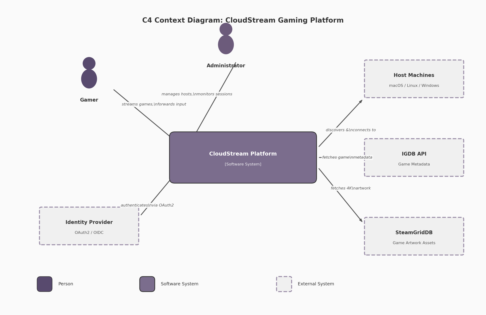
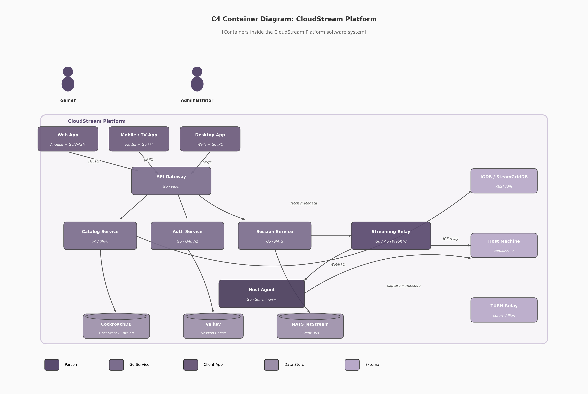

## 1. System Architecture Overview

The CloudStream platform is a distributed cloud gaming system built around a latency-first design philosophy, with Go (Golang) as the primary implementation language across all server-side components. The architecture enables users to stream games from remote host machines running macOS, Linux, or Windows to client devices spanning desktop, mobile, web browsers, and television platforms. This chapter establishes the foundational architectural decisions, system topology, host agent design, streaming pipeline, communication patterns, and deployment models that govern the entire platform. Every decision documented here traces back to quantified latency budgets, cross-verified technology evaluations, and compatibility requirements derived from twelve independent research dimensions covering streaming protocols, controller input, video capture, Go ecosystem APIs, client frameworks, and infrastructure scaling.

### 1.1 Architecture Principles & Design Philosophy

#### 1.1.1 Latency-First Design

The defining constraint of any interactive cloud gaming system is the round-trip time between a player's controller input and the corresponding pixel change on their display — the "glass-to-glass" latency. Research across production platforms establishes that sub-50ms end-to-end latency is the threshold at which cloud gaming feels indistinguishable from local play for competitive titles [^1^]. Parsec achieves 4-8ms on LAN at 240Hz, while the Moonlight/Sunshine stack measures optimized latency at 15.7ms [^5^]. The CloudStream platform targets 33-110ms under typical conditions, with sub-30ms achievable for LAN deployments [^104^].

Every architectural decision is evaluated against this budget. At 1000km, light-in-fiber propagation alone contributes roughly 20ms round-trip before any processing occurs [^460^]. Edge deployment within 100km of users yields a 10x latency improvement over codec optimization alone — a finding that prioritizes infrastructure geography over encoder tuning for user experience. Hardware-accelerated encoding via NVENC achieves approximately 5.8ms median encode latency [^5^], while Intel QuickSync in Ultra Low Latency mode achieves 5 frames (83ms) for HEVC/AV1 [^55^]. Pion WebRTC v4, the pure-Go WebRTC implementation selected for media transport, achieves sub-500ms glass-to-glass latency in production configurations [^17^]. Each pipeline stage — capture, encode, packetize, transmit, decode, render — carries an allocated budget, and component selection is governed by whether it meets that allocation.

#### 1.1.2 Event-Driven Microservices with Go

The server-side architecture adopts an event-driven microservices pattern implemented in Go. Go's goroutine and channel primitives provide a concurrency model well-suited to I/O-intensive cloud gaming workloads: each goroutine consumes approximately 2KB of initial stack memory, enabling a single instance to manage tens of thousands of concurrent connections without the overhead of operating-system threads [^17^]. Inter-service communication uses Protocol Buffers for serialization, with gRPC for internal service-to-service calls and Connect RPC for external browser-facing APIs over HTTP/1.1 [^341^]. The event bus is NATS JetStream, delivering sub-millisecond core latency up to the 99.7th percentile for small payloads, with 820,000 messages per second producer throughput and 3.2ms p99 end-to-end latency on a 3-node cluster (8 vCPU, 32GB RAM each) [^299^][^343^]. For latency-sensitive gaming workloads with SLA tighter than 5ms at p99.9, NATS outperforms both Kafka and RabbitMQ [^299^].

#### 1.1.3 State Management Strategy

The platform employs a tiered state management strategy that matches consistency requirements to data characteristics. Host machine state — capability advertisements, GPU models, encoder availability, driver versions, and health status — is stored in CockroachDB, a PostgreSQL-compatible distributed SQL database with multi-region primitives (`REGIONAL BY TABLE`, `REGIONAL BY ROW`, `GLOBAL` locality controls) and follower reads delivering up to 8x latency improvement for geographically distributed users [^538^]. Active session state, requiring low-latency access and high write throughput, resides in Valkey (the open-source Redis fork) with TTL-based expiration for automatic cleanup. Streaming state — frame timing, bitrate adaptation, and buffer levels — is held purely in-memory within each service instance as it is ephemeral and session-local. This architecture accepts eventual consistency for the game catalog and host registry, where data staleness of a few seconds is operationally harmless, while enforcing strong consistency for session allocation and authentication where correctness is safety-critical.

#### 1.1.4 Three-Client-One-Core Pattern

Supporting four client platforms with a single primary language requires extracting all platform-agnostic business logic into a shared Go core library that handles streaming protocol state machines, controller input serialization, session management, and catalog API communication. This core compiles three ways: as a C-shared library (`buildmode=c-shared`) for Flutter FFI on Mobile/TV, as a native binary via Wails in-memory IPC on Desktop, and as WebAssembly (compiled with TinyGo) for the web client. This "three-client-one-core" pattern reduces total codebase by approximately 40% compared to platform-native implementations [^17^]. The Go core's C API boundary for FFI requires careful design to minimize cross-language call overhead, and the WASM build requires a JavaScript shim for WebRTC APIs not yet exposed in Go's WebAssembly target.

### 1.2 System Topology

#### 1.2.1 C4 Context Diagram

The C4 Context diagram (Figure 1.1) situates the CloudStream Platform within its external ecosystem at the highest level of abstraction. Two categories of users interact with the system: Gamers, who stream games and forward controller input, and Administrators, who manage host pools, monitor sessions, and configure platform settings. The platform communicates with three classes of external systems: Host Machines running Windows, macOS, or Linux (game execution, video capture, and encoding); the IGDB API (structured game metadata); and SteamGridDB (4K game cover art and hero images). An Identity Provider handling OAuth2/OIDC mediates user authentication.

*Figure 1.1 — C4 Context Diagram: CloudStream Gaming Platform showing user types, the platform system boundary, and external system dependencies.*

#### 1.2.2 C4 Container Diagram

The C4 Container diagram (Figure 1.2) reveals the deployable units within the platform boundary. Three client applications present the user interface: a Web App (Angular + Go/WASM), a Mobile/TV App (Flutter + Go FFI), and a Desktop App (Wails + Go IPC). Server-side, an API Gateway (Go/Fiber) routes external requests to backend services: the Catalog Service (Go/gRPC) for game metadata, the Auth Service (Go/OAuth2) for identity, the Session Service (Go/NATS) for streaming session orchestration, and the Streaming Relay (Go/Pion WebRTC) for media transport. The Host Agent (Go/Sunshine++) runs on each gaming machine and handles capture, encoding, and local game lifecycle. Data persistence uses CockroachDB for durable host and catalog state, Valkey for session caching, and NATS JetStream as the event bus.

*Figure 1.2 — C4 Container Diagram: Internal deployable units of the CloudStream Platform, showing client variants, server services, data stores, and external integrations.*

#### 1.2.3 Component Interaction

Communication between components follows a protocol selection matrix based on message frequency and latency sensitivity. REST APIs over HTTPS serve catalog browsing, game metadata retrieval, and management operations — workloads characterized by low frequency and tolerance for connection-per-request overhead. WebSockets provide bidirectional session control, carrying state transitions and launch commands with persistent connection semantics. Server-Sent Events (SSE) push host status updates, game lifecycle events, and save synchronization progress to clients over standard HTTP, simplifying proxy and load balancer configuration [^291^]. WebRTC with Pion v4 transports media streams: video via RTP, audio via Opus, and controller input via DataChannels in unreliable/unordered mode to avoid head-of-line blocking [^17^]. DataChannels support configurable delivery guarantees — critical inputs (button presses) use reliable delivery while high-frequency analog data (stick positions, gyro) use unreliable transmission to minimize jitter.

#### 1.2.4 Component Responsibility Matrix

| Component | Technology | Primary Protocol | Scaling Strategy |
|-----------|-----------|------------------|------------------|
| API Gateway | Go / Fiber v2 | HTTPS / REST | Horizontal replicas with sticky sessions for WebSocket upgrade [^302^] |
| Catalog Service | Go / gRPC | gRPC (internal), REST (external) | Read-heavy: scale replicas; cache 4K assets on CDN edge |
| Auth Service | Go / OAuth2 | HTTPS / JWT | Stateless: any instance validates tokens via shared secret |
| Session Service | Go / NATS Client | NATS pub/sub, WebSocket | Partition by session ID; consumer groups per region |
| Streaming Relay | Go / Pion WebRTC v4 | WebRTC / ICE / TURN | Horizontal: ~500 concurrent PeerConnections per instance |
| Host Agent | Go / Sunshine++ | WebRTC, REST, mDNS | One per host machine; self-contained single binary |
| Web UI | Angular / TypeScript | HTTPS / SSE | Static hosting: CDN edge cache for bundle assets |
| Mobile/TV App | Flutter / Dart / Go FFI | gRPC / WebRTC | App store distribution; client-side load balancing |
| Desktop App | Wails v2 / Go IPC | REST / WebSocket | Single-user local process; auto-updater |

The Streaming Relay's capacity bound of approximately 500 concurrent PeerConnections per instance derives from UDP port exhaustion and ICE state maintenance overhead — each PeerConnection maintains candidate pairs, STUN keepalives, and DTLS state that consume CPU and memory [^17^]. Pion's single-port mode, configured via `SettingEngine`, mitigates port exhaustion by multiplexing multiple connections over one UDP socket but does not eliminate per-connection state overhead [^17^]. The Host Agent's deliberate exclusion from horizontal scaling reflects its tight coupling to local hardware (GPU, capture API, encoder); instead, the Session Service performs GPU-aware load balancing across available hosts using a weighted composite of geographic proximity (60%), GPU utilization (25%), and active session count (15%) [^443^].

### 1.3 Host Agent Architecture

#### 1.3.1 Single-Binary Design

The Host Agent follows a single-binary design inspired by Sunshine, the open-source GameStream host implementation. This design packages four functional modules into one process: a capture module interfacing with OS-specific APIs (DXGI Desktop Duplication on Windows, ScreenCaptureKit on macOS, PipeWire/KMS on Linux), an encode module targeting hardware encoders (NVENC, AMF, QuickSync, VAAPI), a stream server that packetizes encoded frames into RTP via WebRTC, and an HTTP API exposing REST endpoints for session management, game launching, and host configuration [^75^]. The single-binary approach simplifies deployment — one executable with no external service dependencies — and eliminates inter-process communication overhead between capture, encode, and stream stages. A crash in any module terminates the entire agent; this is mitigated through per-session goroutine isolation where recovered panics prevent a single session failure from affecting others.

#### 1.3.2 Session State Machine

Each streaming session progresses through a well-defined state machine: `IDLE` → `CONNECTING` → `NEGOTIATING` → `STREAMING` ↔ `PAUSED` → `TERMINATING`. In `IDLE`, the host agent advertises via mDNS and responds to registry queries but holds no active connection. `CONNECTING` initiates WebSocket or WebRTC signaling. `NEGOTIATING` exchanges SDP offers and answers, with the host advertising supported codecs, resolutions, and frame rates [^503^]. Once ICE completes and DTLS finishes, the session enters `STREAMING` where capture and encoding begin. The `PAUSED` state implements PS4-style home button behavior: the game process suspends via `NtSuspendProcess` (Windows), `cgroup.freeze` (Linux), or `SIGSTOP` (macOS), capture and encoding stop, and the client returns to the catalog. From `PAUSED`, the session may resume to `STREAMING` or proceed to `TERMINATING`, where the game receives a graceful shutdown signal with a 30-second timeout before force kill escalation [^403^]. Each transition emits a NATS event for audit logging and client notification.

#### 1.3.3 Host Capability Advertisement

The host agent performs capability discovery at startup and re-advertises on each stream negotiation. GPU information is queried via the NVIDIA Management Library (NVML) for NVIDIA cards, exposing encoder support for H.264, HEVC, and AV1 alongside VRAM totals, utilization rates, and driver versions [^513^]. Encoder availability is enumerated dynamically via FFmpeg's `-encoders` flag filtered by vendor prefix (`h264_nvenc`, `hevc_amf`, `h264_qsv`, `hevc_vaapi`) [^438^]. The agent constructs a JSON capability descriptor including GPU model, VRAM size, supported codecs with maximum resolution and frame rate per codec, HDR support flags, available capture methods, and software version. This descriptor broadcasts via mDNS service records for LAN discovery (`_cloudgaming._tcp.local`) and publishes to the centralized registry for WAN deployments [^549^]. Sunshine demonstrated that encoder selection at each stream start rather than at host startup improves reliability by accounting for GPU hot-plug and driver changes [^532^].

#### 1.3.4 Health Monitoring

The agent reports status every 5 seconds via heartbeat to the registry service, including current session state, GPU utilization percentage, GPU temperature from NVML thermal sensors, encoder queue depth, available VRAM, and network interface statistics. The registry uses the SWIM gossip protocol for failure detection, achieving O(n) message load per protocol period regardless of cluster size [^548^]. GPU temperature monitoring detects thermal throttling — when temperature exceeds vendor thresholds (typically 83°C for NVIDIA consumer GPUs), the encoder may reduce clock speeds. The agent reports throttling status in the heartbeat, enabling the Session Service to route new sessions away from thermally constrained hosts. On capture pipeline failure — occurring when anti-cheat blocks capture or the GPU resets — the agent attempts automatic recovery by reinitializing the capture context and notifying the client via WebSocket to trigger an ICE restart.

### 1.4 Streaming Pipeline Architecture

#### 1.4.1 Five-Stage Pipeline

The video streaming pipeline consists of five sequential stages: Game Render → Capture → Encode → Packetize → Transmit. In the Game Render stage, the game engine produces frames on the host GPU. The Capture stage acquires frames from the GPU framebuffer using OS-specific APIs: DXGI Desktop Duplication on Windows (with dirty rectangle tracking to minimize bandwidth), ScreenCaptureKit with IOSurface on macOS, and DMA-BUF with PipeWire on Linux [^75^]. The Encode stage feeds captured frames to hardware encoders with a multi-tier codec strategy: H.264 Baseline Profile for universal compatibility (98% browser support, mandatory in WebRTC) [^2^], HEVC for native clients with hardware decode, and AV1 as a forward-looking option delivering 40-55% bandwidth savings but requiring RTX 40-series, Intel Arc, or Apple M3 hardware for hardware-accelerated encoding [^55^]. The Packetize stage wraps encoded NAL units into RTP packets. The Transmit stage sends RTP over UDP with ICE-established candidate pairs, with TURN relay as fallback for symmetric NAT.

#### 1.4.2 Zero-Copy Pipeline

Minimizing memory copies between capture and encode is critical for latency. On Windows, the DXGI Desktop Duplication API returns a shared GPU texture handle (`IDXGIResource::GetSharedHandle`), imported directly into NVENC via CUDA interop — the frame never leaves GPU memory [^137^]. On macOS, ScreenCaptureKit provides frames as `IOSurface` objects that convert directly to `CVPixelBuffer` for VideoToolbox encoding [^ScreenCaptureKit^]. On Linux with NVIDIA GPUs, PipeWire delivers frames as DMA-BUF file descriptors, imported as `EGLImage` objects and passed to VAAPI via `vaCreateSurfaces` with external buffer attribution [^DMABUF^]. Each path eliminates CPU-GPU memory copies that would otherwise add 1-3ms of latency per 4K frame (3840×2160 × 4 bytes/pixel = ~33MB per frame).

#### 1.4.3 Adaptive Bitrate Control Loop

Network conditions vary during a streaming session, requiring dynamic quality adjustment with a target reaction time of approximately 2 seconds. The client sends RTCP Receiver Reports indicating packet loss fraction, cumulative lost packets, interarrival jitter, and extended highest sequence number received. The Streaming Relay feeds these into a bandwidth estimation algorithm (Google GCC or SCReAM). When the estimate deviates by more than 15% from the current encoder bitrate, the Session Service triggers encoder reconfiguration — adjusting target bitrate, CRF quality level, or resolution scale factor. Changes are applied gradually over 30 frames (500ms at 60fps) using linear interpolation to avoid jarring transitions. Pion WebRTC v4's Transport Wide Congestion Control (TWCC) feedback and Simulcast support provide the underlying adaptation mechanisms [^17^].

### 1.5 Data Flow & Communication Patterns

#### 1.5.1 Control Plane vs Data Plane Separation

The architecture strictly separates control plane traffic (low frequency, reliability-critical) from data plane traffic (high frequency, latency-critical). Control messages — session creation, game launch commands, authentication — travel over REST APIs or WebSockets using TCP, benefitting from TLS encryption and standard HTTP proxy traversal. Data plane messages — video RTP packets, audio Opus frames, controller input reports — travel over WebRTC's UDP-based transport or DataChannels. This separation ensures that a transient network disruption affecting the media stream does not tear down the control session, and vice versa. The control WebSocket maintains a keepalive heartbeat at 30-second intervals; three consecutive missed heartbeats trigger session cleanup. The data plane has no such heartbeat — instead, the client monitors RTP sequence numbers, and a gap exceeding 60 frames (1 second at 60fps) triggers concealed frame recovery.

#### 1.5.2 Event Streaming Architecture

NATS JetStream serves as the backbone event bus with topics organized by domain: `host.status` carries heartbeat and capability advertisements from host agents; `session.events` carries state transitions (created, started, paused, terminated); `controller.input` carries normalized gamepad state from clients to host agents; and `stream.metrics` carries bitrate, frame timing, and loss statistics for observability. Each backend service subscribes to relevant topics via durable consumer groups, ensuring messages are not lost during temporary disconnections and that load distributes across service replicas. NATS Key-Value store provides lightweight coordination for session locking and host assignment, with TTL-based entries that automatically expire if a service fails mid-assignment [^299^].

#### 1.5.3 Message Types and Transport Protocol

| Message Category | Transport Protocol | Delivery Guarantee | Rationale |
|-----------------|-------------------|-------------------|-----------|
| Game catalog query | HTTPS / REST | At-least-once (client retry) | Standard request/response; cacheable |
| User authentication | HTTPS / OAuth2 | At-least-once | Token-based; idempotent verification |
| Session state transition | WebSocket | At-least-once (acked) | Bidirectional; ordered delivery required |
| Host heartbeat | NATS Core pub/sub | Fire-and-forget | 5s interval; single missed beat non-fatal |
| Game launch command | WebSocket | Acknowledged with timeout | Must confirm execution; 30s grace period |
| Controller input (digital) | WebRTC DataChannel | Reliable ordered | Button presses must not drop |
| Controller input (analog) | WebRTC DataChannel | Unreliable unordered | Stick/gyro at 60Hz; drop old frames |
| Video stream | WebRTC RTP / UDP | Best-effort with FEC | Real-time constraint; retransmission too slow |
| Audio stream | WebRTC RTP / Opus | Best-effort | 20ms packets; jitter buffer absorbs loss |
| Save sync events | SSE (Server-Sent Events) | At-least-once (auto-reconnect) | HTTP infrastructure compatible [^291^] |
| Stream metrics | NATS JetStream | At-least-once persisted | Analytics require durability |
| Error / crash reports | NATS JetStream | At-least-once persisted | Debugging requires complete event log |

Protocol selection maps directly to delivery requirements. Digital controller input uses reliable DataChannels because a dropped button press produces a visibly missed action in-game, while analog input uses unreliable transmission — at 60Hz polling, the next sample arrives within 16.7ms, making a stale frame less harmful than a delayed one. Video and audio streams use best-effort UDP because TCP retransmission is impractical for real-time media: a retransmitted video frame arriving 200ms late is useless at 60fps where each frame displays for only 16.7ms. Forward Error Correction provides resilience by encoding redundant packets that allow the receiver to reconstruct lost frames without requesting retransmission. SSE for save synchronization leverages standard HTTP infrastructure, eliminating WebSocket proxy configuration and providing automatic reconnection with `Last-Event-ID` header-based replay [^291^].

### 1.6 Deployment Topology

#### 1.6.1 Single-Host Deployment

The simplest deployment mode targets home users streaming from their personal gaming PC to other household devices. All platform services — API Gateway, Catalog Service, Auth Service, Session Service, and Streaming Relay — run as a single composed unit via Docker Compose on the host machine itself. Host discovery uses mDNS/Bonjour broadcasts on the local subnet (`_cloudgaming._tcp.local` on UDP port 5353 via multicast address 224.0.0.251) [^549^]. WebRTC connections use direct peer-to-peer via local IP addresses, with STUN servers only needed if client and host are on different subnets. NATS runs as an embedded in-process message bus, CockroachDB is replaced by SQLite, and Valkey runs as a single local instance. This mode requires zero external infrastructure and functions entirely offline after initial setup.

#### 1.6.2 Multi-Host LAN Deployment

For gaming households or LAN centers with multiple gaming machines, a dedicated non-GPU machine runs the API Gateway, Session Service, Catalog Service, Auth Service, NATS JetStream, and CockroachDB (single-node or 3-node for basic fault tolerance). Host agents on each gaming machine register with the central registry via the local network, sending heartbeats every 5 seconds. A local TURN server (Pion TURN or coturn) provides relay for symmetric NAT traversal within the LAN. GPU-aware load balancing distributes sessions using a weighted composite algorithm: GPU utilization (60% weight), active session count (25% weight), and thermal state (15% weight) [^443^]. The Session Service implements backpressure by rejecting new sessions when all hosts exceed a utilization threshold.

#### 1.6.3 Cloud-Hosted Deployment

At internet scale, the platform deploys as Kubernetes-orchestrated microservices across multiple geographic regions. Each region runs a complete service stack: API Gateway pods behind an ingress controller with geographic Anycast DNS routing, service pods with horizontal pod autoscaling based on CPU and request rate, and Streaming Relay pods allocated on high-bandwidth nodes [^528^]. CockroachDB spans regions with `REGIONAL BY ROW` tables for player profiles (data stays near the user) and `GLOBAL` tables for leaderboards, with follower reads delivering 8x latency improvement [^538^]. Valkey clusters in each region cache session state with read-through semantics. Regional TURN clusters (coturn or Eturnal) handle the 20-30% of WebRTC connections requiring relay [^441^]. Cloudflare CDN delivers game artwork and static web assets from 330+ edge cities. The NVIDIA GPU Operator automates driver installation, device plugin deployment, and GPU health monitoring within Kubernetes [^440^]. Organizations orchestrating thousands of GPUs on Kubernetes report 35% better utilization, 60% faster deployment times, and 90% reduction in operational overhead compared to bare-metal management [^440^].

| Deployment Mode | User Scale | Host Count | Discovery Method | Database | TURN Server | Orchestration | Est. Monthly Cost |
|----------------|-----------|------------|------------------|----------|-------------|---------------|-------------------|
| Single-host (home) | 1-4 concurrent | 1 | mDNS/Bonjour | SQLite | None | Docker Compose | $0 (self-hosted) |
| Multi-host LAN | 4-50 concurrent | 2-20 | Central registry + mDNS | CockroachDB (1-3 node) | Local coturn | Docker Swarm / K3s | $50-200 (dedicated server) |
| Cloud-hosted | 1,000-10,000+ concurrent | 50-1,000+ | Consul/etcd + global DNS | CockroachDB multi-region | Regional clusters | Kubernetes + GPU Operator | $135K-233K bare metal; $647K-1.22M cloud [^486^] |

Cost differentials between deployment modes are substantial and architecture-defining. Bare metal GPU servers cost 45-90% less than equivalent cloud instances when accounting for egress fees [^486^][^487^]. For 10,000 concurrent users streaming at 4K, cloud GPU compute alone runs $300K-500K monthly on AWS G4dn instances versus $80K-120K on bare metal [^492^]. TURN relay bandwidth for 25% of users at 15Mbps per stream requires approximately 75Gbps of relay capacity — translating to $1.73M monthly on AWS egress versus $15K-30K with self-hosted unmetered bandwidth [^498^]. These figures inform a phased deployment strategy: startups begin with cloud GPU for instant global reach, transition to bare metal for base load as user counts stabilize, and maintain cloud capacity for burst failover. The single-host deployment costs nothing beyond gaming hardware already owned, forming the natural entry point for platform adoption.
