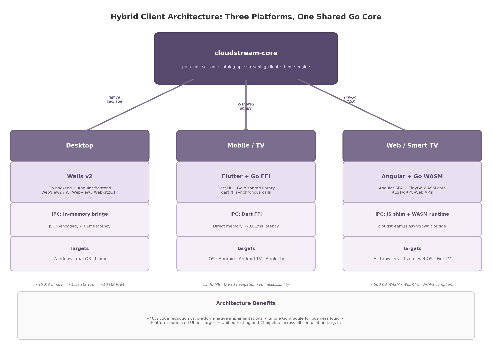

## 2. Go Language Technology Stack Selection

The technology stack selection must satisfy three constraints: Go as the primary language, sub-500ms end-to-end latency, and business logic execution across desktop, mobile, television, and web clients. This chapter evaluates the Go backend ecosystem, defines a hybrid client architecture, specifies the shared Go core library design, and establishes the unified DevOps pipeline.

### 2.1 Go Ecosystem for Backend Services

The backend exposes four communication surfaces: REST APIs for catalog and session management, Server-Sent Events (SSE) for host status, WebSockets for bidirectional control, and WebRTC for streaming and input. Each demands a different Go library; selections here propagate into the client architectures in Section 2.2.

#### 2.1.1 REST Framework Selection: Gin for API Gateway

Three Go web frameworks dominate the landscape for high-throughput API services: Fiber, Gin, and Echo. A synthetic benchmark using wrk with 12 threads, 400 connections over 30 seconds placed Fiber at 89,247 requests per second (req/s) with 4.48ms mean latency, Gin at 76,832 req/s (5.21ms), and Echo at 72,156 req/s (5.54ms) [^290^]. Memory consumption under a 10-minute load test with 1,000 concurrent users showed Fiber at 45 MB peak, Gin at 67 MB, and Echo at 72 MB; Fiber's aggressive memory pooling produced 40% fewer garbage collection cycles [^290^].

However, raw throughput is not the governing criterion for a cloud gaming API gateway. Under database-bound workloads — PostgreSQL queries for game catalog retrieval and session state — all three frameworks converge to approximately 3,000-3,250 req/s with 123-129ms average latency, confirming that the database becomes the bottleneck for I/O-bound applications [^290^]. The more relevant differentiators are ecosystem maturity, middleware availability, and operational familiarity.

| Criterion | Fiber | Gin | Echo |
|---|---|---|---|
| Raw throughput (req/s) | 89,247 [^290^] | 76,832 [^290^] | 72,156 [^290^] |
| Peak memory (1K users) | 45 MB [^290^] | 67 MB [^290^] | 72 MB [^290^] |
| Middleware ecosystem | Moderate | Extensive [^294^] | Rich built-in |
| `net/http` compatibility | No (fasthttp) | Yes | Yes |
| SSE support | Built-in recipe | Via `http.Flusher` | Via `http.Flusher` |
| JSON validation | Manual | `binding` tags | `validator` tags |
| Production maturity | v2.x (2020+) | v1.x (2016+) | v4.x (2015+) |
| **Selection verdict** | High-throughput endpoints | **API Gateway** [^290^] | Middleware-heavy services |

**Gin is selected for the API Gateway.** While Fiber leads in raw throughput, Gin's ecosystem breadth — 80,000+ GitHub stars, extensive middleware catalog, and battle-tested binding/validation pipeline — reduces integration risk for authentication, rate limiting, and request logging. Fiber's fasthttp foundation creates compatibility friction with `net/http` middleware, which is a significant concern given the number of third-party security and observability packages that assume the standard library interface. Echo remains a viable alternative for services that require its built-in middleware chain, but Gin's community size provides a decisive edge for a long-term project. Fiber may be deployed for specific high-throughput endpoints such as leaderboard queries and telemetry ingestion where its memory efficiency provides measurable benefit.

#### 2.1.2 Pion WebRTC v4: Pure-Go Streaming Foundation

WebRTC (Web Real-Time Communication) is the transport protocol for video streaming, audio delivery, and controller input in the cloud gaming system. Pion WebRTC is a pure Go implementation with no CGO (C Go) usage, supporting all target platforms including Windows, macOS, Linux, FreeBSD, iOS, Android, WebAssembly (WASM), and multiple processor architectures (386, amd64, arm, mips, ppc64) [^17^]. The absence of CGO is architecturally significant: it eliminates cross-compilation toolchain dependencies, enables WASM builds for web clients, and removes the runtime linking fragility that plagues CGO-based libraries.

Pion WebRTC v4 implements the complete PeerConnection API including DataChannels (ordered/unordered, reliable/lossy), full ICE with Trickle ICE and restart, TURN relay over UDP/TCP/DTLS/TLS, Simulcast, and SVC support [^17^]. A single-port mode allows multiple PeerConnections to share one UDP port, simplifying firewall configuration [^17^].

Performance benchmarks demonstrate that Pion SCTP with RACK achieves 316.42 Mbps goodput (+34.9%), 27.5% lower p50 latency (11.86ms vs. 16.37ms), and 71.3% better throughput per CPU second [^385^]. Connection setup latency from the server perspective is: signaling ~13ms, SDP processing ~7ms, ICE connection ~123ms, DTLS handshake ~154ms [^376^]. Once established, media and DataChannel latency is sub-millisecond on LAN. DataChannels in unreliable/unordered mode transport binary controller input with no head-of-line blocking, critical for sub-50ms input-to-display targets.

#### 2.1.3 NATS JetStream: Primary Event Bus

The cloud gaming platform requires an event bus that can distribute controller input, game events, session state changes, and host discovery messages at sub-millisecond latency with horizontal scalability. NATS (Neural Autonomic Transport System) with JetStream persistence is selected as the primary event bus over Redis Pub/Sub and RabbitMQ.

NATS Core delivers sub-millisecond latency to the 99.7th percentile [^299^]. JetStream adds at-least-once delivery and replay with 1-5ms p99 latency. On a 3-node cluster (8 vCPU, 32 GB each), JetStream achieves 820,000 msg/s producer and 750,000 msg/s consumer throughput at 3.2ms p99 [^343^]. The Go-native client integrates directly, and NATS supports wildcard fan-out for game state, key-value storage with TTL for sessions, and work queues for leaderboards [^299^].

| Broker | p99 Latency | Throughput | Persistence | Go Client | Ops Complexity |
|---|---|---|---|---|---|
| NATS Core | <1 ms [^299^] | ~1M msg/s | None | Native | Very low |
| NATS JetStream | 1-5 ms [^343^] | ~800K msg/s | Disk + Memory | Native | Low |
| Redis Pub/Sub | <1 ms | ~500K msg/s | Memory only | Native | Very low |
| Apache Kafka | 5-20 ms | ~1M+ msg/s | Disk (unlimited) | Native | High |
| RabbitMQ | 5-20 ms | ~50-100K msg/s | Configurable | Native | Medium |

Redis Pub/Sub remains for WebSocket horizontal scaling and caching. Kafka is reserved for analytics where long-term retention outweighs latency. NATS's operational simplicity — a single binary, Raft clustering, no external dependencies — is decisive for a small team [^299^].

#### 2.1.4 CockroachDB: Distributed SQL with Follower Reads

CockroachDB is selected for transactional data — user accounts, game licenses, session records, tenant configurations — due to its PostgreSQL compatibility and distributed architecture. The native Go `pgx` driver with `pgxpool` provides connection pooling, prepared statement caching, and automatic batching without CGO.

The critical latency feature is follower reads: queries served from the nearest replica rather than the leaseholder provide up to 8x latency improvement for read-heavy workloads like catalog browsing and host discovery. CockroachDB's serializable default isolation eliminates an entire class of consistency bugs in session management without explicit application-level locking.

### 2.2 Cross-Platform Client Development in Go

Supporting Desktop (Windows, macOS, Linux), Mobile/TV (iOS, Android, Android TV, Apple TV), and Web (all browsers including Smart TVs) from a Go codebase requires a hybrid architecture: no single Go-centric UI framework covers all platforms. Research across Fyne, Wails, Gio, Go Mobile, Go WASM, and Flutter+Go FFI confirms a three-client approach with a shared Go core maximizes code reuse.

#### 2.2.1 Framework Capability Matrix

The following matrix evaluates five Go client development approaches across twelve criteria relevant to a cloud gaming system. Each criterion is rated on a three-point scale: Full support (●), Partial or limited support (◐), or No support (○).

| Criterion | Fyne | Wails v2 | Gio | Go Mobile | Go WASM / TinyGo |
|---|---|---|---|---|---|
| Desktop (Win/Mac/Linux) | ● [^37^] | ● [^36^] | ● [^19^] | ◐ | ◐ |
| Mobile (iOS/Android) | ● [^37^] | ○ [^99^] | ● [^19^] | ● [^45^] | ○ |
| Web (browser) | ◐ (WASM) [^37^] | ○ | ● [^19^] | ○ | ● [^38^] |
| Android TV / D-Pad | ○ [^105^] | ○ | ◐ | ◐ | ● (via browser) |
| Apple TV | ○ | ○ | ◐ [^208^] | ◐ | ● (via browser) |
| Screen reader / a11y | ○ [^105^] | ◐ [^96^] | ◐ [^208^] | ◐ | ● (browser native) |
| TV 10-foot UI | ○ | ○ | ○ | ◐ | ● |
| Binary size (desktop) | ~20 MB | ~15 MB [^36^] | ~15 MB | N/A | ~500 KB [^115^] |
| Startup time | <1s | <0.5s [^36^] | <1s | 2-4s | 2-5s (WASM load) |
| Native performance | High | High | High | Moderate | Moderate |
| Ecosystem maturity | Large (27K stars) [^37^] | Growing | Small | Low maintenance [^203^] | Growing |
| Go code reuse | 100% | Backend only | 100% | Library only | 100% |

The matrix reveals a decisive pattern: Fyne, despite being the most popular pure-Go UI toolkit with 27,000 GitHub stars, lacks screen reader support and TV/D-Pad navigation entirely, which disqualifies it for an inclusive gaming platform that must support television use [^105^] [^128^]. Wails v2 is exceptional for desktop but has no mobile or TV support [^99^]. Gio covers all platforms but requires immediate-mode GUI expertise that few developers possess, and its widget ecosystem remains sparse compared to web or Flutter alternatives [^19^]. Go Mobile (`golang.org/x/mobile`) has binding type limitations and maintenance concerns, with known Xcode compatibility issues on newer versions [^203^] [^204^]. TinyGo WASM produces remarkably small binaries (~500 KB) but has limited DOM access and no direct WebRTC or controller API access without JavaScript interop [^115^].

These findings lead to the hybrid architecture shown in Figure 2.1: three client platforms, each using the optimal UI framework for its target, all sharing a single Go core library.

*Figure 2.1: Hybrid client architecture with shared `cloudstream-core` Go module compiled three ways — native package for Wails desktop, c-shared library for Flutter mobile/TV, and TinyGo WASM for Angular web. IPC mechanisms and target platforms are shown per client column.*

#### 2.2.2 Wails v2 for Desktop

Wails v2 builds desktop apps with Go backend and Angular frontend rendered through native webviews: WebView2 (Windows), WKWebView (macOS), WebKit2GTK (Linux) [^36^]. Binaries are ~15 MB with <0.5s startup and ~10 MB idle memory — an order of magnitude smaller than Electron [^36^].

The IPC bridge uses an in-memory, zero-copy, JSON-encoded channel with auto-generated TypeScript bindings from Go structs [^36^]. Latency is sub-0.1ms, negligible versus the ~16ms frame time at 60fps [^40^]. The desktop-only limitation is accepted as a deliberate trade-off; mobile and web clients use their respective frameworks while the Go core prevents business logic duplication.

#### 2.2.3 Flutter + Go FFI for Mobile and TV

Flutter provides the UI layer for iOS, Android, Android TV, and Apple TV with full accessibility — TalkBack, VoiceOver, high contrast, keyboard navigation, and D-Pad focus management for television use [^24^]. Android TV leanback requirements are met through Flutter's focus system.

The Go core compiles as a C shared library (`-buildmode=c-shared`) per target: Android `.so` files and iOS frameworks [^67^]. Dart FFI provides synchronous native calls at ~0.01ms latency with direct memory sharing — approximately 50x faster than Platform Channels (~0.5ms) [^259^]. The `ffigen` tool auto-generates Dart bindings from the C header.

#### 2.2.4 Angular + Go WASM for Web

The web client uses a standard full-stack architecture: Angular Single Page Application (SPA) for the UI, Go business logic compiled to TinyGo WASM for shared functionality, and REST/gRPC-Web APIs for server communication. TinyGo produces WASM binaries of approximately 500 KB — 10-20x smaller than standard Go compiler output (2-3 MB) — by using LLVM-based compilation that includes only referenced code [^115^]. This size reduction is critical for web delivery where every kilobyte affects initial load time.

Go WASM executes at 2-3x the speed of JavaScript for CPU-intensive tasks such as input serialization and protocol state machine transitions [^38^]. However, the WASM runtime has no direct access to browser APIs including WebRTC, WebSockets, or the DOM; a JavaScript shim layer (`cloudstream.js`) bridges these gaps by exposing async/await APIs that call into the Go WASM runtime via `syscall/js`. The web client works on any modern browser including Smart TV browsers (Tizen, webOS, Fire TV Silk), providing the broadest platform coverage of all three client variants.

#### 2.2.5 Client Platform to Framework Mapping

| Client Platform | UI Framework | Go Compilation Target | IPC Mechanism | Key Strength |
|---|---|---|---|---|
| Windows Desktop | Wails v2 + Angular | Native Go package | In-memory bridge (<0.1ms) [^36^] | ~15 MB binary, <0.5s startup |
| macOS Desktop | Wails v2 + Angular | Native Go package | In-memory bridge (<0.1ms) [^40^] | Native WebKit rendering |
| Linux Desktop | Wails v2 + Angular | Native Go package | In-memory bridge (<0.1ms) | WebKit2GTK integration |
| Android Mobile | Flutter | c-shared library (.so) | Dart FFI (~0.01ms) [^259^] | Full TalkBack support |
| iOS Mobile | Flutter | c-shared framework | Dart FFI (~0.01ms) | Full VoiceOver support |
| Android TV | Flutter | c-shared library (.so) | Dart FFI (~0.01ms) | D-Pad focus navigation |
| Apple TV | Flutter | c-shared framework | Dart FFI (~0.01ms) | tvOS native |
| Web browsers | Angular | TinyGo WASM (~500KB) [^115^] | JS shim + WASM runtime | Universal browser coverage |
| Smart TV (Tizen/webOS) | Angular | TinyGo WASM | JS shim + WASM runtime | No app store required |

This mapping covers nine distinct client variants derived from three framework stacks. The Go core library is the unifying element: desktop clients import it as a native module, mobile clients link it as a C shared library, and web clients load it as a WASM module. Each variant adds only UI rendering and platform-specific input capture, while all business logic — protocol handling, session state, catalog API communication, streaming client initialization — executes from the shared core.

### 2.3 Shared Go Core Library Design

The shared Go core, named `cloudstream-core`, is the central architectural component that makes the hybrid client strategy viable. It encapsulates all platform-agnostic business logic and exposes language bindings for each client target.

#### 2.3.1 Module Structure

The `cloudstream-core` module is organized into six packages, each with a single responsibility:

- **`protocol/`** — Moonlight/GameStream protocol serialization and state machine for video frame acknowledgments and input event envelopes.
- **`controller/`** — Gamepad, keyboard, and mouse abstraction with a unified `InputDevice` interface. Serializes controller state into 16-32 byte payloads for DataChannel or UDP transmission.
- **`session/`** — Client-side session lifecycle: host discovery, session creation, WebRTC signaling (SDP/ICE), and teardown.
- **`catalog-api/`** — Typed catalog client with search, image URL resolution, and caching.
- **`streaming-client/`** — Pion-based WebRTC peer management: video track reception, audio coordination, adaptive bitrate, and DataChannel lifecycle.
- **`theme-engine/`** — Design token resolution for white-label theming from JSON configurations.

#### 2.3.2 C API Boundary Design

For Flutter FFI and any future native integrations, the Go core exposes a C-compatible API through a single header file `cloudstream.h`. The API uses opaque pointers for all object types, ensuring that the Go garbage collector retains ownership of memory while C callers interact only through handles.

Twenty functions are exported across four categories: session lifecycle (`cloudstream_session_new`, `cloudstream_session_connect`, `cloudstream_session_close`), input forwarding (`cloudstream_input_send_gamepad`, `cloudstream_input_send_keyboard`, `cloudstream_input_send_mouse`), catalog queries (`cloudstream_catalog_search`, `cloudstream_catalog_get_game`, `cloudstream_catalog_free_result`), and configuration (`cloudstream_set_loglevel`, `cloudstream_set_theme`). All functions use C calling conventions with primitive parameter types to avoid struct layout incompatibility; string returns are heap-allocated in Go with paired free functions to prevent cross-boundary memory leaks.

#### 2.3.3 WASM JS Shim

The web client requires a JavaScript shim (`cloudstream.js`) because TinyGo WASM cannot directly access browser APIs including WebRTC and the DOM. The shim exposes Promise-based APIs that call into the Go runtime via `syscall/js`. For streaming, `cloudstream.js.initStreaming(config)` creates the browser's `RTCPeerConnection`, adds video transceivers, and passes the SDP offer into Go through the JS callback registry. The shim also bridges Gamepad API input into the Go core's serializer, polling at ~60Hz and batching state changes for efficient JS-WASM boundary crossing.

#### 2.3.4 Build Pipeline

The build pipeline supports three compilation targets from a single source tree:

- **`make build-desktop`** — produces a native Go package imported by the Wails backend. Standard `go build` with no special flags; the Wails build system (`wails build`) handles frontend bundling and platform binary generation.
- **`make build-mobile`** — cross-compiles the Go core as c-shared libraries for Android (arm64, armeabi-v7a, x86_64) and iOS (arm64, simulator). Uses `CGO_ENABLED=1` with Android NDK toolchain and Xcode cross-compilers. Output is `libcloudstream.so` for Android and `Cloudstream.xcframework` for iOS.
- **`make build-web`** — compiles the Go core to WASM using TinyGo with `-target wasm` and `-opt=z` for size optimization. Produces `cloudstream.wasm` (~500 KB) alongside the `cloudstream.js` shim.

The CI matrix runs all three targets on every pull request: Ubuntu for desktop and web builds, macOS for iOS cross-compilation, and a Docker container with Android NDK for Android builds. This ensures that changes to the Go core do not break any client's compilation target.

### 2.4 Development Tooling and DevOps

A unified technology stack requires unified tooling. The Go workspace mechanism and a consistent CI/CD pipeline ensure that six interdependent modules evolve together.

#### 2.4.1 Go Workspace

The repository uses a Go workspace (`go.work`) containing six modules: `cloudstream-core` at `/core` (the shared library), `gateway` at `/gateway` (Gin-based API Gateway with REST endpoints, JWT authentication, and rate limiting), `host-agent` at `/host` (the Sunshine++ fork for capture and streaming), `catalog-service` at `/catalog` (CockroachDB-backed game catalog with search and caching), `relay-server` at `/relay` (WebRTC TURN relay and signaling endpoints), and `web-ui` at `/webui` (the Angular SPA consumed by both web and Wails desktop clients). The `go.work` file pins all modules to Go 1.23+ and enables cross-module refactoring with `go work sync`, ensuring that a security patch to `golang.org/x/crypto` propagates to all modules from a single command.

#### 2.4.2 Testing Strategy

Testing operates at four levels. Unit tests use standard `go test` with table-driven patterns and `testify/assert` for readable failure messages. The streaming protocol and input serialization packages target 80%+ code coverage, enforced in CI. Integration tests use `testcontainers-go` to spin up PostgreSQL (CockroachDB-compatible), NATS JetStream, and Redis instances in Docker containers, executing end-to-end API flows without mocks. Load tests use Grafana k6 with WebSocket extensions to simulate 1,000 concurrent sessions, validating that the API Gateway sustains throughput above 3,000 req/s under database load [^290^]. Capture latency validation uses Intel PresentMon to measure the host agent's frame capture-to-encode pipeline, ensuring hardware encoder latency stays within budget.

#### 2.4.3 CI/CD Pipeline

GitHub Actions orchestrates the continuous integration and deployment pipeline. The build matrix spans all target platforms: Windows, macOS, and Linux for desktop; Android and iOS for mobile; and WASM for web. Each platform job compiles the relevant modules, executes unit tests, and produces artifacts. Upon successful completion, Docker images are built for the gateway, catalog-service, and relay-server using multi-stage builds based on `gcr.io/distroless/cc` for minimal attack surface. Helm charts are packaged and pushed to a private OCI registry for deployment to Kubernetes clusters. Mobile library artifacts (.so files and XCFrameworks) are uploaded to a private artifact repository for consumption by the Flutter build pipeline.

The pipeline enforces quality gates: all tests must pass, code coverage must not regress, `go vet` and `staticcheck` must report no issues, and `gofmt` formatting must be clean. Dependency vulnerabilities are scanned with `govulncheck` on every build, blocking deployment if critical CVEs are detected in the module graph.
