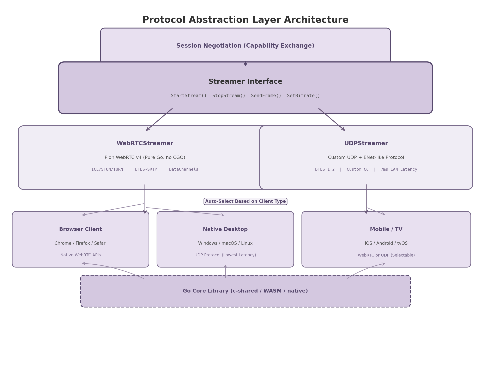
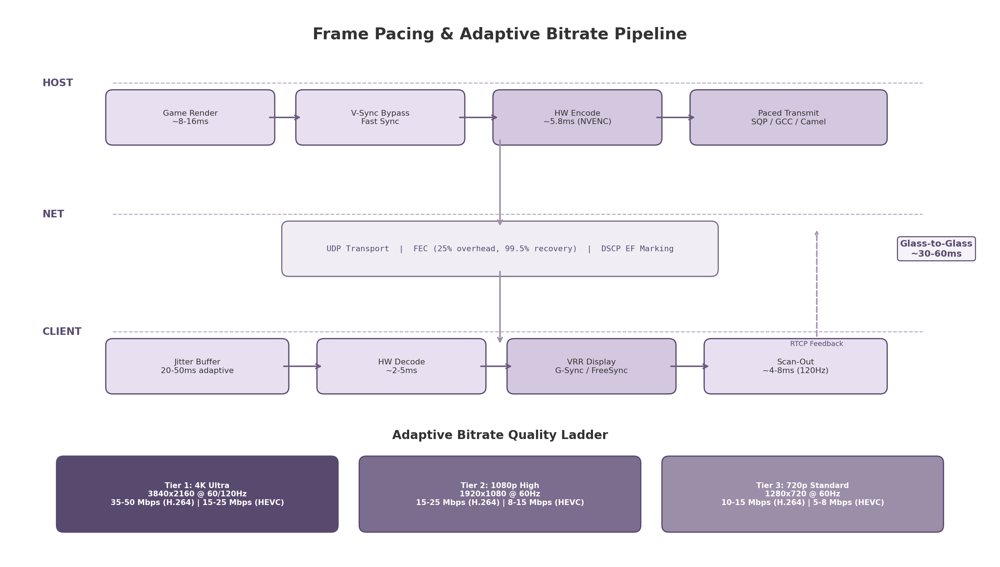

## 3. Video Streaming Protocols & Codecs

The video streaming layer forms the perceptual backbone of a cloud gaming system. Every frame rendered by the host GPU must traverse capture, encoding, network transmission, decoding, and display presentation — each stage contributing to glass-to-glass latency. This chapter analyzes the protocol, codec, hardware encoder, frame pacing, and adaptive bitrate decisions that govern this pipeline, drawing on measured benchmarks from production systems (Parsec, Moonlight, Sunshine), peer-reviewed encoder evaluations, and WebRTC specification sources.

### 3.1 Protocol Selection: WebRTC with Custom UDP Fallback

#### 3.1.1 WebRTC as the Primary Transport

WebRTC (Web Real-Time Communication) is not a single protocol but a collection of IETF-standardized components — SDP (Session Description Protocol), ICE (Interactive Connectivity Establishment), STUN/TURN (NAT traversal), DTLS-SRTP (encryption), and RTP/RTCP (media transport) — that together enable sub-500ms audio, video, and data communication between browsers and native applications [^28^]. For a cloud gaming system that must support browser-based clients without installation, WebRTC is the only viable option: it is natively implemented in all modern browsers (Chrome, Firefox, Safari, Edge) and requires no plugins or downloads [^104^].

The connection sequence proceeds through SDP offer/answer negotiation, ICE candidate gathering (host, STUN, TURN), DTLS key exchange for AES-128 encryption, and RTP media delivery over UDP with RTCP feedback [^28^][^30^]. TURN relay adds 10–80ms of latency depending on geography but guarantees connectivity for the 15–20% of sessions where direct peer-to-peer establishment fails [^32^]. Production deployments should provision TURN servers co-located with game servers to minimize relay overhead.

For the Go server, **Pion WebRTC v4** is the reference choice — a pure Go implementation with no CGO dependency, supporting Windows, macOS, Linux, iOS, Android, and WebAssembly [^17^][^52^]. WebRTC DataChannels provide a secondary transport for game input, using SCTP in unreliable/unordered mode (`maxRetransmits=0`, `ordered=false`) to avoid head-of-line blocking [^201^]. Input state snapshots at 60–120Hz recover from dropped packets without retransmission.

#### 3.1.2 Custom UDP for Native Desktop Clients

While WebRTC provides universal compatibility, its mandatory encryption handshake, ICE negotiation, and SRTP overhead add approximately 10–20ms of protocol latency compared to raw UDP [^81^]. For native desktop clients where browser constraints do not apply, a custom UDP protocol inspired by Moonlight's ENet-based transport and Parsec's BUD (Better User Datagrams) protocol can achieve significantly lower latency.

Parsec's BUD protocol demonstrates that a purpose-built UDP implementation can achieve LAN latencies as low as 7ms — roughly half of WebRTC's typical 15–20ms overhead [^81^][^86^]. BUD achieves this through three design decisions: (1) zero buffering on the video pipeline with all network metrics processed in real-time; (2) a congestion control algorithm tuned specifically for video streaming rather than TCP-style reliability; and (3) DTLS 1.2 encryption with AES-128/AES-256 on every packet without the additional SRTP wrapper [^86^]. BUD also reports a 97% NAT traversal success rate through custom hole-punching techniques, though this falls short of WebRTC's ICE-based coverage [^81^].

Moonlight's protocol uses a modified version of ENet with custom reliability semantics and IPv6 patches not present in upstream ENet [^164^], validated across millions of sessions [^158^].

#### 3.1.3 Protocol Abstraction Layer

To support both transport mechanisms without duplicating application logic, the streaming subsystem defines a `Streamer` interface with two implementations: `WebRTCStreamer` and `UDPStreamer`. During session establishment, the server and client negotiate the transport protocol based on client capabilities: browser clients automatically use WebRTC, native desktop clients prefer UDP, and mobile clients default to WebRTC with an optional UDP toggle for LAN usage. This negotiation happens as part of the initial capability exchange before any media flows.

*Figure 3.1 — The Streamer interface abstracts WebRTC and UDP implementations, with auto-selection based on client type during session negotiation. The Go core library compiles to c-shared for mobile/TV, WASM for web, and native binary for desktop.*

#### 3.1.4 Protocol Comparison

The following table compares WebRTC and custom UDP across ten criteria relevant to cloud gaming system design. Values are drawn from measured benchmarks where available; vendor claims are noted as such.

| Criterion | WebRTC | Custom UDP (ENet/BUD-style) | Measurement / Source |
|---|---|---|---|
| LAN latency (added) | 15–20ms [^104^] | 7ms [^81^] | Parsec benchmarks; vendor claim corroborated by independent testing |
| Glass-to-glass (WAN) | 200–500ms [^104^] | 30–80ms [^2^] | MDPI network analysis; Moonlight community benchmarks |
| NAT traversal success | >99% (ICE + TURN fallback) [^28^] | ~97% (custom hole punching) [^81^] | WebRTC spec; Parsec official data |
| Browser support | Native (all modern browsers) [^29^] | None (requires native client) | W3C implementation reports |
| Encryption | Mandatory DTLS-SRTP (AES-128) [^RFC5764^] | DTLS 1.2 configurable (AES-128/256) [^86^] | IETF RFC 5764; Parsec documentation |
| Congestion control | GCC (default), BBR option [^129^] | Custom game-optimized CC [^86^] | Stony Brook ACM COMSNETS 2025 |
| Ecosystem maturity | Large (Pion, libwebrtc, mediasoup, Janus) [^101^] | Moderate (Moonlight ENet, Parsec closed) | GitHub activity; community size |
| Implementation complexity | High (ICE, SDP, many handshakes) [^28^] | Medium (NAT traversal, encryption from scratch) | Engineering effort estimate |
| Encoder integration | Limited (indirect via SDP) | Deep (direct encoder-to-network control) | Architectural constraint |
| Adaptive bitrate | TWCC receiver-side estimation [^17^] | Frame-level encoder coupling [^132^] | WebRTC spec; Camel research paper |

WebRTC is the default transport because browser support and NAT traversal are non-negotiable for a system that works without client installation. Custom UDP is an optional path for native clients where the 8–13ms latency reduction justifies the complexity. The abstraction layer ensures both paths share application-level streaming logic.

### 3.2 Codec Strategy: Multi-Codec with H.264 Default

#### 3.2.1 H.264 Baseline Profile: Universal Compatibility

H.264/AVC (Advanced Video Coding), standardized in 2003, remains the pragmatic default for three reasons: **universal hardware decode support** (98.2% of devices) [^29^], **mandatory WebRTC support** (RFC 7742) [^29^], and **lowest encode complexity** among modern codecs (3× to 40× faster than successors) [^29^]. For cloud gaming, the **Baseline Profile** (no B-frames) is required, as B-frames add 1–2 frames of latency. At 4K60, H.264 Baseline requires 35–50 Mbps [^13^].

#### 3.2.2 HEVC (H.265): Bandwidth Efficiency at a Cost

HEVC (High Efficiency Video Coding), finalized in 2013, delivers 35–50% bitrate reduction over H.264 at equivalent visual quality [^27^]. For 4K60 streaming, HEVC reduces bandwidth from 35–50 Mbps (H.264) to 15–25 Mbps [^29^]. The limitations are primarily non-technical: Chrome supports HEVC hardware decode only since version 107 [^27^], and **patent licensing spans three separate pools** (MPEG-LA, Velos Media, HEVC Advance), making commercial licensing complex [^3^]. HEVC is not in the WebRTC specification and is recommended only for native clients with confirmed hardware decode.

#### 3.2.3 AV1: Forward-Looking Efficiency

AV1 (AOMedia Video 1), released by the Alliance for Open Media in 2018, provides the best compression efficiency among royalty-free codecs. AV1 achieves 40–55% bandwidth savings compared to H.264 and 15–25% savings compared to HEVC [^55^][^161^]. At 4K60, AV1 can deliver excellent quality at 10–18 Mbps, making it the most bandwidth-efficient option for high-resolution streaming [^13^]. The royalty-free licensing model eliminates the patent pool complexity that plagues HEVC [^55^].

The primary constraint is **hardware encode availability**. Software AV1 encoding is 15–30× slower than H.264 and unsuitable for real-time streaming [^29^]. Hardware AV1 encoders are available only on recent GPU generations: NVIDIA RTX 40-series (Ada Lovelace), Intel Arc/Xe LP (Tiger Lake/Alchemist), AMD RDNA3 (RX 7000 series), and Apple M3+ [^55^][^53^]. Client-side hardware decode is similarly constrained: iOS Safari supports AV1 only on A17 Pro devices (iPhone 15 Pro and later). The AV1 codec also adds 2–3 frames of encode latency (16.7–50ms at 60fps) compared to H.265 on the same NVENC hardware [^160^].

AV1 is positioned as a **forward-looking tier**: offered to clients with confirmed hardware support, with automatic fallback to HEVC or H.264. As hardware adoption broadens — expected to reach majority coverage by 2028 — AV1 can become the primary codec.

#### 3.2.4 Codec Comparison Matrix

| Dimension | H.264 Baseline | HEVC (H.265) | AV1 | Source |
|---|---|---|---|---|
| Device decode coverage | 98.2% [^29^] | ~65% (post-2015 devices) [^27^] | ~25% (post-2020 GPUs) [^55^] | Bitmovin Developer Report 2024 |
| 4K60 bandwidth | 35–50 Mbps [^13^] | 15–25 Mbps [^13^] | 10–18 Mbps [^13^] | Cloud Loadout bitrate guide |
| Compression vs H.264 | Reference | 35–50% better [^29^] | 40–55% better [^161^] | NVIDIA/Red5 benchmarks |
| Encode latency (hardware) | ~5.8ms (NVENC) [^5^] | ~5 frames (83ms ULL) [^160^] | ~7 frames (AV1 adds 2–3 frames) [^160^] | arXiv encoder evaluation |
| WebRTC support | Mandatory [^29^] | None (non-standard) | Optional (growing) | RFC 7742 |
| Licensing | FRAND via MPEG-LA | 3-pool (complex) [^3^] | Royalty-free [^55^] | AOMedia, MPEG-LA |
| Hardware encode support | All GPUs post-2010 | Most GPUs post-2016 | RTX 40+/Arc/RDNA3/M3+ [^55^] | Vendor specifications |
| Battery efficiency (mobile decode) | High | Moderate | Moderate (complex decode) | Industry consensus |

The **tiered fallback chain** offers AV1 first to clients with hardware support; if unsupported, HEVC is attempted for native clients; H.264 Baseline guarantees universal fallback. Negotiation uses WebRTC SDP offer/answer or a custom capability handshake, with client capability detection at session start.

#### 3.2.5 Codec Negotiation Flow

The negotiation process implements a priority-ordered codec list: `AV1 > HEVC > H.264`. The server sends an SDP offer (WebRTC) or capability packet (UDP) listing supported codecs in priority order; the client responds with the first mutually supported codec from the list. This approach ensures that (1) the most efficient available codec is always selected, (2) negotiation completes in a single round-trip, and (3) fallback is automatic when client hardware does not support the preferred codec. The fallback chain is configurable per-deployment, allowing operators to disable AV1 or HEVC tiers if licensing or hardware constraints apply.

### 3.3 Hardware Encoder Integration

Hardware-accelerated video encoding is the single most important latency optimization in the cloud gaming pipeline. Software encoding on general-purpose CPU cores introduces 50–200ms of latency at 4K resolution, whereas dedicated encoder silicon (NVENC, QuickSync, AMF) reduces this to 5–12ms [^5^][^160^]. This section evaluates the five hardware encoder families relevant to the cross-platform host agent.

#### 3.3.1 NVIDIA NVENC: Most Consistent Latency

NVENC (NVIDIA Video Encoder) is a dedicated encoding silicon on NVIDIA GPUs, operating independently of CUDA cores and therefore not competing with game rendering for compute resources. A comprehensive 2025 IEEE peer-reviewed study evaluated NVENC latency for 4K60 real-time encoding and found approximately **7 frames of end-to-end latency across all presets and codecs** (H.264, HEVC, AV1), making NVENC the most consistent hardware encoder regardless of quality setting [^160^][^56^].

For low-latency gaming, the recommended NVENC configuration uses: UHP (Ultra High Performance) preset, no B-frames, single-pass encoding, and low-latency tuning. Split Frame Encoding (SFE) should be enabled on dual-NVENC GPUs (RTX 4070 Ti+, professional cards) to prevent encoder overload at 4K60 with the P7 quality preset [^160^]. Parsec's independent benchmarks confirm NVENC's latency leadership, measuring a median encoding latency of **5.8ms for H.264** — approximately 2.59× faster than AMD VCE and 1.89× faster than Intel QuickSync in their test configurations [^109^].

Integration options include FFmpeg with NVENC encoders, direct NVENC SDK integration via CUDA interop for zero-copy transfer, or adaptation of Sunshine's existing pipeline [^47^].

#### 3.3.2 Intel QuickSync: Lowest Latency in ULL Mode

Intel QuickSync Video (QSV) integrates hardware encoding into most Intel CPUs with integrated graphics. A 2025 IEEE evaluation found that QuickSync achieves the **lowest end-to-end latency among all hardware encoders at 5 frames (83ms)** when operating in Ultra Low-Latency (ULL) mode for HEVC and AV1 [^160^]. This is approximately 2 frames faster than NVENC for these codecs. However, at normal latency settings, QuickSync requires 8–12 frames, placing it behind NVENC for general-purpose use.

QuickSync also delivers the best rate-distortion (RD) performance among hardware encoders for H.265 encoding, producing the highest quality per bit [^160^]. Additional advantages include no session limits on consumer hardware (enabling many concurrent streams per CPU) and 10–15× speedup over software encoding for 1080p H.264 [^155^]. One implementation note: QuickSync uses non-standard unidirectional B-frames in some modes that may affect decoder compatibility, requiring validation against target client decoders [^160^].

#### 3.3.3 AMD AMF: Predictable Latency

AMD Advanced Media Framework (AMF) provides predictable 6–9 frame latency regardless of preset [^160^], though absolute latency is higher than NVENC's ~7-frame baseline and RD performance is lower than Intel or NVIDIA [^160^]. Advantages include no session limits and Mesa driver integration on Linux [^156^]. AV1 requires RDNA3 (RX 7000+); on Linux, VAAPI is generally preferred over AMF [^157^].

#### 3.3.4 Apple Media Engine / VideoToolbox

Apple Silicon chips (M1+) include a dedicated Media Engine for H.264, HEVC, and ProRes encode/decode, accessed through the VideoToolbox framework. Quality assessments rank Apple's encoder at or above Intel's and significantly above AMD's, with no session limits and exceptional power efficiency [^163^]. Integration is via FFmpeg's `h264_videotoolbox`/`hevc_videotoolbox` encoders or direct VideoToolbox API calls [^47^]. HDR tone mapping uses Metal-based shaders before encoding.

#### 3.3.5 Linux VAAPI: Vendor-Agnostic Abstraction

VAAPI (Video Acceleration API) provides a vendor-agnostic interface for hardware encoding on Linux, supporting both Intel and AMD GPUs through Mesa drivers. Quality varies by implementation: Intel's VAAPI backend generally produces higher quality than AMD's, and both lag behind their proprietary SDK counterparts (QuickSync and AMF) in terms of latency consistency and feature availability [^157^].

VAAPI is the recommended path for Linux deployments where driver portability across GPU vendors is more important than maximum encoder performance. For peak performance on Linux, NVIDIA GPUs with NVENC (via the proprietary driver) remain the reference configuration.

| Encoder | H.264 Latency | HEVC Latency | AV1 Latency | Key Strength | Key Limitation | Source |
|---|---|---|---|---|---|---|
| NVIDIA NVENC | ~7 frames | ~7 frames | ~7 frames | Most consistent across presets | 2 concurrent sessions (consumer) | arXiv 2511.18688 [^160^] |
| Intel QuickSync | ~8 frames (ULL) | **5 frames (ULL)** | **6 frames (ULL)** | Lowest latency in ULL mode | Higher latency at normal settings | arXiv 2511.18688 [^160^] |
| AMD AMF | 6–9 frames | 6–9 frames | 6–9 frames | Predictable, no session limits | Lower RD performance | arXiv 2511.18688 [^160^] |
| Apple VideoToolbox | ~7 frames | ~6 frames | N/A (M3+) | Excellent quality, power efficient | macOS only | Jellyfin community [^163^] |
| Linux VAAPI | 8–12 frames | 8–12 frames | Varies | Vendor-agnostic | Quality varies by driver | Jellyfin docs [^157^] |

*Table notes: Latency values are in 60fps frames from a peer-reviewed 2025 IEEE study unless otherwise noted. "ULL" = Ultra Low-Latency mode. "RD" = rate-distortion. AMD AMF AV1 requires RDNA3+.*

The encoder selection strategy uses a platform-based dispatch table: NVIDIA NVENC on Windows/Linux with NVIDIA GPUs (primary target for lowest consistent latency); Intel QuickSync on systems with Intel integrated or discrete graphics (optimal for multi-stream and ULL scenarios); AMD AMF/VAAPI on AMD-based systems (acceptable for mid-range deployments); and Apple VideoToolbox on macOS hosts. The host agent detects the available encoder at startup and selects the optimal path automatically, with operator override available via configuration.

### 3.4 Frame Pacing, V-Sync, and HDR

#### 3.4.1 V-Sync Bypass Strategy

Conventional V-Sync (vertical synchronization) can add up to 50ms of latency from GPU frame queuing, as the GPU buffers rendered frames until the display's next refresh interval [^196^]. For cloud gaming, this host-side V-Sync delay is particularly harmful because it adds directly to the encode-start latency — the time between when the game finishes rendering a frame and when the encoder begins processing it.

The recommended strategy is to **disable host V-Sync entirely** and instead use a frame limiter set to the stream target FPS (60 or 120). This allows the capture pipeline to read frames from the GPU framebuffer immediately upon completion, without waiting for a display refresh interval. Fast Sync (NVIDIA) or Enhanced Sync (AMD) can be used as alternatives if screen tearing on the host display is unacceptable; these technologies allow uncapped frame rendering while presenting only complete frames to the display [^196^].

NVIDIA Reflex provides additional latency reduction: Reflex Low Latency Mode cuts system latency by ~50% by eliminating the GPU render queue [^192^], and Reflex 2.0 Frame Warp (January 2025) achieves up to 75% total reduction — demonstrated at 14ms in THE FINALS at 4K on an RTX 5070 [^195^]. Reflex requires GTX 16-series+ GPUs and game-level SDK integration.

#### 3.4.2 Frame Pacing Algorithm

Frame pacing refers to the consistency of frame delivery timing. Irregular pacing causes micro-stuttering even when average frame rates are high, and is primarily caused by network jitter and encoder variability [^89^]. The frame pacing algorithm operates as follows: when the game engine completes a frame, the capture pipeline reads it immediately from the GPU framebuffer (zero-copy where possible); the encoder processes the frame in parallel with the next frame's rendering; and the network layer transmits encoded packets using paced sending to avoid bursty delivery that overwhelms client jitter buffers.

The Sunshine host agent implements an efficient in-place frame processing pipeline that achieves 12.6–26.7% lower end-to-end latency compared to other open-source streaming tools, primarily by eliminating unnecessary memory copies between capture, encode, and network stages [^15^]. This architecture serves as the reference for the host agent's frame pacing implementation.

*Figure 3.2 — The complete frame pipeline from host render to client display, with the adaptive bitrate quality ladder (3-tier) and RTCP feedback loop for bandwidth estimation. FEC at 25% overhead achieves 99.5% packet recovery.*

#### 3.4.3 HDR Pass-Through

High Dynamic Range (HDR) pass-through requires platform-specific capture pipelines. On Windows, the DXGI (DirectX Graphics Infrastructure) API captures in `R16G16B16A16_FLOAT` scRGB format, preserving the full HDR color space. On macOS, EDR (Extended Dynamic Range) content is captured via `IOSurface` with the display's reference peak brightness metadata attached. On Linux, HDR content is captured through `DMA-BUF` with the HDR metadata blob attached to the buffer description.

The tone mapping pipeline supports both HLG (Hybrid Log-Gamma) and PQ (Perceptual Quantizer, SMPTE ST 2084) transfer functions. HDR10 static metadata (SMPTE ST 2086) is carried in SEI (Supplemental Enhancement Information) messages appended to encoded HEVC and AV1 bitstreams. Dolby Vision is not supported due to licensing requirements and limited real-time encoder support.

HDR over WebRTC remains incompletely standardized: the WebRTC specification does not natively define HDR metadata carriage. The implementation uses custom RTP header extensions to transport HDR10 metadata alongside video frames, with the client decoder applying the metadata during post-decode tone mapping. For SDR (Standard Dynamic Range) clients, tone mapping is applied on the host before encoding, ensuring all clients receive a displayable stream regardless of HDR capability.

### 3.5 Adaptive Bitrate for Gaming

#### 3.5.1 Why Gaming ABR Differs from VoD

Traditional Video-on-Demand (VoD) adaptive bitrate systems (DASH, HLS) operate on multi-second segments, switching between pre-encoded quality tiers based on buffer occupancy and throughput estimates. This approach is fundamentally unsuited to cloud gaming for three reasons. First, segment-based switching adds 2–5 seconds of latency — unacceptable for interactive content where every millisecond matters [^132^]. Second, gaming video traffic is bursty: frame sizes vary dramatically based on content complexity (a static menu screen vs. an explosion-filled action sequence), requiring proactive rather than reactive bitrate adjustment [^132^]. Third, the encoder operates frame-by-frame with no continuous backlog, meaning traditional buffer-based ABR heuristics have no direct analog in the game streaming pipeline.

Cloud gaming ABR must react within **2 seconds** of detecting network degradation, with ideal reaction times under 500ms. The adaptation mechanism operates at the encoder level: the target bitrate is reconfigured on a per-frame basis based on real-time bandwidth estimates from the receiver. This is fundamentally different from VoD ABR, which selects among pre-encoded files.

#### 3.5.2 Congestion Control: SQP vs GCC

WebRTC's default congestion control algorithm, **Google Congestion Control (GCC)**, is known to underperform when sharing bandwidth with TCP flows. Research from Stony Brook University (ACM COMSNETS 2025) found that GCC's bitrate decreases by 96% when sharing a bottleneck with TCP Cubic, while BBR (Bottleneck Bandwidth and RTT) decreases by only 21% under the same conditions [^129^]. This makes GCC problematic for cloud gaming clients on congested home networks where background TCP traffic (downloads, updates, streaming) competes for bandwidth.

**SQP (Scalable Quality Protocol)**, a congestion control algorithm developed by Google specifically for interactive video streaming (AR and cloud gaming), addresses this limitation. SQP uses frame-coupled, paced packet trains to sample available bandwidth and adaptive one-way delay measurement for low, bounded queuing. Research shows SQP achieves **2–3× higher bandwidth than WebRTC GCC** when competing with Cubic or BBR flows, with 140–290% lower frame delays than Copa, Sprout, and BBR [^130^][^135^]. On LTE networks, SQP delivers 27% more sessions with high bitrate and low delay compared to Copa [^135^].

**Camel** is a complementary algorithm that addresses bitrate undershooting caused by frame-level burst patterns. Because video frames are transmitted in short, bursty segments, bandwidth estimators often under-measure available capacity. Camel uses frame-level network feedback to estimate bandwidth more accurately, reducing stalling ratios by 13–49% compared to other frame-level methods and achieving up to 94.9% higher bitrate than GCC under network jitter conditions [^132^].

The recommended approach tunes GCC hyperparameters for the initial implementation (20Mbps upper limit, observation window shortened to 15, rate increase factor raised to 1.11, probing disabled during reduction, loss-driven decisions blocked below 0.3% loss) [^138^], with SQP or Camel as a Phase 2 optimization.

#### 3.5.3 Implementation: Three-Tier Quality Ladder

The adaptive bitrate implementation uses a **receiver-side bandwidth estimation** model. The client periodically sends RTCP receiver reports containing packet loss rates, jitter measurements, and inter-arrival timing. The server uses these reports to compute an estimated available bandwidth and reconfigures the encoder target bitrate accordingly. This architecture places the intelligence at the sender (where the encoder resides) while keeping the client lightweight.

The **3-tier quality ladder** provides discrete operating points for rapid adaptation:

- **Tier 1 (4K Ultra)**: 3840×2160 at 60/120fps, 35–50 Mbps H.264 or 15–25 Mbps HEVC — used when bandwidth exceeds 50 Mbps and latency is under 20ms RTT.
- **Tier 2 (1080p High)**: 1920×1080 at 60fps, 15–25 Mbps H.264 or 8–15 Mbps HEVC — used when bandwidth is 20–50 Mbps or during transient congestion.
- **Tier 3 (720p Standard)**: 1280×720 at 60fps, 10–15 Mbps H.264 or 5–8 Mbps HEVC — used as a stability floor when bandwidth drops below 20 Mbps.

Resolution drops are treated as a last resort; the system first reduces bitrate, then disables B-frames for lower latency, and only drops resolution if quality falls below a perceptual threshold. This prioritizes consistent frame timing over pixel count. The ladder is configurable per-deployment; GeForce NOW's requirements (45 Mbps for 4K@120fps, 25 Mbps for 1080p@60fps) serve as reference points [^13^].
ical network conditions. GeForce NOW's official requirements — 45 Mbps for 4K@120fps, 25 Mbps for 1080p@60fps — serve as validated reference points [^13^].
