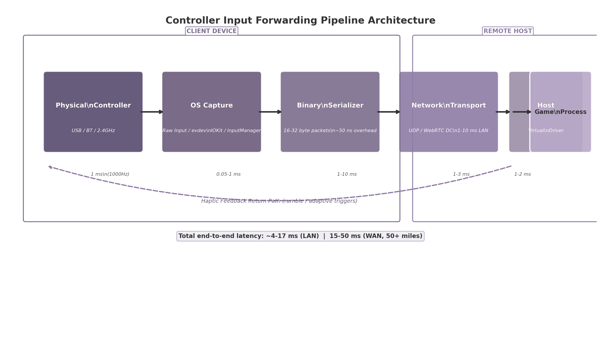
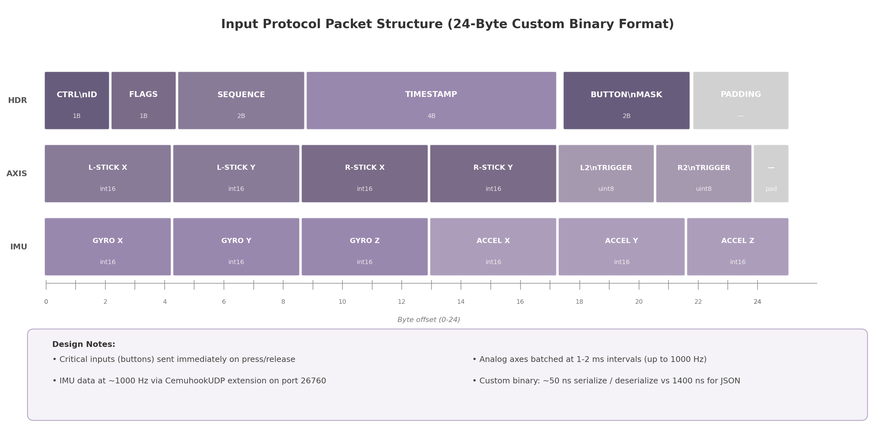

## 4. Controller Input Forwarding System

Cloud gaming shifts the player's physical controller from the host machine to a remote client, creating a pipeline that must transport every button press, analog stick movement, and gyroscopic gesture across a network with imperceptible delay. The forwarding system presented in this chapter decomposes into four sequential stages: input capture on the client device, binary serialization for network efficiency, transport over UDP or WebRTC DataChannels, and host-side injection through virtual device drivers. A fifth concern—advanced controller features such as haptic feedback, adaptive triggers, and gyro aiming—introduces a bidirectional feedback loop that compounds latency constraints. Figure 4.1 illustrates the complete pipeline architecture, and the sections that follow address each stage in the order that input data traverses it.

**Figure 4.1 — Controller input forwarding pipeline.** The path from physical controller to game process spans five stages on two physical devices. Latency figures shown are typical values measured over a local area network; WAN deployments add 10–30 ms of network transit. The dashed line indicates the haptic feedback return path.

### 4.1 Input Capture Architecture

Input capture is the process of reading the electrical signals produced by a physical controller and translating them into a structured representation suitable for serialization. Each client operating system exposes Human Interface Device (HID) data through distinct APIs, necessitating a cross-platform abstraction layer.

#### 4.1.1 Cross-platform HID abstraction

The design introduces a `ControllerDevice` interface that normalizes access across four client platforms. On Windows, the Raw Input API (`GetRawInputDeviceList`, `GetRawInputData`, `HidP_GetUsageValue`) provides low-level access to HID game controllers without the layout restrictions imposed by DirectInput or XInput [^37^]. Event-driven capture registers for `WM_INPUT` messages via `RegisterRawInputDevices`, enabling both standard button data and raw HID report access through `CreateFile()` on the device path—a technique required for DualSense adaptive triggers and gyroscope data that standard APIs do not expose [^78^][^170^]. On Linux, the event device subsystem (evdev) at `/dev/input/eventX` delivers `struct input_event` records, while `/dev/hidraw*` provides unparsed HID reports for proprietary controller features [^27^][^35^]. The `libevdev` wrapper library is recommended over raw evdev access for safer device enumeration and capability querying [^79^]. macOS exposes HID devices through `IOHIDManager` in the IOKit framework, with `CGEventTapCreate` enabling input monitoring at several tap locations including `kCGHIDEventTap` for system-level capture [^173^][^169^]. Android's `InputManager` framework reports gamepad input as `KeyEvent` (digital buttons) and `MotionEvent` (analog axes) through `dispatchKeyEvent()` and `dispatchGenericMotionEvent()` callbacks, with `InputManager.registerInputDeviceListener()` providing hotplug detection [^36^][^30^]. Access to raw HID reports on Android requires root privileges; unprivileged applications must accept the OS-mediated abstraction [^245^].

#### 4.1.2 SDL2 GameController as fallback

The Simple DirectMedia Layer 2 (SDL2) `GameController` API provides a standardized fallback when native HID access is unavailable or impractical. SDL2 maps over 200 distinct controller models to an Xbox-like button layout using a community-maintained mapping database (`gamecontrollerdb.txt`) containing more than 1,500 vendor/product ID entries [^27^][^33^]. For popular controllers, SDL2 defaults to raw HID access via its integrated hidapi backend, enabling gyroscope, touchpad, and adaptive trigger data that OS abstractions typically hide [^27^][^60^]. However, SDL2 imposes meaningful constraints: it is limited to one HID usage page per composite device, which may cause failures with controllers that expose multiple concurrent usage pages [^56^]. Additionally, SDL2 provides no built-in support for network haptic feedback forwarding, and its hidapi backend may conflict with Wayland compositors in certain configurations [^60^]. The environment variable `SDL_JOYSTICK_HIDAPI=0` forces fallback to evdev on Linux when such conflicts arise [^59^].

#### 4.1.3 Bluetooth HID support

Wireless controllers connect through two distinct Bluetooth profiles. The HID over GATT Profile (HOGP) defines how Bluetooth Low Energy (BLE) devices expose HID services using Generic Attribute Profile (GATT) characteristics: `HID Information`, `Report Map` (descriptor), `HID Control Point`, and `Report` [^64^][^50^]. BLE gamepads such as 8BitDo models in BLE mode use HOGP. Classic BR/EDR (Basic Rate/Enhanced Data Rate) HID serves PlayStation 4, PlayStation 5, and Xbox wireless controllers. Pairing is managed entirely by the host operating system; the cloud gaming client enumerates already-paired controllers through standard HID APIs. Practical polling rates differ materially by transport: standard Bluetooth HID (BR/EDR) polls at 125 Hz (8 ms interval), PlayStation controllers over Bluetooth can achieve 250 Hz+ [^96^][^167^], and the latest Bluetooth Low Latency modes (2 Mbps PHY) achieve approximately 1 ms with compatible hardware [^96^].

#### 4.1.4 USB OTG

Direct wired connection via USB On-The-Go (OTG) remains the preferred transport for competitive play. USB gamepads poll at 1,000 Hz (1 ms interval) on modern controllers and host chipsets, compared with 8 ms for standard Bluetooth [^96^]. Android devices with OTG support recognize standard HID gamepads natively, reporting them through `InputManager` with source flags `SOURCE_GAMEPAD` or `SOURCE_JOYSTICK` [^47^]. iOS 14.5 and later support wired DualSense and Xbox controllers via Lightning or USB-C adapters, though some advanced features (haptic feedback, adaptive triggers) require the wired connection even on iOS [^87^]. USB OTG wired connections on mobile achieve 3–6 ms total latency, matching PC wired performance [^96^].

### 4.2 Input Serialization & Network Protocol

Once captured, controller state must be serialized into a compact binary representation and transported across the network with minimal overhead.

#### 4.2.1 Binary protocol design

The custom binary protocol employs 16–32 byte packets containing: a 1-byte controller identifier (supporting up to 4 concurrent local controllers), 1-byte flags field, 2-byte sequence number for deduplication, 4-byte timestamp, 2-byte button mask (16 digital buttons), six analog channels—left stick X/Y (int16), right stick X/Y (int16), L2/R2 triggers (uint8 each)—and optional 6-axis IMU data (gyroscope X/Y/Z and accelerometer X/Y/Z, each int16). Figure 4.2 depicts the 24-byte packet layout.

**Figure 4.2 — 24-byte custom binary packet layout.** The format prioritizes cache-line alignment and single-copy deserialization. All multi-byte fields use little-endian encoding consistent with x86/ARM native byte order.

Benchmark data from the MessagePack-CSharp project quantifies the serialization overhead tradeoffs: custom binary achieves approximately 10–50 ns per operation, MessagePack with integer-key layout achieves 84 ns, Protocol Buffers (protobuf-net) achieves 176 ns, and JSON serialization via Json.Net requires 1,433 ns [^53^]. For a packet that fits within a single cache line, the difference between custom binary and JSON represents a 28.7x speed advantage, translating directly into lower input forwarding latency.

#### 4.2.2 Transport layer selection

The choice of transport protocol depends on the client environment. Native desktop and mobile clients use raw UDP for its minimal 8-byte header and zero connection setup overhead. Moonlight/Sunshine allocate ports 47998–48000 for video, audio, and control streams over UDP [^115^][^120^]. Browser-based clients cannot access raw UDP; they use WebRTC DataChannels operating in unreliable, unordered mode (`maxRetransmits=0`, `ordered=false`) to avoid Head-of-Line (HOL) blocking that would stall input behind retransmitted video frames [^116^][^233^]. WebRTC DataChannels use SCTP over DTLS over UDP, adding approximately 10–20 bytes of framing overhead per packet, but provide built-in NAT traversal through ICE/STUN/TURN that raw UDP lacks.

| Property | UDP (Native) | WebRTC DataChannels | QUIC |
|----------|:---:|:---:|:---:|
| Header overhead | 8 bytes | ~30 bytes (SCTP/DTLS) | Variable |
| NAT traversal | Manual (hole punch) | Built-in (ICE/STUN/TURN) | Requires HTTP/3 proxy |
| Browser support | N/A | Native (all modern) | HTTP/3 only |
| Reliability mode | Application-managed | Configurable per-channel | Built-in streams |
| Connection setup | None | DTLS handshake (~1 RTT) | 0-RTT with prior context |
| Encryption | None (manual) | DTLS (mandatory) | TLS 1.3 |
| Best suited for | Native desktop/mobile | Web clients | Future, not yet practical |

**Table 4.1 — Transport protocol comparison for input forwarding.** UDP provides the lowest overhead for native applications; WebRTC DataChannels offer the only viable path for browser-based clients. QUIC remains transport-layer and would require an application protocol on top for gamepad forwarding [^49^][^51^].

UDP remains the fastest option for native applications, while WebRTC DataChannels trade minimal overhead for universal browser compatibility and automatic NAT traversal. QUIC offers advantages for connection migration but is not yet practical for game input forwarding because it operates at the transport layer and would require a custom application protocol built on top [^51^].

#### 4.2.3 Input batching strategy

Not all input events demand equal urgency. Critical digital inputs—button presses and releases—trigger immediate packet transmission because a 1 ms delay in registering a jump or fire action is perceptible in competitive gameplay. Analog axis updates (stick positions, trigger depth) are batched at 1–2 ms intervals, coalescing multiple small changes into a single packet to amortize network overhead. With wired USB at 1,000 Hz polling, the effective update rate reaches 1,000 packets per second during active analog movement. This hybrid approach—immediate for discrete events, batched for continuous values—balances latency against packet rate.

#### 4.2.4 CemuhookUDP protocol for motion data

Gyroscope and accelerometer data from controllers such as the DualSense and DualShock 4 require a specialized forwarding path. The CemuhookUDP protocol, which operates on port 26760 (the de facto standard, though 26730 is also documented), defines a 100-byte binary packet with magic header `DSUS` (client-to-server) or `DSUC` (server-to-client) containing accelerometer XYZ values, gyroscope pitch/yaw/roll, touch data, and button states [^194^][^196^]. The protocol originated with the Cemu Wii U emulator for motion control emulation and has since been adopted by DS4Windows, BetterJoy, Dolphin, and Yuzu. The implementation in this architecture treats CemuhookUDP as a parallel stream to the primary input protocol: basic button and axis data flows through the optimized 24-byte format described in Section 4.2.1, while IMU data streams through CemuhookUDP-compatible packets at approximately 1,000 Hz on USB-connected DualSense controllers [^130^]. The DualSense uses a Bosch BMI055 Custom IMU polling at this rate; DualShock 4 achieves approximately 250 Hz over Bluetooth [^130^].

### 4.3 Host-Side Input Injection

When serialized input packets arrive at the remote host, they must be translated back into operating system input events that the target game process can consume. This requires virtual input device drivers that present as physical hardware to the operating system.

#### 4.3.1 Windows: ViGEmBus and SendInput

Windows provides `SendInput`, a standard Win32 API for synthesizing keyboard and mouse events [^83^]. `SendInput` inserts `INPUT` structures serially into the keyboard or mouse input stream, but it cannot create virtual gamepads—an architectural limitation that prevents cloud gaming systems from presenting a controller to games expecting XInput or DirectInput. The ViGEmBus (Virtual Gamepad Emulation Bus) kernel-mode driver fills this gap by emulating well-known USB game controllers, including Xbox 360 and DualShock 4 variants, that appear to the operating system as physical hardware [^128^]. Applications write target report packets to the ViGEmBus virtual device, which the OS routes to games through standard XInput or DirectInput APIs. ViGEmBus has been retired as of 2023; its successor drivers from Nefarius continue the project [^121^][^128^]. HidHide, a companion tool, hides the physical controller from the system to prevent duplicate input when both physical and virtual controllers are present [^166^].

#### 4.3.2 Linux: uinput

Linux provides the most streamlined injection path of any major desktop operating system. The `uinput` kernel module enables userspace processes to create virtual input devices by opening `/dev/uinput`, configuring capabilities with `UI_SET_EVBIT`/`UI_SET_KEYBIT`/`UI_SET_ABSBIT`, creating the device with `UI_DEV_CREATE`, and then emitting `struct input_event` records [^79^][^75^]. No external drivers or kernel modifications are required. The `libevdev` wrapper library provides a safer API for device creation and event injection [^79^]. Sunshine's `inputtino` library builds on uinput to create virtual DualShock 4, Xbox 360, Switch Pro, and Xbox One controllers on Linux, even randomizing MAC addresses for PlayStation 5-style controller emulation [^242^]. Access to `/dev/uinput` requires membership in the `uinput` group or appropriate udev rules [^76^].

#### 4.3.3 macOS: foohid and CGEventPost

macOS splits injection between two subsystems. For keyboard and mouse, `CGEventPost(kCGHIDEventTap, event)` places synthesized events at the HID system entry point, before window server processing [^168^][^172^]. For gamepad injection, macOS lacks a native virtual device API. The `foohid` kernel extension (kext) fills this gap by exposing `CREATE`, `DESTROY`, `SEND`, and `LIST` methods via `IOConnectCallScalarMethod`, allowing userspace programs to define virtual HID devices with custom report descriptors [^132^]. However, `foohid` requires disabling System Integrity Protection (SIP) on modern macOS versions, a significant deployment barrier. Furthermore, `CGEventPost` does not inject equally into all applications—games that read raw HID through IOKit directly may not detect injected events [^173^].

#### 4.3.4 Per-OS injection methods comparison

Table 4.2 consolidates the host-side injection capabilities across the three target desktop operating systems, including setup requirements and known limitations.

| Platform | KB/M Injection | Gamepad Injection | Setup Requirements | Key Limitations |
|----------|:---:|:---:|:---|:---|
| Windows | `SendInput` (Win32 API) | ViGEmBus kernel driver (successor to ScpVBus) | Driver installation; HidHide for duplicate prevention | ViGEmBus retired in 2023; successor drivers under active development; UIPI restricts cross-integrity injection |
| Linux | `evdev` write / `XTest` | `uinput` kernel module (native) | `uinput` group membership or udev rules | None significant; best-in-class support |
| macOS | `CGEventPost(kCGHIDEventTap)` | `foohid` kernel extension (IOKit driver) | SIP must be disabled for kext loading | No native virtual gamepad API; kext deprecated by Apple; some games bypass injected events via direct IOKit |

**Table 4.2 — Per-OS input injection methods with capabilities, limitations, and setup requirements.** Linux offers the most straightforward path with native kernel support. Windows requires third-party drivers that are currently in transition. macOS presents the most significant barrier due to Apple's deprecation of kernel extensions and the absence of a native virtual gamepad API [^128^][^79^][^132^][^83^][^168^].

### 4.4 Advanced Controller Features

Modern controllers expose capabilities beyond buttons and analog sticks that significantly affect the subjective experience of play. Rumble feedback, adaptive trigger resistance, gyro aiming, and touchpad input each require specialized forwarding logic.

#### 4.4.1 Rumble and haptic forwarding

The DualSense and Xbox Series controllers implement rumble through distinct mechanisms. XInput provides `XINPUT_VIBRATION` with two motors—a low-frequency left motor and a high-frequency right motor—each accepting 16-bit intensity values from 0 to 65,535 [^229^][^231^]. The `XInputSetState` function applies vibration by controller index (0–3) [^232^]. The DualSense uses dual linear resonant actuators rather than traditional eccentric rotating mass motors, requiring audio-waveform-like data sent through custom HID output reports (USB Report ID `0x02`, 47 bytes) [^77^][^78^]. A critical limitation: DualSense haptic audio is supported only over USB on PC; Bluetooth connections do not carry haptic audio data [^87^][^80^]. The forwarding architecture implements a reverse feedback loop: when the game requests rumble, the host streaming software captures the request, serializes it, and transmits it to the client over the same transport (UDP or WebRTC DataChannel) used for input. The client applies the vibration via `applyGamepadFeedback()` using the Web Gamepad API's `vibrationActuator` in browser environments, or direct HID output reports in native clients [^116^]. For a 30 ms network round-trip time (RTT), rumble events arrive at the client approximately 15 ms after the game action that triggered them. This delay is acceptable for general rumble effects but degrades the precision of timing-sensitive haptic feedback.

#### 4.4.2 DualSense adaptive triggers

Adaptive triggers on the DualSense controller provide variable resistance on L2 and R2, enabling effects such as feedback (resistive load), weapon (fire and reload cycle), vibration (trigger oscillation), and calibration modes [^77^]. These effects require raw HID output reports containing start and end position parameters, strength values, and effect type identifiers. On PC, adaptive triggers function exclusively over USB; the Bluetooth protocol does not expose the output report interface needed for trigger control [^87^]. The architecture implements a custom protocol extension that piggybacks adaptive trigger commands on the existing feedback return path. Each trigger command packet is 8 bytes: 2 bytes for trigger selection (L2/R2), 1 byte for effect type, 4 bytes for parameters, and 1 byte for flags.

#### 4.4.3 Gyro aiming

Gyroscope-based aiming has become a transformative input method for first-person shooter games, particularly on PlayStation and Nintendo Switch platforms. The DualSense's Bosch BMI055 IMU polls at approximately 1,000 Hz over USB, delivering angular velocity data that can be fused with accelerometer readings using complementary or Kalman filters to produce drift-corrected orientation [^130^][^136^]. The `GamepadMotionHelpers` library provides reference implementations of these sensor fusion algorithms [^136^][^131^]. In the forwarding architecture, gyro data maps to either virtual mouse deltas (for games without native controller support) or right-stick offset values (for games with analog camera control). The CemuhookUDP protocol (Section 4.2.4) serves as the transport for gyro and accelerometer data at 1,000 Hz. Gyro aiming benefits disproportionately from the 1 ms USB polling rate because every millisecond of reduced input latency improves tracking accuracy during fast flicks.

#### 4.4.4 Touchpad and gyro mouse emulation

The DualSense touchpad supports absolute position reporting (1920x1080 resolution), dual-finger gestures, and click detection. The forwarding architecture maps touchpad input to virtual mouse movement on the host through two modes: absolute positioning (direct 1:1 screen coordinate mapping) and relative mode (touch delta converted to mouse delta with configurable sensitivity and dead zones). Steam Input and reWASD provide reference implementations of this mapping, supporting analog (stick/mouse emulation), digital (D-pad-like), and trackball modes with configurable friction [^99^]. Gyro mouse emulation converts IMU angular velocity to mouse deltas and can be combined with flick-stick—a technique where the right stick snaps to coarse angles while gyro handles fine aiming adjustments [^130^]. For the Web Gamepad API, gyro support remains limited: DualSense gyro is natively available on Chrome and Edge via Bluetooth only on macOS and Linux as of early 2025; Windows clients require Steam Input or DS4Windows to bridge gyro data [^128^].

### 4.5 Input Latency Optimization

Input latency is the cumulative sum of delays introduced at every stage of the forwarding pipeline. This section quantifies the latency budget and describes techniques to reduce perceived latency independent of network conditions.

#### 4.5.1 End-to-end input pipeline latency

The total end-to-end latency aggregates five sequential components: controller polling (0.5–1.0 ms at 1,000 Hz USB), OS capture and serialization (0.05–1.0 ms), network transit (1–10 ms on LAN, 10–30 ms on WAN at 50 miles), host deserialization and injection (1–3 ms via kernel drivers), and game process frame consumption (1–2 ms until the input affects the next frame boundary). Summing the best-case LAN values yields approximately 4 ms; the typical LAN case falls between 8–17 ms. WAN deployments at 50 miles add 10–30 ms of network transit, producing totals of 15–50 ms.

Steam Remote Play, Parsec, and Moonlight/Sunshine demonstrate that sub-frame input forwarding at 60 fps (16.67 ms frame budget) is practical using binary serialization over UDP or WebRTC with host-side virtual controller drivers. Parsec achieves 4–8 ms at 240 Hz on LAN [^1^]; Moonlight reports a median of 15.7 ms end-to-end [^5^]; Sunshine demonstrates 12.6–26.7% lower latency than comparable alternatives depending on capture settings.

#### 4.5.2 Client-side prediction

Client-side prediction masks network latency by applying input locally before receiving host confirmation. In the context of cloud gaming, the client immediately moves the menu cursor or fires a weapon (with local visual feedback) while simultaneously forwarding the input to the host. The host processes the input and returns the authoritative game state; the client reconciles any discrepancy between predicted and actual state, smoothing corrections to avoid jarring visual jumps [^117^]. Local echo—showing immediate visual feedback for button presses during menu navigation—proves particularly effective because menu interactions are highly latency-sensitive: a 50 ms delay between button press and cursor movement feels sluggish to users [^106^]. However, prediction carries a fundamental limitation: it works well for menu navigation and character movement but cannot fully mask latency for actions requiring frame-precise timing, such as fighting game combos or rhythm game note hitting. Over-reliance on prediction causes visible jitter when server corrections are frequent, degrading the experience more than the original latency would have [^117^]. Machine learning approaches such as CLAAP can predict network latency with less than 5 ms error, enabling adaptive buffering that detects "concept drift" in 13 ms and adapts in 2 ms [^103^].

#### 4.5.3 Input latency budget breakdown

Table 4.3 itemizes the latency budget per pipeline stage, including measurement methodology and optimization targets. The values represent empirical measurements from reference implementations (Sunshine/Moonlight/Parsec) on wired USB connections at 1,000 Hz polling.

| Pipeline Stage | Typical Latency | Best Case | Optimization Target | Measurement Method |
|:---|:---:|:---:|:---|:---|
| Controller polling (wired 1000 Hz) | 1.0 ms | 0.5 ms | Use USB OTG or 2.4 GHz dongle; avoid Bluetooth | USB packet capture via `usbmon` or Logic Analyzer |
| OS capture + serialization | 0.1–1.0 ms | 0.05 ms | Custom binary format; bypass SDL2 when possible | Instrumented timestamp deltas in capture thread |
| Network transit (LAN, <10 km) | 1–5 ms | 0.1 ms (localhost) | Edge deployment within 500 km; QoS marking (DSCP EF) | ICMP ping + application-layer RTT (`SO_TIMESTAMPING`) |
| Network transit (WAN, 50 miles) | 10–30 ms | N/A | Multi-PoP edge nodes; dedicated fiber paths | Traceroute with timestamp option |
| Host deserialization + injection | 1–3 ms | 0.5 ms | Kernel-mode drivers (ViGEmBus, uinput) | Ring-buffer timestamp comparison |
| Game frame consumption | 1–2 ms | 0 ms (frame-aligned) | Align injection with frame boundary via present hooks | Frame time instrumentation |
| **Total end-to-end (LAN)** | **4–17 ms** | **~2 ms** | **< 8 ms competitive target** | **End-to-end button-to-photon via photodiode** |
| **Total end-to-end (WAN)** | **15–50 ms** | **N/A** | **< 30 ms casual target** | **Same; dominated by network transit** |

**Table 4.3 — Input latency budget breakdown per pipeline stage with optimization targets and measurement methodology.** Best-case values assume wired 1,000 Hz controllers, custom binary serialization, localhost or LAN networking, and kernel-mode virtual drivers. WAN values assume 50 miles of fiber distance at approximately 5 μs per kilometer of routing overhead [^100^][^103^][^105^].

The controller input forwarding system described in this chapter achieves its design objective—sub-frame latency on LAN—through three core architectural decisions: raw HID capture at the maximum polling rate supported by the controller, a custom binary protocol sized to fit within a single cache line, and kernel-mode virtual drivers that bypass userspace indirection on the host. The transport layer selects UDP for native clients and WebRTC DataChannels for browsers, with input batching that sends critical digital events immediately while coalescing analog updates at 1–2 ms intervals. Advanced features including rumble, adaptive triggers, and gyro aiming operate through protocol extensions that share the same transport but require careful attention to the asymmetric latency of the feedback path: while input reaches the host in single-digit milliseconds, haptic feedback returning to the client incurs half the round-trip delay, making precise haptic synchronization challenging on WAN links. Table 4.3 establishes the quantitative baseline against which system performance should be measured and optimized.
