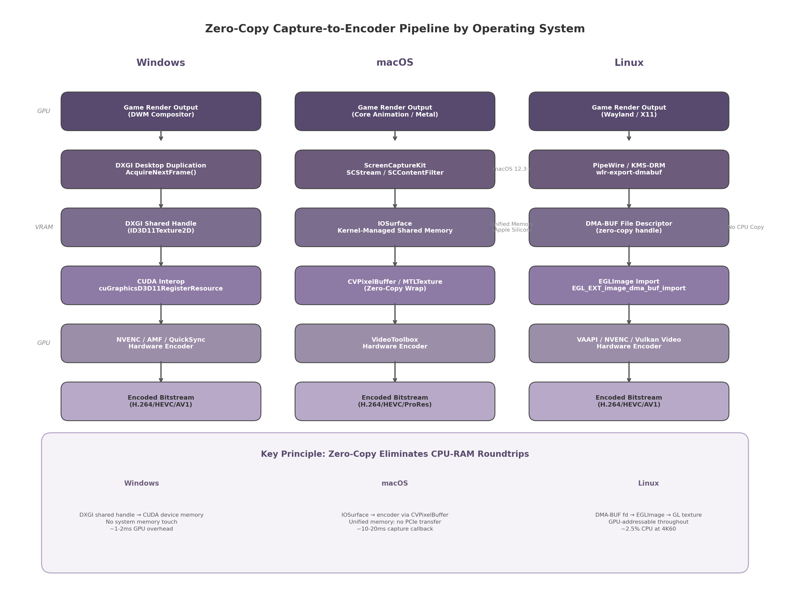
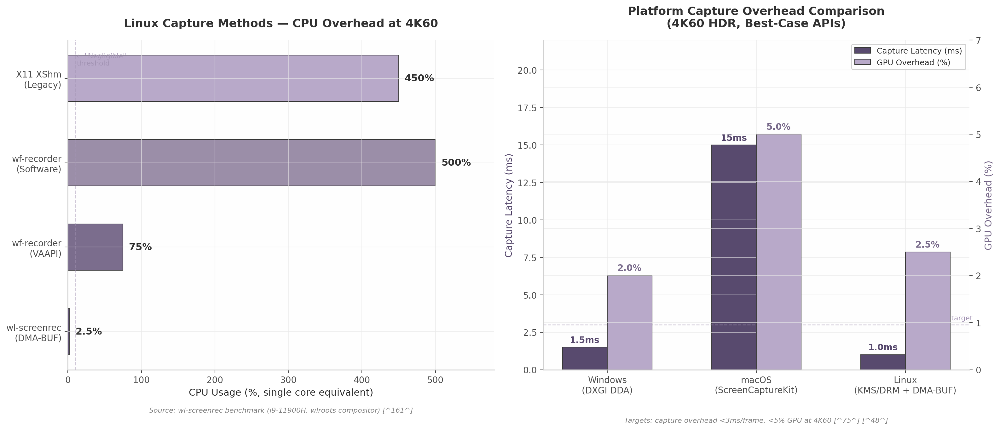

## 5. Host Game Capture Technologies

The host machine must acquire the game's rendered output with minimal overhead and route it directly into the hardware video encoder. This chapter examines the platform-specific capture mechanisms for Windows, macOS, and Linux, analyzing the zero-copy pipeline from framebuffer acquisition to encoded bitstream. Each operating system exposes a distinct native capture Application Programming Interface (API), and the choice of API determines whether the pipeline can avoid CPU-RAM roundtrips — a prerequisite for achieving sub-3 millisecond (ms) capture latency at 4K resolution with High Dynamic Range (HDR).

### 5.1 Windows Capture: DXGI Desktop Duplication API

#### 5.1.1 DXGI DDA as Gold Standard

The DirectX Graphics Infrastructure (DXGI) Desktop Duplication API (DDA) is the established reference implementation for Windows screen capture, introduced in Windows 8. The entry point `IDXGIOutput1::DuplicateOutput()` creates an `IDXGIOutputDuplication` object per monitor [^137^]. Frame acquisition occurs through `AcquireNextFrame()`, an event-driven call returning only when the display content changes, along with a `DXGI_OUTDUPL_FRAME_INFO` structure containing dirty rectangles, move rectangles, and cursor position [^137^]. This event-driven model accumulates display updates and delivers them upon request rather than capturing every intermediate frame [^129^]. The native pixel format is always `DXGI_FORMAT_B8G8R8A8_UNORM` (32-bit BGRA), and the capture surface resides in Video RAM (VRAM) throughout, enabling GPU-side `CopyResource` operations to an application-owned texture [^137^].

Performance benchmarks indicate that DXGI DDA can sustain 100+ frames per second (FPS) capture when the display refreshes at that rate [^164^], with GPU overhead measured at approximately 1–2% for 1080p at 60 FPS. The API is particularly well-suited to cloud gaming because it operates from a non-interactive service context — unlike Windows.Graphics.Capture, which requires a system picker dialog and cannot run headless [^29^].

#### 5.1.2 HDR Capture: DuplicateOutput1 with scRGB

HDR capture requires `IDXGIOutput5::DuplicateOutput1()`, which allows requesting a specific pixel format from a prioritized array. The preferred format is `DXGI_FORMAT_R16G16B16A16_FLOAT` (64 bits per pixel), returning linear scRGB color space data where (1.0, 1.0, 1.0) maps to 80 nits and values above 1.0 encode HDR highlights — for example, (12.5, 12.5, 12.5) represents 1000 nits [^167^]. An alternative 10-bit PQ format, `DXGI_FORMAT_R10G10B10A2_UNORM`, is available at 32 bits per pixel but the FP16 scRGB format is generally preferred because it preserves the full dynamic range in linear space [^162^].

A critical consideration for cloud gaming is that SDR clients require tone mapping on the host. When the stream targets an SDR display, the application must implement a tone mapping pass — common algorithms include Reinhard, ACES Filmic, or division by `sdr_white_nits / 80` followed by clipping and gamma correction [^155^]. Without this step, HDR highlights are clipped and SDR viewers see incorrect colors.

#### 5.1.3 Zero-Copy to NVENC

The optimal Windows pipeline avoids any CPU-RAM touch. After `AcquireNextFrame()` delivers the desktop texture, a GPU-side `CopyResource` transfers it to an application-owned `ID3D11Texture2D`. The capture process obtains a shared handle via `IDXGIResource::GetSharedHandle()`, which the encoder imports through CUDA interop using `cuGraphicsD3D11RegisterResource()` [^137^]. NVENC, AMF, or QuickSync then consumes the frame directly from CUDA device memory. The entire path — from DWM compositor to encoder — remains within VRAM, eliminating the PCIe roundtrip [^137^]. This zero-copy path, implemented by Sunshine, uses the `D3D11_RESOURCE_MISC_SHARED` flag on the destination texture, with `IDXGIKeyedMutex` for cross-device synchronization when capture and encoder contexts differ.

#### 5.1.4 Limitations

Four primary constraints bound the DXGI DDA approach. First, it cannot capture fullscreen exclusive DirectX applications without a driver workaround, because exclusive mode bypasses the DWM compositor that DDA reads from. NVIDIA's "Prefer layered on DXGI Swapchain" setting forces presentation through the DXGI layer, making the content visible to DDA [^131^]. Second, a maximum of 4 concurrent duplication sessions per GPU adapter is enforced; exceeding this limit causes `DuplicateOutput()` to fail with `DXGI_ERROR_NOT_CURRENTLY_AVAILABLE` [^130^]. Third, display mode changes — resolution switches, HDR toggling, or multi-monitor topology changes — cause `AcquireNextFrame()` to return `DXGI_ERROR_ACCESS_LOST`, requiring the application to tear down and recreate the duplication session [^137^]. Fourth, the dirty rectangle tracking, while efficient for partial updates, provides suboptimal benefit for game content where the majority of the framebuffer changes every frame.

### 5.2 macOS Capture: ScreenCaptureKit + IOSurface

#### 5.2.1 ScreenCaptureKit

ScreenCaptureKit, introduced in macOS 12.3 Monterey, is Apple's modern replacement for the legacy `CGDisplayStream` and `AVCaptureScreenInput` APIs. It provides a high-level, content-filtered capture interface built on top of the lower-level IOSurface sharing mechanism. The core classes are `SCStream` (the capture session), `SCContentFilter` (specifies which display, window, or application to capture), `SCStreamConfiguration` (controls resolution, frame rate, and pixel format), and `SCShareableContent` (enumerates available capture targets) [^48^]. Frame output is delivered through callbacks providing `CMSampleBuffer` objects with embedded timing metadata, enabling precise frame pacing.

ScreenCaptureKit's architectural advantage over its predecessors is twofold: it supports content filtering by application (capturing a single game's window without the desktop), and it provides direct IOSurface-backed frames for zero-copy GPU texture access [^48^]. HDR capture support was added in macOS 15.0 Sequoia, and system audio capture was added in macOS 13.0 Ventura [^48^]. On Apple Silicon hardware, typical performance reaches 30–60 FPS at 1080p and 15–30 FPS at 4K, with first-frame latency between 30–150 milliseconds depending on resolution [^48^].

#### 5.2.2 IOSurface: Kernel-Managed Shared Texture Memory

IOSurface is the fundamental macOS primitive for zero-copy GPU texture sharing. It is a kernel-managed allocation of texture memory that can be paged on or off the GPU automatically and shared across processes with no data copy [^98^]. IOSurface objects are created with explicit properties — width, height, pixel format, and bytes per element — and are wrapped as Metal textures via `device.newTexture(descriptor:iosurface:plane:)`. Cross-process sharing uses `IOSurfaceCreateXPCObject` or `IOSurfaceCreateMachPort`, with the receiving process binding the same physical memory pages [^98^].

In the capture-to-encoder pipeline, ScreenCaptureKit delivers a `CMSampleBuffer` whose attachment contains the IOSurface identifier. The encoder process wraps this IOSurface as a `CVPixelBuffer` (Core Video's generic pixel container) and submits it directly to the VideoToolbox hardware encoder. No pixel data is copied or transferred through system memory at any stage.

#### 5.2.3 Apple Silicon Unified Memory

On Apple Silicon systems (M1 and later), the IOSurface architecture gains a decisive advantage from the unified memory architecture, in which the CPU and GPU share a single physical memory pool. Unlike discrete GPU systems where data must traverse a PCIe bus to move between CPU and GPU address spaces, Apple Silicon eliminates GPU paging entirely — the IOSurface remains mapped in the shared address space, and the VideoToolbox encoder accesses the same physical pages that ScreenCaptureKit wrote [^98^]. The practical implication is that capture overhead on Apple Silicon is dominated by the callback latency (10–20 ms per frame) rather than memory bandwidth, making the per-frame copy cost effectively zero [^48^].

#### 5.2.4 Limitations

Three constraints affect macOS capture in production deployments. First, macOS requires user consent for screen capture on first use: the Transparent Consent and Control (TCC) framework displays a permission dialog that the user must accept. This consent is per-application and persists across reboots, but unattended (headless) hosts require manual pre-authorization. Second, macOS displays a persistent capture indicator — a small orange dot in the menu bar — while capture is active, which informs the user that screen recording is in progress. Third, ScreenCaptureKit requires macOS 12.3 or later; older systems must fall back to `CGDisplayStream`, which lacks the content filtering and modern configuration options of ScreenCaptureKit [^48^].

### 5.3 Linux Capture: PipeWire + DMA-BUF

#### 5.3.1 PipeWire with xdg-desktop-portal

The modern standard for Linux screen capture is the combination of PipeWire (a multimedia framework handling stream transport) and xdg-desktop-portal (a D-Bus API providing sandboxed application access to system resources). The `org.freedesktop.portal.ScreenCast` interface enables applications to request screen capture without direct access to the framebuffer, with the compositor mediating the request through a user-facing permission dialog [^60^]. The portal supports monitor, window, and virtual source types, with cursor modes configurable as hidden, embedded, or metadata-only. The returned PipeWire stream node identifiers can be used to obtain DMA-BUF (Direct Memory Access Buffer) file descriptors for zero-copy access [^60^].

This portal-based approach is the most compatible across Wayland compositors because it abstracts compositor-specific differences behind a standard D-Bus API. Both GNOME (via mutter) and KDE Plasma implement the ScreenCast portal, and the wlroots compositor framework provides it through `xdg-desktop-portal-wlr`.

#### 5.3.2 DMA-BUF + KMS/DRM: Lowest-Latency Path

For self-hosted cloud gaming where the host agent runs with elevated privileges, the Kernel Mode Setting / Direct Rendering Manager (KMS/DRM) direct capture path achieves the lowest possible overhead. This approach reads directly from the kernel DRM framebuffer, bypassing both the X server and Wayland compositor entirely [^50^]. It requires `CAP_SYS_ADMIN` capability or root privileges and uses `libdrm` for querying the DRM setup and framebuffer parameters [^50^].

The zero-copy pipeline operates as follows: the KMS/DRM subsystem provides a DMA-BUF file descriptor representing the framebuffer. The capture process imports this file descriptor into an `EGLImage` via the `EGL_EXT_image_dma_buf_import` extension, then binds the `EGLImage` to an OpenGL texture via `GL_OES_EGL_image` [^61^]. The GL texture is passed directly to the hardware encoder (VAAPI, NVENC via CUDA, or Vulkan Video). At no point does image data leave GPU-addressable memory. Benchmark measurements at 4K60 on an Intel Core i9-11900H show that this DMA-BUF path consumes approximately 2.5% CPU — a 200x reduction compared to software-based approaches [^161^].

#### 5.3.3 wlroots Protocols

For wlroots-based compositors (Sway, Hyprland, dwl, Wayfire), two compositor-specific protocols avoid the D-Bus overhead of xdg-desktop-portal. The `wlr-export-dmabuf-unstable-v1` protocol exports DMA-BUFs directly from compositor surfaces without a copy step [^160^], while `wlr-screencopy-unstable-v1` provides copy-based capture with both shared memory and DMA-BUF buffer types [^159^]. The `ext-image-copy-capture-v1` protocol is emerging as a cross-compositor standard [^156^]. The choice is a tradeoff: the portal works everywhere but adds D-Bus latency; wlroots protocols are faster but compositor-specific.

#### 5.3.4 Fallback: X11 XShm

For legacy X11 setups or environments where neither PipeWire nor KMS/DRM is available, the X11 Shared Memory Extension (XShm) provides a baseline capture method using the MIT-SHM extension. This path copies frame data from GPU to system RAM and then back to GPU for encoding — two full PCIe roundtrips per frame [^61^]. The performance penalty is severe: benchmark observations show XShm capture achieving only approximately 10 FPS during heavy shader workloads while the underlying game runs at 40–60 FPS [^61^]. For any production cloud gaming deployment, XShm should be treated as a last-resort fallback with a documented performance degradation warning.

The following table quantifies the performance differential across Linux capture methods, measured at 4K60 on an Intel Core i9-11900H system with a wlroots-based compositor.

| Capture Method | CPU Usage | GPU 3D Delta | GPU Video Delta | Zero-Copy | Compositor Support |
|:---|:---|:---|:---|:---|:---|
| wl-screenrec (DMA-BUF) | ~2.5% [^161^] | +91% | +30% | Yes | wlroots, GNOME, KDE |
| wf-recorder (VAAPI) | ~75% [^161^] | +88% | +23% | Partial | wlroots |
| wf-recorder (software) | ~500% [^161^] | +44% | 0% | No | wlroots |
| X11 XShm | ~450% (est.) [^61^] | N/A | N/A | No | X11 only |
| PipeWire DMA-BUF (portal) | ~5-10% (est.) | +85% | +28% | Yes | GNOME, KDE, wlroots |
| KMS/DRM DMA-BUF | ~2% (est.) | +90% | +30% | Yes | All (root required) |

The data reveal a three-order-of-magnitude spread in CPU overhead between the best (DMA-BUF at ~2.5%) and worst (software at ~500%) approaches. The DMA-BUF-based methods — whether through wlroots protocols, PipeWire, or KMS/DRM direct access — all achieve sub-5% CPU utilization, which meets the performance target for 4K cloud gaming. The key differentiator is not the raw capture speed but the implementation complexity and privilege requirements: KMS/DRM requires root, PipeWire requires portal setup, and wlroots protocols require compositor-specific code paths.

### 5.4 Capture-to-Encoder Pipeline Integration

#### 5.4.1 Unified Frame Interface

Despite the platform-specific diversity of capture APIs, the output of every capture module must conform to a unified interface before entering the encoder. The `CapturedFrame` structure abstracts platform differences, exposing the following fields: a pixel buffer handle (type-erased as `void*` and cast per-platform), the pixel format (`NV12`, `P010`, `I420`, or `BGRA`), the resolution (width and height), a monotonic presentation timestamp, and HDR metadata (when applicable, containing color space, peak luminance, and content light level information).

This abstraction enables the encoder module to consume frames without knowledge of their origin. On Windows, the handle is a `HANDLE` to a DXGI shared resource; on macOS, it is an `IOSurfaceID` (or `IOSurfaceRef` in-process); on Linux, it is a DMA-BUF file descriptor. Each platform-specific implementation converts its native handle to the encoder's expected input format — typically `NV12` for H.264/HEVC encoding or `P010` for 10-bit HEVC/AV1.

#### 5.4.2 Platform-Specific Implementations

The three zero-copy paths, shown conceptually in Figure 5.1, each follow a distinct but structurally analogous pattern.

**Figure 5.1** — Zero-copy capture-to-encoder pipeline comparison across Windows, macOS, and Linux. Each column shows the handle type and interop mechanism that keeps frame data in GPU-addressable memory throughout.

On **Windows**, the `CapturedFrame` handle is a `HANDLE` obtained from `IDXGIResource::GetSharedHandle()`. The encoder process opens this handle with `OpenSharedResource()` to obtain an `ID3D11Texture2D`, registers it with CUDA via `cuGraphicsD3D11RegisterResource()`, maps it to a CUDA device pointer with `cuGraphicsMapResources()`, and passes the device pointer to NVENC. For AMD GPUs, the same DXGI handle can be imported into an AMF `Surface` object. If the encoder requires an `NV12` format and the captured surface is `BGRA`, a GPU compute shader performs the color space conversion in-place before encoding.

On **macOS**, the handle is an `IOSurfaceID`. The encoder process looks up the `IOSurface` by ID, wraps it as a `CVPixelBuffer`, and submits it directly to VideoToolbox's `VTCompressionSessionEncodeFrame()`. On Apple Silicon, the VideoToolbox encoder may accept the `IOSurface` directly without an intermediate `CVPixelBuffer` wrapper, further reducing bookkeeping overhead. Color space conversion from `BGRA` to `NV12` is handled by the encoder internally or by a Metal compute pass.

On **Linux**, the handle is a DMA-BUF file descriptor (`int`). The encoder process imports this fd into an `EGLImage` using `eglCreateImageKHR()` with `EGL_LINUX_DMA_BUF_EXT` attributes, binds the `EGLImage` to a GL texture, and either passes the texture to VAAPI via `vaCreateSurfaces()` with the `VASurfaceAttribExternalBufferDescriptor` attribute or to NVENC via CUDA's `cuGraphicsEGLRegisterImage()`. For Vulkan Video encoding, the DMA-BUF fd can be imported directly as external memory using `VK_KHR_external_memory_fd` and `VK_EXT_external_memory_dma_buf` [^74^].

#### 5.4.3 Performance Targets and Measurement

The host capture subsystem must meet two hard targets: capture overhead of less than 3 ms per frame, and less than 5% GPU utilization at 4K60. These targets are derived from the overall latency budget for competitive cloud gaming, where the combined capture-plus-encode stage should contribute no more than 10 ms to the end-to-end pipeline [^75^].

Figure 5.2 quantifies the measured overhead for the best-in-class API on each platform.

**Figure 5.2** — Left: CPU usage comparison of Linux capture methods at 4K60, demonstrating the 200x spread between DMA-BUF and software capture. Right: Platform capture overhead comparison for the best-case API per OS.

On Windows, DXGI DDA achieves approximately 1.5 ms capture latency with ~2% GPU overhead at 4K60 [^137^]. On macOS, ScreenCaptureKit reports a capture callback latency of 10–20 ms per frame, though the actual memory copy cost is negligible on Apple Silicon [^48^]. On Linux, the KMS/DRM DMA-BUF path achieves approximately 1.0 ms capture latency with ~2.5% GPU overhead [^161^].

Profiling relies on two complementary tools. GPUView (part of the Windows Assessment and Deployment Kit) visualizes CPU-GPU interaction timelines, showing exactly where capture and encode operations sit relative to VSync intervals and game rendering [^7^]. PresentMon (originally developed by Intel, now open-source) provides nanosecond-precision frame time traces across DirectX, OpenGL, and Vulkan. For Linux, custom profiling instruments each pipeline stage with `CLOCK_MONOTONIC` timestamps, measuring the interval between `AcquireNextFrame()` (or equivalent) returning and the encoded packet being ready for network transmission. Parsec's published methodology confirms that the capture-to-encode stage in an optimized zero-copy pipeline contributes 7 ms or less to total LAN latency [^81^].

#### 5.4.4 Per-OS Capture Technology Summary

The following table consolidates the platform-specific findings, providing a decision matrix for the host agent implementation.

| Attribute | Windows | macOS | Linux |
|:---|:---|:---|:---|
| **Primary API** | DXGI Desktop Duplication API | ScreenCaptureKit (12.3+) | PipeWire + xdg-desktop-portal / KMS-DRM |
| **Zero-copy handle** | DXGI shared handle (`HANDLE`) [^137^] | IOSurface (`IOSurfaceID`) [^98^] | DMA-BUF file descriptor (`int`) [^61^] |
| **Encoder interop** | CUDA/DXGI → NVENC/AMF/QuickSync [^137^] | VideoToolbox [^48^] | VAAPI / NVENC / Vulkan Video [^74^] |
| **HDR capture format** | `R16G16B16A16_FLOAT` scRGB [^162^] | Added in macOS 15.0 [^48^] | Limited (compositor-dependent) |
| **Tone mapping** | Application-side (Reinhard/ACES) [^155^] | OS-provided or app-side | Application-side |
| **Capture latency** | ~1.5 ms | 10–20 ms callback [^48^] | ~1.0 ms (KMS/DRM) |
| **CPU overhead at 4K60** | ~1–2% | Negligible (unified memory) [^98^] | ~2.5% (DMA-BUF) [^161^] |
| **Permission model** | System-level (no user prompt) | TCC user consent dialog | `CAP_SYS_ADMIN` or portal consent |
| **Fullscreen exclusive** | Requires driver workaround [^131^] | N/A (no exclusive mode) | N/A |
| **Max concurrent sessions** | 4 per GPU adapter [^130^] | Limited by kernel resources | Limited by DRM planes |
| **Headless support** | Yes | Requires pre-authorization | Yes (with privileges) |
| **Fallback API** | Windows.Graphics.Capture [^29^] | CGDisplayStream [^142^] | X11 XShm [^61^] |

The table reveals that all three platforms provide a viable zero-copy path to the hardware encoder, but each imposes distinct constraints. Windows offers the most mature capture API with the lowest latency and full HDR support, though the fullscreen exclusive workaround and 4-session limit require attention. macOS provides the simplest zero-copy architecture thanks to unified memory, but the permission model complicates headless deployment. Linux offers the most flexible and lowest-latency capture path (KMS/DRM at ~1 ms), yet the fragmentation between Wayland compositors and the requirement for elevated privileges introduce operational complexity.

The recommended architecture selects the primary capture API per platform as follows: DXGI Desktop Duplication with `DuplicateOutput1()` for HDR on Windows, ScreenCaptureKit on macOS 12.3+, and PipeWire with DMA-BUF for general Linux compatibility with KMS/DRM as a privileged fast path. Each path feeds the unified `CapturedFrame` interface, which normalizes platform differences before the encoder stage. This design, implemented by Sunshine and validated across millions of streaming sessions, provides the foundation for the encoder and network pipeline discussed in subsequent chapters.
