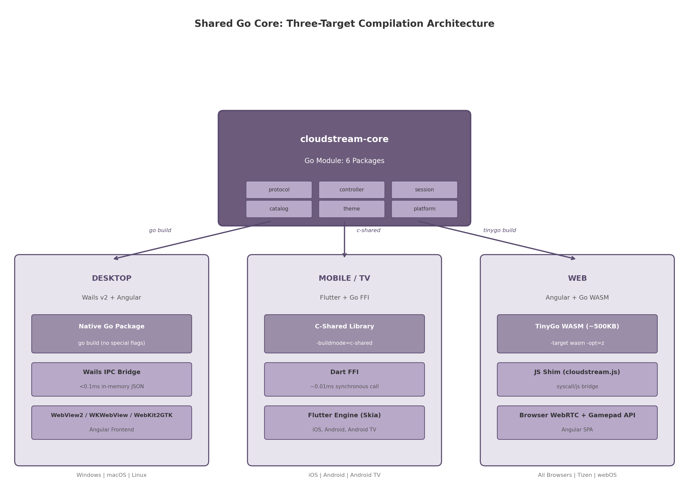
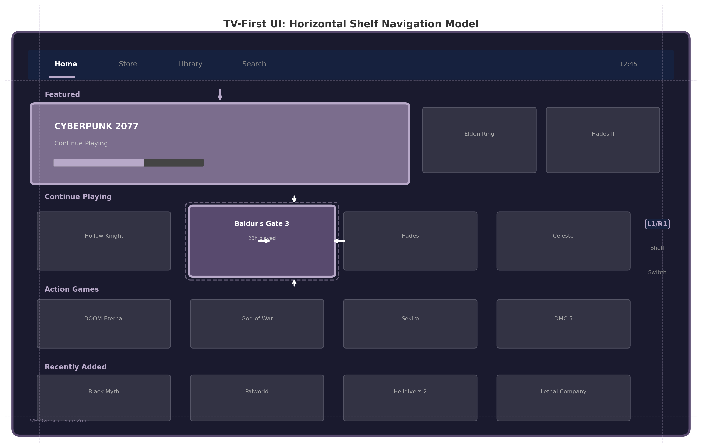

## 6. Client Application Architecture

The preceding chapters established the server-side architecture, Go technology stack, controller protocol, and video capture pipeline. This chapter addresses the fourth surface of the system: the client applications that users interact with across desktop, mobile, television, and web platforms. The central design constraint is to maximize Go code reuse while selecting the optimal UI framework for each platform's input model, accessibility requirements, and deployment context. The resulting architecture follows a "three-client-one-core" pattern: a shared Go library named `cloudstream-core` compiles to three different targets — native package for Wails desktop, C-shared library for Flutter mobile/TV, and TinyGo WebAssembly (WASM) for Angular web [^36^] [^259^] [^115^].

### 6.1 Shared Go Core Library

The `cloudstream-core` module is the architectural keystone that makes the hybrid client strategy viable. It encapsulates all platform-agnostic business logic — streaming protocol negotiation, input device abstraction, session lifecycle management, catalog API communication, design token resolution, and OS-specific feature abstraction — behind language bindings tailored to each client target. By concentrating business logic in a single Go module, the architecture eliminates the duplication that would otherwise occur across four distinct client codebases, reducing total code volume by an estimated 40% versus platform-native implementations.

#### 6.1.1 Module Design

The module is organized into six packages, each with a single, well-defined responsibility. Table 6.1 enumerates the packages, their exported types, and the platform targets that consume them.

| Package | Primary Responsibility | Key Exported Types | Consumed By |
|---|---|---|---|
| `protocol` | Moonlight/GameStream protocol serialization, frame acknowledgment, input event envelope encoding | `Packet`, `FrameACK`, `InputEnvelope` | All targets |
| `controller` | Input device abstraction: gamepad, keyboard, mouse; unified `InputDevice` interface | `InputDevice`, `GamepadState`, `InputSerializer` | All targets |
| `session` | Client-side session state machine: discovery, creation, WebRTC signaling (SDP/ICE), teardown | `Session`, `SessionState`, `SignalingClient` | All targets |
| `catalog` | Typed catalog API client with search, image URL resolution, local caching, and offline support | `CatalogClient`, `Game`, `SearchResult` | All targets |
| `theme` | Design token engine for white-label theming: JSON configuration parsing, token resolution, dark/light mode | `ThemeEngine`, `DesignToken`, `ThemeConfig` | All targets |
| `platform` | OS abstraction layer: file storage, notifications, gamepad enumeration, deep linking | `Platform` (interface), `Storage`, `Notifier` | Native targets only |

The `protocol` package handles SDP offer generation, ICE candidate processing, and the binary framing protocol for input events. The `controller` package defines a unified `InputDevice` interface that abstracts HID controllers behind a 16-32 byte payload serializer (see Chapter 4). The `session` package manages the client-side lifecycle through a finite state machine with states `Disconnected` through `Terminated`, enforcing valid transitions and automatic cleanup.

The `catalog` package provides a typed REST client with embedded SQLite caching and image URL resolution that selects thumbnail, 1080p, or 4K based on device capability. The `theme` package resolves design tokens from JSON for white-label customization of colors, typography, and spacing (see Chapter 2). The `platform` package defines a `Platform` interface with OS-specific implementations for storage, notifications, gamepad enumeration, and deep linking; it is excluded from the WASM build since browsers provide equivalent APIs.

#### 6.1.2 C API for Flutter FFI

For Flutter integration on mobile and TV platforms, `cloudstream-core` compiles as a C shared library using Go's `-buildmode=c-shared` flag. The C Application Programming Interface (API) follows a handle-based design: all object types are exposed as opaque pointers (`void*`), ensuring that the Go garbage collector retains sole memory ownership while C callers interact only through handles passed to exported functions. This pattern prevents cross-boundary memory leaks and eliminates struct layout incompatibility risks.

Twenty functions are exported across four functional categories, summarized in Table 6.1a. Session lifecycle functions manage WebRTC session creation through configuration JSON and handle teardown. Input forwarding functions accept binary payload pointers for gamepad, keyboard, and mouse events. Catalog query functions return heap-allocated JSON strings with paired `CS_FreeString` for deallocation. Configuration functions control logging, theming, and version reporting.

| Category | Function | Parameters | Return |
|---|---|---|---|
| Session | `CS_CreateSession` | `const char* configJSON` | `CS_Handle` |
| Session | `CS_Connect` | `CS_Handle session` | `int` (status) |
| Session | `CS_Disconnect` | `CS_Handle session` | `int` (status) |
| Session | `CS_DestroySession` | `CS_Handle session` | `void` |
| Session | `CS_GetSessionState` | `CS_Handle session` | `const char* stateJSON` |
| Input | `CS_SendGamepadState` | `CS_Handle session, const uint8_t* state, size_t len` | `int` |
| Input | `CS_SendKeyboardEvent` | `CS_Handle session, int keycode, bool pressed` | `int` |
| Input | `CS_SendMouseEvent` | `CS_Handle session, int x, int y, int buttons` | `int` |
| Input | `CS_SetVibration` | `CS_Handle session, float left, float right` | `int` |
| Input | `CS_GetConnectedGamepads` | `CS_Handle session` | `const char* gamepadsJSON` |
| Catalog | `CS_CatalogSearch` | `CS_Handle session, const char* query` | `const char* resultsJSON` |
| Catalog | `CS_CatalogGetGame` | `CS_Handle session, const char* gameID` | `const char* gameJSON` |
| Catalog | `CS_CatalogGetCover` | `CS_Handle session, const char* gameID, int resolution` | `const char* url` |
| Catalog | `CS_CatalogGetScreenshots` | `CS_Handle session, const char* gameID` | `const char* urlsJSON` |
| Catalog | `CS_FreeString` | `const char* str` | `void` |
| Theme | `CS_SetTheme` | `CS_Handle session, const char* themeJSON` | `int` |
| Theme | `CS_GetTheme` | `CS_Handle session` | `const char* themeJSON` |
| Config | `CS_SetLogLevel` | `int level` | `void` |
| Config | `CS_GetVersion` | `void` | `const char* version` |
| Config | `CS_GetLastError` | `void` | `const char* message` |

All string returns use heap-allocated C strings freed through paired `CS_FreeString`, preventing cross-boundary memory leaks. Functions return `int` status codes (0 for success, negative for errors) with `CS_GetLastError` retrieving the message. This design prioritizes binary stability over ergonomics, since `ffigen` auto-generates idiomatic Dart bindings from the C header.

#### 6.1.3 WASM Exports for Web

The web client compiles `cloudstream-core` to WASM using TinyGo with `-target wasm` and `-opt=z` flags, producing a module of approximately 500 KB — 10-20x smaller than standard Go compiler output (2-3 MB) [^115^]. TinyGo's LLVM-based compilation includes only referenced code, which is critical for web delivery where each kilobyte affects initial load time. Go WASM executes at 2-3x the speed of JavaScript for CPU-intensive tasks such as input serialization and protocol state machine transitions [^38^].

The `js/wasm` package exposes functions mapped to JavaScript via `syscall/js`: `StartSession` returns a Promise resolving on WebRTC connection; `ProcessInput` accepts a `Uint8Array` of controller state for DataChannel transmission. Because TinyGo WASM cannot access browser WebRTC or DOM APIs, the JavaScript shim (`cloudstream.js`) bridges these gaps, polling Gamepad API input at 60 Hz and forwarding it to the Go core.

#### 6.1.4 Platform Abstraction Layer

The `platform` package defines a `Platform` interface that abstracts OS-specific capabilities behind a common API. Table 6.1b enumerates the interface methods and their implementations per target operating system.

| Interface Method | Windows | macOS | Linux | Android/iOS | Web |
|---|---|---|---|---|---|
| `AppDataDir()` | `%APPDATA%` [SHGetKnownFolderPath] | `~/Library/Application Support` | `$XDG_DATA_HOME` | `getFilesDir()` / `NSDocumentDirectory` | `localStorage` / IndexedDB |
| `ShowNotification(title, body)` | WinRT Toast | `NSUserNotification` | D-Bus `org.freedesktop.Notifications` | Flutter callback to platform channel | `Notification` API |
| `EnumerateGamepads()` | XInput + DirectInput | Game Controller framework | `evdev` ( `/dev/input/event*`) | Flutter `gamepads` package | `navigator.getGamepads()` |
| `RegisterDeepLink(protocol)` | Registry URL protocol | `CFBundleURLTypes` | `.desktop` MIME handler | Intent filter / `CFBundleURLTypes` | `registerProtocolHandler` |
| `OpenURL(url)` | `ShellExecute` | `NSWorkspace` | `xdg-open` | Intent / `UIApplication` | `window.open` |
| `GetSystemTheme()` | `DWM` dark mode reg key | `NSAppearance` | `GTK_THEME` / `XDG_THEME` | Flutter platform channel | `matchMedia(prefers-color-scheme)` |

Desktop implementations use native OS APIs directly; mobile delegates to Flutter via FFI callbacks for storage and notifications. The Web column is excluded from the native `Platform` interface and implemented within the JavaScript shim, since browsers provide equivalent APIs through web standards.

Figure 6.1 illustrates the complete three-target compilation architecture, showing how `cloudstream-core`'s six packages feed into the Desktop (Wails), Mobile/TV (Flutter), and Web (Angular) client stacks.

*Figure 6.1: The `cloudstream-core` module compiles to three targets from a single source tree: native Go package for Wails desktop (via `go build`), C-shared library for Flutter mobile/TV (via `-buildmode=c-shared`), and TinyGo WASM for Angular web (via `tinygo build -target wasm`). Each target links the same business logic through platform-appropriate IPC mechanisms.*

### 6.2 Desktop Client (Wails + Angular)

The desktop client targets Windows, macOS, and Linux using Wails v2, a framework that combines a Go backend with an Angular frontend rendered through the operating system's native webview. Wails v2 produces binaries of approximately 15 MB with sub-0.5-second cold startup and approximately 10 MB idle memory — an order of magnitude smaller than Electron equivalents [^36^].

#### 6.2.1 Architecture

The desktop application comprises a Go backend importing `cloudstream-core` as a native package, and an Angular frontend in an embedded webview: WebView2 on Windows, WKWebView on macOS, WebKit2GTK on Linux [^36^]. Frontend code must be tested across all three engines, particularly for CSS features in the 4K cover grid. Wails v2 does not support mobile; this trade-off is accepted given Flutter's superior accessibility and TV/D-Pad support [^99^].

#### 6.2.2 IPC Mechanism

Wails provides two IPC mechanisms. Events implement publish/subscribe for asynchronous messages — theme changes, session state transitions, gamepad events, and statistics updates broadcast from Go to Angular. Bindings implement request/response for synchronous operations — catalog API calls, session control, and configuration reads — as auto-generated TypeScript functions. The IPC bridge uses an in-memory, zero-copy, JSON-encoded channel with sub-0.1ms latency, negligible versus the 16 ms frame budget at 60 fps [^40^]. TypeScript bindings are auto-generated from Go struct tags.

#### 6.2.3 Window Management

The desktop client operates in three modes: a resizable catalog browser with horizontal shelves, search, and settings; a fullscreen game view rendering the host video stream; and an overlay HUD toggled by the controller Home button or `Esc` key, displaying bitrate, latency, and settings shortcuts over a semi-transparent background.

#### 6.2.4 Gamepad Integration

The Angular frontend subscribes to `gamepadconnected`/`gamepaddisconnected` events through a Wails binding that forwards OS gamepad events from the Go `controller` package. The Go backend polls controller state at 250 Hz, serializes it through `InputSerializer`, and transmits via WebRTC DataChannel in unreliable/unordered mode. Angular displays connection status and provides a UI fallback when no controller is detected.

### 6.3 Mobile Client (Flutter + Go FFI)

The mobile client targets iOS and Android from a single codebase using Flutter for the UI layer and `cloudstream-core` compiled as a C-shared library for business logic. Flutter was selected over pure-Go alternatives due to its comprehensive accessibility support — full TalkBack on Android and VoiceOver on iOS — which no Go UI toolkit currently provides [^105^]. Android TV is supported through the same Flutter embedding with additional focus management for D-Pad navigation.

#### 6.3.1 Architecture

The Go core compiles per target: Android produces `.so` files for arm64-v7a, armeabi-v7a, and x86_64; iOS produces an XCFramework with arm64 and simulator slices [^67^]. Dart FFI loads the library via `DynamicLibrary.open()` (Android) or `DynamicLibrary.process()` (iOS), calling Go functions at ~0.01 ms latency with direct memory sharing — ~50x faster than Platform Channels (~0.5 ms) [^259^]. The `ffigen` tool auto-generates Dart bindings from `cloudstream.h`. The Flutter UI handles rendering, animations, and touch input; the Go core manages streaming, sessions, and input serialization.

#### 6.3.2 Gamepad Support

Physical gamepad support on mobile uses the Flutter `gamepads` package for Bluetooth and USB HID (Human Interface Device) controller enumeration. The package supports Xbox, PlayStation, and Nintendo Switch controllers over Bluetooth LE and USB OTG. When a physical controller is connected, the Flutter layer reads its state through the platform's gamepad API and passes serialized input to the Go core via FFI. The Go core handles input normalization — mapping different controller layouts to a unified internal representation — and network transmission via the WebRTC DataChannel. This division of labor means that adding support for a new controller type requires changes only in the Flutter plugin's mapping layer, not in the Go core.

#### 6.3.3 Touch Controls

When no physical controller is connected, the mobile client displays an on-screen virtual gamepad overlay. The overlay consists of a directional pad on the left, four action buttons on the right, and shoulder buttons at the top corners. All elements are fully customizable: position, size, opacity (20-100%), and button mapping. The default layout mimics a standard Xbox controller arrangement. Touch input is captured by Flutter gesture detectors, serialized through the same Go core path as physical gamepad input, and transmitted to the host. The overlay persists during gameplay and can be hidden with a two-finger tap gesture, reappearing on single tap.

#### 6.3.4 Android TV Variant

The Android TV variant uses the same Flutter embedding as the mobile client but with three critical adaptations for the 10-foot (television viewing distance) experience. First, D-Pad navigation replaces touch input: the Flutter `Focus` system manages focus traversal between game cards, with `FocusTraversalGroup` ensuring predictable movement within horizontal shelves and between rows [^779^]. Second, the `Shortcuts` widget maps remote control Select and Back buttons to `ActivateIntent` and `NavigateBackIntent` respectively, ensuring full controller navigation throughout the app [^783^]. Third, the Android manifest declares `LEANBACK_LAUNCHER` intent filter, `android.software.leanback` feature, and `android.hardware.touchscreen` as not required — all mandatory for Google Play Store visibility on TV devices [^720^]. A 320x180 pixel banner image is provided for the Android TV home screen [^735^].

### 6.4 Web Client (Angular + Go WASM)

The web client provides universal access on any device with a modern browser, including Smart TV browsers (Tizen, webOS, Fire TV Silk), without requiring app store submission or installation. It uses Angular for the UI with Go WASM for shared business logic, and browser-native WebRTC APIs for video reception.

#### 6.4.1 Architecture

The web client is an Angular SPA that loads `cloudstream-core` as a ~500 KB TinyGo WASM module [^115^], cached after first fetch. Angular handles routing, rendering, and user interactions; Go WASM manages protocol state machines and input serialization. Server communication uses HTTP/REST and gRPC-Web APIs (Chapter 7), enabling CDN deployment without WebSocket infrastructure.

#### 6.4.2 WebRTC Integration

Video reception uses the browser's native `RTCPeerConnection` API from JavaScript, since TinyGo cannot access WebRTC. The JavaScript shim creates the peer connection, adds H.264/AV1 transceivers, and exchanges SDP through async callbacks to Go WASM. DataChannels for controller input are created by shim request, with Go receiving callbacks on open/message/close via `syscall/js`. This split — JavaScript for media, Go WASM for control — reflects WASM sandbox constraints.

#### 6.4.3 Gamepad API

The web client accesses physical controllers through the browser's Gamepad API (`navigator.getGamepads()`), polled at 60 Hz from a `requestAnimationFrame` loop. Input state is batched into 16-byte payloads and passed across the JS-WASM boundary through the shim's `ProcessInput` function. The Go core applies the same serialization and transmission logic used by the desktop and mobile clients, ensuring consistent input latency characteristics across all platforms. Browser support for the Gamepad API is universal in modern browsers, including Smart TV browsers, making this approach broadly compatible without plugins.

#### 6.4.4 PWA Capabilities

The web client implements Progressive Web App (PWA) features for improved user experience on mobile and desktop. A service worker caches the application shell, catalog metadata, and game cover images for offline browsing, enabling users to browse their library without a network connection (streaming requires connectivity). The `manifest.json` enables installation on mobile home screens and desktop taskbars, and the `display: fullscreen` mode removes browser chrome during gameplay for an app-like experience. Push notifications for session invites and game updates use the browser's Push API with the relay server's Web Push endpoints.

### 6.5 TV-First UI Design

Television is the primary use case for a cloud gaming platform, and the UI must be designed for the "10-foot experience" — interaction from a sofa, 3 meters from the screen, using only a D-Pad or gamepad. This section establishes the design principles, navigation model, overscan handling, and performance targets for the TV client.

#### 6.5.1 10-Foot UI Principles

Four principles govern the TV interface: all elements must be readable from 3 meters (minimum 18 sp body text, 24 sp headings) [^727^]; navigation must function with D-Pad or gamepad only — no touch or hover states; contrast ratios must exceed 7:1 for dim living room conditions; and every screen must maintain a focused element at all times with no "focus lost" states [^722^]. The design system implements the PS4/Xbox horizontal shelf pattern as the default layout, an industry-standard that reduces patent exposure [^868^]. TV-optimized tokens use 24 dp base spacing, higher contrast palettes, and motion curves tuned for television displays.

#### 6.5.2 Navigation Model

The navigation model follows the horizontal shelf/carousel pattern used by PlayStation 4 and Xbox dashboards [^868^] [^806^]. Content is organized into horizontal rows ("shelves"), each representing a category: Continue Playing, Featured, Recent Games, Action Games, RPGs, and so on. The D-Pad's left and right directions navigate between items within a shelf; up and down move between shelves. L1/R1 or trigger buttons switch between top-level tabs (Home, Store, Library, Search), providing rapid access to major sections without traversing multiple shelves.

Figure 6.2 illustrates the TV navigation model, showing the horizontal shelf layout with a focused game card, D-Pad navigation arrows, and L1/R1 shelf switching.

*Figure 6.2: TV-first horizontal shelf navigation model. The D-Pad navigates within and between shelves; L1/R1 trigger buttons switch top-level tabs. The focused element (Baldur's Gate 3) receives visual feedback through scale animation and border glow. A 5% overscan safe zone (dashed lines) ensures critical UI remains visible on all televisions.*

Within each shelf, focus wraps from last item to first, preventing dead-end navigation. Explicit focus direction attributes (`nextFocusDown`, `nextFocusUp`) override the proximity-based algorithm where it produces non-intuitive traversal at shelf boundaries [^722^]. The focused element receives visual feedback through scale animation (1.05-1.1x), elevation shadow, and border glow — all visible from 3 meters without overwhelming cover artwork [^830^].

#### 6.5.3 Overscan Handling

Television screens do not display content edge-to-edge due to overscan — legacy behavior from CRT televisions where image edges are cropped, still applied by modern sets with manufacturer-specific degrees. The TV client applies 5% safe margins: 48 dp left/right, 27 dp top/bottom for 1080p layouts [^715^] [^727^]. Backgrounds may bleed to edges, but all text, buttons, focused cards, and navigation indicators remain within the safe zone.

The layout targets 960 x 540 dp at MDPI for universal scaling to HD and 4K, using a 12-column grid (52 dp columns, 20 dp gutters) [^727^]. Android TV renders UI at 1080p and upscales to 4K — only fullscreen video displays true 4K [^864^]. Cover images are provided at 2x resolution (xxxhdpi) for sharpness after system upscaling.

#### 6.5.4 Performance for TV SoCs

Television System-on-Chip (SoC) processors are significantly less powerful than modern smartphone chipsets, with many devices shipping with only 1 GB of RAM [^756^]. Google's official memory targets for 1 GB Android TV devices require Anonymous plus Swap memory (Java heap, native heap, media buffers) to remain at or below 160 MB, Graphics memory (GPU textures, display buffers) at 30-40 MB, and File-backed memory at 60-80 MB, for a combined total not exceeding 280 MB [^757^]. The strong recommendation is to keep Anonymous plus Swap plus Graphics under 200 MB.

To meet this budget, the TV client implements an LRU cache at one-eighth of device memory class, explicit `Bitmap.recycle()` on eviction, and `ListView` row recycling [^873^] [^871^]. Full-resolution 4K covers are decoded at view size (540x720 dp), never loaded at full 3840x2160. Trailer auto-play is muted, lazy-loaded on focus, and stopped immediately on blur, preventing 40-60 MB media buffers from accumulating [^757^].

### 6.6 Client Platform Comparison

The four client platforms — Desktop, Mobile, Web, and TV — share the same Go core but diverge in their capabilities due to hardware, OS, and browser constraints. Table 6.2 provides a capability matrix evaluating each platform across ten functional dimensions relevant to the cloud gaming experience.

| Capability | Desktop (Wails) | Mobile (Flutter) | Web (Angular) | TV (Flutter) |
|---|---|---|---|---|
| Max streaming quality | 4K60 + HDR | 1080p60 / 4K30 (device-dependent) | 1080p60 (browser-dependent) | 4K60 + HDR |
| Physical controller support | Full (XInput, DirectInput, GC) | Full (Bluetooth, USB HID) | Full (Gamepad API) | Full (D-Pad, gamepad) |
| Touch input | No | Yes (native + virtual gamepad) | Yes (touch devices) | No (D-Pad only) |
| Offline catalog browsing | Yes (cached) | Yes (SQLite cache) | Yes (service worker cache) | Yes (SQLite cache) |
| Theme switching | Yes (runtime) | Yes (runtime) | Yes (runtime) | Yes (runtime) |
| HDR support | Yes (HDR10, Dolby Vision) | No (iOS limited) | No (browser limitation) | Yes (HDR10) |
| Accessibility | Partial (WebView a11y) | Full (TalkBack/VoiceOver) | Full (browser a11y) | Full (TalkBack) |
| Binary/install size | ~15 MB [^36^] | 15-40 MB (app store) | ~500 KB WASM [^115^] | 15-40 MB (app store) |
| Startup time | <0.5 s cold [^36^] | 2-4 s cold | 1-3 s (WASM download) | 2-4 s cold |
| Deep linking | Yes (protocol handler) | Yes (app links) | Yes (URL routing) | Yes (LEANBACK_LAUNCHER) |

The matrix reveals three capability asymmetries. HDR (High Dynamic Range) is available only on native Desktop and TV platforms, as browsers do not expose HDR metadata through WebRTC video tracks as of 2025. The Web client has the smallest footprint (~500 KB WASM) but slowest effective startup due to download and compilation, while Desktop achieves sub-0.5-second cold startup [^36^]. Mobile is the only platform with native touch input, requiring a virtual gamepad overlay; TV excludes touch entirely, relying on D-Pad and gamepad [^724^].

Platform selection follows a decision tree: Desktop for highest quality with HDR; Mobile for portable play; Web for instant access without installation; TV for the living room. The shared Go core synchronizes session state, catalog preferences, and controller profiles across all four, enabling seamless device switching.
