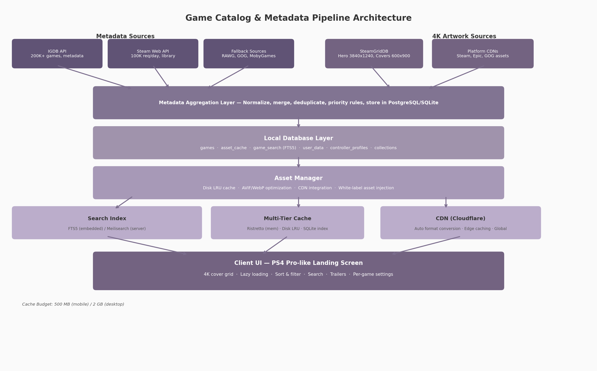

## 8. Game Catalog & Metadata System

A cloud gaming client application's landing screen — the first surface a user sees after authentication — functions as both a navigational hub and an emotional anchor. The requirement to deliver a PlayStation 4 Pro-quality experience, complete with 4K-resolution game covers and screenshots, sorting, filtering, and responsive search, imposes demands that span content acquisition, data modeling, image optimization, and indexing architecture. No single third-party data source satisfies all requirements: metadata (titles, genres, ratings, release dates) originates from one set of providers, while ultra-high-resolution artwork comes from another, and user library data from a third. The architecture must therefore aggregate, normalize, cache, and serve data from multiple independent sources under a unified schema. This chapter defines the metadata integration strategy, the canonical game schema, the 4K asset pipeline, and the search and filtering subsystem.

The pipeline diagram illustrates the five-layer flow from upstream data providers through to the client user interface. Metadata sources (IGDB, Steam Web API, fallback providers) feed the aggregation layer alongside artwork sources (SteamGridDB, platform CDNs). The aggregated data lands in a local database that serves as the authoritative source of truth, with the asset manager handling image optimization, CDN integration, and multi-tier caching. The search index (SQLite FTS5 for embedded clients, Meilisearch for server deployments) and cache subsystem (in-memory plus disk LRU) feed the client UI layer, which renders the PS4 Pro-like landing screen.

### 8.1 Metadata Sources & Integration

Building a comprehensive game catalog requires combining multiple APIs, each covering a different facet of game data. The primary integration pattern is a "source-of-record" priority system: IGDB provides the canonical metadata record, SteamGridDB supplies 4K artwork, the Steam Web API handles library import and playtime, and a tier of fallback sources fills coverage gaps. Each source is accessed through its authenticated REST or GraphQL API, with responses normalized into the local schema before storage. Rate limits, data freshness, and licensing terms vary across providers, so the integration layer must implement request throttling, aggressive caching, and offline-first data access.

#### 8.1.1 IGDB API

IGDB (Internet Game Database), owned by Twitch, provides the most comprehensive free game metadata API available. It covers over 200,000 game records with fields spanning titles, descriptions, genres, age ratings, release dates, platforms, screenshots, videos, themes, player perspectives, and multiplayer modes [^288^]. Authentication requires a Twitch developer account with OAuth2 bearer tokens passed on every request via `Client-ID` and `Authorization` headers. The API uses the Apicalypse query language, which supports field selection, filtering, and expansion of related entities (e.g., requesting `genres.name` inline with game records).

Pricing follows a three-tier model: the free tier allows 10,000 requests per month; the Pro tier costs $99 per month and raises the limit to 50,000 requests with webhook and multi-query support; and the Partner Program provides comparable or higher quotas at no cost for qualifying non-commercial projects [^276^]. For a cloud gaming platform with a moderate user base, the free tier covers metadata hydration for roughly 3,300 games per day (assuming 3 API calls per game for game record, cover, and screenshots), making it sufficient for an MVP. The Pro tier becomes necessary at scale or when webhook-driven real-time updates are required. IGDB also provides daily bulk data dumps for offline ingestion, which is the recommended approach for initial catalog population.

A critical limitation of IGDB is image resolution. IGDB images are served through a template URL system (`https://images.igdb.com/igdb/image/upload/t_{size}/{image_id}.png`) where the largest available size is `t_1080p` — approximately 1920x1080 [^288^]. True 4K artwork (3840x2160 or equivalent) is not available from IGDB, so a supplementary artwork source is mandatory for the 4K cover requirement.

#### 8.1.2 SteamGridDB

SteamGridDB is a community-driven artwork repository purpose-built for Steam library customization, and it serves as the primary source for high-resolution game covers, hero banners, logos, and icons. Its API v2 exposes endpoints for grids (vertical covers at 600x900), heroes (background banners at 1920x620 and 3840x1240 for 4K displays), logos (transparent PNG), and icons (512x512), all searchable by Steam App ID or SteamGridDB game ID [^283^]. The hero endpoint's 3840x1240 resolution provides genuine 4K-class imagery for the landing screen background, confirmed by SteamGridDB's changelog entries addressing 4K display support [^275^].

All asset endpoints support format filtering (PNG, WebP, JPEG), style filtering (official, alternate, animated), and dimension selection. Results are paginated at a maximum of 50 items per request. SteamGridDB focuses predominantly on Steam-catalogued titles; coverage for Epic Games Store exclusives, GOG exclusives, and console-only games is thinner. For titles missing from SteamGridDB, the architecture falls back to platform-native CDNs (e.g., Steam's own `library_600x900.jpg` and `library_hero.jpg` served via Akamai) or allows white-label asset uploads through an administrative interface. Animated covers in APNG and animated WebP formats are also available, supporting dynamic library visuals similar to Steam's animated grid feature [^374^].

#### 8.1.3 Steam Web API

Valve's Steam Web API bridges the gap between generic metadata and user-specific library data. It is free for community use with a limit of 100,000 requests per day per API key [^337^]. Two endpoints are essential for the catalog system. The `IPlayerService/GetOwnedGames` endpoint returns a user's complete game library with `appid`, `name`, `playtime_forever`, `playtime_2weeks`, `img_icon_url`, and `img_logo_url` for each title, though the `include_appinfo=true` parameter must be set to retrieve game names [^269^]. The Steam Store API endpoint (`store.steampowered.com/api/appdetails`) provides rich game metadata including developers, publishers, genres, screenshots, trailer URLs, release dates, Metacritic scores, supported platforms, and content descriptors [^371^], with an approximate rate limit of 200 requests per 5 minutes [^384^].

Steam playtime tracking began in early 2009, meaning historical data is comprehensive for most users [^409^]. For games where the Steam Store API returns no data (unlisted, delisted, or pre-release titles), the SteamSpy service provides aggregated owner estimates and average playtime statistics as a secondary source [^335^]. Steam's own CDN (`steamcdn-a.akamaihd.net`) delivers official library artwork at predictable URLs, making it a reliable fallback when SteamGridDB lacks coverage.

#### 8.1.4 Fallback Sources

No single API covers the full catalog of commercially available games. The fallback chain activates when the primary sources return no results or insufficient data. RAWG provides access to over 500,000 games across 50+ platforms with machine-learning-based recommendation features, advanced search by Metacritic rating, and player activity data sourced from Steam [^279^]. The GOG unofficial product API exposes catalog data at `api.gog.com/products/{id}` with a rate limit of 200 requests per hour per IP [^372^], including screenshots, videos, and download metadata. MobyGames offers a v2 API supporting filtering by platform, genre, and title substring with up to 100 results per request [^287^]. Giant Bomb provides extensive game fields including aliases, characters, concepts, and themes, though its long-term stability was cast into doubt by a DMCA takedown incident in 2024 [^411^].

The fallback priority chain is: IGDB (primary metadata) → Steam Web API (library + playtime) → SteamGridDB (4K artwork) → Steam CDN (official artwork fallback) → RAWG (coverage gaps, recommendations) → GOG API (GOG-specific titles) → MobyGames (legacy titles) → Giant Bomb (last resort). Each source is queried in sequence until the required field set is complete. Aggressive caching ensures fallback queries are rarely needed after initial catalog hydration.

### 8.2 Game Metadata Schema

A unified schema is necessary because each upstream API uses different field names, data types, and relationship models. The canonical schema presented here consolidates the most complete fields from IGDB, Steam Store API, and GOG product data into a single normalized structure, aligned with Schema.org VideoGame where applicable [^319^].

#### 8.2.1 Core Schema

The core schema comprises 25 fields organized into eight logical groups. The `external_ids` block stores foreign keys for every connected API (IGDB ID, Steam App ID, Epic namespace, GOG product ID, RAWG slug, MobyGames ID, Giant Bomb GUID), enabling traceability back to source records. The `title` block stores display name, sort name (e.g., "Witcher 3, The"), and aliases. The `description` block carries short (one-line), full, and storyline summaries. The `media` block is the most complex, holding URLs for cover art (600x900 and upscaled 1200x1800), hero backgrounds (1920x620 and 3840x1240), transparent logos, 512x512 icons, screenshot arrays with dimensions, and trailer metadata with YouTube and direct MP4 URLs.

The `release` block captures first release date and per-platform regional releases. The `classification` block stores genres, themes, game modes, player perspectives, and keywords. The `ratings` block records ESRB, PEGI, and CERO age ratings alongside aggregated critic scores. The `technical` block documents supported platforms, engine, player count ranges, controller compatibility, save file locations per OS, and minimum/recommended system requirements. Finally, the `ownership` block links the game record to the user's library sources, installation status, local path, total playtime, last played timestamp, and completion status.

#### 8.2.2 Per-Game Settings

Beyond metadata, each game record carries user-specific configuration. The `controller_profiles` field stores per-game controller bindings as JSON, including action-to-button mappings, analog sensitivity curves, and dead zone values for left and right sticks. This directly addresses a documented pain point in cloud gaming: services like GeForce Now do not persist controller bindings between sessions, forcing users to reconfigure inputs on every launch [^332^]. The `graphics_settings` field holds resolution, bitrate cap, codec preference (H.264, HEVC, AV1), and VSync options. The `save_location_mapping` field records the canonical paths where a game stores its save files on Windows (`%APPDATA%`, `%USERPROFILE%/Documents`) and Linux (`~/.local/share`), enabling automated cloud save synchronization.

A layered configuration system resolves conflicts: application-wide defaults sit at the bottom, followed by global user preferences, per-game overrides, and per-platform overrides (e.g., Steam Deck-specific settings). Resolution is achieved by simple cascade: later layers override earlier ones.

#### 8.2.3 Complete Metadata Schema

The following table presents the full canonical schema with field name, data type, upstream source, and an example value for each field.

| Field | Type | Primary Source | Example |
|-------|------|---------------|---------|
| `id` | UUID (internal) | Generated | `a1b2c3d4-e5f6-7890-abcd-ef1234567890` |
| `igdb_id` | Integer | IGDB [^288^] | `1877` |
| `steam_appid` | Integer | Steam Web API [^337^] | `292030` |
| `title` | String | IGDB [^288^] | `The Witcher 3: Wild Hunt` |
| `sort_name` | String | Computed | `Witcher 3: Wild Hunt, The` |
| `short_description` | String | IGDB / Steam Store [^371^] | `Open-world action RPG` |
| `cover_url_600x900` | URL | SteamGridDB [^283^] | `https://cdn2.steamgriddb.com/grid/...` |
| `hero_url_3840x1240` | URL | SteamGridDB [^275^] | `https://cdn2.steamgriddb.com/hero/...` |
| `logo_url` | URL | SteamGridDB [^283^] | `https://cdn2.steamgriddb.com/logo/...` |
| `icon_url_512` | URL | SteamGridDB [^283^] | `https://cdn2.steamgriddb.com/icon/...` |
| `screenshots` | JSON array | IGDB / Steam Store [^288^] | `[{"url": "...", "w": 1920, "h": 1080}]` |
| `trailers` | JSON array | Steam Store [^375^] | `[{"name": "Launch Trailer", "mp4": "..."}]` |
| `first_release_date` | Date | IGDB [^288^] | `2015-05-19` |
| `genres` | String array | IGDB [^288^] | `["RPG", "Action"]` |
| `themes` | String array | IGDB [^288^] | `["Open world", "Fantasy"]` |
| `game_modes` | String array | IGDB [^288^] | `["Single player"]` |
| `esrb_rating` | String | IGDB [^288^] | `M` |
| `aggregated_rating` | Float | IGDB [^288^] | `92.5` |
| `developers` | String array | IGDB / Steam [^371^] | `["CD Projekt Red"]` |
| `publishers` | String array | IGDB / Steam [^371^] | `["CD Projekt"]` |
| `platforms` | String array | IGDB [^288^] | `["PC (Windows)", "PlayStation 5"]` |
| `supported_controllers` | String array | Steam Store [^371^] | `["xbox", "playstation", "steam_deck"]` |
| `playtime_minutes` | Integer | Steam Web API [^269^] | `12450` |
| `last_played` | Timestamp | Steam Web API [^269^] | `2025-07-10T14:30:00Z` |
| `controller_profile` | JSON | User-defined [^332^] | `{"bindings": {...}, "sensitivity": 0.75}` |
| `completion_status` | Enum | User-defined | `playing` |
| `library_sources` | String array | Steam Web API [^269^] | `["steam", "gog"]` |
| `date_added_to_library` | Date | Computed | `2023-02-15` |

The 28-field schema above covers every data element required for the PS4 Pro-like landing screen and game detail view. External ID fields are populated at ingestion time by querying each source in priority order. Media URLs are refreshed on a configurable schedule: hero and cover art weekly, screenshots monthly, and metadata quarterly. The `controller_profile` and `completion_status` fields are user-managed and sync to the cloud on every change. Storage of this schema in SQLite (for embedded single-user clients) or PostgreSQL (for server-backed deployments) is discussed in Section 8.4.

### 8.3 4K Asset Pipeline

The PS4 Pro landing screen requirement — 4K covers and screenshots — creates a multi-faceted engineering challenge spanning image format optimization, responsive delivery, CDN integration, and local caching. A 3840x1240 hero image in uncompressed PNG can exceed 15 MB; downloading hundreds of these during catalog browsing is impractical. The asset pipeline addresses this through format negotiation, multi-resolution generation, and a three-tier caching strategy.

#### 8.3.1 Image Optimization

Modern image codecs offer dramatic size reductions over legacy JPEG and PNG. AVIF (AV1 Image File Format) provides the best compression efficiency currently available, particularly at lower bitrates where it can achieve 50-70% smaller files than WebP with equivalent visual quality [^318^]. WebP offers broader browser and client support with faster encoding speeds, making it the ideal fallback [^326^]. The recommended delivery strategy designates AVIF as the primary format (quality 50-80%, depending on image complexity) and WebP as the fallback for clients without AVIF decoders (quality 75-85%). PNG is retained only for icons and logos requiring transparency, and JPEG is a legacy fallback of last resort.

| Format | Quality Range | Role | Compression vs. JPEG |
|--------|-------------|------|---------------------|
| AVIF | 50-80% | Primary delivery format | 50-70% smaller [^318^] |
| WebP | 75-85% | Fallback for older clients | 25-35% smaller [^326^] |
| PNG | Lossless | Icons, logos (transparency) | N/A (uncompressed) |
| JPEG | 85-90% | Legacy fallback only | Baseline |

Format negotiation occurs through two mechanisms. For web clients, the HTTP `Accept` header (`Accept: image/avif,image/webp,*/*`) signals decoder support, and the CDN or server responds with the best available format. For native desktop and mobile clients, format capability is determined at build time or runtime and cached as a client preference. The aggregation layer stores all assets in their original format and relies on the CDN or local transcoder to generate optimized variants on demand.

#### 8.3.2 Responsive Images

Delivering a 3840x1240 hero image to a 720p mobile screen wastes bandwidth and memory. The responsive image strategy generates five width variants for every primary asset: 480w (mobile thumbnails), 720w (small screens), 1080w (standard displays), 1440w (QHD monitors), and 2160w (4K displays). HTML `srcset` with width descriptors selects the optimal variant based on device pixel density and viewport size; native clients implement equivalent logic using per-platform image loading libraries.

Lazy loading is implemented via the Intersection Observer API (web) or platform-equivalent visibility detection (native). Only images entering or approaching the viewport are fetched, reducing initial page weight by 60-80% for large libraries. A blur-up placeholder technique displays a low-resolution thumbnail (pre-fetched at 32x32 and blurred via CSS or shader) while the full asset loads, eliminating visual pop-in. This technique, combined with progressive AVIF encoding, produces perceived load times under 200ms for cover art even on mid-bandwidth connections.

#### 8.3.3 CDN Integration

An image-optimizing CDN is essential for global delivery of 4K assets. Cloudflare Images, ImageKit, Imgix, and Cloudinary all support automatic format conversion, quality optimization, and responsive resizing at the edge [^325^]. Cloudflare Images is recommended for high-volume deployments at $5 per 100,000 delivered images with AVIF and WebP auto-conversion. ImageKit offers a generous free tier suitable for startup-scale usage. The selected CDN sits between the asset manager and the client; the client requests images by canonical ID and width, and the CDN delivers the best-compressed format supported by that client from its nearest edge node.

For white-label deployments, the CDN also serves brand-injected assets (custom backgrounds, logos, themed cover overlays) alongside game artwork. Brand assets are uploaded through an admin API, auto-converted to AVIF and WebP variants at multiple resolutions, and stored in object storage (S3 or MinIO) with CDN fronting. The metadata record for each game includes an optional `white_label_overrides` JSON block that specifies replacement assets for themed deployments.

#### 8.3.4 Local Caching

Remote API calls and CDN fetches introduce latency that is unacceptable for the landing screen experience. A three-tier local caching system keeps hot assets in memory, warm assets on disk, and metadata in an indexed SQLite database. Tier 1 uses Ristretto, a high-performance in-memory cache developed by Dgraph, for assets currently visible in the viewport or accessed within the last 60 seconds [^358^]. Tier 2 is a disk-based LRU cache storing image files on the local filesystem, indexed by a content-addressable hash of the source URL. Tier 3 is a SQLite metadata index mapping asset keys to local file paths, original URLs, ETags, dimensions, and last-accessed timestamps.

The total cache budget is 500 MB on mobile devices and 2 GB on desktop. For a library of 200 games, full local caching of all cover art (600x900 AVIF, ~80 KB each), hero images (1920x620 WebP, ~300 KB each), icons, and thumbnails consumes approximately 120-180 MB — well within the mobile budget. The remaining capacity is allocated to on-demand screenshot caching for recently viewed games. Eviction follows a strict LRU policy: when the cache budget is exceeded, the least recently accessed assets are purged until usage drops to 80% of capacity. For installed games, cover and hero assets are pinned (non-evictable) to guarantee instant display.

### 8.4 Search, Sorting & Filtering

A game library with hundreds of titles requires fast, intuitive discovery mechanisms. The search subsystem must support text search, multi-criteria filtering, and flexible sorting — all with sub-100ms response times on embedded hardware.

#### 8.4.1 Search Engine

Two search backends are recommended depending on deployment context. For embedded single-user clients (desktop and mobile), SQLite FTS5 (Full Text Search version 5) provides zero-dependency, built-in full-text indexing with BM25 relevance ranking. FTS5 creates a virtual table over the game data, tokenizing titles, descriptions, genres, and developer names with the Porter stemming algorithm and Unicode 61 character classification. Search queries return ranked results in under 10 milliseconds for libraries of up to 100,000 titles [^314^]. FTS5 does not support typo tolerance, but prefix matching (`action*` matches "action" and "actions") covers most partial-input scenarios.

For server-backed deployments where typo tolerance and faceted search are required, Meilisearch delivers sub-50 millisecond response times with minimal configuration [^315^]. Meilisearch indexes support typo tolerance, synonyms, stop words, and faceted filtering out of the box. The trade-off is storage overhead: Meilisearch consumes 6-8x the disk space of SQLite FTS5 for the same document set (217 MB versus 26 MB for 31,944 movie documents, per Meilisearch's own benchmark) [^314^]. Elasticsearch is reserved for enterprise-scale deployments requiring complex analytics; Bleve provides a pure-Go alternative for teams avoiding CGO.

| Feature | SQLite FTS5 | Meilisearch | Bleve |
|---------|-------------|-------------|-------|
| Setup complexity | Built-in (zero config) | Minutes (Docker) | Hours (Go library) |
| Typo tolerance | No | Yes | Yes |
| Relevance model | BM25 [^288^] | Built-in BM25 | TF-IDF / BM25 |
| Storage overhead | 1.5-2x source | 6-8x source [^314^] | 2-3x source |
| Response time (local) | <10 ms | <50 ms [^315^] | <100 ms |
| Go native | Via CGO | No (HTTP API) | Yes (pure Go) |
| Faceted filtering | Limited | Yes | Yes |

The selection between FTS5 and Meilisearch follows the deployment model. Desktop and mobile clients use FTS5 because it requires no external service, has no memory footprint beyond the SQLite database, and the absence of typo tolerance is an acceptable trade-off for personal libraries where users know their game titles. Server deployments use Meilisearch to support multi-user search with typo tolerance and instant suggestions. Migration from FTS5 to Meilisearch is transparent because both index the same canonical schema.

#### 8.4.2 Sorting Options

Six sorting modes are available, each backed by a B-tree index on the corresponding database column for sub-millisecond ordering. "Recently played" sorts by `last_played` in descending order and serves as the default view, placing the user's current games at the top of the landing screen. "Alphabetical" uses the `sort_name` field (e.g., "Witcher 3, The" rather than "The Witcher 3") to produce linguistically correct ordering with locale-aware collation. "Release date" sorts by `first_release_date` with unreleased titles optionally pinned to the top or bottom. "Rating" uses the `aggregated_rating` field (IGDB critic score, 0-100). "Playtime" sorts by `playtime_minutes` in descending order, surfacing the user's most-played titles. "Date added" orders by `date_added_to_library`, useful for finding newly acquired games. B-tree indexes on all six sort fields ensure that switching sort modes does not trigger table scans.

#### 8.4.3 Filtering

Filtering is implemented as faceted search with pre-computed counts. When a user opens the filter panel, the system displays the count of matching games for each filter value (e.g., "Action (23)", "RPG (15)") without requiring an explicit search. Filter categories include genre, platform, game mode (single-player, multiplayer, co-op), controller support, library source (Steam, Epic Games Store, GOG), release year, aggregated rating range, and installation status. Multi-select within a category uses OR semantics (Action OR RPG), while selections across categories use AND semantics (Action AND 2024 AND installed). Pre-computed facet counts are maintained in a materialized view updated whenever the library changes (game added, removed, or metadata updated).

#### 8.4.4 Game Collections

Beyond universal sort and filter modes, users can create personal collections: favorites, wishlist, "recently played" (auto-managed), "completed," and unlimited custom collections such as "Weekend RPGs" or "Couch Co-op." Collections are stored per-user in PostgreSQL on the server and synchronized to the local SQLite database on each client. Each collection record contains a UUID, user ID, collection name, sort order, and an ordered array of game UUIDs. Collection membership is exposed as a virtual filter in the faceted search panel, allowing users to filter their library to a single collection and then apply additional filters or sorting within that subset. Collections support drag-and-drop reordering on desktop and long-press reordering on mobile, with changes persisted incrementally to minimize sync bandwidth.
