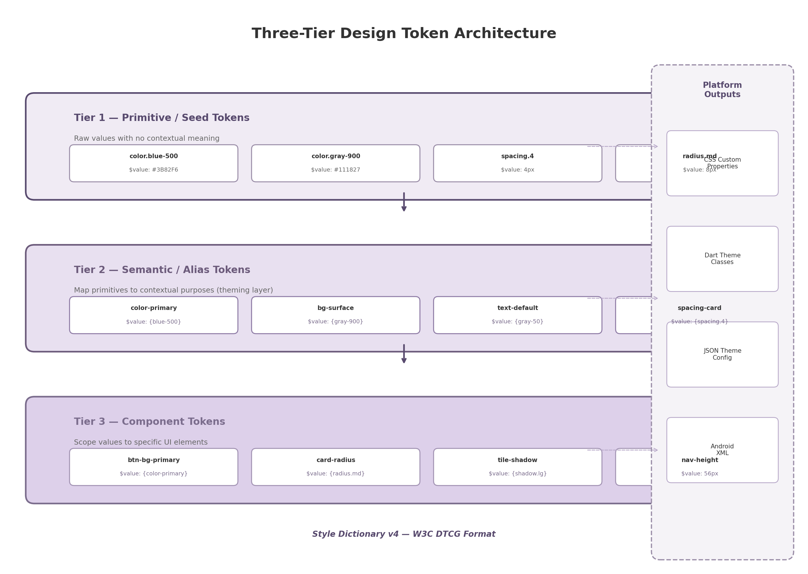
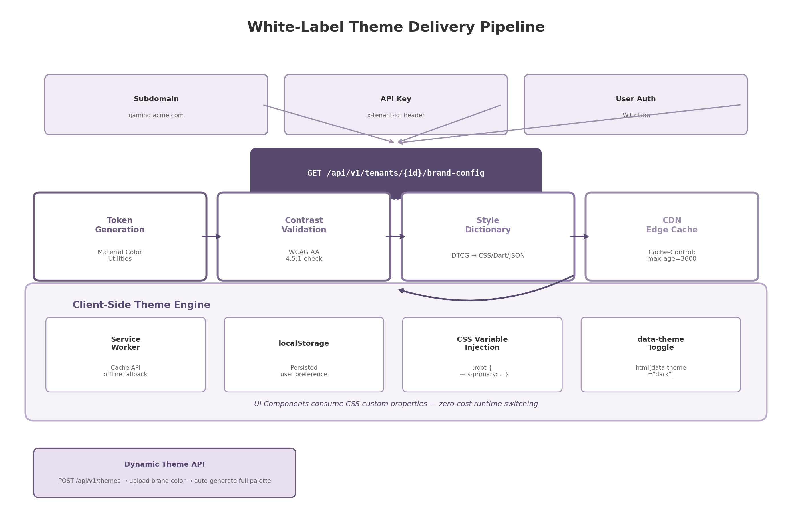

## 9. Theming & White-Label Customization System

A cloud gaming platform delivered to multiple licensees — internet service providers, hospitality chains, enterprises — must present each end-user's brand as if the platform were built exclusively for them. This requirement demands a theming architecture that separates every visual decision from component logic, enables runtime switching without application restarts, and guarantees accessibility compliance regardless of which colors a tenant selects. The following sections describe a design-token-based theming system that satisfies these constraints across web, desktop, mobile, and television clients.

### 9.1 Design Token Architecture

#### 9.1.1 Three-Tier Token System

Design tokens are the atomic units of a design system — design decisions encoded as data rather than hardcoded values. Instead of scattering `#3B82F6` across hundreds of CSS rules, that value is stored once under the name `color.blue-500` and referenced by name everywhere it is needed [^601^]. The concept, first articulated by Jina Anne at Salesforce in 2014, has become the industry standard for scalable theming and is now codified by a W3C specification backed by Adobe, Amazon, Google, Sony, Microsoft, Meta, and Salesforce, among others [^624^].

Mature design systems organize tokens into three distinct tiers, a pattern used by Salesforce Lightning, Google Material Design 3, and the W3C Design Tokens Community Group (DTCG) itself [^601^][^602^]. The first tier — primitive or seed tokens — contains raw values with no contextual meaning. These define the palette: `color.blue-500` equals `#3B82F6`, `spacing.4` equals `4px`, `radius.md` equals `8px`. Primitive tokens are the single source of truth for every literal value in the system.

The second tier — semantic or alias tokens — maps primitive values to contextual purposes. This is the theming layer. `color-primary` resolves to `{color.blue-500}`, `bg-surface` resolves to `{color.gray-900}`, `text-default` resolves to `{color.gray-50}`. Semantic tokens express *intent* rather than *value*; they answer the question "what is this color for?" rather than "what hex code is this?" When a tenant changes its brand color, only the semantic mapping is updated — the component code that consumes `color-primary` remains untouched.

The third tier — component tokens — scopes values to specific UI elements. `btn-bg-primary` resolves to `{color-primary}`, `card-radius` resolves to `{radius.md}`, `nav-height` resolves to `56px`. Component tokens allow a design system to vary the expression of a semantic token per component: a primary button might use the brand color at full saturation while a primary badge might use the same brand color at a lower tonal value, both derived from the same semantic source.



The three-tier structure, illustrated in Figure 9.1, creates a directed acyclic graph from raw values to component styles. Changing a primitive value (for example, shifting the brand blue from `#3B82F6` to `#2563EB`) automatically cascades through every semantic alias and every component token that references it. This cascade is what makes white-label rebranding a matter of data substitution rather than code modification.

#### 9.1.2 W3C DTCG Specification and Style Dictionary v4

In October 2025, the W3C Design Tokens Community Group published its first stable specification (version 2025.10), establishing a vendor-neutral format for token interchange [^622^][^624^]. The specification defines three published modules — Format, Color, and Resolver — and mandates a `$`-prefixed property syntax: `$value` for the token value, `$type` for the data type (color, dimension, fontFamily, shadow, etc.), and `$description` for human-readable documentation. Token references use curly-brace notation: `{color.blue-500}` resolves to the value stored at that path. Over ten design tools already support this standard, including Tokens Studio for Figma, Sketch, Penpot, Supernova, and zeroheight [^624^].

Amazon's Style Dictionary is the most widely adopted build tool for transforming platform-agnostic token definitions into platform-specific outputs [^601^][^604^]. Style Dictionary v4, released in 2024, added first-class support for the W3C DTCG format, meaning token files authored in the standard `$value` / `$type` syntax can be consumed directly without conversion [^604^]. The tool accepts JSON or YAML input and produces CSS custom properties, SCSS variables, JavaScript objects, Swift constants, Android XML resources, and Kotlin data classes. For a white-label game streaming platform, this multi-platform output is essential: the same token source drives the web client (CSS variables), the Flutter mobile and TV clients (Dart theme classes), the Wails desktop client (JSON theme configuration consumed by JavaScript), and the Android TV client (XML resources). Style Dictionary's multi-brand theming capability — token layering that overlays brand-specific values onto a base theme — further supports the per-tenant customization requirement [^605^].

#### 9.1.3 Platform Outputs

The token pipeline produces four platform-specific artifacts from a single DTCG source file. For the web client, Style Dictionary generates CSS custom properties on the `:root` selector: `--cs-primary: #3B82F6`, `--cs-bg-surface: #111827`, `--cs-text-default: #F9FAFB`. For the Flutter mobile and TV clients, it generates Dart `ThemeData` extensions with `ColorScheme` mappings. For the Wails desktop and Angular web clients, it emits a JSON theme configuration consumed at runtime by the JavaScript theming layer. For the Android TV client, it produces XML resource files compatible with Compose for TV's `MaterialTheme` composition. This single-source, multi-output pipeline ensures that a brand color change made by a tenant administrator propagates identically across all client platforms without manual per-platform updates.

### 9.2 Runtime Theme Engine

#### 9.2.1 CSS Custom Properties for Web

The web client's theme engine is built on CSS custom properties (CSS variables) rather than CSS-in-JS libraries such as styled-components or Emotion. This choice is driven by runtime performance. CSS-in-JS approaches serialize CSS rules on every render and re-serialize the entire stylesheet when switching themes, producing a perceptible delay that Ant Design's engineering team measured in the hundreds of milliseconds on large component trees [^606^]. CSS custom properties, by contrast, require zero serialization on theme switches: modifying a variable value causes the browser's style engine to recalculate only the affected properties, with no JavaScript execution involved [^606^].

The platform's CSS variable naming convention uses a `cs-` prefix (for "cloud streaming") to avoid collisions with third-party libraries. Variables are defined at `:root` scope so they cascade to all components: `--cs-primary` for the brand accent, `--cs-bg-surface` for card and tile backgrounds, `--cs-text-default` for body text, `--cs-focus-ring` for focus indicators. Runtime switching is accomplished by a single attribute update: `document.documentElement.setAttribute('data-theme', 'dark')` causes CSS selectors such as `[data-theme="dark"]` to activate, redefining the variable values for the dark palette. This operation executes in sub-millisecond time and triggers no JavaScript computation.

#### 9.2.2 Day, Dark, and Auto Modes

The theme engine supports three display modes — day (light), dark, and auto — with a three-layer preference resolution that prevents the "flash of wrong theme" (FOWT), the jarring moment when a page briefly renders in the wrong color scheme before JavaScript corrects it. The resolution priority is: explicit user choice (persisted in `localStorage`) overrides the system preference (`prefers-color-scheme` media query), which in turn overrides the platform default (dark). This ordering ensures that a user who manually selected dark mode at 2 PM is not forced into light mode when the OS switches at sunset [^660^][^661^].

The anti-flash implementation requires an inline script placed in the document `<head>` before any render-blocking stylesheets or framework hydration code. This script executes synchronously during HTML parsing, before the browser paints a single pixel:

```html
<script>
  (function() {
    const saved = localStorage.getItem('cs-theme');
    const system = window.matchMedia('(prefers-color-scheme: dark)').matches ? 'dark' : 'light';
    const theme = saved || system;
    document.documentElement.setAttribute('data-theme', theme);
  })();
</script>
```

By setting the `data-theme` attribute before React, Angular, or any framework hydrates the DOM, the first paint already uses the correct color values. For auto mode, a `matchMedia` listener on `prefers-color-scheme` monitors the OS setting; when the system preference changes, the listener updates the theme only if no explicit user override exists in `localStorage` [^660^]. The approach described by Ant Design's CSS variable migration and confirmed by multiple modern implementations treats theme selection as a browser-native concern rather than a framework state variable [^606^][^667^].

#### 9.2.3 Material Design 3 Tonal Palette

Generating a complete, harmonious color scheme from a single source color is a solved problem thanks to Material Design 3's (M3) tonal palette system. Instead of requiring designers to manually specify primary, secondary, tertiary, error, neutral, and neutral-variant palettes, M3 generates all of them algorithmically from one input color using the HCT color space — a perceptually uniform model that combines hue, chroma, and tone (lightness) [^612^][^614^].

The HCT color space is central to M3's algorithm because it produces perceptually uniform tonal steps: changing the tone value by 10 produces a visually consistent lightness difference regardless of the hue. From a single source color, the `@material/material-color-utilities` library (published by Google) generates 13 tonal steps (tones 0 through 100, in increments) for each of six color roles: primary, secondary, tertiary, error, neutral, and neutral variant [^614^]. A tenant uploading a brand color of `#E50914` (red) receives a complete palette where primary-40 is the brand color at moderate lightness (used for buttons), primary-90 is a very light tint (used for button backgrounds), and primary-10 is a very dark shade (used for text on light backgrounds). The algorithm ensures that all generated colors are harmonically related, eliminating the risk of clashing accent colors in tenant-customized themes.

The platform integrates this library server-side in the Dynamic Theme API. When a tenant submits a brand color, the API invokes `themeFromSourceColor(argbFromHex(brandColor))`, extracts the tonal palettes, and maps them to semantic tokens: `color-primary` receives tone 40, `color-primary-container` receives tone 90, `color-on-primary` receives tone 100. This server-side generation ensures that all clients — web, mobile, desktop, TV — receive identical color mappings derived from the same algorithmic output.

#### 9.2.4 Dynamic Theme API

The Dynamic Theme API exposes a single endpoint for runtime theme creation and update: `POST /api/v1/themes`. A white-label tenant submits a JSON payload containing its brand color (hex), logo SVG, heading and body font preferences, and layout density choice. The server validates the payload, generates the full tonal palette via Material Color Utilities, runs WCAG contrast validation (described in Section 9.4), compiles the token set through Style Dictionary, and stores the result in a CDN-backed cache with a `Cache-Control: max-age=3600` header [^609^].

Clients fetch the compiled theme on startup via `GET /api/v1/tenants/{id}/brand-config`. The response is a JSON object containing all CSS variable assignments, font URLs, and logo references. The web client injects these values by constructing a `CSSStyleSheet` and appending it to `document.adoptedStyleSheets`, a method that avoids DOM style-tag insertion and supports instant updates when the tenant changes its branding [^609^]. Because the theme is fetched and applied after application startup, tenants can update their brand colors or logos without requiring an application restart or a client deployment.



Figure 9.2 illustrates the complete delivery pipeline. Tenant resolution occurs via subdomain (e.g., `gaming.acme.com`), API key header (`x-tenant-id`), or JWT claim. The brand configuration passes through token generation, contrast validation, Style Dictionary transformation, and CDN edge caching before reaching the client's theme engine, where a service worker provides offline fallback and `localStorage` persists the user's day/dark preference.

### 9.3 White-Label Configuration

#### 9.3.1 Per-Tenant Configuration Storage

Successful white-label software-as-a-service (SaaS) platforms treat customization as data rather than code [^607^][^608^]. The platform stores each tenant's brand settings as a structured JSON document in a PostgreSQL table with row-level security, ensuring complete data isolation between tenants. The configuration record includes the tenant identifier, domain mapping, brand name, source color, typography selections, layout density preference, and asset references (logo URLs, splash screen images, favicon). When a client application initializes, it resolves the tenant identifier from the request (subdomain, API key, or authentication token), fetches the configuration record through a cache-first Redis layer, and applies the theme before the first UI render.

The configuration-driven approach avoids per-tenant code branches or build artifacts. A single deployment serves all tenants; visual differentiation happens entirely through data substitution at runtime. This model, validated by enterprise white-label architecture guidance from Developex and Context.dev, reduces operational complexity while maintaining strict tenant isolation [^607^][^609^].

#### 9.3.2 Self-Service Brand Portal

White-label customers manage their brand configuration through a web-based self-service portal. The portal provides a real-time theme preview: as the tenant administrator selects a brand color from a color picker, the preview pane updates instantly to show the generated tonal palette applied to a mock game catalog interface. The administrator can toggle between day and dark modes, upload logo SVGs for light and dark backgrounds, select heading and body fonts from a curated list of web-safe and Google Fonts options, and adjust the layout density (compact, comfortable, spacious). All changes are validated for WCAG contrast compliance before they can be saved, preventing administrators from deploying inaccessible themes.

The portal persists changes to the tenant configuration record, which invalidates the CDN cache entry and triggers a re-generation of the token set. Clients detect the updated theme on their next config fetch (or immediately via a WebSocket push for active sessions). The entire cycle from color selection to live application takes under five seconds for active users.

#### 9.3.3 Asset Injection

Brand assets are injected dynamically at runtime. SVG logos are the preferred format because they scale to any resolution, support transparency, and can inherit theme colors via the CSS `fill: var(--cs-primary)` property [^609^]. The platform provides both a light-variant and dark-variant logo URL per tenant; the client selects the appropriate variant based on the current `data-theme` attribute. For Progressive Web App (PWA) clients, the platform generates the Web App Manifest dynamically as a data URI, embedding the tenant's brand name, theme color, background color, and icon references directly into the HTML response [^658^]. This enables per-tenant splash screens and home-screen icons without requiring a static manifest file per tenant.

Favicons are generated programmatically from the tenant's source color: a simple colored circle (primary-40 tone) is rendered as a 32x32 PNG and served at `/favicon.ico` with tenant-scoped routing. For tenants that upload a custom favicon, the uploaded asset overrides the generated default. Font loading uses `font-display: swap` to show system fallback text immediately, swapping to the brand font when it arrives, with font metric overrides (`size-adjust`, `ascent-override`, `descent-override`) specified in the `@font-face` declaration to minimize Cumulative Layout Shift (CLS) during the swap [^618^][^685^].

#### 9.3.4 White-Label Configuration Parameters

The following table documents the full set of white-label configuration parameters available to tenants. Each parameter includes its data type, default value, and scope — whether the setting is defined once globally by the platform operator or customizable per tenant through the self-service portal.

| Parameter | Type | Default Value | Scope | Description |
|---|---|---|---|---|
| `brandName` | string | "Cloud Gaming" | per-tenant | Display name shown in header, PWA manifest, and page title |
| `sourceColor` | color | "#3B82F6" | per-tenant | Primary brand color; all palettes generated from this value via M3 tonal algorithm |
| `colorScheme` | enum | "auto" | per-tenant | Default day/dark mode: "light", "dark", or "auto" (follows OS) |
| `logoLight` | URL | null | per-tenant | SVG logo for light backgrounds; system generates text fallback if unset |
| `logoDark` | URL | null | per-tenant | SVG logo for dark backgrounds; inherits `logoLight` if unset |
| `headingFont` | string | "system-ui" | per-tenant | Font family for headings; must be a system font or licensed web font |
| `bodyFont` | string | "system-ui" | per-tenant | Font family for body text; loaded with `font-display: swap` |
| `density` | enum | "comfortable" | per-tenant | Layout density: "compact" (8px gaps), "comfortable" (16px), "spacious" (24px) |
| `defaultView` | enum | "grid" | per-tenant | Default catalog view mode: "grid", "list", or "cover-flow" |
| `customCSS` | string (sandboxed) | null | per-tenant | Additional CSS variables only; arbitrary selectors blocked for security |
| `favicon` | URL | auto-generated | per-tenant | 32x32 favicon PNG; auto-generated from `sourceColor` if not uploaded |
| `splashPortrait` | URL | null | per-tenant | PWA splash screen image (portrait orientation, 1170x2532) |
| `splashLandscape` | URL | null | per-tenant | PWA splash screen image (landscape orientation, 2532x1170) |
| `socialEnabled` | boolean | true | global | Whether social features (friends, activity feed) are visible |
| `achievementsEnabled` | boolean | true | global | Whether achievement/trophy system is enabled for this tenant |
| `minContrastRatio` | float | 4.5 | global | Minimum WCAG contrast ratio enforced in token validation pipeline |

The parameter set is intentionally constrained. Only color, typography, density, and asset parameters are exposed per-tenant; feature toggles (`socialEnabled`, `achievementsEnabled`) are global to maintain platform consistency. The `customCSS` field accepts only CSS custom property declarations (parsed via a whitelist) — arbitrary selectors, `!important` rules, and `@media` blocks are rejected at the API validation layer. This constraint prevents tenants from breaking layout or accessibility while still allowing fine-grained color adjustments. The `minContrastRatio` default of 4.5:1 enforces WCAG 2.1 Level AA compliance for normal text; platform operators can raise this to 7:1 for AAA compliance in regulated markets [^621^][^623^].

### 9.4 Accessibility in Theming

#### 9.4.1 WCAG 2.1 AA Contrast Compliance

Color contrast is the single most common accessibility failure on the web: WebAIM's 2024 Million analysis found that 83.6% of websites fail the WCAG 2.1 Level AA minimum contrast requirement [^623^]. For a white-label platform where tenants supply their own brand colors, programmatic contrast validation is not optional — it is a legal requirement under the European Accessibility Act (effective June 2025) and the Americans with Disabilities Act (ADA) Title III in the United States [^621^].

The platform enforces contrast at the token generation stage. When a tenant submits a source color, the Dynamic Theme API calculates the contrast ratio between every text color and its background using the relative luminance formula defined in WCAG 2.1:

$$CR = \frac{L_{1} + 0.05}{L_{2} + 0.05}$$

where $L_{1}$ is the relative luminance of the lighter color and $L_{2}$ is the relative luminance of the darker color. The relative luminance of a color in sRGB is computed by linearizing each RGB channel and applying the weighted sum $L = 0.2126 \cdot R + 0.7152 \cdot G + 0.0722 \cdot B$.

The following table summarizes the WCAG 2.1 Level AA contrast requirements applied in the token validation pipeline:

| Element Type | Minimum Ratio | WCAG Criterion | Enforcement Stage |
|---|---|---|---|
| Normal text (< 18pt regular) | 4.5:1 | 1.4.3 Contrast (Minimum) | Token generation — auto-correct if failed |
| Large text (18pt+ regular, 14pt+ bold) | 3:1 | 1.4.3 Contrast (Minimum) | Token generation — auto-correct if failed |
| UI components and graphical objects | 3:1 | 1.4.11 Non-text Contrast | Token generation — auto-correct if failed |
| Focus indicators | 3:1 | 2.4.11 Focus Appearance (WCAG 2.2) | CSS definition — two-tone technique |
| Normal text (enhanced) | 7:1 | 1.4.6 Contrast (Enhanced) AAA | Optional — configurable via `minContrastRatio` |

When a generated color pair fails the minimum ratio, the pipeline applies an auto-correction algorithm that adjusts the lightness of the offending color toward the contrasting end of the spectrum until the ratio is satisfied. The corrected values are flagged in the tenant portal with a warning icon, alerting the administrator that their brand color was modified for accessibility. Tenants may override auto-correction only by signing an explicit accessibility waiver, a legal safeguard for the platform operator. This pipeline-level enforcement ensures that no tenant can deploy a theme with illegible text or indistinguishable UI components, regardless of their design expertise [^621^][^623^][^650^].

#### 9.4.2 Focus Indicators

Keyboard navigation is the primary interaction mode for users with motor disabilities and for TV clients controlled by gamepad or remote. The theme engine defines focus indicators that remain visible across all theme backgrounds. The base implementation uses a 2px solid outline with a 2px offset, applied via the `:focus-visible` pseudo-class so that focus styles appear only for keyboard navigation (not mouse clicks), reducing visual noise for pointer users [^651^][^652^].

The CSS definition uses CSS custom properties for theme-aware coloring:

```css
:focus-visible {
  outline: 2px solid var(--cs-focus-ring);
  outline-offset: 2px;
}
```

For variable backgrounds where a single focus color might not contrast sufficiently, the platform employs a two-tone technique: a white inner outline and a dark outer box-shadow, ensuring at least 3:1 contrast against both the focused element and its surrounding background [^651^][^696^]. State indication never relies on color alone. A selected game tile, for example, uses the combination of increased elevation (shadow), a visible border, and a color accent — satisfying WCAG 2.1 Success Criterion 1.4.1 (Use of Color), which requires that information conveyed by color also be conveyed by another visual means.

#### 9.4.3 Reduced Motion Support

The `prefers-reduced-motion` media query, supported in all modern browsers since January 2020, allows users to request the minimization of non-essential animation [^646^]. The theme engine honors this preference by disabling parallax background effects, crossfade page transitions, and animated game card hover effects. The implementation uses a CSS override that collapses all animation and transition durations to near-zero:

```css
@media (prefers-reduced-motion: reduce) {
  *, *::before, *::after {
    animation-duration: 0.01ms !important;
    animation-iteration-count: 1 !important;
    transition-duration: 0.01ms !important;
    scroll-behavior: auto !important;
  }
}
```

JavaScript-detected motion preference additionally disables background video elements, canvas particle effects on the home screen, and the cover-flow 3D carousel animation, falling back to a static grid layout [^648^][^649^]. State changes that use animation in the default experience execute instantly. This approach satisfies WCAG 2.1 Success Criterion 2.3.3 (Animation from Interactions) at Level AAA and ensures that users with vestibular disorders can navigate the platform without discomfort. The reduced-motion setting is orthogonal to the day/dark theme preference and is persisted separately in `localStorage` under the key `cs-reduced-motion`.
