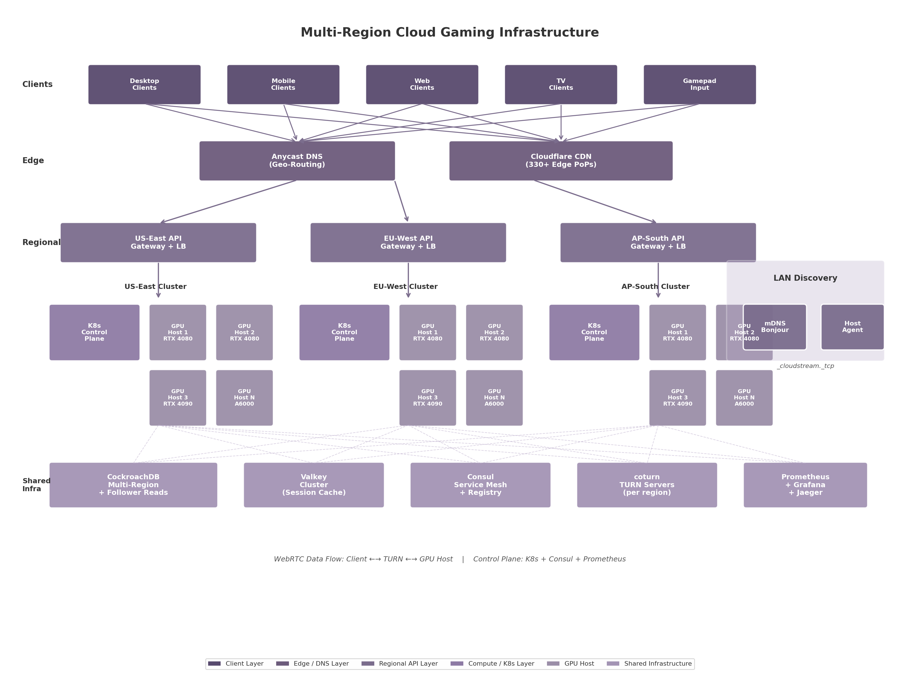
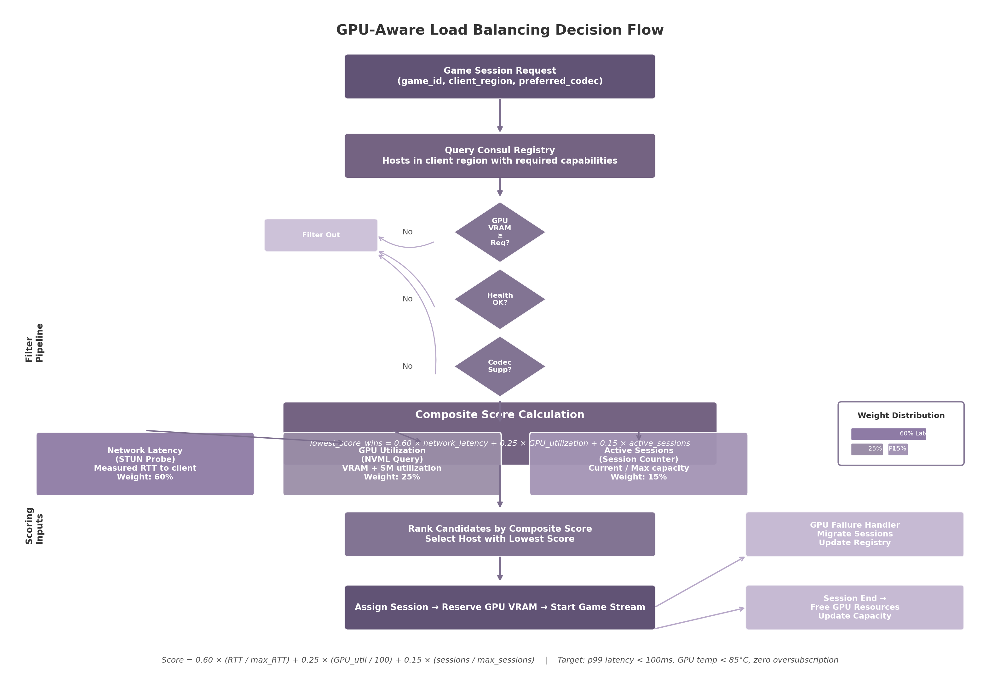

## 10. Scalability & Infrastructure Design

A cloud gaming platform serving desktop, mobile, web, and TV clients across geographically distributed users faces infrastructure demands that differ fundamentally from traditional web applications. Real-time 4K streaming with sub-50 millisecond (ms) input latency requires GPU-intensive edge compute and a control plane capable of discovering hosts, scheduling sessions, relaying traffic through restrictive networks, persisting session state across regions, and observing every layer with sub-second granularity. This chapter defines the end-to-end infrastructure architecture, progressing from host discovery through load balancing, relay infrastructure, database and caching, and observability—from single-region deployments to global platforms at 10,000+ concurrent sessions.

The diagram illustrates the full multi-region topology. Clients connect through Anycast DNS and a CDN edge layer to regional API gateways, each fronting a Kubernetes cluster of GPU-equipped gaming hosts. Shared infrastructure—CockroachDB for transactional data, Valkey for session caching, Consul for service registry, coturn for TURN relay, and Prometheus with Grafana and Jaeger for observability—spans all regions. This unified control plane enables a client in Singapore to discover a healthy GPU host in AP-South with the same reliability as a client in New York connecting to US-East.

### 10.1 Host Discovery & Registration

The discovery problem splits into two domains: the local area network (LAN), where the user's own gaming PC acts as the host, and the wide area network (WAN), where cloud-hosted GPU servers are registered centrally. Both domains must converge on a common capability model so that the load balancer can compare LAN and cloud hosts within the same scheduling framework.

#### 10.1.1 Local Discovery: mDNS/Bonjour for Same-Network Host Detection

Multicast DNS (mDNS), specified in RFC 6762 and marketed by Apple as Bonjour, is a zero-configuration networking protocol that resolves hostnames within a local broadcast domain without a centralized DNS server. It operates on UDP port 5353 using the multicast group 224.0.0.251 for IPv4 and FF02::FB for IPv6 [^549^]. Each gaming host on the LAN broadcasts a `_cloudstream._tcp` service record with a TXT record containing capability metadata: GPU model, available VRAM, supported encoder profiles, installed game identifiers, maximum output resolution, and HDR support flags.

When a client launches, it issues an mDNS browse query for `_cloudstream._tcp` services. Responses arrive within milliseconds from all reachable hosts on the same subnet, requiring no user configuration or cloud connectivity. The limitation is strict: mDNS does not traverse routers, VLANs, or VPN tunnels. For multi-subnet LANs, an mDNS reflector (such as Avahi's reflector mode) can be deployed on the core router to rebroadcast queries across subnets, though this is treated as an advanced option not enabled by default.

#### 10.1.2 Cloud Registry: REST API for Host Registration with JWT Authentication

For WAN discovery, each host registers with a centralized REST API registry on startup, authenticated via JSON Web Token (JWT). The host POSTs a registration payload to `/v1/hosts/register` containing its unique identifier, public IP address, region, and capability document. After registration, the host maintains a WebSocket connection for heartbeat signaling. Every 5 seconds, the host sends a ping; if 3 consecutive heartbeats are missed (15 seconds), the host is marked `UNHEALTHY` and removed from the scheduling pool. Once marked unhealthy, the host must re-register rather than resume heartbeats, preventing flip-flop states.

The registry backend uses Consul, which offers built-in health checking, a DNS interface, and multi-datacenter support via its gossip-based Serf layer [^502^]. Consul's SWIM-derived gossip protocol achieves $O(n)$ message load per protocol period regardless of cluster size, enabling scaling to thousands of hosts [^548^]. While Kubernetes environments can use the API server with CoreDNS, Consul spans both Kubernetes and bare-metal pools within a single namespace.

#### 10.1.3 Host Capability Advertisement

The capability document exchanged during registration—and refreshed with every heartbeat—is a JSON object that enables the load balancer to match session requirements against host resources. The schema is organized into four groups: GPU properties (`gpu.model`, `gpu.vram_mb`, `gpu.utilization_percent`, `gpu.temperature_c`), encoder properties (`encoder.type`, `encoder.codecs`, `encoder.max_sessions`), display properties (`display.max_resolution`, `display.hdr_capable`), and network location (`network.public_ip`, `region`). The `games.installed` field contains an array of game identifiers that the host can launch immediately without requiring a download. This document is stored in Consul's key-value store with a TTL tied to the heartbeat interval. When a client requests a session, the load balancer queries the registry for hosts whose installed games include the requested title and whose available VRAM exceeds the game's minimum requirement. Matching hosts are then scored using the composite algorithm defined in Section 10.2.1.

### 10.2 Load Balancing & Session Scheduling

Selecting the right host from a pool of candidates is the most performance-critical operation in the control plane: a poor choice adds tens of milliseconds to round-trip time or places the session on an overloaded GPU, producing frame drops and input lag. The scheduler implements a composite scoring algorithm weighing network proximity, GPU utilization, and session density.

#### 10.2.1 Composite Scoring Algorithm

The composite scoring formula assigns a numeric score to each candidate, with the lowest score winning:

$$S = 0.60 \times L_{norm} + 0.25 \times G_{norm} + 0.15 \times C_{norm}$$

where $L_{norm}$ is normalized network latency (STUN round-trip time divided by the 150 ms maximum), $G_{norm}$ is normalized GPU utilization (NVML SM utilization divided by 100), and $C_{norm}$ is normalized session count (active sessions divided by `encoder.max_sessions`). Latency receives the highest weight (60%) because physical distance—governed by the speed of light in fiber at approximately 200 km/ms—dominates user experience more than codec or protocol choices [^460^]. GPU utilization (25%) prevents overload; session count (15%) provides a gentle preference for less-loaded hosts. Latency is measured via STUN binding requests sent from the client to each candidate's reflexive address, yielding a more accurate estimate than ICMP ping because it traverses the actual UDP path the stream will use.

#### 10.2.2 Geographic Affinity: Anycast DNS for Regional Routing

Before composite scoring, Anycast DNS performs a coarse-grained geographic filter. Anycast is a BGP routing technique that advertises the same IP address from multiple locations, directing each client query to the nearest point of presence [^528^]. When a client resolves the API gateway hostname, Anycast returns the IP of the nearest regional edge. Within each region, the relay server queries the local Consul agent for healthy hosts, runs the composite scoring algorithm, and returns the selected host's connection details. This two-tier routing—Anycast for region selection, composite scoring for host selection—keeps cross-region traffic minimal.

#### 10.2.3 GPU-Aware Scheduling: VRAM Tracking and Oversubscription Prevention

GPU VRAM and encoder capacity are more constrained than CPU or system RAM. Research on virtualized GPU scheduling demonstrates that SLA-aware scheduling can increase average FPS by 65% while reducing excessively latent frames to 0.20% [^443^]. The vGASA (virtual GPU Adaptive Scheduling Algorithm) framework adds a PI controller feedback loop handling runtime uncertainties such as scene complexity changes, maintaining target FPS with 5–12% overhead [^444^].

This architecture adopts a simplified Enhanced SLA-Aware (ESA) policy: all sessions on a GPU run at equal priority, and new sessions are rejected if acceptance would push projected utilization above 85%, leaving headroom for frame-rate spikes. If a GPU fails—detected via NVML errors or heartbeat timeout—the session migrates to the next-best host: the client establishes a new WebRTC connection to the replacement while game state is recovered from the original host's checkpoint or last autosave.

#### 10.2.4 Table: Load Balancing Algorithm Parameters

| Parameter | Weight | Data Source | Update Frequency | Normalization Range |
|-----------|--------|-------------|------------------|---------------------|
| Network Latency (RTT) | 60% | STUN binding request | Real-time per session request | 0–150 ms |
| GPU Utilization | 25% | NVML `nvmlDeviceGetUtilizationRates` | 5-second heartbeat | 0–100% |
| Active Sessions | 15% | Host heartbeat counter | 5-second heartbeat | 0–`max_sessions` |
| GPU Temperature | Filter threshold | NVML `nvmlDeviceGetTemperature` | 5-second heartbeat | Reject if > 85°C |
| VRAM Availability | Hard filter | NVML `nvmlDeviceGetMemoryInfo` | 5-second heartbeat | Must exceed game's minimum |
| Codec Support | Hard filter | Host capability document | Per heartbeat | Must support requested codec |
| Health Status | Hard filter | Consul health check | 5-second SWIM gossip | Must be `HEALTHY` |

Network latency, GPU utilization, and active sessions form the composite score; the remaining four parameters act as hard filters that eliminate unsuitable candidates before scoring begins. The 5-second update frequency for NVML-derived metrics balances responsiveness against query overhead—NVML calls are sub-millisecond but should not be issued on every scheduling decision under high load.

The decision flow diagram illustrates the complete host selection pipeline. A session request triggers a Consul query for capable hosts in the client's region. Candidates pass through hard filters (VRAM sufficiency, health status, codec support) before entering composite scoring, where STUN-measured latency, NVML-reported GPU utilization, and session counts are weighted and summed. The lowest-scoring host receives the assignment; if that GPU fails, the failure handler migrates the session to the next-ranked candidate.

### 10.3 Relay & TURN Infrastructure

WebRTC connections ideally traverse the shortest network path directly. However, NAT devices, corporate firewalls, and symmetric NAT block direct peer-to-peer connectivity in 20–30% of WAN sessions [^441^]. For these cases, the platform deploys TURN (Traversal Using Relays around NAT) servers that relay encrypted media traffic.

#### 10.3.1 TURN Server: coturn with Ephemeral HMAC Credentials

The recommended TURN server is coturn, the most widely deployed open-source TURN server in production WebRTC infrastructure [^507^]. It supports UDP relay as the primary transport—minimizing latency for real-time video—and TCP fallback on port 443 with TLS for environments where UDP is blocked. Authentication uses ephemeral HMAC-SHA1 credentials generated server-side: when a client requests a session, the API generates a short-lived username-password pair (24-hour validity) using a shared secret. These credentials are included in the ICE server configuration delivered to the client. For Go-native deployments, Pion/TURN provides a programmable alternative that integrates into the service mesh, though coturn remains the production recommendation due to maturity [^507^].

#### 10.3.2 Relay Topology: Regional Clusters Co-Located with Host Pools

TURN relay bandwidth is the primary scaling cost. A single 4K60 stream at 25 Mbps consumes 50 Mbps of aggregate relay bandwidth (bidirectional). At 10,000 concurrent users with a 25% relay rate, 2,500 relayed sessions require 125 Gbps of aggregate TURN bandwidth [^441^]. To minimize cost, TURN servers deploy in regional clusters co-located with GPU host pools, keeping relay traffic local. Self-hosted TURN on bare metal with unmetered bandwidth reduces costs by an order of magnitude versus cloud egress: 125 Gbps costs approximately $15,000–30,000/month on bare metal versus $1.73 million on AWS at $0.07/GB [^498^].

#### 10.3.3 P2P vs Relayed: Direct-First with Relay Fallback

The WebRTC ICE framework automatically attempts the cheapest connection path first. The prioritization order is: (1) direct host-to-client via local network, (2) direct via reflexive (public IP) addresses through NAT, (3) relay via TURN server. This prioritization requires no application-level logic—the ICE agent handles it transparently.

Empirical data from WebRTC deployments indicates that approximately 80% of LAN sessions establish direct connections without traversing any relay [^532^]. For WAN sessions, 70–80% of connections succeed via direct NAT traversal using STUN, leaving 20–30% that require TURN relay. Corporate environments with managed firewalls push this relay rate to 60–70% [^532^]. The platform should provision TURN capacity for at least 30% of concurrent WAN sessions to handle peak loads during business-hour gaming from corporate networks.

### 10.4 Database & Caching Architecture

A cloud gaming platform generates a diverse set of data workloads: transactional player profiles, time-series session metrics, semi-structured game metadata, and high-velocity session state. No single data store can optimally serve all of these workloads. This section defines a polyglot persistence architecture that assigns each data category to the store best matched to its access pattern, consistency requirements, and query load.

#### 10.4.1 Primary Database: CockroachDB Multi-Region with Follower Reads

The system of record is CockroachDB, a distributed SQL database built on multi-raft consensus that provides horizontal scalability across regions. It is selected over PostgreSQL (vertical scaling only) and alternatives such as TiDB or YugabyteDB due to native multi-region primitives and proven gaming backend performance [^446^].

Three features are critical. First, follower reads allow queries to read slightly stale data from local replicas. A follower-read query returns data in approximately 3 ms from any region, compared to 430 ms for a strongly consistent read traversing WAN links—an 8× improvement [^538^]. Second, multi-region table localities (`REGIONAL BY TABLE`, `REGIONAL BY ROW`, `GLOBAL`) pin data near the users who access it most: player profiles use `REGIONAL BY ROW` so US player data resides in US-East, while leaderboards use `GLOBAL` for low-latency reads everywhere. Third, non-voting replicas enable follower reads without increasing write quorum size [^537^].

#### 10.4.2 Cache Layers: Valkey for Session State and Local LRU for Assets

Above the primary database, a Valkey cluster (the Linux Foundation's open-source Redis fork, BSD 3-clause licensed) handles session state, rate limiting, and hot catalog data [^480^]. Valkey is chosen over Redis 8.x due to the 2024 license change to SSPL and because it is now the default for AWS ElastiCache and Google Cloud Memorystore. It has been tested at 2,000-node scale with 1 billion requests per second; migration from Redis is a binary replacement [^480^].

Session state—including active host assignments, WebRTC ICE candidates, and ephemeral TURN credentials—is cached with a 5-minute TTL, sitting in the hot path of every scheduling decision. Game catalog metadata is cached for 1–24 hours with misses served from CockroachDB. Client-side, a local LRU cache stores 4K cover art and screenshots, capped at 256 MB per device.

#### 10.4.3 Table: Data Store Selection Matrix

| Data Category | Primary Store | Secondary / Cache | Rationale |
|---------------|--------------|-------------------|-----------|
| Player Profiles | CockroachDB (`REGIONAL BY ROW`) | Valkey (15-min TTL) | Strong consistency for auth; follower reads for low-latency queries |
| Active Sessions | Valkey (hash) | Local client cache | High-velocity, short-lived; 5-min TTL matches session lifecycle |
| Session History | CockroachDB (time-series) | — | Append-only audit log; partitioned by month for query efficiency |
| Game Metadata | CockroachDB (JSONB) | CDN edge cache (24-hr) | Semi-structured schema; CDN offloads image delivery |
| Leaderboards | CockroachDB (`GLOBAL`) | Dragonfly (1-min TTL) | High read throughput; eventual consistency acceptable |
| Host Registry | Consul KV + SWIM gossip | In-memory LB cache | Sub-second health state; gossip protocol scales to thousands of hosts |
| TURN Credentials | Valkey (string) | — | Ephemeral 24-hr HMAC credentials; generated per session request |
| Rate Limiting | Valkey (Sliding window) | — | Counter increments must be atomic; Redis atomic ops ideal |

The selection matrix above maps each of the eight major data categories to its optimal persistence layer. The assignment follows a simple heuristic: transactional data with cross-region consistency requirements lands in CockroachDB; high-velocity, short-lived, or eventually-consistent data lands in Valkey; and static or slowly-changing assets are pushed to the CDN edge. Host registry data is a special case: Consul's key-value store combined with the SWIM gossip protocol provides sub-second failure detection and health propagation that no SQL database can match [^548^].

### 10.5 Monitoring & Observability

Operating a real-time streaming platform without comprehensive observability leaves the operations team unable to diagnose the root cause of user-reported stuttering or input lag. This section defines the metrics, tracing, and alerting infrastructure that enables rapid incident diagnosis.

#### 10.5.1 Metrics: Prometheus with Custom Collectors

Prometheus, the de facto standard for metrics collection in Kubernetes environments, serves as the primary time-series database [^485^]. The platform deploys Prometheus with three categories of collectors. First, the standard node exporter captures host-level metrics: CPU utilization, system memory consumption, disk I/O, and network throughput. Second, the NVIDIA Data Center GPU Manager (DCGM) exporter exposes 100+ GPU-specific metrics including streaming multiprocessor (SM) utilization, memory bandwidth, die temperature, encoder queue depth, and frame buffer usage [^440^]. DCGM metrics are scraped at 15-second intervals for real-time alerting on thermal conditions or encoder saturation. Third, custom application exporters embedded in the session scheduler, host agent, and API gateway emit business-level metrics: end-to-end streaming latency, encode time per frame, frame drop rate, input lag, active session count, and relay bandwidth utilization.

The "Golden Signals" for cloud gaming are defined as: latency (end-to-end frame delivery time from capture to display), traffic (active sessions and bitrate per session), errors (session failure rate and encoding errors), and saturation (GPU utilization, VRAM consumption, encoder queue depth, and relay bandwidth) [^485^]. These four signals are displayed on the primary Grafana dashboard and are the first data points an on-call engineer consults during an incident.

#### 10.5.2 Tracing: Jaeger with OpenTelemetry Go SDK

While metrics reveal *that* a problem exists, distributed tracing reveals *where* it exists. Jaeger—originally developed at Uber and now a Cloud Native Computing Foundation graduated project—traces requests as they propagate through the microservice architecture [^519^]. Every service in the platform is instrumented with the OpenTelemetry Go SDK, which generates trace spans at key boundaries: API gateway request entry, session scheduler host selection, Consul registry query, host agent session establishment, WebRTC ICE negotiation, and TURN relay allocation. Trace context is propagated across service boundaries using the W3C Trace Context standard, ensuring that a single trace ID follows a session request from the client through every backend service.

The OpenTelemetry Collector aggregates spans, applies tail-based sampling (retaining 100% of traces containing errors or latency exceeding 100 ms, and sampling 5% of normal traffic), and forwards the result to Jaeger for storage and visualization. Distributed tracing adds 1–3% overhead to request latency when properly implemented with sampling [^519^]—an acceptable cost for the diagnostic capability it provides. During a latency incident, a Jaeger trace can pinpoint whether the bottleneck lies in the scheduler's Consul query (indicating registry overload), the host's NVML polling (indicating GPU driver latency), or the ICE negotiation (indicating TURN relay congestion).

#### 10.5.3 Alerting: Grafana Alert Rules

Grafana provides visualization dashboards and alert rule evaluation. Alerts are configured with severity levels and routed through AlertManager to on-call engineers via PagerDuty. The table below defines the primary alert thresholds:

| Metric | Threshold | Severity | Evaluation Window | Action |
|--------|-----------|----------|-------------------|--------|
| Streaming latency (p99) | > 100 ms | Critical | 5 minutes | Page on-call; investigate TURN and GPU queues |
| GPU temperature | > 85°C | Warning | 2 minutes | Throttle non-critical sessions; prepare migration |
| Session failure rate | > 1% | Critical | 3 minutes | Page on-call; check host health registry |
| Relay bandwidth utilization | > 80% capacity | Warning | 10 minutes | Scale TURN servers or redirect to alternate region |
| Frame drop rate | > 2% | Warning | 5 minutes | Reduce encoder load or migrate session |
| Host heartbeat miss | 3 consecutive failures | Critical | 15 seconds | Remove host from pool; trigger session migration |
| API error rate | > 0.5% | Warning | 5 minutes | Investigate upstream dependency health |
| Database query latency (p99) | > 50 ms | Warning | 5 minutes | Check for slow queries or replica lag |

The alerting thresholds above are derived from the platform's service-level objectives (SLOs). The most critical metric is end-to-end streaming latency: a p99 value exceeding 100 ms degrades the experience for competitive gaming titles where reaction times are measured in tens of milliseconds. GPU temperature exceeding 85°C triggers a warning because thermal throttling begins on most NVIDIA GPUs at 83°C, and sustained operation above this threshold reduces clock speeds and can cause encoding artifacts. The 15-second heartbeat failure detection, powered by Consul's SWIM gossip layer, is the fastest path to removing a failed host from the scheduling pool before it is assigned new sessions [^548^].

Taken together, these five infrastructure layers—host discovery, load balancing, relay infrastructure, database and caching, and observability—provide a complete foundation for scaling a cloud gaming platform from a single LAN deployment to a globally distributed service. The architecture prioritizes latency above all else, recognizing that for real-time interactive streaming, the speed of light in fiber is the ultimate constraint, and every infrastructure decision—from Anycast DNS placement to follower read configuration—must serve the goal of delivering sub-50 millisecond game streams to every user, regardless of geography.
