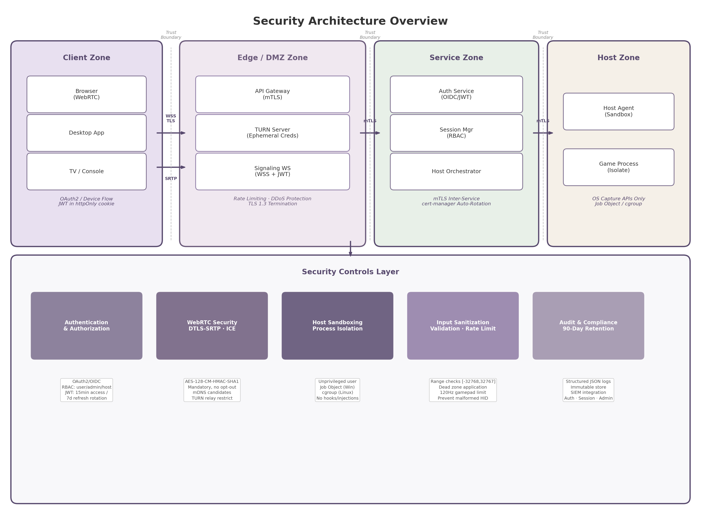

## 11. Security Architecture

A cloud gaming platform exposes remote hosts directly to internet-connected clients, creating an attack surface that spans authentication protocols, real-time media streams, host operating systems, and inter-service communication. The security architecture must simultaneously protect user data, prevent unauthorized host access, maintain anti-cheat compatibility, and ensure that media streams cannot be intercepted or tampered with. Figure 11-1 presents the overall security architecture, organized into four trust zones — Client, Edge/DMZ, Service, and Host — with security controls layered beneath each zone.

*Figure 11-1. Security architecture overview showing four trust zones (Client, Edge/DMZ, Service, Host) and the cross-cutting security controls layer. Solid arrows indicate encrypted communication channels (WSS/TLS, mTLS, SRTP). Dashed lines mark trust boundaries between zones.*

The following sections examine each security layer in detail, moving from client-facing authentication through media encryption, host isolation, and infrastructure hardening.

### 11.1 Authentication & Authorization

#### 11.1.1 OAuth2/OIDC Identity Federation

The platform delegates identity management to an external Identity Provider (IdP) implementing OpenID Connect (OIDC) 1.0 layered over OAuth 2.0. OIDC profiles OAuth 2.0 for authentication and mandates JSON Web Token (JWT) as the format for identity assertions, a pattern implemented by both Google and Microsoft identity platforms [^1^]. Three IdP options are evaluated: Auth0 for rapid development with extensive SDKs and multi-factor authentication; Keycloak for open-source, self-hosted deployments requiring full control; and Authentik as a lightweight alternative with modern UI. Two OAuth 2.0 flows serve different client categories. Browser and desktop clients use the Authorization Code flow with Proof Key for Code Exchange (PKCE), which prevents authorization code interception by public clients. TV and console clients — devices with limited input capabilities or no suitable browser — use the OAuth 2.0 Device Authorization Grant defined in RFC 8628 [^2^]. This flow decouples authentication from the device requesting access: the constrained device displays a user code and verification URI, while the user authenticates on a secondary device such as a smartphone. RFC 8628 explicitly lists "smart TVs, media consoles, picture frames, and printers" as target devices, making it purpose-built for the TV/console game streaming use case [^2^].

#### 11.1.2 JWT Token Design

The token architecture follows the principle of least exposure. Access tokens are short-lived, with a validity window of 15 minutes, limiting the impact of token theft. Refresh tokens carry a 7-day lifetime and are stored in httpOnly, Secure, SameSite=Strict cookies to prevent exfiltration via cross-site scripting (XSS). Token signing uses the RS256 algorithm (RSA with SHA-256), with the private key held exclusively by the IdP and the public key distributed to validating services. Key rotation is performed on a scheduled basis, with services fetching updated public keys from the IdP's JWKS (JSON Web Key Set) endpoint without requiring deployment changes.

Refresh token rotation provides an additional defense-in-depth measure. Each time a refresh token is used to obtain a new access token, a new refresh token is issued and the previous one is revoked. When reuse of a previously rotated token is detected — indicating potential theft — the entire token family is immediately invalidated, forcing both the attacker and the legitimate user to re-authenticate [^3^]. Best practices also include SHA-256 hashing of refresh tokens before database storage, device fingerprinting (IP address and user-agent analysis) for anomaly detection, and an absolute session limit of 30 days to bound exposure [^3^].

#### 11.1.3 Role-Based Access Control

The platform defines four roles with distinct permission boundaries, summarized in Table 11-1. Each role maps to a specific set of API scopes that are embedded in the access token as claims and enforced at the API gateway layer.

| Role | Scope | Permitted Actions | Denied Actions |
|------|-------|-------------------|----------------|
| `user` | `game:play`, `game:browse`, `stream:view`, `stream:control` | Launch and play games from the catalog; browse available titles; receive and control streams | Host management, user administration, brand configuration |
| `admin` | `user` scopes + `host:*`, `user:*`, `session:*`, `audit:read` | Allocate and deallocate hosts; manage user accounts; terminate sessions; read audit logs | Direct stream access without session binding, brand configuration |
| `host` | `host:register`, `host:heartbeat`, `session:report` | Register with the orchestrator; send health metrics; report session status | Game catalog access, user management, any admin function |
| `whitelabel` | `brand:read`, `brand:write`, `theme:*` | Configure brand colors, logos, and themes; customize client appearance | Host operations, user data access, game catalog modification |

*Table 11-1. Role-based access control matrix defining the four platform roles, their assigned scopes, permitted actions, and explicit denials. The `host` role is restricted to service account operations for the host agent daemon.*

The `host` role is a service account used exclusively by the host agent daemon, with the minimal permissions required to register and report health. The `whitelabel` role supports tenant-level brand customization without exposing host or user data. The API gateway enforces both signature validity and scope membership before forwarding any request.

### 11.2 WebRTC Security

#### 11.2.1 DTLS-SRTP Encryption

WebRTC enforces mandatory encryption on every media and data channel at the specification level, with no opt-out path available. Browser vendors implement this independently, meaning no configuration is required and no mechanism exists to send unencrypted audio or video even by accident [^4^]. The encryption stack combines two protocols: Datagram Transport Layer Security (DTLS) for key negotiation, and Secure Real-time Transport Protocol (SRTP) for media encryption.

The DTLS-SRTP handshake follows a five-step sequence: SDP fingerprint exchange, DTLS ClientHello/ServerHello after ICE connectivity checks, certificate exchange with fingerprint verification, SRTP key derivation via the `use_srtp` extension per RFC 5764, and SRTP context initialization [^4^]. The fingerprint verification against the SDP is the core MITM protection. The mandatory SRTP cipher suite is SRTP_AES128_CM_HMAC_SHA1_80, providing AES-128 counter-mode encryption, HMAC-SHA1 authentication tags, and replay protection [^5^]. The ecosystem is migrating from DTLS 1.2 to DTLS 1.3 (RFC 9147), which reduces the handshake from two round trips to one and improves Perfect Forward Secrecy [^4^].

#### 11.2.2 Signaling Security

The signaling channel is the highest-severity WebRTC vulnerability surface. If signaling runs over plain WebSocket (ws://) rather than Secure WebSocket (wss://), an attacker on the network path can intercept the SDP offer/answer, replace both peers' DTLS fingerprints with their own, and establish separate DTLS sessions with each peer — a complete MITM attack on the media stream [^4^]. RFC 8827 explicitly states that signaling channel security is a prerequisite for DTLS-SRTP protections to hold. The platform therefore mandates WSS (WebSocket over TLS 1.3) for all signaling communication.

Authentication on the signaling channel uses JWT validation at the WebSocket proxy layer before the WebRTC handshake proceeds. The standard approach passes the JWT in the `Sec-WebSocket-Protocol` header alongside the stream session identifier; a proxy such as Envoy validates the token against the IdP's JWKS endpoint and rejects the connection if the token is invalid, expired, or lacks the required `stream:view` scope [^6^]. This ensures that only authenticated, authorized users can initiate a WebRTC peer connection. Parsec, an established game streaming platform, uses a similar model: each user has a randomly generated SSL certificate validated via the Parsec backend, and each connection uses a one-time connection token sent after the DTLS handshake is established [^7^].

#### 11.2.3 ICE Privacy

WebRTC ICE (Interactive Connectivity Establishment) candidate gathering exposes the client's public IP address during connection setup. Modern Chromium-based browsers mitigate local IP leakage by obfuscating local network addresses using mDNS (Multicast DNS) hostnames — a UUID with `.local` suffix replaces the raw IP address in host candidates [^8^]. However, public IPs remain exposed via STUN (Session Traversal Utilities for NAT) discovery, creating a privacy risk for users behind VPNs whose public IP may differ from the VPN endpoint.

The platform implements three additional mitigations. First, TURN (Traversal Using Relays around NAT) server relay IPs are restricted to registered, authenticated users only — the TURN REST API (draft-uberti-behave-turn-rest-00) provides ephemeral, time-limited credentials where the username contains an expiration timestamp and the password is computed as base64(HMAC-SHA1(shared_secret, username)) [^9^][^10^]. Second, the platform supports a relay-only mode that forces all traffic through the TURN server, concealing both peers' public IPs from each other. Third, ICE candidate gathering is delayed until after the signaling channel has authenticated the user, preventing unauthorized parties from triggering STUN requests that could enumerate network topology.

### 11.3 Host Agent Security

#### 11.3.1 Host Sandboxing

The host agent — the process responsible for capture, encoding, and stream management — runs as an unprivileged user account with no administrative rights. Game processes launched by the agent execute in separate isolation boundaries: on Windows, a Job Object enforces restrictions including forbid system-wide changes, desktop switching, clipboard access, Windows message broadcasts, global hooks, and atom table access, with active process limits preventing fork-bomb attacks [^11^][^12^]. The Chromium browser uses this same model, with each renderer running under a Job Object with all restrictions active, establishing it as a gold-standard reference for Windows process sandboxing [^11^].

On Linux, the host agent combines seven namespace types (PID, network, mount, UTS, IPC, user, cgroup) plus seccomp-BPF for system call filtering and capability dropping to isolate the game process [^13^][^14^]. gVisor provides a stronger alternative by interposing a user-space kernel (Sentry) between the application and host kernel. Where a standard container shares approximately 340 syscalls with the host kernel, gVisor intercepts all of them in user space, reducing the attack surface to the Sentry's limited host syscall footprint [^15^][^16^].

#### 11.3.2 Anti-Cheat Compatibility

Cloud gaming is "architecturally the ultimate anti-cheat" because no game client code runs on the user's machine — only video is streamed — reducing the cheat attack surface to input manipulation and video analysis [^17^]. However, the host machine itself must appear completely clean to kernel-level anti-cheat systems. Easy Anti-Cheat (EAC) uses a kernel driver that performs hook detection, memory scans, driver scanning, stack walking, and hypervisor detection, including executing a `vmread` CPU instruction to detect virtualized environments [^18^]. BattlEye (BEDaisy.sys) registers callbacks for process creation, thread creation, image loading, and object handle operations and can actively scan system-wide memory for cheat artifacts [^19^].

The platform mitigates anti-cheat triggers through a strict policy: only OS-provided capture APIs are permitted. On Windows, this means DXGI Desktop Duplication API (DDA); on macOS, ScreenCaptureKit; on Linux, PipeWire or DMA-BUF. These are official operating system APIs that do not require DLL injection, API hooking, or kernel driver installation — techniques that anti-cheat systems flag as suspicious [^18^]. The platform avoids hook-based capture methods (such as those used by OBS before its DDA migration) and any form of code injection into the game process. Virtual controller input is injected through signed, WHQL-certified drivers where possible, with unsigned drivers treated as high risk for anti-cheat flagging.

#### 11.3.3 Input Sanitization

The controller input channel accepts gamepad, keyboard, and mouse inputs from remote clients and injects them into the host game process. This channel is a significant attack surface: malformed HID (Human Interface Device) reports could exploit vulnerabilities in the host's input processing, rapid automated inputs could constitute cheating or trigger buffer overflows, and excessive input rates could constitute a denial of service [^20^].

All input packets undergo server-side validation before injection. Schema validation enforces strict packet structure: button masks must use defined bit positions, analog stick values must fall within the 16-bit signed integer range [-32768, 32767], and trigger values must fall within [0, 255]. Rate limiting caps gamepad input at 120 Hz and mouse input at 1000 Hz, matching the maximum polling rates of standard hardware. Dead zone application is performed server-side to prevent sub-threshold values from being injected, and temporal analysis detects inhuman input patterns such as frame-perfect repeated inputs that may indicate automated scripts or macros. Capability separation ensures that input injection runs in a separate process with minimal privileges, so that even if the input channel were compromised, the attacker would not gain control over the broader host agent or game process.

### 11.4 Infrastructure Security

#### 11.4.1 mTLS for Inter-Service Communication

All communication between platform services uses mutual TLS (mTLS), which extends traditional TLS by requiring both the client and the server to present valid certificates during the connection handshake. This creates cryptographically verified identities for every participant — not just the server proving its identity to the client, but both parties proving their identities to each other [^21^]. A service mesh (Istio or Linkerd) implements mTLS via sidecar proxies that attach to each microservice; the control plane manages certificate distribution and security policies while the data plane enforces mTLS between services without requiring application code changes [^22^][^23^].

Certificate management is automated using cert-manager, a Kubernetes add-on that handles issuance, renewal, and management [^24^]. Public-facing services use certificates from Let's Encrypt via the ACME protocol. Internal service-to-service mTLS uses a private Certificate Authority (CA) managed by cert-manager's CA Issuer, which automates certificate issuance from an internal root or intermediate CA stored as a Kubernetes secret [^25^]. Best practices include using intermediate CAs in production to limit blast radius, setting CA certificate validity to 10 years while leaf certificates rotate every 90 days, and storing CA private keys with encryption at rest or in an external Hardware Security Module (HSM). Separate CAs are maintained for development, staging, and production trust domains to prevent cross-environment certificate validation.

#### 11.4.2 Rate Limiting

Rate limiting is implemented at multiple layers of the request path to prevent abuse and ensure fair resource allocation. Table 11-2 defines the rate limiting tiers, each targeting a specific attack vector.

| Layer | Limit | Scope | Attack Vector Mitigated |
|-------|-------|-------|------------------------|
| REST API | 100 requests/minute | Per source IP | Brute force enumeration, credential stuffing, scraping |
| Session creation | 10 creations/minute | Per authenticated user | Resource exhaustion, automated session farming |
| Host connections | 50 connections/minute | Per host agent | Connection flooding, host overload |
| TURN credential API | 10 requests/minute | Per authenticated user | Credential harvesting for relay abuse |
| Signaling WebSocket | 5 connections/minute | Per source IP | Signaling channel DoS, connection exhaustion |
| Stream start | 3 starts/minute | Per authenticated user | CDN bandwidth abuse, GPU resource exhaustion |

*Table 11-2. Multi-layer rate limiting configuration showing per-tier limits, enforcement scope, and the specific attack vector each tier mitigates. Limits are enforced at the API gateway and TURN server boundaries.*

The token bucket algorithm is used for all rate limiters, allowing short bursts while enforcing sustained rate limits. Application-level rate limiting is complemented by network-level filtering through iptables or nftables rules [^26^]. TURN servers face both direct DoS (connection flooding, bandwidth exhaustion) and indirect reflection/amplification attacks; although TURN amplification factors are low single digits, misconfigured public servers make them attractive DDoS targets [^27^]. The credential API itself must be protected with authentication and rate limiting — an unprotected endpoint renders TURN authentication useless [^28^].

#### 11.4.3 Audit Logging

All security-relevant events are captured in structured JSON audit logs and forwarded to an immutable store with 90-day hot retention and one-year cold archival. Five event categories are logged: authentication (success, failure, token refresh), session (creation, termination), host (allocation, pairing, health changes), admin (user management, configuration changes), and security (rate limit violations, anomalous input patterns, anti-cheat alerts). Each entry includes timestamp, actor identifier, action type, affected resource, and source IP [^29^].

Central aggregation uses the ELK stack or cloud-native alternatives (Grafana Loki, AWS CloudWatch Logs), with real-time SIEM integration to detect patterns such as multiple authentication failures from a single IP or refresh token reuse indicating potential theft [^30^]. For forensic investigations, logs are backed up to write-once, tamper-evident storage. Logs containing personally identifiable information are flagged for data protection compliance, with automated retention policies that purge or anonymize data according to jurisdictional requirements.

The security architecture establishes defense in depth across four trust zones. Client authentication uses OAuth2/OIDC with short-lived tokens and refresh rotation. Media streams are protected by WebRTC's mandatory DTLS-SRTP encryption with secured signaling. Host agents run in process sandboxes using only OS-provided capture APIs to maintain anti-cheat compatibility. Infrastructure communication uses mTLS with automated certificate rotation, multi-layer rate limiting prevents abuse at the edge, and audit logging provides forensic visibility. Each control fails safely: a compromised token has bounded lifetime, a breached host agent has limited privileges, and a stolen certificate triggers automatic revocation through the service mesh.
