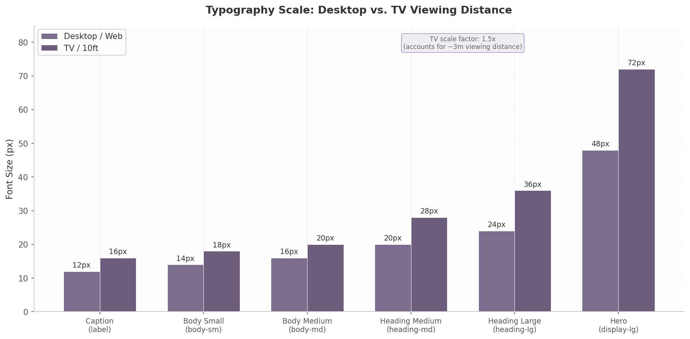

## 14. Wireframes & UI/UX Specifications

### 14.1 Design System Overview

The platform's visual foundation is a three-tier design token system — primitive, semantic, and component — enabling per-tenant theming without restarts. This follows the W3C Design Tokens Community Group specification (v2025.10), supported by Style Dictionary v4.0 [^624^]. The system separates visual concerns from component logic, allowing the white-label portal to inject brand values at runtime via CSS custom properties [^606^].

#### 14.1.1 Layout Grid

The platform employs a 12-column responsive grid with 24 px gutters and a 1200 px maximum content width on desktop. TV layouts use a 5% overscan safe area (48 dp left/right, 27 dp top/bottom at 1080p) per Android TV and Google TV guidelines [^715^][^727^]. Background elements such as hero artwork and ambient blur may render outside the safe area, but all interactive UI elements remain within the content-safe rectangle. The grid collapses to 8 columns on tablet and 4 columns on mobile, with gutters reducing proportionally. Jetpack Compose for TV (`androidx.tv.material3:1.0.0+`) provides the `Carousel` and `ImmersiveList` components for this pattern [^793^][^803^].

#### 14.1.2 Typography

The type system uses platform-native font families for optimal rendering performance: Inter (desktop/web), Roboto (Android/TV), and San Francisco (iOS). A six-level scale spans from caption (12 px) to hero (48 px on desktop, 72 px on TV), with each level mapped to semantic tokens (`label`, `body-sm`, `body-md`, `heading-md`, `heading-lg`, `display-lg`). The TV scale factor of 1.5x accounts for a typical viewing distance of approximately 3 metres, ensuring text remains legible under living room conditions [^641^]. The following chart illustrates the desktop-to-TV size relationship across all six levels.

*Figure 14.1 — Typography scale comparison between desktop and TV viewing distances. TV sizes are multiplied by a 1.5x factor to account for the approximately 3-metre viewing distance typical of living room environments. Source: Octopus Design System [^641^].*

#### 14.1.3 Spacing

The spacing system uses an 8 px base unit with eleven tokens: 0, 4, 8, 12, 16, 24, 32, 48, 64, 96, and 128 px. Three density modes — compact, comfortable (default), and spacious — adjust these values to accommodate different user preferences and screen sizes. The density tokens affect grid gap, card padding, border radius, and title size simultaneously, as shown in Table 14.1.

**Table 14.1 — Spacing Token System and Density Mode Mappings**

| Token | Value (px) | Compact Mode | Comfortable Mode | Spacious Mode | Common Usage |
|-------|-----------|--------------|------------------|---------------|--------------|
| `spacing-0` | 0 | — | — | — | Collapsed margins |
| `spacing-1` | 4 | Icon padding | Tight internal gaps | — | Tight inline spacing |
| `spacing-2` | 8 | Grid gap, card padding | Compact list item gap | — | Card internal padding |
| `spacing-3` | 12 | Card title size | Card padding | — | Standard component gap |
| `spacing-4` | 16 | — | Grid gap (mobile) | Card padding | Default gap |
| `spacing-5` | 24 | — | Desktop grid gap | Grid gap | Section padding |
| `spacing-6` | 32 | — | Section padding | Card border radius | Card elevation padding |
| `spacing-7` | 48 | — | Large component gap | Section padding | Major section divider |
| `spacing-8` | 64 | — | Page-level margin | Large component gap | Page padding |
| `spacing-9` | 96 | — | Hero section padding | Page-level margin | Feature block spacing |
| `spacing-10` | 128 | — | — | Hero section padding | Full-bleed sections |

The density mode is stored in `localStorage` and applied via a `data-density` attribute. Game card border radius scales with density (8 px / 12 px / 16 px), and the image aspect ratio shifts from 2:3 in compact/comfortable modes to 16:9 in spacious mode.

#### 14.1.4 Motion

All transitions use a decelerate easing curve (`cubic-bezier(0.0, 0.0, 0.2, 1)`) with two standard durations: 150 ms for micro-interactions and 300 ms for emphasis animations. The system respects the `prefers-reduced-motion` media query, supported in all modern browsers since January 2020 [^646^]. When reduced motion is detected, transitions collapse to 0.01 ms with `animation-iteration-count: 1`, preserving functional state changes without visual motion. Parallax effects, ambient art animation, and card hover scaling are gated behind this preference check.

### 14.2 Landing Screen Wireframe

#### 14.2.1 PS4 Pro-Inspired Layout

The landing screen follows the horizontal shelf pattern from the PlayStation 4 and 5, with content organised into horizontally scrolling rows of game tiles against a full-screen background [^629^][^868^]. The background displays a heavily blurred version (40 px Gaussian blur, 0.6 opacity) of the most recently played game's hero artwork, shifting dynamically as the user navigates. Four shelves occupy the vertical space: "Continue Playing", "Recently Added", "Favorites", and "All Games" — each a horizontally scrollable row with snap-to-item behaviour. The PS5 philosophy of keeping the UI "minimal so that it does not get in the way of gameplay" informs this layout [^630^]: shelves use a semi-transparent background with the active shelf brightening to full opacity while inactive shelves dim.

#### 14.2.2 Navigation

The top bar spans the full viewport with the user's avatar (40 px) on the left, tenant logo centred, and settings plus search icons on the right. On desktop, a collapsible left sidebar (240 px, collapses to 64 px) provides category shortcuts. On TV, the sidebar is hidden; navigation relies on D-Pad traversal within shelves [^719^].

Focus management follows Android TV conventions: D-Pad up/down moves between shelves, left/right scrolls within a shelf, and Enter/A selects a game [^722^]. Explicit `nextFocusDown` and `nextFocusUp` attributes on each shelf container guarantee predictable vertical navigation, since the proximity-based focus algorithm produces ambiguous results with staggered card positions [^719^].

#### 14.2.3 Game Card

Each game card displays cover art at a 2:3 aspect ratio (portrait orientation, 600x900 px at 1x, 1200x1800 px for 4K displays). The title renders as a white text overlay at the bottom of the card with a linear gradient scrim (`rgba(0,0,0,0) → rgba(0,0,0,0.8)`) ensuring legibility across variable artwork. The card has three visual states: default (scale 1.0, elevation 0), hover/focus (scale 1.05, elevation 8 px shadow, 2 px border glow in brand primary colour), and pressed (scale 0.98). The focus state animation uses the 150 ms standard transition with decelerate easing. On TV, the focused card also updates the full-screen background ambient image to that game's hero artwork, creating a parallax-like effect without actual parallax scrolling.

#### 14.2.4 Empty State

When no host is connected and the library is empty, the landing screen displays an animated SVG gamepad illustration (looping at 2-second intervals) centred in the viewport with the heading "No Games Yet" and the subtext "Connect a host PC to start streaming your library." A primary CTA button — "Set Up a Host" — triggers the host pairing wizard (described in Section 14.6.4). The background displays a static, dark gradient instead of game artwork. The empty state illustration respects `prefers-reduced-motion` by displaying a static frame when motion reduction is enabled [^648^].

### 14.3 Game Library Screen Wireframe

#### 14.3.1 Three View Modes

The library screen supports three distinct view modes toggled via a segmented control in the top-right corner. **Grid view** (default) displays 6 columns on desktop (4 on tablet, 2 on mobile) using the same 2:3 cover art cards as the landing screen. **List view** presents compact rows (72 px height) showing a 48x48 px thumbnail, game title, developer, last played date, and a "Play" action button — optimised for quickly scanning large collections. **Cover Flow view** implements a 3D carousel with the centred item at full scale (1.0) and flanking items scaled to 0.75 with a 15-degree Y-rotation and 50% opacity fade, creating a console-like immersive browsing experience intended primarily for TV use. The view mode preference persists in `localStorage` and defaults to grid on desktop, cover flow on TV.

#### 14.3.2 Filter Sidebar

A collapsible filter sidebar (320 px wide on desktop, full-screen modal on mobile) provides five filter categories: genre (multi-select checkboxes, populated from IGDB genre taxonomy), platform (toggle chips for Windows/macOS/Linux), release year (range slider, 1990 to current year), rating (1-5 star selector), and multiplayer mode (toggle for online/local/co-op). Active filters render as removable chips above the content area. The sidebar uses a slide-in transition (300 ms, from left) and can be toggled via a filter icon in the top bar. On TV, filters are accessible through a long-press menu on the Select button, presenting a bottom sheet overlay optimised for D-Pad navigation.

#### 14.3.3 Sort Options

A dropdown menu provides five sort keys: "Recently Played" (default), "Alphabetical", "Release Date", "Rating", and "Playtime". An adjacent toggle switches between ascending and descending order. The sort is applied at the query level for server-side pagination and at the client level for cached results, ensuring sub-100 ms response time on collections up to 5,000 titles.

#### 14.3.4 Search

A real-time search bar positioned at the top of the library (full width on mobile, 480 px on desktop) executes queries with a 300 ms debounce to avoid excessive API calls. Results appear in an instant dropdown showing game cover thumbnails (48x72 px), title, developer, and release year. The search queries the local cache first (indexed via SQLite FTS5) and falls back to the server API only for uncached titles. An empty search state displays "No games found" with three suggested actions: "Check spelling", "Browse all games", and "Add a game manually". Voice search integration on Android TV uses the `ContentProvider` pattern with `searchable.xml` configuration, where the system calls `query()` each time a letter is typed [^859^][^860^].

### 14.4 Game Detail Screen Wireframe

#### 14.4.1 Hero Section

The game detail screen opens with a full-width hero section (3840x1240 px at 2x for 4K) overlaid with a bottom gradient scrim (`rgba(0,0,0,0) → rgba(0,0,0,0.85)`). Within the scrim, the game title renders at `display-lg` in bold, followed by a metadata row (developer, publisher, release year, genre tags, rating). Below, the primary "Play" button (filled, brand primary, 48 px height) sits left with secondary actions: "Add to Favorites", "Share", and "More Options". The button label reads "Resume" when a saved session exists.

#### 14.4.2 Media Gallery

Below the hero, a horizontally scrollable gallery displays up to 12 screenshot thumbnails at 480x270 px with 8 px gaps. Clicking opens a lightbox with full-resolution display and keyboard navigation. The first slot contains an auto-playing muted trailer (HTML5 video with `autoplay muted playsinline loop`) that plays when visible and pauses when off-screen [^758^]. Auto-play can be disabled in settings.

#### 14.4.3 Details Panel

The details panel occupies the full content width below the media gallery, organised into four tabbed sections: **Description** (full game synopsis, up to 2,000 characters), **System Requirements** (host-side CPU, GPU, RAM, and storage requirements parsed from IGDB data), **Controllers** (supported input devices: keyboard/mouse, Xbox, PlayStation, generic gamepad), and **Statistics** (total playtime, last played date, number of sessions, average session length). The statistics tab only appears for games with recorded play history. All tabs use a sticky tab bar that anchors below the top navigation when scrolling.

#### 14.4.4 Related Games

At the bottom of the detail screen, a "Similar Titles" shelf uses genre and platform matching to recommend up to 12 related games from the catalog. The matching algorithm weights shared genres at 60% and shared platforms at 40%, then sorts by rating descending. This shelf uses the same horizontal scrolling card pattern as the landing screen shelves, maintaining visual and interaction consistency across the application.

### 14.5 In-Game Streaming Screen Wireframe

#### 14.5.1 Full-Screen Video

The streaming screen displays the game video feed as a full-screen element (`position: fixed; inset: 0`) with no window chrome, browser address bar, or application UI visible. The video element maintains the host's native aspect ratio (typically 16:9) with letterboxing (black bars) applied via CSS `object-fit: contain` when the display aspect ratio differs. On Android TV, the video stream bypasses the 1080p UI framebuffer and renders directly at 4K when the source resolution and bandwidth permit [^864^]. A system-level wake lock prevents screen dimming or sleep during active streaming sessions.

#### 14.5.2 HUD Overlay

Pressing the Home/guide button (or Escape on keyboard, or the dedicated overlay button on controllers) reveals a translucent HUD overlay with 300 ms fade-in transition. The overlay renders at 70% opacity black (`rgba(0,0,0,0.7)`) with a backdrop blur (12 px) and centres a radial menu containing four options: Resume (returns to gameplay), Settings (opens streaming settings submenu), Switch Game (navigates to library without ending session), and Quit Game (triggers the safe quit flow). The overlay is fully navigable via D-Pad on TV and controller, with the A/Enter button confirming selection and B/Escape dismissing the overlay. Focus automatically lands on "Resume" when the overlay opens, allowing a double-tap of the Home button to quickly resume without visual disruption.

#### 14.5.3 Connection Stats

An optional corner overlay — disabled by default, toggleable in settings — displays real-time streaming telemetry in a 240x120 px panel at the top-right corner. The panel shows four metrics: latency (round-trip time in milliseconds), bitrate (Mbps, colour-coded green > yellow > red), frame rate (FPS), and packet loss percentage (rendered in warning colour when above 1%). The stats update at 1 Hz and use a monospace font for consistent digit alignment. On mobile, the stats panel is swipe-dismissible; on TV, it requires toggling through the HUD overlay settings menu.

#### 14.5.4 Safe Quit Flow

Selecting "Quit Game" opens a confirmation modal with the title "Quit Game?" and three options: "Save & Quit" (requests the host agent to trigger an in-game save before terminating), "Quit Without Saving", and "Cancel". The host agent monitors the game's auto-save state; if a recent auto-save is detected (within 60 seconds), the "Save & Quit" option displays a checkmark indicator. After confirmation, a progress indicator with "Closing game..." text appears for up to 10 seconds while the host gracefully terminates the game process and cleans up the capture session. If the graceful shutdown exceeds the timeout, a force-quit option becomes available.

### 14.6 Settings Screens Wireframe

#### 14.6.1 General Settings

The general settings panel uses a two-column layout on desktop and full-screen stacked on mobile/TV. Six categories are available: **Appearance** (Day / Dark / Auto theme with live preview), **Language** (25 locales), **Audio Output** (device, volume, stereo/5.1/7.1), **Notifications** (session invites, game alerts, achievements, maintenance), **Accessibility** (font size, reduced motion, high contrast), and **Account** (profile, sign out, data export). All toggles apply immediately without a save action. Theme selection follows the three-layer model — explicit choice overrides system preference, which overrides the default light mode — applied before rendering to prevent flash-of-wrong-theme [^661^].

#### 14.6.2 Streaming Settings

The streaming settings panel is the most technically complex, exposing parameters that directly affect the streaming pipeline. Table 14.2 presents the quality preset matrix that maps resolution, frame rate, bitrate, and codec recommendations to network conditions.

**Table 14.2 — Streaming Quality Preset Matrix**

| Preset | Resolution | FPS | Bitrate (H.264) | Bitrate (AV1) | Codec | Network Requirement | Use Case |
|--------|-----------|-----|----------------|---------------|-------|---------------------|----------|
| Economy | 1280x720 | 30 | 8 Mbps | 5 Mbps | H.264 | 10 Mbps | Mobile / congested Wi-Fi |
| Balanced | 1920x1080 | 60 | 25 Mbps | 15 Mbps | AV1 preferred | 30 Mbps | Standard home broadband |
| Quality | 2560x1440 | 60 | 45 Mbps | 28 Mbps | AV1 preferred | 50 Mbps | Fast fibre connections |
| Ultra | 3840x2160 | 60 | 80 Mbps | 48 Mbps | AV1 required | 100 Mbps | 4K TV, LAN, or premium tier |
| Ultra+ | 3840x2160 | 120 | 120 Mbps | 72 Mbps | AV1 required | 150 Mbps | High-refresh-rate displays |

Bitrate values include 20% headroom for audio and control channel overhead. Users may select "Auto" mode, where the client monitors packet loss and latency every 5 seconds and adjusts presets dynamically. HDR is enabled only when the client detects an HDR-capable display via EDID and the host reports an HDR-capable GPU. The "Economy" preset forces H.264 for universal mobile compatibility; "Ultra" and "Ultra+" require AV1 to contain bitrate at 4K [^864^].

#### 14.6.3 Controller Settings

The controller settings panel lists detected input devices from the HID enumeration API, each expandable to reveal: mapping configuration (per-game or global), analogue stick sensitivity (0.5x–2.0x), dead zone adjustment (0%–25%, default 8%), vibration intensity, and gyroscope toggle. The mapping interface presents a visual controller diagram where users click a button and press the replacement input to reassign. Preset mappings for DualSense, Xbox Series X, and Switch Pro are provided as defaults. Full DualSense feature forwarding — adaptive triggers and haptic feedback — uses a custom protocol extension over the WebRTC DataChannel.

#### 14.6.4 Host Management

The host management panel lists paired hosts with connection status, hostname, GPU model, and last seen timestamp. Each host card provides three actions: "Test Connection" (latency and bandwidth test), "Configure" (resolution cap, allowed games, auto-wakeup), and "Unpair". A "Pair New Host" button initiates discovery via mDNS scanning with fallback to manual IP entry. Hosts sort by last used.

### 14.7 White-Label Configuration Screen

#### 14.7.1 Brand Portal Layout

The white-label configuration screen is a dedicated portal accessible at `/admin/brand` (authenticated to tenant administrators). It uses a split-panel layout: a live preview pane on the left (60% width) showing a miniature version of the landing screen, and a configuration form on the right (40% width). All changes in the form propagate to the preview pane in real time with zero latency, achieved by updating CSS custom properties directly on the preview's root element [^606^]. The preview pane cycles through three states — landing screen, library grid, and dark mode toggle — to demonstrate the theme across key surfaces.

#### 14.7.2 Asset Upload Areas

Three drag-and-drop upload zones accept brand assets: **Logo** (SVG format required, max 500 KB, with a live preview showing light and dark mode variants), **Favicon** (PNG/ICO, 32x32 and 180x180 px for Apple touch icon, auto-generated from logo if omitted), and **Splash Screen** (PNG/JPG, 1920x1080 px, displayed during application launch). Each upload zone validates file type and size before accepting the drop, and displays an error tooltip for invalid submissions. Uploaded SVG logos automatically inherit the primary brand colour via CSS `fill: var(--color-primary)`, ensuring the logo adapts when the theme changes.

#### 14.7.3 Colour Picker

Three colour wheels configure **Primary**, **Secondary**, and **Accent** colours, each triggering the Material Design 3 tonal palette algorithm via `@material/material-color-utilities` to generate a 13-tone palette [^612^][^614^]. A WCAG 2.1 AA contrast preview shows computed ratios for text and background combinations, flagging pairs below 4.5:1 for normal text or 3:1 for large text and UI components [^621^][^623^]. Failing combinations are auto-corrected by shifting tone values. The palette displays as swatches with hex values for manual fine-tuning.

#### 14.7.4 Export

The export section provides three outputs: **Theme JSON** (W3C DTCG-compliant token file), **CSS Custom Properties** (compiled CSS with variables on `:root`), and **Integration Guide** (markdown with code snippets for web, Android, and iOS). The CSS export uses Style Dictionary v4 to flatten the three-tier token system into consumable variable names [^604^]. The integration guide references the CDN endpoint for dynamic injection and includes cache-busting recommendations.
