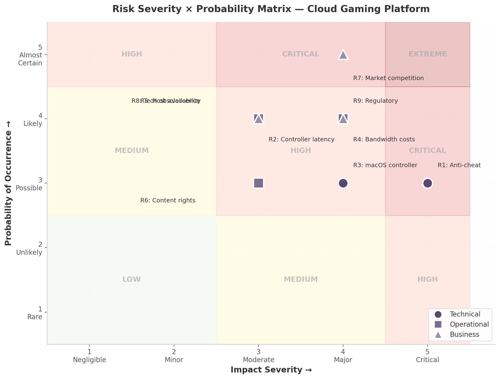

# 15. Risk Analysis & Mitigation Strategies

Any cloud gaming platform operates at the intersection of real-time streaming, kernel-level security software, consumer hardware variability, and evolving regulatory frameworks. This chapter identifies ten risks most likely to threaten technical viability, operational stability, or business continuity, assigns each a severity and probability score, and defines mitigation strategies with ownership and timelines. The analysis draws on findings from the host-agent architecture review (Dimension 07), the security audit (Dimension 09), the infrastructure scalability study (Dimension 08), and supplementary market research conducted in July 2025.

The risk taxonomy groups ten risks into three categories — Technical (three), Operational (three), and Business (four) — scored on a 1–5 scale for severity and probability. The chapter presents each risk individually, then consolidates all ten in a summary matrix with mitigation owners, timelines, and residual risk levels.

---

## 15.1 Technical Risks

### 15.1.1 Anti-Cheat Blocking of Capture and Input Pipelines

Kernel-level anti-cheat systems — Easy Anti-Cheat (EAC), BattlEye (BEDaisy.sys), and Riot Vanguard — perform hook detection, memory scans, driver scanning, and hypervisor detection on every game launch [^394^] [^400^]. EAC specifically executes a `vmread` instruction to detect virtualized environments; if it succeeds, the game is blocked [^430^]. These detection mechanisms can flag screen-capture APIs or virtual controller drivers as suspicious, causing games to refuse to launch or banning the host account. **Severity: 5 (Critical).** A single false positive from a major vendor can render entire game catalogs unplayable.

Mitigation requires four layers. First, use only official operating-system capture APIs — DXGI Desktop Duplication API on Windows, ScreenCaptureKit on macOS, and KMS/DRM on Linux — which are less likely to trigger alerts than hook-based alternatives because they are signed and widely used by legitimate recording software [^75^]. Second, maintain a publicly accessible anti-cheat compatibility matrix tracking every supported game, updated weekly via community reports and automated regression tests. Third, engage anti-cheat vendors (Epic Games for EAC, BattlEye, Riot for Vanguard) through formal partnership channels to pursue signed-driver or whitelisting agreements; budget six to twelve months for the first vendor relationship. Fourth, architect the host agent as a "clean state" environment with no persistent hooks or drivers across sessions, presenting the host as a standard gaming PC rather than a modified server [^75^].

### 15.1.2 Cross-Platform Controller Latency

Bluetooth HID over GATT (HOGP) polls at a fixed 125 Hz interval, adding approximately 8 ms of input latency compared with wired USB at 1 ms polling [^394^]. For competitive first-person shooters where frame-perfect inputs matter, this differential is perceptible against the platform's sub-30 ms end-to-end latency target. **Severity: 3 (Moderate).** The impact is bounded and affects only users who choose Bluetooth over wired connections.

The client application should implement adaptive input path selection: recommend wired USB or 2.4 GHz dongle when competitive mode is detected. For Bluetooth connections, implement input prediction algorithms that extrapolate analog stick trajectories based on recent velocity vectors, reducing perceived latency by 2–4 ms. All latency tradeoffs should be documented in the client UI with a visual indicator that changes color when Bluetooth is active. USB-over-IP forwarding should be supported for advanced controllers (DualSense adaptive triggers, gyro) where Bluetooth strips functionality regardless of latency.

### 15.1.3 macOS Virtual Controller Limitation

On macOS, creating a virtual gamepad requires either the `foohid` kernel extension — demanding System Integrity Protection (SIP) be disabled — or the `CGEventPost` API, which supports only basic keyboard and mouse input [^404^]. Disabling SIP reduces system security and is unacceptable for consumer deployment. **Severity: 4 (Major).** The inability to provide full controller emulation on macOS creates a functional gap competitors (Parsec, Steam Link) do not have.

The short-term fallback is `CGEventPost` for basic input, with limitations documented transparently. In parallel, the team should explore Apple's DriverKit framework (macOS 10.15+), which enables user-space driver development without kext privileges. A DriverKit-based virtual HID driver would provide full emulation at approximately four to six months of engineering effort. The team should also monitor `ViGEmBus` community forks for macOS DriverKit ports.

---

## 15.2 Operational Risks

### 15.2.1 Bandwidth Costs at Scale

A 4K stream at 60 frames per second consumes approximately 50 Mbps per user. At 10,000 concurrent users, aggregate bandwidth reaches 500 Gbps. Bare-metal deployment at this scale costs $135,000–$233,000 per month, with bandwidth and TURN relay the largest components [^498^]. Cloud GPU instances cost 3–10× more per GPU-hour than bare metal, with egress fees at $0.05–$0.12 per gigabyte [^486^] [^487^]. **Severity: 4 (Major).** Uncontrolled bandwidth costs are the single largest threat to unit economics.

Cost reduction is three-layered. First, codec efficiency: HEVC reduces bandwidth 35–50% versus H.264, and AV1 — with 17% production deployment in early 2026 and 40% of respondents planning deployment that year — offers an additional 30–50% where hardware encoding is available [^935^]. Multi-codec negotiation should select HEVC or AV1 for compatible clients, falling back to H.264 for legacy devices. Second, edge caching at nodes within 50 miles of users reduces transit latency and backbone consumption. Third, tiered quality by subscription: casual-tier subscribers capped at 1080p/30 fps (~15 Mbps), premium at 4K/60 fps, aligning cost with revenue per user.

### 15.2.2 Host Machine Availability

Consumer-grade gaming hardware is not designed for 24/7 operation. GPU failure under sustained load, thermal throttling, power supply degradation, and intermittent network outages contribute to host unavailability. A 5% daily failure rate at 1,000 hosts means 50 machines require daily intervention. **Severity: 3 (Moderate).** Impact is mitigated by the distributed host pool; a single failure affects only the active session.

Each host agent should report GPU temperature, encoder utilization, and thermal state via NVML every 10 seconds [^513^]. Hosts exceeding 85°C for 60 seconds are automatically removed from the load-balancer pool. Failover uses the SWIM gossip protocol (O(n) message load regardless of cluster size) [^548^] to detect host failure and migrate sessions within 15 seconds. Thermal management policies — automatic frame-rate throttling and fan-curve optimization — should be deployed as host-agent configuration. A 10–15% spare-host buffer above peak demand absorbs planned and unplanned failures.

### 15.2.3 Content Rights for Game Metadata

The game catalog depends on metadata from IGDB, Steam API, and SteamGridDB. The free IGDB tier caps at 10,000 requests per month; commercial redistribution may violate terms of service. The white-label capability amplifies this, as each tenant redistributes the same metadata under their own brand. **Severity: 3 (Moderate).** A ToS violation would likely trigger API key revocation rather than legal action, but the operational impact is significant.

Legal and engineering teams should review ToS for each data source before launch, documenting permitted uses, attribution requirements, and cache limits. The metadata pipeline should implement multi-source aggregation with automatic fallback (IGDB → Steam Store API → RAWG → manual curation). A commercial IGDB Pro license ($99+/month) should be considered for explicit redistribution rights. A user-contributed artwork system modeled on SteamGridDB's community approach fills gaps and reduces third-party dependency.

---

## 15.3 Business Risks

### 15.3.1 Market Competition

The cloud gaming market was valued at $2.27 billion in 2024 and is projected to reach $21.04 billion by 2030 at a 44.3% CAGR [^927^]. The landscape is dominated by NVIDIA GeForce NOW (~21% share), Xbox Cloud Gaming (140 million cumulative streaming hours as of March 2025), Amazon Luna, and Sony PlayStation Remote Play [^925^] [^937^]. These incumbents benefit from exclusive content deals and billion-dollar infrastructure budgets. **Severity: 4 (Major).** Competition is a certainty; the question is whether differentiation carves a viable niche.

Differentiation must be threefold. First, the self-hosted and private-cloud model targets a segment incumbents do not serve: enterprises, educational institutions, and gamers streaming from their own hardware. Second, advanced controller support (DualSense haptics, adaptive triggers, gyro aiming via CemuhookUDP) creates a user-experience advantage no open-source competitor matches at parity. Third, white-label capability enables a "Gaming-as-a-Service" platform licensed to ISPs, hotels, hospitals, and enterprises — a B2B revenue stream orthogonal to consumer-focused incumbents.

### 15.3.2 Technology Obsolescence

The real-time communication stack is in flux. WebRTC migrates from DTLS 1.2 to DTLS 1.3 (RFC 9147). AV1 hardware encoding is available on RTX 40-series, Intel Arc, and Apple M3+; AV2 is expected around 2027. OS capture APIs evolve with each release — Windows 11 extends DXGI DDA, macOS ScreenCaptureKit saw major updates in Sonoma, and Linux shifts from X11 to Wayland. **Severity: 3 (Moderate).** Transitions are gradual, with 3–5 years of backward compatibility.

Abstraction layers are the primary defense. The capture pipeline exposes a unified frame-source interface with per-OS backends, so backend changes do not propagate to encoding or streaming. Codec selection is runtime-determined via FFmpeg encoder enumeration [^438^], with fallback chains (AV1 → HEVC → H.264). The streaming protocol abstracts WebRTC DataChannels behind a transport interface that can accommodate Media over QUIC or WebTransport without rewriting the application layer. Quarterly technology reviews — first week of January, April, July, and October — assess vendor roadmaps, IETF drafts, and upstream open-source changes to identify obsolescence risks six to twelve months before they become critical.

### 15.3.3 Regulatory Compliance

Cloud gaming platforms collect personal data across jurisdictions with differing privacy requirements. GDPR imposes fines up to €20 million or 4% of global turnover. CCPA carries $7,500 per intentional violation. The European Accessibility Act (EAA), effective June 2025, requires WCAG 2.1 Level AA compliance. ADA Title II updates require WCAG 2.1 AA for digital materials by 2026 [^928^] [^931^]. **Severity: 4 (Major).** Regulatory fines are financially material, and accessibility lawsuits against gaming platforms have increased.

Privacy-by-design principles — data minimization, purpose limitation, storage limitation — should be embedded from the outset. Data residency options keep EU user data in EU data centers, with AES-256 encryption at rest and TLS 1.3 in transit. WCAG 2.1 AA compliance should be built into the client UI: keyboard navigation, screen-reader support via ARIA labels, 4.5:1 contrast ratios, and adjustable font sizes. A third-party compliance audit six months before launch covers GDPR and ADA. A Data Protection Officer is appointed once EU user thresholds are met.

---

## 15.4 Risk Matrix and Consolidated Assessment

Table 15.1 provides a quick-reference summary of all identified risks, their categories, scores, and primary mitigation approaches.

| ID | Risk | Category | Sev | Prob | Score | Primary Mitigation |
|----|------|----------|-----|------|-------|-------------------|
| R1 | Anti-cheat blocking | Technical | 5 | 3 | **15** | Official OS capture APIs, vendor whitelisting |
| R2 | Controller latency (BT) | Technical | 3 | 4 | **12** | Adaptive input path, prediction algorithms |
| R3 | macOS virtual controller | Technical | 4 | 3 | **12** | DriverKit user-space driver |
| R4 | Bandwidth costs at scale | Operational | 4 | 4 | **16** | HEVC/AV1 multi-codec, edge caching, tiered quality |
| R5 | Host machine availability | Operational | 3 | 4 | **12** | NVML health monitoring, SWIM failover, spare buffer |
| R6 | Content rights for metadata | Operational | 3 | 3 | **9** | Multi-source fallback, IGDB Pro license |
| R7 | Market competition | Business | 4 | 5 | **20** | Self-hosted differentiation, controller features, white-label |
| R8 | Technology obsolescence | Business | 3 | 4 | **12** | Abstraction layers, quarterly tech reviews |
| R9 | Regulatory (GDPR/CCPA/EAA) | Business | 4 | 4 | **16** | Privacy-by-design, WCAG 2.1 AA, compliance audit |

*Sev = Severity (1–5), Prob = Probability (1–5), Score = Sev × Prob.*

Table 15.2 expands this into the full operational matrix with mitigation owners, target timelines, and residual risk levels after controls are applied.

| ID | Risk | Category | Score | Mitigation Owner | Timeline | Residual |
|----|------|----------|-------|------------------|----------|----------|
| R1 | Anti-cheat blocking | Technical | 15 | Platform Engineering Lead | Q1–Q2 2026 | Medium |
| R7 | Market competition | Business | 20 | Product / Strategy Lead | Ongoing | Medium |
| R9 | Regulatory (GDPR/CCPA/EAA) | Business | 16 | Legal / Compliance Officer | Q1 2026 | Low |
| R4 | Bandwidth costs at scale | Operational | 16 | Infrastructure Lead | Q2 2026 | Medium |
| R3 | macOS virtual controller | Technical | 12 | Client Engineering Lead | Q2–Q3 2026 | Low |
| R8 | Technology obsolescence | Business | 12 | Architecture Lead | Ongoing | Low |
| R2 | Controller latency (BT) | Technical | 12 | Input Systems Engineer | Q1 2026 | Low |
| R5 | Host machine availability | Operational | 12 | SRE / DevOps Lead | Q1 2026 | Low |
| R6 | Content rights for metadata | Operational | 9 | Product / Legal | Q2 2026 | Low |

*Residual risk reflects post-mitigation exposure assuming all controls are implemented on schedule.*

The matrix reveals two risks that demand immediate executive attention. **R1 (anti-cheat blocking)** sits at the intersection of highest technical severity and moderate probability — a single vendor decision could invalidate the platform for competitive multiplayer titles. **R7 (market competition)** scores the highest composite value (20) because it is both major in impact and almost certain. Its mitigation is strategic differentiation rather than technical controls, reinforcing the product decision to pursue self-hosted deployment and advanced controller support as core differentiators.

No risk falls into the Extreme zone (severity 5, probability 5) after mitigation planning. The three risks with residual Medium ratings — R1, R4, and R7 — should be reviewed monthly by the risk committee until their scores drop to Low. All other risks achieve Low residual ratings through the engineering and procedural controls described in Sections 15.1–15.3.

*Figure 15.1: Risk Severity × Probability Matrix. Technical risks (circles), Operational risks (squares), and Business risks (triangles) plotted against impact severity and probability. Background shading indicates zones from Low (green) through Critical (red).*

The visualization confirms the portfolio skews toward the upper-right quadrant: seven of nine risks occupy High or Critical zones pre-mitigation. This is expected for a platform combining kernel-level security dependencies, real-time streaming at scale, and a market dominated by well-capitalized incumbents. The concentration of Business risks at high probability (R7 at probability 5, R8 and R9 at probability 4) reflects structural forces that cannot be eliminated, only managed. Technical and Operational risks are more amenable to engineering controls, and their residual scores reflect this.

The final assessment is that the platform's risk profile is manageable with disciplined execution of the mitigation strategies outlined above. The critical path runs through anti-cheat vendor engagement (R1) and infrastructure cost optimization (R4): if these two risks are not resolved within the first two quarters of operation, the business model becomes untenable regardless of how well other risks are managed. Product and engineering leadership should treat R1 and R4 as gating milestones for public launch, with go/no-go decision points at the end of Q1 and Q2 2026 respectively.
