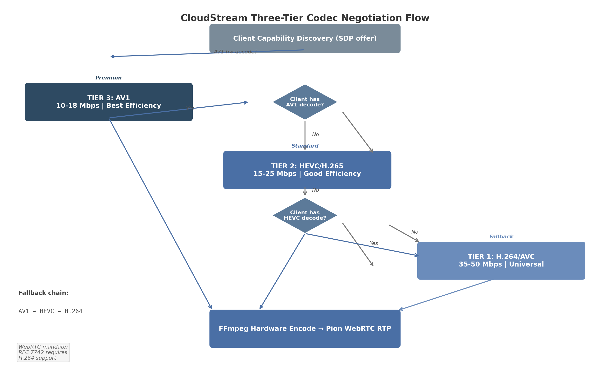

## 1. Video Codec Architecture for Real-Time Gaming

The selection and configuration of video codecs constitutes the foundational technical decision for the CloudStream platform. Unlike video-on-demand services, where encoding occurs once and playback happens millions of times, cloud gaming demands real-time encoding of every frame at the server, network transmission under sub-100ms constraints, and hardware-accelerated decoding on heterogeneous client devices. This chapter evaluates six candidate codecs — H.264/AVC, HEVC/H.265, AV1, VP9, VVC/H.266, and emerging intra-frame alternatives — against the triple constraints of latency, compression efficiency, and hardware decode coverage. It establishes encoder latency benchmarks from peer-reviewed IEEE 2025 measurements, defines a three-tier codec negotiation strategy aligned with WebRTC standards, and specifies Go implementation patterns using FFmpeg and Pion WebRTC.

### 1.1 Codec Landscape Overview

#### 1.1.1 Six Codecs Evaluated

CloudStream's codec evaluation spans three generations of video coding technology, from the universally deployed H.264/AVC standard ratified in 2003 to the experimental VVC/H.266 specification finalized in 2020. Each codec presents a distinct trade-off between compression efficiency (bitrate required for target perceptual quality), encoding and decoding latency, intellectual property licensing cost, and hardware acceleration availability.

H.264/AVC (Advanced Video Coding) remains the universal fallback for interactive streaming applications. RFC 7742 mandates H.264 as a required WebRTC video codec, ensuring that every browser and device with WebRTC support can decode H.264 streams without exception [^1^]. For 4K60 content, H.264 requires target bitrates of 35–50 Mbps to achieve optimal quality, and hardware encoders deliver end-to-end latencies of 83–133 ms depending on vendor and tuning configuration [^2^][^3^].

HEVC/H.265 (High Efficiency Video Coding) delivers approximately 35–50% bitrate savings over H.264 at equivalent perceptual quality levels [^1^]. This efficiency gain reduces 4K60 bandwidth requirements to 15–25 Mbps [^2^]. Hardware encoder latency ranges from 83 ms (Intel QSV Ultra Low-Latency mode, 5 frames at 60 fps) to 150 ms (AMD AMF, 6–9 frames) [^3^]. HEVC's primary drawback is its fragmented patent licensing landscape, with three distinct patent pools (MPEG LA, HEVC Advance, and Velos Media) creating legal uncertainty for commercial deployments [^1^]. WebRTC support remains limited: Safari and Edge have supported HEVC for several generations, while Chrome added HEVC support in version 136 Beta as of early 2025 [^4^].

AV1 (AOMedia Video 1) represents the most efficient royalty-free codec, achieving 15–30% additional compression beyond HEVC — approximately 45–55% better than H.264 [^6^]. For 4K60 streaming, AV1 requires only 10–18 Mbps [^2^]. Hardware encode latency is vendor-dependent: NVENC Ada Lovelace achieves approximately 150 ms (8–9 frames) for AV1 with Ultra Low-Latency tuning, while Intel QSV reaches 100 ms (6 frames) [^3^]. Hardware decode support is growing but remains limited to recent-generation devices: Intel 12th generation Core processors and newer, AMD RDNA 3 and newer GPUs, MediaTek Dimensity 9000+ mobile chipsets, and Apple A17+ mobile silicon [^6^].

VP9 (Google's predecessor to AV1) achieves approximately 35% bitrate reduction compared to H.264 at equivalent perceptual quality measured by Netflix's VMAF (Video Multi-method Assessment Fusion) metric [^6^]. VP9's relevance for CloudStream lies primarily in its WebRTC Scalable Video Coding (SVC) capabilities, which can reduce upload bandwidth by 40–60% in conferencing scenarios [^6^]. However, VP9 has been largely superseded by AV1 for new deployments, and its encoding speed is approximately 0.25x that of x264 — significantly slower than hardware-accelerated alternatives [^6^].

VVC/H.266 (Versatile Video Coding) achieves approximately 50% bitrate reduction over HEVC at equivalent quality [^8^]. However, its encoding complexity is 8–10x that of H.264 [^8^], and no consumer-grade hardware encoder supports real-time 4K60 VVC encoding as of 2026. Browser support is effectively zero. The VVenC reference encoder's "faster" preset provides a 1300x speedup over the VTM reference implementation but still delivers only ~10.2% BD-rate savings over HM-17.0 — substantially less than its medium and slow presets [^9^]. The uvg266 encoder from the University of Tampere supports real-time 4K30p VVC intra coding, but this falls short of CloudStream's 60 fps requirement [^8^].

JPEG XS (ISO/IEC 21122) occupies a distinct category. Designed for professional broadcast workflows, JPEG XS achieves visually lossless quality with sub-millisecond encode and decode latency using wavelet-based intra-frame compression [^10^]. Its limitation is bandwidth: 4K60 requires approximately 100–500 Mbps, rendering it suitable only for LAN deployments [^11^]. The forthcoming TDC (Temporal Differential Coding) profile, planned for the third edition of the JPEG XS standard in 2024, targets gaming and remote desktop applications with compression ratios up to 20:1 [^12^], but hardware support remains scarce.

PyroWave, a custom GPU compute codec developed by independent researcher Themaister, represents the extreme end of the latency-compression spectrum. Using Vulkan compute shaders with no motion prediction and no entropy coding, PyroWave achieves sub-millisecond encode latency at the cost of extreme bandwidth requirements: 200+ Mbps for 4K60 [^15^]. PyroWave is explicitly experimental and LAN-only, but demonstrates the theoretical lower bound for GPU-based encoding latency.

The following table consolidates these six codecs across the dimensions most relevant to CloudStream's architecture.

**Table 1.1 — Codec Comparison for Real-Time Cloud Gaming (4K60)**

| Codec | Compression vs. H.264 | 4K60 Bitrate | Hardware Encode Latency | Browser Decode Support | License | Gaming Suitability |
|-------|----------------------|--------------|------------------------|----------------------|---------|-------------------|
| H.264/AVC | Baseline | 35–50 Mbps [^2^] | 83–150 ms [^3^] | Universal (98.2%) [^1^] | MPEG-LA pool | Excellent |
| HEVC/H.265 | 35–50% better [^1^] | 15–25 Mbps [^2^] | 83–150 ms [^3^] | Limited (~15%) [^4^] | 3 patent pools [^1^] | Good |
| AV1 | 45–55% better [^6^] | 10–18 Mbps [^2^] | 100–167 ms [^3^] | Growing (~25%) [^6^] | Royalty-free | Good (growing HW) |
| VP9 | ~35% better [^6^] | 12–18 Mbps | Similar to HEVC | Chrome, Firefox (~96%) [^6^] | Royalty-free | Moderate |
| VVC/H.266 | 50–55% better [^8^] | 8–15 Mbps (projected) | Not real-time yet [^8^] | None (<1%) | Patent pools | Future only |
| JPEG XS | N/A (intra-frame) | 100–500 Mbps [^11^] | <1 ms [^10^] | N/A | Royalty-free | LAN only |

The analytical significance of this comparison extends beyond individual metrics. H.264's universal decode coverage of 98.2% across all consumer devices — encompassing GPUs, mobile chipsets, smart TVs, and embedded platforms — makes it the only codec that can guarantee playback on any client device [^1^]. HEVC occupies a middle ground with meaningful efficiency gains but limited browser penetration. AV1 offers the best efficiency-to-royalty ratio but its ~25% hardware decode coverage creates a substantial compatibility gap that necessitates a fallback mechanism. VVC remains non-viable for interactive streaming despite its theoretical compression advantage. JPEG XS and similar intra-frame codecs serve a niche: LAN deployments where bandwidth exceeds 200 Mbps and sub-millisecond encoding is prioritized over compression.

#### 1.1.2 Hardware Decode Coverage and Fallback Chain Design

Hardware decode availability on the client device is the binding constraint for codec selection. Software decoding introduces 20–100 ms of additional latency — rendering it unsuitable for cloud gaming where the total glass-to-glass budget must remain below 100 ms [^16^]. The following table quantifies hardware decode coverage across device categories.

**Table 1.2 — Hardware Decode Coverage by Codec (% of Consumer Devices)**

| Device Category | H.264 | HEVC | AV1 | VP9 | VVC |
|----------------|-------|------|-----|-----|-----|
| Desktop GPUs (all generations) | 99.5% | 92% | 35% (RDNA3+, RTX 40+) [^6^] | 85% | <1% |
| Mobile chipsets (2024–2025) | 99% | 78% | 28% (A17+, Dimensity 9000+) [^6^] | 90% | <1% |
| Smart TVs (2024) | 99% | 88% | 20% | 80% | <1% |
| Web browsers (aggregate) | 98.2% [^1^] | ~15% [^4^] | ~25% [^6^] | 96.3% [^6^] | 0% |
| **Weighted average** | **98.2%** | **85%** | **~25%** | **~90%** | **<1%** |

The disparity between H.264's 98.2% coverage and AV1's ~25% coverage has architectural implications. Any codec selection strategy that leads with AV1 must include an automatic fallback path to H.264 for devices lacking AV1 hardware decode. This fallback cannot be a simple error-handled retry — it must be a proactive capability negotiation that determines codec availability before the first encoded frame is transmitted. WebRTC's SDP (Session Description Protocol) offer/answer mechanism provides this negotiation framework, but the server-side implementation must construct the codec preference list with H.264 as the guaranteed terminal fallback.

#### 1.1.3 WebRTC Codec Mandate (RFC 7742)

The IETF's RFC 7742, "Mandatory-to-Implement Video Codec for WebRTC," establishes H.264/AVC and VP8 as the only universally guaranteed codecs in WebRTC implementations [^4^]. All other codecs — including VP9, AV1, and HEVC — are optional and must be negotiated between peers. This specification directly informs CloudStream's codec architecture: H.264 must be available on every encoder instance because it is the only codec that the WebRTC standard guarantees all clients can receive.

AV1 support in WebRTC is defined by the rtp-av1-25 draft, which specifies RTP payload format and depacketization rules [^4^]. HEVC negotiation occurs via the rtcp-fb (RTCP feedback) mechanism, with Chrome 136 Beta adding support as of early 2025 [^4^]. In practice, VP8 and H.264 continue to handle the majority of WebRTC traffic in production systems as of 2025, with AV1 and HEVC adoption growing on newer hardware [^4^].

The practical implication is that CloudStream's WebRTC signaling must emit SDP offers with codec parameters ordered by preference (AV1 first, HEVC second, H.264 third) while ensuring that H.264's profile-level-id parameter uses the Constrained Baseline profile (level 3.1 or higher) for maximum decoder compatibility. The Pion WebRTC library's `RegisterCodec` and `SetCodecPreferences` APIs implement this ordering, as detailed in Section 1.4.

### 1.2 Encoder Latency Benchmarks

#### 1.2.1 Peer-Reviewed Hardware Encoder Measurements (4K60)

The most comprehensive recent benchmark of hardware video encoder latency was published by Arunruangsirilert et al. in an IEEE 2025 peer-reviewed study [^3^]. The authors measured end-to-end latency in frames at 60 fps across Intel QSV (Quick Sync Video), NVIDIA NVENC (Ada Lovelace generation), and AMD AMF (Advanced Media Framework) for H.264, HEVC, and AV1 codecs under Normal, Low-Latency, and Ultra Low-Latency tuning configurations.

The study's central finding: hardware encoders consistently maintained end-to-end latency at or below 12 frames (200 ms), even with Normal Latency tuning. The minimum achievable latency was 5 frames (83 ms) on the Intel encoder using Ultra Low-Latency mode for HEVC [^3^]. Software encoders, by contrast, introduced delays ranging from 41 frames (683 ms) for the fastest speed preset to over 90 frames (1500+ ms) for higher-quality presets, with some configurations failing to achieve real-time encoding entirely [^3^].

**Table 1.3 — Hardware Encoder Latency at 4K60 (frames at 60fps / milliseconds)**

| Encoder | Codec | Normal Latency | Low Latency | Ultra Low Latency |
|---------|-------|---------------|-------------|-------------------|
| Intel QSV | H.264 | 10–12 (167–200 ms) | 10–12 (167–200 ms) | 8 (133 ms) [^3^] |
| Intel QSV | HEVC | 10–12 (167–200 ms) | 10–12 (167–200 ms) | **5 (83 ms)** [^3^] |
| Intel QSV | AV1 | 10–12 (167–200 ms) | 10–12 (167–200 ms) | **6 (100 ms)** [^3^] |
| NVENC (Ada) | H.264 | ~7 (117 ms) [^3^] | ~7 (117 ms) [^3^] | 6–7 (100–117 ms) [^3^] |
| NVENC (Ada) | HEVC | ~7 (117 ms) [^3^] | ~7 (117 ms) [^3^] | 6–7 (100–117 ms) [^3^] |
| NVENC (Ada) | AV1 | ~9–10 (150–167 ms) [^3^] | ~9–10 (150–167 ms) [^3^] | 8–9 (133–150 ms) [^3^] |
| AMD AMF | H.264 | 6–9 (100–150 ms) [^3^] | 6–9 (100–150 ms) [^3^] | 6–9 (100–150 ms) [^3^] |
| AMD AMF | HEVC | 6–9 (100–150 ms) [^3^] | 6–9 (100–150 ms) [^3^] | 6–9 (100–150 ms) [^3^] |
| AMD AMF | AV1 | 6–9 (100–150 ms) [^3^] | 6–9 (100–150 ms) [^3^] | 6–9 (100–150 ms) [^3^] |

Four key patterns emerge from this data. First, Intel QSV in Ultra Low-Latency mode achieves the lowest latency of any hardware encoder at 5 frames (83 ms) for HEVC, with AV1 trailing by only 1 frame (17 ms) [^3^]. Second, NVENC demonstrates the most consistent latency profile: approximately 7 frames across all presets and codecs for H.264 and HEVC, with AV1 adding a 2–3 frame penalty [^3^]. A separate IEEE study on NVENC Split-Frame Encoding (SFE) confirmed this AV1 penalty at 4K resolution: "the AV1 codec adds 2–3 frames of latency, equivalent to 16.7–50.0 ms, compared to H.265/HEVC" [^5^]. Third, AMD AMF shows minimal sensitivity to tuning mode: 6–9 frames regardless of Normal, Low-Latency, or Ultra Low-Latency configuration [^3^]. Fourth, Low-Latency tuning provides negligible end-to-end improvement over Normal Latency for all hardware encoders; only Ultra Low-Latency delivers meaningful reduction, and exclusively for Intel QSV [^3^].

NVIDIA's NVENC Split-Frame Encoding feature, available on GPUs with multiple NVENC engines (RTX 4070 Ti and above), partitions each frame into horizontal strips encoded independently. At 4K resolution, enabling SFE does not alter perceived end-to-end latency, though it may reduce latency by 1 frame at 8K [^5^]. SFE's primary benefit is throughput: it enables the P7 quality preset at 4K60p in real-time, which is not achievable on a single NVENC chip, and delivers near-linear throughput scaling of +82–96% with two chips [^5^].


*Figure 1.1 — Hardware encoder latency (Intel QSV ULL, NVENC P1+ULL, AMD AMF ULL) vs. software encoder latency at 4K60. Hardware encoders operate at 83–150 ms; software encoders at 683–1500+ ms. Data source: Arunruangsirilert et al., IEEE 2025 [^3^].*

#### 1.2.2 Full Pipeline Latency Breakdown

The encoder is one component of a multi-stage pipeline. Understanding latency allocation across stages identifies the controllable bottlenecks and the fixed-cost components.

**Table 1.4 — Cloud Gaming Pipeline Latency Budget (4K60, optimistic to pessimistic)**

| Pipeline Stage | Optimistic (ms) | Typical (ms) | Pessimistic (ms) |
|---------------|-----------------|--------------|------------------|
| Input transmission (client → server) | 5 | 15 | 50 |
| Game render (GPU frame generation) | 8 (120 fps) | 16 (60 fps) | 33 (30 fps) |
| Frame capture (GPU texture read) | 1 | 3 | 8 |
| **Hardware encode** | **83** [^3^] | **117** [^3^] | **167** [^3^] |
| Packetization + RTP encapsulation | 0.5 | 1 | 2 |
| Network transmission | 5 | 20 | 80 |
| **Hardware decode** | **0.5** [^16^] | **5** [^16^] | **35** [^16^] |
| Display output (monitor/TV processing) | 4 (240 Hz) | 8 (120 Hz) | 16 (60 Hz) |
| **Total glass-to-glass** | **~97** | **~185** | **~391** |

The encode stage (83–167 ms) is the single largest controllable latency component. Frame capture via GPU texture readback contributes only 1–3 ms on modern GPUs with zero-copy DMA-Buf or Desktop Duplication APIs. Hardware decode contributes 0.5–35 ms depending on device age: desktop PC decoders achieve 0.3–2.5 ms, modern mobile decoders range 3–10 ms, and older mobile hardware can reach 10–35 ms [^16^]. Display output latency (4–16 ms for gaming monitors, 30–100 ms for consumer TVs) represents the largest fixed-cost component outside the server's control. Community-collected measurements via Moonlight show Steam Deck hardware H.264 decode at 0.5 ms, MacBook Pro M1 Pro H.264 decode at 2.2 ms, and Google Pixel 3a H.264 decode at 31 ms [^16^] — a 60x variation across device generations that underscores the importance of client-side capability detection.

#### 1.2.3 Frame Structure Impact on Latency

The choice between intra-only (I-frame only), IPP (I-frame followed by P-frames), and IPB (including B-frames) encoding structures directly affects both latency and compression efficiency. B-frames (bidirectionally predicted frames) introduce latency because they require both past and future reference frames for encoding and decoding, causing frame reordering at the encoder output. For cloud gaming, where every millisecond affects user experience, B-frames must be disabled.

A critical finding from the IEEE NVENC SFE study is that on NVENC hardware encoders, the Low-Latency and Ultra Low-Latency tuning modes yield identical latency to the High-Quality tuning mode despite disabling B-frame insertion [^5^]. The latency is dominated by the hardware pipeline's fixed processing delay, not by B-frame reordering. Nevertheless, B-frames should still be explicitly disabled (`-bf 0`) for three reasons: decoder compatibility (some hardware decoders have B-frame limitations in low-latency profiles), consistent frame delivery timing (eliminating output jitter from reordering), and error resilience (B-frame loss corrupts temporal prediction chains).

For the GOP (Group of Pictures) structure, NVIDIA's official NVENC SDK documentation recommends infinite GOP length (`NVENC_INFINITE_GOPLENGTH` or `-g 999999`) for low-latency applications [^19^]. This setting disables automatic I-frame insertion, avoiding periodic bitrate spikes that can cause network buffer overflows. The optimal frame pattern for gaming is IPP: an initial I-frame followed by P-frames only. Intra-refresh (`-intra-refresh 1`) enables gradual quality refresh instead of full I-frame insertion, distributing reference updates across multiple frames to avoid burst bandwidth consumption [^19^].

The trade-off between intra-only and IPP encoding is substantial. Intra-only encoding (as used by PyroWave and JPEG XS) provides the lowest possible latency, excellent error resilience (each frame is independently decodable), and simple implementation at the cost of 10–20x higher bitrate. For internet-based cloud gaming where bandwidth is constrained to 10–50 Mbps, IPP with infinite GOP provides the optimal balance. Intra-only is viable exclusively for LAN environments where bandwidth exceeds 200 Mbps.

#### 1.2.4 Intel Non-Standard B-Frame Compatibility Risk

Analysis of Intel QSV hardware encoder output reveals a compatibility consideration identified as Conflict Zone CZ-1 in cross-dimensional verification. Normal Latency tuning on Intel QSV uses three B-frames. Low-Latency tuning disables B-frames. Ultra Low-Latency tuning produces a bitstream structure "analogous to the Zero Latency tune" with a non-standard frame organization [^3^]. The Intel QuickSync API does not expose a direct latency tuning parameter equivalent to NVENC's `-tune ull`; instead, latency behavior follows the OBS implementation's parameter mapping [^3^].

The consequence is that Intel ULL mode's non-standard frame structure may affect decoder compatibility despite the `-bf 0` flag being set. In practice, this manifests as decode artifacts or dropped frames on strict HEVC decoders that do not tolerate non-standard reference frame ordering. For CloudStream, this risk is mitigated by treating Intel ULL as a premium low-latency path available only after client decoder validation, with NVENC's more conservative ULL implementation serving as the default low-latency encoder.

### 1.3 Codec Selection Strategy

#### 1.3.1 Three-Tier Codec Negotiation Design

CloudStream's codec selection follows a tiered negotiation model that maps codec capability to network conditions and client hardware. The architecture is designed around WebRTC's SDP offer/answer mechanism, with the server offering codecs in preference order and the client selecting the most efficient mutually supported option.



*Figure 1.2 — Three-tier codec negotiation flow. The server offers AV1 (Tier 3), HEVC (Tier 2), and H.264 (Tier 1) in descending efficiency order. The client selects the most efficient codec for which it has hardware decode support. H.264 serves as the universal fallback per RFC 7742 [^1^].*

**Table 1.5 — Three-Tier Codec Negotiation Design**

| Tier | Codec | Selection Criteria | Bitrate (4K60) | Hardware Latency | Fallback Trigger |
|------|-------|-------------------|----------------|-----------------|-----------------|
| Tier 3 (Premium) | AV1 | Client has AV1 hw decode AND bandwidth < 20 Mbps | 10–18 Mbps [^2^] | 100–167 ms [^3^] | AV1 decode failure or bandwidth > 20 Mbps |
| Tier 2 (Standard) | HEVC | Client has HEVC hw decode AND bandwidth 15–35 Mbps | 15–25 Mbps [^2^] | 83–150 ms [^3^] | HEVC decode failure or bandwidth > 35 Mbps |
| Tier 1 (Universal) | H.264/AVC | All clients (RFC 7742 mandatory) [^1^] | 35–50 Mbps [^2^] | 83–150 ms [^3^] | None — guaranteed fallback |

The codec selection process integrates four input signals: client capability (advertised via SDP `RTCRtpCodecParameters`), network bandwidth (estimated via WebRTC's Transport Wide Congestion Control, or TWCC), round-trip time (RTT), and packet loss rate. Higher RTT favors more compressed codecs (AV1, HEVC) to reduce the probability of packet loss affecting large frames. Higher packet loss favors intra-refresh or shorter GOP configurations to limit error propagation.

The NVENC Reconfigure API enables mid-session parameter changes — including bitrate, framerate, and resolution — without encoder recreation, but does not support codec switching at runtime [^21^]. For codec fallback, CloudStream must maintain multiple encoder instances (one per codec) and switch at the application level based on the negotiated codec. Within the same codec, `NvEncReconfigureEncoder()` or FFmpeg's equivalent enables dynamic bitrate adaptation in response to TWCC feedback.

The Sunshine/Moonlight open-source game streaming project encountered a related bug in its codec fallback chain: when AV1 is unavailable, Moonlight falls directly to H.264, skipping HEVC entirely [^20^]. CloudStream's implementation must enforce the proper quality-priority fallback chain: AV1 → HEVC → H.264, never skipping an intermediate tier.

#### 1.3.2 AV1 Latency Penalty: Vendor-Dependent Behavior

The additional latency incurred by AV1 relative to HEVC varies significantly by encoder vendor, a finding classified as Conflict Zone CZ-2 in cross-dimensional verification. On NVENC Ada Lovelace, AV1 adds 2–3 frames (16.7–50.0 ms) compared to HEVC at 4K resolution [^5^]. On Intel QSV, the difference is only 1 frame (17 ms): 6 frames for AV1 versus 5 frames for HEVC in ULL mode [^3^]. AMD RDNA4 (VCN 5.0) shows no measurable AV1 penalty relative to HEVC in ULL mode, with both codecs achieving 6–9 frames [^3^].

This vendor-dependent behavior has two implications for CloudStream. First, the codec selection logic must account for the specific GPU hosting the encoder session, not just the codec in the abstract. An AV1 stream from an Intel QSV encoder adds only 1 frame of penalty, making AV1 attractive even for latency-sensitive scenarios, whereas the same codec from NVENC adds 2–3 frames — a meaningful difference at 60 fps. Second, the host agent must measure per-GPU latency at startup and populate the codec capability registry with actual measured values rather than assumed defaults.

#### 1.3.3 VVC/H.266 Analysis: Skip for Real-Time

VVC's compression efficiency is undeniable: approximately 50% bitrate reduction over HEVC at equivalent perceptual quality [^8^]. For 4K60, this translates to a theoretical bitrate of 8–15 Mbps. However, VVC's encoding complexity of 8–10x relative to H.264 [^8^] creates an insurmountable barrier for real-time encoding. Even the optimized VVenC encoder at its "faster" preset — which delivers a 1300x speedup over the VTM reference — achieves only ~10.2% BD-rate savings over HM-17.0, far less than its medium and slow presets [^9^]. No consumer GPU includes a hardware VVC encoder as of 2026. Hardware decode support is emerging only on Intel Lunar Lake (supporting 8K60 VVC decode) and MediaTek Pentonic 800/700 chipsets [^8^], but zero web browsers support VVC playback.

The recommendation for CloudStream is clear: skip VVC for real-time streaming entirely. Monitor VVC hardware decode support for passive recording and storage use cases where latency is not constrained and software encoding at slower presets is acceptable. Based on historical adoption curves for HEVC and AV1, VVC hardware encode for real-time 4K60 is not projected to be available before 2028–2030.

#### 1.3.4 Emerging Codecs: R&D Tracks

Two emerging codec categories merit attention as research and development tracks, not production deployment targets.

JPEG XS with the TDC profile (planned for the standard's third edition in 2024) targets gaming and remote desktop applications with compression ratios up to 20:1 and sub-millisecond encode/decode latency [^12^]. At 20:1 compression, 4K60 uncompressed bandwidth (~12 Gbps) reduces to ~600 Mbps — still impractical for internet streaming but viable for 10 GbE LAN deployments. JPEG XS is royalty-free and intra-frame only (wavelet-based), with a maximum algorithmic latency of 32 video lines [^11^]. Hardware support is currently limited to professional broadcast equipment. CloudStream should monitor JPEG XS TDC hardware availability for LAN-only premium tiers.

Custom GPU compute codecs, exemplified by PyroWave, demonstrate the theoretical lower bound of encoding latency. PyroWave achieves 0.13 ms encode for 1080p60 and 0.25 ms for 4K60 using Vulkan compute shaders on RDNA4 GPUs [^15^]. By eliminating motion prediction and entropy coding entirely, PyroWave maximizes GPU parallelization at the cost of extreme bandwidth: 200+ Mbps for 4K60 [^15^]. This is an experimental proof-of-concept, not a production codec. Its architectural insight — that GPU compute shaders can achieve sub-millisecond encoding when compression constraints are relaxed — may inform future hardware encoder designs. CloudStream should track GPU compute codec research but not invest engineering resources in deployment.

### 1.4 Go Implementation: Codec Pipeline

#### 1.4.1 FFmpeg Hardware Codec Initialization

CloudStream's encoder pipeline integrates FFmpeg through Go bindings. Two primary integration strategies exist: CGO-based library bindings (direct API calls into libavcodec) and CLI process wrapping (spawning FFmpeg as a subprocess and communicating via pipes).

The CGO approach through `go-astiav` (`github.com/asticode/go-astiav`) provides the lowest latency and most control. It is compatible with FFmpeg n8.0, supports hardware encoding and decoding with typed constants and idiomatic Go error handling [^22^]. The `ffmpeg-statigo` library offers an alternative with static FFmpeg libraries bundled directly into the Go binary, eliminating runtime dependencies and supporting all major hardware acceleration APIs: NVENC/NVDEC, Intel QuickSync, VAAPI (Linux), VideoToolbox (macOS), and Vulkan Video [^55^].

The CLI wrapping approach through `ffmpeg-go` (`github.com/u2takey/ffmpeg-go`) requires no CGO, enabling trivial cross-compilation, but introduces 10–50 ms of process spawn overhead and reduced control over encoder internals [^533^]. For CloudStream's real-time pipeline, the CGO approach is required.

For low-latency gaming encoding with NVENC, the FFmpeg parameters follow this pattern:

```bash
ffmpeg -f rawvideo -pix_fmt nv12 -s 3840x2160 -r 60 -i - \
    -c:v h264_nvenc -preset p1 -rc cbr -tune ull \
    -multipass 0 -b:v 50M -bufsize 833333 \
    -profile:v high -g 999999 -bf 0 \
    -vsync passthrough -zerolatency 1 -delay 0 -surfaces 1
```

The critical parameters are: `-preset p1` (fastest, ensures no frame drops), `-tune ull` (strict in-order pipeline), `-rc cbr` (constant bitrate for consistent frame sizes), `-g 999999` (infinite GOP, no automatic keyframes), `-bf 0` (no B-frames), `-bufsize 833333` (single-frame VBV, 50 Mbps / 60 fps = 833K bits per frame), `-zerolatency 1` (no reordering delay), and `-surfaces 1` (minimum encode buffering) [^27^].

#### 1.4.2 Codec Negotiation via Pion WebRTC

Pion WebRTC v4 provides a pure Go implementation with no CGO dependency, supporting codec negotiation through the `MediaEngine` and `RTCRtpCodecParameters` APIs [^24^]. CloudStream registers codecs in descending preference order, with the most efficient codec (AV1) registered first.

```go
m := &webrtc.MediaEngine{}

// Tier 3: AV1 (premium efficiency)
m.RegisterCodec(webrtc.RTPCodecParameters{
    RTPCodecCapability: webrtc.RTPCodecCapability{
        MimeType:     webrtc.MimeTypeAV1,
        ClockRate:    90000,
        SDPFmtpLine:  "profile=0&level=5.0",
        RTCPFeedback: []webrtc.RTCPFeedback{
            {Type: "nack"}, {Type: "nack", Parameter: "pli"},
        },
    },
    PayloadType: 45,
}, webrtc.RTPCodecTypeVideo)

// Tier 2: HEVC (standard efficiency)
m.RegisterCodec(webrtc.RTPCodecParameters{
    RTPCodecCapability: webrtc.RTPCodecCapability{
        MimeType:     webrtc.MimeTypeH265,
        ClockRate:    90000,
        SDPFmtpLine:  "profile-id=1",
        RTCPFeedback: []webrtc.RTCPFeedback{
            {Type: "nack"}, {Type: "nack", Parameter: "pli"},
        },
    },
    PayloadType: 98,
}, webrtc.RTPCodecTypeVideo)

// Tier 1: H.264 Baseline (universal fallback)
m.RegisterCodec(webrtc.RTPCodecParameters{
    RTPCodecCapability: webrtc.RTPCodecCapability{
        MimeType:     webrtc.MimeTypeH264,
        ClockRate:    90000,
        SDPFmtpLine:  "level-asymmetry-allowed=1;packetization-mode=1;profile-level-id=42001f",
        RTCPFeedback: []webrtc.RTCPFeedback{
            {Type: "nack"}, {Type: "nack", Parameter: "pli"},
        },
    },
    PayloadType: 96,
}, webrtc.RTPCodecTypeVideo)
```

The `level-asymmetry-allowed=1` parameter in the H.264 fmtp line enables asymmetric level negotiation, allowing the encoder to use a higher level than the decoder declares. The `packetization-mode=1` selects non-interleaved NAL unit RTP packetization, which is required for out-of-order delivery resilience. The `profile-level-id=42001f` specifies Constrained Baseline profile at Level 3.1, the most widely supported H.264 configuration.

After SDP negotiation completes, the selected codec is determined by reading the transceiver's negotiated codec parameters:

```go
func NegotiateCodec(pc *webrtc.PeerConnection, transceiver *webrtc.RTPTransceiver) (string, error) {
    codecs := transceiver.GetCodecParameters()
    if len(codecs) == 0 {
        return "", fmt.Errorf("no codecs negotiated")
    }
    return codecs[0].MimeType, nil  // First codec = selected codec
}
```

#### 1.4.3 Encoder Configuration: Go Structs and Hot-Reload

CloudStream's encoder configuration is expressed as Go structs with JSON/YAML serialization for runtime adjustability. The `CodecConfig` struct captures all parameters needed to initialize an FFmpeg encoder context:

```go
type CodecConfig struct {
    Codec      string `json:"codec" yaml:"codec"`           // h264, hevc, av1
    Encoder    string `json:"encoder" yaml:"encoder"`       // h264_nvenc, hevc_qsv, etc.
    Preset     string `json:"preset" yaml:"preset"`         // p1, veryfast, speed
    Tune       string `json:"tune" yaml:"tune"`             // ull, ll, hq
    Bitrate    int    `json:"bitrate" yaml:"bitrate"`       // bps
    GOP        int    `json:"gop" yaml:"gop"`               // 0 = infinite
    Profile    string `json:"profile" yaml:"profile"`       // high, main, baseline
    Tier       int    `json:"tier" yaml:"tier"`             // negotiation tier (1-3)
    RateControl string `json:"rate_control" yaml:"rate_control"` // cbr, vbr
    BFrames    int    `json:"bframes" yaml:"bframes"`       // 0 for gaming
    VBVSize    int    `json:"vbv_size" yaml:"vbv_size"`     // bits
    Surfaces   int    `json:"surfaces" yaml:"surfaces"`     // 1 for min latency
}
```

Configuration hot-reload is implemented through a file watcher (using `fsnotify`) that reparses the YAML configuration and applies changes to encoder parameters via FFmpeg's `avcodec_send_frame`/`avcodec_receive_packet` context reconfiguration. Bitrate, framerate, and resolution can be changed mid-session without encoder recreation. Codec switches require encoder teardown and reinitialization, which is handled by the codec capability registry.

#### 1.4.4 Codec Capability Registry

At startup, CloudStream's host agent populates a codec capability registry by querying the local GPU for supported codecs, profiles, levels, and maximum resolution/framerate combinations. This registry drives the codec negotiation process and eliminates runtime capability probes.

**Table 1.6 — GPU Vendor Codec Registry Matrix (Encoder Capabilities)**

| GPU Vendor | H.264 Encode | HEVC Encode | AV1 Encode | Max Resolution | Max Sessions | ULL Latency (HEVC) |
|-----------|-------------|-------------|-----------|---------------|-------------|-------------------|
| NVIDIA RTX 40 (NVENC 8th gen) | Yes | Yes + 4:2:2 | Yes | 8K60 | 3 (consumer) [^52^] | 100–117 ms [^3^] |
| NVIDIA RTX 50 (NVENC 9th gen) | Yes + 4:2:2 | Yes + 4:2:2 10-bit | Yes + UHQ mode | 8K240 (3 NVENC) [^113^] | 8 (consumer) [^52^] | 100–117 ms (projected) |
| Intel Arc (Xe/Xe2) | Yes | Yes + 4:2:2 10-bit [^135^] | Yes | 8K60 | No driver limit [^145^] | 83 ms [^3^] |
| AMD RDNA3 (VCN 4.0) | Yes | Yes | Yes (I/P only) | 8K60 | No limit [^138^] | 100–150 ms [^3^] |
| AMD RDNA4 (VCN 5.0) | Yes (+25% quality) [^19^] | Yes (+11% quality) [^19^] | Yes + B-frames [^42^] | 8K80 [^138^] | No limit [^138^] | 100–150 ms [^3^] |
| Apple M3/M4 | Yes | Yes | Decode only [^109^] | 8K | N/A | N/A (no ULL) |

The registry population process varies by platform. On Linux, `vainfo` queries VAAPI-supported profiles and entrypoints, returning `VAEntrypointEncSlice` for encode-capable codecs [^148^]. On Windows, NVML (NVIDIA Management Library) provides encoder-specific queries including `nvmlDeviceGetEncoderStats` for session enumeration and `nvmlDeviceGetCurrentClocksThrottleReasons` for thermal state detection [^132^]. On macOS, VideoToolbox's `VTSessionCopySupportedPropertyDictionary()` exposes encoder capabilities [^83^].

The Vulkan Video extensions provide a cross-platform capability query mechanism through `vkGetPhysicalDeviceVideoFormatPropertiesKHR`, with `VK_KHR_video_encode_h264` and `VK_KHR_video_encode_h265` finalized in Vulkan 1.3.274, and `VK_KHR_video_encode_av1` in active development [^87^][^88^]. As AV1 encode extensions mature, Vulkan Video will enable a unified capability detection path across all GPU vendors.

The registry is exposed to the codec negotiation layer as a lookup table mapping GPU vendor ID → available codecs → supported profiles → levels → max resolution/framerate. When a client connects, the server intersects the client's advertised decode capabilities (from SDP) with its own encode capabilities (from the registry) to determine the optimal tier. If the server host has Intel QSV with AV1 encode capability and the client has AV1 decode, Tier 3 is selected. If the server's GPU is an older NVIDIA Pascal generation without AV1 encode, AV1 is excluded from the offer regardless of client capability. This bidirectional capability filtering prevents negotiation of codecs that either side cannot actually process.

For Go implementation, the registry is implemented as a singleton populated at `init()` time, with thread-safe read access via `RWMutex`. The `GetBestCodec(clientCaps []CodecCapability)` function returns the highest-tier codec supported by both server encoder and client decoder, with H.264 as the guaranteed fallback when no higher-tier match exists. This design ensures that every CloudStream session begins with a codec choice that is both efficient and guaranteed to function, eliminating the class of errors where a codec is negotiated but fails to decode on the client device.
