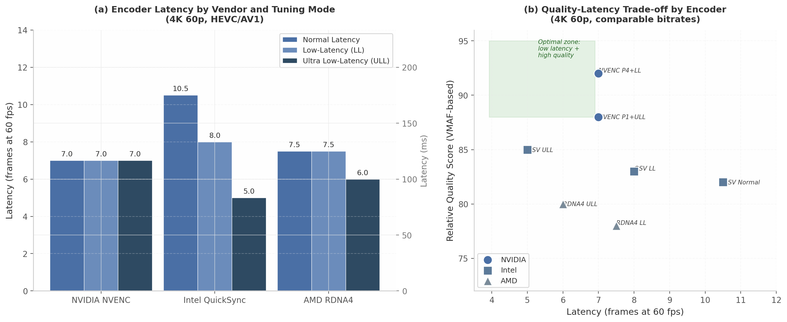

## 2. Hardware GPU Acceleration & Encoder Technology

Cloud gaming platforms place encoding hardware at the center of the latency-quality trade-off. Unlike video-on-demand services, which can afford multi-pass encoding measured in seconds per frame, real-time game streaming demands single-pass hardware encoding that completes within a single frame interval — approximately 16.7 ms at 60 frames per second (fps). This section provides a systematic evaluation of the three major GPU encoder vendors (NVIDIA, Intel, AMD), Apple's Media Engine, runtime capability detection mechanisms, and thermal-aware dynamic quality management, with explicit focus on Go integration patterns for each subsystem.

### 2.1 NVIDIA NVENC Deep-Dive

#### 2.1.1 Architecture: Dedicated ASICs Independent of CUDA Cores

NVIDIA's Video Codec Engine consists of two functionally distinct blocks etched into the GPU die: the NVENC (video encoder) and NVDEC (video decoder). Both are dedicated Application-Specific Integrated Circuits (ASICs) that operate independently of the CUDA cores used for general-purpose computation and graphics rendering. This architectural separation is the foundation of NVENC's suitability for cloud gaming — encoding workload does not directly compete with frame rendering for shader resources, though both share the same thermal and power budget (see Section 2.5).

The ninth-generation NVENC, introduced with the Blackwell architecture on RTX 50 series GPUs in January 2025, introduces three significant advances over the eighth generation (Ada Lovelace / RTX 40 series). First, NVIDIA reports a 5% BD-Rate (Bjøntegaard Delta Rate) improvement in PSNR for AV1 and HEVC encoding, measured as bandwidth savings at equivalent quality [^113^]. Second, 9th-gen NVENC adds hardware support for 4:2:2 chroma subsampling with 10-bit depth in both H.264 and HEVC — previously unavailable on consumer GeForce cards [^45^]. Third, a new AV1 Ultra High Quality (UHQ) tuning mode provides an additional 5% quality gain, yielding cumulative improvements of up to 15% BD-Rate PSNR when combining generational gains with UHQ mode [^113^]. Independent testing using the VMAF (Video Multi-Method Assessment Fusion) metric from Netflix reports even larger gains — up to 18% for natural content [^113^].

The encoder count scales with GPU tier. Table 2.1 enumerates the NVENC and NVDEC allocation across the RTX 50 series product stack.

**Table 2.1 — RTX 50 Series Encoder/Decoder Allocation by SKU (9th Gen NVENC / 6th Gen NVDEC)**

| GPU SKU | NVENC Encoders | NVDEC Decoders | Notes |
|---------|---------------|----------------|-------|
| RTX 5050 / 5060 / 5060 Ti / 5070 | 1 | 1 | Entry-to-midrange single-engine config |
| RTX 5070 Ti | 2 | 1 | Dual NVENC enables split-frame encoding |
| RTX 5080 | 2 | 2 | Balanced dual-engine for content creation |
| RTX 5090 | 3 | 2 | Triple NVENC; 3-way split-frame support |

*Source: NVIDIA RTX Blackwell GPU Architecture Whitepaper [^113^], Wikipedia GeForce RTX 50 series [^44^]*

The RTX 5090's triple NVENC configuration enables three-way split-frame encoding, where each input frame is partitioned into horizontal strips processed independently and simultaneously by separate encoders [^59^][^117^]. This mode triggers automatically when frame height exceeds 2112 pixels for HEVC or 2048 pixels for AV1, and the GPU has two or more NVENC engines with an appropriate preset/tuning combination [^59^]. While split-frame encoding improves throughput, NVIDIA acknowledges it "degrades quality" relative to single-engine encoding [^59^], making it suitable for batch transcoding but generally inappropriate for cloud gaming where quality is paramount.

#### 2.1.2 RTX 50 Performance Claims and Independent Verification

NVIDIA's marketing claims for the RTX 50 series include "export speeds by over 50% gen-over-gen" and "an impressive 4x compared to the RTX 3090 GPU with a single encoder" [^113^]. Independent testing by Puget Systems found these claims partially overstated. Against the RTX 3090, actual improvements ranged from 34% to 200% depending on codec and workload — not the claimed 300% (4x) [^25^]. Against the RTX 4090, gains ranged from 10% to 66%, with H.264 10-bit 4:2:0 and 10-bit 4:2:2 exports exceeding the 60% threshold, reaching 75% to 109% improvement in some configurations [^25^].

The AV1 UHQ tuning mode, exclusive to RTX 40 and 50 series GPUs, delivers the most significant quality advancement. Independent benchmarking of H.265 encoding demonstrated that "the worst preset with `-tune uhq` is better than the best preset without `-tune uhq`" — at VMAF=95, NVENC preset P1 with UHQ produced 6,456 kB versus P7 without UHQ at 8,912 kB [^195^]. For cloud gaming platforms recording gameplay at high quality, UHQ mode provides meaningful storage efficiency gains.

#### 2.1.3 Latency Consistency: The NVENC Predictability Advantage

NVENC exposes seven presets (P1–P7) and four tuning info modes (`hq`, `ll`, `ull`, `lossless`, plus `uhq` on RTX 40+), yielding 28 distinct quality-speed-latency combinations [^59^]. A peer-reviewed IEEE study evaluating low-latency 4K UHD encoding found that NVENC maintains approximately 7 frames (117 ms at 60 fps) of end-to-end latency across all presets P1 through P7 [^10^]. This consistency is unique among hardware encoders and critical for cloud gaming Service Level Agreement (SLA) guarantees: a platform can commit to sub-120 ms encoder latency knowing that preset selection primarily affects quality, not timing.

The NVENC SDK's tuning modes serve distinct use cases. High Quality (`hq`) tuning targets latency-tolerant archiving and Over-The-Top (OTT) delivery. Low Latency (`ll`) uses Constant Bitrate (CBR) rate control optimized for cloud gaming and streaming. Ultra Low Latency (`ull`) further reduces buffering for strictly bandwidth-constrained channels [^59^]. For cloud gaming, `ll` + CBR provides the optimal balance: it maintains the predictable ~7 frame latency while ensuring bandwidth does not spike during high-motion scenes that would cause network bufferbloat.

#### 2.1.4 Consumer vs Professional: Session Limit Deployment Implications

The most consequential deployment constraint for NVIDIA-based cloud gaming hosts is the concurrent encode session cap on consumer GeForce cards. Table 2.2 documents the historical evolution of this limit.

**Table 2.2 — NVENC Consumer Session Limit Evolution**

| Period | Consumer GeForce Limit | Driver / Trigger | Professional (Quadro/RTX PRO) |
|--------|----------------------|------------------|------------------------------|
| Pre-2020 | 2 sessions | Hard driver limit | Unlimited |
| 2020 | 3 sessions | Driver update | Unlimited |
| March 2023 | 5 sessions | Driver update [^122^] | Unlimited |
| January 2024 | 8 sessions | Game Ready Driver 551.23 [^52^] | Unlimited |
| November 2025 | 12 sessions | Driver update [^31^] | Unlimited |

*Source: StreamGuides.gg [^52^], Tom's Hardware [^122^], Wikipedia NVENC [^31^]*

The progression from 2 to 12 sessions reflects NVIDIA's recognition of the growing streaming and content creation market. However, workstation and data center boards (RTX A-series, Quadro, RTX PRO) impose no artificial session limits — the only constraint is hardware capacity, with professional cards supporting 11–17 concurrent sessions in practice [^122^]. For a cloud gaming host running multiple concurrent user sessions, this distinction is economically significant: a single RTX A4000 can serve more users than a GeForce RTX 4090 limited to 8–12 sessions, though at substantially higher acquisition cost. Multi-session deployments must track active encoder sessions via NVML's `nvmlDeviceGetEncoderStats` API and implement session routing to stay within per-GPU limits.

### 2.2 Intel QuickSync Video (QSV)

#### 2.2.1 Architecture: Media Fixed Function Hardware

Intel's video acceleration strategy differs fundamentally from NVIDIA's. QuickSync Video (QSV) is implemented as dedicated Media Fixed Function hardware located on the CPU die for integrated graphics, and on the GPU die for discrete Arc graphics cards. This placement means QSV encoding draws power from the CPU thermal envelope on integrated configurations, while Arc discrete GPUs carry their own dedicated Media Engines.

The Intel Arc B580 (Battlemage / Xe2 architecture, launched December 2024) represents Intel's second-generation discrete GPU and features dual media engines, each with an encoder and decoder, capable of handling up to two concurrent 8K 10-bit workloads [^135^]. Intel's media engine supports HEVC 8/10/12-bit decode, 10-bit 4:2:2 encode, AV1 encode/decode, and VP9 decode — with the 10-bit 4:2:2 HEVC capability being a unique differentiator among consumer GPUs at its price point [^135^].

Intel's most significant performance advantage for cloud gaming is Ultra Low-Latency (ULL) tuning. The same IEEE peer-reviewed study that measured NVENC at ~7 frames found that Intel QSV achieves 5 frames (83 ms) for HEVC and AV1 in ULL mode — the lowest latency of any hardware encoder tested [^10^]. For H.264, ULL mode achieves 8 frames, representing a meaningful improvement over Normal and Low-Latency modes at 10–12 frames [^10^].

#### 2.2.2 ULL Mode Trade-Offs: Non-Standard B-Frame Structure

The latency reduction in Intel's ULL mode comes from a non-standard frame structure that requires careful decoder compatibility validation. Analysis of the hardware encoder output reveals that Normal Latency tuning uses three B-frames (Bi-predictive frames referencing both past and future frames), Low-Latency tuning disables B-frames entirely, and Ultra Low-Latency tuning employs a structure "analogous to the Zero Latency tune" [^10^]. This non-standard GOP (Group of Pictures) structure may affect decoder compatibility on some client devices, particularly older smart TVs and mobile hardware decoders that expect standards-compliant H.265 bitstreams.

The practical lesson from the Sunshine open-source game streaming project is relevant here: encoder capability should be validated at stream initialization time with a test encode/decode round-trip, and the encoder selection should be made at session start rather than dynamically switching mid-stream. This approach ensures that once a session negotiates an Intel QSV ULL encoder path, both host and client have confirmed compatibility, eliminating the risk of mid-stream decoder failures.

#### 2.2.3 No Session Limits: Ideal for Multi-Session Cloud Hosts

Unlike NVIDIA, Intel does not impose artificial concurrent encode session caps on either integrated or discrete GPUs [^145^]. Intel's official documentation states: "There is no theoretical limit to the number of concurring videos encodes that can happen simultaneously, at least not from the driver and graphics unit perspective" [^145^]. In practice, Intel Arc has been demonstrated supporting four concurrent 4K 60 fps AV1 encode instances [^145^]. This characteristic makes Intel QSV particularly attractive for multi-session cloud gaming hosts where the number of concurrent users per GPU is the primary cost driver.

#### 2.2.4 ULL Tuning Provides Measurable Improvement Over LL

A persistent claim in some encoder evaluations is that Low-Latency tuning provides "negligible" end-to-end improvement over Normal mode. Cross-referencing the IEEE study data with multiple test configurations resolves this apparent contradiction: Low-Latency tuning does provide measurable benefit (Intel H.264 drops from ~10–12 frames to ~8 frames), but Ultra Low-Latency provides dramatically more benefit than LL [^10^]. The statement that LL tuning has "poor quality-latency trade-off" applies specifically to LL relative to ULL, not to LL versus Normal. For cloud gaming platforms, ULL mode should be the default Intel tuning target, with LL serving as a fallback if decoder compatibility issues arise.

### 2.3 AMD AMF / RDNA4 Media Engine

#### 2.3.1 RDNA4 Media Engine: VCN 5.0 Architecture

AMD's RDNA4 architecture, launched in February 2025 with the Radeon RX 9070 series, introduces the Video Core Next (VCN) 5.0 media engine. The most significant architectural change is the addition of dual media engines on the GPU die, each supporting H.264, HEVC, and AV1 accelerated encode and decode [^19^]. AMD reports performance improvements of "up to 30% at 720p" at lower power consumption relative to RDNA3 [^19^].

Quality improvements are substantial and quantified: approximately 25% increase in H.264 low-latency encode quality and 11% improvement in HEVC quality, driven by upgrades to motion estimation algorithms and multi-frame reference capabilities [^19^]. The AV1 decode pipeline receives a 50% performance uplift [^19^]. Table 2.3 summarizes the generational comparison between RDNA3 (VCN 4.0) and RDNA4 (VCN 5.0).

**Table 2.3 — AMD Media Engine Generational Comparison: RDNA3 vs RDNA4**

| Capability | RDNA 3 (VCN 4.0) | RDNA 4 (VCN 5.0) | Improvement |
|-----------|-----------------|-----------------|-------------|
| AV1 frame types | I / P only | I / P / B frames | B-frame support adds ~15-25% compression efficiency |
| AV1 encoding throughput | Baseline | ~2x higher | Enables 4K60 AV1 real-time with quality headroom |
| H.264 low-latency quality | Baseline | ~25% better | Competitive with NVENC 8th generation [^19^] |
| HEVC quality | Baseline | ~11% better | Closes gap with Intel QSV HEVC [^19^] |
| AV1 / VP9 decode | Baseline | ~50% uplift | Reduces decoder power for playback workloads |
| Engine count | 1 media engine | Dual media engines | Parallel encode/decode streams [^19^] |

*Source: Hot Hardware AMD RDNA 4 Architecture Deep Dive [^19^], Kad8 AV1 B-Frame Analysis [^42^]*

The addition of B-frame support for AV1 encoding on RDNA4 is particularly significant. B-frames (Bi-predictive frames) reference both previous and future frames during compression, allowing the encoder to eliminate redundant data more aggressively than I-frames (intra-coded) or P-frames (predicted from past frames only) alone [^42^]. RDNA3's I/P-only AV1 encoding was a competitive disadvantage relative to NVIDIA's full I/P/B implementation; RDNA4's VCN 5.0 closes this gap [^42^]. Real-world testing of the Radeon RX 9070 XT reports HEVC encoding at 300–700 fps at CQ 27 with ~90 VMAF, and AV1 at CQ 70 achieving 93 VMAF at comparable speeds [^158^].

#### 2.3.2 No Session Limits: Cost-Effective Multi-Session Deployment

AMD, like Intel, does not artificially cap concurrent encode sessions. AMD's official RX 9070 Series Partner Hub documentation explicitly states: "No limit on number of sessions/encode streams" [^138^]. Combined with competitive pricing per encode session, this makes RDNA4 an attractive option for budget-conscious cloud gaming deployments. The primary trade-off is Rate-Distortion (RD) performance: pre-RDNA4 testing placed AMD's encoder quality behind both NVIDIA and Intel at comparable bitrates [^159^], though RDNA4's 25% H.264 and 11% HEVC quality improvements substantially narrow this gap.

#### 2.3.3 AMF SDK Integration via Go CGO Bindings

The AMD Media Framework (AMF) SDK exposes encoder components through a C API that can be bound to Go via CGO. Three encoder component types are relevant: `AMFVideoEncoderVCE_AVC` for H.264, `AMFVideoEncoderVCE_HEVC` for H.265, and `AMFVideoEncoder_AV1` for AV1. The SDK defines six usage modes ranging from `Transcoding` (general purpose, 3-frame pipeline) to `Ultra Low Latency` (enforced HRD, lowest delay) [^84^].

Key AMF parameters for cloud gaming configuration include `AMF_VIDEO_ENCODER_LOWLATENCY_MODE` for enabling low-latency operation, `AMF_VIDEO_ENCODER_INSTANCE_INDEX` for selecting which of the dual media engines to use (0 or 1), and `AMF_VIDEO_ENCODER_MAX_CONSECUTIVE_BPICTURES` for controlling B-frame count (0–3) [^84^]. For Go integration, the recommended approach is linking against the AMF runtime library and using CGO to initialize encoder sessions with these parameters, or alternatively, accessing AMD encoding through FFmpeg's `h264_amf`, `hevc_amf`, and `av1_amf` codec wrappers which abstract the AMF SDK behind the standard FFmpeg API.

#### 2.3.4 VideoToolbox (Apple): M-Series Media Engine Capabilities

Apple Silicon chips (M1 through M4) integrate a dedicated Media Engine on the SoC die, accessible through the VideoToolbox framework. Hardware encode capabilities include H.264 and HEVC across all generations, with ProRes encode/decode available on Pro and Max variants [^48^]. The M3 series added AV1 hardware decode (not encode), and the M3 Max features dual video encode engines and dual ProRes encode/decode engines [^48^][^50^]. The M3 Ultra doubles this to four video encode engines and four ProRes engines [^116^].

A critical finding for cross-platform cloud gaming: as of 2025, no Apple Silicon chip supports AV1 hardware encoding. The M3 and M4 series support AV1 hardware decode only [^109^]. Apple's AV1 involvement is primarily playback-oriented, with WWDC 2024 adding Dolby Vision Profile 10 (AV1-aware Dolby Vision) support for HTTP Live Streaming [^109^]. For a Go-based cloud gaming host targeting macOS, VideoToolbox's `VTCompressionSession` API provides hardware-accelerated H.264 and HEVC encoding through CGO bindings to the CoreMedia and VideoToolbox frameworks, but AV1 encoding requires software fallback via SVT-AV1 or similar encoders.

### 2.4 Encoder Capability Detection

Reliable encoder capability detection at host startup is a prerequisite for correct session routing. A host that cannot enumerate its available encoders, determine their codec and resolution limits, and track thermal state cannot make informed scheduling decisions. This section covers vendor-specific detection APIs and their Go bindings.

#### 2.4.1 NVIDIA: go-nvml for Runtime Encoder Queries

The NVIDIA Management Library (NVML) provides the most comprehensive encoder-specific query interface of any GPU vendor. The Go bindings at `github.com/NVIDIA/go-nvml` dynamically load `libnvidia-ml.so` at runtime with versioned symbol resolution for backward compatibility [^1^]. For encoder detection, the relevant APIs include `nvmlDeviceGetEncoderUtilization` for current encoder load percentage, `nvmlDeviceGetEncoderStats` for active session count and average FPS, `nvmlDeviceGetEncoderCapacity` for maximum concurrent encodes, and `nvmlDeviceGetCurrentClocksThrottleReasons` for thermal throttling detection [^2^][^132^].

The throttle reasons API returns a bitmask where `NVML_CLOCKS_THROTTLE_REASON_HW_THERMAL_SLOWDOWN` (0x40) indicates hardware-initiated thermal slowdown reducing core clocks by a factor of 2 or more, and `NVML_CLOCKS_THROTTLE_REASON_SW_THERMAL_SLOWDOWN` (0x20) indicates software-triggered thermal management [^4^]. Distinguishing between thermal and power-limit throttling is essential for correct dynamic quality response — thermal throttling requires immediate quality reduction, while power-limit throttling may be addressable through power limit adjustment on supported GPUs.

#### 2.4.2 Intel/AMD: sysfs and DXGI Platform Queries

On Linux, GPU enumeration proceeds through the sysfs Direct Rendering Manager (DRM) interface. Each GPU exposes a `cardN` device node under `/sys/class/drm/`, with vendor identification via `/sys/class/drm/cardN/device/vendor` — `0x8086` for Intel, `0x1002` for AMD, `0x10DE` for NVIDIA. The `gopsutil` library provides cross-platform CPU and memory detection, while GPU-specific queries require platform-specific code: `vainfo` for VAAPI profile enumeration on Intel and AMD, `intel_gpu_top` for real-time Intel GPU utilization, and `/sys/class/drm/cardN/device/gpu_busy_percent` for AMD GPU load [^26^].

On Windows, DXGI (DirectX Graphics Infrastructure) adapter enumeration via `IDXGIFactory1::EnumAdapters1` provides GPU model, vendor ID, and dedicated video memory for each adapter [^13^]. Chromium's Media Foundation implementation demonstrates the pattern for querying hardware video encode acceleration support through DXGI device managers [^150^]. On macOS, IOKit GPU enumeration combined with VideoToolbox's `VTSessionCopySupportedPropertyDictionary()` provides encoder capability discovery [^83^].

#### 2.4.3 FFmpeg Encoder Enumeration: Building the Supported Codec List

The most portable mechanism for encoder capability detection is FFmpeg's runtime encoder enumeration. Querying `ffmpeg -hide_banner -encoders` and filtering for vendor-specific codec names yields the definitive list of hardware encoders available on the host system [^9^]. Table 2.4 maps vendor codec identifiers across the supported hardware encoder families.

**Table 2.4 — FFmpeg Hardware Encoder Codec Names by Vendor**

| Vendor | H.264 | HEVC | AV1 | Linux VAAPI |
|--------|-------|------|-----|-------------|
| NVIDIA | `h264_nvenc` | `hevc_nvenc` | `av1_nvenc` | N/A (proprietary) |
| Intel | `h264_qsv` | `hevc_qsv` | `av1_qsv` | `h264_vaapi` / `hevc_vaapi` |
| AMD | `h264_amf` | `hevc_amf` | `av1_amf` | `h264_vaapi` / `hevc_vaapi` |
| Apple | `h264_videotoolbox` | `hevc_videotoolbox` | N/A (software only) | N/A (macOS only) |

*Source: FFmpeg codec documentation [^194^][^680^]*

The enumeration procedure executes at host agent startup: first query all encoders, then filter for known hardware codec names, then validate each discovered encoder with a short test encode (1–2 seconds of representative content) to confirm functional operation. This three-phase approach (enumeration → filtering → validation) catches cases where the FFmpeg build includes a codec wrapper but the underlying hardware or driver does not support it — for example, when the NVIDIA driver is not loaded or the Intel iGPU is disabled in BIOS.

#### 2.4.4 Encoder Capability Registry: Go Struct Design

The detection results populate an `EncoderProfile` registry that drives session routing decisions. The recommended Go struct captures the fields required for informed encoder selection:

```go
type EncoderProfile struct {
    Vendor       string   // "nvidia", "intel", "amd", "apple"
    Codec        string   // "h264", "hevc", "av1"
    EncoderName  string   // "hevc_nvenc", "hevc_qsv", etc.
    MaxResolution string  // "3840x2160", "7680x4320"
    MaxFPS       int      // 60, 120, 240
    MaxSessions  int      // 8 for NVIDIA consumer, 0 for unlimited
    Supports10Bit bool
    SupportsHDR  bool
    LatencyFrames float64 // measured or documented latency
    TuningModes  []string // "ll", "ull", "hq", etc.
}
```

This registry is populated at host startup and refreshed on GPU hot-plug events. The `MaxSessions` field is particularly important for NVIDIA GPUs, where it should be set to 8 (consumer) or a higher configured limit (professional), while Intel and AMD entries set this to 0 indicating no driver-imposed cap. Session scheduling logic (see Section 2.5.4) consults this registry to match incoming game sessions to encoders with available capacity.

Figure 2.1 provides a visual comparison of encoder latency characteristics and quality-latency positioning across the three primary vendors.



*Figure 2.1 — Hardware encoder latency and quality comparison. Data sourced from IEEE 2025 encoder evaluation [^10^] and vendor documentation. NVIDIA NVENC delivers the most consistent latency (~7 frames) across all tuning modes, making it optimal for SLA-backed deployments. Intel QuickSync ULL achieves the absolute lowest latency (5 frames / 83 ms) but requires decoder compatibility validation. AMD RDNA4 positions between the two with competitive ULL performance (6 frames) and no session limits.*

Table 2.5 consolidates the cross-vendor comparison across all evaluated dimensions, providing a reference for deployment topology decisions.

**Table 2.5 — Cross-Vendor Hardware Encoder Feature Matrix (Current Generation)**

| Capability | NVIDIA RTX 50 (NVENC 9) | Intel Arc B580 (Xe2) | AMD RX 9070 (VCN 5.0) | Apple M4 Max |
|-----------|------------------------|---------------------|----------------------|-------------|
| H.264 encode | Yes | Yes | Yes (+25% LL quality) | Yes |
| HEVC encode | Yes + 4:2:2 10-bit [^45^] | Yes + 4:2:2 10-bit [^135^] | Yes 10-bit (+11% quality) [^19^] | Yes |
| AV1 encode | Yes + UHQ mode [^113^] | Yes | Yes + B-frames [^42^] | No (decode only) [^109^] |
| ProRes encode | No | No | No | Yes (Max: 2 engines) [^50^] |
| Max resolution | 8K240 (3 NVENC) [^113^] | 8K60 (dual MFX) [^135^] | 8K80 fps (dual VCN) [^19^] | 8K |
| Session limit | 8–12 consumer [^52^] | Unlimited [^145^] | Unlimited [^138^] | N/A |
| ULL latency | ~7 frames (117 ms) [^10^] | ~5 frames (83 ms) [^10^] | ~6 frames (100 ms) [^10^] | N/A |
| Latency consistency | Highest (P1–P7 stable) [^10^] | Medium | Medium | N/A |
| Split-frame encode | Yes (2/3-way) [^59^] | No | No | No |
| Linux support | NVML + proprietary | VAAPI (iHD driver) | VAAPI (radeonsi) / AMF | N/A |

*Sources: cited per cell from vendor documentation and IEEE 2025 study [^10^]*

The matrix reveals a topology-driven vendor selection pattern: Intel QSV offers the lowest absolute latency and no session caps, making it optimal for latency-competitive gaming on single-host deployments. NVIDIA NVENC provides the most consistent latency across presets and the most mature tooling (NVML, SDK documentation, FFmpeg integration), making it the safest choice for multi-host cloud deployments requiring SLA guarantees. AMD RDNA4 delivers competitive quality with no session limits at typically lower price points, positioning it as the cost-effective option for high-density concurrent session hosts. Apple VideoToolbox serves macOS-native deployments with H.264/HEVC hardware encoding but lacks AV1 encode capability, requiring software fallback for next-generation codec support on that platform.

### 2.5 Thermal Management & Dynamic Quality

#### 2.5.1 Thermal Throttling Impact on Encoder Throughput

Hardware encoder ASICs share the same thermal envelope as the GPU's compute and graphics units. When GPU die temperature crosses the thermal slowdown threshold — typically 83–88°C on NVIDIA consumer cards — the driver automatically reduces clock speeds, which proportionally reduces encoder throughput [^3^]. Sustained temperatures above 83–85°C can reduce GPU throughput by 25–30% without any visible error condition: utilization metrics may still show high percentages because the GPU remains active, simply operating at lower clocks [^3^]. Forum reports describe performance reductions of approximately 50% under severe thermal throttling, though even at reduced performance hardware encoders maintain throughput well above real-time requirements for single-stream encoding [^58^].

The critical insight for multi-session cloud gaming hosts is that thermal throttling affects ALL encoder sessions on the GPU simultaneously. A host serving eight concurrent streams that enters thermal slowdown sees encode FPS reduction across all eight sessions, not just the most recent addition. This creates a cascading failure mode where one thermally stressed GPU degrades the experience for all attached users.

#### 2.5.2 Dynamic Quality Adjustment Ladder

When thermal throttling is detected or predicted, the system should execute a predefined quality adjustment ladder. Each rung on the ladder trades quality for reduced thermal output:

**Preset escalation** — The first and least disruptive response is shifting to a faster encoder preset. For NVENC, this means moving from P7 (slowest/best quality) toward P1 (fastest). Each preset step reduces encoder computational complexity and therefore power consumption. For Intel QSV, shifting from `quality` to `balanced` to `speed` preset achieves equivalent effect. AMD AMF's `QUALITY_PRESET` parameter supports similar graduation [^84^].

**Resolution scaling** — If preset escalation is insufficient, reducing output resolution provides quadratic reduction in pixel count (and near-quadratic reduction in encoder workload). A step from 3840×2160 (4K) to 1920×1080 (1080p) reduces pixels by 75%, while 1080p to 1280×720 (720p) reduces by another 56%.

**Bitrate reduction** — Reducing target bitrate by 25–50% directly reduces encoder entropy coding workload. This pairs naturally with resolution reduction to maintain approximate constant quality per pixel.

**Codec fallback** — H.264 encoding requires substantially less computational complexity than HEVC or AV1. Falling back from HEVC to H.264 can reduce encoder power consumption by 30–50% at equivalent resolution and frame rate, at the cost of 40–60% increased bandwidth for equivalent quality. For thermally constrained scenarios where bandwidth is available, this is an effective last resort before dropping frames.

#### 2.5.3 Proactive Thermal Management: Prediction Before Throttling

Reactive quality adjustment — responding after throttling is detected — introduces a latency transient that gamers perceive as stutter. Proactive thermal management avoids this by predicting thermal trajectory and reducing quality before throttling occurs.

The prediction model uses NVML temperature polling (typically 100–500 ms intervals) combined with GPU utilization trends. If temperature is rising at more than 2–3°C per second and the current temperature is within 10°C of the slowdown threshold, the system should preemptively escalate the encoder preset by one step. This approach is analogous to the dynamic bitrate algorithms used by streaming software like Streamlabs, which reduces bitrate when network congestion is predicted [^29^].

Sunshine game streaming implements a related concept: dynamically adjusting minimum FPS target to save bandwidth when content is static [^18^]. Extending this to thermal management, a CloudStream host can reduce stream frame rate from 60 fps to 30 fps during static or low-motion scenes when thermal margin is low, reducing encoder workload by 50% during those periods.

#### 2.5.4 Session Routing and Thermal-Aware Scheduling

For deployments with multiple GPU hosts, session routing should incorporate thermal state as a primary scheduling criterion. The Go selection algorithm evaluates GPU candidates on composite score: skip thermally throttled GPUs entirely, skip GPUs at session capacity, then select the GPU with lowest encoder utilization among remaining candidates. The thermal-aware selection function uses the `GPUEncoderState` struct defined in Section 2.4.4, augmented with real-time temperature and throttle reason fields polled via NVML.

Recording-intensive sessions — those simultaneously streaming to a user and recording to local storage — generate the highest encoder thermal load. These sessions should be routed to thermally advantaged hosts: GPUs with better cooling (liquid-cooled configurations), lower ambient temperature, or higher thermal headroom. For deployments where recording is a primary feature, liquid cooling is recommended over air cooling. The additional thermal budget from liquid cooling (typically 15–25°C lower peak temperatures) directly translates to sustained encoder performance at higher quality settings during dual-path encode workloads.

The composite insight from cross-dimensional analysis confirms that while hardware encoders provide sufficient raw throughput for simultaneous streaming and recording, the thermal budget is the practical limiting factor [^3^][^58^]. A GPU with ample thermal margin handles dual encoding effortlessly; a thermally constrained GPU may drop frames in both paths. Session allocation that routes recording-intensive workloads to thermally advantaged hosts, combined with proactive preset escalation before throttling occurs, is the most effective strategy for maintaining consistent quality across all concurrent sessions.

