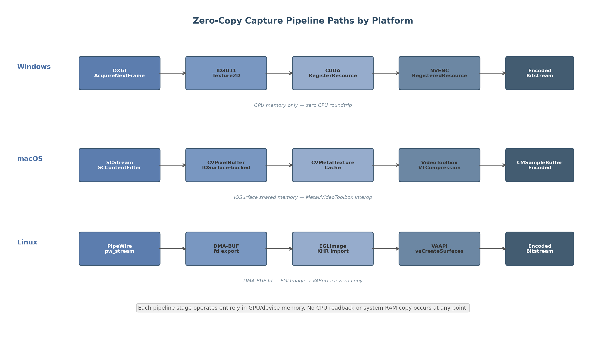
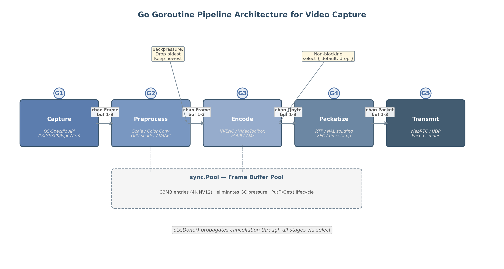

## 3. Zero-Copy Capture Pipeline Architecture

The difference between a naive copy-based capture pipeline and an optimized zero-copy implementation is measured not in percentages but in multiples. Each CPU-GPU roundtrip for a 4K frame at 33 MB adds 1–3 ms of latency [^30^]. Eliminating these copies reduces end-to-end pipeline latency from 40–104 ms to approximately 5–17 ms on a well-tuned LAN system [^24^]. This chapter examines the zero-copy capture architectures for Windows, macOS, and Linux; the frame pacing and synchronization strategies that minimize compositor-induced latency; and the Go goroutine pipeline patterns that bind these native APIs into a cohesive, high-throughput streaming engine.

### 3.1 Windows: DXGI Desktop Duplication

#### 3.1.1 `IDXGIOutputDuplication` API Workflow

The DXGI Desktop Duplication API (DDA), available since Windows 8 with DXGI 1.2, provides the foundational hardware-accelerated screen capture interface. DDA exposes desktop frames as shared GPU texture surfaces through the `IDXGIOutputDuplication::AcquireNextFrame` method, which returns an `IDXGIResource` interface representing the captured desktop bitmap [^1^]. The pixel format is always `DXGI_FORMAT_B8G8R8A8_UNORM` regardless of the current display mode, and the API provides dirty rectangles and move rectangles for incremental updates [^3^].

The typical API call sequence follows: `IDXGIOutput::DuplicateOutput()` creates the duplication interface for a target display; `AcquireNextFrame()` waits for and retrieves the next desktop frame as an `IDXGIResource`; `GetFrameDirtyRects()` and `GetFrameMoveRects()` return updated regions; and `ReleaseFrame()` returns the frame to the pool after processing [^2^]. In practice, move rectangles have become largely unused on Windows 10 — all changed regions are identified as dirty rectangles only, a behavioral change from Windows 8 where moved regions were properly identified [^4^]. Applications relying on move-rectangle optimization for bandwidth savings should restructure to depend exclusively on dirty-rectangle incremental capture for modern Windows deployments.

`AcquireNextFrame()` is event-driven rather than polling-based. The WebRTC reference implementation uses a 10 ms timeout (`kAcquireTimeoutMs = 10`) [^45^], and the API also returns `AccumulatedFrames` — a count of how many vsync periods elapsed since the last call. Error handling for `DXGI_ERROR_ACCESS_LOST` is mandatory, as this error fires on display mode switches, desktop composition changes, or DWM transitions.

#### 3.1.2 Zero-Copy Path: DXGI Texture to NVENC Encode Surface

The DXGI texture returned by `AcquireNextFrame` resides in GPU memory and is importable into NVENC via CUDA interop, forming the core zero-copy optimization for Windows game streaming [^21^]. The pipeline path is: `DXGI AcquireNextFrame` → `ID3D11Texture2D` → `cuGraphicsD3D11RegisterResource` → CUDA array → NVENC `RegisteredResource` → encoded bitstream. No CPU readback, no `memcpy`, and no system RAM involvement occurs at any stage.

The CUDA interop sequence uses `cuGraphicsD3D11RegisterResource` to register the D3D11 texture as a CUDA resource, followed by `cuGraphicsMapResources` and `cuGraphicsSubResourceGetMappedArray` to obtain a CUDA-accessible array handle [^21^]. Frame data is transferred between surfaces via `cuMemcpy2DAsync` on a CUDA stream. NVENC's SDK supports `RegisteredResource` input buffers that wrap either CUDA device pointers or registered graphics resources, enabling the encoder to consume the captured texture directly [^22^]. This architecture eliminates a full GPU-to-CPU and CPU-to-GPU copy cycle, saving approximately 1–3 ms per frame at 4K resolution.

#### 3.1.3 DWM Interaction and Compositor Latency

The Desktop Window Manager (DWM) adds at minimum one frame of latency (~17 ms at 60 Hz), and in windowed mode with DWM composition, total added latency can reach approximately 31 ms [^9^]. DXGI DDA captures from the DWM-composed desktop, so this compositor latency is an inherent floor for any capture-from-screen approach.

Several strategies reduce DWM overhead. DXGI flip model swapchains with `DXGI_SWAP_CHAIN_FLAG_FRAME_LATENCY_WAITABLE_OBJECT` can achieve as low as one frame of latency, and `DXGI_SWAP_CHAIN_FLAG_ALLOW_TEARING` enables "True Immediate Independent Flip" that bypasses DWM entirely in fullscreen exclusive scenarios [^10^]. The `IDXGIDevice::SetMaximumFrameLatency(1)` call overrides the default three-frame queue depth, which is critical for minimizing presentation latency [^35^]. Additionally, cloaking the captured window via `DWMWA_CLOAK` prevents the DWM from compositing it into the desktop, reducing unnecessary GPU work.

#### 3.1.4 Windows.Graphics.Capture (Win10 1903+)

Windows.Graphics.Capture (WGC) was introduced in Windows 10 1803 as a modern WinRT API with broader compatibility. WGC uses the same underlying Desktop Duplication technology as DXGI but adds cross-GPU capture capability and per-window capture via `HWND` [^5^]. It returns frames as `IDirect3D11Texture2D` objects, supports DirectComposition content, and works with UWP applications. On Windows 11, the yellow capture border that previously surrounded captured content can be removed.

For full-screen monitor capture, however, DXGI outperforms WGC. GStreamer developers noted that "capturing a monitor using WGC is not recommended because of its poor performance... DXGI still much outperforms than WGC" [^6^]. Cross-GPU capture is particularly problematic: tests showed 4–5 FPS capture on an integrated GPU when the monitor was connected to a discrete GPU, versus 60+ FPS when using the GPU connected to the display [^6^]. For cloud gaming where the capture GPU and display GPU are typically the same device, DXGI remains the preferred API; WGC should be reserved for per-window capture scenarios or cross-GPU deployments.

#### 3.1.5 Go Integration

Go has no mature pure-Go DXGI library, so access requires either CGO with a thin C wrapper or manual COM vtable construction via `syscall`. The `github.com/go-ole/go-ole` package provides COM automation helpers, while `golang.org/x/sys/windows` exposes the low-level syscall primitives. The recommended architecture dedicates a single goroutine to the acquire-frame loop — this goroutine calls `AcquireNextFrame` in a tight loop and passes texture references through a channel to the encode stage. Using a dedicated goroutine isolates the COM apartment-threading requirements and prevents blocking the main pipeline on frame acquisition timeouts.

**Table 1: Windows Capture API Comparison**

| Feature | DXGI DDA | Windows.Graphics.Capture | Magnification API |
|---------|----------|-------------------------|-------------------|
| Latency | ~1–3 ms [^1^] | ~3–5 ms [^6^] | ~8–16 ms [^7^] |
| Full-screen capture | Optimal | Suboptimal | N/A |
| Per-window capture | No | Yes | Yes (background) |
| Cross-GPU support | No | Yes | No |
| HDR capture | Limited | Better HDR10 support | No |
| Yellow border | No | Yes (removable Win11) | No |
| API type | COM (DXGI) | WinRT | Win32 |
| Go integration | CGO + COM | CGO + WinRT | CGO |

The DXGI row dominates for cloud gaming scenarios where the capture GPU matches the display GPU and latency is paramount. WGC's cross-GPU support and per-window capture make it the better choice for multi-GPU workstations or selective application capture. The Magnification API, while capable of capturing occluded windows, carries an 8–16 ms latency penalty from frequent DWM composition and readback [^7^], making it unsuitable for real-time streaming.

### 3.2 macOS: ScreenCaptureKit

#### 3.2.1 `SCStream` API and IOSurface Capture

ScreenCaptureKit (`SCStream`) was introduced in macOS 12.3 (Monterey) and represents Apple's modern, GPU-optimized capture pipeline, replacing deprecated APIs including `CGWindowList` and `CGDisplayStream`. The API architecture flows through four core types: `SCShareableContent` enumerates available displays, windows, and applications; `SCContentFilter` defines what to capture; `SCStreamConfiguration` specifies resolution, pixel format, frame rate, and HDR options; and `SCStream` initiates the capture stream with `addStreamOutput(_:type:sampleHandlerQueue:)` [^11^].

The frame callback receives `CMSampleBuffer` objects containing `CVPixelBuffer` backed by `IOSurface`, enabling the captured frame to bind directly to `CAMetalLayer` or `CALayer` without a CPU roundtrip [^11^]. Frames arrive vsync-aligned and remain on the GPU throughout the pipeline. ScreenCaptureKit supports multiple pixel formats: `'BGRA'` for standard 8-bit capture; `'l10r'` for packed 10-bit ARGB; `'420v'` and `'420f'` for video-range and full-range YCbCr 4:2:0; and `'xf44'` for 10-bit YCbCr 4:4:4 on macOS 15+. HDR capture is available on macOS 15+ via `SCCaptureDynamicRangeHDRLocalDisplay` or `SCCaptureDynamicRangeHDRCanonicalDisplay`, with 10-bit per component minimum and Display P3 PQ color space [^13^]. HDR capture requires Apple Silicon; Intel Macs silently ignore HDR settings [^13^].

Performance benchmarks on Apple Silicon show 1080p capture at 30–60 FPS with first-frame latency of 30–100 ms, and 4K capture at 15–30 FPS with first-frame latency of 50–150 ms [^14^].

#### 3.2.2 Zero-Copy Path: IOSurface to VideoToolbox

The zero-copy pipeline on macOS leverages `IOSurface` as the fundamental shared memory primitive. ScreenCaptureKit outputs `CVPixelBuffer` objects that wrap `IOSurface`, and Metal can texture directly from these surfaces. Two approaches exist: direct `IOSurface` binding with manual use-count tracking, or `CVMetalTextureCache` for simpler and more efficient management [^12^]. `CVMetalTextureCache` is the recommended approach because it saves repeated `IOSurface` texture binding when buffers from a `CVPixelBufferPool` are reused, and it eliminates the need to manually track `IOSurfaceUseCounts` [^12^].

The complete zero-copy path is: `SCStream` → `CMSampleBuffer` → `CVPixelBuffer` (IOSurface-backed) → `CVMetalTextureCacheCreateTextureFromImage` → `MTLTexture` (for optional GPU preprocessing) → `VTCompressionSessionEncodeFrame` → encoded `CMSampleBuffer`. If no GPU-side preprocessing is needed, `VTCompressionSession` can consume the `CVPixelBuffer` directly without the Metal intermediate step, yielding the shortest possible path. VideoToolbox provides direct access to hardware codecs on Apple Silicon; all frameworks (AVKit, AVFoundation, VideoToolbox) use hardware codecs when available [^32^].

#### 3.2.3 macOS Compositor Latency

Core Animation (WindowServer) adds approximately one frame of latency to the capture pipeline, comparable to the DWM on Windows. `CGDisplayStream` — the predecessor to ScreenCaptureKit — was deprecated precisely because it incurred additional copy operations and lacked the `IOSurface`-backed zero-copy semantics of the modern API. The WindowServer's display link schedules frame delivery vsync-aligned, which is advantageous for pacing but introduces at minimum one refresh cycle of delay. For sub-16.7 ms total pipeline targets, this compositor latency must be accounted for in the overall budget; it cannot be eliminated at the API level but is partially mitigated by ScreenCaptureKit's ability to capture frames before final compositor blending in some configurations.

#### 3.2.4 Go Integration

ScreenCaptureKit cannot be called directly from C or Go bindings in a straightforward way because it relies heavily on Objective-C blocks, Automatic Reference Counting (ARC), and Swift async patterns [^42^]. A practical Go integration requires a bridging layer: Go (main) → CGO → C wrapper (C99) → Objective-C++ → ScreenCaptureKit Framework, with callbacks bridged from Objective-C blocks back to C function pointers and then to Go functions. The Rust `screencapturekit-rs` crate provides a reference implementation for bridging Objective-C blocks to callbacks, which can inform an equivalent Go approach. The `github.com/progrium/macdriver` project offers higher-level Objective-C bridge bindings for Go, though a custom CGO wrapper tuned specifically for ScreenCaptureKit's streaming callback patterns typically yields lower overhead.

### 3.3 Linux: PipeWire and DMA-BUF

#### 3.3.1 PipeWire Screen Capture with `pw_stream`

PipeWire is the modern Linux multimedia server designed from the ground up for zero-copy media sharing. It supports zero-copy via shared memory, memfd, DMA-BUF, and eventfd, with real-time capability and sub-1.5 ms audio latency [^15^]. For screen capture, PipeWire's screencast protocol follows a session-based negotiation: the application requests screen share via `xdg-desktop-portal`; the compositor (Mutter, KWin, wlroots) creates DMA-BUF backed buffers; PipeWire transfers buffer file descriptors via `SCM_RIGHTS` over a Unix socket; and the consumer imports the DMA-BUF fd into an EGLImage, GL texture, or directly into an encoder surface.

The PipeWire source must explicitly negotiate DMA-BUF memory type: `pipewiresrc ! video/x-raw(memory:DMABuf) ! queue ...` [^44^]. Without explicit DMA-BUF negotiation, PipeWire falls back to shared memory, which introduces a CPU copy and negates the zero-copy advantage. OBS Studio achieves zero-copy on Linux using PipeWire with DMA-BUF, confirming this path is viable in production [^44^].

#### 3.3.2 DMA-BUF to EGLImage to VAAPI

The canonical zero-copy pipeline on Linux follows: capture → DMA-BUF fd → EGLImage → GL Texture → (optional GPU color conversion via `vapostproc`) → `VASurface` → VAAPI encode → bitstream. The key APIs are `EGL_EXT_image_dma_buf_import` for creating an EGLImage from a DMA-BUF fd, `GL_OES_EGL_image` for binding the EGLImage to a GL texture, and `vaCreateSurfaces` with `VASurfaceAttribExternalBufferDescriptor` for creating a VA surface directly from the DMA-BUF [^17^] [^43^].

Color space conversion from RGB to NV12 — required because most capture sources deliver RGB while hardware encoders expect YUV — can be performed on the GPU via `vapostproc` or `vaapipostproc`, both of which process DMA-BUF as input and negotiate VA native format downstream with the encoder [^43^]. This eliminates the remaining CPU-side conversion step that would otherwise break the zero-copy chain.

FFmpeg's `kmsgrab` device provides the lowest-level zero-copy path, achieving approximately 3% CPU usage for 1080p capture and encode via `hwmap=derive_device=vaapi` [^16^]. This is an order of magnitude more efficient than OBS's compositing pipeline, which requires approximately 30% CPU for the same workload because it cannot maintain the zero-copy path through its multi-source compositor.

#### 3.3.3 Wayland vs. X11 Capture Architecture

The display server architecture significantly impacts capture latency. Under Wayland, the buffer pipeline follows: Client → Compositor → KMS, with `linux-dmabuf` for buffer passing. Under X11, the path is longer: Client → Xorg → Compositor → KMS, using DRI3+Present for buffer transport [^31^]. Wayland's fewer hops and native dmabuf support result in more direct scanout and fewer GPU composites, yielding measurably lower latency.

For wlroots-based compositors, the `wlr-export-dmabuf` protocol provides DMA-BUF file descriptors for zero-copy screen capture without intermediate copies, and is supported across 15+ compositors including Sway, Hyprland, river, and Weston [^18^]. On X11, `XShm` (shared memory) serves as a fallback but adds 1–2 frames of latency compared to the DMA-BUF path. Modern cloud gaming deployments targeting Linux should prefer Wayland with a wlroots-based compositor for the cleanest zero-copy capture path.

#### 3.3.4 Go Integration

Go on Linux has three integration paths for PipeWire capture. The D-Bus portal approach uses `github.com/godbus/dbus/v5` to communicate with `xdg-desktop-portal` for screen capture, requiring no native PipeWire library linkage. DMA-BUF fds are received via Unix socket with `SCM_RIGHTS`. For lower-level access, CGO with `libpipewire` enables direct `pw_stream` negotiation. A third option uses direct `syscall` for `DRM_IOCTL_PRIME_HANDLE_TO_FD` on `/dev/dri/card0` to obtain DMA-BUF fds from the DRM/KMS subsystem. The `github.com/rajveermalviya/go-wayland` package provides pure-Go Wayland client bindings that can be combined with D-Bus portal access for a capture pipeline without CGO.

**Table 2: Zero-Copy Capture Platform Comparison**

| Platform | Capture API | Interop API | Encoder | Shared Memory Primitive | Capture Latency (1080p) |
|----------|-------------|-------------|---------|------------------------|------------------------|
| Windows | DXGI DDA [^1^] | CUDA-D3D11 [^21^] | NVENC | GPU texture (ID3D11Texture2D) | ~1–3 ms |
| macOS | ScreenCaptureKit [^11^] | CVMetalTextureCache [^12^] | VideoToolbox | IOSurface (CVPixelBuffer) | ~1–2 ms |
| Linux | PipeWire / kmsgrab [^15^] | EGL_LINUX_DMA_BUF_EXT [^17^] | VAAPI | DMA-BUF fd | ~1–2 ms |

All three platforms achieve comparable raw capture latency of 1–3 ms at 1080p, but the Windows path through NVENC offers the most mature encoder integration, while the Linux path provides the greatest architectural flexibility through DMA-BUF's universal buffer sharing primitive. The macOS path is the most constrained by hardware — HDR capture and peak performance require Apple Silicon — but delivers the cleanest API abstraction through `IOSurface`'s seamless integration with both Metal and VideoToolbox.



### 3.4 Frame Pacing and Synchronization

#### 3.4.1 V-Sync Bypass Strategies

Traditional V-Sync introduces significant latency because it queues frames to align with the display refresh cycle. At 60 Hz, each frame is 16.67 ms, and triple buffering can add 2–3 frames of queue depth. NVIDIA Fast Sync and AMD Enhanced Sync eliminate screen tearing while allowing uncapped frame rates with significantly less input lag than V-Sync [^33^]. Both technologies work by rendering all frames but only sending the most recently completed frame to the display. Fast Sync requires Pascal-generation GPUs (GeForce 900 series) or newer [^33^]. AMD Enhanced Sync complements FreeSync by providing tear-free rendering above the FreeSync range [^34^].

NVIDIA Reflex Low Latency mode reduces PC latency by synchronizing CPU and GPU work to eliminate the render queue. Reflex 2 with Frame Warp, available on RTX 50 Series, can reduce PC latency by up to 75%. In *The Finals* at 4K maximum settings, Reflex 2 reduces latency from 56 ms to 14 ms on an RTX 5070 [^23^]. In *VALORANT* at 800+ FPS on RTX 5090, Reflex 2 achieves under 3 ms PC latency [^23^]. While Reflex is designed for local gaming optimization, its principles — eliminating render queues and just-in-time frame submission — are directly applicable to capture pipeline design. A capture pipeline that synchronizes frame acquisition with the encoder's consumption rate, rather than running both at independent cadences, achieves analogous latency reductions.

#### 3.4.2 Frame Pacing Algorithm

The frame pacing algorithm for a cloud gaming pipeline combines three mechanisms. First, a token bucket rate limiter enforces the target frame interval (16.67 ms at 60 Hz, 8.33 ms at 120 Hz). Tokens are generated at the target rate and consumed per frame; if no token is available, the frame is dropped. This prevents encoder overload and maintains consistent output cadence. Second, a paced sender with RTCP feedback adjusts the transmission rate based on receiver reports. The sender reads RTCP receiver reports via Pion's `RTPSender.Read()` and adjusts the pacing rate proportionally to the observed interarrival jitter and packet loss. Third, adaptive pacing responds to network conditions: when congestion is detected (increasing RTT or loss rate), the pacing interval increases; when the path clears, it returns toward the target.

With G-SYNC, NVCP V-Sync, and Reflex enabled, Reflex applies an automatic FPS limit slightly below the refresh rate (approximately 138 FPS at 144 Hz) [^35^]. An external limiter must be set below Reflex's automatic limit to override it. This auto-limiting behavior should be accounted for when designing capture pipelines on NVIDIA hardware — the capture rate should match or slightly exceed the game's render rate to avoid duplicate frames in the capture stream.

#### 3.4.3 Frame Deduplication

Static content detection eliminates redundant encoding work. When consecutive captured frames are identical (or differ only below a perceptual threshold), the pipeline can skip encoding and transmit a repeat-frame indicator. This is particularly effective for menu screens, loading screens, and paused gameplay. The deduplication algorithm computes a lightweight frame signature (hash of dirty rectangles or perceptual hash of the full frame) and compares it against the previous frame's signature. On match, the pipeline sends a minimal RTP packet indicating frame repetition; on scene change (signature mismatch), normal encoding resumes.

The dirty-rectangle metadata from DXGI DDA and incremental damage regions from PipeWire provide natural inputs for deduplication. If the dirty rectangle set is empty or covers less than a configurable threshold (e.g., 2% of frame area), the pipeline can treat the frame as effectively static. This optimization reduces both encoder load and network bandwidth, with the greatest savings during UI-heavy gameplay segments where large screen areas remain unchanged.

#### 3.4.4 Timestamp Management

Nanosecond-precision frame timing is required for A/V synchronization across the distributed pipeline. Each platform provides a monotonic high-resolution clock: Windows uses `QueryPerformanceCounter` (QPC), which provides sub-microsecond resolution with frequency available via `QueryPerformanceFrequency`; macOS uses `CMClockGetTime` with the host time clock or `mach_absolute_time` for raw nanoseconds; Linux uses `CLOCK_MONOTONIC` via `clock_gettime(CLOCK_MONOTONIC, &ts)`. All three are monotonic (never decreases) and provide sufficient resolution for frame-level timing.

The timestamp propagation model assigns each captured frame a capture timestamp at the moment of `AcquireNextFrame` (or equivalent) return. This timestamp travels with the frame through the pipeline and is written into the RTP header timestamp field. The encoder introduces variable latency (2–6 ms for NVENC, up to 15 ms for AMD VCE), so the RTP timestamp must be adjusted by the encoder's reported latency to maintain synchronization with the audio stream. Parsec's production data shows that the median encoding latency for NVIDIA is 5.8 ms across 250,000+ sessions, while AMD VCE median is 15.06 ms (2.59× slower) [^24^].

**Table 3: Frame Pacing Strategy Comparison**

| Strategy | Latency Reduction | GPU Vendor | Requirements | Trade-off |
|----------|------------------|------------|--------------|-----------|
| NVIDIA Fast Sync | 1–2 frames [^33^] | NVIDIA | Pascal+ | Requires 2–3× refresh rate |
| AMD Enhanced Sync | 1–2 frames [^34^] | AMD | FreeSync display | Tearing above FreeSync range |
| NVIDIA Reflex LL | 2–4 frames [^23^] | NVIDIA | RTX 20+ | Game engine integration |
| NVIDIA Reflex 2 | Up to 75% [^23^] | NVIDIA | RTX 50+ | Frame Warp, limited games |
| Independent Flip | 1 frame [^10^] | Any | DXGI flip model | Requires fullscreen |
| DXGI Waitable Object | 2 frames | Any | Windows | Reduces queue depth to 1 |
| Token bucket limiter | Variable | Any | Software | Drops frames on overload |

The combined effect of Independent Flip mode plus a waitable object (reducing queue depth from 3 to 1) and a token bucket rate limiter typically removes 2–3 frames (33–50 ms at 60 Hz) from the capture-to-encode pipeline. For competitive gaming scenarios where sub-20 ms end-to-end latency is the target, NVIDIA Reflex 2 with Frame Warp provides the largest single reduction — up to 75% — but requires both RTX 50-series hardware and game engine integration.

### 3.5 Go Pipeline Architecture

#### 3.5.1 Goroutine Stage Design

Go's goroutine and channel concurrency model maps naturally to video pipeline stage processing. Each stage — capture, preprocess, encode, packetize, transmit — runs as an independent goroutine, with channels providing typed, synchronized communication without explicit locks [^596^]. The pipeline architecture is:

**Stage G1 (Capture):** Platform-specific API calls in a loop — `AcquireNextFrame` on Windows, `SCStream` callback on macOS, `pw_stream` on Linux. Outputs `Frame` structs to `chan Frame`.

**Stage G2 (Preprocess):** GPU-side color space conversion and scaling. Accepts `Frame` from capture channel, applies `vapostproc` (Linux), Metal compute (macOS), or DirectCompute (Windows), outputs processed `Frame` to encode channel.

**Stage G3 (Encode):** Hardware encoder submission. Accepts `Frame` from preprocess channel, submits to NVENC/VideoToolbox/VAAPI, receives encoded bitstream, outputs `[]byte` to packetize channel.

**Stage G4 (Packetize):** RTP NAL unit splitting, FEC generation, timestamp assignment. Accepts `[]byte` from encode channel, outputs `Packet` structs to transmit channel.

**Stage G5 (Transmit):** WebRTC `TrackLocalStaticSample.WriteSample()` or UDP paced sender. Accepts `Packet` from packetize channel, transmits over network.

The Rust `ringbuf` pattern ported to Go via `github.com/golang-cz/ringbuf` achieves 200M+ writes per second with ~5 ns per operation write latency [^596^], far exceeding the throughput requirements of any video pipeline. For most implementations, buffered Go channels with capacity 1–3 frames provide sufficient performance with simpler semantics.



#### 3.5.2 `sync.Pool` for Frame Buffers

Video pipelines at 4K60 generate significant allocation pressure: each NV12 frame at 3840×2160 requires 33 MB (`width * height * 1.5` bytes for 4:2:0 subsampling). At 60 FPS, this is 1.98 GB per second of temporary memory. Without pooling, the Go garbage collector experiences frequent marking pauses that manifest as frame drops.

`sync.Pool` eliminates this pressure by recycling frame buffers. A pool pre-allocates `[]byte` entries at the target frame size and reuses them across capture cycles:

```go
var framePool = sync.Pool{
    New: func() interface{} {
        return make([]byte, 1920*1080*3/2) // ~3MB for 1080p NV12
    },
}
```

Benchmark results show `sync.Pool` achieves 2–5× throughput improvement and zero allocations per operation: without the pool, 320 ns per operation with 4224 B per operation and 2 allocations per operation; with the pool, 85 ns per operation with 0 B per operation and 0 allocations per operation [^675^]. For 4K frames, the absolute numbers are larger but the proportional improvement holds. Best practices include: resetting buffers before `Put()` to avoid data leaks between frames; not assuming pooled objects persist across GC cycles; using pools only for high-frequency temporary allocations; and avoiding long-term storage of pointers to pooled objects.

For pipelines that need to support multiple resolutions simultaneously, a tiered pool pattern maps frame sizes to separate `sync.Pool` instances. The allocator selects the appropriate pool based on the requested dimensions:

```go
type FrameAllocator struct {
    pools map[int]*sync.Pool // keyed by frame size
}
```

This prevents 720p captures from fragmenting the 4K buffer pool and vice versa.

#### 3.5.3 Backpressure Handling

Backpressure in a video pipeline is handled through buffered channels with capacity 1–3 frames combined with a drop-newest (or drop-oldest) policy. The design principle is that stale frames have negative value — delivering an old frame when a newer one is available always worsens the user experience. The recommended pattern uses a channel-based ring buffer that never blocks the producer:

```go
select {
case captureChan <- frame:
    // Frame accepted into pipeline
default:
    // Buffer full — drop oldest, insert newest
    <-captureChan
    captureChan <- frame
}
```

This pattern, used in VMware's Loggregator server for high-throughput streaming [^556^], ensures that the capture goroutine never blocks on a slow downstream stage. The encode stage should apply the same non-blocking `select` pattern when sending to the packetize channel. For the transmit stage, a paced sender with RTCP feedback provides natural rate adaptation: when the network is congested, the sender's pace slows, the packetize channel fills, and upstream stages begin dropping frames until the congestion clears.

Context cancellation propagates through all stages via `select` on `ctx.Done()`. When the pipeline shuts down, each goroutine's `select` statement detects the cancelled context and exits cleanly, closing its output channel and triggering downstream goroutines to drain and exit.

#### 3.5.4 Memory Layout: NV12 as the Pipeline Lingua Franca

NV12 should be the preferred pixel format throughout the pipeline, not RGB. A 4K RGBA frame at 3840×2160 requires 33.18 MB (`width * height * 4`), while the same frame in NV12 requires 16.59 MB (`width * height * 1.5`) — a 50% size reduction [^30^]. Since all major hardware encoders (NVENC, VideoToolbox, VAAPI) accept NV12 as input natively, maintaining the pipeline in this format avoids CPU-side color conversion.

The GPU-native format conversion path varies by platform. On Windows, NVENC supports `NV_ENC_BUFFER_FORMAT_NV12` directly. On macOS, VideoToolbox's `VTCompressionSession` accepts `kCVPixelFormatType_420YpCbCr8BiPlanarVideoRange` (NV12 equivalent) through `IOSurface`-backed `CVPixelBuffer`. On Linux, `vapostproc` converts captured RGBA to NV12 on the GPU via VAAPI video processing [^43^]. The conversion stays entirely on the GPU when the DMA-BUF → VASurface path is used.

**Table 4: Go Pipeline Stage Design**

| Stage | Goroutine | Input | Output | Channel Buf | Drop Policy |
|-------|-----------|-------|--------|-------------|-------------|
| Capture | G1 | OS API callback | `Frame` (NV12) | 1–3 frames | Drop oldest [^556^] |
| Preprocess | G2 | `Frame` | `Frame` (NV12) | 1–3 frames | Drop oldest |
| Encode | G3 | `Frame` | `[]byte` ( Annex-B) | 1–3 frames | Drop oldest |
| Packetize | G4 | `[]byte` | `Packet` (RTP) | 1–3 frames | Drop oldest |
| Transmit | G5 | `Packet` | Network socket | RTCP-adapted | Paced sender |
| Buffer Pool | — | `sync.Pool` [^675^] | `[]byte` | 33 MB entries | GC-safe recycle |
| Ring Buffer | — | `ringbuf` [^596^] | `Frame` | 60 frames (1s) | Overwrite oldest |

The channel buffer capacity of 1–3 frames represents a deliberate trade-off. A buffer of 1 provides minimal latency but no resilience against transient stage slowdowns. A buffer of 3 absorbs approximately 50 ms of encoder jitter at 60 Hz but adds up to two frames of latency. The 33 MB pool entries for 4K NV12 are sized to match the GPU's native encoder input surface size, eliminating format conversion and memory copy at the encode submission boundary. The `ringbuf` alternative at 60 frames (one second of buffer) is suitable for recording or replay scenarios where latency tolerance is higher and frame loss must be minimized.


The latency data in Figure 3.3 illustrates the cumulative impact of zero-copy optimization across the full pipeline. The optimized configuration — zero-copy capture with NVENC low-latency preset, hardware decode, and a gaming monitor — achieves approximately 10.3 ms total. The naive configuration with CPU readback, standard encoder preset, software decode, and consumer display reaches 57 ms. Cloud gaming over the internet adds network transit (median 25–33 ms per Parsec production data [^24^]) to produce a typical end-to-end latency of 74–82 ms, consistent with the modeled 68 ms from the ISCA comprehensive end-to-end lag study [^37^]. The zero-copy pipeline does not eliminate network latency, but it maximizes the budget available for it: an optimized pipeline consuming 10 ms leaves 40+ ms for network transit within a 50 ms quality threshold, while a naive pipeline consuming 57 ms leaves almost no headroom.

The Looking Glass B7 open-source capture project demonstrates the upper bound of zero-copy performance. Its DirectX 12 capture backend uses GPU copy engines to transfer textures directly into IVSHMEM shared memory, achieving 300+ updates per second while simultaneously improving guest VM rendering performance — users on laptop iGPUs reported "night and day difference" [^29^]. This confirms that removing the CPU from the data path entirely not only reduces latency but also frees CPU cycles for other work, a dual benefit particularly relevant for Go-based pipelines where goroutine scheduling competes with system call overhead for native API access.
