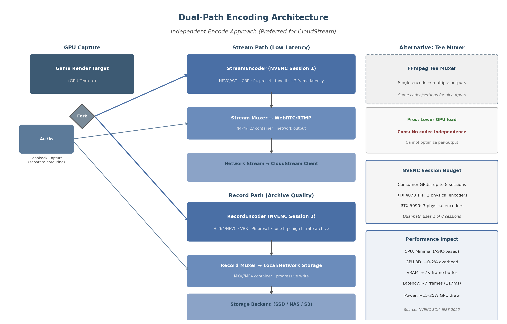
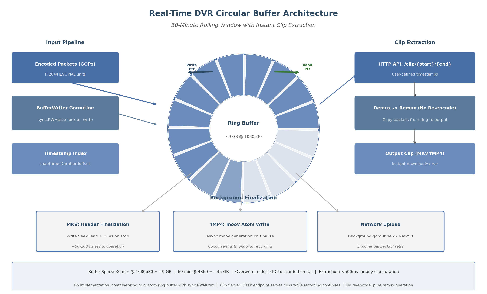

## 4. Simultaneous Streaming + Recording Architecture

The CloudStream platform must satisfy a demanding requirement: deliver a low-latency gameplay stream to a remote client while simultaneously recording a high-fidelity archive to local or network storage — all without dropping frames, increasing stream latency, or impacting the game's rendering performance. This chapter presents the architectural design that achieves these constraints through dual-path hardware encoding, zero-copy frame duplication, crash-safe container selection, and a real-time DVR circular buffer implemented in Go.

Enterprise hardware encoders have demonstrated this capability for years. The Matrox Monarch HDX, for instance, employs dual independent H.264 encoders that share 30 Mb/s of combined capacity to broadcast a live webstream at one bitrate while recording mastering-quality files for post-event VOD or NLE editing [^1^]. The Haivision Makito X with Storage integrates 250 GB of SSD storage and four internal H.264 encoding engines, enabling users to record high-quality streams at 20 Mbps while simultaneously streaming low-bitrate variants to save bandwidth [^6^][^8^]. These purpose-built appliances confirm that simultaneous streaming and recording is not merely theoretically possible but commercially proven — the challenge lies in achieving equivalent results on commodity GPU hardware within a Go-based software architecture.


*Figure 4.1 — Dual-path encoding architecture: a single GPU capture texture forks to independent StreamEncoder and RecordEncoder sessions, each with codec parameters optimized for its output path. Audio follows a parallel fan-out via a dedicated goroutine. The FFmpeg tee muxer alternative (dashed) enables single-encode/multi-output at the cost of codec independence.*

### 4.1 Dual-Path Encoding Design

#### 4.1.1 Architecture Overview

The preferred architecture for CloudStream is the independent dual-encode approach: a single captured frame is duplicated to two separate encoder instances, each running in its own NVENC (NVIDIA Video Encoder) session with independently configurable parameters. The stream encoder targets low-latency delivery using HEVC or AV1 with Constant Bitrate (CBR) rate control, while the record encoder prioritizes archive quality using H.264 or HEVC with Variable Bitrate (VBR) at a substantially higher bitrate. This separation ensures that stream quality degradation — whether from network congestion or bitrate throttling — never affects the archival recording.

The critical distinction between this approach and a single-encoder design (such as the Blackmagic ATEM Mini Pro, which uses the same encoder for both streaming and recording) [^9^] is that independent encoders permit per-output optimization. The ATEM Mini's limitation — where the 3 Mbps stream bitrate also determines the recording bitrate — produces archive files unsuitable for post-processing. CloudStream's dual-encode architecture avoids this constraint entirely.

#### 4.1.2 GPU Session Allocation and Vendor Limits

NVIDIA consumer GPUs enforce driver-level limits on concurrent NVENC encoding sessions. These limits have evolved significantly: pre-2020 GPUs were restricted to 2 sessions, expanded to 3 in April 2020, to 5 in March 2023, and as of January 2024, Game Ready Driver 551.23 increased the cap to 8 concurrent sessions across nearly all NVENC-capable GPUs from Maxwell through Ada Lovelace architectures [^52^][^23^]. The sole exception is the GTX 1630, which retains a 3-session limit [^23^]. Workstation and data center GPUs (Quadro, Tesla, RTX PRO) have no artificial session restrictions and can achieve 11–17 concurrent sessions depending on workload and hardware [^21^].

| GPU Series | Encoder Generation | Consumer Session Limit | Physical Encoders | Split-Frame Encoding |
|---|---|---|---|---|
| RTX 20/30 (Turing/Ampere) | 7th gen | 8 [^52^] | 1 | No |
| RTX 40 (Ada Lovelace) | 8th gen | 8 [^52^] | 2 (RTX 4070 Ti+) [^24^] | Yes (2-way) [^59^] |
| RTX 50 (Blackwell) | 9th gen | 8 [^52^] | 2–3 (RTX 5090: 3) [^113^] | Yes (2/3-way) [^59^] |
| Intel Arc B580 (Xe2) | MFX dual | No driver limit [^145^] | 2 media engines [^135^] | No |
| AMD RX 9070 (RDNA4) | VCN 5.0 | No limit [^138^] | 2 media engines [^19^] | No |

*Table 4.1 — GPU encoder session allocation by vendor. NVIDIA imposes driver-level session caps that have increased from 2 (pre-2020) to 8 (January 2024). Intel and AMD do not artificially limit encode sessions on consumer hardware. The dual-path streaming+recording pipeline consumes exactly 2 sessions.*

The dual-path architecture consumes exactly two of the eight available sessions on modern NVIDIA hardware, leaving six sessions for additional encoding tasks such as resolution variants, thumbnail generation, or secondary stream outputs. On GPUs with dual physical NVENC engines (RTX 4070 Ti and above), the stream and record encoders can execute on separate hardware units, eliminating scheduling contention. RTX 5090 GPUs extend this to three physical encoders, enabling even more concurrent encoding pipelines [^113^]. However, empirical testing on dual-NVENC GPUs reveals non-deterministic performance scaling: an RTX 4090 running two encoder instances sometimes achieves cumulative throughput of ~50 fps (near-linear scaling), but often falls to 25–40 fps depending on driver scheduling behavior [^27^]. This variability is managed through the NVENC SDK's explicit encoder instance selection (`AMF_VIDEO_ENCODER_INSTANCE_INDEX` on AMD, implicit session management on NVIDIA) and by monitoring encoder utilization via NVML (NVIDIA Management Library) [^132^].

Intel and AMD present a different profile. Intel Arc GPUs, including the B580 (Xe2/Battlemage architecture), feature dual media engines with no driver-level session limits and support HEVC 4:2:2 10-bit encoding — a capability unique among consumer GPUs [^135^]. AMD's RDNA4 architecture introduces dual media engines with VCN 5.0, delivering AV1 B-frame support for the first time on AMD hardware and a roughly 25% improvement in H.264 low-latency encode quality [^19^][^42^]. Both vendors are viable for dual-path encoding, though NVIDIA's tooling ecosystem (NVML, NVENC SDK, FFmpeg integration) remains the most mature for multi-session management.

#### 4.1.3 FFmpeg Tee Muxer: Single-Encode Alternative

The FFmpeg `tee` pseudo-muxer provides an alternative to independent dual encoding by writing the same encoded packets to multiple destinations from a single encoding pass [^11^]. A typical invocation streams to an RTMP endpoint while simultaneously writing to a local MKV file:

```bash
ffmpeg -i input -c:v h264_nvenc -b:v 6000k -c:a aac -b:a 128k \
  -f tee "[f=flv:onfail=ignore]rtmp://server/stream|[f=matroska]recording.mkv"
```

The tee muxer is efficient when both outputs can accept identical codec parameters, bitrates, and container formats. Its key advantage is halving GPU encoder load. The critical limitation, however, is that all outputs receive the same encoded data — it is impossible to configure one output for low-bitrate streaming and another for high-bitrate archiving [^11^]. When using the `libavformat` API directly, the tee muxer is unnecessary because the same `AVPacket` can be fed to multiple `av_write_frame()` calls for different muxers [^11^].

For CloudStream, the tee muxer serves as a fallback mode when GPU encoder sessions are exhausted (e.g., on older 2-session GPUs or when thermal throttling reduces available capacity). The primary mode remains independent dual encoding to preserve codec and parameter independence between stream and record paths.

#### 4.1.4 Encoder Configuration Strategy

The recommended encoder configurations reflect the divergent requirements of each path. The stream encoder uses NVENC preset P4 (medium) with `tune ll` (low latency) and CBR rate control, which an IEEE peer-reviewed study confirms maintains approximately 7 frames (117 ms at 60 fps) of latency across nearly all presets and tuning modes [^26^]. The record encoder uses preset P6 (slower, better quality) with `tune hq` (high quality) and VBR rate control, trading encoding speed for archival fidelity. For HEVC encoding on RTX 50-series GPUs, the new `tune uhq` (ultra high quality) mode can yield up to 15% BD-BR PSNR improvement [^113^].

The performance impact of this dual-path approach is minimal on properly cooled hardware. NVENC is a dedicated ASIC (Application-Specific Integrated Circuit) on the GPU die, meaning parallel encoding sessions do not consume additional CPU resources [^19^]. GPU 3D rendering overhead is negligible (~0–2%), though VRAM allocation increases by approximately two frame buffers. The principal concern is thermal budget: dual encoding increases GPU power draw by an estimated 15–25W, which in thermally constrained systems (particularly laptops or compact chassis) can trigger throttling that reduces encoding throughput by 25–30% [^58^][^61^]. Proactive thermal monitoring via NVML's `nvmlDeviceGetCurrentClocksThrottleReasons` API is essential to detect thermal or power-limit throttling before it affects stream quality [^132^].

### 4.2 Frame Duplication Strategies

Once a frame is captured from the GPU render target, it must be made available to both encoder sessions without introducing copy overhead that would increase latency or compete for memory bandwidth. Three strategies exist, ordered from most to least efficient.

#### 4.2.1 GPU Memory Fork via CopyResource

The most robust duplication method uses `ID3D11DeviceContext::CopyResource` (or Vulkan's `vkCmdCopyImage`) to duplicate the captured texture to a second GPU texture before either encoder consumes it. This operation executes entirely on the GPU's copy engine, with measured latency of approximately 0.1 ms for a 1080p frame and under 0.3 ms for 4K — well within the 16.67 ms budget of a 60 fps pipeline [^30^]. The source texture is copied to two independent textures, each formatted for its target encoder (typically NV12 for hardware encoders). Both copies proceed asynchronously on the GPU copy queue while the 3D engine continues rendering the next frame.

The key implementation detail is triple-buffering the staging textures. As documented in DXGI Desktop Duplication API patterns, calling `Map` immediately after `CopyResource` forces a CPU-GPU synchronization that can stall the pipeline for 1–3 ms [^30^]. By rotating through three staging textures — copying to texture $N$, mapping texture $N-2$ — the pipeline maintains full throughput with acceptably aged data (2–3 frames of latency, already present in the encoding pipeline).

#### 4.2.2 Shared Texture with Dual Consumers

The ideal strategy — zero-copy shared texture access — occurs when both encoder sessions can read directly from the same GPU texture without duplication. This requires the encoder API to support read-only texture references rather than demanding exclusive ownership. NVIDIA's NVENC SDK accepts `NV_ENC_INPUT_RESOURCE_TYPE_DIRECTX` textures that can be registered with `NvEncRegisterResource` without transferring ownership; the encoder reads the texture contents during `NvEncEncodePicture` and returns immediately. In practice, however, encoder implementations (including FFmpeg's `h264_nvenc`) often expect textures in a specific format (NV12) that differs from the capture format (BGRA/RGBA), necessitating at minimum an in-place color space conversion — which itself requires a separate texture.

For Vulkan Video pipelines, the `VK_EXTERNAL_MEMORY_HANDLE_TYPE_OPAQUE_WIN32_BIT` extension enables cross-API texture sharing without CPU round-trip [^31^]. FFmpeg's Vulkan backend supports zero-copy via `AVHWFramesContext`, keeping frames on GPU throughout the decode-scale-encode pipeline [^33^]. Shared texture access is the target optimization for future encoder SDK versions but is not universally reliable across all codec and format combinations today.

| Method | Copy Latency (1080p) | Copy Latency (4K) | GPU Load | CPU Load | Reliability | Recommendation |
|---|---|---|---|---|---|---|
| GPU CopyResource fork | ~0.1 ms | ~0.2–0.3 ms | Low (copy engine) | None | High | Primary strategy |
| Shared texture (zero-copy) | 0 ms | 0 ms | None | None | Medium | Target optimization |
| CPU-side duplication | 1–3 ms | 3–8 ms | None | Moderate | High | Fallback for compatibility |
| Audio channel fan-out | N/A | N/A | N/A | Low | High | Always used for audio |

*Table 4.2 — Frame duplication methods compared by latency, resource utilization, and reliability. GPU-side CopyResource provides the best balance of speed and dependability. CPU-side duplication via sync.Pool is acceptable for the recording path where an additional 1–3 ms does not impact stream latency.*

#### 4.2.3 CPU-Side Duplication Fallback

When GPU texture sharing is unavailable — such as on older GPUs, when using CPU-based software encoders, or when the capture and encoder operate in different GPU contexts — frames must be copied to system memory. A `sync.Pool`-buffered CPU copy of a 4K BGRA frame (approximately 33.2 MB uncompressed) takes 1–3 ms on modern DDR4/DDR5 memory subsystems. While this adds latency to the recording path, it does not affect the stream path if the stream encoder continues to receive GPU textures directly.

The Go implementation uses `sync.Pool` to reuse `[]byte` frame buffers, eliminating per-frame allocations and associated garbage collection pressure:

```go
var framePool = sync.Pool{
    New: func() interface{} {
        return make([]byte, 0, maxFrameSize)
    },
}

// Acquire buffer from pool
buf := framePool.Get().([]byte)
buf = buf[:neededSize]

// Copy frame data...
// Return buffer to pool when done
framePool.Put(buf[:0])
```

This pattern is critical for sustained 60 fps operation: without `sync.Pool`, per-frame allocations of 33 MB at 60 fps would generate 1.9 GB/s of garbage, forcing frequent GC cycles that disrupt pipeline timing.

#### 4.2.4 Audio Duplication via Channel Fan-Out

Audio follows a parallel but simpler path. A dedicated goroutine captures system audio loopback (via WASAPI on Windows, PulseAudio/PipeWire on Linux, or CoreAudio on macOS), producing PCM packets that are duplicated through Go channel fan-out to both the stream mixer (for WebRTC/RTMP transmission) and the record muxer (for file writing). The fan-out pattern, drawn from Go's concurrency idioms [^48^], provides type-safe, lock-free packet distribution:

```go
func fanOutAudio(source <-chan AudioPacket, 
    stream chan<- AudioPacket, record chan<- AudioPacket) {
    for pkt := range source {
        select {
        case stream <- pkt:
        default: // stream buffer full, drop packet
        }
        select {
        case record <- pkt: // recording never drops
        }
    }
}
```

The stream path uses a lossy channel (dropping packets on full buffer) to prevent backpressure from affecting capture timing, while the record path uses a blocking channel to guarantee archive completeness. This asymmetry reflects the different reliability requirements: a dropped audio packet in the live stream causes a brief glitch, but a dropped packet in the recording is permanently lost.

### 4.3 Recording Container Formats

The choice of recording container determines crash safety, editing compatibility, and streaming interoperability. CloudStream's container selection logic must account for three distinct scenarios: local recording (crash safety paramount), network upload (streamability required), and editing workflow (NLE compatibility essential).

#### 4.3.1 MKV (Matroska): Progressive Crash-Safe Recording

MKV is the recommended default for local recording. Its Extensible Binary Meta Language (EBML) structure permits progressive writing — the container header is written at the start, and each encoded GOP (Group of Pictures) is appended as a complete, self-describing block [^20^]. If the recording process crashes or is terminated, the file remains playable up to the last fully written GOP. No finalization step is required. MKV also imposes no practical limit on the number of audio, video, or subtitle tracks, supports every codec of relevance (H.264, HEVC, VP9, AV1, Opus, FLAC, AAC), and carries no patent licensing requirements [^20^].

The FFmpeg MKV muxer (`-f matroska`) integrates natively with NVENC output and supports real-time writing at bitrates exceeding 100 Mbps — far above the 6–10 MB/s required for 4K60 H.265 recording [^46^]. OBS Studio's default recommendation to "always record to .mkv and let OBS remux to .mp4 after recording" reflects the format's proven reliability [^34^]. Remuxing a multi-gigabyte MKV to MP4 takes seconds to a minute on SATA SSD storage [^34^].

#### 4.3.2 Fragmented MP4 (fMP4): Live-Safe Network Streamable

Traditional MP4 containers write the `moov` atom (metadata index) at the end of the file; if the recording crashes before this atom is written, the entire file becomes unplayable [^34^]. Fragmented MP4 (fMP4) solves this by dividing the stream into self-contained fragments, each with its own `moof` (movie fragment header) and `mdat` (media data) atoms [^22^]. Each fragment is independently playable.

The essential FFmpeg flags for crash-safe fMP4 recording are:

```bash
ffmpeg -i input -c:v libx264 -c:a aac \
  -movflags frag_keyframe+empty_moov+separate_moof \
  -f mp4 output.mp4
```

The `frag_keyframe` flag starts a new fragment at each video keyframe, ensuring that any fragment can be decoded independently [^37^]. The `empty_moov` flag writes an initial `moov` atom with zero duration at the start of the file, making it streaming-compatible [^37^]. When using these flags, "in the event of a crash you will lose, at worst, a single GOP — the last one that was being written at the time of crash" [^35^]. OBS 30.2+ introduced "Hybrid MP4" mode, which uses internal fragmentation to mimic MKV's crash resilience while maintaining MP4 compatibility [^34^].

| Format | Crash Recovery | Streamable | NLE Compatibility | Key Mechanism | Best For |
|---|---|---|---|---|---|
| MKV | Excellent — playable to crash point [^34^] | Partial (no native HLS/DASH) [^20^] | Good (Premiere, DaVinci) | Progressive EBML write | Local recording |
| fMP4 | Good — per-fragment playable [^35^] | Yes (native HLS/DASH) [^22^] | Good (post-finalize) | Fragments with moof/mdat | Network upload |
| MP4 (traditional) | Poor — unplayable without moov [^34^] | No (requires complete file) | Excellent | moov atom at EOF | Post-remux delivery |
| MOV | Same as MP4 [^36^] | Partial | Excellent (ProRes native) | QuickTime variant | Editing workflows |
| MPEG-TS | Good — per-packet independent [^7^] | Yes (broadcast standard) | Limited | 188-byte fixed packets | Error-prone networks |

*Table 4.3 — Recording container format comparison across crash recovery, streamability, NLE (Non-Linear Editing) compatibility, and mechanism. MKV dominates local recording due to progressive write semantics; fMP4 is preferred for network destinations requiring HLS/DASH compatibility; MOV serves ProRes editing workflows.*

#### 4.3.3 Container Selection Logic

CloudStream implements a destination-aware container selection: local SSD recordings default to MKV for maximum crash safety; network uploads (SMB, S3, WebDAV) use fMP4 with `frag_keyframe+empty_moov` to ensure streamable fragments during upload; editing workflows that require ProRes (if available via Apple VideoToolbox or Blackmagic hardware) use MOV. The selection is configurable per storage backend and can be overridden by the user.

#### 4.3.4 Audio Track Embedding

The recording muxer embeds audio tracks according to the archive quality requirements. For stream-safe compatibility, AAC at 128–256 kbps or Opus at 128 kbps is used — both are universally supported and add negligible overhead (~0.128–0.256 Mbps) [^30^]. For archive-quality recording, uncompressed PCM or AC-3 passthrough preserves the full audio fidelity of the source, particularly important for multi-channel (5.1/7.1) content. MKV's unlimited track support [^20^] enables embedding multiple audio streams simultaneously — for example, a stereo Opus track for quick preview and a multi-channel FLAC track for full archival fidelity.

### 4.4 Real-Time DVR & Instant Replay

The DVR (Digital Video Recorder) subsystem provides a rolling buffer of recent gameplay that enables instant clip extraction without interrupting the ongoing stream or recording. This capability — analogous to OBS Studio's Replay Buffer [^38^] or StreamShark's Live DVR (which supports up to 8 hours of rolling buffer with unlimited highlight creation during live events) [^39^] — is a key differentiator for the CloudStream platform.


*Figure 4.2 — Real-time DVR circular buffer architecture. Encoded GOPs are written to a ring buffer by a dedicated goroutine with write-pointer advancement. Clip extraction uses the read pointer to demux a time-range without re-encoding. Background finalization handles container header completion and network upload independently of the live recording stream.*

#### 4.4.1 Circular Buffer Design

The circular buffer stores encoded video frames (as complete GOPs or muxed fragments) in a fixed-size memory-mapped ring. At 1080p30 with H.265 encoding at 50 Mbps, 30 minutes of video requires approximately 9 GB of storage (50 Mbps × 1800 s ÷ 8 = 11.25 GB, reduced to ~9 GB with typical VBR efficiency) [^46^]. At 4K60, the same 30-minute window expands to approximately 45 GB at H.265 150 Mbps, necessitating either shorter retention windows, lower bitrates, or disk-backed rather than purely memory-resident buffers.

| Resolution | Codec | Bitrate | 30-min Size | 60-min Size | Memory Required |
|---|---|---|---|---|---|
| 1080p30 | H.265 | 50 Mbps | ~9 GB | ~18 GB | Feasible (16 GB+ systems) |
| 1080p60 | H.265 | 80 Mbps | ~14 GB | ~28 GB | Feasible (32 GB+ systems) |
| 1440p60 | H.265 | 100 Mbps | ~18 GB | ~36 GB | Marginal (disk-backed) |
| 4K30 | H.265 | 100 Mbps | ~18 GB | ~36 GB | Marginal (disk-backed) |
| 4K60 | H.265 | 150 Mbps | ~45 GB | ~90 GB | Requires NVMe SSD buffer |

*Table 4.4 — Circular buffer capacity requirements by resolution and codec. Purely memory-resident buffers are feasible up to 1080p60 on systems with 32 GB RAM; 4K recording requires a disk-backed ring buffer on NVMe SSD (3,000+ MB/s sustained write). H.264 recordings increase sizes by approximately 50%.*

The buffer is organized as a ring of fixed-size slots, each holding one GOP (typically 1–2 seconds of video). A write pointer advances with each encoded GOP, overwriting the oldest slot when the buffer is full. A companion timestamp index — a `map[time.Duration]uint64` mapping wall-clock offsets to byte offsets within the ring — enables $O(1)$ lookup of any frame's position for clip extraction. The index is updated under a `sync.RWMutex` write lock by the buffer writer goroutine, while clip extraction acquires a read lock, permitting concurrent read access during writes.

#### 4.4.2 Clip Extraction: Zero-Re-Encode Remux

When the user triggers a clip save (via the HTTP API endpoint `/clip?start=T0&end=T1`), the system performs the following sequence: (1) acquire a read lock on the timestamp index; (2) resolve the byte offsets corresponding to the requested start and end timestamps; (3) copy the contiguous range of encoded packets from the ring buffer to a temporary output file; (4) remux to the target container format (MKV or fMP4) without re-encoding; (5) release the read lock; (6) finalize the output container headers.

This remux-only approach is critical for speed: a 5-minute 1080p60 clip (approximately 1.5 GB of encoded data) can be extracted in under 500 ms, as the operation is memory-to-disk I/O with no computational processing. The extracted clip is a valid, seekable video file from the moment finalization completes. For MKV output, FFmpeg's `matroska` muxer handles the remux via `av_write_frame()` calls that copy packets directly from the source buffer. For fMP4, the `movflags=frag_keyframe+empty_moov` flags ensure the output is immediately streamable [^37^].

The Go implementation uses a custom ring buffer structure rather than `container/ring` from the standard library, which lacks the random-access-by-timestamp semantics that video extraction requires:

```go
type DVRBuffer struct {
    slots       [][]byte           // encoded GOP packets
    timestamps  []time.Duration    // slot start timestamps
    writeIdx    int                // current write position
    totalSlots  int
    mu          sync.RWMutex
    index       map[time.Duration]int // timestamp -> slot index
}

func (d *DVRBuffer) ExtractClip(start, end time.Duration, w io.Writer) error {
    d.mu.RLock()
    defer d.mu.RUnlock()
    
    startSlot := d.findSlot(start)
    endSlot := d.findSlot(end)
    
    for i := startSlot; i <= endSlot; i++ {
        slot := d.slots[i%d.totalSlots]
        if _, err := w.Write(slot); err != nil {
            return err
        }
    }
    return nil
}
```

#### 4.4.3 Background Finalization

Container finalization is performed asynchronously so that it never blocks the live recording pipeline. For MKV recordings, finalization writes the `SeekHead` and `Cues` (index) elements that enable efficient seeking — a 50–200 ms operation that is deferred until recording stops or a periodic flush interval (every 60 seconds) is reached [^34^]. For fMP4 recordings, the `moov` atom generation is similarly deferred, with fragments written continuously during recording and only the final `mfra` (movie fragment random access) box appended on stop [^37^]. Both operations run in a dedicated goroutine that communicates with the main recording pipeline via a buffered channel of finalization tasks.

#### 4.4.4 Go Implementation: Goroutine Pipeline

The DVR subsystem is implemented as a pipeline of Go goroutines, each responsible for a single processing stage. This design maps the Go concurrency model directly to the video pipeline: a capture goroutine produces frames, an encoder goroutine consumes frames and produces packets, a buffer writer goroutine consumes packets and writes to the ring, a clip server goroutine handles HTTP requests for clip extraction, and a background uploader goroutine drains completed clips to configured storage backends [^48^].

Channels between stages provide natural backpressure: a full channel blocks the producer until the consumer catches up. For the recording pipeline, this blocking behavior is desirable — dropping encoded frames is unacceptable. Channel buffer sizes are tuned to the latency tolerance of each stage: 2–4 frames between capture and encode (to absorb encoder jitter), 60–300 packets between encode and buffer write (1–5 seconds of buffer), and 10–60 segments between buffer write and network upload.

The clip server runs an HTTP handler that serves extracted clips while recording continues. Because clip extraction acquires only a read lock on the ring buffer, the live recording stream is never blocked — a user can save a 30-second replay of the last minute of gameplay without dropping a single frame from the ongoing stream or recording. This non-blocking design is essential for the cloud gaming use case, where any interruption to the encoding pipeline directly impacts the player's experience.
