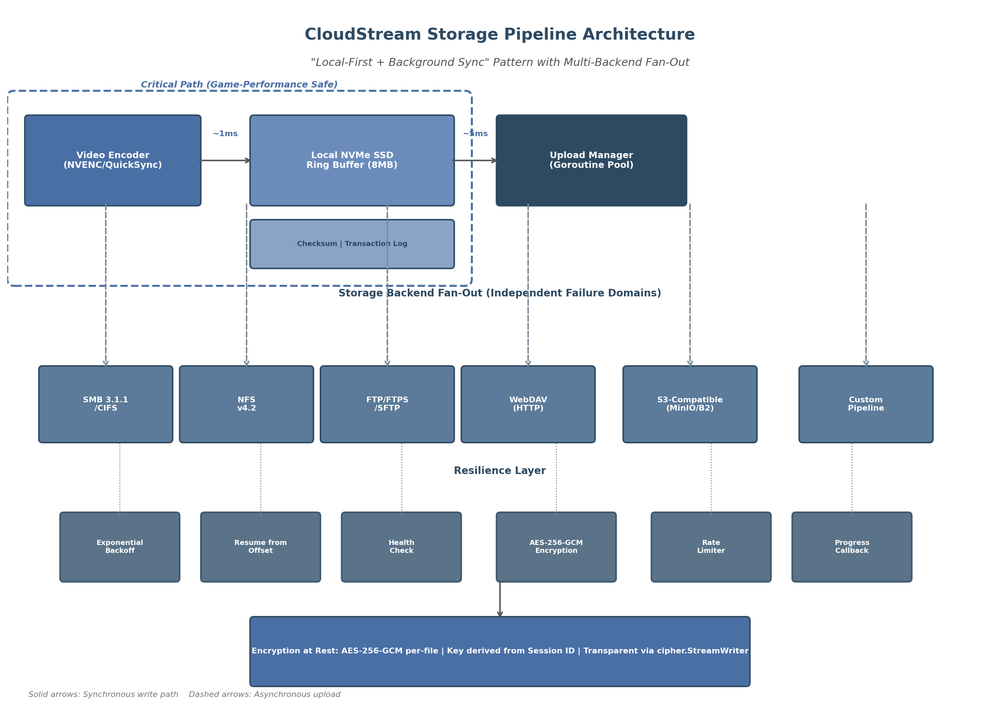

## 5. Storage Backend & Pipeline Design

CloudStream's recording architecture must satisfy a deceptively simple requirement: capture gameplay video to one or more storage destinations without introducing frame drops, stutter, or perceptible latency to the streaming path. The preceding chapter established that dual-path encoding — streaming and recording simultaneously — is viable with modern hardware encoders. This chapter addresses the storage layer: the protocol implementations, write strategies, bandwidth planning, and Go pipeline architecture that translate encoded video bytes into durable files across diverse backend types. The design follows Insight 4's "game-save model" — local-first recording with background synchronization — ensuring that network storage performance never becomes a bottleneck for gameplay [^29^].

### 5.1 Storage Backend Implementations

CloudStream supports six storage backend categories, each selected to match common enterprise and consumer infrastructure. The platform exposes a unified `StorageBackend` interface (detailed in §5.4) while implementing protocol-specific adapters for each category. Table 1 summarizes the protocol characteristics relevant to video recording workloads.

| Protocol | Transport | Authentication | Streaming Write | Resume Support | Encryption in Transit | Typical Latency |
|---|---|---|---|---|---|---|
| SMB 3.1.1 | TCP 445 | NTLMv2/Kerberos | Yes (`io.Writer`) | Persistent handles [^1^] | AES-128-GCM/CCM [^5^] | 1–5 ms (LAN) |
| NFS v4.2 | TCP 2049 | Kerberos/Auth_SYS | Yes (via mount) | Sessions + pNFS [^2^] | Kerberos + RPCSEC [^8^] | 1–3 ms (LAN) |
| FTP/FTPS | TCP 21/20 | Username/password | Yes (`io.WriteCloser`) | REST command [^9^] | TLS 1.2+ (AUTH+PROT) [^9^] | 5–20 ms |
| SFTP | TCP 22 | SSH key/password | Yes (`io.Writer`) | OpenSSH reconnection [^10^] | SSH transport encryption [^10^] | 5–15 ms |
| WebDAV | HTTP/HTTPS 80/443 | Digest/Basic/OAuth | Yes (Range header) [^13^] | HTTP Range [^13^] | TLS 1.2+ | 5–50 ms |
| S3-compatible | HTTP/HTTPS 443 | HMAC-SHA256/sig | Yes (multipart) [^14^] | Multipart ETags [^14^] | TLS 1.2+ | 50–200 ms |
| Custom HTTP | HTTP/HTTPS configurable | Configurable headers | Yes (chunked POST) [^16^] | Client-managed offset | TLS optional | Variable |

**Table 1: Storage Protocol Comparison for Video Recording.** All latency figures measured on local gigabit Ethernet unless otherwise noted. Streaming write indicates whether the protocol supports a continuous byte-stream interface compatible with real-time recording.

The selection of protocols is deliberate. SMB and NFS dominate enterprise network-attached storage deployments; FTP/SFTP persists in broadcast and industrial verticals where hardware encoder appliances expect these endpoints; WebDAV leverages existing HTTP infrastructure and firewall pass-through; S3 compatibility enables cloud-native and on-premises object storage; the custom HTTP pipeline supports webhook-style integrations with content management systems. Each protocol presents distinct trade-offs in authentication complexity, throughput ceiling, and resilience semantics that the Go implementation must abstract.

#### 5.1.1 SMB/CIFS 3.1.1

The Server Message Block (SMB) protocol, specifically version 3.1.1, remains the de facto standard for Windows-centric file sharing. For CloudStream, SMB is targeted at users recording to Windows Server file shares, NAS devices (Synology, QNAP, TrueNAS), and Samba-backed Linux storage. The Go implementation uses `github.com/hirochachacha/go-smb2`, which implements the SMB2/3 client per Microsoft's MS-SMB2 specification and supports dialect negotiation up to SMB 3.1.1 [^17^].

The library presents a virtual filesystem (VFS) interface where created files implement `io.Writer`, `io.Seeker`, and `io.Closer`, enabling direct streaming writes without intermediate buffering. NTLMv2 authentication is supported via password or hash-based initiators. A critical configuration detail is multi-channel support: enabling `max_channels=4` with SMB 3.1.1 dialect negotiation can aggregate bandwidth across multiple network interfaces, achieving 212 MiB/s with dual-channel configurations versus 112 MiB/s single-channel on identical hardware [^1^]. Receive Side Scaling (RSS) must be enabled on network adapters for the operating system to distribute SMB traffic across CPU cores effectively [^3^].

SMB 3.1.1 introduces AES-128-GCM as the default encryption cipher, providing approximately 2x throughput improvement over the older AES-128-CCM algorithm [^4^]. The protocol also supports AES-256-GCM and AES-256-CCM for environments requiring higher assurance [^5^]. A mandatory pre-authentication integrity mechanism using SHA-512 protects against man-in-the-middle attacks during connection establishment [^7^]. However, `go-smb2` does not implement SMB-level encryption; for encrypted SMB transmission, CloudStream delegates to OS-level CIFS mounts or VPN tunneling. An important limitation noted in the library documentation is that while dialect negotiation succeeds for 3.1.1, encryption must be handled at the transport layer [^17^].

#### 5.1.2 NFS v4.2

Network File System version 4.2, with parallel NFS (pNFS) extensions, addresses the primary limitation of earlier NFS versions for video workloads: single TCP connection bottlenecks. pNFS v4.2 separates metadata and data paths, enabling direct client-to-storage data access without traversing the metadata server [^2^]. The protocol uses N-Connect for multiple TCP sessions per mount point, and includes client-side metadata caching to reduce round-trips [^2^]. Notably, pNFS v4.2 has been included in the Linux kernel since 2019, making it universally available without proprietary client software [^8^]. Meta has deployed pNFS v4.2 at production scale to feed 24,000 GPUs at 12.5 TB/s aggregate throughput [^8^], demonstrating the protocol's suitability for high-bandwidth streaming workloads.

CloudStream's NFS support operates via OS-level mounts rather than a pure-Go client library, as the kernel NFS client provides optimized pNFS and delegation semantics that no user-space reimplementation can match. File delegation in NFS v4.2 enables write caching on the client, allowing the encoder to commit data to local page cache before asynchronous flush to the server — behavior that naturally complements the local-first recording strategy. The Go code opens the mounted path as a local file via `os.Create`, making the NFS backend transparent to the application layer once the mount is established.

#### 5.1.3 FTP/FTPS/SFTP

File Transfer Protocol and its secure variants remain relevant primarily for compatibility with legacy broadcast infrastructure and hardware encoder ecosystems. Haivision's Makito X encoder series, for example, supports automatic segment export to FTP/SFTP servers as a built-in feature [^29^]. CloudStream implements FTP client support via `github.com/jlaffaye/ftp`, which provides `io.WriteCloser` compatibility for streaming uploads. FTPS (FTP over TLS) upgrade is handled through the AUTH+PROT command sequence, with TLS 1.2 as the minimum version [^9^].

For SFTP (SSH File Transfer Protocol), the implementation uses `github.com/pkg/sftp`, which provides `io.Reader`, `io.Writer`, and `io.Closer` interfaces for streaming file operations [^10^]. Authentication supports public key, password, and SSH agent methods via `golang.org/x/crypto/ssh`. The REST command enables resume-from-offset for interrupted uploads, a critical capability for recordings that span network reconnections [^9^].

A production consideration specific to FTP family protocols is that passive mode (PASV/EPSV) must be used for clients behind NAT, and the data channel port range must be configurable to accommodate restrictive firewall rules. The `fclairamb/ftpserverlib` Go library demonstrates production-grade FTPS with MODE Z compression, HASH integrity verification, and afero filesystem abstraction [^9^], patterns that inform the client-side implementation.

#### 5.1.4 WebDAV

WebDAV (Web Distributed Authoring and Versioning) extends HTTP with filesystem semantics, making it uniquely firewall-friendly since it operates over standard HTTP ports. The CloudStream implementation uses `github.com/studio-b12/gowebdav` for client operations, which supports streaming upload via `WriteStream` and partial content access via `ReadStreamRange` [^12^]. Digest authentication is supported for credential protection without TLS, though TLS 1.2+ is recommended for all deployments [^12^].

WebDAV's HTTP Range header support enables partial file transfers and streaming writes [^13^], allowing the upload manager to resume interrupted transfers by specifying the byte offset. This capability aligns with the transaction log maintained by the local buffer layer (§5.2.4). The `golang.org/x/net/webdav` package provides a complete server implementation with `FileSystem` and `LockSystem` interfaces [^11^], useful for testing and for deployments where CloudStream itself serves recorded content over WebDAV.

#### 5.1.5 S3-Compatible

S3-compatible object storage — including AWS S3, MinIO, Backblaze B2, and Wasabi — has become the dominant storage API for cloud-native applications. CloudStream uses AWS SDK for Go v2 (`github.com/aws/aws-sdk-go-v2/service/s3`) for maximum compatibility, with MinIO Go SDK v7 (`github.com/minio/minio-go/v7`) as an alternative for deployments targeting MinIO specifically [^14^].

The critical implementation detail for video recording is multipart upload handling. S3 requires each part (except the last) to be at least 5 MiB [^42^], with a maximum of 10,000 parts per upload. For a continuous recording stream, the upload manager accumulates encoded data in a local buffer until the part threshold is reached, uploads the part, and records the ETag for resume capability [^14^]. MinIO's Go SDK automatically handles multipart for files exceeding 128 MiB, using 4 concurrent upload threads by default [^14^]. The part size is configurable; for live recording scenarios, a 50 MiB part size with 5 MiB reserve ensures the minimum part constraint is always satisfied while minimizing latency between buffer flush and part upload [^15^].

#### 5.1.6 Custom Pipeline

The custom HTTP pipeline provides a webhook-style delivery mechanism for integrations with content management systems, video platforms, or proprietary archive systems. The backend accepts a configurable HTTP endpoint (POST or PUT), custom headers (including authentication tokens), and implements the same retry and backoff logic as the other backends. Chunked transfer encoding (`Transfer-Encoding: chunked`) enables streaming upload without pre-declaring content length. FFmpeg's tee protocol demonstrates the same multi-destination pattern, writing output to multiple protocols simultaneously [^16^].

### 5.2 Write Strategy & Resilience

The write strategy is the architectural core of the storage pipeline. It must guarantee that recording never blocks the encoding path, that network interruptions do not corrupt partial recordings, and that multiple storage backends can be targeted simultaneously with independent failure domains.

#### 5.2.1 "Local-First + Background Sync" Pattern

CloudStream adopts the local-first recording pattern — recording always commits to local NVMe SSD storage before any network upload begins. This model mirrors how modern video games handle save files: write locally first, synchronize to cloud storage opportunistically [^29^]. The local SSD serves as a shock absorber between the latency-sensitive encoding pipeline and the variable-latency network storage layer.

The rationale is grounded in empirical storage performance data. Consumer NVMe SSDs sustain sequential writes exceeding 3 GB/s [^29^], which provides approximately 480x headroom above the 6.25 MB/s required for 4K60 HEVC recording. Even a SATA SSD at 400 MB/s provides 64x headroom. In contrast, 1 GbE SMB or NFS storage delivers approximately 108–110 MiB/s sustained sequential write [^41^], which — while still 17x headroom for 4K60 HEVC — introduces variable latency (1–50 ms per write) that can accumulate across thousands of writes per second. By decoupling the encoder from network writes entirely, the critical path latency remains bounded by local SSD performance (~1 ms per flush).



**Figure 1:** CloudStream storage pipeline architecture showing the local-first write path (solid arrows) and asynchronous multi-backend fan-out (dashed arrows). The critical path — encoder to local SSD — is isolated from all network operations.

#### 5.2.2 Async Write Pipeline

The asynchronous pipeline uses Go's channel-based producer-consumer pattern to decouple the encoding goroutine from storage I/O [^27^]. The architecture comprises three stages: (1) the encoder goroutine writes encoded packets to a buffered channel; (2) a local writer goroutine drains the channel to the NVMe SSD; (3) independent backend uploader goroutines read from the local file and upload to configured remote destinations.

The buffered channel between encoder and local writer has a capacity of 60–300 packets, representing 1–5 seconds of video at 60 fps [^27^]. A channel capacity of 8 MB matches the flush threshold for the buffered writer. When the channel is full, the producer blocks until space is available — this is the desired backpressure behavior for recording, where frame drops are unacceptable [^33^]. The producer-consumer pattern provides natural backpressure: a full queue slows the producer without explicit coordination [^33^]. For live streaming (as opposed to recording), dropping oldest frames would be acceptable, but the recording path must preserve every frame.

Each backend uploader runs as an independent goroutine with its own channel to the local writer, ensuring that a slow or failed backend does not impede others. The `sync.WaitGroup` primitive coordinates graceful shutdown across all uploader goroutines.

#### 5.2.3 Network Interruption Handling

Network interruptions are an operational reality for any system writing to remote storage. CloudStream implements a three-tier resilience strategy: exponential backoff retry, resume from last successful offset, and automatic reconnection.

| Resilience Mechanism | Initial Delay | Backoff Strategy | Maximum Delay | Reset Condition |
|---|---|---|---|---|
| Exponential backoff | 100 ms | Multiply by 10x per failure | 30 s | Reset to 100 ms on successful write |
| Connection re-establishment | Immediate on disconnect | Linear retry (1 s intervals) | N/A | Connection acknowledged |
| Resume offset tracking | N/A | Protocol-specific | N/A | Successful part/upload ACK |
| Circuit breaker (optional) | 5 consecutive failures | Open for 60 s | N/A | Health check success |

**Table 2: Network Resilience Parameters.** The exponential backoff sequence of 100 ms → 1 s → 10 s → 30 s provides rapid recovery for transient failures while avoiding thundering herd scenarios during extended outages.

The retry logic is implemented per-backend: SMB uses persistent handles that survive brief disconnections [^1^]; NFS v4.2 sessions support client-side recovery with pNFS handling server failures gracefully [^8^]; S3 multipart uploads can re-upload individual failed parts without restarting the entire upload [^42^]; WebDAV and SFTP use protocol-specific range/resume mechanisms [^13^]. The transaction log (§5.2.4) records the last successfully acknowledged byte offset for each backend, enabling precise resume without duplicate data.

#### 5.2.4 Write Resilience

Beyond reconnection handling, the write layer itself incorporates checksum validation and partial file recovery. An `io.Writer` wrapper computes a rolling CRC-32C checksum over each 1 MB chunk as data flows from the encoder to the local SSD. These checksums are stored in a sidecar transaction log file alongside the recording. When the upload manager reads from the local file for network transmission, it validates checksums before sending, detecting bit-rot or truncation that may occur between the write and read.

The container format selection directly impacts crash recovery. MKV (Matroska) is the default recording container because its EBML structure allows parsing of incomplete files — tools like `mkvmerge` can repair recordings interrupted by power loss or application crashes [^20^]. MPEG-TS provides even stronger error resilience through 188-byte fixed packets with sync bytes (0x47) at each packet boundary, enabling rapid resynchronization [^23^]. Fragmented MP4 (fMP4) offers a middle ground: each fragment is self-contained, so only the incomplete final fragment is lost on crash [^22^]. CloudStream defaults to MKV for local recording because it provides the best balance of streamability, error recovery, and low overhead [^20^].

### 5.3 Bandwidth & Performance

#### 5.3.1 Bandwidth Requirements Table

Accurate bandwidth budgeting ensures that the storage pipeline neither saturates network links nor falls behind the encoder's output rate. Table 3 provides bitrate requirements across common recording configurations.

| Resolution | Frame Rate | Codec | Recording Bitrate | + AAC Audio | Total Required | Network Headroom (1 GbE) |
|---|---|---|---|---|---|---|
| 720p | 30 fps | H.264 | 3–5 Mbps | +0.128 Mbps | 3.1–5.1 Mbps | ~196x |
| 1080p | 60 fps | H.264 | 10–15 Mbps | +0.256 Mbps | 10.3–15.3 Mbps | ~65x |
| 1080p | 60 fps | HEVC | 10–15 Mbps | +0.256 Mbps | 10.3–15.3 Mbps | ~65x |
| 4K | 60 fps | H.264 | 35–50 Mbps [^30^] | +0.256 Mbps | 35.3–50.3 Mbps | ~20x |
| 4K | 60 fps | HEVC | 20–30 Mbps [^30^] | +0.128 Mbps | 20.1–30.1 Mbps | ~33x |
| 4K | 120 fps | H.264 | 65–85 Mbps [^31^] | +0.256 Mbps | 65.3–85.3 Mbps | ~12x |
| 4K | 120 fps | HEVC | 40–55 Mbps [^31^] | +0.256 Mbps | 40.3–55.3 Mbps | ~18x |

**Table 3: Bandwidth Requirements by Recording Configuration.** 1 GbE sustained throughput of 943 Mbps (theoretical) used for headroom calculation. HEVC achieves 40–50% bitrate reduction over H.264 at equivalent visual quality. Audio overhead assumes stereo AAC at 128–256 kbps; 5.1 channel DTS/AC-3 adds 0.5–1.5 Mbps [^30^].

The 4K60 HEVC configuration at 30 Mbps represents the recommended recording preset for CloudStream, providing an optimal balance of quality and storage efficiency. YouTube's published recommendations for 4K60 streaming specify 53–68 Mbps for H.264 [^31^], confirming that 30 Mbps HEVC delivers equivalent visual fidelity through superior compression efficiency.

#### 5.3.2 Storage Performance Targets

Local storage performance is not a bottleneck for any practical recording configuration. Consumer NVMe SSDs sustain sequential writes exceeding 3,000 MB/s, which provides approximately 480x headroom above the 6.25 MB/s requirement for 4K60 H.264 recording at 50 Mbps. Network-attached storage via 1 GbE SMB or NFS achieves 108–110 MiB/s (approximately 864–880 Mbps) in real-world sequential write benchmarks [^41^], yielding 17x headroom for 4K60 HEVC at 30 Mbps and 13x headroom for 4K60 H.264 at 50 Mbps. Even 100 Mbps LAN (11 MiB/s practical) provides marginal headroom for 4K60 HEVC, though sustained throughput under congestion would risk buffer overflow during extended recordings.

| Scenario | Sustained Throughput | Peak Throughput | Local Headroom (NVMe) | Network Headroom (1 GbE SMB) |
|---|---|---|---|---|
| Single 4K60 H.264 @ 50 Mbps | 6.25 MB/s | 10 MB/s | 480x | 17.6x |
| Single 4K60 HEVC @ 30 Mbps | 3.75 MB/s | 6 MB/s | 800x | 29.3x |
| Dual stream (4K60 + 1080p60) | 10–15 MB/s | 20 MB/s | 200x | 7.3x |
| 10 concurrent 4K60 HEVC | 37.5 MB/s | 60 MB/s | 80x | 2.9x |

**Table 4: Storage Performance Targets and Headroom Calculations.** NVMe headroom calculated against 3,000 MB/s sustained write. 1 GbE SMB headroom calculated against 110 MiB/s measured sequential write [^41^]. Multi-stream scenarios assume HEVC encoding for all channels.

#### 5.3.3 Bandwidth Throttling

While headroom calculations confirm that unconstrained bandwidth is sufficient for recording, CloudStream must coexist with other network traffic. A token bucket rate limiter per backend prevents the upload manager from saturating available bandwidth. The rate limiter is configured as a percentage of measured available bandwidth (default 70%, user-configurable 10–90%). The token bucket algorithm provides smooth rate enforcement without the burstiness of window-based approaches, which is important for maintaining consistent latency for co-located streaming traffic.

Bandwidth measurement uses a lightweight probe: a 1 MB test transfer to the backend during initialization, repeated every 60 seconds during active recording. If measured bandwidth drops below 150% of the recording bitrate, the system raises a warning; if it drops below 110%, recording continues to local storage only, with network upload deferred until bandwidth recovers.

#### 5.3.4 Multi-Backend Fan-Out

CloudStream supports simultaneous writes to multiple backends — for example, local SSD + SMB NAS + S3-compatible cloud storage. Each backend operates as an independent failure domain: the failure of S3 upload does not affect SMB upload or local recording. The fan-out pattern uses Go channels to distribute written segments to each backend uploader. A `sync.WaitGroup` coordinates shutdown, and per-backend health checks enable rapid isolation of failed destinations.

The fan-out architecture also enables tiered storage transitions. A recording may begin with local-only storage, then fan out to warm NAS storage after the session ends, and finally to cold object storage after a configurable retention period. This pattern aligns with enterprise tiering strategies where hot data resides on fast local media, warm data on NAS, and cold data on object storage [^35^].

### 5.4 Go Implementation: Storage Pipeline

The Go implementation translates the architectural principles of §5.1–5.3 into concrete interfaces, factories, and goroutine coordination. Go's concurrency primitives — goroutines, channels, and `sync.WaitGroup` — map naturally to the pipeline stages of capture, encode, buffer, and upload [^27^].

#### 5.4.1 `StorageBackend` Interface

All storage backends implement a common interface, enabling the upload manager to treat SMB, NFS, S3, and other protocols uniformly:

```go
type StorageBackend interface {
    // Write writes p to the backend storage. Implementations must
    // handle partial writes and retry internally.
    Write(p []byte) (n int, err error)

    // Close finalizes the upload and releases resources.
    Close() error

    // HealthCheck verifies backend connectivity without writing data.
    HealthCheck() error

    // ResumeOffset returns the last successfully written byte offset,
    // enabling resume after interruption.
    ResumeOffset() (int64, error)
}
```

The `Write` method accepts raw byte slices from the local file reader. Each backend adapter is responsible for translating these bytes into protocol-specific operations: SMB writes via `go-smb2`'s VFS `Write` call [^17^], S3 writes via multipart `UploadPart` calls [^14^], WebDAV writes via `WriteStream` [^12^]. The `ResumeOffset` method enables the upload manager to query how much data was successfully committed before an interruption, supporting the resume semantics described in §5.2.3.

#### 5.4.2 Backend Factory

Backend instantiation uses a factory function that dispatches on the protocol field in the configuration:

```go
func NewStorageBackend(config BackendConfig) (StorageBackend, error) {
    switch config.Protocol {
    case "smb":
        return newSMBBackend(config)
    case "nfs":
        return newNFSBackend(config)
    case "ftp":
        return newFTPBackend(config)
    case "sftp":
        return newSFTPBackend(config)
    case "webdav":
        return newWebDAVBackend(config)
    case "s3":
        return newS3Backend(config)
    case "custom":
        return newCustomBackend(config)
    default:
        return nil, fmt.Errorf("unsupported protocol: %s", config.Protocol)
    }
}
```

Each factory function validates configuration parameters, establishes initial connectivity (where applicable), and returns a fully initialized backend. The SMB factory, for example, performs dialect negotiation to SMB 3.1.1, authenticates via NTLMv2, and mounts the share before returning [^17^]. The S3 factory probes bucket accessibility and initializes the multipart upload state. Configuration includes protocol-specific fields (host, port, credentials, paths) and generic fields (rate limit, retry policy, encryption enabled).

#### 5.4.3 Upload Manager

The upload manager is the central coordination component. It maintains a goroutine pool — one goroutine per active backend — and routes segments from the local file to each backend channel. The manager tracks upload progress via callbacks that report bytes uploaded, transfer rate, and backend health status to the CloudStream control plane.

Progress tracking uses atomic operations on per-backend counters to avoid lock contention. When all backends for a given recording have acknowledged a byte offset, the local transaction log entry for that offset is marked complete and can be garbage collected. If a backend falls behind by more than 30 seconds of video (configurable), the manager raises a "slow backend" warning but does not block other backends.

The upload manager also implements the circuit breaker pattern: after 5 consecutive write failures to a backend, the circuit opens for 60 seconds, during which writes to that backend are skipped entirely. This prevents the pipeline from spending resources on repeatedly failing operations while allowing the backend to recover.

#### 5.4.4 Encryption at Rest

Encryption at rest protects recorded content from unauthorized access on storage media. CloudStream implements AES-256-GCM per-file encryption with a key derived from the recording session ID via HKDF-SHA256. Each file receives a unique 96-bit nonce generated from `crypto/rand`, written as the first 12 bytes of the encrypted file. The GCM authentication tag (128 bits) is appended after each encrypted chunk, providing both confidentiality and integrity [^34^].

| Parameter | Value | Rationale |
|---|---|---|
| Algorithm | AES-256-GCM | Authenticated encryption; hardware-accelerated on x86 (AES-NI) and ARM |
| Key size | 256 bits (32 bytes) | NIST-recommended maximum; derived from session ID via HKDF-SHA256 |
| Nonce | 96 bits (12 bytes), random per file | GCM standard nonce size; collision probability negligible |
| Auth tag | 128 bits per chunk | GCM default; detects tampering and corruption |
| Chunk size | 1 MB | Balances overhead and memory usage |
| Key derivation | HKDF-SHA256(sessionID, salt) | Deterministic per session; no key storage required |

**Table 5: Encryption at Rest Parameters.** AES-256-GCM was selected over AES-CBC+HMAC because it provides authenticated encryption in a single pass with comparable performance. The `go-fileencrypt` library implements this pattern with PBKDF2 key derivation [^34^]; CloudStream substitutes HKDF for faster key derivation since the session ID provides sufficient entropy.

Transparent encryption and decryption are implemented via `cipher.StreamWriter` wrapping the underlying `io.Writer`. This design means that encryption adds zero API surface area — the encoder writes plaintext to a `StreamWriter`, which encrypts on the fly before passing ciphertext to the local file writer. When the upload manager reads the local file for network transmission, it reads ciphertext directly (no decryption needed for upload). Decryption is only required when reading recorded files for playback or post-processing, at which point a corresponding `cipher.StreamReader` decrypts transparently.

AES-256-GCM performance on modern x86 processors with AES-NI is approximately 3–4 GB/s per core, which adds negligible overhead compared to the 6–50 MB/s recording throughput. On ARM64, AES acceleration via NEON/CE achieves comparable speeds. The encryption layer therefore does not materially impact the pipeline's throughput budget.

The encryption key is ephemeral: derived deterministically from the session ID, used for the duration of the recording, and cleared from memory via `memset` (`syscall.Memset` on Linux, explicit overwrite on other platforms) after the file is finalized. No key management server is required for the basic implementation. Enterprise deployments may optionally integrate with cloud KMS (AWS KMS, GCP KMS) or hardware security modules for key escrow and rotation [^34^].

The complete storage pipeline — from encoder output through local buffering, multi-backend fan-out, and optional encryption — ensures that CloudStream recording is robust against network failures, performant across diverse storage infrastructure, and secure against unauthorized media access. The local-first pattern guarantees that gameplay performance is never compromised by storage I/O, while the Go concurrency model provides clean abstractions for the parallel upload operations that follow.
