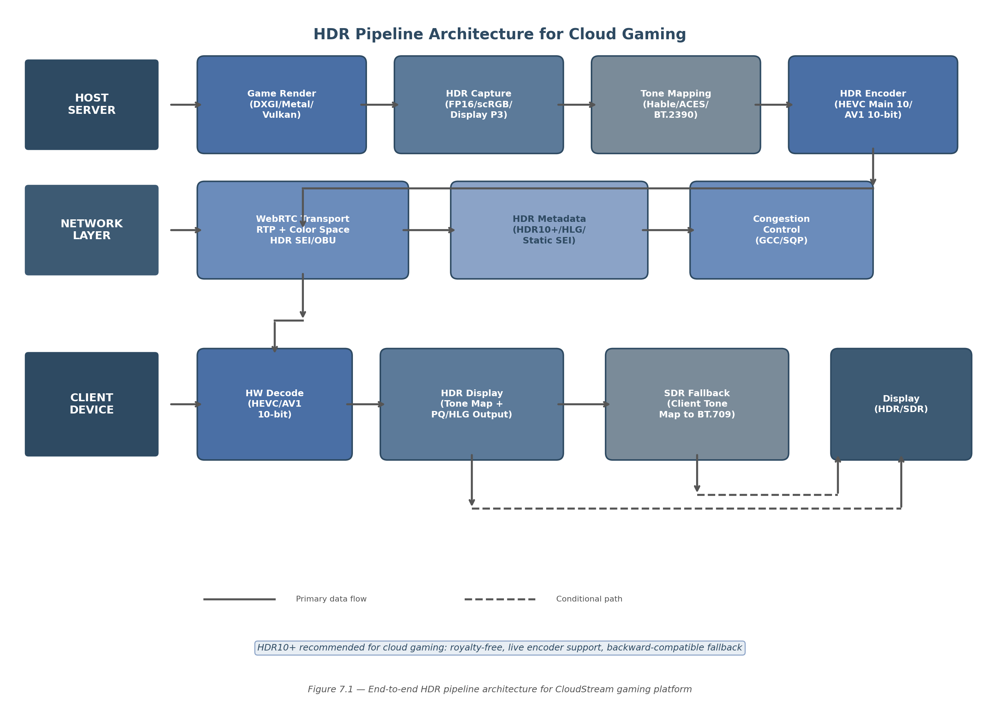

## 7. HDR & Color Space Management

High dynamic range (HDR) video has transitioned from a premium cinema feature to an expected capability in modern game streaming. HDR extends the luminance range of video content from the approximately 100 nits (candela per square meter) ceiling of standard dynamic range (SDR) to peaks of 1,000–10,000 nits, while simultaneously expanding the color gamut from Rec. 709 to the wider Rec. 2020 or DCI-P3 color spaces. For cloud gaming platforms, implementing HDR correctly requires navigating a fragmented ecosystem of competing formats, platform-specific capture APIs, tone mapping algorithms, and transport protocols that lack native HDR signaling. This chapter evaluates the available HDR formats, defines the platform-specific capture and encoding pipelines, and establishes a recommended architecture for HDR delivery over WebRTC with automatic SDR fallback.

### 7.1 HDR Format Comparison

Four HDR formats dominate the consumer landscape: HDR10, HDR10+, Dolby Vision, and Hybrid Log-Gamma (HLG). Each format differs in metadata strategy, licensing model, encoder support, and backward compatibility — factors that directly determine suitability for real-time cloud gaming.

#### 7.1.1 HDR10 — Static Metadata Baseline

HDR10 is the most widely adopted HDR format, serving as the baseline for virtually all HDR-capable displays and streaming services. It uses the Perceptual Quantizer (PQ) transfer function defined in SMPTE ST 2084, 10-bit color depth, and Rec. 2020 (commonly DCI-P3 subset) color primaries. The format specifies static metadata once per title via SMPTE ST 2086 (mastering display color volume) and CTA-861.3 (content light levels), meaning the same tone mapping parameters apply to the entire stream regardless of scene-to-scene luminance variation [^212^].

For cloud gaming, HDR10's primary limitation is this static metadata model. Games with highly variable lighting — transitioning from dark interiors to bright exteriors, for example — receive a fixed tone mapping curve that cannot adapt per scene. On displays with limited peak brightness (e.g., 400-nit LCD panels versus 1,000-nit reference masters), this can result in crushed shadows or clipped highlights in scenes that deviate from the average luminance of the content. However, HDR10 remains the universal compatibility baseline: every HDR display supports it, and it requires no per-unit licensing fees. GPU hardware encoders from NVIDIA (NVENC), Intel (QuickSync), and AMD (VCN) all support HEVC Main 10 and AV1 10-bit encoding, making HDR10 the technically simplest HDR path to implement [^184^] [^217^].

#### 7.1.2 HDR10+ — Dynamic Metadata, Royalty-Free

HDR10+ addresses the static metadata limitation by adding scene-by-scene and frame-by-frame dynamic metadata to the HDR10 base layer. Defined in SMPTE ST 2094-40 (Color Volume Transform Application #4, developed by Samsung), HDR10+ metadata specifies per-scene tone mapping curves that allow displays to optimize rendering for each individual scene's luminance characteristics [^296^]. Critically, HDR10+ maintains backward compatibility with non-HDR10+ displays: the HDR10 static metadata base layer is preserved alongside the dynamic metadata, so displays that only understand HDR10 fall back to the static tone mapping curve without requiring server-side intervention [^295^].

For cloud gaming, HDR10+ offers three decisive advantages. First, it is royalty-free — no annual licensing fees, no per-device royalties. Second, live encoder support is already available: HDR10+ metadata is generated on a per-frame basis and embedded in HEVC SEI `user_data_registered_itu_t_t35` messages or AV1 `METADATA_TYPE_ITUT_T35` OBUs (metadata Open Bitstream Units with country code `0xB5`) [^230^] [^289^]. The HDR10+ whitepaper explicitly confirms that "live use cases are thus enabled" with HEVC encoders generating metadata on live content in real time [^295^]. Third, the per-frame metadata adds negligible latency — typically less than one frame of processing overhead — making it compatible with sub-50ms cloud gaming targets. These characteristics make HDR10+ the recommended HDR format for CloudStream (HC-8) [^295^] [^296^].

#### 7.1.3 Dolby Vision — Proprietary, Limited Encoder Support

Dolby Vision represents the most sophisticated HDR format available, supporting up to 12-bit color depth and advanced dynamic metadata with scene- and frame-level trim adjustments. Multiple profiles exist: Profile 5 (IPT-PQ, backward-compatible with HDR10), Profile 7 (dual-layer, UHD Blu-ray), Profile 8.1 (low-latency streaming variant), and Profile 8.4 (HLG-based, broadcast-oriented) [^249^]. The format's metadata quality exceeds HDR10+ in theory, offering more granular control over tone mapping decisions.

However, Dolby Vision imposes prohibitive constraints on cloud gaming platforms. Licensing requires a \$2,500 annual content creator trim license plus per-device TV royalties estimated at less than \$3 per unit [^255^], alongside a \$1,000 perpetual mastering/playback license [^300^]. More critically, no consumer GPU hardware encoder — not NVENC, VCN, nor QuickSync — natively supports Dolby Vision encoding. The x265 software encoder supports Profiles 5, 8.1, and 8.2 since version 3.0 [^255^], but software encoding at 4K60 introduces 683–1,500 ms of latency, rendering it unsuitable for interactive game streaming. Professional Dolby-certified encoding hardware exists but is designed for broadcast, not real-time interactive applications. For an open-source cloud gaming platform, Dolby Vision is not a viable option.

#### 7.1.4 HLG — Inherent SDR Backward Compatibility

Hybrid Log-Gamma (HLG), jointly developed by BBC and NHK, takes a fundamentally different approach to HDR. Rather than relying on metadata at all, HLG embeds HDR information directly into the signal encoding: the lower half of the luminance range uses a traditional gamma curve (SDR-compatible), while the upper half uses a logarithmic curve for HDR highlights [^233^]. This design makes HLG inherently backward-compatible with SDR displays — the same signal produces acceptable SDR output on legacy hardware without any tone mapping or metadata processing [^233^]. HLG is also royalty-free, supported by HDMI 2.0b, and encodable in HEVC, VP9, and H.264 [^233^].

For broadcast use cases, HLG's metadata-free architecture eliminates synchronization issues and simplifies distribution. However, for gaming, HLG presents two significant drawbacks. First, the absence of dynamic metadata means tone mapping decisions are left entirely to the display device, resulting in inconsistent rendering quality across different display models. Second, no major game platform or game engine currently outputs HLG natively; game HDR is almost universally rendered in either HDR10 or scRGB/Display P3 on the source device. While HLG could serve as a lowest-common-denominator fallback format, its lack of dynamic optimization and limited gaming ecosystem support make it a secondary choice behind HDR10+.

**Table 7.1 — HDR Format Comparison for Cloud Gaming**

| Feature | HDR10 | HDR10+ | Dolby Vision | HLG |
|---------|-------|--------|-------------|-----|
| Metadata Type | Static (ST 2086) | Dynamic, per-frame (ST 2094-40) | Advanced dynamic, multi-profile | None (inherent) |
| Color Depth | 10-bit | 10-bit+ | Up to 12-bit | 10-bit |
| Licensing Cost | Royalty-free | Royalty-free [^295^] | \$2.5K/yr + per-unit [^255^] | Royalty-free [^233^] |
| SDR Fallback | Poor (requires tone mapping) | Good (HDR10 base layer) [^295^] | Profile-dependent [^249^] | Excellent (inherent) [^233^] |
| Live Encoder Support | Full (all GPU encoders) | Supported via SEI/OBU [^295^] | None (consumer GPUs) [^255^] | Full |
| GPU Encode (HEVC/AV1) | Main 10 / 10-bit | Main 10 + SEI/OBU [^230^] | Not available | Main 10 |
| WebRTC Carriage | SEI messages | SEI/OBU per frame | Not practical | SEI |
| Latency Impact | Negligible | <1 frame overhead [^295^] | Higher (complex metadata) | Negligible |
| Gaming Ecosystem | Widely supported | Growing adoption | Premium titles only | Minimal |

The comparison in Table 7.1 illuminates a clear hierarchy for cloud gaming deployment. HDR10+ occupies the optimal position: it delivers dynamic metadata for scene-optimized tone mapping, requires no licensing expenditure, is supported by live GPU encoders via standard SEI/OBU mechanisms, and maintains backward compatibility with HDR10 displays through its base layer [^295^]. HDR10 serves as the compatibility fallback for displays that lack HDR10+ support. Dolby Vision's licensing costs and absence of consumer GPU encoder support disqualify it for open-source platforms. HLG's inherent SDR compatibility is attractive for broadcast-style delivery but its lack of dynamic metadata and limited gaming adoption reduce its utility for interactive content.

### 7.2 HDR Pipeline Implementation

Implementing HDR for cloud gaming requires an end-to-end pipeline that spans capture on the host server, encoding with metadata embedding, transport over WebRTC, and display adaptation on the client. Each stage introduces platform-specific considerations and latency constraints that must be carefully managed.

*Figure 7.1 — End-to-end HDR pipeline architecture for CloudStream gaming platform. The host server captures HDR framebuffers in floating-point format, applies optional tone mapping for SDR clients, encodes with HEVC Main 10 or AV1 10-bit, and transports HDR metadata via WebRTC RTP extensions and codec-level SEI/OBU messages. The client device branches to either HDR direct output or SDR fallback based on display capability negotiation.*

#### 7.2.1 HDR Capture — Platform-Specific APIs

The capture stage is where HDR pipeline fidelity is fundamentally determined. Each operating system exposes different mechanisms for acquiring HDR framebuffer data from the display pipeline, and the chosen format dictates the range of color spaces and bit depths available for downstream encoding.

**Table 7.2 — Platform-Specific HDR Capture APIs**

| Platform | Capture API | Pixel Format | Color Space | Key Parameters |
|----------|-------------|--------------|-------------|----------------|
| Windows | DXGI Desktop Duplication (`DuplicateOutput1`) | `R16G16B16A16_FLOAT` or `R10G10B10A2_UNORM` | scRGB (linear, Rec. 709 primaries) or PQ + Rec. 2020 [^234^] | `DXGI_COLOR_SPACE_RGB_FULL_G10_NONE_P709` |
| macOS | Metal/CAMetalLayer | `MTLPixelFormat.rgba16Float` | Extended Linear Display P3 [^260^] | `wantsExtendedDynamicRangeContent = true` |
| Linux | Vulkan + DMA-BUF | `VK_FORMAT_R16G16B16A16_SFLOAT` | HDR10 ST2084 or Extended sRGB Linear [^338^] | `VK_EXT_swapchain_colorspace`, `VK_EXT_hdr_metadata` |

On Windows, the Desktop Duplication API (`IDXGIOutput5::DuplicateOutput1`) with `DXGI_FORMAT_R16G16B16A16_FLOAT` acquires framebuffers in scRGB space — a linear encoding with Rec. 709/sRGB primaries where values above 1.0 represent HDR highlights [^209^]. In this space, `(1.0, 1.0, 1.0)` corresponds to SDR white at 80 nits, while `(12.5, 12.5, 12.5)` maps to 1,000 nits, and the full range extends to approximately +7.5 [^234^] [^235^]. The display driver subsequently converts scRGB to the display's native color space (typically BT. 2020 primaries with PQ encoding) [^235^]. For cloud gaming capture, acquiring frames in scRGB preserves maximum dynamic range and allows the encoder to apply the appropriate color space conversion.

On macOS, Extended Dynamic Range (EDR) provides an adaptive HDR representation rather than a fixed format. EDR "does not have a fixed maximally bright value"; instead, the system exposes an "EDR headroom" ratio indicating how much brighter than SDR reference white the display can render without clipping [^256^]. Capture uses `MTLPixelFormat.rgba16Float` with `extendedLinearDisplayP3` color space, configured by setting `wantsExtendedDynamicRangeContent = true` on the `CAMetalLayer` [^260^]. The headroom value is queryable at runtime via `screen?.maximumExtendedDynamicRangeColorComponentValue`, enabling the capture pipeline to adapt to the connected display's capabilities.

Linux HDR capture remains the least mature of the three platforms. The Wayland protocol ecosystem is still developing standardized HDR metadata communication between applications and the display server, requiring clients to communicate color primaries, transfer functions, and HDR metadata through compositor-specific extensions [^254^]. Valve's Gamescope compositor provides the most complete working implementation, using `VK_EXT_swapchain_colorspace` for HDR10/scRGB colorspaces (PQ via `VK_COLOR_SPACE_HDR10_ST2084_EXT` and scRGB via `VK_COLOR_SPACE_EXTENDED_SRGB_LINEAR_EXT`) and `VK_EXT_hdr_metadata` for forwarding HDR metadata from the application to the display [^338^]. Gamescope additionally manages EDID parsing through libdisplay-info for HDR capability detection. For CloudStream's Linux host agents, the Gamescope approach represents the most practical reference implementation, though direct Vulkan HDR capture without a compositor intermediary is preferred for latency minimization.

#### 7.2.2 Tone Mapping — Host-Side vs. Client-Side

Tone mapping is the process of compressing the wide luminance range of HDR content into the narrower range supported by SDR displays (nominally 100 nits peak). For cloud gaming platforms serving mixed HDR and SDR clients, tone mapping strategy directly impacts both visual quality and server load.

Four primary architectural approaches exist. **Host-side tone mapping** (before encode) applies tone mapping on the server, producing a single SDR stream that all clients receive. This minimizes client complexity but permanently discards HDR information, preventing the server from serving HDR clients without a separate encode pipeline. **Client-side tone mapping** (after decode) sends the HDR stream to all clients; SDR-capable clients perform GPU-accelerated tone mapping post-decode. This preserves HDR fidelity for capable displays but increases compute and battery consumption on the client. **Dual-stream encoding** produces both HDR and SDR streams simultaneously, selecting the appropriate stream per client — optimal quality but doubles encoding cost. **Dynamic per-client negotiation** exchanges capability information at session setup and serves the appropriate stream; this offers the best balance for heterogeneous client populations but requires a capability negotiation protocol.

For CloudStream, the recommended approach combines client-side tone mapping with dynamic stream selection: send the HDR stream to all clients (preserving maximum fidelity), with SDR clients performing GPU-accelerated tone mapping via libplacebo or equivalent. Clients with sufficient bandwidth and HDR-capable displays receive the full HDR experience without server-side bifurcation. The SDR fallback path uses libplacebo's Vulkan-accelerated BT.2390 EETF (Electro-Optical Transfer Function) implementation, which has become the default tone mapping algorithm in the library [^335^].

Several tone mapping algorithms are available for the fallback path, each with distinct visual characteristics:

**Table 7.3 — Tone Mapping Algorithm Comparison**

| Algorithm | Origin | Characteristics | Best Use Case | Implementation |
|-----------|--------|-----------------|---------------|----------------|
| Hable (Uncharted 2) | John Hable, Naughty Dog [^253^] | Filmic look, good highlight preservation, popular in games | Gaming content, cinematic aesthetics | FFmpeg `tonemap=hable`, GLSL shader |
| ACES (Academy Color Encoding System) | Academy of Motion Picture Arts and Sciences [^253^] | Standardized filmic curve, wide industry adoption | Professional/broadcast content | FFmpeg `tonemap=aces`, GLSL shader |
| BT.2390 EETF | ITU-R Report BT.2390 [^335^] | Industry standard, display-referred, perceptually uniform | General SDR fallback, default choice | libplacebo `PL_TONE_MAPPING_BT_2390` |
| Reinhard | Erik Reinhard [^287^] | Simple, evenly balances brightness, can desaturate | Low-complexity clients, mobile | GLSL 3-line implementation |
| Uchimura | Hajime Uchimura, Polyphony Digital [^253^] | Designed for games, excellent highlight preservation | Racing/simulation games | Gran Turismo reference |

BT.2390 EETF is the recommended default for CloudStream's SDR fallback. As an ITU standard, it provides predictable, display-referred output that minimizes color shift across different SDR display models. The libplacebo implementation leverages Vulkan compute for GPU-accelerated processing, adding less than 1 ms of latency on modern integrated graphics [^329^] [^335^]. Hable tone mapping serves as an alternative for users preferring a more cinematic, contrast-rich look — the same algorithm used in the Uncharted 2 game engine and widely adopted in gaming applications [^253^]. ACES provides a standardized filmic curve appropriate for content that will be edited or distributed through professional post-production pipelines.

The FFmpeg tone mapping pipeline for server-side SDR fallback (used when client-side tone mapping is unavailable) follows a three-stage filter chain: `zscale=transfer=linear` converts PQ-encoded HDR to linear light, `tonemap=hable` applies the tone mapping curve, and `zscale=transfer=bt709:primaries=bt709` converts to SDR Rec. 709 color space [^366^]. For GPU acceleration, libplacebo integrated in FFmpeg 5.0+ provides Vulkan-based tone mapping via `-vf 'libplacebo=format=yuv420p:colorspace=bt709'` [^329^]. This is the preferred server-side implementation, as it offloads processing from the CPU to the GPU's compute shaders.

#### 7.2.3 HDR Over WebRTC

Transporting HDR content over WebRTC requires navigating a protocol landscape that does not natively define HDR metadata carriage. The WebRTC specification (RFC 7742) mandates only VP8 and H.264 (Constrained Baseline) as required codecs; HDR support is codec-dependent and metadata transport is non-standardized [^258^].

WebRTC defines an experimental RTP header extension (`http://www.webrtc.org/experiments/rtp-hdrext/color-space`) for communicating color space information and optional HDR metadata [^367^]. The 28-byte extension carries color primaries (ITU-T H.273 Table 2), transfer characteristic (H.273 Table 3), matrix coefficients (H.273 Table 4), luminance range (max/min nits), mastering display chromaticities (CIE 1931 xy coordinates scaled by 50,000), MaxCLL, and MaxFALL [^367^]. This extension is implemented in the Chromium and native WebRTC codebases and should be present only in the last RTP packet of each video frame.

For codec-specific metadata carriage, HEVC Main 10 embeds HDR10 static metadata in `Mastering display colour volume` and `Content light level` SEI messages at the elementary stream level [^289^]. HDR10+ dynamic metadata uses the SEI `user_data_registered_itu_t_t35` message (SMPTE ST 2094-40) [^289^]. For AV1, HDR10 static metadata uses `metadata_hdr_mdcv` and `metadata_hdr_cll` OBUs, while HDR10+ dynamic metadata is carried in `METADATA_TYPE_ITUT_T35` OBUs with country code `0xB5` [^230^].

Codec availability varies by browser and client platform. VP9 supports HDR content in WebRTC and is available in Chrome 48+, Firefox, and Edge [^252^]. HEVC in WebRTC is currently limited to Safari and native applications [^257^]. AV1 HDR support is nascent, available in Chrome 113+ and Firefox 136+ [^258^]. For CloudStream, this codec availability landscape reinforces the multi-codec strategy established in prior chapters: serve AV1 10-bit with HDR10+ metadata to capable clients (Chrome/Firefox), HEVC Main 10 with HDR10+ to Safari and native clients, and fall back to SDR H.264 for legacy clients. The HDR10+ metadata's backward compatibility with HDR10 ensures that clients supporting HEVC/AV1 HDR playback but lacking HDR10+ parsing will still receive a valid HDR10 experience through the base layer [^295^].

#### 7.2.4 SDR Fallback — Preserving Color Accuracy

SDR fallback is not optional for any cloud gaming platform — it is a requirement. As of 2025, the majority of client displays in use remain SDR-capable only, and even HDR-capable displays may be configured for SDR mode. The fallback path must preserve color accuracy while gracefully compressing the HDR luminance range.

The recommended fallback strategy combines three techniques. First, **perceptual gamut mapping** converts BT.2020 color primaries to BT.709 for SDR output. The ITU-R BT.2407 standard defines the matrix transformation for this conversion, though perceptual gamut mapping (which accounts for hue shifts during wide-to-narrow gamut conversion) produces subjectively better results than a simple matrix multiply [^370^]. Second, **metadata-aware tone mapping** uses MaxCLL (Maximum Content Light Level) and the mastering display's maximum luminance to set the tone mapping target peak appropriately. A 1,000-nit master displayed on a 100-nit SDR monitor requires different compression than a 4,000-nit master; tone mapping algorithms that incorporate MaxCLL avoid the "washed out" appearance that occurs when a one-size-fits-all curve is applied to all content. Third, **dithering during bit depth reduction** from 10-bit to 8-bit prevents visible banding in gradient-rich game content such as skyboxes and atmospheric effects [^286^].

HLG offers an alternative fallback approach with unique characteristics. Because HLG's signal encoding is inherently SDR-compatible in its lower luminance range, a server could encode in HLG and deliver the same stream to both HDR and SDR clients — SDR displays see acceptable gamma-curve output without any tone mapping step [^233^]. However, as noted in Section 7.1.4, HLG's lack of dynamic metadata and limited gaming ecosystem support make it a secondary option rather than the primary strategy. The recommended architecture uses HDR10+ as the primary HDR format with client-side BT.2390 EETF tone mapping for SDR fallback, ensuring consistent rendering quality across the heterogeneous display landscape.

For the Go implementation, client-side tone mapping can be implemented through OpenGL ES shaders using the `golang.org/x/mobile/gl` package, which provides full shader compilation, uniform binding, and texture management interfaces [^372^]. The fragment shader implements the selected tone mapping curve (BT.2390, Hable, or ACES) along with the BT.2020-to-BT.709 gamut conversion matrix. Server-side tone mapping for clients that cannot perform GPU-accelerated conversion is handled through FFmpeg's libplacebo filter with Vulkan backend, invoked via CGO bindings or as an external process [^329^]. The libplacebo integration provides production-grade tone mapping quality derived from the mpv media player's rendering core, with continuous updates as the HDR ecosystem evolves.

