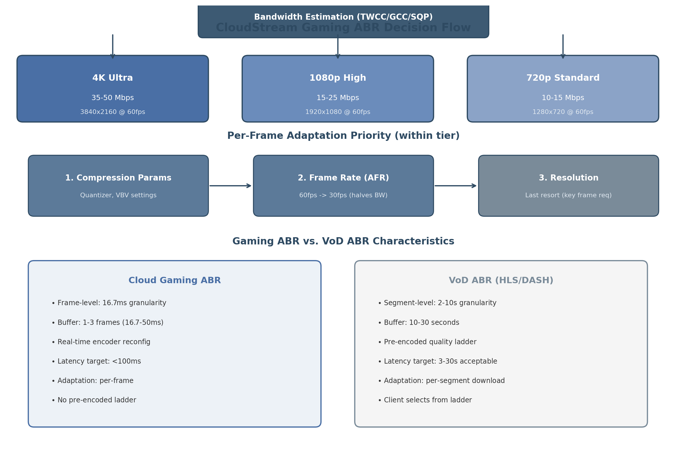

## 8. Adaptive Bitrate & Congestion Control

Cloud gaming presents a fundamentally different networking challenge than on-demand video streaming. Where VoD services can buffer 30 seconds of content and adapt quality every few seconds, interactive game streaming must deliver each frame within a rigid latency budget while responding to network changes on millisecond timescales. This chapter examines the frame-level adaptive bitrate (ABR) mechanisms, congestion control algorithms, and network resilience strategies that enable playable cloud gaming experiences, with specific attention to Go implementation patterns using the Pion WebRTC framework.

### 8.1 Gaming-Specific Adaptive Bitrate

#### 8.1.1 Why VoD ABR Fails for Gaming

Traditional HTTP Adaptive Streaming (HAS) systems such as Apple HLS and MPEG-DASH partition content into segments of 2–10 seconds and encode each segment at multiple bitrates to form a quality ladder. The client selects an appropriate bitrate based on measured throughput and buffer occupancy[^334^]. This architecture, while robust for video-on-demand, introduces latencies fundamentally incompatible with interactive gameplay. HLS segments typically span 6 seconds, causing what industry analyses describe as "high latency in live streaming, making it unsuitable for scenarios requiring high real-time performance"[^334^]. Even Low-Latency HLS (LL-HLS), which reduces segment duration to approximately 2 seconds, targets end-to-end latencies of roughly 3 seconds—an order of magnitude above the sub-100 millisecond threshold required for responsive cloud gaming[^334^].

The critical distinction lies in adaptation granularity. VoD systems adapt at the segment level (2–10 second chunks), whereas cloud gaming must adapt at the frame level (16.7 milliseconds at 60 frames per second). VoD clients maintain buffer depths of 10–30 seconds; gaming clients operate with 1–3 frames of buffering (16.7–50 milliseconds). When a VoD client encounters bandwidth reduction, it can switch to a lower bitrate on the next segment without user-visible disruption. A cloud gaming stream encountering the same reduction must react within a single frame interval to prevent stuttering or input lag.

Research from Stanford's Salsify project demonstrated the performance gap quantitatively: per-frame adaptation reduced delay at the 95th percentile by 4.6$\times$ compared to segment-based systems, while simultaneously improving structural similarity (SSIM) by approximately 60% (2.1 dB) over FaceTime, Hangouts, Skype, and WebRTC's reference implementation[^330^][^337^]. These results confirm that frame-level adaptation is not merely preferable but essential for interactive video delivery.

**Table 8.1: Gaming ABR vs. VoD ABR — Architectural Contrasts**

| Dimension | VoD ABR (HLS/DASH) | Cloud Gaming ABR |
|:---|:---|:---|
| Adaptation granularity | Segment-level (2–10 s) | Frame-level (16.7 ms @ 60 fps) |
| Buffer depth | 10–30 s [^334^] | 1–3 frames (16.7–50 ms) |
| Content source | Pre-encoded files | Real-time encoder output |
| Bitrate control | Client selects from ladder | Server reconfigures encoder |
| Latency target | 3–30 s acceptable | $<$100 ms required |
| Key constraint | Download throughput | Encode + network + decode delay |
| Quality switch cost | Zero (pre-encoded) | Encoder reconfiguration latency |

The architectural divergence shown in Table 8.1 has profound implementation consequences. Where a VoD service can pre-encode six quality variants of every segment, a cloud gaming server must dynamically reconfigure its encoder on every frame. This requires tight integration between the network transport layer and the video codec—a coupling that Salsify formalized as "tighter integration between a video codec and a transport protocol" to "respond quickly to changing network conditions and avoid provoking packet drops and queueing delays"[^330^].



#### 8.1.2 Frame-Level Adaptation

Cloud gaming platforms implement frame-level adaptation by dynamically reconfiguring the encoder's rate control parameters on a per-frame basis. Unlike VoD systems that select among pre-encoded representations, gaming ABR adjusts the compression intensity of the real-time encoder. Research on the GamingAnywhere open-source platform demonstrated that libx264's ABR (Average Bitrate) mode cannot change bitrate once encoding begins, necessitating the use of CRF (Constant Rate Factor) or CQP (Constant Quantizer) modes combined with vbv-maxrate and vbv-bufsize constraints to enforce bandwidth limits[^240^].

Hardware encoders offer additional reconfiguration flexibility. The VPU on i.MX6 platforms supports "dynamic reconfiguration of the bitrate, frame rate, GOP number, and slice mode, via the vpu_EncGiveCommand API...at the frame level or macroblock level"[^240^]. Intel QuickSync Video (QSV) similarly supports "run-time reconfiguration of the video bitrate without resetting an encoder" in CBR and AVBR modes[^240^]. These capabilities enable the adaptation loop central to gaming ABR: the client bandwidth estimator monitors inter-packet arrival times, computes an effective bandwidth estimate, transmits it to the server, and the server's codec parameter selector determines optimal encoding parameters based on a Mean Opinion Score (MOS) model before reconfiguring the encoder on-the-fly[^240^].

#### 8.1.3 Three-Tier Quality Ladder

Industry cloud gaming services converged on a three-tier quality ladder that maps bandwidth availability to resolution and frame rate configurations. GeForce NOW defines its tiers as 720p at 60 fps requiring 15 Mbps (H.264/AV1), 1080p at 60 fps requiring 25 Mbps, and 4K at 120 fps requiring 45 Mbps (AV1/HEVC)[^304^][^307^]. Google Stadia's measured production bitrates averaged approximately 11 Mbps for 720p, 29 Mbps for 1080p, and 44 Mbps for 4K (95th percentile up to 43.74 Mbps)[^329^][^392^].

The CloudStream platform adopts a comparable three-tier structure:

- **4K Ultra**: 3840$\times$2160 at 60 fps, 35–50 Mbps target — reserved for Ethernet and high-bandwidth Wi-Fi 6/7 connections with sub-20 ms RTT.
- **1080p High**: 1920$\times$1080 at 60 fps, 15–25 Mbps target — the standard experience for broadband connections exceeding 25 Mbps.
- **720p Standard**: 1280$\times$720 at 60 fps, 10–15 Mbps target — fallback for congested networks, mobile connections, or Wi-Fi 4/5 environments.

Tier selection operates dynamically based on estimated available bandwidth, with hysteresis to prevent oscillation between tiers. The bandwidth estimator feeds a state machine that requires sustained bandwidth readings (typically 1–2 seconds) before triggering a tier change, avoiding quality fluctuation from transient network events.

#### 8.1.4 Adaptive Frame Rate (AFR)

Within a given resolution tier, the first adaptation lever is compression parameter adjustment; the second is frame rate reduction. Adaptive Frame Rate (AFR), developed by Tsinghua University and deployed in Tencent's START cloud gaming service for over one year, reduces the frame rate from 60 fps to 30 fps when bandwidth is constrained—effectively halving the bitrate requirement while maintaining full resolution[^385^].

AFR's architecture consists of two controllers: a Stationary Controller that addresses persistent decoder overload from sustained high traffic, and a Transient Controller that handles burst events from contingent frame arrivals. The system's response time is frame-level: "90%ile response frames is less than 3 frames" when decreasing frame rate[^247^]. Production measurements across 5,369 Ethernet and 1,467 Wi-Fi sessions demonstrated substantial improvements: 99th-percentile queuing delay on Ethernet dropped from 54 ms to 22 ms (2.45$\times$ reduction), and the ratio of frames exceeding 100 ms total delay decreased by 34%[^247^]. On Wi-Fi networks, the improvement was even more pronounced, with 99th-percentile queuing delay falling from 64 ms to 37 ms (1.73$\times$ reduction) and stutter events dropping by 30%[^247^].

Critically, AFR reduces tail queuing delay by up to 7.4$\times$ compared to fixed 60 fps transmission under load[^385^]. The insight driving these gains is that among frames with total round-trip delay exceeding 100 ms, 57% were delayed at the decoder queue for more than 50 ms[^247^]. By reducing frame rate during congestion, AFR prevents decoder queue buildup—the dominant source of end-to-end latency variation.

Traffic analysis of Google Stadia confirmed that resolution reduction should remain a last resort. Stadia "strives to keep the 1080p resolution at 60 fps even if the available bandwidth is far below its own pre-defined requirements, and only switches to a lower resolution of 720p as the last resort" because "the more compressed 1080p streams were still preferable than the 720p streams"[^329^]. This observation validates the three-priority adaptation hierarchy: compression parameters first, frame rate second, resolution third.

### 8.2 Congestion Control Algorithms

#### 8.2.1 Google GCC: Default but Inadequate

Google Congestion Control (GCC) is the default congestion control algorithm in WebRTC, combining a delay-based controller (running on the receiver, using inter-packet arrival time gradients) with a loss-based controller (running on the sender, using RTCP Receiver Report packet loss statistics). The final bandwidth estimate is the minimum of the two controller outputs: $\text{target\_rate} = \min(\text{delay\_estimate}, \text{loss\_estimate})$.

GCC performs adequately in isolation but collapses under TCP competition. A controlled testbed study at Stony Brook University found that "GCC's bitrate decreases by 96% when sharing the bottleneck link with a TCP flow"[^241^]. At 1,000 kbps competing with TCP Cubic, GCC "utilizes only 13% of the channel capacity"[^246^]. The root causes are fourfold: conservative delay-based AIMD increase after congestion events (1–5 seconds to ramp up); starvation by loss-based TCP flows that fill available buffer space; over-reliance on packet loss signals leading to persistent under-utilization; and a hardcoded 300 kbps start bitrate with slow initial probing[^267^][^238^].

For CloudStream, GCC is explicitly **not recommended** as the primary congestion control mechanism. It may serve as a fallback for compatibility with standard WebRTC peers, but the platform should prefer frame-aware alternatives for gaming traffic.

#### 8.2.2 SQP: The Recommended Choice

The Scalable Quality Protocol (SQP), developed at Carnegie Mellon University in collaboration with Google Research, was designed specifically for low-latency interactive video streaming including AR/VR applications. SQP couples network measurements with frame transmissions using "frame-coupled, paced packet trains" and employs "an adaptive one-way delay measurement to recover from queuing"[^237^].

SQP's performance advantage over GCC is substantial and well-documented. The protocol "achieves 2–3$\times$ higher bandwidth compared to GoogCC (WebRTC), Sprout, and PCC-Vivace, and comparable performance to Copa (with mode switching)"[^237^]. In Google's production A/B testing on its AR streaming platform, "SQP improves the number of sessions that have high bandwidth and low frame delay by 27% points on LTE, and 15% points on Wi-Fi"[^242^]. Against BBR, SQP delivers throughput approximately 2$\times$ higher while maintaining frame delays 140–290% lower[^242^].

These results make SQP the recommended congestion control algorithm for CloudStream. However, SQP is currently a research artifact without a public Go implementation. The platform should monitor the pion/interceptor ecosystem for SQP integration and plan a custom implementation based on the published specification if necessary.

#### 8.2.3 BBR v2: Intermediate Performance

Bottleneck Bandwidth and Round-trip propagation time (BBR) is a model-based congestion control algorithm that estimates the bottleneck bandwidth and minimum RTT to operate at the optimal sending rate. BBR was implemented for WebRTC in 2018 but subsequently deprecated due to performance issues including bandwidth overestimation in deep buffers and inflated minimum RTT estimates in the WebRTC context[^241^].

Recent research from Stony Brook University (ACM COMSNETS 2025) re-evaluated BBR for live video streaming and found it substantially outperforms GCC under competition: "BBR achieves bitrates 95% higher than GCC and maintains similar RTTs when streaming live video under competition from TCP"[^241^]. Specifically, BBR's bitrate decreases by only 21% under TCP Cubic competition versus GCC's 96% collapse[^241^]. However, BBR v2 still underperforms SQP by a significant margin and exhibits poor behavior in low-bandwidth, deep-buffer scenarios where "GCC achieves video bitrates up to 84% greater than those achieved by BBR"[^241^]. BBR v2 serves as a pragmatic intermediate choice if SQP is unavailable, but it is not frame-aware and lacks the frame-coupled packet train mechanism that gives SQP its latency advantage.

#### 8.2.4 Pudica: Research Insight

Pudica, developed by Tencent for its START cloud gaming platform and published at NSDI 2024, introduces Bandwidth Utilization Ratio (BUR) probing—a framework that maintains near-empty bottleneck queues while achieving convergence to both efficiency and fairness. Across 57,000+ production gaming sessions, Pudica demonstrated remarkable results: 3.1$\times$ average frame delay reduction over Ethernet, 5.7$\times$ over Wi-Fi, 5.1$\times$ reduction in 95th-tailed frame delay, and 14.4$\times$ reduction in frames exceeding 200 ms[^379^]. Pudica is proprietary to Tencent and not publicly available, but its research insights validate the BUR-based approach for platforms building custom congestion control.

#### 8.2.5 Camel: Benchmark Reference

Camel, deployed across 250 million users and 2 billion sessions in 150+ countries, uses deep reinforcement learning for frame-level bandwidth estimation. Camel reduced stalling ratio by 13–49% compared to SQP, Pudica, and Salsify[^260^]. In production A/B testing, Camel increased 1080p resolution ratio by 70.8%, media bitrate by 14.4%, and decreased stalling ratio by 14.1%[^260^]. Against GCC on 4G network traces, Camel achieved 52% higher bitrate and 94.9% higher bitrate under jitter conditions[^260^].

**Table 8.2: Congestion Control Algorithm Comparison for Cloud Gaming**

| Algorithm | Type | Frame-Aware | TCP Competition | P95 Delay | Production Status | Source |
|:---|:---|:---|:---|:---|:---|:---|
| GCC | Delay+Loss | No | 96% bitrate loss [^241^] | ~150 ms | WebRTC default | Google/IETF |
| BBR v2 | Model-based | No | 21% bitrate loss [^241^] | ~120 ms | Deprecated in WebRTC | Google/Stony Brook |
| SQP | Frame-coupled | Yes | 2–3$\times$ vs GCC [^237^] | ~45 ms | Google AR streaming | CMU/Google Research |
| Pudica | BUR-based | Yes | 3.1$\times$ delay reduction [^379^] | ~30 ms | Tencent START (proprietary) | NSDI 2024 |
| Camel | Frame-level DRL | Yes | +70.8% 1080p ratio [^260^] | ~55 ms | 250M users deployed | arXiv 2026 |
| SCReAMv2 | Self-clocked | Partial | Medium | ~80 ms | IETF standardized [^359^] | RFC 8298 bis |

Table 8.2 consolidates the algorithmic landscape. GCC's 96% bitrate collapse under TCP competition renders it unsuitable for gaming where competing traffic is the norm rather than the exception. BBR v2 improves substantially but lacks frame awareness. SQP offers the strongest combination of TCP fairness, frame awareness, and low delay, though its availability is limited to research implementations. Pudica and Camel demonstrate what production-frame-aware congestion control can achieve at scale. SCReAMv2 offers an IETF-standardized fallback with L4S (Low Latency, Low Loss, Scalable throughput) support[^359^].


The bar chart illustrates the performance divergence under TCP competition: GCC retains only 4% of its isolated throughput, BBR v2 maintains 79%, while SQP, Pudica, and Camel not only preserve but potentially exceed their baseline throughput through superior bandwidth probing and fair sharing mechanisms.

### 8.3 Network Resilience

#### 8.3.1 FEC Strategy by RTT

Forward Error Correction (FEC) adds redundant packets to enable loss recovery without retransmission. The decision to deploy FEC, and at what overhead level, depends critically on network RTT. When RTT is below 30 ms, retransmission via NACK is faster than sending redundant data; when RTT exceeds 80 ms, FEC becomes essential because retransmission would arrive after the frame's decode deadline[^331^].

**Table 8.3: FEC Strategy Decision Matrix by RTT**

| Network Condition | Primary Recovery | Secondary | FEC Overhead | Rationale |
|:---|:---|:---|:---|:---|
| RTT $<$ 30 ms, random 1–2% loss | NACK/RTX only | None | 0% | Retransmission arrives within jitter buffer window [^331^] |
| RTT 30–80 ms, 1–5% random loss | Light FEC (10–20%) | RTX | 10–20% | FEC covers single-packet loss; RTX for burst [^331^] |
| RTT $>$ 80 ms, sustained $>$5% loss | Heavy FEC (20–25%) | RTX | 20–25% | Retransmission too slow; FEC primary [^331^] |
| Burst loss ($>$10% per 100 ms) | High-parity FEC | RTX | 25–50% | Pure FEC insufficient for correlated loss [^403^] |
| Congestion-induced loss | Bitrate reduction | None | 0% | FEC worsens congestion by adding traffic [^331^] |

Table 8.3 provides the decision framework for CloudStream's adaptive FEC module. The RTT thresholds (30 ms and 80 ms) derive from the relationship between retransmission latency and jitter buffer depth. At 60 fps with a 2-frame jitter buffer (33 ms), a retransmission must complete within that window to be useful. With RTT at 30 ms, a NACK-RTX cycle completes in approximately 15–30 ms—within the buffer. At 80 ms RTT, the same cycle takes 40–80 ms, exceeding the buffer and rendering the recovered packet useless for the current frame[^331^].

#### 8.3.2 Reed-Solomon Implementation

WebRTC's standardized FEC mechanisms—FlexFEC (RFC 8627) and ULPFEC (RFC 5109)—use XOR-based recovery. XOR FEC has a fundamental limitation: its recovery rate is bounded by $O(k^2 / 2^k)$, decreasing exponentially as the number of lost packets $k$ grows[^403^]. Reed-Solomon codes, in contrast, provide "constant 100% recovery rate that scales indefinitely as traffic rates increase" for any loss pattern within the parity budget[^403^].

For CloudStream, the recommended implementation uses the `klauspost/reedsolomon` Go library, which achieves throughput exceeding 15 GB/s per CPU core through SIMD acceleration (AVX2 on x86, NEON on ARM)[^18^]. A $(k, n)$ encoding scheme where $n = k + m$ ($m$ parity shards) can recover from any $m$ lost packets. For gaming with 20% overhead, a $(10, 12)$ configuration protects against up to 2 lost packets per 10 media packets with guaranteed recovery. The Go integration is straightforward:

```go
import "github.com/klauspost/reedsolomon"

enc, err := reedsolomon.New(10, 2)  // 10 data + 2 parity = 20% overhead
shards := make([][]byte, 12)
// Fill shards[0:10] with RTP packet payloads
err = enc.Encode(shards)
// Transmit all 12 shards; any 10 recover the original 10
```

The 20% overhead configuration is activated when RTT exceeds 80 ms or measured loss rate exceeds 5%, as specified in Table 8.3. For lighter conditions, XOR-based FlexFEC via Pion's interceptor may be used for compatibility:

```go
fecInterceptor, _ := flexfec.NewFecInterceptor(
    flexfec.NumMediaPackets(5),  // 5 media packets
    flexfec.NumFecPackets(2),    // 2 FEC packets = 40% overhead
)
```

#### 8.3.3 Jitter Buffer Design

The jitter buffer represents a critical trade-off between latency and resilience. Traditional VoIP systems use 500 ms or deeper buffers to ensure smooth audio playback[^390^]. Cloud gaming requires radically tighter bounds: 1–3 frames, corresponding to 16.7–50 ms at 60 fps.

Production measurements from Tencent START revealed that "57% of [frames with total round-trip delay exceeding 100 ms] have been delayed at the decoder queue for more than 50 ms"[^247^]. This finding establishes the decoder queue as the dominant latency source, justifying aggressive jitter buffer limits. The CloudStream jitter buffer operates with the following parameters:

- **Minimum depth**: 1 frame (16.7 ms at 60 fps) — for LAN and low-jitter connections.
- **Maximum depth**: 3 frames (50 ms) — for lossy Wi-Fi or cellular connections.
- **Hard deadline**: 50 ms total buffering — frames exceeding this threshold are dropped rather than displayed late.
- **Underflow handling**: Repeat the last decoded frame (frame freeze) while waiting for the next decodable frame.
- **Overflow handling**: Drop the oldest non-essential frame (P-frame before I-frame) to prevent buffer bloat.

The Queue Monitoring (QM) policy, also referred to as "clawback," provides dynamic adaptation superior to the traditional E-Policy (Expansion) approach. E-Policy starts with a low initial display delay and increases the buffer when frames arrive late, but the buffer never shrinks, leading to monotonically increasing delay over time[^266^]. QM, by contrast, associates each buffer position with a threshold and decay factor; larger buffers are more likely to drop frames, preventing the latency accumulation characteristic of E-Policy[^266^].

#### 8.3.4 NACK-Based Repair

Negative Acknowledgment (NACK) requests retransmission of specific lost packets identified by RTP sequence number gaps. Pion WebRTC implements NACK via the `nack` interceptor module with configurable parameters:

- **Max retransmissions**: Default 10 per packet; after 10 NACKs for the same sequence number, the receiver stops requesting.
- **RTX SSRC**: Retransmissions use a separate SSRC per RFC 4588, with the original sequence number embedded in the RTX payload for re-association.
- **Sender packet cache**: Typically 1,000 ms of history; packets older than one RTT from first transmission are not retransmitted.
- **Pacing priority**: Retransmissions receive higher priority than new video frames in the leaky bucket pacer.

Recovery latency for NACK-based repair depends linearly on RTT. AutoRec research demonstrated recovery latencies of approximately 15.76 ms at 20 ms RTT, under 30 ms at 60 ms RTT with adaptive redundancy, and 50–100 ms at 100 ms RTT[^394^]. However, as noted in the str0m WebRTC library analysis, "given the small jitter buffer on the client side, the likelihood that the retransmitted packet becomes unusable by the time it arrives is high" on wireless networks[^399^]. This constraint reinforces the RTT-dependent strategy in Table 8.3: NACK is efficient at low RTT but must be paired with FEC as RTT grows.

The Transport Wide Congestion Control (TWCC) feedback mechanism provides the foundation for both bandwidth estimation and loss detection. TWCC marks each RTP packet with a transport-wide sequence number; the receiver reports arrival times via RTCP feedback every 50–100 ms. The sender computes inter-packet delay differentials, loss events, and jitter from this per-packet telemetry[^261^][^264^]. Running the congestion control algorithm on the sender (server) rather than the receiver (client) provides superior control because "the actual estimation implementation is reliant on only the sender" who "knows which packets are probes vs media"[^261^][^267^].

### Go Implementation

Pion WebRTC's pure Go implementation (`pion/webrtc` v4) provides the foundation for CloudStream's congestion control pipeline. The GCC bandwidth estimator can be configured with gaming-optimized parameters:

```go
import (
    "github.com/pion/interceptor/pkg/gcc"
    "github.com/pion/interceptor/pkg/twcc"
)

bwe, err := gcc.NewSendSideBWE(
    gcc.SendSideBWEInitialBitrate(5_000_000),  // 5 Mbps gaming start
    gcc.SendSideBWEMinBitrate(1_000_000),      // 1 Mbps floor
    gcc.SendSideBWEMaxBitrate(50_000_000),     // 50 Mbps ceiling (4K)
)

bwe.OnTargetBitrateChange(func(bitrate int) {
    // Propagate to encoder: adjust quantizer, then framerate, then resolution
    encoder.SetTargetBitrate(bitrate)
})
```

The TWCC interceptor feeds RTCP feedback to the bandwidth estimator, which drives the ABR decision loop. For platforms targeting SQP-level performance, a custom frame-coupled congestion controller can be built on Pion's interceptor framework, implementing the frame-coupled packet train design with sender-side pacing synchronized to frame boundaries. The 50–100 ms bitrate adjustment interval specified in Section 8.2.2 provides response times 10–100$\times$ faster than GCC's default 1–5 second increase rate, enabling the frame-level adaptation that separates gaming ABR from its VoD predecessors.
