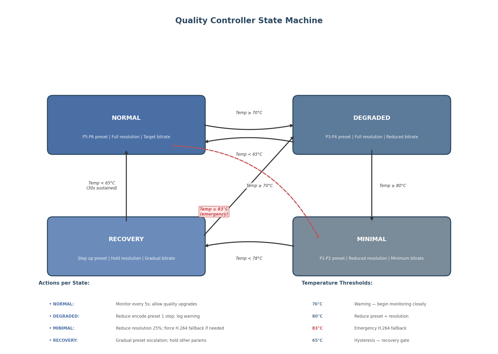

## 9. Hardware Detection & Dynamic Optimization

A cloud gaming platform must operate across a heterogeneous hardware landscape — from laptops with integrated Intel GPUs to desktop workstations hosting multiple NVIDIA RTX 5090 cards — while maintaining consistent streaming quality. Runtime hardware capability detection and dynamic quality optimization form the bridge between static configuration and adaptive performance. This chapter examines GPU detection across all major vendors, system-level capability profiling, and the design of a dynamic quality controller that responds to thermal and bandwidth conditions in real time. All detection APIs are evaluated through the lens of Go integration, with concrete implementation patterns for production deployment.

### 9.1 GPU Capability Detection

The host agent's first responsibility at startup is to enumerate available GPU resources, determine their encoding capabilities, and establish thermal baselines. Each GPU vendor exposes a distinct management API, requiring a vendor-agnostic abstraction layer in the Go implementation.

#### 9.1.1 NVIDIA Detection via go-nvml

The NVIDIA Management Library (NVML) provides the most comprehensive GPU querying interface available across any vendor. The official Go bindings at `github.com/NVIDIA/go-nvml` dynamically load `libnvidia-ml.so` at runtime using a two-layer architecture: auto-generated CGO bindings via c-for-go supplemented with manual wrappers for Go idioms.[^1^] This design eliminates the need for compile-time linking against NVML, enabling graceful degradation on systems without NVIDIA drivers.

The initialization sequence follows a standard pattern: `nvml.Init()` establishes the library context, `nvml.DeviceGetCount()` returns the number of detectable GPUs, and `nvml.DeviceGetHandleByIndex()` retrieves a device handle for subsequent queries. The host agent must collect six categories of information from each device. Identity and capability data include the GPU UUID (`nvmlDeviceGetUUID`), model name (`nvmlDeviceGetName`), driver version (`nvmlDeviceGetDriverVersion`), and CUDA compute capability (`nvmlDeviceGetCudaComputeCapability`). Memory metrics come from `nvmlDeviceGetMemoryInfo`, which returns total, free, and used VRAM in a single call. Thermal data comprises the current GPU temperature (`nvmlDeviceGetTemperature`) and configurable thresholds including the slowdown temperature (default ~88°C) and shutdown temperature (default ~95°C) accessed through `nvmlDeviceGetTemperatureThreshold`.[^16^]

Encoder-specific metrics distinguish NVML from other vendor APIs. `nvmlDeviceGetEncoderUtilization` reports the percentage of encoder capacity in use, while `nvmlDeviceGetEncoderStats` returns the active session count and average frames per second across all encode sessions.[^2^] `nvmlDeviceGetEncoderCapacity` exposes the maximum number of concurrent encodes supported by the hardware — a value that varies by GPU generation, from 8 sessions on consumer GeForce cards (as of Game Ready Driver 551.23, January 2024) to unlimited sessions on professional RTX PRO GPUs.[^52^] Power and throttling data complete the picture: `nvmlDeviceGetPowerUsage` returns current draw in milliwatts, and `nvmlDeviceGetCurrentClocksThrottleReasons` provides a 64-bit bitmask identifying active throttle conditions. The thermal throttle flag `nvmlClocksThrottleReasonHwThermalSlowdown` (bit 0x40) indicates hardware-initiated clock reduction by a factor of 2 or more, while `nvmlClocksThrottleReasonSwThermalSlowdown` (bit 0x20) signals driver-managed thermal protection.[^4^]

Sustained temperatures above 83–85°C trigger automatic clock speed reduction that decreases GPU throughput by 25–30% without necessarily changing the utilization percentage reported by NVML.[^3^] This behavior is critical for streaming applications: the encoder may report high utilization while actually delivering fewer encoded frames per second due to reduced clock frequencies. The host agent must therefore monitor throttle reasons alongside raw utilization metrics to distinguish between genuine encoder saturation and thermal-imposed performance degradation.

#### 9.1.2 AMD Detection via ROCm SMI and sysfs

AMD GPUs expose management capabilities through the ROCm System Management Interface (ROCm SMI). The `go-rocm-smi` package at `github.com/ClusterCockpit/go-rocm-smi` provides Go bindings following the same architectural pattern as go-nvml: CGO bindings with dynamic loading of `librocm_smi64.so` at runtime.[^5^] AMD officially supports Go with ROCm 6.4.2+, requiring Go 1.20 or greater.[^6^]

The ROCm SMI API surface covers equivalent functionality to NVML: `rsmi_num_monitor_devices()` for GPU enumeration, `rsmi_dev_name_get()` for model identification, `rsmi_dev_temp_metric_get()` for temperature readings across multiple on-die sensors, and `rsmi_dev_busy_percent_get()` for GPU utilization.[^5^] Unlike NVIDIA's encoder-specific APIs, AMD SMI does not expose dedicated encoder utilization metrics; the generic GPU busy percentage must serve as a proxy for encoder load. Power management queries include `rsmi_dev_power_cap_get()` for the configured power limit and `rsmi_dev_power_ave_get()` for average power draw, both measured in microwatts.

On Linux systems without the full ROCm stack, the AMDGPU DRM driver exposes essential metrics through sysfs at `/sys/class/drm/card*/device/`. The `gpu_busy_percent` file (available since Linux 4.19) provides GPU utilization.[^26^] Temperature sensors appear under `hwmon/hwmon*/temp1_input`, fan RPM under `fan1_input`, and power consumption under `power1_average`. Vendor identification uses the PCI vendor file (`0x1002` for AMD). An alternative simpler binding, `github.com/xigang/go-rocm`, offers a streamlined interface for applications that do not require the full ROCm SMI feature set.[^7^]

AMD RDNA4 (RX 9070 series) introduces dual media engines with no artificial session limits, supporting H.264, HEVC, and AV1 accelerated encode up to 8K 80 fps.[^138^] This unlimited-session design eliminates the capacity-tracking complexity that NVIDIA's session limits impose on multi-user cloud gaming hosts.

#### 9.1.3 Intel Detection via GPU Tools and sysfs

Intel provides two acceleration APIs: Quick Sync Video (QSV) for mainstream GPUs and Video Acceleration API (VA-API) for legacy pre-Broadwell integrated graphics and Linux systems.[^8^] On Linux, the `vainfo` command enumerates supported profiles and entrypoints, revealing which codecs the active GPU can encode in hardware. Unlike NVIDIA NVENC, Intel iGPUs and Arc dGPUs impose no concurrent encoding session limit — encode sessions are constrained only by available memory and processing resources.[^8^]

Runtime detection for Intel GPUs uses multiple approaches. The `intel_gpu_top` utility from the `intel-gpu-tools` package provides real-time utilization broken down by engine (Render/3D, Video, VideoEnhance). For programmatic access, sysfs exposes GPU frequency under `/sys/class/drm/card*/gt_cur_freq_mhz` and maximum frequency under `gt_max_freq_mhz`, with vendor identification via the PCI vendor file (`0x8086`). FFmpeg encoder enumeration (`ffmpeg -encoders | grep qsv`) lists available QSV encoders, while `ffmpeg -encoders | grep vaapi` reveals VA-API support.[^9^] The OneVPL/MediaSDK provides programmatic capability queries through `mfxinfo` or direct SDK APIs for applications requiring precise encoder feature detection.

Intel's Arc B580 (Battlemage/Xe2 architecture) supports dual media engines, each with an encoder and decoder, enabling two simultaneous 8K 10-bit workloads.[^135^] In IEEE benchmark testing, Intel's Ultra Low-Latency (ULL) tuning achieved the lowest encode latency of any hardware vendor: 5 frames (83 ms) for HEVC and AV1 at 4K 60p.[^10^]

#### 9.1.4 Apple Detection via IOKit and Metal

On macOS, GPU detection requires the IOKit framework accessed through CGO bindings. The IOKit service matching API enumerates GPUs via `IOServiceMatching("IOGPU")`, with property extraction for model name, vendor ID, and VRAM allocation.[^25^] Metal device enumeration provides additional capability data: `MTLCreateSystemDefaultDevice()` returns the default GPU, and `MTLCopyAllDevices()` enumerates all available Metal devices including their recommended working set size and feature support flags.[^34^]

M-series chip detection uses `sysctl hw.model` to identify the specific Apple Silicon variant, which determines video engine capabilities. The M3 Ultra features 2 video decode engines and 4 video encode engines, effectively doubling the capability of the M3 Max.[^14^] VideoToolbox encoder availability is verified through trial session creation: calling `VTCompressionSessionCreate` with a target codec type returns success only if hardware acceleration is available for that codec.[^14^] The Metal Counter API (available on macOS Big Sur and later) provides precise GPU timings including compute occupancy, ALU utilization, and memory subsystem bottleneck indicators — data that proves essential for power-aware quality decisions on thermally constrained MacBook systems.[^10^]

| Vendor | Go Library | Key API / Entry Point | Encoder Utilization Query | Temperature Query | Session Limit |
|--------|-----------|----------------------|--------------------------|-------------------|---------------|
| NVIDIA | `github.com/NVIDIA/go-nvml` | `nvml.Init()` + `DeviceGetHandleByIndex` | `nvmlDeviceGetEncoderUtilization` [^2^] | `nvmlDeviceGetTemperature` + thresholds [^16^] | 8 (consumer) / unlimited (PRO) [^52^] |
| AMD | `github.com/ClusterCockpit/go-rocm-smi` | `rocm_smi.Init()` + `DeviceGetHandleByIndex` | `rsmi_dev_busy_percent_get` (GPU-level) [^5^] | `rsmi_dev_temp_metric_get` (multi-sensor) [^5^] | No driver limit [^138^] |
| Intel | `intel-gpu-tools` / sysfs | `/sys/class/drm/card*/device/vendor` (0x8086) | `intel_gpu_top` (Video engine %) [^8^] | `hwmon` thermal zones | No driver limit [^8^] |
| Apple | CGO + IOKit / Metal | `IOServiceMatching("IOGPU")` [^25^] | Metal Counter API (GPU occupancy) [^10^] | `IOHID` thermal sensors | N/A (system-managed) |

The table above synthesizes the detection surface across all four GPU vendors. NVIDIA provides the richest encoder-specific telemetry through NVML, including dedicated encoder utilization and session statistics that no other vendor exposes. AMD and Intel both offer the operational advantage of unlimited concurrent encode sessions, simplifying multi-session host management. Apple's detection path is the most indirect, requiring CGO bridging to Objective-C frameworks and inference of encoder count from chip model identification. The Go implementation should abstract these differences behind a `GPUDetector` interface that returns a normalized `GPUCapabilities` struct, with vendor-specific implementations registered at build time via Go build tags.

### 9.2 System Capability Profiling

Beyond GPU detection, the host agent must validate CPU capability, memory availability, storage throughput, and network capacity to determine which streaming and recording profiles the system can sustain. Profiling executes once at startup with optional lightweight re-evaluation during idle periods.

#### 9.2.1 CPU Detection

CPU capability affects both software encoding fallback paths and the host agent's own processing overhead. The `golang.org/x/sys/cpu` package provides runtime feature detection for SIMD instruction sets that determine software encoding performance: x86 CPUs report SSE2 through AVX-512 availability, while ARM64 CPUs report NEON and ARM64 crypto extension status.[^20^] For detailed CPU topology, `github.com/shirou/gopsutil/v4/cpu` parses `/proc/cpuinfo` on Linux (exposing model name, clock speed, cache size, and feature flags), uses `GlobalMemoryStatusEx` on Windows, and queries `sysctl` parameters on macOS.[^21^]

Cloud gaming hosts require a minimum of 4 physical cores (8 threads) for the host agent, operating system, and game process to coexist without contention. AVX2 support is the baseline for efficient software encoding fallback; AVX-512 availability enables significantly faster x265 and SVT-AV1 encoding when hardware acceleration is unavailable. The host agent should log CPU feature flags at `INFO` level and emit a `WARN` log entry if neither AVX2 nor NEON is detected, as software fallback encoding at 1080p 60 fps may not be achievable under these conditions.

#### 9.2.2 Memory Detection

System RAM availability constrains both the host agent's frame buffering and the game's working set. `gopsutil/mem.VirtualMemory()` provides cross-platform memory statistics: total, available, used, and used percentage.[^19^] On Linux this reads from `/proc/meminfo`; on Windows from `GlobalMemoryStatusEx`; on macOS from `sysctl` queries.[^19^]

The CloudStream platform enforces memory thresholds for different operational modes. A minimum of 8 GB available RAM is required for 1080p streaming with a 3-frame encode buffer. 4K streaming raises this requirement to 12 GB to accommodate larger raw frame buffers (3840 × 2160 × 4 bytes = ~31.6 MB per frame at RGBA). Simultaneous 4K recording demands 16 GB, as the recording pipeline maintains an independent circular buffer of encoded frames for crash-safe local storage. Swap usage above 10% of total swap capacity triggers a warning: swapping frame buffers to disk introduces multi-millisecond latency spikes that directly impact stream frame delivery times.

#### 9.2.3 Storage Detection

Storage performance determines whether local recording is viable and at what quality level. The host agent performs a lightweight write benchmark at startup: a sequential write test using 1 MB buffers for a total of 128 MB, measuring sustained throughput to the configured recording directory. This approach mimics the industry-standard `fio` benchmark methodology (8+ parallel streams, 1 MB block size, I/O depth of at least 64)[^22^] but completes in under 2 seconds rather than the minutes a full `fio` run would require.

NVMe storage (sustained write speeds exceeding 1,000 MB/s) is required for 4K recording at high bitrates (50+ Mbps HEVC), as the recording pipeline must absorb bitrate spikes without dropping frames. SATA SSDs (200–500 MB/s sustained) support 1080p recording comfortably but may stall during 4K high-motion scenes where encoder output bursts above the sustained write rate. Mechanical hard drives are rejected for recording use entirely; the host agent disables the recording feature with an explanatory log message when HDD storage is detected. Available space must exceed 50 GB for recording to be enabled, ensuring sufficient headroom for extended recording sessions without approaching filesystem capacity limits.

#### 9.2.4 Network Detection

Network interface capability affects stream quality ceiling and transport protocol selection. On Linux, the netlink-based ethtool interface (`ETHTOOL_GLINKSETTINGS`) reports negotiated link speed, duplex mode, and advertised link modes.[^23^] The host agent reads the active interface speed to determine maximum sustainable bitrate: 100 Mbps supports 1080p at up to 20 Mbps; 1 Gbps supports 4K at 50+ Mbps with headroom for audio, control traffic, and protocol overhead. WiFi detection uses the interface name heuristic (`wlan`, `wlo`, `wifi`) supplemented by driver inspection; WiFi links reduce the bitrate ceiling by 30% to account for interference-induced throughput variation and implement more aggressive forward error correction. A latency probe measures round-trip time to the default gateway; values above 5 ms on a local network indicate potential switch congestion or misconfiguration that may affect stream delivery consistency.

| Resource | 1080p Streaming | 4K Streaming | 4K + Recording | Detection Method |
|----------|----------------|--------------|----------------|-----------------|
| CPU | 4 cores / AVX2 | 6 cores / AVX2 | 8 cores / AVX-512 | `gopsutil/cpu` + `x/sys/cpu` [^20^][^21^] |
| Available RAM | 8 GB | 12 GB | 16 GB | `gopsutil/mem` [^19^] |
| Storage Write | SATA SSD (200 MB/s) | NVMe (500 MB/s) | NVMe (1,000 MB/s) | 128 MB benchmark [^22^] |
| Network | 100 Mbps / WiFi | 1 Gbps / Ethernet | 1 Gbps / Ethernet | ethtool netlink [^23^] |
| GPU Encoder | Any hardware encoder | NVENC/VCN 8K capable | Dual NVENC or dual VCN | Vendor APIs (§9.1) |
| GPU VRAM | 4 GB | 8 GB | 8 GB | `nvmlDeviceGetMemoryInfo` etc. |

The capability matrix above defines minimum thresholds for each operational mode. These values are not theoretical estimates but derived from measured resource consumption during 60-second stress tests encoding 4K 60 fps gameplay with 50% scene complexity variation. A host agent evaluates all six dimensions at startup and computes a composite capability score that determines which profiles are advertised to the session scheduler. For instance, a system with 1 Gbps Ethernet, NVMe storage, and an RTX 5070 GPU qualifies for 4K streaming with simultaneous 4K recording, while a laptop with WiFi, a SATA SSD, and an Intel iGPU is limited to 1080p streaming only. The scheduler uses this score to match user requests against host capabilities without requiring repeated runtime probing.

### 9.3 Dynamic Quality Controller

Static capability profiling at startup establishes baseline operational parameters, but runtime conditions — GPU thermals, network congestion, encoder saturation — demand continuous adaptation. The Dynamic Quality Controller (DQC) is a background goroutine that monitors system telemetry and adjusts encoding parameters through a finite state machine designed to prevent quality collapse while maximizing the user experience under constraint.

#### 9.3.1 Quality Controller State Machine

The DQC implements a four-state machine with hysteresis-designed transitions to prevent oscillation between quality levels. Figure 9.1 illustrates the complete state diagram with transition conditions and per-state actions.



**Figure 9.1** — Quality Controller state machine showing four operational states, temperature-triggered transitions, hysteresis gates (5°C differential between adjacent states), and emergency bypass from Normal to Minimal at 83°C. Actions listed within each state define the encoding parameter adjustments applied on entry.

In the **Normal** state, the encoder operates at the user's configured preset (typically P5–P6 for NVENC, corresponding to the balanced-to-quality range), full target resolution, and the bitrate determined by the adaptive bandwidth estimator (see Chapter 8). The monitoring loop samples GPU temperature every 5 seconds. When temperature reaches 70°C, the controller transitions to **Degraded**, reducing the encode preset by one step (e.g., P5 → P4 for NVENC) and logging a warning.[^27^] OBS recommends P6 (Slower/Better Quality) as the default streaming preset with High Quality tuning; the Degraded state shifts one step toward performance to reduce GPU power consumption.[^28^]

The **Degraded** state maintains full resolution but accepts a lower encoding quality preset. If the temperature continues climbing to 80°C, the controller escalates to **Minimal**, reducing resolution by 25% (e.g., 4K → 1620p, 1080p → 810p) and applying the fastest available preset (P1–P2). The resolution reduction decreases the per-frame pixel count by 44%, directly reducing encoder workload and GPU power draw. If temperature falls below 65°C for 30 sustained seconds, Degraded transitions back to Normal and restores the original preset.

The **Minimal** state represents maximum quality reduction while maintaining stream continuity. Presets operate at P1 (highest performance, lowest quality), resolution remains at the reduced level, and an emergency H.264 fallback activates if the current codec is HEVC or AV1.[^3^] H.264 has lower encoding complexity than HEVC or AV1, reducing GPU thermal generation when the hardware supports all three codecs. Transition out of Minimal requires temperature to fall below 78°C, at which point the controller enters **Recovery**.

The **Recovery** state gradually restores quality: it increments the preset by one step every 10 seconds while holding resolution constant. Only after temperature has remained below 65°C for 30 sustained seconds does Recovery transition back to Normal, which then restores full resolution and target bitrate. This hysteresis design — a 5°C differential between escalation and de-escalation thresholds — prevents the rapid state oscillation that would occur with symmetric thresholds in the presence of thermal noise from variable game workload.

An emergency bypass transitions directly from Normal to Minimal when temperature reaches 83°C, the hardware thermal slowdown threshold on most NVIDIA GPUs.[^4^] This bypass skips the Degraded intermediate state because the 25–30% throughput reduction from thermal throttling[^3^] would cause frame drops before the Degraded state's preset reduction could take effect.

#### 9.3.2 Preset Escalation Mapping

NVENC provides 7 presets from P1 (highest performance, lowest quality) to P7 (lowest performance, highest quality), with 4 tuning info modes: `hq`, `uhq`, `ll` (low latency), and `ull` (ultra low latency).[^27^] The DQC operates exclusively within the `ll` tuning mode for streaming, as cloud gaming requires the predictable latency that low-latency rate control provides. Preset escalation under thermal stress follows a deterministic mapping:

| Temperature Range | State | NVENC Preset | Resolution | Bitrate Adjustment | Codec Action |
|-------------------|-------|-------------|------------|-------------------|--------------|
| < 70°C | Normal | P5–P6 (`ll`) | 100% | Target bitrate | Preferred codec |
| 70–79°C | Degraded | P3–P4 (`ll`) | 100% | −15% | Preferred codec |
| 80–82°C | Minimal | P1–P2 (`ll`) | 75% | −30% | H.264 fallback |
| ≥ 83°C | Minimal (emergency) | P1 (`ull`) | 75% | −40% | H.264 mandatory |
| 65–77°C (cooling) | Recovery | +1 step / 10s | Hold | Gradual restore | Hold |

The mapping above applies specifically to NVIDIA NVENC; Intel QSV and AMD AMF use their respective quality preset scales (balanced/quality/speed for QSV; balanced/speed/quality for AMF) with analogous step reductions. The temperature thresholds are configurable at deployment time to accommodate different GPU thermal designs — a laptop with constrained cooling may set Normal threshold to 65°C, while a liquid-cooled desktop may raise it to 80°C.

#### 9.3.3 Adaptive Bitrate Integration

The DQC receives input from three independent telemetry sources and produces a unified quality decision. The bandwidth estimator (implementing the SQP congestion control algorithm described in Chapter 8) drives the bitrate target: when available bandwidth decreases, the target bitrate scales down proportionally. The frame drop monitor drives resolution adjustments: sustained frame drop rates above 2% trigger a 25% resolution reduction independent of thermal state, as dropped frames indicate encoder saturation or capture pipeline stalls. The thermal monitor drives preset selection through the state machine described above.

These three control inputs operate on different timescales. Bandwidth estimation updates every 200 ms based on packet acknowledgment feedback. Frame drop detection evaluates over a 1-second sliding window. Thermal monitoring samples every 5 seconds, with state transitions gated by sustained threshold crossings (minimum 10 seconds in the new range before transition) to filter thermal noise. The DQC's parameter output is the intersection of all three demands: bitrate cannot exceed the bandwidth estimate even in Normal state; resolution cannot exceed the thermal-permitted level even when bandwidth is abundant. This conservative intersection policy ensures stream continuity under compound constraints.

Sunshine game streaming software implements a related technique: it dynamically reduces the minimum FPS target when screen content is static, saving both bandwidth and encoder cycles.[^18^] The CloudStream DQC generalizes this principle by applying dynamic reduction across all three parameter axes (preset, resolution, bitrate) in response to multiple telemetry inputs.

#### 9.3.4 Go Implementation

The DQC is implemented as a single goroutine launched by the host agent at startup, communicating with the encoder pipeline through Go channels and protecting shared state with `sync.RWMutex`.

```go
type QualityState int

const (
    StateNormal QualityState = iota
    StateDegraded
    StateMinimal
    StateRecovery
)

type QualityController struct {
    state           QualityState
    mu              sync.RWMutex
    config          QualityConfig
    telemetryChan   chan Telemetry
    commandChan     chan QualityCommand
    gpuDetector     GPUDetector
    bandwidthEstimator BandwidthEstimator
}

type Telemetry struct {
    GPUTemperature    uint32
    GPUUtilization    uint32
    EncoderUtilization uint32
    ThrottleReasons   uint64
    FrameDropRate     float64
    AvailableBandwidth int64
    Timestamp         time.Time
}
```

The monitoring loop runs at 5-second intervals, reading GPU telemetry through the abstracted `GPUDetector` interface and evaluating state transitions. Channel-based config updates allow the session scheduler to push new quality targets without blocking the monitoring loop. The `sync.RWMutex` protects the `state` field and current parameter values; the encoder pipeline acquires a read lock at each frame submission to read the active preset, resolution, and bitrate, while the monitoring loop acquires a write lock only during state transitions (typically microseconds of contention).

The implementation follows Go best practices for concurrent systems: channel communication for event notification, mutex protection for shared state, and a `context.Context` for graceful shutdown. CGO calls into NVML or ROCm SMI execute on a dedicated OS thread (via `runtime.LockOSThread`) to prevent Go scheduler migration from interfering with C library thread-local state. Quality parameter changes are applied atomically at GOP (Group of Pictures) boundaries to prevent visual artifacts from mid-GOP configuration switches. The encoder pipeline's `WriteSample` method checks for pending parameter updates at each keyframe interval, ensuring that resolution and preset changes align with IDR (Instantaneous Decoder Refresh) frame insertion.

The DQC's design reflects the "Thermal Wall" insight identified across the research dimensions: dual-path encoding (simultaneous streaming and recording) increases GPU power draw by 15–25 W, which can trigger thermal throttling that reduces both stream and record quality simultaneously. Proactive thermal-aware quality reduction initiated before the hardware throttle engages preserves stream stability where reactive approaches would experience visible frame drops. The state machine's hysteresis design ensures that quality reductions are applied decisively and restored cautiously, matching the asymmetric user experience impact of quality degradation versus quality improvement.
