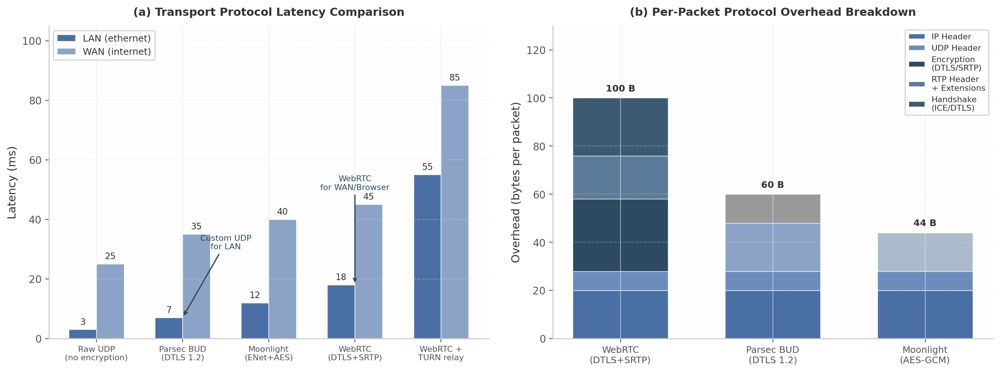

## 11. Network Transport & Packet Optimization

The transport layer determines whether sub-100ms game streaming is achievable in practice. While previous chapters addressed encoding efficiency and pipeline architecture, this chapter examines the network protocols that carry encoded frames from server to client. CloudStream adopts a dual transport strategy: WebRTC for browser-based and wide-area network (WAN) sessions, and a custom UDP protocol optimized for local-area network (LAN) deployments where latency must remain below 10ms. This architecture — combining the universal compatibility of WebRTC with the minimal overhead of a Parsec BUD-style protocol — represents the current frontier in interactive streaming transport design[^7^][^8^].

### 11.1 WebRTC Transport Internals

WebRTC is the mandatory transport for browser-based clients, and its internal configuration directly impacts end-to-end latency. Understanding RTP packetization, Pion configuration parameters, RTCP feedback loops, and ICE negotiation timing is essential for extracting maximum performance from the WebRTC stack.

#### 11.1.1 RTP Packetization: Codec-Specific Encapsulation

Real-Time Transport Protocol (RTP) packetization converts encoded video frames into network packets. Each codec specifies a distinct payload format, and the choice of packetization mode affects both interoperability and recovery from packet loss.

**H.264 NAL Unit Fragmentation.** WebRTC mandates non-interleaved packetization mode (mode 1) for H.264, as defined in RFC 6184[^1^]. This mode supports three packet types: single NAL unit packets (types 1–23) for small units, STAP-A (type 24) for aggregating multiple NAL units with identical timestamps, and FU-A (type 28) for fragmenting large NAL units across multiple packets[^1^]. The FU-A fragmentation unit carries a 1-byte indicator (with the original NAL type replaced by 28) followed by a 1-byte header containing start (S) and end (E) bits that mark fragment boundaries. This design allows the receiver to reassemble fragmented NAL units even when individual fragments arrive out of order or are lost.

**HEVC VPS/SPS/PPS Prefix.** HEVC/H.265 follows RFC 7798, which requires Video Parameter Set (VPS), Sequence Parameter Set (SPS), and Picture Parameter Set (PPS) NAL units to precede each IDR frame[^2^]. Some encoders — notably AMD VCE — insert these for every frame, adding 2–5% bitrate overhead at 60 fps[^3^]. The CloudStream encoder should strip redundant repetitions on non-key frames.

**AV1 OBU Encapsulation.** AV1 uses Open Bitstream Units (OBUs) as the smallest transport entity, with each RTP packet containing a 1-byte aggregation header (Z, Y, W, N flags) followed by OBU elements in leb128-encoded size delimiters[^4^]. The AV1 RTP specification imposes a strict rule: each RTP packet must not contain OBUs from different temporal units, and fragmentation is permitted only within — never across — frame boundaries[^4^]. This constraint simplifies the receiver's reassembly logic but requires the sender to frame-align its packetization buffer.

| Feature | H.264 (RFC 6184) | HEVC (RFC 7798) | AV1 (AOM Spec) |
|---|---|---|---|
| Packet types | Single NAL, STAP-A, FU-A | Single NAL, AP, FU | OBU aggregation |
| Fragmentation | FU-A (type 28) | FU (types 49–50) | Intra-OBU only |
| Parameter set delivery | With each IDR | VPS/SPS/PPS per IDR[^2^] | Sequence header in first packet |
| Aggregation mode | STAP-A only | AP (Aggregation Packet) | Multi-OBU per RTP |
| Cross-frame fragmentation | Not allowed | Not allowed | Explicitly prohibited[^4^] |
| Mandatory mode | Non-interleaved (mode 1)[^1^] | Single NAL or AP | Temporal unit aligned |

Table: Comparison of RTP packetization modes across the three primary codecs. Each format balances fragmentation flexibility against receiver reassembly complexity, with AV1 imposing the strictest frame-boundary constraints.

The practical implication of these differences is that the packetization module must be codec-aware. Pion's `rtp/codecs` package provides codec-specific payloader implementations (`H264Payloader`, `H265Payloader`, `AV1Payloader`) that handle these details, but the server must still configure the correct payload type and negotiate packetization mode through the SDP (Session Description Protocol) offer/answer exchange[^37^][^38^].

#### 11.1.2 Pion WebRTC Configuration

Pion, the pure-Go WebRTC implementation, exposes the `SettingEngine` struct for fine-tuning transport behavior. Several parameters are critical for gaming-oriented streaming.

**Custom MTU Configuration.** The default MTU in many WebRTC implementations is 1200 bytes, a conservative value chosen to avoid IP fragmentation across VPN and TURN relay paths[^25^]. In Pion, this is configured through the RTP packetizer: `rtp.NewPacketizer(1200, payloadType, ssrc, payloader, sequencer, clockRate)` produces packets with a payload limit that accounts for RTP header (12 bytes), SRTP authentication tag (10 bytes), UDP header (8 bytes), and IPv4 header (20 bytes), yielding approximately 1146 bytes of codec payload per packet[^37^].

**Single-Port Multiplexing.** Pion supports `ice.NewMultiUDPMuxFromPort(port)` to multiplex multiple PeerConnections on a single UDP port, simplifying firewall and NAT traversal configuration[^38^]. This mode supports approximately 500 simultaneous PeerConnections per port, limited primarily by the browser-side constraint of 500 connections per Chromium page[^42^]. For a cloud gaming service, this means a single server port can handle hundreds of concurrent sessions without requiring per-client firewall rules.

**DataChannels for Controller Input.** WebRTC DataChannels carry controller input and metadata. For gaming, DataChannels should be configured in unreliable, unordered mode (`ordered: false, maxRetransmits: 0`) to avoid head-of-line blocking. The WebRTC DataChannel stack adds approximately 120 bytes of overhead per packet: SCTP (28 bytes) + DTLS (20–40 bytes) + UDP (8 bytes) + IP (20–40 bytes), with a maximum SCTP payload of 1160 bytes[^5^]. This is sufficient for compressed controller state, which typically requires 20–100 bytes per update.

#### 11.1.3 RTCP Feedback: Enabling Adaptive Quality

Real-Time Control Protocol (RTCP) feedback drives the adaptive quality loop. Four feedback types are essential for game streaming:

**Receiver Reports (RR).** RTCP RR packets arrive at 5-second intervals (configurable) and report fraction lost, cumulative packets lost, highest sequence number received, interarrival jitter, and delay since last Sender Report[^358^]. These metrics feed the loss-based component of the Google Congestion Control (GCC) algorithm.

**Transport Wide Congestion Control (TWCC).** TWCC is the dominant feedback mechanism for modern WebRTC congestion control[^261^]. The sender attaches a transport-wide sequence number to each RTP packet; the receiver reports per-packet arrival timestamps via RTCP feedback messages (type 205, format 15)[^264^]. This per-packet granularity enables the sender to compute precise inter-arrival delay gradients, the foundation of GCC's delay-based controller. TWCC provides sender-side control, nearly instant loss detection, and accurate bitrate measurement across all media streams[^264^].

**Picture Loss Indication (PLI) and Full Intra Request (FIR).** PLI requests an immediate keyframe when the decoder encounters a non-recoverable error, while FIR requests a full intra frame (typically for new participants joining a session)[^22^]. For game streaming, PLI should be responded to within one frame interval (16.7 ms at 60 fps) to minimize freeze duration. Pion's NACK interceptor handles PLI generation automatically when gaps in the sequence number space exceed configurable thresholds.

#### 11.1.4 ICE Optimization

Interactive Connectivity Establishment (ICE) determines the network path between server and client. The ICE process involves host candidate discovery, STUN (Session Traversal Utilities for NAT) binding requests, and optional TURN (Traversal Using Relays around NAT) relay allocation.

For gaming, ICE optimization should prioritize direct paths and minimize connection establishment time. The Pion `SettingEngine` allows tuning ICE timeouts: `SetICETimeouts(disconnected: 3s, failed: 10s, keepalive: 1s)` reduces the default detection intervals, enabling faster failover when a path degrades[^38^]. Host candidates (direct local IP addresses) should be preferred over server-reflexive (STUN-discovered) candidates when both endpoints are on the same LAN, avoiding unnecessary NAT traversal.

TURN relay adds 10–80 ms of latency and is required for approximately 20–30% of WebRTC sessions where direct NAT traversal fails[^35^]. Relay selection should measure RTT to multiple TURN servers and select the lowest-latency path. Production TURN deployments typically use coturn (C-based, highest performance) or eturnal (Erlang/OTP, REST API authentication)[^35^][^36^]. For maximum throughput, the coturn documentation recommends running one TURN instance per CPU core with separate listening addresses[^35^].

### 11.2 Custom UDP Transport (LAN Optimization)

While WebRTC provides universal browser compatibility, its mandatory encryption, signaling, and protocol layering introduce 15–20 ms of overhead compared to raw UDP[^7^][^8^]. For LAN deployments where both endpoints are under administrative control and the network path is trusted, a custom UDP protocol achieves substantially lower latency.

#### 11.2.1 Parsec BUD-Style Protocol Design

Parsec's proprietary BUD (Better User Datagrams) protocol demonstrates the performance achievable with a minimal UDP-based design. BUD layers application-level reliability and congestion control over raw UDP, encrypts each packet with DTLS 1.2 (AES-128 or AES-256), and achieves **7 ms of LAN ethernet latency** — compared to WebRTC's 15–20 ms under identical conditions[^8^]. BUD's design reflects a clear priority hierarchy: latency takes precedence over frame rates, which take precedence over video quality[^9^].

The protocol stack is intentionally simple: application data (video, audio) → BUD reliability and congestion control → DTLS 1.2 encryption → UDP → IP[^7^]. BUD's congestion control algorithm adjusts dynamically to packet loss and achieves a 97% NAT traversal success rate[^7^]. The per-packet DTLS 1.2 encryption adds approximately 0.5 ms of overhead — negligible compared to the full DTLS/SRTP handshake required by WebRTC, which can add 50–200 ms to initial connection establishment.

#### 11.2.2 Dual Transport Strategy: Best of Both Worlds

CloudStream's key architectural insight is the deployment of **two complementary transport protocols** selected by connection context: custom UDP for native clients on LAN (sub-10 ms target), and WebRTC for browser clients and WAN sessions (universal compatibility)[^7^][^8^]. This dual transport strategy avoids the fundamental trade-off between latency and compatibility — each connection uses the protocol best suited to its environment.

The selection logic is straightforward: if the client is a native application and the server detects a LAN IP range (or RTT below 5 ms), it negotiates the custom UDP path. For browser clients, WebRTC remains the only viable option due to browser security sandboxes that block raw UDP socket access. For WAN connections, WebRTC's ICE/STUN/TURN infrastructure provides robust NAT traversal that a custom protocol would need to replicate.



Figure: (a) Latency comparison across transport protocols under LAN and WAN conditions, showing the 2–3x latency advantage of custom UDP over WebRTC on LAN. (b) Per-packet protocol overhead breakdown, with WebRTC accumulating approximately 100 bytes from DTLS/SRTP layers versus 60 bytes for Parsec BUD's lighter DTLS 1.2 approach. Data sources: Parsec technology benchmarks[^8^], WebRTC specification overhead analysis[^5^], Moonlight ENet documentation[^12^].

#### 11.2.3 Packet Structure and Parsing

The custom UDP packet format uses a 16-byte header followed by an encrypted payload:

```
 0                   1                   2                   3
 0 1 2 3 4 5 6 7 8 9 0 1 2 3 4 5 6 7 8 9 0 1 2 3 4 5 6 7 8 9 0 1
+-+-+-+-+-+-+-+-+-+-+-+-+-+-+-+-+-+-+-+-+-+-+-+-+-+-+-+-+-+-+-+-+
|                        Sequence Number                        |
+-+-+-+-+-+-+-+-+-+-+-+-+-+-+-+-+-+-+-+-+-+-+-+-+-+-+-+-+-+-+-+-+
|                      Timestamp (64 bits)                      |
+-+-+-+-+-+-+-+-+-+-+-+-+-+-+-+-+-+-+-+-+-+-+-+-+-+-+-+-+-+-+-+-+
|  Flags  | Payload |           Payload Length                  |
|  (8b)   | Type(8b)|              (16 bits)                    |
+-+-+-+-+-+-+-+-+-+-+-+-+-+-+-+-+-+-+-+-+-+-+-+-+-+-+-+-+-+-+-+-+
|                                                               |
|                    Encrypted Payload                          |
|                                                               |
+-+-+-+-+-+-+-+-+-+-+-+-+-+-+-+-+-+-+-+-+-+-+-+-+-+-+-+-+-+-+-+-+
```

The 32-bit sequence number enables loss detection, the 64-bit timestamp (microsecond resolution) supports RTT calculation, and flags indicate reliability requirements, keyframe boundaries, and payload type. At approximately 0.5 ms parse time per packet, this header adds negligible processing overhead.

#### 11.2.4 SQP Integration: Frame-Coupled Congestion Control

For the custom UDP path, CloudStream integrates the Scalable Quality Protocol (SQP) congestion controller, which was developed by Google Research for low-latency interactive video streaming and achieves 2–3x higher bandwidth than GCC when competing with TCP flows[^237^]. SQP's key innovation is **frame-coupled paced packet trains**: packets from each video frame are transmitted together as a burst, and the receiver measures available bandwidth from the inter-arrival times of packets within each frame[^239^].

SQP's bandwidth estimation formula for frame $n$ is $m_n = Z_n / A_n$, where $Z_n$ is the sum of packet sizes in the frame and $A_n$ is the sum of inter-arrival times[^239^]. This frame-level measurement is immune to the temporal bitrate variation inherent in real-time video encoding, which causes conventional packet-level congestion control algorithms to misestimate available bandwidth[^268^]. In Google's production AR streaming platform, SQP improved high-bandwidth, low-delay sessions by 27 percentage points on LTE and 15 percentage points on WiFi compared to Copa[^242^].

| Capability | WebRTC (WAN/Browser) | Custom UDP + SQP (LAN/Native) |
|---|---|---|
| LAN latency | 15–20 ms[^8^] | 7–10 ms[^8^] |
| WAN NAT traversal | ICE/STUN/TURN (95%+ success) | 97% (BUD-style)[^7^] |
| Encryption | DTLS + SRTP (~100 B overhead)[^5^] | DTLS 1.2 (~60 B overhead) |
| Browser support | Native (required) | Not available (native only) |
| Congestion control | GCC (default) or BBR[^241^] | SQP (2–3x throughput vs GCC)[^237^] |
| Connection handshake | DTLS + ICE (100–500 ms) | DTLS 1.2 resume (<10 ms) |
| Packetization | RTP (codec-specific) | Custom 16-byte header |
| FEC support | FlexFEC / ULPFEC[^16^] | Application-configurable Reed-Solomon |
| DataChannels | SCTP over DTLS | Multiplexed unreliable channels |

Table: Comparison of WebRTC and custom UDP transport paths. The dual transport architecture selects WebRTC for browser compatibility and WAN traversal, while custom UDP with SQP congestion control delivers superior latency and throughput on trusted LAN paths.

### 11.3 Packet Optimization

Even with optimal transport protocol selection, inefficient packet sizing, bursty transmission, or missing QoS markings can degrade the streaming experience. This section covers the mechanical details of packet tuning.

#### 11.3.1 MTU Selection: Avoiding Fragmentation

Maximum Transmission Unit (MTU) selection balances payload efficiency against path compatibility. The default WebRTC MTU of 1200 bytes is a conservative value designed to avoid IP fragmentation across the widest range of network paths, including VPN tunnels and TURN relays[^25^]. At this MTU, the effective codec payload per packet is approximately 1146 bytes after accounting for all headers.

For enterprise deployments using Cloudflare One or similar zero-trust VPN infrastructure, a larger MTU is viable. Cloudflare documentation specifies that network paths must support an MTU of at least 1361 bytes for WebRTC traffic to avoid degraded performance[^26^]. Below this threshold, packets experience progressive performance degradation as fragmentation or path MTU discovery failures increase latency.

| Scenario | MTU (bytes) | Effective Payload | Rationale |
|---|---|---|---|
| Conservative default (VPN-safe) | 1200 | ~1146 B | Avoids fragmentation on all known VPN paths[^25^] |
| Cloudflare One compatible | 1361 | ~1307 B | Minimum for zero-trust VPN paths[^26^] |
| WiFi/ethernet (no VPN) | 1400 | ~1346 B | Accommodates most tunneling overhead |
| Maximum safe (ethernet only) | 1472 | ~1418 B | Ethernet 1500 B − 28 B (UDP+IP headers) |
| IPv6 minimum | 1280 | ~1226 B | IPv6 mandates 1280 B minimum path MTU |

Table: MTU selection matrix for game streaming. The conservative 1200-byte default is recommended for general deployment; larger values may be negotiated when the network path is known to support them. Effective payload calculated as MTU minus 54 bytes (12 B RTP + 4 B extension + 10 B SRTP + 8 B UDP + 20 B IPv4).

Path MTU Discovery (PMTUD) dynamically determines the maximum packet size for a given path, but WebRTC implementations typically avoid it due to ICMP black holes (firewalls blocking ICMP "Fragmentation Needed" messages) and the latency penalty of probe packets. Instead, CloudStream uses a fixed safe MTU with optional upward negotiation: sessions begin at 1200 bytes and may probe to 1361 bytes or 1400 bytes after measuring path stability over the first 100 packets.

#### 11.3.2 Packet Pacing: Preventing Bursty Transmission

Packet pacing distributes transmission of a frame's packets across the frame interval rather than sending them as a single burst. Without pacing, a 1080p60 frame requiring 50 packets at 25 Mbps would be transmitted in approximately 0.3 ms — a micro-burst that can overflow router buffers and cause packet loss. With pacing, those same 50 packets are distributed across the 16.7 ms frame interval at approximately 0.33 ms intervals.

WebRTC's paced sender implements a leaky bucket algorithm with a default burst multiplier of 2.5x the pacing rate for large I-frames[^13^]. Pion's GCC interceptor provides `LeakyBucketPacer` with configurable target bitrate[^14^]. The CloudStream custom UDP path implements a token bucket pacer with the following parameters:

```go
type TokenBucketPacer struct {
    tokens       float64   // Available bytes
    maxTokens    float64   // Bucket capacity (burst allowance)
    fillRate     float64   // Bytes per second
    // For 60 FPS: ~16.67 ms frame interval
    // For 30 FPS: ~33.33 ms frame interval
}
```

The burst capacity (`maxTokens`) is set to 1.5x the average frame size, allowing for I-frame size variation without inducing congestion. Fill rate equals the target bitrate divided by 8 (bytes per second). GCC's delay-based controller uses a 200 ms time window for calculating delay gradients, and the pacer operates at 5 ms polling intervals (legacy) or task-queue based intervals in modern implementations[^13^].

For frame-coupled pacing, packets from a single frame are sent together as a train — but the trains themselves are spaced at frame intervals. This is the approach SQP uses: the burst within a frame train measures available bandwidth, while the inter-train spacing prevents sustained queuing[^239^].

#### 11.3.3 DSCP Marking: Prioritizing Gaming Traffic

Differentiated Services Code Point (DSCP) uses 6 bits in the IP Type of Service (TOS) field to classify traffic for prioritized forwarding. DSCP 46 (Expedited Forwarding, EF) is the recommended marking for game streaming traffic, providing the lowest latency queuing behavior available on DiffServ-enabled networks[^27^]. The Xbox gaming console uses exactly this value: DSCP 46 on its preferred UDP multiplayer port[^27^].

In Go, DSCP marking is applied through the `IP_TOS` socket option:

```go
p := ipv4.NewPacketConn(udpConn)
p.SetTOS(46 << 2)  // DSCP 46 EF = 0xB8
```

The `<< 2` shift is required because DSCP occupies bits 2–7 of the TOS byte, while the lower 2 bits carry Explicit Congestion Notification (ECN) state. DSCP 46 << 2 yields a TOS value of `0xB8` (184 decimal).

A critical caveat: DSCP markings are **typically stripped by Internet Service Providers** at the network edge[^27^]. Prioritization therefore applies primarily on the local segment — between client and home router, and between server and edge switch — where the WiFi last-mile is often the congestion bottleneck. The IETF also recommends L4S (Low Latency, Low Loss, Scalable throughput) classification using DSCP 45 with ECN for low-latency treatment in dual-queue networks[^28^], particularly for small, frequent controller input packets.

#### 11.3.4 Multi-Path Transport: MPQUIC Evaluation

Multi-path transport enables a client to use multiple network interfaces simultaneously — for example, bonding WiFi and cellular connections on a mobile device. Multipath QUIC (MPQUIC) extends QUIC to support multiple paths with independent congestion control and packet scheduling[^29^].

MPQUIC's path scheduling algorithms include RoundRobin (distributes packets evenly), LowLatency (prefer the path with lowest current RTT), and MinRTT (biased toward the minimum-RTT path with a configurable bias factor)[^30^]. For game streaming, the MinRTT scheduler is most appropriate: it routes time-sensitive packets over the fastest available path while using secondary paths for redundancy or throughput augmentation.

The `mp-quic-go` fork of the `quic-go` library provides a production-ready Go implementation[^30^]. Configuration supports up to 5 simultaneous paths with automatic path discovery and per-path congestion control using the OLIA ( Opportunistic Linked-Increases Algorithm ) algorithm, which is designed for multi-path scenarios[^30^].

MPQUIC is most relevant for mobile clients switching between WiFi and cellular, where single-path handover typically takes more than one second[^29^][^31^] — long enough to disconnect an active game stream. MPQUIC eliminates this gap by maintaining both paths concurrently, improving throughput by leveraging WiFi's low latency and cellular's consistency[^29^]. For the near term, CloudStream should evaluate MPQUIC as an experimental transport for native mobile clients. The standard WebRTC path does not support multi-path bonding, making this a differentiating feature. Integration with SQP requires extending the frame-coupled bandwidth estimator to aggregate measurements across active paths[^239^].

The combined effect of these optimization layers — correct MTU selection, token bucket pacing, DSCP marking, and optional multi-path bonding — is a transport subsystem that preserves the encoder's latency budget. Paired with the dual transport strategy, CloudStream achieves sub-10 ms network transport on LAN via custom UDP and sub-50 ms end-to-end via WebRTC on well-provisioned WAN paths[^7^][^8^][^237^].
