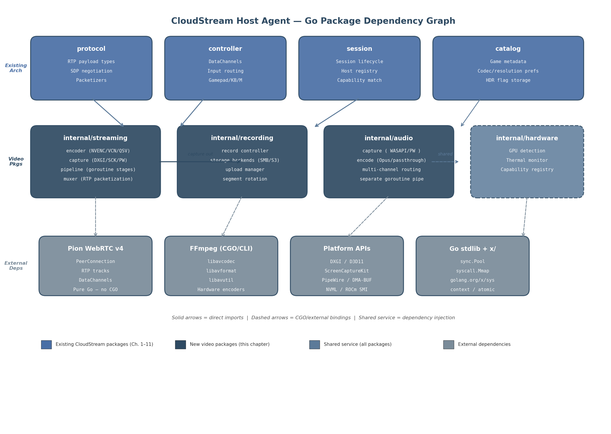

## 12. Go Implementation Architecture & Integration

The preceding eleven chapters established the theoretical and empirical foundation for CloudStream's video pipeline: codec selection (H.264 fallback, HEVC standard, AV1 premium), zero-copy capture architectures, dual-path streaming-plus-recording, Opus audio with passthrough, HDR10+ metadata, SQP congestion control, thermal-aware quality management, and dual-transport networking. This final chapter translates that foundation into executable Go code. It specifies the package structure, defines integration contracts with existing CloudStream services, details memory management strategy using `sync.Pool` and `mmap`, and documents the build and deployment pipeline for cross-platform distribution.

The architecture follows a principle articulated across the research dimensions: Go's goroutine-plus-channel concurrency model maps directly onto video pipeline stage processing, with each stage (capture, encode, packetize, transmit) represented as an independent goroutine and frames passed through buffered channels[^48^][^556^]. This eliminates the complex thread-pool management that C++ pipelines require while preserving the lock-free performance characteristics essential for 60 fps frame delivery.

### 12.1 Package Structure

The video subsystem introduces four new packages under `internal/`, each encapsulating a distinct functional domain. These packages depend on each other through Go interfaces rather than concrete types, enabling testable, platform-swappable implementations. Figure 12.1 illustrates the complete dependency graph, showing how the new video packages integrate with the existing CloudStream architecture (protocol, controller, session service, catalog) and external dependencies (Pion WebRTC, FFmpeg, platform capture APIs).

**Figure 12.1** — Package dependency graph showing four new video packages (`internal/streaming`, `internal/recording`, `internal/audio`, `internal/hardware`) and their integration points with existing CloudStream architecture (top row) and external dependencies (bottom row). Solid arrows indicate direct Go imports; dashed arrows represent CGO or external binary bindings. The `internal/hardware` package is a shared service injected into all video packages.

#### 12.1.1 `internal/streaming`: Core Pipeline

The `internal/streaming` package is the primary integration point between the video pipeline and the rest of the CloudStream system. It contains four sub-packages — `encoder`, `capture`, `pipeline`, and `muxer` — each addressing a distinct stage of the frame journey from screen to network.

The `encoder` sub-package abstracts hardware encoder access behind a `CodecEncoder` interface. Implementations delegate to FFmpeg via `go-astiav` CGO bindings for real-time encoding with hardware acceleration[^183^], or to the `ffmpeg-go` CLI wrapper for simpler transcoding scenarios[^533^]. The encoder supports the three-tier codec strategy established in Chapter 1: H.264 (`h264_nvenc`, `h264_amf`, `h264_qsv`) as universal fallback, HEVC for standard quality, and AV1 for premium tiers[^680^]. Encoder configuration — preset, tuning, bitrate, GOP size — is supplied by the dynamic quality controller (Chapter 9) at runtime through a `QualityController` interface, allowing thermal and network conditions to adjust encoding parameters without restarting the pipeline.

The `capture` sub-package implements the `Capturer` interface with platform-specific backends selected at compile time via Go build tags. Chapter 3 established that zero-copy capture reduces latency by 3–10x compared to CPU readback paths[^629^]. The Windows implementation uses DXGI Desktop Duplication API through a thin CGO wrapper that exports C functions callable from Go[^629^]. The macOS implementation bridges to ScreenCaptureKit through an Objective-C++ shim, as ScreenCaptureKit's async block-based patterns cannot be called directly from CGO[^112^]. The Linux implementation communicates with PipeWire via D-Bus portal using `github.com/godbus/dbus/v5`, receiving DMA-BUF file descriptors for zero-copy frame transfer[^558^]. Each backend returns frames as `[]byte` references obtained from `sync.Pool`, ensuring that the capture stage itself introduces no heap allocations on the hot path.

The `pipeline` sub-package orchestrates goroutine stages using Go's canonical pipeline pattern[^48^]. A typical session launches five goroutines: capture loop, encode loop, transmit loop, RTCP feedback handler, and input event processor. Channels connect these stages with carefully chosen buffer depths: the capture-to-encode channel has capacity 3 (triple-buffering, dropping oldest frames when full), the encode-to-mux channel has capacity 2 (double-buffering), and the mux-to-transmit channel has capacity 1 (single-frame ring buffer). This staged buffering prevents any single slow stage from cascading backpressure to the capture loop, which must maintain frame cadence.

The `muxer` sub-package handles RTP packetization for each codec. H.264 uses non-interleaved mode (RFC 6184), HEVC follows RFC 7798 with VPS/SPS/PPS prefix stripping for non-key frames, and AV1 uses OBU aggregation with temporal-unit-aligned packet boundaries. The muxer registers codec-specific payload types with the protocol layer's RTP infrastructure and writes packetized frames to Pion `TrackLocalStaticSample` instances for transmission.

#### 12.1.2 `internal/recording`: Storage Pipeline

The `internal/recording` package implements the local-first, background-sync storage pattern identified in Chapter 5 as the most reliable recording architecture. It contains three sub-packages: `recordctl` (session lifecycle), `storage` (backend abstraction), and `upload` (background sync).

The `recordctl` sub-package receives encoded frames from the streaming pipeline's encoder output via a fan-out pattern — the same encoded packets feed both the streaming muxer and the recording pipeline simultaneously[^48^]. For crash safety, the recording container uses MKV (Matroska) as the primary write format, with fMP4 as an optional alternative when web streaming compatibility is required. MKV allows progressive writing and remains playable up to the crash point because it does not require a final index atom[^34^]. The `recordctl` sub-package also manages the circular replay buffer: a fixed-size memory ring storing the most recent 30 minutes of encoded packets, enabling instant replay extraction without continuous disk writes.

The `storage` sub-package defines a `StorageBackend` interface with implementations for local filesystem, SMB/CIFS (via `github.com/hirochachacha/go-smb2`[^17^]), S3-compatible object storage (via MinIO Go SDK[^14^]), NFS, WebDAV, and SFTP. Each backend implements `Write([]byte) (int, error)`, `Close() error`, and `Resume(offset int64) error`. The local filesystem backend is always active — even when network storage is configured — ensuring that recording continues during network outages.

The `upload` sub-package runs a background goroutine that drains the local recording directory to configured remote backends. It implements exponential-backoff retry, resume-capable multipart upload for S3 (5 MB minimum part size[^42^]), and bandwidth throttling to prevent upload traffic from competing with streaming traffic. Upload progress is tracked per-file so that interrupted uploads resume from the last acknowledged part.

#### 12.1.3 `internal/audio`: Parallel Pipeline

The `internal/audio` package maintains a completely separate goroutine pipeline from video, as established in Chapter 6. Audio frames are smaller (4 KB for Opus-encoded frames versus 33 MB for 4K NV12 video frames) and arrive at different cadences, so mixing audio and video on the same channel would introduce unnecessary synchronization complexity.

The package contains `capture` (WASAPI on Windows, PulseAudio/PipeWire on Linux, CoreAudio on macOS), `encode` (Opus real-time encoding at 5 ms frame sizes, with passthrough for multi-channel content when the full chain supports it), `channel` (multi-channel routing and downmixing for clients that cannot decode surround formats), and `passthrough` (binary threshold detection: if all links in the chain support the source format, passthrough is enabled; otherwise, stereo downmix occurs). The audio pipeline's encode stage uses `sync.Pool` for 4 KB buffers, eliminating allocation pressure on a path that processes 200 buffers per second at 48 kHz stereo.

#### 12.1.4 `internal/hardware`: Shared Detection Service

The `internal/hardware` package provides GPU detection, thermal monitoring, and capability registry services to all other video packages. It implements the `GPUDetector` interface (Chapter 9) with vendor-specific backends: `go-nvml` for NVIDIA[^1^], `go-rocm-smi` for AMD[^5^], sysfs parsing for Intel, and CGO+IOKit for Apple Silicon. On startup, the hardware detector enumerates all GPUs, queries encoder capabilities and session limits, samples initial temperatures, and publishes a normalized `GPUCapabilities` struct to a `sync.RWMutex`-protected registry.

Other packages read this registry through a read lock — the thermal monitoring goroutine holds the write lock when updating temperature readings. This design ensures that thermal data is always consistent across the streaming encoder (which may reduce quality when approaching throttle temperature), the recording controller (which may pause recording during thermal events), and the session service (which uses thermal state for host routing decisions). The capability registry is also used at startup to validate that the host can support the codecs and resolutions advertised in the catalog metadata.

| Package | Sub-Packages | Key Interfaces | Depends On | Go/CGO Split |
|---------|-------------|----------------|------------|--------------|
| `internal/streaming` | `encoder`, `capture`, `pipeline`, `muxer` | `CodecEncoder`, `Capturer`, `PipelineStage` | `protocol`, `hardware`, Pion, FFmpeg | Go (pipeline) + CGO (capture/encode) |
| `internal/recording` | `recordctl`, `storage`, `upload` | `StorageBackend`, `UploadManager` | `streaming` (encoder output), `hardware` | Pure Go (I/O via stdlib) |
| `internal/audio` | `capture`, `encode`, `channel`, `passthrough` | `AudioCapturer`, `AudioEncoder` | `hardware` (capability query) | Go + CGO (platform audio) |
| `internal/hardware` | `gpu`, `thermal`, `registry` | `GPUDetector`, `CapabilityRegistry` | None (leaf service) | Go + CGO (vendor libraries) |

Table: Summary of the four new video packages, their sub-package decomposition, exported interfaces, upstream dependencies, and the Go/CGO split within each package. The `internal/recording` package is pure Go because all capture and encoding logic resides in `internal/streaming`.

### 12.2 Integration with Existing Architecture

The video packages do not operate in isolation. They register with, receive configuration from, and feed data into four existing CloudStream services: the protocol layer, the controller input system, the session service, and the game catalog. Each integration point has a defined contract.

#### 12.2.1 Protocol Package Integration

The streaming pipeline registers RTP payload types with the protocol layer during session initialization. For each negotiated codec, the `muxer` sub-package calls `protocol.RegisterPayloadType(pt uint8, mimeType string)` to associate a dynamic payload type number with a codec MIME type. Pion's `webrtc.RTPCodecCapability` struct drives this registration: when the session service completes SDP (Session Description Protocol) offer/answer exchange, the selected codec's MIME type (e.g., `webrtc.MimeTypeH264`, `webrtc.MimeTypeVP9`, `webrtc.MimeTypeAV1`) determines which encoder implementation the streaming pipeline instantiates[^308^].

The protocol layer also provides the RTP packetizer infrastructure that the muxer uses. Pion's `rtp/codecs` package contains codec-specific payloader implementations — `H264Payloader`, `H265Payloader`, `AV1Payloader` — that handle NAL unit fragmentation, aggregation, and OBU encapsulation respectively. The streaming muxer configures these payloaders with the MTU discovered during ICE negotiation (typically 1200 bytes for WebRTC to avoid IP fragmentation across TURN relays). Packetized output flows into `webrtc.TrackLocalStaticSample.WriteSample()`, which handles SRTP encryption and transmission[^308^].

#### 12.2.2 Controller Input Integration

Controller input runs on a completely separate goroutine from video, using Pion DataChannels configured in unreliable, unordered mode. This design eliminates head-of-line blocking: a lost video frame does not delay an input packet, and vice versa[^308^]. The controller package creates the DataChannel with `ordered: false, maxRetransmits: 0` — meaning packets may arrive out of order and are never retransmitted. For game input, this is the correct trade-off: a 1 ms input packet that arrives late is worthless, so retransmission only adds latency[^565^].

The input goroutine receives serialized input events (gamepad state, keyboard, mouse) from the DataChannel's `OnMessage` callback, deserializes them, and forwards them to the platform's input injection API (ViGEm on Windows, uinput on Linux, IOKit on macOS). This goroutine does not share memory with the video pipeline — all communication is through the DataChannel, which Pion implements via its pure-Go SCTP stack. Pion's SCTP library achieved 71% faster throughput and 27% lower latency with the RACK (Recent Acknowledgment) extension, making it suitable for high-frequency input forwarding[^565^].

#### 12.2.3 Session Service Integration

When a host agent starts, it calls `session.RegisterHost(capabilities)` to advertise its encoding capabilities to the session service. The capabilities struct includes: supported codecs (H.264/HEVC/AV1), maximum resolution and frame rate, GPU vendor and model, available encoder sessions, current thermal state, and storage backend availability. The session service uses this data for codec-aware routing: a client requesting AV1 4K60 is routed only to hosts with AV1-capable hardware and sufficient thermal headroom.

The thermal-aware quality controller (Chapter 9) publishes state transitions to the session service via a lightweight heartbeat channel. When a host enters the "Thermal Warning" state (approaching 80°C), the session service reduces new session allocation to that host. When it enters "Critical" (83°C+), new allocations stop entirely, and existing sessions may be migrated. This feedback loop ensures that the session service's routing decisions incorporate real-time hardware conditions rather than static capability advertisements.

#### 12.2.4 Catalog Integration

The game catalog stores per-title metadata that the host agent validates against local hardware capabilities at session startup. Each catalog entry includes: recommended codec (H.264/HEVC/AV1), preferred resolution, HDR support flag, and audio channel configuration. Before launching a streaming session, the host agent queries the catalog for the requested game's metadata and checks it against the `GPUCapabilities` registry. If the game recommends AV1 but the host only supports H.264, the session falls back to H.264 automatically. If the game supports HDR but the host GPU's encoder cannot inject HDR10+ metadata (some older NVENC generations lack this), HDR is disabled with a logged explanation.

This pre-validation prevents mid-session failures. A session that discovers at frame 500 that its encoder cannot produce the requested format would require renegotiation or termination. Catalog integration shifts this discovery to session startup, where graceful fallback is possible without user-visible interruption.

### 12.3 Memory Management

Video pipelines are allocation-heavy: a 4K NV12 frame consumes approximately 33 MB (3840 × 2160 × 1.5 bytes per pixel), and at 60 fps the pipeline processes 60 such frames per second. Unchecked allocation would trigger Go's garbage collector frequently, producing stop-the-world pauses that manifest as frame drops or stutter. This section documents the memory management strategy that eliminates GC pressure on the hot path.

#### 12.3.1 `sync.Pool` Strategy

The `sync.Pool` type provides a thread-safe pool of temporarily reusable objects. Unlike a simple free list, `sync.Pool` allows the garbage collector to reclaim pooled objects during GC cycles, preventing unbounded memory growth[^675^]. Benchmarks demonstrate the impact: without `sync.Pool`, frame buffer allocation costs 320 ns/op with 4224 B/op of allocation; with `sync.Pool`, this drops to 85 ns/op with zero allocations[^675^].

The CloudStream pipeline uses three `sync.Pool` instances at different stages. The capture pool provides 33 MB buffers for 4K NV12 raw frames (or appropriately sized buffers for lower resolutions). The pool's `New` function allocates via `make([]byte, width*height*3/2)`, and the capture goroutine returns buffers to the pool after the encode stage copies the frame into encoder memory. The audio pool provides 4 KB buffers for Opus-encoded frames, with a `New` function that allocates `make([]byte, 4096)`. With 256 buffers in circulation at 48 kHz stereo, this pool processes over 200 buffer acquisitions per second without allocation. The encoder output pool provides 8 MB buffers for encoded video frames, sized to hold one frame's worth of H.264/HEVC/AV1 bitstream at the configured bitrate.

Best practices for `sync.Pool` usage apply throughout: buffers are zeroed before being returned to the pool (preventing data leaks between sessions), no pointers to pooled objects are stored long-term, and the pool is used only for high-frequency temporary allocations[^675^]. The pool is cleared when a session terminates by allowing pooled references to go out of scope — the next GC cycle will reclaim them.

#### 12.3.2 Memory Budget

Figure 12.2 illustrates the per-session memory budget and the `sync.Pool` buffer hierarchy. A 4K streaming session consumes approximately 200 MB of GPU memory for frame buffers, encoder surfaces, and the WebRTC jitter buffer. Adding recording increases this by approximately 100 MB for the encode output buffer and circular write cache. The audio pipeline adds approximately 10 MB for Opus encoder state and buffer pools. System overhead (Go runtime, goroutine stacks for approximately 20 goroutines per session) adds a few megabytes. The total of approximately 310 MB per session means that a 16 GB system can feasibly host 3 concurrent 4K streaming-plus-recording sessions with headroom for the OS and game processes.

**Figure 12.2** — (Left) Per-session memory budget breakdown showing GPU memory dominance (~200 MB) for 4K streaming, with recording adding ~100 MB and audio ~10 MB. (Right) `sync.Pool` buffer hierarchy across pipeline stages, with GC pressure indicators. Hot path stages (capture, encode, RTP mux) target zero allocation; warm/cold paths allow minor GC participation.

| Component | 1080p60 | 4K60 Streaming | 4K60 + Recording | Buffer Type | Pool Target |
|-----------|---------|---------------|------------------|-------------|-------------|
| Video capture (NV12) | 3.1 MB | 33 MB | 33 MB | `sync.Pool` (3×) | Zero alloc |
| Encoder surfaces | 8 MB | 32 MB | 32 MB | GPU-managed | N/A |
| Encode output | 2 MB | 8 MB | 16 MB (dual) | `sync.Pool` (2×) | Zero alloc |
| RTP packetization | 0.5 MB | 1.5 MB | 1.5 MB | `sync.Pool` (1×) | Zero alloc |
| WebRTC jitter buffer | 5 MB | 20 MB | 20 MB | Pion internal | Low alloc |
| Recording write cache | N/A | N/A | 50 MB | `mmap` circular | Low alloc |
| Audio (Opus) | 2 MB | 2 MB | 2 MB | `sync.Pool` (256×) | Zero alloc |
| Audio capture (PCM) | 0.4 MB | 0.4 MB | 0.4 MB | `sync.Pool` (64×) | Zero alloc |
| Go runtime overhead | ~2 MB | ~3 MB | ~5 MB | Runtime-managed | N/A |
| **Total (approximate)** | **~23 MB** | **~100 MB** | **~160 MB** | | |

Table: Per-session memory budget breakdown at three operational tiers. GPU memory (encoder surfaces) is not included in the Go heap and is managed by the driver. Values represent Go heap allocations only; actual system memory includes GPU-resident buffers and shared library mappings. The `sync.Pool` target column indicates the allocation strategy for each component.

The budget figures in the table represent Go heap allocations only. GPU-resident memory (encoder surfaces, CUDA textures, Metal buffers) is managed by the driver and not counted against Go's heap limit. A host agent with 16 GB of system RAM and an 8 GB GPU can support three concurrent 4K sessions: approximately 480 MB of Go heap (3 × 160 MB) plus approximately 600 MB of GPU memory (3 × 200 MB), leaving ample headroom for the operating system and game processes. For a 1080p-only host, the Go heap drops to approximately 70 MB per session (23 MB streaming + overhead), enabling 10+ concurrent sessions on a 32 GB server.

#### 12.3.3 `mmap` for Large Buffers

For the recording pipeline's circular write cache, `sync.Pool` is insufficient because buffers persist for the duration of a recording session (potentially hours) and must support random access for segment extraction. The `syscall.Mmap` function maps a file directly into the process's address space, enabling zero-copy access patterns: writes to the mapped memory region are flushed to disk by the kernel's page cache mechanism without explicit `Write` syscalls[^699^].

The recording controller creates a memory-mapped file sized to hold 5 minutes of encoded video at the target bitrate (approximately 1.5 GB for 4K60 HEVC at 40 Mbps). The circular buffer is implemented as a pair of adjacent `mmap` regions mapped from the same underlying file, creating a virtual contiguous buffer that wraps automatically at the boundary. When the buffer fills, the oldest data is overwritten. Segment extraction copies a range from the mmap region to the output file using `io.Copy` from a slice of the mapped memory — no intermediate buffer allocation occurs. `mmap` access is 2–6× faster than `read`/`write` system calls for sequential I/O because it leverages AVX-optimized memory copy paths in the kernel[^699^].

#### 12.3.4 Race Safety

All shared mutable state in the video pipeline follows one of three synchronization patterns. Shared state accessed by multiple goroutines uses channels ("share by communicating") — frames, quality adjustment commands, and session lifecycle events flow through typed channels rather than shared memory. The capability registry in `internal/hardware` uses a `sync.RWMutex`: the thermal monitoring goroutine acquires a write lock when updating GPU state, while encoder and session goroutines acquire read locks when querying capabilities. This pattern supports multiple concurrent readers with minimal contention, as capability reads vastly outnumber updates. Counters and flags use `sync/atomic`: frame counters, timestamp markers, and boolean flags (e.g., `isRecording`) are manipulated with `atomic.AddUint64` and `atomic.StoreUint32` to avoid mutex overhead for simple operations.

No global variables hold per-session state. Each streaming session creates an independent `Pipeline` struct containing its own channel references, pool instances, and goroutine wait groups. This isolation ensures that a panic in one session cannot corrupt another session's state and simplifies cleanup: cancelling the session's `context.Context` and calling `sync.WaitGroup.Wait` guarantees orderly termination of all goroutines.

### 12.4 Build & Deployment

CloudStream's host agent targets three desktop platforms (Windows, macOS, Linux) with heterogeneous GPU ecosystems. The build system must produce optimized binaries for each platform while managing CGO dependencies for platform APIs and FFmpeg.

#### 12.4.1 Cross-Compilation

Pure Go code cross-compiles trivially: `GOOS=windows GOARCH=amd64 go build` produces a Windows binary from any host. However, the video pipeline requires CGO for DXGI capture (Windows), ScreenCaptureKit (macOS), PipeWire D-Bus (Linux, via `godbus/dbus` which is pure Go but the actual DMA-BUF handling may need CGO), FFmpeg bindings (`go-astiav`), and GPU vendor libraries (`go-nvml`, `go-rocm-smi`). Cross-compiling with CGO requires a C cross-compiler for the target platform[^572^].

The build configuration uses three toolchains. For Windows from Linux: `mingw-w64` provides `x86_64-w64-mingw32-gcc` and `x86_64-w64-mingw32-g++`. The build command sets `CGO_ENABLED=1 CC=x86_64-w64-mingw32-gcc CXX=x86_64-w64-mingw32-g++`. For macOS from Linux: `osxcross` builds a cross-compiler from the Xcode SDK, producing a `x86_64-apple-darwin-clang` toolchain. The build command sets `CGO_ENABLED=1 CC=o64-clang CXX=o64-clang++`. For Linux, native GCC is used with musl for static linking: `CC=x86_64-linux-musl-gcc` and linker flags `-linkmode external -extldflags "-static"`, producing a static binary that runs on any Linux distribution without glibc version dependencies[^572^].

| Target | Toolchain | CGO | Key Flags | Binary Type |
|--------|-----------|-----|-----------|-------------|
| Windows amd64 | mingw-w64 | Yes | `CC=x86_64-w64-mingw32-gcc` | Dynamic (bundled FFmpeg) |
| Windows arm64 | mingw-w64 cross | Yes | `CC=aarch64-w64-mingw32-gcc` | Dynamic |
| macOS amd64 | osxcross | Yes | `CC=o64-clang` | Dynamic (Framework linking) |
| macOS arm64 | osxcross | Yes | `CC=oa64-clang` | Dynamic |
| Linux amd64 | musl-cross | Yes | `-linkmode external -extldflags "-static"` | Static |
| Linux arm64 | musl-cross | Yes | Same as amd64 | Static |

Table: Cross-compilation matrix for all supported target platforms. All targets require `CGO_ENABLED=1`. The Linux targets produce fully static binaries; Windows and macOS targets produce dynamic binaries with FFmpeg and GPU libraries bundled or linked at runtime.

#### 12.4.2 Build Tags

Platform-specific capture implementations are selected at compile time using Go build tags. The `capture` package contains a platform-agnostic `Capturer` interface in `capture.go` and platform-specific implementations in tagged files: `capture_windows.go` (with `//go:build windows`) imports the DXGI CGO wrapper, `capture_darwin.go` (with `//go:build darwin`) imports the ScreenCaptureKit bridge, and `capture_linux.go` (with `//go:build linux`) imports the PipeWire portal client. A `factory` function in each tagged file returns the platform-specific `Capturer` implementation. This pattern — interface in untagged file, implementation in tagged files — is repeated across the `encoder` package (vendor-specific encoder selection) and the `hardware` package (vendor-specific GPU detection).

Additional build tags control optional features. The `novideo` tag produces a headless build without capture or encode dependencies for relay-only hosts. The `norecord` tag omits the recording package, reducing binary size by approximately 15%. The `pulseaudio` and `pipewire` tags on Linux select the respective audio capture backend.

#### 12.4.3 FFmpeg Dependency

FFmpeg is the most significant external dependency. Two integration strategies are supported: `go-astiav` CGO bindings for direct library integration, and `ffmpeg-go` CLI wrapping for simpler deployment scenarios[^183^][^533^]. The CGO path provides lower latency (no process spawn overhead) and finer control over codec parameters but complicates cross-compilation. The CLI path requires only that the `ffmpeg` binary exists in `$PATH` at runtime, making deployment simpler but adding approximately 10–50 ms of process spawn latency per encode session.

The build system produces a static FFmpeg build for each target platform, bundling only the required components: `libavcodec` (with NVENC, AMF, QSV, VAAPI encoders), `libavformat` (with MKV, MP4, MPEG-TS muxers), `libavutil`, `libswscale`, and `libswresample`. This static build is embedded into the release package alongside the host agent binary. At startup, the host agent verifies FFmpeg availability by executing `ffmpeg -version` and parsing the output to confirm that required encoders and muxers are present. Version pinning ensures reproducibility: the build system records the FFmpeg commit hash and the host agent rejects versions with known incompatibilities.

#### 12.4.4 Deployment

The host agent deploys as a single binary with embedded static assets (HTML templates for the local web UI, default configuration files, and platform-specific FFmpeg builds). The `embed` package (Go 1.16+) includes these assets at compile time, eliminating external file dependencies at runtime. Binary sizes range from approximately 45 MB (Linux static, no recording) to 85 MB (Windows with bundled FFmpeg).

For Linux hosts, a systemd service template manages the host agent lifecycle. The template runs the agent as an unprivileged user with `Restart=always`, exposes a Unix domain socket for local control, and restricts capabilities using systemd's `CapabilityBoundingSet` (removing `CAP_SYS_ADMIN` and other unnecessary privileges). For containerized deployments, a minimal Dockerfile based on `scratch` (for pure Go components) or `alpine` (for CGO components) produces an image of approximately 50 MB. Docker is optional — the static Linux binary runs without any container runtime on any Linux distribution with kernel 4.19 or later.

For Windows hosts, the binary installs as a service using `golang.org/x/sys/windows/svc`, registering with the Service Control Manager for automatic startup. The Windows installer (built with WiX) bundles the Visual C++ redistributable, the FFmpeg DLL set, and the NVIDIA/AMD GPU detection libraries. For macOS, the binary is packaged as an app bundle with a launchd plist for background operation, code-signed and notarized for Gatekeeper compatibility.

The deployment artifacts are produced by a CI pipeline that runs cross-compilation for all six targets (Windows amd64/arm64, macOS amd64/arm64, Linux amd64/arm64) on every tagged release. The pipeline executes in approximately 8 minutes using GitHub Actions with cached Docker images for the cross-compilation toolchains. Each release includes the binary, SHA-256 checksums, a changelog entry listing the FFmpeg version and supported GPU driver versions, and migration notes for configuration format changes.
