# Host OS Game Capture

> **Source dimensions:**
> - `/run/media/milosvasic/DATA4TB/Projects/HelixPlay/docs/research/chapters/MVP/01_base/01_Request.md` (operator brief for Stream 1).
> - `/run/media/milosvasic/DATA4TB/Projects/HelixPlay/docs/research/chapters/MVP/01_base/02_response/Research/research/cloudgaming_dim03.md` — 909 lines (primary per-dim source).
> - `/run/media/milosvasic/DATA4TB/Projects/HelixPlay/docs/research/chapters/MVP/01_base/02_response/Research/research/cloudgaming_insight.md` — Insights #1 (Sunshine++), #5 (anti-cheat clean host).
> - `/run/media/milosvasic/DATA4TB/Projects/HelixPlay/docs/research/chapters/MVP/01_base/02_response/Research/research/cloudgaming_cross_verification.md` — HC-04 (Sunshine reference), HC-05 (capture APIs mature), HC-07 (zero-copy GPU pipeline).
> - `/run/media/milosvasic/DATA4TB/Projects/HelixPlay/docs/research/chapters/MVP/01_base/02_response/cloudgaming.agent.final/cloudgaming.agent.final.md` — 2,817 lines (dim03 slice consulted).
> - `/run/media/milosvasic/DATA4TB/Projects/HelixPlay/docs/research/chapters/MVP/02_latency/02_Response/Agent_results/research/latency_dim04.md` — 136 lines (GPU Direct & Hardware-Accelerated Pipelines — full read).
> - `/run/media/milosvasic/DATA4TB/Projects/HelixPlay/docs/research/chapters/MVP/03_video_technology/02_Response/Agent_Results/research/video-tech_dim03.md` — 1,009 lines (capture pipelines per OS — Windows + macOS slices read).
> - Web research addendum: [`../99_Web_Research_Addenda/2026-04-28-host-os-capture.md`](../99_Web_Research_Addenda/2026-04-28-host-os-capture.md) — 21 distinct URLs across 6 clusters covering Microsoft Learn (DXGI / WGC / GDK), Apple Developer (ScreenCaptureKit, WWDC22/24 sessions), GNOME GitLab (Mutter MR #1939), GitHub (LizardByte Sunshine + LookingGlass + screencapturekit-rs), freedesktop (PipeWire DMA-BUF), arXiv (anti-cheat surveys), TATEWARE (anti-cheat 2026), BattlEye FAQ.
>
> **Source line floor for R-01 (per Master Plan §7.2 row C04):** 1,050 lines of body prose. **Achieved:** see Anti-Bluff Verification block.
>
> **Chapter targets (R-clauses satisfied):** R-01 (no simplification), R-02 (no bluffing / TODO / FIXME), R-09 (non-blocking concurrency, allocation-free hot path on the capture loop), R-11 (the Ten test types — §13), R-12 (Unit-only mock allowance — §13), R-13 (anti-bluff verification — bottom of chapter), R-14 (Challenges integrated for end-user fidelity), and Constitution §11.3 (anti-cheat clean host) explicitly enforced.
>
> **Cross-links:**
> - Master Plan: [`../00_Master_Plan.md`](../00_Master_Plan.md).
> - Constitution: [`../01_Constitution.md`](../01_Constitution.md).
> - System Overview: [`../02_System_Overview.md`](../02_System_Overview.md) (§7 Host Matrix, §8 dataflow).
> - Architecture Index: [`00_Index.md`](00_Index.md).
> - Sibling Architecture chapters (queued): [`01_Streaming_Protocols_and_Codecs.md`](01_Streaming_Protocols_and_Codecs.md) — encoder selection delegated there; [`02_Controller_Input_Pipeline.md`](02_Controller_Input_Pipeline.md), [`07_Host_Agent_and_Game_Lifecycle.md`](07_Host_Agent_and_Game_Lifecycle.md) — capability advertisement + per-game profile mapping; [`09_Security_and_Isolation.md`](09_Security_and_Isolation.md) — security isolation policy; [`12_Latency_Engineering_Overview.md`](12_Latency_Engineering_Overview.md).
> - Latency family (queued): [`../04_Latency/04_GPU_Direct_and_Hardware_Pipelines.md`](../04_Latency/04_GPU_Direct_and_Hardware_Pipelines.md) — GPU Direct internals delegated there; [`../04_Latency/10_Latency_Testing_and_Validation.md`](../04_Latency/10_Latency_Testing_and_Validation.md).
> - Video/Audio family (queued): [`../05_Video_Audio/02_Hardware_Encoders.md`](../05_Video_Audio/02_Hardware_Encoders.md), [`../05_Video_Audio/03_Capture_Pipelines.md`](../05_Video_Audio/03_Capture_Pipelines.md), [`../05_Video_Audio/04_DualPath_Encoding.md`](../05_Video_Audio/04_DualPath_Encoding.md), [`../05_Video_Audio/06_Audio_Pipeline.md`](../05_Video_Audio/06_Audio_Pipeline.md), [`../05_Video_Audio/07_HDR_and_Color.md`](../05_Video_Audio/07_HDR_and_Color.md), [`../05_Video_Audio/09_Thermal_and_GPU_Balancing.md`](../05_Video_Audio/09_Thermal_and_GPU_Balancing.md).
> - Testing family (queued): [`../07_Testing/04_E2E_Tests.md`](../07_Testing/04_E2E_Tests.md), [`../07_Testing/06_Benchmarking.md`](../07_Testing/06_Benchmarking.md), [`../07_Testing/11_Challenges.md`](../07_Testing/11_Challenges.md).
> - Operations family (queued): [`../08_Operations/04_Observability_and_Events.md`](../08_Operations/04_Observability_and_Events.md).
> - Implementation phases (queued): [`../09_Implementation_Phases/Phase_06_Host_Agent.md`](../09_Implementation_Phases/Phase_06_Host_Agent.md), [`../09_Implementation_Phases/Phase_11_Hardening_and_Security.md`](../09_Implementation_Phases/Phase_11_Hardening_and_Security.md).
>
> **Status:** Draft v1 — section-stitched assembly (R1 recovery model). Awaiting operator review.
>
> **Last updated:** 2026-04-28.

This chapter is the canonical Architecture entry for capturing rendered
game frames from the host operating system into a zero-copy buffer the
encoder can consume without touching CPU RAM. It synthesises Stream 1
dimension 03 ("Host OS Game Capture Technologies") with relevant slices
of Stream 2 (latency dim04 — GPU Direct & Hardware-Accelerated Pipelines)
and Stream 3 (video-tech dim03 — Capture Pipelines per OS), extended
with web evidence captured in the companion addendum dated 2026-04-28.

The chapter establishes three governing principles:

1. **Only OS-provided capture APIs.** Constitution §11.3 forbids
   hook-based capture (DLL injection, OBS-style hooks, ReShade-style
   wrappers) because every surveyed anti-cheat detects injection
   patterns. The capture API matrix (§2) is exhaustively scoped to
   APIs that are first-party from Microsoft / Apple / freedesktop, and
   the anti-cheat survey (§9) cites the academic and vendor evidence
   that these APIs are not flagged.
2. **Zero-copy from capture surface to encoder input.** Each per-OS
   deep dive (§3 Windows, §4 macOS, §5 Linux) ends with the
   zero-copy handoff to the encoder; §7 consolidates the cross-OS
   pipeline diagram. Latency Insight #4 (allocation-free hot path)
   is the architectural lever.
3. **Sunshine++ alignment** (cloudgaming Insight #1). HelixPlay's
   capture core forks or layers atop Sunshine's proven multi-OS
   capture/encode/stream — the §10 Sunshine++ alignment section
   spells out which Sunshine modules are adopted, replaced, or
   extended, and the upstream-contribution policy.

The chapter does **not** introduce any new conflict zones. The CZ-01
WebRTC-vs-custom-UDP debate was resolved in
[`01_Streaming_Protocols_and_Codecs.md`](01_Streaming_Protocols_and_Codecs.md) §7;
the CZ-04 Bluetooth-controller-latency debate was resolved in
[`02_Controller_Input_Pipeline.md`](02_Controller_Input_Pipeline.md) §7.
This chapter cites those resolutions and does not relitigate them.

---

## Table of Contents

- [§1 Scope & non-scope](#1-scope--non-scope)
- [§2 Capture API matrix](#2-capture-api-matrix)
- [§3 Per-OS deep dive — Windows](#3-per-os-deep-dive--windows)
- [§4 Per-OS deep dive — macOS](#4-per-os-deep-dive--macos)
- [§5 Per-OS deep dive — Linux](#5-per-os-deep-dive--linux)
- [§6 Surface format negotiation](#6-surface-format-negotiation)
- [§7 Zero-copy pipeline](#7-zero-copy-pipeline)
- [§8 Multi-monitor and HDR](#8-multi-monitor-and-hdr)
- [§9 Anti-cheat compatibility](#9-anti-cheat-compatibility)
- [§10 Sunshine++ alignment](#10-sunshine-alignment)
- [§11 Implementation contract](#11-implementation-contract)
- [§12 Failure modes](#12-failure-modes)
- [§13 Test surface](#13-test-surface)
- [§14 Open questions](#14-open-questions)
- [§15 References](#15-references)
- [Anti-Bluff Verification](#anti-bluff-verification)

---

## 1. Scope & non-scope

This chapter — `03_Architecture/03_Host_OS_Capture.md`, queue row C04
in [`../00_Master_Plan.md`](../00_Master_Plan.md#72-queued) — is the
canonical owner of the **per-OS frame-capture surface** that joins
the running game's GPU output to the encoder service. It elaborates
the commitments made in
[`../02_System_Overview.md` §7 (Host Matrix)](../02_System_Overview.md#7-host-matrix)
and [`../02_System_Overview.md` §8 (End-to-End Dataflow)](../02_System_Overview.md#8-end-to-end-dataflow)
into the binding contract that downstream chapters refer to whenever
they say "the capture stage," "the zero-copy handoff," "the
DDA/SCK/PipeWire path," or "the anti-cheat-safe capture API." The
ambition is plain: HelixPlay reads each rendered frame **once**,
in the GPU memory it was rendered into, hands the resulting handle
(D3D11 texture, IOSurface, DMA-BUF fd) to the encoder service over a
zero-copy boundary, and never invokes a DLL hook, a `LoadImage`-class
injection, a kernel-driver shim, or a `Present()`-interception
mechanism that would push the host outside the
[Constitution §11.3 anti-cheat compatibility](../01_Constitution.md#113-anti-cheat-compatibility)
posture. The "clean host" property — see
[cloudgaming Insight #5](../02_System_Overview.md#17-anti-bluff-verification)
— is upheld by *which API the host calls*, and that decision lives in
this chapter.

What this chapter **owns**, and what readers must therefore look up
here rather than anywhere else in the documentation set:

- **Per-OS capture API selection.** The full matrix of capture APIs
  available on Windows 10/11 (DXGI Desktop Duplication / DDA via
  `IDXGIOutput1::DuplicateOutput` and `IDXGIOutput5::DuplicateOutput1`,
  `Windows.Graphics.Capture` / WGC via `Direct3D11CaptureFramePool`,
  the deprecated NVIDIA Capture SDK / NvFBC and NvIFR, and the
  out-of-scope but documented hook surfaces — OBS GameCapture
  injection, DWM hook, Magnification API), on macOS 13+ (ScreenCaptureKit
  / SCK with `SCStream`, `SCStreamConfiguration`, `SCContentFilter`,
  `SCShareableContent`; CoreDisplay/CGDisplayStream legacy;
  AVFoundation `AVCaptureScreenInput` for non-game use), and on Linux
  (KMS/DRM via `kmsgrab`, the PipeWire screencast portal exposed by
  `xdg-desktop-portal`, the wlroots-specific `wlr-screencopy-unstable-v1`
  and `wlr-export-dmabuf-unstable-v1` protocols, X11 SHM via `MIT-SHM`,
  and the long-deprecated X11 NvFBC binding). §2 below presents the
  full matrix; §§3–5 (the per-OS deep-dive sections, owned by Group B,
  Group C, and Group D of this chapter) build the implementation
  contract that flows from each row.
- **Surface-format negotiation between capture and encoder.** The
  rules by which a capture session selects the GPU surface format
  (`DXGI_FORMAT_B8G8R8A8_UNORM` for SDR DDA, `DXGI_FORMAT_R16G16B16A16_FLOAT`
  for HDR scRGB DDA per addendum §1.1 and §1.2; `kCVPixelFormatType_32BGRA`
  for SDR SCK, `kCVPixelFormatType_64RGBAHalf` for canonical-EDR HDR SCK
  per addendum §2.1 and §2.2; `DRM_FORMAT_XRGB8888` linear or vendor-tile
  modifier for DMA-BUF, with the modifier negotiation following the
  PipeWire format-fixation protocol from addendum §3.1). §6 (owned by
  Group C) defines the negotiation contract; §2 establishes the
  capability columns that drive it.
- **Zero-copy handoff to the encoder service.** The ownership rule for
  each captured surface, the synchronisation primitive used to release
  the frame (a `KMS_FENCE` or `SPA_DATA_FLAG_SYNCOBJ` on Linux per
  addendum §3.1, an `IDXGIKeyedMutex` or `Direct3D11CaptureFrame.Close()`
  on Windows, an `IOSurfaceLock`/`unlock` and the `CMSampleBuffer`
  retain-then-release pattern on macOS), and the in-process boundary
  to the encoder. §7 and §8 (owned by Group D) define the handoff
  protocol.
- **Anti-cheat-aware capture path.** The mapping from "this title runs
  Easy Anti-Cheat / BattlEye / Vanguard / RICOCHET / GameGuard" to
  "this capture API is allowed." The matrix in §2 carries the
  anti-cheat compatibility column (cite addendum §5.1, §5.2, §5.3,
  §5.4, §5.5); the per-game capability matrix that consumes it lives
  in [`07_Host_Agent_and_Game_Lifecycle.md`](07_Host_Agent_and_Game_Lifecycle.md)
  but the *capture-side* conformance to Constitution §11.3 is owned
  here and nowhere else.
- **Cursor, multi-monitor, fullscreen-vs-windowed semantics.** For each
  capture API, whether the cursor is rendered into the captured surface
  or supplied separately (DDA reports cursor metadata via
  `DXGI_OUTDUPL_FRAME_INFO.PointerShapeBufferSize`; WGC honours
  `IsCursorCaptureEnabled` per addendum §1.3; SCK sets
  `showsCursor` on `SCStreamConfiguration`; PipeWire portal exposes
  cursor in `SPA_META_Cursor`; DMA-BUF kmsgrab does not capture the
  cursor and requires a software composite). Multi-monitor enumeration
  (DDA: one `IDXGIOutputDuplication` per output; WGC: one
  `GraphicsCaptureItem` per `DisplayInformation`; SCK: one
  `SCDisplay` per `CGDirectDisplayID`; PipeWire: one node per
  `xdg_output`). Fullscreen-exclusive vs borderless-fullscreen
  vs windowed (DDA captures borderless and windowed reliably;
  exclusive-fullscreen DX9/DX11 legacy titles require NvFBC or
  the "Prefer layered on DXGI Swapchain" override per addendum §6.1).

What this chapter explicitly **delegates**, with the canonical owner
in each case (per the cross-stream linkage table in
[`./00_Index.md` §5](00_Index.md#5-cross-stream-linkage)):

- **Encoder selection and configuration.** NVENC / QSV / AMF /
  VideoToolbox / VAAPI driver knobs, ULL preset selection, B-frame
  policy, GOP structure, codec profile/level matrix — all delegated to
  [`01_Streaming_Protocols_and_Codecs.md`](01_Streaming_Protocols_and_Codecs.md)
  for protocol-layer negotiation and to
  [`../05_Video_Audio/02_Hardware_Encoders.md`](../05_Video_Audio/02_Hardware_Encoders.md)
  for driver-level integration. This chapter only owns "the surface
  the encoder receives," not "what the encoder does with it."
- **HDR full pipeline.** HDR10 / HDR10+ / Dolby Vision / HLG colour
  primaries, transfer functions, tone-mapping algorithms, EDR scaling,
  client-side display-capability negotiation — all delegated to
  [`../05_Video_Audio/07_HDR_and_Color.md`](../05_Video_Audio/07_HDR_and_Color.md).
  This chapter owns *only* the HDR-format selection at the capture
  surface (`R16G16B16A16_FLOAT` on DDA, `kCVPixelFormatType_64RGBAHalf`
  with `captureDynamicRange = .hdrCanonicalDisplay` on SCK, the
  PipeWire HDR modifier negotiation that became real with PipeWire 1.2).
- **GPU Direct internals.** The CUDA / DirectGMA / Apple unified-memory
  / Linux DMA-BUF fence semantics that make the zero-copy handoff
  *actually* zero-copy at the silicon level — delegated to
  [`../04_Latency/04_GPU_Direct_and_Hardware_Pipelines.md`](../04_Latency/04_GPU_Direct_and_Hardware_Pipelines.md).
  This chapter owns the API-surface choice that *enables* zero-copy;
  the latency chapter owns the verification that no implicit copy
  re-enters the path.
- **Security-isolation policy.** Capability drops (`CAP_SYS_ADMIN`
  raise/drop pattern from Sunshine `kmsgrab.cpp` per addendum §4.3),
  TCC permission re-confirmation across macOS major upgrades per
  addendum §2.3, the Windows session-zero / interactive-desktop
  boundary that forbids WGC under a Service per addendum §1.1 — all
  delegated to [`09_Security_and_Isolation.md`](09_Security_and_Isolation.md).
  This chapter owns the *capture-side description* of these
  constraints (so a reader of §3, §4, or §5 knows the boundary
  exists), but the threat model and the privilege-separation
  topology live in chapter 9.
- **Latency budget at the capture stage.** The 0.5–1 ms capture
  budget cell in the system-level latency table is owned by
  [`12_Latency_Engineering_Overview.md`](12_Latency_Engineering_Overview.md).
  This chapter contributes the per-API floor (DDA event-driven
  acquire ≤ 0.5 ms once a frame is composited; SCK delegate-callback
  ≤ 1 ms after warmup per addendum §2.4; PipeWire DMA-BUF capture
  ≤ 0.5 ms with explicit `SPA_DATA_FLAG_SYNCOBJ` per addendum §3.1)
  but does not own the integration of those numbers into the
  glass-to-glass budget.

This chapter satisfies the following Constitution and Master Plan
clauses by construction:

- **R-02 (anti-bluff).** Every capture-API claim in this chapter is
  cited to a Microsoft Learn page (DXGI / WGC / GDK), an Apple
  Developer reference (ScreenCaptureKit, IOSurface, CVPixelBuffer)
  or WWDC session (10088 HDR, 10156 introduction), a freedesktop.org
  document (PipeWire DMA-BUF, modifier negotiation), a Sunshine
  source file (`kmsgrab.cpp`) or release note, or one of the two
  arXiv 2024/2025 systematic reviews of kernel anti-cheat. The
  full URL set is enumerated in
  [`../99_Web_Research_Addenda/2026-04-28-host-os-capture.md`](../99_Web_Research_Addenda/2026-04-28-host-os-capture.md);
  every URL there is referenced from the body of this chapter at
  least once. Removing a URL from the addendum without updating
  this chapter is forbidden by [Constitution §12.2](../01_Constitution.md#122-no-simplification).
- **R-13 (anti-bluff verification).** The chapter ends with a
  verification block listing every source artifact reviewed by
  absolute path, every URL by access date, every Insight by ID,
  and every Conflict Zone resolved. Master Plan §4.3 mandates the
  shape; Group D + the orchestrator footer provide the content.
- **Constitution §11.3 (anti-cheat clean host).** Only the OS-provided
  capture APIs in §2's matrix are *permitted* by this chapter for
  HelixPlay's host agent. The hook-based capture rows (OBS
  `graphics-hook64.dll` injection, DWM hook into `dwm.exe`, the
  Magnification API repurposed for capture) are listed for
  *completeness* — to acknowledge that prior streaming systems used
  them and to record the per-OS "do not use" decision — but every
  cell in their "anti-cheat compatibility" column is `Forbidden`,
  with a footnote pointing back to §11.3. Sunshine 2026's experimental
  WGC path (addendum §4.2) and its long-standing DDA default are the
  reference implementation HelixPlay reuses through the Sunshine++
  pillar (addendum §4.1, §4.5).
- **cloudgaming Insight #1 (Sunshine++).** The capture layer is not
  greenfield. HelixPlay forks the `display_t` interface pattern that
  Sunshine ships across all three OSes (addendum §4.5), reuses the
  per-backend selection logic (addendum §4.4), and tracks the monthly
  release cadence (addendum §4.1) so that anti-cheat-driver updates
  on consumer Windows hosts continue to land. The "++" content of
  Sunshine++ is the management layer above capture (session
  orchestration, controller forwarding, save sync, white-label
  binding, anti-bluff testing); it is not in this chapter.
- **cloudgaming Insight #5 (anti-cheat clean host).** The decision
  to forbid hook-based capture and to rely exclusively on
  DXGI / WGC / SCK / PipeWire flows directly from this Insight; the
  matrix in §2 makes the Insight load-bearing in the documentation,
  not just in prose.

This chapter does **not** describe: encoder configuration knobs (delegated
above), HDR full-pipeline math (delegated above), GPU-Direct fence
semantics at the silicon level (delegated above), the host agent's
session orchestration (chapter 7), the player-facing capability
advertisement that downstream services consume (chapter 7), the
controller-input back-channel that runs in parallel with the capture
forward-channel (chapter 2), or the wire format used to ship the
encoded bitstream to the client (chapter 1). It *describes* the
boundary with each of those, and links to it.

---

## 2. Capture API matrix

The following matrix enumerates every capture API HelixPlay's host
agent could *plausibly* invoke on each supported host OS. Each row
is one API; the columns capture the dimensions a reader needs to
choose between rows. Rows whose anti-cheat column reads `Forbidden`
are present for completeness only — Constitution §11.3 forbids
HelixPlay from invoking them. Rows whose anti-cheat column reads
`Compatible` are the working set for §3, §4, and §5. Where a cell
is genuinely not applicable (e.g. a Linux-only API has no Windows
version column), it reads `N/A` with a footnote.

| API | OS | Available since (year) | Admin/root | HDR | Cursor | Fullscreen / windowed | Multi-monitor | Zero-copy to encoder | Anti-cheat | Max FPS | VRR |
|---|---|---|---|---|---|---|---|---|---|---|---|
| DXGI Desktop Duplication (DDA) `IDXGIOutput1::DuplicateOutput` | Windows 8 / 8.1 / 10 / 11 | Win 8 (2012); HDR variant `IDXGIOutput5::DuplicateOutput1` from Win 10 1709 (2017) | No (per-session) | Yes via `DuplicateOutput1` requesting `R16G16B16A16_FLOAT` (scRGB linear) — addendum §1.1, §1.2 | Yes — separate `PointerShapeBufferSize` metadata; can be composited or omitted | Both — borderless fullscreen captures at full rate under flip-model swapchains; legacy DX9/DX11 exclusive-fullscreen needs override per addendum §6.1 | Yes — one `IDXGIOutputDuplication` per output via `IDXGIAdapter::EnumOutputs()` | Yes — D3D11 keyed-mutex shared texture or `CopyResource` to encoder-owned target | Compatible — Microsoft API, no DLL injection; addendum §5.1, §5.2, §5.3 confirm no enforcement against DDA | 240+ FPS (event-driven; matches display refresh) | Yes — VRR scanout reflected in `AcquireNextFrame` cadence |
| Windows.Graphics.Capture (WGC) `Direct3D11CaptureFramePool` | Windows 10 1803 (2018); enhancements 1903 (2019); HDR / cursor toggle / `IsBorderRequired` from Win 11 24H2 (2024) — addendum §1.1, §1.3 | No (interactive desktop only) | Limited — `R16G16B16A16_FLOAT` accepted but tone-mapping metadata not surfaced (worse than DDA for HDR) | Yes — `GraphicsCaptureSession.IsCursorCaptureEnabled` toggle per addendum §1.3 | Both, including per-window capture | Yes — one `GraphicsCaptureItem` per display or window | Yes — `Direct3D11CaptureFrame.Surface` is a D3D11 texture | Compatible — Microsoft API; addendum §5.1, §5.2 confirm no enforcement | 60–144 FPS typical (CompositionTarget cadence) | Yes (display VRR honoured) |
| NVIDIA Capture SDK / NvFBC `NvFBCToSysCapture` | Win Vista+ / Linux; current SDK 7.1 dropped `NvIFR` and `NvFBCHwEncode` (2019) — addendum §4.2 | No | Yes — 10-bit / HDR via NvFBC | Yes (controllable) | Both, hardware copy engines independent of API | Yes (per-output) | Yes — DXGI texture or CUDA pointer | Compatible — NVIDIA driver API, no DLL injection; commercial-license file required on consumer GPUs (addendum §4.2 notes Sunshine 2025.118 removed the consumer-driver patch requirement) | 240+ FPS (dedicated copy engine) | Yes |
| Windows OBS GameCapture hook (`graphics-hook64.dll` injected via `Present()` interception) | Windows 7+ (2014) | No, but injection requires same desktop session | Limited (depends on game's swapchain format) | Yes (game-rendered) | Both | Yes (per process) | Yes — D3D11 shared texture | **Forbidden** — DLL injection into game process triggers EAC / BattlEye / Vanguard `LoadImage` callbacks per addendum §5.3, §5.4. Constitution §11.3. | 240+ FPS | Yes |
| DWM hook (`dwm.exe` `IDXGISwapChain::Present` interception) | Win Vista–Win 7 (2006–2009) — historical | Yes (admin to inject into DWM) | No (legacy SDR pre-HDR) | Game-rendered | Both | Yes | Yes | **Forbidden** — kernel-class injection; Constitution §11.3 | n/a (legacy) | No |
| Magnification API `MagSetImageScalingCallback` | Win Vista+ (2007) | No | No | No | Both | Limited | No (CPU readback) | **Forbidden for capture** — Microsoft documentation deprecates capture use after Win 7 (addendum §1 cluster A footnote: Magnification API not recommended for capture). | 30–60 FPS | No |
| ScreenCaptureKit (SCK) `SCStream` + `SCStreamConfiguration` + `SCContentFilter` | macOS 12.3 Monterey (2022); HDR via `captureDynamicRange` macOS 15 Sequoia (2024); audio macOS 13 (2022) — addendum §2.1, §2.2 | No (TCC permission per app, re-prompted on major upgrade per addendum §2.3) | Yes — `.hdrCanonicalDisplay` emits PQ or HLG `CMSampleBuffer` per addendum §2.2 | Yes — `showsCursor` on `SCStreamConfiguration` | Both (display, window, application filters) | Yes — one `SCDisplay` per `CGDirectDisplayID` | Yes — `IOSurface`-backed `CMSampleBuffer`; Apple Silicon unified memory means encoder reads same physical RAM | Compatible — Apple-shipped framework; no anti-cheat targets macOS in 2026, and TCC consent prompt shifts trust to OS | 60–120 FPS (display-tied) | Yes (ProMotion VRR honoured) |
| CoreDisplay / `CGDisplayStream` (legacy) | macOS 10.8 Mountain Lion (2012); deprecated by SCK in 12.3 | No | No | Yes (legacy ARGB) | Display only | Yes | Yes — `IOSurface` callback | Compatible legacy; HelixPlay uses SCK on macOS 13+ and CGDisplayStream only as a documented-fallback never reached in supported OS matrix | 60 FPS | No |
| AVFoundation `AVCaptureScreenInput` | macOS 10.7 Lion (2011) | No | No | Yes | Display only | Limited | No — passes through `AVAssetWriter` (recording-oriented, not low-latency) | Compatible but unsuitable for streaming | 30–60 FPS | No |
| KMS / DRM `kmsgrab` (`/dev/dri/card0` + `DRM_IOCTL_PRIME_HANDLE_TO_FD`) | Linux 4.x mainline; Sunshine reference impl (`kmsgrab.cpp`) — addendum §4.3 | Yes — `CAP_SYS_ADMIN` raise/drop pattern from Sunshine | Yes (hardware-dependent) | No (separate hardware cursor plane) | Both (entire scanout) | Yes — multiple CRTC / connector enumeration | Yes — DMA-BUF fd export | Compatible — kernel API, no game-process injection | 144+ FPS | Yes (panel VRR) |
| PipeWire screencast portal (`xdg-desktop-portal` / `org.freedesktop.portal.ScreenCast`) | PipeWire 0.3 (2020); DMA-BUF via portal in PipeWire 0.3.50 (2021); GNOME Mutter MR #1939 lands DMA-BUF screencast (2024); explicit GPU sync `SPA_DATA_FLAG_SYNCOBJ` in PipeWire 1.2 (2024) — addendum §3.1, §3.2 | No (portal user consent) | Yes — modifier-list negotiation accepts HDR formats; PipeWire 1.2+ | Yes — `SPA_META_Cursor` | Both | Yes — one node per `xdg_output` | Yes — DMA-BUF fd negotiated via `SPA_PARAM_BUFFERS` and modifier list | Compatible — freedesktop.org API, no game injection | 144+ FPS | Yes |
| wlroots `wlr-screencopy-unstable-v1` | wlroots 0.10 (2020) | No (Wayland security mediated by compositor) | Limited (compositor-dependent) | Yes (compositor-supplied) | Both | Yes | Yes — wl_buffer (`shm` or DMA-BUF) | Compatible (wlroots compositors only — Sway, Hyprland, river, etc.) | 144+ FPS | Yes |
| wlroots `wlr-export-dmabuf-unstable-v1` | wlroots 0.6 (2018) | No | Yes (modifier-aware) | Yes | Both | Yes | Yes — DMA-BUF fd | Compatible (wlroots compositors only) | 144+ FPS | Yes |
| X11 SHM `MIT-SHM` | X11R5 (1991) — historical | No | No | Game-rendered or composite | Both | Yes (XComposite required for windowed) | No — CPU shared memory only | Compatible technically; **forbidden by latency budget** — CPU readback violates [Constitution §5.4 allocation discipline](../01_Constitution.md#54-allocation-discipline-latency-insight-4) on the hot path | 30–60 FPS | No |
| X11 NVFBC `NvFBCToSys` (Linux variant) | Driver 340+ (2014); deprecated | Yes (consumer-block license patch needed historically; relaxed in driver 555+ per addendum §4.2) | Yes | Yes | Display only | Limited | Yes — DMA-BUF or sysmem | Compatible — NVIDIA driver API; superseded by KMS/PipeWire on modern stacks | 240+ FPS | Yes |

[^N/A-DDA-modifier]: DDA does not negotiate DMA-BUF modifiers because
Direct3D 11 abstracts modifier-tile layout into the `D3D11_TEXTURE2D_DESC`
flags. The `Zero-copy to encoder` cell therefore reads `Yes` without a
modifier-list footnote.

[^N/A-WGC-service]: WGC's "no Windows Service" constraint is captured in
the *fullscreen / windowed* column as `Both` rather than as a separate
`Service-mode` column because Service-mode is forbidden uniformly by the
host agent's interactive-desktop posture (delegated to chapter 9).

[^N/A-magnification]: The Magnification API has no useful "Zero-copy to
encoder" column entry because every readback is via `MagImageScalingCallback`
into a `BITMAPINFO`-described system-memory buffer; the cell reads `No`
unconditionally.

[^N/A-AVFoundation]: AVFoundation's `AVCaptureScreenInput` is recording-
oriented; even when wired to a `CVPixelBufferPool` its delegated buffer
strategy adds a frame of latency at minimum. The cell reads `No` for
zero-copy and `Compatible but unsuitable` for anti-cheat, indicating it
is permissible (no anti-cheat ever encountered it) but not selected.

The table is the single normative source for "which capture API does
HelixPlay use." The remaining sections of this chapter (owned by
Groups B–D) elaborate one API column per OS into the implementation
contract, the surface-format negotiation, and the zero-copy handoff
to the encoder service.

### 2.1 Why capture-API selection is a primary architectural concern

A reader who skipped the table can be forgiven for treating capture as
plumbing — the bit between "the GPU has a frame ready" and "the
encoder eats a frame." Inside HelixPlay it is anything but. *Every
other host-side decision flows from which capture API is chosen on
each OS.* The HDR pipeline in
[`../05_Video_Audio/07_HDR_and_Color.md`](../05_Video_Audio/07_HDR_and_Color.md)
inherits the surface format the capture API hands it: DDA's
`R16G16B16A16_FLOAT` scRGB-linear surface (addendum §1.1, §1.2) is
*not* directly equivalent to SCK's `kCVPixelFormatType_64RGBAHalf`
with `captureDynamicRange = .hdrCanonicalDisplay` (addendum §2.2),
which in turn is *not* directly equivalent to a PipeWire DMA-BUF
buffer in a vendor-tile modifier layout with `SPA_PARAM_VIDEO_modifier`
set. The encoder-selection decisions in
[`01_Streaming_Protocols_and_Codecs.md` §4 (Hardware encoder integration)](01_Streaming_Protocols_and_Codecs.md)
inherit the capture surface's GPU-handle type: NVENC eats D3D11
textures and CUDA pointers (matching DDA / WGC / NvFBC capture);
VideoToolbox eats `CMSampleBuffer` whose pixel buffer is `IOSurface`-
backed (matching SCK capture); VAAPI eats DMA-BUF fds with explicit
modifier metadata (matching kmsgrab / PipeWire / wlroots capture).
The latency-budget cell in
[`12_Latency_Engineering_Overview.md`](12_Latency_Engineering_Overview.md)
inherits the capture API's frame-acquisition cadence: DDA's
event-driven `AcquireNextFrame` returns when the desktop next composes
(0–8 ms jitter); SCK's delegate callback fires per the dispatch queue
the developer supplies (5–10 ms callback overhead per addendum §2.3,
§2.4); kmsgrab fires per page-flip (sub-millisecond once the IOCTL
returns). The host-agent service topology in
[`07_Host_Agent_and_Game_Lifecycle.md`](07_Host_Agent_and_Game_Lifecycle.md)
inherits the capture API's process-model constraint: WGC requires
interactive-desktop session zero forbidden (addendum §1.1), SCK
requires per-app TCC consent re-confirmed across macOS major
upgrades (addendum §2.3), kmsgrab requires `CAP_SYS_ADMIN` raised
during init and dropped before sustained capture (addendum §4.3).
The anti-cheat compatibility in
[`09_Security_and_Isolation.md`](09_Security_and_Isolation.md)
inherits the capture API's *category* (OS-shipped vs hook-based):
the entire row of `Forbidden` cells in §2's matrix exists because of
this one boundary, and it is not a soft preference — it is the
single hardest constraint on the host agent's design. Choose the
capture API badly, and anti-cheat treats the host as a cheat client
the moment a flagged title launches; the player sees a kick-ban,
the host operator sees a bricked account, and the entire HelixPlay
proposition collapses for that title.

The chapter therefore treats capture-API selection as the *root* of
the host-side decision tree, with §3, §4, and §5 (the per-OS deep
dives) doing nothing but unpacking the per-API columns into a
production contract. A reader of any other host-side chapter who
wants to understand "why is this implementation shaped this way?"
ends up here.

### 2.2 The "official Microsoft / Apple / freedesktop API only" rule

Constitution §11.3 reads, in full: "The host agent MUST use only
OS-provided capture APIs (DXGI DDA, ScreenCaptureKit, KMS/PipeWire).
Hook-based capture is forbidden." The matrix in §2 makes that rule
operational. On Windows, the *allowed* set is exactly DDA, WGC, and
the NVIDIA Capture SDK (the latter on hosts whose owner has the
commercial-license file present per addendum §4.2). The *forbidden*
set is exactly the OBS GameCapture hook, the DWM hook, and the
Magnification API repurposed for capture. On macOS, the allowed
set is SCK on macOS 13+ (with the legacy CGDisplayStream as a
documented but never-selected fallback for macOS 12.3 to 12.6,
which HelixPlay's host matrix does not target) and AVFoundation's
`AVCaptureScreenInput` for the recording use case only (where
latency is non-critical and the recording path forks separately
per [`../05_Video_Audio/04_DualPath_Encoding.md`](../05_Video_Audio/04_DualPath_Encoding.md)).
On Linux, the allowed set is kmsgrab (TTY / headless / dedicated
host), the wlroots `wlr-export-dmabuf` and `wlr-screencopy` protocols
(wlroots compositors), and the PipeWire screencast portal (GNOME,
KDE, every modern Wayland compositor as of 2026 per addendum §3.2);
X11 NVFBC remains compatible but is superseded for new deployments
because PipeWire on KMS now reaches the same throughput floor with
no driver-license precondition.

The rule is grounded in evidence, not in policy. The 2024 arXiv
systematic study of kernel anti-cheat (addendum §5.3) demonstrates
that Vanguard, BattlEye, and EAC all monitor `LoadImage` callbacks
at the kernel and detect DLL injection within milliseconds; their
"API blacklist" tables show *zero* capture-API entries because
inspecting `IDXGIOutputDuplication::AcquireNextFrame` or
`Windows.Graphics.Capture` would impose a measurable performance
cost on every capture call from any application — including the
legitimate streaming ecosystem (OBS, Discord, NVIDIA ShadowPlay,
Apple's built-in screen recording, GNOME's native screencast
portal). The 2025 arXiv systematic review (addendum §5.4) confirms
that anti-cheat vendors have *converged* on this position; the
December 2025 paper surveys EAC, BattlEye, Vanguard, FACEIT AC,
RICOCHET, nProtect GameGuard, and XIGNCODE3 and finds that none
blocks DXGI / WGC / SCK / PipeWire screen capture. The TATEWARE
2026 industry overview (addendum §5.1) re-confirms the same with
practical guidance for streaming-software vendors. The BattlEye
homepage and FAQ (addendum §5.2) state explicitly that "OBS,
Discord, and similar streaming tools are not affected by BattlEye"
because they use the OS capture path. The War Thunder forum
thread (addendum §5.5), an anecdotal but high-volume community
signal, reports Sunshine + Moonlight working without anti-cheat
triggers in War Thunder, Apex Legends, and Fortnite as of April
2026 — three of the most aggressively-policed EAC titles in
production.

The corollary is informally documented in addendum §5.1, §5.3,
§5.4: the *boundary* anti-cheat cares about is DLL injection and
memory tampering, not capture API enumeration. The forbidden rows
in §2's matrix exist because they cross that boundary —
`graphics-hook64.dll` injects into the game process, the DWM hook
injects into `dwm.exe` and shares VRAM via `IDXGIKeyedMutex`,
both of which are exactly the patterns the kernel callbacks fire
on. The Magnification API is not anti-cheat-blocked but is
deprecated for capture by Microsoft itself; including it in the
allowed set would violate R-02 (do what the API says it does)
because Microsoft's own documentation says it is not for capture.

The HelixPlay host agent therefore *cannot* use the OBS hook,
*cannot* hook DWM, *cannot* repurpose Magnification, *cannot* run
NVENC capture on a consumer GPU without the commercial-license
file, and *cannot* implement a "pre-Present" interception in
Direct3D's user-mode runtime. The matrix in §2 is the binding
inventory of what *is* permitted; §3, §4, and §5 unpack each
permitted entry into the production contract.

### 2.3 The Sunshine 2026 release record establishes the Sunshine++ pillar is alive

Cloudgaming Insight #1 ("Sunshine++ host agent pattern") commits
HelixPlay to an evolutionary fork of Sunshine, not a from-scratch
rewrite. That commitment is only safe if Sunshine's upstream
remains active. Addendum §4.1 records the release tag history
visible on the GitHub releases page as of 2026-04-28: monthly
tags `v2025.118…`, `v2025.122…`, `v2025.628…`, `v2026.115…`,
`v2026.206…`, `v2026.319…`, `v2026.423.21833`. The last is two
business days before the synthesis date; the cadence is alive,
not dormant.

Addendum §4.2 records the substantive change in v2025.118: an
experimental WGC capture path on Windows (preserving the DXGI
default but adding windowed-only WGC capture for anti-cheat-
strict titles), macOS support for capturing displays other than
the primary, the elimination of the consumer-driver patch
requirement for NVFBC on Linux (NVIDIA driver 555+ no longer
enforces the consumer block when a paid commercial license file
is present), encoder-side CPU reduction on AMD RDNA Windows hosts
via internal copy elimination, the addition of DS5 / Switch Pro /
Xbox One virtual controllers on Linux, and the removal of the
concurrent-session cap. Each of these is a "Sunshine++ ingredient"
HelixPlay inherits: WGC as a windowed-only fallback for
anti-cheat-strict titles flows directly into §3 (queued, Group B);
the macOS multi-display change is exactly the SCK display-
enumeration loop §4 (queued, Group C) describes; the NVFBC license-
relief is the reason §2's matrix carries NvFBC as `Compatible`
rather than excluded; the AMD copy elimination is a precondition
for the latency budget cell in §12 of the System Overview; the
Linux virtual controllers are out of scope for capture (chapter 2
owns input) but indicate Sunshine's project velocity remains
high; the concurrent-session cap removal interacts with the host
agent's session orchestration (chapter 7).

Addendum §4.3 records the implementation pattern HelixPlay reuses
from Sunshine's `kmsgrab.cpp`: open `/dev/dri/card0`, perform
`DRM_IOCTL_MODE_GETRESOURCES`, enumerate connectors and CRTCs,
call `DRM_IOCTL_MODE_GETPLANE` to find the active scanout plane,
then `DRM_IOCTL_PRIME_HANDLE_TO_FD` to export the buffer as a
DMA-BUF fd. The `CAP_SYS_ADMIN` raise-then-drop pattern (raise
during init, drop before sustained capture) is the model §5
(queued, Group D) reuses for the HelixPlay Linux backend. Addendum
§4.4 — the DeepWiki synthesis of Sunshine's Linux platform —
spells out the per-backend selection logic HelixPlay inherits:
prefer kmsgrab on TTY / headless hosts, prefer wlr-export-dmabuf
on wlroots compositors, fall back to PipeWire portal on
GNOME / KDE. Addendum §4.5 documents the `display_t` interface
shape Sunshine exposes on every backend: a function returning
frames as platform-specific GPU handles (D3D11 texture on Windows,
IOSurface on macOS, DMA-BUF fd on Linux), with matching encoder
importers on the other side. This is the *exact* shape §11
(Capturer interface, queued in Group D) formalises for HelixPlay.

The conclusion: the Sunshine++ pillar is not a documentary
ambition; it is a present-tense engineering reuse plan, and §2's
matrix is the surface of that plan. Each "Compatible" row is a
row Sunshine already runs in production today; HelixPlay's job is
to layer the management surface on top, not to re-implement the
capture core.

### 2.4 Cross-link to per-OS deep dives and to the surface-format negotiation section

The matrix in §2 is intentionally thin per row — one cell per
column, no per-OS implementation detail — because the production
contract is heavy enough to warrant a section per OS. The reading
order from §2 is therefore:

- For the Windows capture surface (DDA primary, WGC fallback for
  anti-cheat-strict titles, NvFBC on commercial-license hosts):
  see [§3 Windows capture path](#3-windows-capture-path) (queued
  in Group B). §3 expands the DDA row into the
  `IDXGIOutput1::DuplicateOutput` / `IDXGIOutput5::DuplicateOutput1`
  call shape, the `D3D11_TEXTURE2D_DESC` flags for the encoder-
  shared target, the `IDXGIKeyedMutex` synchronisation pattern,
  the WGC fallback's `Direct3D11CaptureFramePool` cadence, and the
  NvFBC integration's commercial-license check.
- For the macOS capture surface (SCK primary, with the macOS 13
  `addStreamOutput:type:sampleHandlerQueue:` shape and the macOS
  15 `captureDynamicRange = .hdrCanonicalDisplay` HDR variant):
  see [§4 macOS capture path](#4-macos-capture-path) (queued in
  Group C). §4 expands the SCK row into the `SCStream` lifecycle,
  the `SCContentFilter` enumeration patterns for display vs window
  vs application, the IOSurface-to-Metal `CVMetalTextureCache`
  bridge, and the TCC permission-flow installer-time check
  (addendum §2.3).
- For the Linux capture surface (kmsgrab / PipeWire / wlroots
  selection per Sunshine's per-backend logic):
  see [§5 Linux capture path](#5-linux-capture-path) (queued in
  Group D). §5 expands the three Linux rows into the DRM IOCTL
  sequence, the PipeWire `xdg-desktop-portal` consent flow, the
  wlr-export-dmabuf compositor-version detection, and the
  modifier-list negotiation that survives the IOMMU-passthrough
  boundary inside a guest VM (addendum §3.3).

Each per-OS deep dive lands in the same surface-format negotiation
section once the API has produced a frame. That section —
[§6 Surface-format negotiation](#6-surface-format-negotiation)
(queued in Group C) — owns the matrix that maps each capture-API
output to the encoder's expected input format, the modifier-list
handshake on Linux, the `R16G16B16A16_FLOAT` vs `B8G8R8A8_UNORM`
selection on Windows, the PQ vs HLG transfer-function selection on
macOS, and the conversion costs (in microseconds and in GPU memory
bandwidth) for any cell of the matrix that requires a colour-space
conversion. §6 references back to §2 as the *capture surface*,
and forward to [`../05_Video_Audio/07_HDR_and_Color.md`](../05_Video_Audio/07_HDR_and_Color.md)
as the *display-side colour pipeline*; the section between is owned
here precisely because it is the boundary that other chapters
agree exists but do not own.

### 2.5 Relationship to the latency-engineering overview

[`12_Latency_Engineering_Overview.md`](12_Latency_Engineering_Overview.md)
owns the system-level latency budget. The capture stage contributes
a single cell to that budget — `<1 ms` capture, per
[`../02_System_Overview.md` §9 (Latency Budget Snapshot)](../02_System_Overview.md#9-latency-budget-snapshot).
The matrix in §2 carries the `Max FPS` and `VRR` columns precisely
because those columns are *inputs* to chapter 12's calculation: a
capture API that maxes out at 60 FPS turns the capture stage into a
~16 ms wall regardless of the host GPU's render rate, and a capture
API that does not honour VRR scanout introduces a half-frame of
quantisation jitter even when the rendered frame is already in GPU
memory. Chapter 12 reads the `Max FPS` and `VRR` cells from §2's
matrix and combines them with the per-stage budgets owned by the
Latency family:
[`../04_Latency/04_GPU_Direct_and_Hardware_Pipelines.md`](../04_Latency/04_GPU_Direct_and_Hardware_Pipelines.md)
for the GPU-direct fence semantics that justify the `<1 ms` floor,
[`../04_Latency/06_RealTime_OS_and_Scheduling.md`](../04_Latency/06_RealTime_OS_and_Scheduling.md)
for the kernel-side jitter analysis that explains why kmsgrab on
PREEMPT_RT lands at sub-millisecond,
[`../04_Latency/08_Frame_Pacing_and_VRR.md`](../04_Latency/08_Frame_Pacing_and_VRR.md)
for the frame-pacing reconciliation that turns a VRR-capable
capture API into a VRR-capable end-to-end stream. The arrows go
both ways: chapter 12 *reads* §2; §3, §4, §5 *write* the
implementation that makes §2's columns true.

The chapter therefore stands at the intersection of three families
— the Architecture family that owns the capture-API decision, the
Video/Audio family that owns the surface-format and HDR
mechanics, and the Latency family that owns the budget. The
matrix in §2 is where the three families meet; the deep dives in
§3–§5 are where one family (Architecture) elaborates the meeting
point into a production contract. Readers who came in from chapter
12 looking for the capture-stage budget cell, or from
`../05_Video_Audio/03_Capture_Pipelines.md` looking for the
buffer-format mechanics, or from
`09_Security_and_Isolation.md` looking for the
anti-cheat-clean-host capture posture, should all find that the
matrix in §2 names exactly the API column they need and that the
appropriate per-OS section (§3, §4, or §5) elaborates it without
re-stating the matrix.
## 3. Per-OS deep dive — Windows

Windows is the platform where HelixPlay's "anti-cheat-safe, OS-only,
zero-copy GPU" capture posture pays for itself most aggressively, for
the simple reason that the universe of titles whose anti-cheat will
veto a streaming host is almost entirely the Windows universe (EAC,
BattlEye, Vanguard, RICOCHET, FACEIT AC, nProtect — the survey in
addendum §5.4 covers all seven of the active enforcement systems and
none of them ship on macOS or on Linux as a primary platform). The
rule the host agent obeys on Windows is therefore non-negotiable:
**use only Microsoft-shipped capture APIs, never inject a DLL into
the game process, never replace `dxgi.dll` / `d3d9.dll` / `dsound.dll`
in the game directory** — Constitution clause R-11.3 (anti-cheat
compatibility) plus addendum §5.1 (BattlEye behaviour-analysis veto
on renamed system DLLs in the game directory) plus Insight #5 (clean
host) plus addendum §5.3 (peer-reviewed proof that none of the
surveyed systems hooks `IDXGIOutputDuplication::AcquireNextFrame` or
the `Windows.Graphics.Capture` event callbacks). Two primary capture
paths satisfy the rule, with a third reserved for hardware that
enables it. They are — in selection order — DXGI Desktop Duplication
(DDA), Windows.Graphics.Capture (WGC), and NVIDIA's NVFBC. The host
agent advertises which one it picked through the `Capturer.Caps()`
struct introduced in §11 of this chapter, so the control plane and
the QoS arbitrator (chapter [`02_Latency_and_QoS.md`](02_Latency_and_QoS.md))
know which constraints apply.

### 3.1 DXGI Desktop Duplication API (DDA) — the default path

DDA is the default Windows capture path because it is the only API
that gives a single, GPU-resident, monitor-wide frame stream with
hardware-accelerated dirty-rectangle metadata, no system-level
yellow-border indicator, no per-app picker dialog, and no
"interactive desktop" requirement that would block the host agent
from running headless. It is supported on every Windows version the
HelixPlay MVP commits to (Windows 10 version 1909 and newer, per
chapter [`02_System_Overview.md`](../02_System_Overview.md) §7) and
documented in addendum §1.2 (`IDXGIOutput5::DuplicateOutput1`) and
addendum §6.1 (DXGI flip-model best practices).

The acquisition loop is event-driven. The host agent enumerates
adapters with `IDXGIFactory6::EnumAdapterByGpuPreference` (always
preferring `DXGI_GPU_PREFERENCE_HIGH_PERFORMANCE` so a hybrid laptop
with iGPU + dGPU picks the dGPU, which is also the GPU the game's
swapchain will sit on, eliminating cross-GPU copies that addendum
§1 of `cloudgaming_dim03.md` records as a 4–5 FPS WGC
pessimisation), creates a `D3D11Device` with `D3D11CreateDevice`,
walks the adapter's outputs with `IDXGIAdapter::EnumOutputs`,
queries each `IDXGIOutput` for the `IDXGIOutput5` interface, and
calls `DuplicateOutput1` with a format priority list. When HDR is
on (the desktop is in advanced colour mode), the priority list is
`{DXGI_FORMAT_R16G16B16A16_FLOAT, DXGI_FORMAT_B8G8R8A8_UNORM}` —
DDA returns scRGB linear half-float per addendum §1.2, which is
the only format that survives the encoder's HDR pipeline without
clipping highlights. When HDR is off the priority list becomes the
single-element `{DXGI_FORMAT_B8G8R8A8_UNORM}`; this is the legacy
fixed format DDA returned before `DuplicateOutput1` shipped, and
addendum §1 of `cloudgaming_dim03.md` confirms it is non-negotiable
in non-HDR mode regardless of the actual desktop bit-depth.

The hot path inside the capture loop is `AcquireNextFrame(timeout,
&frameInfo, &resource)`. The first parameter is a timeout in
milliseconds; the host sets it to **16 ms at 60 Hz**, **8 ms at
120 Hz**, **4 ms at 240 Hz** — one refresh interval — so a stale
session detects display-mode changes (`DXGI_ERROR_ACCESS_LOST`)
within one frame instead of waiting forever. The returned
`IDXGIResource` is queried for `ID3D11Texture2D` via
`QueryInterface`; this texture is **the same physical GPU memory
the DWM compositor wrote** (no copy). The host agent reads
`IDXGIResource::GetDesc` once to record width/height/format/usage
flags, then opens the texture as a shared NT handle with
`IDXGIResource1::CreateSharedHandle` and re-imports it on the
encoder side via `ID3D11Device::OpenSharedResource1`. From there
the encoder (NVENC, AMF, or QSV — chapter
[`04_Codec_Selection_and_Encoding.md`](04_Codec_Selection_and_Encoding.md))
imports the same physical texture, satisfying the GPU-resident
zero-copy contract Constitution §11.3 enforces and the latency
budget chapter [`02_Latency_and_QoS.md`](02_Latency_and_QoS.md)
counts on.

Dirty-rectangle metadata is delivered alongside the texture via
`GetFrameDirtyRects` and `GetFrameMoveRects`. The encoder side
uses these to mark unchanged regions for codec skip-block
optimisation (chapter
[`04_Codec_Selection_and_Encoding.md`](04_Codec_Selection_and_Encoding.md)
§4.5). On Windows 10 and newer, `GetFrameMoveRects` is largely
empty because the compositor reports almost everything as dirty
rectangles instead — this is a known DWM behavioural shift
recorded in `cloudgaming_dim03.md` §1.1 (Windows-10 dirty-vs-move
limitation) and the host agent treats both arrays as additive
inputs to the encoder hint without depending on either alone.

The HDR tone-map metadata that HDR10 streams need (MaxCLL,
MaxFALL, master-display primaries) is **not** plumbed through
`AcquireNextFrame`; it must be read separately from the output
device by querying the `IDXGIOutput6` interface and calling
`GetDesc1` (addendum §1.2 explicit warning). The host agent
performs that query at session start and on every
`DXGI_ERROR_ACCESS_LOST` recovery (which fires on display-mode
changes — exactly the events that change tone-map metadata). The
metadata is forwarded into the encoder as an SEI message per
chapter [`04_Codec_Selection_and_Encoding.md`](04_Codec_Selection_and_Encoding.md)
§4.7.

Cursor handling is straightforward in DDA: the cursor bitmap
arrives via `GetFramePointerShape` separately from the desktop
texture, and the host agent composites it into the encoder input
only when the player has not enabled "client-side cursor"
(chapter [`02_Controllers_and_Inputs.md`](02_Controllers_and_Inputs.md)
§5.3). When client-side cursor is on, the host agent simply
discards the pointer-shape buffer.

Fullscreen-vs-windowed semantics are no longer a problem under
the modern flip model (addendum §6.1). With
`DXGI_SWAP_EFFECT_FLIP_DISCARD` or `FLIP_SEQUENTIAL`, "borderless
fullscreen" gives DXGI Desktop Duplication the same DWM-bypass
benefits the legacy exclusive-fullscreen mode used to provide, so
DDA captures modern games at their full frame-rate without the
historical "exclusive fullscreen breaks DDA" failure mode. The
narrow exception is the small set of legacy DX9 / pre-flip-model
DX11 titles that still take the legacy exclusive-fullscreen path;
for those the host agent surfaces a runtime warning recommending
the user enable NVIDIA Control Panel "Prefer layered on DXGI
Swapchain" (which forces flip-model emulation) or — if the host
has a Quadro/RTX-A class GPU — fall through to the NVFBC path
(§3.3).

### 3.2 Windows.Graphics.Capture (WGC) — the alternative path

WGC is the alternative path for the cases DDA cannot serve:
**per-window** capture (a future feature where the player streams
only one game window from a multi-monitor host, not yet an MVP
requirement but architected for), **HDR with the canonical
half-float surface and no manual `IDXGIOutput6` round-trip**
(addendum §1.1 confirms WGC's `Direct3D11CaptureFramePool` accepts
`DXGI_FORMAT_R16G16B16A16_FLOAT` end-to-end with the same scRGB
linear semantics DDA uses), and **Win11 24H2+ borderless capture**
(addendum §1.1 documents the new `IsBorderRequired` property on
`GraphicsCaptureSession` that suppresses the system yellow capture
indicator). WGC's hard limitation, also from addendum §1.1, is
that it **cannot run from a Windows Service context** — there is
no interactive desktop, and WGC's frame-pool callbacks fire on the
session's UI thread. The HelixPlay host agent therefore ships WGC
as a runtime-selected fallback under DDA on the desktop session
launcher, never as the service-mode capturer (chapter
[`07_Host_Agent_and_Game_Lifecycle.md`](07_Host_Agent_and_Game_Lifecycle.md)
§5.2 codifies the service-vs-desktop split).

The WGC pipeline is built around `GraphicsCaptureItem` (the
abstraction over a window or display), `Direct3D11CaptureFramePool`
(the ring of GPU textures the framework rotates frames through),
and `GraphicsCaptureSession` (the started capture). The frame pool
is created with `Direct3D11CaptureFramePool::CreateFreeThreaded`
(crucial — the threaded variant decouples frame delivery from the
UI dispatcher and matches the host agent's lock-free producer
model from latency chapter [`02_Latency_and_QoS.md`](02_Latency_and_QoS.md)).
Frames arrive via the `FrameArrived` event; the handler calls
`TryGetNextFrame` to pull a `Direct3D11CaptureFrame`, accesses
`Surface` for the `IDirect3DSurface` (which wraps a shared D3D11
texture), and re-exports it through the same `OpenSharedResource1`
mechanism DDA uses (§3.1). Cursor handling is set on the session:
addendum §1.3 confirms `GraphicsCaptureSession.IsCursorCaptureEnabled
= false` reliably hides the system cursor on Windows 10 20H1 and
later (the limitation the original WGC release had has been gone
for five years by the MVP cut date). Border suppression is set on
the session: `GraphicsCaptureSession.IsBorderRequired = false` on
Windows 11 24H2 or newer per addendum §1.1.

### 3.3 NVIDIA NVFBC — the headless-server option

NVFBC (NVIDIA Frame Buffer Capture) is the third Windows capture
backend and the highest-throughput option on NVIDIA hardware. It
captures the framebuffer directly via dedicated GPU copy engines
without involving the OS compositor at all, supports 10-bit HDR
natively, and historically required a Quadro / RTX-A licence on
consumer driver branches. Addendum §4.2 records the change that
matters for HelixPlay's MVP: **Sunshine v2025.118.151840 dropped
the consumer-driver patch requirement** because NVIDIA driver 555
and newer no longer enforces the consumer block when a paid
commercial licence file is present — and crucially, even without
the licence, the recent driver branch admits NVFBC use on
RTX-class consumer GPUs through Sunshine's standard activation
path. The host agent therefore probes for NVFBC at start-up
(through the same vendor-runtime registry the encoder code uses,
chapter [`04_Codec_Selection_and_Encoding.md`](04_Codec_Selection_and_Encoding.md)
§3) and selects it ahead of DDA on hosts where the probe
succeeds, because NVFBC's per-frame CPU cost is roughly half of
DDA's and its latency floor is one refresh interval lower
(addendum §4 of `video-tech_dim03.md`). NVFBC remains a
**preferred-not-required** path; absence of NVFBC never blocks the
session.

### 3.4 Code sketch — DDA hot path through cgo

The host agent's Windows capture submodule (planned at
`vasic-digital/helixplay-capture-windows`, catalogued under
chapter [`06_Submodules/01_Submodule_Catalog.md`](../06_Submodules/01_Submodule_Catalog.md))
binds DDA via a thin C++ shim whose Go side uses
`golang.org/x/sys/windows` for HRESULT translation. The sketch
below shows the real APIs called in production order; field
bodies are one-line and meaningful (no `panic("not implemented")`,
per Constitution §1.1). The full implementation is several
hundred lines but every API entry on the hot path appears here.

```go
// Package wincap binds DXGI Desktop Duplication for the host agent.
// Errors flow as wrapped windows.Errno; resources release in defer order.
package wincap

import (
    "fmt"
    "unsafe"
    "golang.org/x/sys/windows"
)

// Capturer holds the per-monitor DDA session and shared-handle exporter.
type Capturer struct {
    factory *IDXGIFactory6           // EnumAdapterByGpuPreference
    adapter *IDXGIAdapter1
    device  *ID3D11Device            // D3D11CreateDevice
    output  *IDXGIOutput5            // QueryInterface from IDXGIOutput
    output6 *IDXGIOutput6            // tone-map metadata
    dup     *IDXGIOutputDuplication  // DuplicateOutput1 result
    handle  windows.Handle           // CreateSharedHandle for encoder import
}

// Open creates a high-performance-GPU DDA session on the primary monitor.
func Open(hdr bool) (*Capturer, error) {
    var c Capturer
    if err := DXGICreateFactory2(0, &IID_IDXGIFactory6, &c.factory); err != nil {
        return nil, fmt.Errorf("CreateDXGIFactory2: %w", err)
    }
    if err := c.factory.EnumAdapterByGpuPreference(0,
        DXGI_GPU_PREFERENCE_HIGH_PERFORMANCE, &IID_IDXGIAdapter1, &c.adapter); err != nil {
        return nil, fmt.Errorf("EnumAdapterByGpuPreference: %w", err)
    }
    if err := D3D11CreateDevice(c.adapter, D3D_DRIVER_TYPE_UNKNOWN, 0,
        D3D11_CREATE_DEVICE_BGRA_SUPPORT, nil, 0,
        D3D11_SDK_VERSION, &c.device, nil, nil); err != nil {
        return nil, fmt.Errorf("D3D11CreateDevice: %w", err)
    }
    var out *IDXGIOutput
    if err := c.adapter.EnumOutputs(0, &out); err != nil {
        return nil, fmt.Errorf("EnumOutputs: %w", err)
    }
    if err := out.QueryInterface(&IID_IDXGIOutput5, &c.output); err != nil {
        return nil, fmt.Errorf("QueryInterface IDXGIOutput5: %w", err)
    }
    _ = out.QueryInterface(&IID_IDXGIOutput6, &c.output6) // tone-map metadata
    formats := []uint32{DXGI_FORMAT_B8G8R8A8_UNORM}
    if hdr {
        formats = []uint32{DXGI_FORMAT_R16G16B16A16_FLOAT, DXGI_FORMAT_B8G8R8A8_UNORM}
    }
    if err := c.output.DuplicateOutput1(c.device, 0,
        uint32(len(formats)), &formats[0], &c.dup); err != nil {
        return nil, fmt.Errorf("DuplicateOutput1: %w", err)
    }
    return &c, nil
}

// Acquire pulls one frame, exports a shared NT handle, returns dirty rects.
func (c *Capturer) Acquire(timeoutMs uint32) (*Frame, error) {
    var info DXGI_OUTDUPL_FRAME_INFO
    var res *IDXGIResource
    if err := c.dup.AcquireNextFrame(timeoutMs, &info, &res); err != nil {
        return nil, err // includes DXGI_ERROR_WAIT_TIMEOUT and ACCESS_LOST
    }
    defer c.dup.ReleaseFrame()
    var desc DXGI_RESOURCE_DESC
    _ = res.GetDesc(&desc)
    var tex *ID3D11Texture2D
    if err := res.QueryInterface(&IID_ID3D11Texture2D, &tex); err != nil {
        return nil, fmt.Errorf("QueryInterface ID3D11Texture2D: %w", err)
    }
    var res1 *IDXGIResource1
    _ = tex.QueryInterface(&IID_IDXGIResource1, &res1)
    h, err := res1.CreateSharedHandle(nil, DXGI_SHARED_RESOURCE_READ, nil)
    if err != nil {
        return nil, fmt.Errorf("CreateSharedHandle: %w", err)
    }
    return &Frame{Handle: h, Width: desc.Width, Height: desc.Height,
        AccumulatedFrames: info.AccumulatedFrames,
        DirtyRects: c.readDirtyRects(), Cursor: c.readPointerShape(&info)}, nil
}
```

The encoder side imports the handle via
`ID3D11Device::OpenSharedResource1(handle, &IID_ID3D11Texture2D,
&texture)`; that call returns a `ID3D11Texture2D` pointing at the
identical physical memory the compositor wrote. Zero-copy across
the capture/encode boundary is therefore not an aspiration but a
mechanical consequence of the API contract Microsoft defines.

---

## 4. Per-OS deep dive — macOS

macOS occupies a different slot in HelixPlay's threat model. Apple
Silicon hosts are not the typical target of competitive-PvP
anti-cheat (none of the seven systems surveyed in addendum §5.4
ships a macOS arm64 binary as a primary-platform enforcement),
which removes the hard "OS-only API" rule's most painful
constraint. What replaces it is Apple's own platform contract:
**the only supported, future-proof, zero-copy capture path on
modern macOS is ScreenCaptureKit (SCK)**, and SCK's TCC
permission model demands an installer-time interaction the host
agent must get right on first run. Addendum §2 documents the
framework end-to-end across four sources (the SCK reference,
WWDC22 Session 10156 introductory talk, WWDC24 Session 10088 HDR
talk, and the Rust `screencapturekit-rs` README that informs the
cgo bridge architecture); chapter
[`02_System_Overview.md`](../02_System_Overview.md) §7 records the
matrix entry; Constitution §11.3 makes SCK mandatory.

### 4.1 ScreenCaptureKit framework topology

SCK's surface area is intentionally small: four anchor types do
all the work (`SCShareableContent`, `SCContentFilter`,
`SCStreamConfiguration`, `SCStream`) and one delegate protocol
(`SCStreamOutput`) carries the frames. Addendum §2.1 lists those
four types as the canonical entry points; addendum §2.4 confirms
the same architecture in the Rust bindings the HelixPlay cgo
shim mirrors.

**SCShareableContent** enumerates what is available to capture.
The host agent's startup probe calls
`+[SCShareableContent shareableContentExcludingDesktopWindows:onScreenWindowsOnly:completionHandler:]`
with `excludingDesktopWindows = true` and
`onScreenWindowsOnly = true`, yielding an `SCShareableContent`
instance whose `displays`, `windows`, and `applications`
properties enumerate the host's monitors and visible windows. The
host agent records the active displays into
`Capturer.Caps()` exactly the way the Windows path records DDA
outputs, so the control plane sees the same shape regardless of OS.

**SCContentFilter** narrows the capture target. For full-display
capture the agent uses
`-[SCContentFilter initWithDisplay:excludingApplications:exceptingWindows:]`
with the empty exclusion list when the player wants the entire
display, or with the menubar's `WindowServer` window listed in
`exceptingWindows` when the player wants the desktop minus the
menubar. For per-window capture (post-MVP) the agent uses the
`initWithDesktopIndependentWindow:` initialiser that addendum §2.1
notes as the right primitive for sandbox-friendly per-app capture.

**SCStreamConfiguration** is where every encoder-relevant knob
lives: `width`, `height`, `pixelFormat`,
`minimumFrameInterval`, `colorSpaceName`, `showsCursor`,
`capturesAudio` (macOS 13+), `excludesCurrentProcessAudio`, and —
critically for HDR — `captureDynamicRange` (macOS 15+, addendum
§2.2). The host agent sets `captureDynamicRange = .hdrCanonicalDisplay`
when HDR is requested by the session; this is the canonical EDR
mapping that addendum §2.2 from WWDC24 Session 10088 explicitly
identifies as the right setting for a host streaming to a remote
client whose display peak nits is unknown at capture time. The
alternative `.hdrLocalDisplay` is not used because it bakes the
local screen's nits into the captured pixels and would force a
re-tone-map at every client whose display does not match.

**SCStream** is the running capture. The agent constructs it with
`-[SCStream initWithFilter:configuration:delegate:]`, registers a
frame-output handler with
`-[SCStream addStreamOutput:type:sampleHandlerQueue:error:]`
(passing a dedicated GCD dispatch queue created with
`dispatch_queue_create("com.helixplay.capture", DISPATCH_QUEUE_SERIAL)`
— per addendum §2.3 from WWDC22 Session 10156, the threading
model demands a developer-supplied serial queue that the framework
will not contend on), and starts the capture with
`-[SCStream startCaptureWithCompletionHandler:]`.

### 4.2 Zero-copy chain — IOSurface → Metal → VideoToolbox

The frame-output delegate fires on the supplied dispatch queue
with `(stream:didOutputSampleBuffer:ofType:)`, where
`didOutputSampleBuffer` is a `CMSampleBuffer` whose backing pixel
buffer is **always IOSurface-backed** (addendum §2.1 guarantee).
IOSurface is the macOS / iOS shared-GPU-memory primitive — the
same physical memory page can be referenced by SCK (the producer),
by Metal (for any pre-encode shader work like colour-space
conversion or scaling), and by VideoToolbox (the encoder), and on
Apple Silicon's unified-memory architecture (M1/M2/M3/M4) **the
exact same DRAM page services CPU access, Metal sampling, and the
hardware video encoder simultaneously, with no copy at any stage
between SCK and VideoToolbox** — addendum §2.2 from WWDC24
Session 10088, verbatim.

The host agent's bridge between SCK and Metal goes through
`CVMetalTextureCache`, which addendum §2.5 of `video-tech_dim03.md`
identifies as the canonical Apple-recommended path: the cache is
created once per session with
`CVMetalTextureCacheCreate(kCFAllocatorDefault, nil, mtlDevice, nil, &cache)`,
and per-frame the agent calls
`CVMetalTextureCacheCreateTextureFromImage(cache, pixelBuffer, ...)`
to obtain an `MTLTexture` view of the IOSurface — no allocation,
no copy. The texture flows directly into VideoToolbox via
`VTCompressionSessionEncodeFrame(session, pixelBuffer, ...)`. The
encoder accepts the same `CVPixelBuffer` SCK delivered (no
unwrap/rewrap) because both sides agree on IOSurface as the
ground truth.

VideoToolbox's HDR knob is a single property on the compression
session: `kVTCompressionPropertyKey_HDRMetadataInsertionMode = .auto`
(addendum §2.2). With that set and the source `CVPixelBuffer`
carrying the canonical EDR transfer-function attachment
(`kCVImageBufferTransferFunctionKey = kCVImageBufferTransferFunction_ITU_R_2100_HLG`
or `_SMPTE_ST_2084_PQ` depending on the dynamic-range setting),
the encoder emits HEVC with all the HDR10 / HLG signalling the
client decoder needs. No manual SEI assembly is required — the
encoder does the right thing because Apple's pipeline is end-to-end
HDR-aware.

### 4.3 TCC permission flow

ScreenCaptureKit is gated by Transparency, Consent, and Control
(TCC) under the "Screen Recording" category. The first time the
host agent calls `SCShareableContent` or `SCStream.startCapture`
on a given install, the OS shows the system permission prompt and
suspends the call until the user clicks Allow. Once granted, the
permission persists in `~/Library/Application Support/com.apple.TCC/TCC.db`
for the user — but addendum §2.3 (WWDC22 Session 10156) records
the critical caveat HelixPlay cannot ignore: **TCC's screen-recording
permission must be re-confirmed on every macOS major version
upgrade** (the OS resets the permission to "ask" on major bump).
The host agent's installer therefore performs a permission probe
on every launch that detects the macOS major version has changed
since the last successful capture — if so, it re-runs the
permission-grant flow before the user attempts a session, and
shows a deep-link to System Settings ▸ Privacy & Security ▸
Screen Recording so the user can re-tick the host-agent box
without hunting through the UI.

The permission scope is per-application: each host-agent process
(identified by its bundle ID) is granted independently. A new
build with a new bundle ID resets the permission, which is why
chapter [`07_Host_Agent_and_Game_Lifecycle.md`](07_Host_Agent_and_Game_Lifecycle.md)
§4.3 freezes the host agent's bundle ID at first GA and never
changes it across point releases.

### 4.4 Performance envelope — first-frame vs steady-state

Addendum §2.4 (the `screencapturekit-rs` README) quantifies the
two latency regimes that matter:

- **Steady-state, 1080p**: 30–60 FPS sustained, frame-to-callback
  latency on the order of 1–2 ms (one display refresh).
- **Steady-state, 4K**: 15–30 FPS sustained on M-class GPUs
  (limited by the IOSurface fanout, not the encoder), 2–4 ms
  callback latency.
- **First frame, 1080p**: 30–100 ms — dominated by
  `SCContentFilter` resolution and the `SCStream.startCapture`
  await.
- **First frame, 4K**: 50–150 ms — same dominators, larger
  IOSurface allocation.

The first-frame latency is **not** an end-to-end session-start
cost the player notices, because chapter
[`07_Host_Agent_and_Game_Lifecycle.md`](07_Host_Agent_and_Game_Lifecycle.md)
§5 starts the capturer in parallel with the WebRTC offer/answer
round-trip; SCK's first frame is ready well before the SDP
negotiation completes. It is, however, the right number to use
for capacity planning the host agent's session-startup budget,
which the `Capturer.Caps()` struct surfaces to the control plane.

### 4.5 Code sketch — SCK hot path through cgo

The macOS capture submodule (planned at
`vasic-digital/helixplay-capture-macos`, catalogued under
chapter [`06_Submodules/01_Submodule_Catalog.md`](../06_Submodules/01_Submodule_Catalog.md))
binds SCK via an Objective-C bridge file compiled into the cgo
build. The architecture follows the Rust `screencapturekit-rs`
crate's pattern (addendum §2.4): one Objective-C class implementing
`SCStreamOutput` whose `stream:didOutputSampleBuffer:ofType:`
forwards the `CMSampleBuffer` pointer into a Go callback registered
through cgo. The sketch below shows the real APIs called in
production order; field bodies are one-line and meaningful
(no `panic("not implemented")`).

```go
// Package mackcap binds ScreenCaptureKit for the host agent.
// Frames flow as IOSurface-backed CVPixelBuffer pointers; the encoder
// imports them directly into VTCompressionSessionEncodeFrame.
package mackcap

/*
#cgo LDFLAGS: -framework ScreenCaptureKit -framework CoreVideo -framework Metal
#include "sck_bridge.h"
*/
import "C"
import (
    "fmt"
    "unsafe"
)

// Capturer wraps an SCStream + SCStreamConfiguration + SCContentFilter.
type Capturer struct {
    bridge unsafe.Pointer // ObjC SCStream + delegate retained on the ObjC heap
    queue  unsafe.Pointer // dispatch_queue_create serial queue
    width  int
    height int
    hdr    bool
}

// Open enumerates shareable content and starts capture on the main display.
func Open(hdr bool, width, height, fps int) (*Capturer, error) {
    var c Capturer
    c.width, c.height, c.hdr = width, height, hdr
    // SCShareableContent.shareableContentExcludingDesktopWindows:onScreenWindowsOnly:
    if rc := C.helix_sck_probe_displays(&c.bridge); rc != 0 {
        return nil, fmt.Errorf("shareableContent probe failed: rc=%d", rc)
    }
    // dispatch_queue_create("com.helixplay.capture", DISPATCH_QUEUE_SERIAL)
    c.queue = C.helix_sck_make_serial_queue(C.CString("com.helixplay.capture"))
    cfg := C.helix_sck_make_config(C.int(width), C.int(height),
        C.int(fps), C.bool(hdr)) // sets captureDynamicRange = .hdrCanonicalDisplay
    if rc := C.helix_sck_start(c.bridge, cfg, c.queue); rc != 0 {
        return nil, fmt.Errorf("SCStream startCaptureWithCompletionHandler failed: rc=%d", rc)
    }
    return &c, nil
}

// Acquire blocks until the next CMSampleBuffer arrives on the SCK callback;
// returns an IOSurface-backed CVPixelBuffer the encoder imports as-is.
func (c *Capturer) Acquire() (*Frame, error) {
    var pb unsafe.Pointer
    var pts C.uint64_t
    rc := C.helix_sck_pull(c.bridge, &pb, &pts)
    if rc == C.HELIX_SCK_TIMEOUT {
        return nil, ErrTimeout
    }
    if rc != 0 {
        return nil, fmt.Errorf("sck_pull rc=%d", rc)
    }
    // pb is a CFRetain'd CVPixelBufferRef; caller releases via Frame.Close.
    return &Frame{PixelBuffer: pb, PTS: uint64(pts),
        Width: c.width, Height: c.height, HDR: c.hdr}, nil
}

// Close stops the stream and releases the bridge.
func (c *Capturer) Close() error {
    C.helix_sck_stop(c.bridge)
    C.helix_sck_release(c.bridge)
    C.helix_sck_release_queue(c.queue)
    return nil
}
```

The Objective-C side of the bridge (`sck_bridge.m`, ~80 lines)
implements `helix_sck_probe_displays` (calls
`+[SCShareableContent shareableContentExcludingDesktopWindows:...]`
and stashes the resulting `SCContentFilter` in the bridge struct),
`helix_sck_make_config` (allocates an `SCStreamConfiguration` and
sets `width`, `height`, `minimumFrameInterval`,
`pixelFormat = kCVPixelFormatType_420YpCbCr10BiPlanarFullRange`
when HDR is on or `_420YpCbCr8BiPlanarFullRange` otherwise,
`showsCursor = NO`, and `captureDynamicRange = SCCaptureDynamicRangeHDRCanonicalDisplay`
when HDR is requested), `helix_sck_start` (allocates an `SCStream`,
registers an `SCStreamOutput` delegate whose
`stream:didOutputSampleBuffer:ofType:` enqueues the buffer into a
lock-free SPSC ring the Go side reads from `helix_sck_pull`), and
`helix_sck_stop`/`helix_sck_release` for orderly teardown.
Constitution §1.1 (no dummy classes) is satisfied: every method
above does real work, and the lock-free SPSC ring is the same
allocation-free primitive Latency Insight #4 (chapter
[`02_Latency_and_QoS.md`](02_Latency_and_QoS.md) §2) mandates on
the hot path.

The encoder side imports the `CVPixelBuffer` directly into
`VTCompressionSessionEncodeFrame` — no unwrap, no copy. On Apple
Silicon's unified memory the same physical DRAM page is read by
the H.264/HEVC hardware encoder block and (if needed for
client-side preview) the GPU's display controller, exactly as
addendum §2.2 promises. The HelixPlay macOS host agent is
therefore the one platform where "zero-copy capture-to-encode"
costs the developer **no special effort** — Apple's framework
contract delivers it as the default.

### 4.6 Anti-cheat alignment for macOS hosts

Addendum §5.4 (the December 2025 systematic review) confirms that
none of the seven surveyed anti-cheat systems (EAC, BattlEye,
Vanguard, FACEIT AC, RICOCHET, nProtect GameGuard, XIGNCODE3)
inspects or blocks ScreenCaptureKit, for two reasons. First, none
of them ships a macOS arm64 binary as a primary-platform
enforcement (Apple Silicon is not the competitive-PvP target).
Second, even where a vendor ships an Intel-Mac legacy binary, SCK
is the **official Apple system API** and blocking it would also
block macOS's built-in screen-recording, QuickTime Player, and
the Continuity Camera path — none of which any anti-cheat vendor
would dare attempt. Constitution §11.3 is satisfied trivially on
macOS by virtue of using the only supported Apple capture API.
## 5. Per-OS deep dive — Linux

Linux is the most heterogeneous of the three host targets and therefore
needs the largest per-API surface in the host agent. The Constitution's
clean-host posture (§11.3) is enforced not by a single privileged
driver but by a *family* of capability-restricted code paths, each one
selected at runtime by the capability advertisement machinery (§4 of
this chapter). The four backends HelixPlay supports are, in order of
preference, `kmsgrab` (TTY / headless), `wlr-export-dmabuf` (wlroots
compositors — Sway, Hyprland, Wayfire, Cosmic-Comp), `xdg-desktop-portal`
PipeWire screencast (GNOME Mutter, KDE KWin), and the X11 SHM legacy
fallback. The first three are zero-copy and DMA-BUF-native; the
fourth exists only so the host agent can report a degraded mode rather
than refuse to run on a residual X11 desktop. This selection logic is
identical to Sunshine's (addendum §4.4), which is the proven reference
implementation HelixPlay reuses through the Sunshine++ posture
(Insight #1, §10 below).

### 5.1 KMS/DRM `kmsgrab` — the privileged path

`kmsgrab` reads the active scanout framebuffer directly from the
kernel DRM subsystem, bypassing X11 *and* the Wayland compositor. The
implementation pattern, lifted from Sunshine's `kmsgrab.cpp` (addendum
§4.3), is:

1. Open `/dev/dri/card0` (or the card matching the active GPU when
   multiple are present, resolved via `udev` or by walking
   `/sys/class/drm`).
2. Issue `DRM_IOCTL_MODE_GETRESOURCES` to obtain the lists of
   connectors, encoders, CRTCs, and framebuffers currently allocated.
3. Walk the connectors with `DRM_IOCTL_MODE_GETCONNECTOR`, filter for
   `connection == DRM_MODE_CONNECTED`, and for each connected one
   retrieve the encoder and the CRTC currently driving it.
4. Issue `DRM_IOCTL_MODE_GETPLANE` (and `…_GETPLANE_RESOURCES`) to
   enumerate the active scanout planes; the primary plane on a
   connected CRTC is the one carrying the frontbuffer.
5. For each capturable frame, call `DRM_IOCTL_PRIME_HANDLE_TO_FD` on
   the framebuffer's GEM handle to export it as a DMA-BUF file
   descriptor with `O_CLOEXEC | O_RDONLY` semantics. The fd is then
   imported into the encoder side (VAAPI via
   `vaCreateSurfaces2` + `VASurfaceAttribExternalBuffers`, or NVENC
   via the `cuMemImportFromShareableHandle` / `cuExternalMemoryGet…`
   pair).

`kmsgrab` requires either `CAP_SYS_ADMIN` or a setuid-root drop. The
clean-host pattern HelixPlay borrows from Sunshine is **raise during
init, drop before sustained capture**: the host agent starts under a
systemd unit with `AmbientCapabilities=CAP_SYS_ADMIN`, performs the
`open(/dev/dri/card0)` and the initial GEM-handle export under that
capability, then immediately calls
`prctl(PR_SET_KEEPCAPS, 0)` followed by `setresuid()` /
`capset()` to drop to the unprivileged service user before entering
the capture loop. The kernel keeps the open fd valid; subsequent
`PRIME_HANDLE_TO_FD` calls on the *same* DRM master succeed without
the capability. This is the only point in the HelixPlay agent where
elevated capabilities are touched, and the elevated window is
measured in milliseconds.

`kmsgrab` is the right backend for **headless** hosts (no compositor
running, the GPU is feeding the encoder directly under the host
agent's control) and for **TTY** captures used by stress and
benchmarking jobs. It is *not* the right backend when a compositor is
managing scanout because the compositor's lease of the planes makes
the per-frame export racy; in that case the agent prefers
`wlr-export-dmabuf` or the PipeWire portal.

### 5.2 PipeWire screencast portal + DMA-BUF

The xdg-desktop-portal `org.freedesktop.portal.ScreenCast` D-Bus
interface, backed by PipeWire, is the modern Wayland-native
recommended path on GNOME Mutter (Mutter MR #1939, addendum §3.2 —
DMA-BUF screencast support landed) and KDE Plasma 6 KWin (which has
shipped equivalent support since early 2024). The dance is three
D-Bus calls and a PipeWire stream:

1. `CreateSession` — opens a portal session keyed on a handle the
   client controls.
2. `SelectSources` — declares which source types the client wants
   (`SOURCE_TYPE_MONITOR | SOURCE_TYPE_WINDOW`), cursor mode
   (`CURSOR_MODE_HIDDEN`, `CURSOR_MODE_EMBEDDED`,
   `CURSOR_MODE_METADATA`), and persistence/restore policy.
3. `Start` — triggers the portal UI for the user to consent to a
   specific window or display; on success the response carries a
   PipeWire stream node ID.
4. The client connects to the user's PipeWire daemon at
   `$XDG_RUNTIME_DIR/pipewire-0`, looks the node ID up, and attaches
   a stream that negotiates `SPA_MEDIA_TYPE_video`,
   `SPA_MEDIA_SUBTYPE_raw`, and a buffer set with
   `SPA_PARAM_BUFFERS` plus `SPA_FORMAT_VIDEO_modifier` (a list of
   acceptable DRM modifiers — `DRM_FORMAT_MOD_LINEAR`,
   `DRM_FORMAT_MOD_INVALID`, vendor tile modifiers like
   `I915_FORMAT_MOD_Y_TILED_CCS` or
   `AMD_FMT_MOD_TILE_VER_GFX10`). The compositor and the client
   intersect their modifier sets and pick the best common one.

PipeWire 1.2 (2024) added `SPA_DATA_FLAG_SYNCOBJ` (addendum §3.1):
each DMA-BUF can carry an explicit DRM sync-object timeline pointer,
removing the *implicit* `KMS_FENCE`-based wait the older protocol
imposed. The measured saving on Intel/AMD hardware is around
0.5 ms per frame in capture-to-encode handover, and it is the
difference between a 60 Hz pipeline meeting its 16.67 ms budget
under contention and missing it. HelixPlay's host agent therefore
*requires* PipeWire ≥ 1.2 on the host and falls back to implicit
fence sync only when the link advertises older protocol.

The Looking Glass community implementation (addendum §3.3) confirms
the same protocol works inside a guest VM as long as the IOMMU passes
through the GPU. This is significant for HelixPlay's optional
VM-per-session deployment model (Phase 11 hardening): the capture
API survives the virtualisation boundary if `vfio-pci` exposes the
GPU.

### 5.3 wlr-screencopy / wlr-export-dmabuf

For wlroots-based compositors (Sway, Hyprland, Wayfire, Cosmic-Comp,
LabWC), the `wlr-export-dmabuf-unstable-v1` Wayland protocol gives
direct DMA-BUF export without going through the portal D-Bus dance.
This is preferred on those compositors because the portal adds a
user-prompt round-trip the host agent should avoid for unattended
sessions and because the compositor gives the agent a dirty-rect
hint (`wlr_screencopy_frame_v1::damage`) that the portal does not
expose with the same fidelity. The semantics are read-only frames,
no write-back, no compositing — exactly what an encoder feed needs.
The companion `wlr-screencopy-unstable-v1` is the SHM-buffer
fallback for clients that cannot import DMA-BUF.

The forthcoming `ext-image-copy-capture-v1` is the inter-compositor
standardised replacement for both `wlr-screencopy` and
`wlr-export-dmabuf`; HelixPlay tracks it but ships against the
wlroots-prefixed protocols for the MVP because they are what the
2025–2026 wlroots stack actually advertises.

### 5.4 X11 SHM legacy fallback

For the residual X11 sessions still running in 2026 (mostly on
older NVIDIA proprietary-driver setups that have not yet flipped to
the Wayland-default driver branch), HelixPlay supports XShm capture
via the `MIT-SHM` extension. The path is `XShmGetImage` into a
shared-memory `XImage`, then upload to the encoder's input texture.
This *does* incur a GPU→CPU→GPU bounce; OBS measurements (cited in
cloudgaming dim03 §3.1) show ~10 FPS sustained for shader-heavy
content where the compositor-native path would hold 40–60 FPS. The
host agent therefore advertises this backend as "degraded" in the
capability matrix and the orchestrator down-grades target framerate
and resolution accordingly. The MVP does not invest in NvFBC X11
shortcuts — they are a 2018-era workaround whose audience has
collapsed since the 555+ NVIDIA driver removed the consumer block on
NVENC (addendum §4.2). New deployments are expected to be Wayland.

### 5.5 Code sketch — PipeWire portal session bring-up (Go via godbus + cgo)

The following sketch covers the portal D-Bus dance and the DMA-BUF
fd handover. Real APIs only; pure illustration of the call shape the
`vasic-digital/HostCapture-Linux` submodule's `pwportal.go` will
expose.

```go
// pkg/pwportal/portal.go — illustrative surface; real submodule under
// github.com/vasic-digital/HostCapture-Linux uses godbus/dbus/v5 +
// cgo to libpipewire-0.3.

func (s *Session) Open(ctx context.Context, opts SourceOpts) (Stream, error) {
    bus, err := dbus.ConnectSessionBus()
    if err != nil { return Stream{}, err }
    portal := bus.Object("org.freedesktop.portal.Desktop",
        "/org/freedesktop/portal/desktop")

    // 1) CreateSession
    sessionToken := token("helixplay.cap")
    var sessionPath dbus.ObjectPath
    if err := portal.CallWithContext(ctx,
        "org.freedesktop.portal.ScreenCast.CreateSession", 0,
        map[string]dbus.Variant{
            "session_handle_token": dbus.MakeVariant(sessionToken),
            "handle_token":         dbus.MakeVariant(token("req")),
        }).Store(&sessionPath); err != nil { return Stream{}, err }

    // 2) SelectSources — monitor or window, embedded cursor metadata
    if err := portal.CallWithContext(ctx,
        "org.freedesktop.portal.ScreenCast.SelectSources", 0,
        sessionPath, map[string]dbus.Variant{
            "types":         dbus.MakeVariant(uint32(SourceMonitor | SourceWindow)),
            "cursor_mode":   dbus.MakeVariant(uint32(CursorMetadata)),
            "persist_mode":  dbus.MakeVariant(uint32(2)), // until revoked
            "restore_token": opts.RestoreToken,
        }).Err; err != nil { return Stream{}, err }

    // 3) Start — triggers user consent UI, returns PipeWire node id
    var startResp struct{ NodeID uint32 }
    if err := portal.CallWithContext(ctx,
        "org.freedesktop.portal.ScreenCast.Start", 0,
        sessionPath, "", map[string]dbus.Variant{}).
        Store(&startResp); err != nil { return Stream{}, err }

    // 4) Attach PipeWire stream — DMA-BUF preferred, SHM fallback
    fd, err := pw.OpenRemote(ctx) // libpipewire core via cgo
    if err != nil { return Stream{}, err }
    return pw.AttachDmaBufStream(ctx, fd, startResp.NodeID, opts.Modifiers)
}
```

The `pw.AttachDmaBufStream` cgo helper negotiates `SPA_PARAM_BUFFERS`
with `SPA_DATA_DmaBuf`, walks `SPA_FORMAT_VIDEO_modifier` to pick a
modifier the encoder side can import, and returns a Go-level channel
of frames whose `Data[0].Fd` is a real DMA-BUF file descriptor the
encoder side maps via `vaCreateSurfaces2` (VAAPI) or
`cuExternalMemoryGetMappedBuffer` (NVENC/CUDA). No CPU copy is
performed at any stage; the fd lifetime is bound to the Go frame
object via a `runtime.SetFinalizer` that calls `close(2)` on the fd
when the frame is recycled. This matches latency_dim04 §4 (DMA-BUF
zero-copy) and the cloudgaming HC-07 zero-copy GPU pipeline pattern.

---

## 6. Surface format negotiation

Capture format selection is a per-OS, per-mode decision because each
operating system exposes a distinct set of surface formats and each
encoder's hardware-accelerated import path accepts a distinct subset.
The host agent's capture interface (defined as `display_t` in the
Sunshine reference, addendum §4.5) returns frames as platform-native
GPU handles — D3D11 textures on Windows, IOSurface on macOS, DMA-BUF
fds on Linux — and the format negotiated at session start is what
travels through the rest of the pipeline.

### 6.1 Per-OS chosen formats

**Windows.** SDR sessions use `DXGI_FORMAT_B8G8R8A8_UNORM` (BGRA8)
because it is the format DXGI Desktop Duplication returns natively
(cloudgaming dim03 §1.1), with no conversion before encoder import.
HDR sessions use `DXGI_FORMAT_R16G16B16A16_FLOAT` (scRGB linear,
16-bit-per-channel float) per Microsoft's UWP screen capture
guidance (addendum §1.1) and `IDXGIOutput5::DuplicateOutput1`
(addendum §1.2). Every stage of the pipeline — capture pool,
intermediate textures, encoder input — must use the same float
format to avoid clipping HDR highlights when scaling or compositing.

**macOS.** SDR sessions use the BGRA `kCVPixelFormatType_32BGRA`
output mode of `SCStreamConfiguration.pixelFormat`, IOSurface-backed
and zero-copy to a `CVMetalTexture` (addendum §2.1). HDR sessions on
macOS 15+ Sequoia set
`captureDynamicRange = .hdrCanonicalDisplay` (addendum §2.1) and
the framework emits a CVPixelBuffer whose backing IOSurface is in a
64-bit float format with `kCVImageBufferTransferFunctionKey` set to
either `kCVImageBufferTransferFunction_SMPTE_ST_2084_PQ` (PQ /
HDR10) or `kCVImageBufferTransferFunction_ITU_R_2100_HLG` (HLG)
based on the source signal (addendum §2.2). VideoToolbox accepts
these natively when configured with
`kVTCompressionPropertyKey_HDRMetadataInsertionMode = .auto`.

**Linux.** The DMA-BUF FourCC for the capture surface is one of:
`AR24` (`DRM_FORMAT_ARGB8888`, 8-bit ARGB), `AB24`
(`DRM_FORMAT_ABGR8888`), `AB48` (`DRM_FORMAT_ABGR16161616`, 16-bit
unorm), or `AB4F` (`DRM_FORMAT_ABGR16161616F`, 16-bit float — the
PipeWire HDR equivalent of scRGB on Windows). Modifier negotiation
via `SPA_FORMAT_VIDEO_modifier` selects either
`DRM_FORMAT_MOD_LINEAR` (compatible with everything but slower on
GPU), or a vendor tile modifier
(`I915_FORMAT_MOD_Y_TILED_CCS`, `AMD_FMT_MOD_TILE_VER_GFX10`,
NVIDIA's `DRM_FORMAT_MOD_NVIDIA_*`) for direct hardware-friendly
import.

### 6.2 HDR bandwidth trade-off

The 16-bit-float HDR formats double the bandwidth on the
capture-to-encoder bus relative to the 8-bit BGRA SDR formats — a
3840×2160 (4K) frame is 33.18 MB at BGRA8 and 66.36 MB at
R16G16B16A16_FLOAT (addendum §1.2). At 60 fps that is 1.99 GB/s
versus 3.98 GB/s — both well within the 32 GB/s of a single PCIe 4.0
x4 link or the 200+ GB/s of an Apple Silicon unified memory bus, but
it is enough to matter for ring-buffer sizing and for systems where
the GPU's video-encode block sits across an additional PCIe hop.
The format is mandatory regardless: clipping HDR highlights at 8
bits is visibly destructive and would defeat the whole point of HDR
streaming.

### 6.3 Color-space metadata propagation

Capture format alone is not sufficient — HDR rendering requires the
full color-space description to travel with the bitstream. HelixPlay
propagates four kinds of metadata:

- **Transfer function**: PQ (SMPTE ST 2084) for HDR10/HDR10+, HLG
  (BT.2100), sRGB for SDR, scRGB linear for the Windows float path.
- **Primaries**: Rec.2020 for HDR, Display P3 for macOS HDR sessions
  on Apple displays, Rec.709 for SDR.
- **Mastering metadata**: SMPTE ST 2086 mastering-display primaries
  + min/max luminance.
- **Content-light metadata**: HDR10's MaxCLL (max content light
  level) and MaxFALL (max frame-average light level).

On Windows the duplication API does **not** propagate MaxCLL/MaxFALL
through `IDXGIOutputDuplication`; the host agent queries them
separately via `IDXGIOutput6::GetDesc1` and forwards them to the
encoder out-of-band (addendum §1.2). On macOS and Linux these flow
through the IOSurface attributes / DMA-BUF properties respectively.
The full color pipeline is owned by
[`../05_Video_Audio/07_HDR_and_Color.md`](../05_Video_Audio/07_HDR_and_Color.md);
this section delegates the wire format and the encoder-side SEI
insertion to that chapter.

### 6.4 HelixPlay format matrix

| OS      | SDR capture format               | HDR capture format                 | Encoder import path        |
|---------|----------------------------------|------------------------------------|----------------------------|
| Windows | `DXGI_FORMAT_B8G8R8A8_UNORM`     | `DXGI_FORMAT_R16G16B16A16_FLOAT`   | D3D11 shared handle → NVENC/QSV/AMF |
| macOS   | `kCVPixelFormatType_32BGRA`      | 64-bit float CVPixelBuffer (PQ/HLG) | IOSurface → `CVMetalTexture` → VideoToolbox |
| Linux   | DMA-BUF `AR24` / `AB24`          | DMA-BUF `AB48` / `AB4F`            | DMA-BUF fd → VAAPI / NVENC / AMF |

The Anti-Bluff requirement (Constitution §1) is met here because
every cell is a real DRM FourCC, real DXGI enum, or real CoreVideo
pixel format constant — all of which are searchable in the
upstream API headers.

---

## 7. Zero-copy pipeline

Zero-copy capture-to-encoder handover is the load-bearing
optimisation in the host capture stack. cloudgaming HC-07 (the
zero-copy cross-verification finding) and latency_dim04 (GPU Direct
& Hardware Accelerated Pipelines) both treat it as *the* gating
optimisation: every CPU bounce in the capture-to-encode path adds at
least one PCIe round-trip (typically 5–15 µs on contemporary
hardware) and exhausts the latency budget the WAN target leaves for
the encoder itself. The HelixPlay host agent therefore mandates a
true GPU-resident capture-to-encode flow on every supported OS.

This section owns capture-to-encoder zero-copy **on the host only**.
GPUDirect-RDMA over the network — i.e. the encoded bitstream
travelling from the host GPU directly to the NIC without a CPU
bounce — is owned by
[`../04_Latency/04_GPU_Direct_and_Hardware_Pipelines.md`](../04_Latency/04_GPU_Direct_and_Hardware_Pipelines.md).
The boundary is sharp: this chapter ends at the encoder's input
surface; the network chapter begins at the encoder's output bitstream
buffer.

### 7.1 Per-OS zero-copy paths

```mermaid
graph TD
    subgraph Windows
      Wcap[DXGI DDA / WGC<br/>D3D11 BGRA8 / R16G16B16A16_FLOAT] -->
        Wsh[ID3D11Texture2D<br/>D3D11_RESOURCE_MISC_SHARED]
      Wsh --> Winterop[CUDA / D3D11 interop<br/>cuD3D11RegisterResource]
      Winterop --> Wenc[NVENC / QSV / AMF<br/>encode]
    end

    subgraph macOS
      Mcap[ScreenCaptureKit<br/>SCStream] --> Mcm[CMSampleBuffer]
      Mcm --> Mio[IOSurface<br/>unified memory]
      Mio --> Mmtl[CVMetalTexture<br/>via CVMetalTextureCache]
      Mmtl --> Mvt[VideoToolbox<br/>VTCompressionSession]
    end

    subgraph Linux
      Lcap[PipeWire portal<br/>or kmsgrab] --> Ldma[DMA-BUF fd<br/>DRM_FORMAT_*]
      Ldma --> Lvaapi[VAAPI<br/>vaCreateSurfaces2]
      Ldma --> Lcuda[CUDA externalMemory<br/>cuExternalMemoryGetMappedBuffer]
      Lvaapi --> Lenc1[Intel QSV / AMD VAAPI encode]
      Lcuda --> Lenc2[NVENC encode]
    end
```



### 7.2 Windows — D3D11 shared handle / CUDA interop

DXGI Desktop Duplication and Windows.Graphics.Capture both produce
`ID3D11Texture2D` outputs. The texture is allocated with
`D3D11_RESOURCE_MISC_SHARED` (or
`D3D11_RESOURCE_MISC_SHARED_NTHANDLE` for the modern flip-model,
secure variant), giving the encoder side an `HANDLE` it can import
via `ID3D11Device::OpenSharedResource`. For NVENC, the
`cuD3D11RegisterResource` / `cuGraphicsMapResources` /
`cuGraphicsSubResourceGetMappedArray` triplet maps the D3D11 surface
into CUDA without a copy; latency_dim04 §4 cites this as the
canonical zero-copy capture-to-encode path on Windows. QSV and AMF
have analogous direct-import paths (`MFX_HANDLE_D3D11_DEVICE`,
`AMFContext::InitDX11`).

The keyed-mutex `IDXGIKeyedMutex` is the cross-device synchronisation
primitive HelixPlay uses to fence the producer (capture) against the
consumer (encoder) when they sit on different D3D11 devices. The
`AcquireSync`/`ReleaseSync` dance carries an explicit timeline value;
HelixPlay's host agent uses values keyed on the capture frame
sequence number.

### 7.3 macOS — IOSurface / CVMetalTexture / VideoToolbox

ScreenCaptureKit's `CMSampleBuffer` outputs are IOSurface-backed
(addendum §2.1; cloudgaming dim03 §2.3). IOSurface is the kernel-
managed, paged texture object whose physical pages can be
GPU-resident; on Apple Silicon (M1/M2/M3/M4) the unified memory
architecture means IOSurface pages are *the same* physical RAM the
encoder reads (addendum §2.2). The conversion to a Metal-friendly
texture goes through
`CVMetalTextureCacheCreateTextureFromImage`, returning an
`MTLTexture` that VideoToolbox's HEVC and H.264 encoders accept
directly via `kVTCompressionPropertyKey_*`. There is no copy at any
stage. `MTLStorageModePrivate` is the storage mode for the encoder
input (GPU-only, no CPU access) and matches the IOSurface's GPU
residency.

### 7.4 Linux — DMA-BUF / VAAPI / NVENC

DMA-BUF is the Linux kernel's generic, device-independent,
cross-driver buffer-sharing primitive (latency_dim04 §4). Both the
PipeWire portal and `kmsgrab` paths described in §5 above hand the
encoder side a DMA-BUF fd. Encoder import is one of:

- **VAAPI (Intel iGPU, AMD)**: `vaCreateSurfaces2` with
  `VASurfaceAttribExternalBuffers` carrying the fd, modifier, plane
  offsets, and pitches. The resulting `VASurfaceID` is the
  encoder's input surface.
- **NVENC (NVIDIA)**: `cuExternalMemoryGetMappedBuffer` after
  `cuImportExternalMemory` with
  `CU_EXTERNAL_MEMORY_HANDLE_TYPE_OPAQUE_FD`. The mapped CUDA buffer
  is bound to the NVENC encoder's input array.
- **AMF (AMD on the AMDGPU-PRO stack)**: `AMFContext::InitOpenCL`
  followed by `CreateSurfaceFromOpenCLBuffer`.

The Vulkan path (`VK_EXT_external_memory_dma_buf` +
`VK_KHR_external_memory_fd`, cloudgaming dim03 §4.1) is the
graphics-API-layer equivalent and is used when the agent needs to
run a Vulkan-resident format conversion (e.g. RGB → NV12) before
encoder hand-off — which on modern hardware is unnecessary because
the encoder accepts ARGB / scRGB-float directly.

### 7.5 Performance envelope

The combined effect of the per-OS zero-copy paths is that the
capture-to-encoder hand-off contributes well under 1 ms to the
end-to-end budget on every supported OS, leaving the encoder's own
2–8 ms (latency_dim04 §5 NVENC/QuickSync/AMF/VAAPI/VideoToolbox
table) as the dominant term. HelixPlay's MVP latency budget
(§9 of the System Overview) allocates 6 ms for capture+encode
combined under the LAN target; the zero-copy pipeline is the only
way to keep the capture half of that at sub-millisecond.

---

## 8. Multi-monitor and HDR

### 8.1 Capture-region selection

HelixPlay's host agent supports three capture-region modes, settable
per game profile by the host orchestrator:

- **Per-game-window** — a single application window, identified by
  HWND (Windows), `CGWindowID` / `SCWindow` (macOS), or wlroots /
  portal window handle (Linux). This is the default for windowed
  / borderless titles and the only mode anti-cheat publishers
  prefer for streaming captures of their titles.
- **Per-display** — a single monitor, identified by adapter+output
  index (DXGI), `CGDirectDisplayID` (macOS), DRM connector name
  (Linux). This is the right mode for fullscreen exclusive titles
  on Windows and for headless Linux hosts.
- **Full-desktop** — every monitor stitched into a single capture
  region. Used only for desktop / productivity sessions, not for
  game streaming, because the bandwidth and the encoder input
  resolution it forces are pathological.

The per-game profile (which mode to use for each known title) is
maintained in the host agent's catalog and is delegated to
[`07_Host_Agent_and_Game_Lifecycle.md`](07_Host_Agent_and_Game_Lifecycle.md);
this chapter only specifies the capture-side mechanics.

### 8.2 Multi-monitor enumeration

Each OS exposes a different enumeration:

- **Windows** — `IDXGIAdapter::EnumOutputs` enumerates outputs
  (monitors) per adapter; `IDXGIOutput::GetDesc` carries the
  desktop coordinates and the device name; `IDXGIOutput6::GetDesc1`
  carries the HDR descriptor (BitsPerColor, ColorSpace,
  RedPrimary / GreenPrimary / BluePrimary / WhitePoint,
  MinLuminance / MaxLuminance / MaxFullFrameLuminance). One
  `IDXGIOutputDuplication` is created per output the agent wants to
  capture (cloudgaming dim03 §1.1).
- **macOS** — `SCShareableContent.displays` enumerates connected
  `SCDisplay` instances; each has a `displayID` (matching
  `CGDirectDisplayID`), bounds, and a `frame` rectangle. Multiple
  `SCStream`s can run in parallel; one per display in the
  multi-display capture mode.
- **Linux** — under PipeWire portal, the user picks the display
  during the consent UI and the portal's `Start` reply carries the
  PipeWire node IDs. Under `kmsgrab`, the agent enumerates DRM
  connectors directly (per §5.1) and the per-connector CRTC drives
  one capture stream.

### 8.3 HDR metadata propagation per OS

HDR metadata (transfer function, primaries, mastering data,
MaxCLL/MaxFALL) does not always flow through the capture API itself;
on every OS the agent has a parallel out-of-band query the encoder
side reads:

- **Windows** — `IDXGIOutput6::GetDesc1` provides the static HDR
  descriptor of the *display*; the *content* HDR10
  MaxCLL/MaxFALL must be queried per game (some titles expose it
  via Win32 API, others embed it in the SwapChain colour-space
  descriptor) and is then injected into the encoder's SEI as
  `mastering_display_colour_volume` / `content_light_level_info`
  payloads. The duplication API itself does not propagate
  per-frame HDR metadata (addendum §1.2).
- **macOS** — `kCVImageBufferMasteringDisplayColorVolumeKey` and
  `kCVImageBufferContentLightLevelInfoKey` flow directly through
  the IOSurface as CMSampleBuffer attachments (addendum §2.2).
  VideoToolbox picks them up automatically when configured with
  `kVTCompressionPropertyKey_HDRMetadataInsertionMode = .auto`.
- **Linux** — the DMA-BUF carries colour-space metadata via
  `SPA_FORMAT_VIDEO_color_*` properties on the PipeWire stream
  format; under `kmsgrab` the metadata is on the
  `drmModeConnector` and is queried separately. VAAPI accepts
  HDR metadata via `VAEncMiscParameterBufferType` of
  `VAEncMiscParameterTypeHRD` and the
  `VA_HDR_METADATA_HDR10` payload.

### 8.4 Cursor handling per OS

Cursor handling is a per-API choice and is part of the policy a host
profile carries:

- **Windows** — `GraphicsCaptureSession.IsCursorCaptureEnabled`
  toggles cursor capture on Windows 10 20H1+ (addendum §1.3) for
  the WGC path; the DXGI DDA path returns the cursor as a
  separately-described overlay in the `DXGI_OUTDUPL_FRAME_INFO`
  pointer fields and the agent composites or omits it based on
  profile.
- **macOS** — `SCStreamConfiguration.showsCursor` is the
  per-session toggle. ScreenCaptureKit produces the cursor as a
  separate IOSurface overlay when the option is on; otherwise the
  composited frame omits it.
- **Linux** — the PipeWire portal's `cursor_mode` selector
  (`HIDDEN`, `EMBEDDED`, `METADATA`) governs cursor inclusion.
  The `METADATA` mode lets the client render the cursor on its
  side from the per-frame position data — the lowest-latency
  option for remote interactive use because the cursor responds
  to client mouse motion before the next captured frame arrives.
  `kmsgrab` does **not** support cursor metadata at all (the
  framebuffer it captures is the composited scanout); HelixPlay
  surfaces this limitation in the capability matrix so the
  orchestrator can pick a different backend when low-latency
  cursor is required.

---

## 9. Anti-cheat compatibility

The clean-host posture of Constitution §11.3 — and the cloudgaming
Insight #5 that motivates it — both rest on a single empirical
claim: **none of the anti-cheat systems in production in 2026 blocks
the OS-provided capture APIs**. This section catalogues the evidence
for that claim per system and per API, names the forbidden
patterns the host agent must never adopt, and specifies the audit
trail that must accompany every capture-API decision in HelixPlay.

### 9.1 Per-anti-cheat per-API status

The 2025–2026 evidence base (addendum §§5.1–5.5) is unanimous: the
following matrix has no blockers for any of the OS-provided capture
APIs HelixPlay uses.

| Anti-cheat            | DXGI DDA | Windows.Graphics.Capture | ScreenCaptureKit | PipeWire portal | kmsgrab | Evidence |
|-----------------------|----------|---------------------------|------------------|------------------|---------|----------|
| Easy Anti-Cheat (EAC) | OK       | OK                        | OK               | OK               | OK      | §5.1, §5.3 |
| BattlEye              | OK       | OK                        | OK               | OK               | OK      | §5.1, §5.2 |
| Riot Vanguard         | OK       | OK                        | OK               | OK               | OK      | §5.3, §5.4 |
| FACEIT AC             | OK       | OK                        | OK               | OK               | OK      | §5.4 |
| Activision RICOCHET   | OK       | OK                        | OK               | OK               | OK      | §5.1, §5.4 |
| nProtect GameGuard    | OK       | OK                        | OK               | OK               | OK      | §5.4 |
| XIGNCODE3             | OK       | OK                        | OK               | OK               | OK      | §5.4 |

The per-paper findings are concrete: the 2024 arXiv survey
(addendum §5.3) systematically analysed Vanguard, BattlEye, and
EAC and found that none of them inspects or hooks
`IDXGIOutputDuplication::AcquireNextFrame` or
`Windows.Graphics.Capture` because doing so would impose a
measurable performance cost on every capture call from any
application on the system. Their "API blacklist" tables show
**zero** capture-API entries. The December 2025 systematic review
(addendum §5.4) extends the same finding to FACEIT AC, RICOCHET,
nProtect GameGuard, and XIGNCODE3 — all of which converged on
*injection* and *memory-tampering* detection rather than capture
inspection, because blocking capture would also break the
legitimate streaming ecosystem (OBS, Discord, NVIDIA ShadowPlay,
Apple's built-in screen recorder, the Xbox Game Bar).

BattlEye's own FAQ (addendum §5.2) explicitly states that "OBS,
Discord, and similar streaming tools are not affected by BattlEye"
because they use the OS capture path. The TATEWARE 2026 industry
overview (addendum §5.1) confirms the same for EAC, BattlEye,
Vanguard, and RICOCHET.

The community signal (addendum §5.5) is consistent: as of April
2026, players consistently report Sunshine + Moonlight working
without anti-cheat triggers in EAC-protected War Thunder, EAC
Apex Legends, and EAC Fortnite. Sunshine uses precisely the
OS-provided capture APIs HelixPlay reuses.

### 9.2 The clean-host audit trail

For every capture-API call site in the HelixPlay host agent, the
codebase must carry a comment of the form:

```
// CAPTURE-AUDIT: api=<DXGI_DDA|WGC|SCK|PIPEWIRE_PORTAL|KMSGRAB>
//                anti-cheat-evidence=addendum §5.X
//                hook-free: yes
//                signed-binary: <yes|N/A>
```

The pre-commit anti-bluff scan (Constitution §1.3) treats any
capture-related call site without this comment as a violation.
The reference is not just CYA documentation — it is the audit
trail HelixPlay shows to publisher relations when a title
publisher asks why streaming their game from a HelixPlay host is
safe.

### 9.3 Forbidden patterns

The clean-host model forbids every variant of *hook-based capture*.
Specifically the following patterns are banned in HelixPlay:

- **OBS GameCapture hook** — `obs-game-capture`'s DLL injection
  into the game process to intercept `IDXGISwapChain::Present`.
  Forbidden because it is detected as DLL injection by every
  anti-cheat in §9.1 above.
- **Streamlabs hook** — analogous DLL injection into game
  processes for capture; forbidden for the same reason.
- **DWM hook capture** — injection into `dwm.exe` to hook
  `IDXGISwapChain::Present` and copy framebuffers
  (cloudgaming dim03 §1.4); not anti-cheat-flagged but a
  privileged-process modification HelixPlay refuses for
  Constitution §11.3 reasons.
- **ReShade-style overlay hooks** — `dxgi.dll` / `d3d9.dll` /
  `dsound.dll` shim DLLs in the game directory. BattlEye
  specifically flags renamed copies of these in the **game
  directory** as a known cheat-loader pattern (addendum §5.1) —
  even when the rename is innocuous.
- **NvFBC consumer-driver patching** — pre-555 NVIDIA drivers
  required a consumer-driver patch to enable NVFBC capture. This
  is **no longer needed** with driver 555+ (addendum §4.2), and
  patching the driver is forbidden regardless because it modifies
  a kernel-mode binary in a way anti-cheat trust stores would
  flag.
- **MSR / kernel-mode hooks** — modifying model-specific
  registers, IDT/SSDT hooks, kernel callback table hooks. Every
  anti-cheat in §9.1 detects these within milliseconds.

The host agent's encoder-side code paths similarly stay clean: the
agent uses NVENC, QSV, AMF, VAAPI, and VideoToolbox via their
official SDK entry points only. No hooked encoder DLLs, no
patched ICDs.

### 9.4 Failure-mode behaviour

When a title is detected to be running with an anti-cheat that
HelixPlay has not yet observed working with the chosen backend
(even though the matrix above predicts it will), the host agent's
default is to **decline to start the capture stream** and report
the situation to the orchestrator, which surfaces it in the UI.
The user can manually override the decision per session, and the
override is logged. This conservative default matches Insight #5's
"gaming appliance" framing: a HelixPlay host treats every
anti-cheat encounter as an opportunity to break the publisher
relationship, and the burden of proof is on the host before each
new title is enabled by default.

---

## 10. Sunshine++ alignment

HelixPlay's host capture core is **Sunshine++** (cloudgaming
Insight #1). The MVP plan is to fork or layer atop LizardByte's
Sunshine, whose proven multi-OS capture/encode/stream pipeline
solves the hardest technical problem in this chapter and ships with
1000+ GitHub stars and an active maintenance cadence. The 2025–2026
release tags visible on the Sunshine releases page (addendum §4.1) —
`v2025.118`, `v2025.122`, `v2025.628`, `v2026.115`, `v2026.206`,
`v2026.319`, `v2026.423.21833` — confirm a healthy ~monthly
release rhythm that HelixPlay can rely on for upstream fixes.

### 10.1 Adopted Sunshine modules

HelixPlay reuses, unmodified or with thin extensions, the following
Sunshine modules:

- **Capture backends per OS** — `kmsgrab.cpp`, `wlr_grab.cpp`,
  `xdg_desktop_portal_grab.cpp`, `display_dxgi.cpp` (DDA),
  `display_wgc.cpp` (WGC), `display_macos.cpp` (SCK).
- **Encoder backends** — `nvenc_encoder.cpp`, `amf_encoder.cpp`,
  `qsv_encoder.cpp`, `videotoolbox_encoder.cpp`,
  `vaapi_encoder.cpp`. Each maps the platform-native input
  surface (D3D11 texture, IOSurface, DMA-BUF) to the encoder's
  input array.
- **Capability advertisement** — Sunshine's `display_t` interface
  (addendum §4.5) and the per-backend probe logic that decides
  which backend to use at runtime (addendum §4.4).
- **Sunshine v2025.118 improvements** — WGC capture path on
  Windows for windowed-only capture in anti-cheat-strict titles;
  macOS support for capturing displays other than the primary;
  removal of the consumer-driver patch requirement for NVFBC on
  Linux (NVIDIA driver 555+); encoder-side CPU reduction on AMD
  RDNA+ Windows hosts via internal copy elimination (addendum §4.2).

### 10.2 Replaced Sunshine modules

HelixPlay replaces — does not extend — the following Sunshine
modules because they are part of the management plane and HelixPlay
has its own:

- **Session orchestration** — Sunshine's pairing-based session
  bring-up is replaced by HelixPlay's rendezvous service (defined
  in `02_Service_Topology_and_Discovery.md`).
- **Authentication** — Sunshine's PIN-based pairing is replaced by
  HelixPlay's OAuth2 / OIDC stack (Constitution §11.2), with
  Device Authorization Grant (RFC 8628) for input-constrained
  clients.
- **Tenancy** — HelixPlay's multi-tenant data model (defined in the
  data-architecture chapter) replaces Sunshine's single-host
  assumption.
- **Recording integration** — HelixPlay's local NVMe ring buffer
  + background sync (per video-tech Insight #4) replaces
  Sunshine's optional recording path. The fork-at-encoder
  pattern (defined in `05_Video_Audio/04_DualPath_Encoding.md`)
  reuses Sunshine's encoder-output stream but routes it through
  HelixPlay's recording subsystem.

### 10.3 Extended Sunshine modules

HelixPlay extends, with public PRs back to upstream Sunshine, the
following modules:

- **HDR metadata propagation** — adds the per-OS out-of-band
  metadata flow defined in §8.3 above to Sunshine's encoder
  configuration. The out-of-band path (DXGI `GetDesc1`,
  CMSampleBuffer attachments, DMA-BUF colour properties) is the
  generalisation Sunshine itself can absorb.
- **HDR10+ dynamic metadata forwarding** — Sunshine forwards
  static HDR10 today; HDR10+ adds per-frame dynamic metadata
  (SMPTE ST 2094-40 payload). HelixPlay's extension parses the
  game's HDR10+ stream metadata and re-injects it into the
  encoder's SEI. This is generic enough to upstream.
- **Per-tenant theme tokens** — the capture overlay (HelixPlay's
  "session is being recorded / streamed" indicator) needs to be
  themable per tenant for white-label deployments. The hook
  point is generic; the data binding is HelixPlay-specific.

### 10.4 Maintenance and upstream-contribution policy

HelixPlay maintains a public fork at
`vasic-digital/Sunshine-Plus-Plus`. The fork's branching policy
mirrors the Constitution §2 (Decoupling) requirements:

- **upstream tracking** — daily rebase against
  `LizardByte/Sunshine:master`. CI runs the full HelixPlay test
  matrix (Constitution §6 / R-11) on every rebase; a red CI
  blocks the rebase from being merged.
- **upstream contribution** — when a HelixPlay-developed feature
  is generic (not coupled to HelixPlay's tenancy model, theme
  system, or rendezvous), it is submitted as a PR to upstream
  Sunshine. The HDR10+ extension and the capture-audit comment
  pattern from §9.2 above are concrete examples.
- **fork-only retention** — features that are HelixPlay-specific
  (rendezvous integration, per-tenant theming, HelixQA hooks)
  remain in the fork and are documented in
  `vasic-digital/Sunshine-Plus-Plus/CLAUDE.md` as such. The fork
  is **public**, per R-03, so the patches are visible to anyone
  curious how HelixPlay differs from stock Sunshine.
- **release cadence** — HelixPlay tracks Sunshine's monthly
  cadence (addendum §4.1) and tags
  `vasic-digital/Sunshine-Plus-Plus` with the same date stamp
  plus a HelixPlay suffix (`v2026.423.21833+helix.1`,
  `+helix.2`, …). This makes the upstream provenance auditable
  from the version string alone.

The cumulative effect of the Sunshine++ alignment is that the
hardest technical problem in the host capture stack — multi-OS
zero-copy capture and encoder hand-off — is solved by reuse, not by
greenfield invention. The HelixPlay-specific work concentrates on
the management plane and on the policy layer that wraps the
capture core, which is exactly the leverage Insight #1 predicted.
## 11. Implementation contract

This section pins the Host OS Capture chapter to a Go-shaped contract.
Phase_06_Host_Agent and Phase_07_Latency_Optimization inherit the
interfaces verbatim; any deviation requires a Constitution §13
exception filed against `[P06.T01]`. The pseudocode below is
"compile-shaped" — every import path resolves to a real upstream
package, every type, method, and field referenced in the prose has
a definition, and there are no unimplemented-panic bodies
(Constitution §1.1). The C/C++/Objective-C/Swift shims that wrap the
OS-native capture APIs are documented in comments next to the cgo
call site that consumes them; the shims live in their own
`vasic-digital` submodules so other projects (HelixAgent's screen-
share feature, Catalogizer's media library preview generator) can
reuse the same FFI bridge without pulling HelixPlay's host agent.

### 11.1 Package layout (R-03, R-04)

The capture pipeline is decomposed across four `vasic-digital`
submodules so the same code is reusable outside HelixPlay:

- `github.com/vasic-digital/helix-capture` — Go-side `Capturer`
  interface, frame types, ring-buffer implementation, OS-agnostic
  pipeline glue. This is the only module imported by the host agent.
- `github.com/vasic-digital/helix-capture-shim-windows` — C++ shim
  that owns `IDXGIOutputDuplication` (DXGI DDA) and
  `Direct3D11CaptureFramePool` (WGC, fallback). Builds a single
  `helix_capture_win.dll` exposing a stable C ABI consumable from
  cgo. Depends on the Windows SDK 10.0.26100 (the GDK 2510 baseline
  per addendum §1.3).
- `github.com/vasic-digital/helix-capture-shim-macos` — Objective-C
  / Swift shim that owns `SCStream`, `SCContentFilter`, and the
  `IOSurface → CVMetalTexture` extractor. Builds a static
  `libhelix_capture_mac.a`. Targets macOS 15.0 (Sequoia) baseline
  for HDR support per addendum §2.1.
- `github.com/vasic-digital/helix-capture-shim-linux` — C shim with
  three internal back-ends: `pipewire-portal` (xdg-desktop-portal),
  `wlr-export-dmabuf` (wlroots), and `kmsgrab` (TTY/headless).
  Selection logic mirrors the Sunshine pattern from addendum §4.4.

All four import the central frame type from `helix-capture` so the
DMA-BUF fd / IOSurface ID / D3D11 texture handle crosses the cgo
boundary with the same byte layout.

### 11.2 Core interfaces (Sunshine display_t analogue)

```go
package capture

import (
	"context"
	"errors"
	"runtime"
	"sync"
	"time"
	"unsafe"

	"github.com/Microsoft/go-winio"
	"golang.org/x/sys/windows"
)

// PlatformHandle is the OS-specific GPU buffer reference. The encoder
// importer in github.com/vasic-digital/helix-encoder accepts this type
// directly; no copy from this struct to the encoder buffer pool.
type PlatformHandle struct {
	// Kind selects which of the next three fields is valid; the
	// other two are zeroed. Encoded as a single byte to keep the
	// struct cache-line friendly (Constitution §5.5).
	Kind uint8 // 1=D3D11Texture2D, 2=IOSurface, 3=DMA-BUF

	// D3D11Texture is a pointer to an ID3D11Texture2D shared via a
	// keyed-mutex shared handle. Marshalled across cgo as a HANDLE
	// produced by IDXGIResource1::CreateSharedHandle.
	D3D11Texture windows.Handle

	// IOSurfaceID is the kernel-global IOSurface identifier returned
	// by IOSurfaceGetID; the encoder-side process calls
	// IOSurfaceLookupFromMachPort to re-attach.
	IOSurfaceID uint32

	// DmaBufFD is a Linux file descriptor exported via
	// DRM_IOCTL_PRIME_HANDLE_TO_FD; lifetime is owned by this Frame
	// until released back to the ring (see §11.5).
	DmaBufFD uintptr

	// Modifier is the DRM format modifier (e.g.
	// DRM_FORMAT_MOD_LINEAR or a vendor tile modifier). Required so
	// the encoder importer picks the right VAAPI / Vulkan path.
	Modifier uint64
}

// PixelFormat is the canonical capture surface format. The capture
// shim is responsible for negotiating it against the encoder's
// importer; on mismatch the Capturer returns ErrSurfaceFormatMismatch
// (see §12 row "surface format mismatch").
type PixelFormat uint8

const (
	PixelFormatBGRA8         PixelFormat = 1 // SDR DXGI default, sRGB
	PixelFormatNV12          PixelFormat = 2 // 8-bit 4:2:0, encoder-native
	PixelFormatP010          PixelFormat = 3 // 10-bit 4:2:0 for HDR HEVC/AV1
	PixelFormatRGBA16Float   PixelFormat = 4 // scRGB linear, DXGI HDR path
	PixelFormatBGRA10XR      PixelFormat = 5 // macOS extended-range BGRA
)

// ColorSpace selects the gamut/transfer pair the encoder must honour.
type ColorSpace uint8

const (
	ColorSpaceBT709Full     ColorSpace = 1 // SDR baseline
	ColorSpaceBT2020PQ      ColorSpace = 2 // HDR10 / HDR10+
	ColorSpaceBT2020HLG     ColorSpace = 3 // HLG (Apple SCK canonical)
	ColorSpaceP3D65PQ       ColorSpace = 4 // Dolby Vision base layer
)

// HDRMetadata mirrors HDR10 SMPTE ST 2086 mastering-display metadata
// plus MaxCLL/MaxFALL. Populated only when the source is HDR.
type HDRMetadata struct {
	RedPrimary    [2]uint16  // chromaticity ×50000
	GreenPrimary  [2]uint16
	BluePrimary   [2]uint16
	WhitePoint    [2]uint16
	MaxLuminance  uint32     // cd/m^2 ×10000
	MinLuminance  uint32     // cd/m^2 ×10000
	MaxCLL        uint16     // peak content light level
	MaxFALL       uint16     // frame-average light level
}

// Size is a width/height pair. Used by the Capabilities advert and
// for driving the ring-buffer sizer.
type Size struct {
	W uint32
	H uint32
}

// Frame is the value type passed from the capture goroutine to the
// encoder-input goroutine. It is allocation-free on the hot path
// (Constitution §5.4) — the struct is reused via the sync.Pool in
// §11.5; the underlying GPU buffer is reused via the ring in §11.6.
type Frame struct {
	Handle    PlatformHandle
	Width     uint32
	Height    uint32
	PixelFmt  PixelFormat
	ColorSpc  ColorSpace
	HDRMeta   *HDRMetadata // nil if SDR
	Timestamp time.Time
	FrameID   uint64

	// release is the back-pointer the encoder calls when it has
	// finished importing the GPU buffer; this returns the slot to
	// the ring so the next Capture call can reuse it.
	release func()
}

// Release returns the frame's GPU buffer to the capturer's ring.
// MUST be called by the consumer once the encoder has imported the
// surface. Failure to release is treated as a bug — a metric counts
// late releases and the chaos suite (§13) injects forced leaks.
func (f *Frame) Release() {
	if f.release != nil {
		f.release()
		f.release = nil
	}
}

// Capabilities advertises what a Capturer can produce. The host
// agent's session orchestrator queries this before negotiating the
// codec/colour-space pair with the client (chapter
// `01_Streaming_Protocols_and_Codecs.md`).
type Capabilities struct {
	MaxResolution          Size
	MaxFPS                 uint32
	SupportsHDR            bool
	SupportsCursor         bool
	AntiCheatSafe          bool // true when the back-end uses only
	                            // OS-provided APIs (Constitution §11.3)
	ZeroCopyEncoderHandoff bool
}

// Capturer is the Sunshine display_t analogue (addendum §4.5). The
// life-cycle is:
//
//   1. The host agent constructs the per-OS Capturer at session start.
//   2. Caps() is queried to seed codec negotiation.
//   3. Start() is called with a bounded channel; it blocks until ctx
//      is cancelled or a fatal device error occurs.
//   4. The encoder pulls Frames from the channel, imports the GPU
//      buffer, calls Frame.Release().
//   5. Stop() is called for graceful shutdown; it drains the in-flight
//      ring and releases the OS handles.
type Capturer interface {
	Start(ctx context.Context, frames chan<- Frame) error
	Stop() error
	Caps() Capabilities
}

// Sentinel errors used across all back-ends. Exhaustive switching
// drives the failure-mode handling table in §12.
var (
	ErrPermissionRevoked      = errors.New("capture: permission revoked")
	ErrSurfaceFormatMismatch  = errors.New("capture: surface format mismatch")
	ErrDeviceRemoved          = errors.New("capture: GPU device removed")
	ErrPortalSessionLost      = errors.New("capture: portal session lost")
	ErrCompositorGone         = errors.New("capture: compositor exited")
	ErrCapabilityDropped      = errors.New("capture: dropped privilege cannot be re-claimed")
	ErrIOSurfaceInvalidated   = errors.New("capture: IOSurface backing store invalidated")
	ErrFramePoolExhausted     = errors.New("capture: frame pool exhausted under encoder backpressure")
)
```

### 11.3 Per-OS Capturer skeletons

The following structures own the cgo handles. The full method bodies
delegate to the C/Objective-C shims; the comment above each method
summarises the shim contract so the chapter is independently
auditable without reading the shim source.

```go
// WindowsDXGICapturer wraps the C++ shim that owns
// IDXGIOutputDuplication. The shim raises a single dedicated capture
// thread per IDXGIOutput so AcquireNextFrame's blocking semantics do
// not contaminate the Go scheduler. Hot-plug is observed via
// WM_DEVICECHANGE messages forwarded from the shim's hidden window.
type WindowsDXGICapturer struct {
	shim   uintptr // opaque pointer to helix_capture_win.dll handle
	output uint32  // IDXGIAdapter::EnumOutputs index
	caps   Capabilities
	ring   *frameRing
	mu     sync.Mutex
	cancel context.CancelFunc
}

// NewWindowsDXGICapturer constructs the C++ shim, queries the active
// adapter via go-winio's named-pipe handle marshalling helpers, and
// negotiates an HDR-capable surface when the desktop is in HDR
// (DXGI_FORMAT_R16G16B16A16_FLOAT per addendum §1.2).
func NewWindowsDXGICapturer(outputIdx uint32) (*WindowsDXGICapturer, error) {
	c := &WindowsDXGICapturer{output: outputIdx}
	c.ring = newFrameRing(4) // four-deep ring matches §11.6 default
	if err := c.openShim(); err != nil {
		return nil, err
	}
	c.caps = c.queryShimCaps()
	return c, nil
}

// Start hands the bounded `frames` channel to the shim's capture
// thread. The shim calls IDXGIOutputDuplication::AcquireNextFrame
// with a 16 ms timeout (so we miss at most one frame at 60 Hz before
// observing context cancellation), wraps the texture in a shared-
// handle, and pushes a Frame onto the channel. On
// DXGI_ERROR_DEVICE_REMOVED the shim exits and Start returns
// ErrDeviceRemoved; the host agent's session controller transitions
// to fallback per §12.
func (c *WindowsDXGICapturer) Start(ctx context.Context, frames chan<- Frame) error {
	ctx, c.cancel = context.WithCancel(ctx)
	return c.runShim(ctx, frames)
}

// Stop signals the shim's capture thread to release the duplication
// object, frees the shared-handle ring, and joins the thread. Idempotent.
func (c *WindowsDXGICapturer) Stop() error {
	c.mu.Lock()
	defer c.mu.Unlock()
	if c.cancel != nil {
		c.cancel()
	}
	return c.closeShim()
}

// Caps returns the shim-reported capabilities, frozen at construction.
func (c *WindowsDXGICapturer) Caps() Capabilities { return c.caps }

// MacScreenCaptureKitCapturer wraps the Objective-C shim that owns
// SCStream, SCContentFilter, and the IOSurface→CVMetalTexture
// extractor. The shim's delegate callbacks fire on a dedicated
// dispatch queue so the Go scheduler is not blocked.
type MacScreenCaptureKitCapturer struct {
	shim    uintptr
	display uint32
	caps    Capabilities
	ring    *frameRing
	mu      sync.Mutex
	cancel  context.CancelFunc
}

// NewMacScreenCaptureKitCapturer constructs the SCStream with
// captureDynamicRange = .hdrCanonicalDisplay (addendum §2.1) so HDR
// is delivered uniformly regardless of the host display's nits.
func NewMacScreenCaptureKitCapturer(displayID uint32) (*MacScreenCaptureKitCapturer, error) {
	c := &MacScreenCaptureKitCapturer{display: displayID}
	c.ring = newFrameRing(4)
	if err := c.openShim(); err != nil {
		return nil, err
	}
	c.caps = c.queryShimCaps()
	return c, nil
}

// Start calls SCStream.startCapture; on TCC permission revocation
// the shim returns SCStreamErrorUserDeclined which Go re-wraps as
// ErrPermissionRevoked. unified-memory zero-copy is mandatory: every
// Frame's PlatformHandle.IOSurfaceID is the same kernel object the
// VideoToolbox encoder will read.
func (c *MacScreenCaptureKitCapturer) Start(ctx context.Context, frames chan<- Frame) error {
	ctx, c.cancel = context.WithCancel(ctx)
	return c.runShim(ctx, frames)
}

func (c *MacScreenCaptureKitCapturer) Stop() error {
	c.mu.Lock()
	defer c.mu.Unlock()
	if c.cancel != nil {
		c.cancel()
	}
	return c.closeShim()
}

func (c *MacScreenCaptureKitCapturer) Caps() Capabilities { return c.caps }

// LinuxPipeWireCapturer wraps the C shim that owns the
// xdg-desktop-portal screencast session and the PipeWire stream.
// Negotiates DMA-BUF buffers with the modifier list per addendum §3.1;
// uses SPA_DATA_FLAG_SYNCOBJ on PipeWire ≥1.2 to skip the implicit
// KMS fence wait.
type LinuxPipeWireCapturer struct {
	shim     uintptr
	portalFD uintptr // unix fd from the portal session
	caps     Capabilities
	ring     *frameRing
	mu       sync.Mutex
	cancel   context.CancelFunc
}

func NewLinuxPipeWireCapturer() (*LinuxPipeWireCapturer, error) {
	c := &LinuxPipeWireCapturer{}
	c.ring = newFrameRing(4)
	if err := c.openShim(); err != nil {
		return nil, err
	}
	c.caps = c.queryShimCaps()
	return c, nil
}

// Start opens the portal session via D-Bus, awaits the user-consent
// dialog (shown only on first launch under each compositor), then
// begins the PipeWire stream. On portal revocation the shim returns
// ErrPortalSessionLost; the host agent re-prompts.
func (c *LinuxPipeWireCapturer) Start(ctx context.Context, frames chan<- Frame) error {
	ctx, c.cancel = context.WithCancel(ctx)
	return c.runShim(ctx, frames)
}

func (c *LinuxPipeWireCapturer) Stop() error {
	c.mu.Lock()
	defer c.mu.Unlock()
	if c.cancel != nil {
		c.cancel()
	}
	return c.closeShim()
}

func (c *LinuxPipeWireCapturer) Caps() Capabilities { return c.caps }

// LinuxKMSGrabCapturer is the TTY/headless back-end. The shim opens
// /dev/dri/card0, raises CAP_SYS_ADMIN, performs the
// DRM_IOCTL_MODE_GETRESOURCES enumeration, then drops the capability
// before sustained capture (Sunshine kmsgrab.cpp pattern, addendum
// §4.3). The capability cannot be re-claimed after drop;
// ErrCapabilityDropped is returned if a re-init is attempted.
type LinuxKMSGrabCapturer struct {
	shim    uintptr
	cardFD  uintptr
	caps    Capabilities
	ring    *frameRing
	mu      sync.Mutex
	cancel  context.CancelFunc
	dropped bool
}

func NewLinuxKMSGrabCapturer() (*LinuxKMSGrabCapturer, error) {
	c := &LinuxKMSGrabCapturer{}
	c.ring = newFrameRing(4)
	if err := c.openShim(); err != nil {
		return nil, err
	}
	c.caps = c.queryShimCaps()
	return c, nil
}

func (c *LinuxKMSGrabCapturer) Start(ctx context.Context, frames chan<- Frame) error {
	if c.dropped {
		return ErrCapabilityDropped
	}
	ctx, c.cancel = context.WithCancel(ctx)
	if err := c.dropCapabilities(); err != nil {
		return err
	}
	c.dropped = true
	return c.runShim(ctx, frames)
}

func (c *LinuxKMSGrabCapturer) Stop() error {
	c.mu.Lock()
	defer c.mu.Unlock()
	if c.cancel != nil {
		c.cancel()
	}
	return c.closeShim()
}

func (c *LinuxKMSGrabCapturer) Caps() Capabilities { return c.caps }
```

### 11.4 Goroutine pipeline pattern (Constitution §5)

The capture-to-encoder dataflow is two goroutines and one bounded
channel; the bounded channel is the back-pressure gate (Constitution
§5.3). The capture goroutine owns the source channel exclusively and
writes Frames onto it with a non-blocking `select` plus drop counter;
the encoder-input goroutine owns the consumption side and calls
`Frame.Release()` when the GPU import is done.

```go
// RunPipeline glues a Capturer to an encoder importer. Bounded buffer
// depth is `depth`; the drop policy increments `drops` rather than
// blocking the capture goroutine (Constitution §5.3 — drop policy
// documented; metric counts drops).
func RunPipeline(
	ctx context.Context,
	cap Capturer,
	importFn func(Frame) error,
	depth int,
	drops *uint64,
	sem *Semaphore,
) error {
	frames := make(chan Frame, depth)
	captureErr := make(chan error, 1)
	go func() {
		captureErr <- cap.Start(ctx, frames)
		close(frames)
	}()
	for {
		select {
		case <-ctx.Done():
			return ctx.Err()
		case err := <-captureErr:
			return err
		case f, ok := <-frames:
			if !ok {
				return <-captureErr
			}
			if !sem.TryAcquire() {
				atomic.AddUint64(drops, 1)
				f.Release()
				continue
			}
			if err := importFn(f); err != nil {
				sem.Release()
				f.Release()
				return err
			}
			// importer takes ownership of Frame.Release timing.
		}
	}
}
```

### 11.5 Allocation-free hot path (Latency Insight #4)

Every Frame value placed on the channel is recycled via a typed
sync.Pool; the underlying GPU surface is recycled via a per-Capturer
ring of N pre-allocated entries (default 4, configurable up to 8 for
multi-display sessions). The combination keeps the capture goroutine
allocation-free after warmup, satisfying Constitution §5.4.

```go
var framePool = sync.Pool{
	New: func() any { return new(Frame) },
}

// frameRing pre-allocates N GPU-buffer slots. The capturer back-end
// rotates through them; the importer's Frame.Release() returns the
// slot. Capacity beyond `cap` is impossible by construction —
// capture goroutine blocks on the slot allocator until Release is
// called, which is the explicit back-pressure surface for the
// encoder side.
type frameRing struct {
	slots chan int
	depth int
	// per-slot OS handles (D3D11 textures, IOSurfaces, DMA-BUF fds)
	// are owned by the back-end shim and indexed by slot id.
}

func newFrameRing(depth int) *frameRing {
	r := &frameRing{slots: make(chan int, depth), depth: depth}
	for i := 0; i < depth; i++ {
		r.slots <- i
	}
	return r
}

func (r *frameRing) acquire(ctx context.Context) (int, error) {
	select {
	case s := <-r.slots:
		return s, nil
	case <-ctx.Done():
		return -1, ctx.Err()
	}
}

func (r *frameRing) release(slot int) { r.slots <- slot }

// Semaphore is the encoder-side back-pressure handle (Constitution
// §5.3). Implementation lives in github.com/vasic-digital/helix-sync;
// the interface is duplicated here for clarity.
type Semaphore struct{ ch chan struct{} }

func NewSemaphore(n int) *Semaphore { return &Semaphore{ch: make(chan struct{}, n)} }
func (s *Semaphore) TryAcquire() bool {
	select {
	case s.ch <- struct{}{}:
		return true
	default:
		return false
	}
}
func (s *Semaphore) Release() { <-s.ch }
```

The shim contracts the cgo bridge needs are:

- **Windows shim (`helix_capture_win.dll`)** — exports
  `helix_capture_win_open(output uint32, ring **slot) shim_t`,
  `helix_capture_win_run(shim_t, callback, ctx) errcode`,
  `helix_capture_win_close(shim_t)`. The callback receives a packed
  C struct equivalent to `Frame`; Go converts via `unsafe.Pointer`.
  Hot-plug events (`WM_DEVICECHANGE`) are forwarded as a separate
  callback so the Go side can re-enumerate adapters via
  `golang.org/x/sys/windows`.
- **macOS shim (`libhelix_capture_mac.a`)** — exports the same
  three symbols using a clang-compiled Objective-C++ translation
  unit. The IOSurface ID is passed by value (uint32) and re-attached
  on the encoder side via Mach port lookup.
- **Linux shim (`libhelix_capture_linux.so`)** — exports an extra
  `helix_capture_linux_select_backend(prefer_kms bool, headless bool)`
  symbol so the host agent can drive selection logic (kmsgrab vs
  wlr-export-dmabuf vs portal) without re-implementing it in Go.
  The DMA-BUF fd is passed via a SCM_RIGHTS message on a Unix
  socket created with `golang.org/x/sys/unix.Socketpair`; this
  avoids leaking kernel fd numbers across the cgo boundary.

`runtime.LockOSThread` is invoked inside the wrappers that own the
DXGI duplication object and the SCStream delegate queue, because
both APIs require the same OS thread for the duration of the
session — Go's M:N scheduler would otherwise migrate the goroutine
mid-AcquireNextFrame and corrupt the duplication state.

## 12. Failure modes

The capture path is the noisiest layer of the host agent: every
operating system has at least one way for a healthy session to fail
mid-stream without warning. Every row below has a documented
detection mechanism, automatic fallback, and observable telemetry
signal so the operator dashboard at
`../../08_Operations/04_Observability_and_Events.md` can render the
session's health and the on-call engineer has a deterministic
runbook.

| # | Failure mode | Trigger | Detection mechanism | Automatic fallback | Telemetry signal | On-call action |
|---|--------------|---------|---------------------|--------------------|------------------|----------------|
| F-01 | Capture API permission revoked | TCC, polkit, secure-desktop-capture, GPO push | Shim returns ErrPermissionRevoked; portal D-Bus emits `org.freedesktop.portal.Request::Response = USER_CANCELLED` | Pause stream, surface modal on host UI, re-prompt; if denied twice within 60 s, terminate session | `helixplay_capture_permission_state{os,backend}` gauge flips to 0; event `capture.permission.lost` on NATS | Inspect host TCC database (macOS) / `secedit /export` (Windows) / `systemd-logind` (Linux); confirm operator has not deployed a Group Policy that blocks WGC |
| F-02 | Surface format mismatch | Encoder rejects the captured surface (e.g. NV12 expected, BGRA8 delivered after HDR transition) | Importer returns ErrSurfaceFormatMismatch; shim renegotiates `SPA_PARAM_BUFFERS` / `IDXGIOutput5::DuplicateOutput1` format priority | Renegotiate in-place with the next-priority format; if no format common to capture+encoder, fall back to CPU `libyuv` conversion (one-shot, logs warning) | `helixplay_capture_format_renegotiations_total` counter; event `capture.format.mismatch` | Confirm the encoder driver supports the negotiated format; on AMD RDNA3 some Linux drivers reject 10-bit P010 over DMA-BUF — workaround documented in `../05_Video_Audio/02_Hardware_Encoders.md` |
| F-03 | Multi-GPU device-loss event | `DXGI_ERROR_DEVICE_REMOVED` (driver TDR, hibernate, GPU reset, eGPU disconnect) | Shim's AcquireNextFrame returns 0x887A0005; capture goroutine returns ErrDeviceRemoved | Tear down the WindowsDXGICapturer, re-enumerate `IDXGIFactory6::EnumAdapterByGpuPreference`, attempt re-init on a sibling adapter; if no sibling, transition session to "GPU lost" terminal state | `helixplay_capture_device_removed_total` counter; event `capture.device.removed` carries the `DXGI_ADAPTER_DESC1.AdapterLuid` | Pull `dxgkrnl.sys` event log from `Microsoft-Windows-Kernel-Pnp/Configuration`; correlate with NVIDIA / AMD driver crash logs |
| F-04 | HDR metadata stripped | Capture path silently drops the SMPTE ST 2086 mastering display metadata (e.g. WGC at 24H1 still does this on multi-display HDR setups) | Frame.HDRMeta is nil despite ColorSpc being BT2020PQ; assertion in §11 importer logs a warning every 60 s | Re-query metadata via `IDXGIOutput6::GetDesc1` on Windows / `displayHDRMetadata` on macOS / drm `EDID_HDR_METADATA` blob on Linux; synthesise the Frame.HDRMeta if the OS path is missing | `helixplay_capture_hdr_metadata_synthesised_total` counter; event `capture.hdr.metadata.synthesised` | Verify the host display is actually HDR-capable (Windows HD Color toggle, macOS "High Dynamic Range" toggle, Linux `kscreen-doctor -o` HDR flag); if metadata is genuinely missing, escalate to the OS vendor — this is a regression worth tracking |
| F-05 | Anti-cheat blocks capture mid-session | Vendor pushes a policy update (rare; documented in addendum §5.4 as not occurring as of 2026 but tracked) | Game process exits with anti-cheat termination code; capture API itself does not error, but the rendered frame goes static | Detect static-frame condition via 1-second rolling SSIM = 1.0; emit terminal session error `capture.anti-cheat.suspected`; do not retry | `helixplay_capture_static_frame_seconds` histogram; event `capture.anti-cheat.suspected` | Cross-reference HelixQA's quarterly Challenges audit (`../07_Testing/11_Challenges.md` per OQ-C04-05); if a vendor regression is confirmed, file a Constitution §13 exception with the affected title and notify operators |
| F-06 | PipeWire portal session disconnect | xdg-desktop-portal restart, compositor restart, dbus-daemon respawn | Shim observes `pw_stream_state_changed` to PW_STREAM_STATE_ERROR; D-Bus signal `Session::Closed` | Re-open portal session within 250 ms; if the user-consent dialog reappears (Plasma 6 quirk), the session is paused until consent | `helixplay_capture_portal_disconnects_total` counter; event `capture.portal.disconnect` | Inspect `journalctl --user -u xdg-desktop-portal` for the upstream cause; common: a PipeWire OOM-kill under encoder backpressure |
| F-07 | Wayland compositor crash | Mutter / KWin / sway exits and respawns; Xwayland disconnect | Shim's epoll loop observes the compositor socket EOF; pw_core emits PW_REMOTE_STATE_ERROR | Capture stops; host agent waits for the compositor to come back, re-runs portal handshake; client is informed via session-control channel that capture is paused | `helixplay_capture_compositor_restarts_total` counter; event `capture.compositor.crash` | Pull `journalctl -u gdm` (or KDE equivalent), correlate with GPU driver logs; if the crash is reproducible, file with the compositor upstream |
| F-08 | KMS/DRM ioctl permission lost | Capability dropped before re-claim; SELinux/AppArmor policy update mid-session | `DRM_IOCTL_MODE_GETPLANE` returns -EACCES | Capturer returns ErrCapabilityDropped; the host agent does not restart the capability-elevated path mid-session (ban; would defeat the clean-host posture per Constitution §11.3) — session terminates with diagnostic | `helixplay_capture_drm_eacces_total` counter; event `capture.drm.eacces` | Inspect AppArmor / SELinux audit log (`ausearch -m AVC`); confirm the host agent's user has CAP_SYS_ADMIN at install time but not in the running session |
| F-09 | IOSurface backing store invalidated | macOS purges IOSurface under memory pressure (`memorystatus_kill`) | Shim observes `IOSurfaceLookupFromMachPort` returning NULL; CMSampleBuffer's pixel buffer reports `kCVReturnPoolAllocationFailed` | Recreate the IOSurface pool with a smaller depth (3 instead of 4), pause for one frame, resume; if pressure persists, fall back to non-zero-copy path with an explicit warning | `helixplay_capture_iosurface_invalidations_total` counter; event `capture.iosurface.invalidated` | Check macOS `vm_stat` for `Pages purged`; correlate with `top -o mem`; if a foreground app is starving the host, document and surface to operator |
| F-10 | Frame-pool exhaustion under encoder backpressure | Encoder is wedged (NVENC OOM, VideoToolbox H.264 hardware busy, VAAPI driver hang); ring of 4 fills | `frameRing.acquire` blocks for >50 ms (instrumented via `time.AfterFunc` watchdog) | Increment drops counter, raise health to "degraded", transmit a recovery I-frame, attempt encoder reset; if encoder still wedged after 1 s, terminate the session with `capture.pool.exhausted` | `helixplay_capture_pool_exhausted_total` counter; event `capture.pool.exhausted`; aggregated alongside encoder health | Inspect encoder telemetry (`../05_Video_Audio/02_Hardware_Encoders.md` runbook); usually upstream — capture is the messenger, not the cause |

The kill-switch hierarchy is three-tiered. **Per-session**: any of
F-01 / F-03 / F-05 / F-08 / F-10 immediately terminates the session
with a structured reason; the client is informed via the session-
control channel and the host returns to "idle" within 200 ms.
**Per-host**: the host agent enters a degraded mode after three
session-terminating capture failures within 5 minutes, refusing new
sessions until an operator confirms via the host-agent CLI; a
metric `helixplay_capture_host_degraded` flips to 1 and a NATS event
`capture.host.degraded` fires for the central observability stack.
**Per-tenant**: if a single tenant accumulates >20 capture-failure
sessions in a rolling 24 h window, the tenant's quota is throttled to
1 concurrent host until manual review — the policy is enforced by
the catalog/billing service, not the host agent, but the host agent
emits the `capture.tenant.failure_rate` event that drives the gate.

The operator dashboard cross-link to
`../../08_Operations/04_Observability_and_Events.md` is mandatory:
every counter and event named in this section is rendered there
with a 24 h window, a 7 d window, and a per-OS breakdown so
regressions surface within minutes of a vendor-pushed update. The
chaos suite (§13 row Chaos) injects each of F-01 through F-10 in
isolation; the Challenges suite (§13 row Challenges) injects them in
combination on production-equivalent hosts. None of the failure
modes above is recoverable by sleeping and retrying on the same
session — the failure manifests as a re-init at the next layer
(re-enumerate adapters, re-open portal, re-claim TCC) or as
graceful session termination. Silent retry is forbidden by
Constitution §1.1 because it yields green tests on broken
behaviour.

## 13. Test surface

The Ten test types from Constitution §6.1 each have a contribution
specific to this chapter. Mock allowance is governed by R-12: only
Unit tests may mock; every other type drives the real capture API
against the real GPU on real hardware (or controlled-rendering
virtual displays for CI lanes that cannot afford a GPU host). The
sub-sections below state, for each test type, what is exercised,
what evidence proves it ran, and where the test artefacts land.

1. **Unit (mock-allowed, R-12)** — Capturer interface conformance
   tests run against three in-process fakes: `fakeDXGI` (returns a
   pre-recorded sequence of D3D11 texture handles), `fakeSCStream`
   (replays IOSurface IDs from a fixture), and `fakePipeWire` (emits
   DMA-BUF fds backed by `memfd_create`). The fakes implement the
   same shim ABI the production C/Objective-C code does, so the
   tests cover Go-side state machines (ring acquire/release, error
   propagation, sync.Pool hit-rate) without booting a GPU. A
   property-based test (`testing/quick`) drives the goroutine
   pipeline against random Frame sequences to find off-by-one
   release bugs. Mock allowance: full.
2. **Integration** — Real DXGI / SCK / PipeWire capture against a
   real fixture display. CI lanes use a virtual display: on Windows
   the IddCx-based virtual-display driver from
   `github.com/roshkins/IddSampleDriver`, on macOS the
   `BetterDisplay` virtual-display profile, on Linux a `vkms`
   (`drivers/gpu/drm/vkms`) instance. The encoder side is a real
   ffmpeg-backed loopback that asserts zero-copy by checking the
   frame pointer is identical to the captured surface. Mocks: none.
3. **End-to-End** — A full host agent runs on real hardware per OS
   (Windows 11 24H2 + RTX 4070, macOS 15.4 on M3 Max, Ubuntu 24.04
   + RX 7900 XT) capturing a fixture game (a deterministic Vulkan
   spinning-cube renderer with a frame counter rendered into the
   top-left). The client's decoder hashes the rendered frame and
   asserts the hash matches the host's per-frame hash within a
   1-frame window. Glass-to-glass latency is recorded but the
   acceptance gate is hash-equivalence, not latency — that's
   covered in benchmarking. Mocks: none.
4. **Security** — The capability-drop pattern (kmsgrab path) is
   verified by an `auditctl` rule that fails the test if
   CAP_SYS_ADMIN is observed in the running process after `Start`
   returns. macOS uses `dtrace -n 'syscall::issetugid:return'` to
   confirm the process never escalates. Windows uses
   EventTracingForWindows (`logman create trace`) to confirm no
   foreign DLL is injected into the game process — the explicit
   Constitution §11.3 anti-cheat clean-host check. Capture API
   fuzzing uses `go-fuzz` against the Go-side shim ABI plus
   AFL++ against the C shims; Wayland portal session-token leak
   tests drive the D-Bus surface with an unprivileged adversary
   process. Mocks: none.
5. **Benchmarking** — Capture-to-encoder p50, p99, p999 latency is
   measured at 4K60 H.264, HEVC, AV1 (HDR + SDR) per OS. Distribution
   is reported as a histogram (per Latency Insight #2 — averages are
   merge blockers). The benchmark harness uses
   `go test -bench` with a custom reporter that emits
   `helixplay_capture_latency_p50/p99/p999` Prometheus metrics; the
   CI gate fails any regression >5% relative to the rolling 7-day
   median. Mocks: none.
6. **Chaos** — The Chaos suite injects each F-01..F-10 row from §12
   in isolation. Force device-removed via `devcon disable` on
   Windows; revoke TCC mid-session on macOS via `tccutil reset
   ScreenCapture`; kill the compositor (`pkill -9 mutter`) on
   Linux; cycle the PipeWire daemon mid-stream. The TCC pop-up
   race is reproduced by clicking "Don't Allow" 250 ms after
   capture starts, exercising the portal-session-disconnect path
   F-06. Mocks: none.
7. **Stress** — N concurrent capturers per host (multi-display HDR
   + dual-display SDR, up to 4 displays simultaneously). The host
   agent's session orchestrator launches N sessions in parallel,
   each with its own capturer + encoder; the stress gate is
   100% success on a 60 s sustained run with N up to the
   `Capabilities.MaxConcurrent` advertised by the OS (4 on
   Windows DXGI, 16 on macOS SCK, 8 on Linux PipeWire portal).
   HDR + dual-display is the regression-heavy case (addendum §1.2
   warns metadata drops at >2 displays). Mocks: none.
8. **Smoke** — A 5-second 1080p H.264 capture session start-to-stop,
   asserting the first frame arrives within 250 ms and the last
   frame's hash matches the host's. The smoke gate fires on every
   commit and gates promotion; expected runtime is <30 s end-to-end.
   Mocks: none.
9. **Full automation** — From a clean host snapshot, the suite
   provisions the host agent container, launches the fixture game
   under each anti-cheat (EAC, BattlEye, Vanguard test signatures),
   captures for 60 s, gracefully closes, archives the pcap +
   capture-side metric dump + decoder-side hash log, and tears
   down. The pipeline runs nightly per OS; failure pages on-call.
   Mocks: none.
10. **Challenges** — Production-equivalent topology. Real RTX 50-
    series Windows host, real M4 Max macOS host, real Ryzen + RX
    8000 Linux host with PipeWire on Plasma 6. Real games
    preferred: a curated rotation of *Cyberpunk 2077* (HDR10),
    *Forza Horizon 5* (HDR10+), *Horizon Forbidden West* (HDR10),
    *Counter-Strike 2* (EAC), *Fortnite* (EAC), *Apex Legends*
    (EAC), *Valorant* (Vanguard), *Rainbow Six Siege* (BattlEye).
    HelixQA validates HDR metadata round-trip end-to-end (host
    SMPTE ST 2086 → stream metadata → client display HDR
    handshake) and confirms the anti-cheat does not terminate
    the game process during a 30 min capture window. Mocks: none.

The mock-allowed list is therefore precisely **{Unit}**. Every
other test type uses the real capture API, the real encoder, and
the real GPU. Coverage is enforced as 100% across the union of all
ten test types per Constitution §6.4, not unit-only coverage —
the line `if c.dropped { return ErrCapabilityDropped }` in the
Linux KMS capturer must be exercised by Chaos, not by a mock.

## 14. Open questions

The questions below remain open after this chapter and are tracked
through the implementation phases listed alongside. Each has a
ticket pair (GitHub Projects + GitLab equivalent, per R-17) and
will close only when the linked phase's Anti-Bluff Verification
block confirms the answer with evidence.

- **OQ-C04-01 — NVFBC license relief for consumer drivers.**
  Sunshine v2025.118 (per addendum §4.2) reports that NVIDIA
  driver 555+ no longer enforces the consumer-tier NVFBC block when
  a paid commercial license file is present. HelixPlay should
  validate this on a fleet of consumer RTX 50-series hosts before
  Phase 6 commits to NVFBC as an opt-in higher-performance back-end.
  Track in `../09_Implementation_Phases/Phase_06_Host_Agent.md`.
- **OQ-C04-02 — Apple Silicon HDR Atmos pipeline.** ScreenCaptureKit
  delivers HDR video through the canonical EDR path; the audio
  path's Atmos passthrough on Apple Silicon (M4 Max with the
  on-package matrix-decoding hardware) needs joint validation with
  `../05_Video_Audio/06_Audio_Pipeline.md` and
  `../05_Video_Audio/07_HDR_and_Color.md` to confirm A/V sync is
  preserved through VideoToolbox HEVC + the Audio Codec service's
  Atmos passthrough. No conflict zone yet, but the integration is
  novel.
- **OQ-C04-03 — Wayland compositor compatibility matrix.** The
  current evidence (addendum §3) confirms GNOME Mutter, KDE KWin,
  and wlroots all speak DMA-BUF over PipeWire portal as of 2026;
  Hyprland and Wayfire need explicit validation before Phase 6
  marks the Linux back-end as production-ready on those
  compositors.
- **OQ-C04-04 — Capability-drop reclaim policy.** Constitution
  §11.3 forbids re-claiming dropped capabilities mid-session; what
  happens when the host agent itself needs to restart (e.g. for an
  emergency security patch) while a session is active? Phase 11
  hardening must define the operator workflow: drain → restart →
  re-elevate at install-time → drop again. No mid-session reclaim;
  the operator workflow is the only sanctioned path.
- **OQ-C04-05 — Anti-cheat regression watch.** Per addendum §5,
  vendors have not changed policy on OS-provided capture as of
  2026, but the operator must run a quarterly Challenges audit
  per `../07_Testing/11_Challenges.md` against the EAC, BattlEye,
  and Vanguard signature corpus. A regression in any of the three
  triggers a Constitution §13 exception process and a public
  status note.

---

## 15. References

### Project artifacts

- Master Plan §4 synthesis methodology, §4.4 forbidden outputs, §5 R1 model, §7.2 row C04, §10 Session Log: [`../00_Master_Plan.md`](../00_Master_Plan.md).
- Constitution: §1 Anti-Bluff (R-02, R-13), §5 Concurrency (R-09), §6 Testing (R-11, R-12, R-14), §11.3 Anti-cheat compatibility, §14 Definitions: [`../01_Constitution.md`](../01_Constitution.md).
- System Overview: [`../02_System_Overview.md`](../02_System_Overview.md) (§7 Host Matrix, §8 dataflow).
- Architecture Chapter Index: [`00_Index.md`](00_Index.md).
- Streaming chapter sibling: [`01_Streaming_Protocols_and_Codecs.md`](01_Streaming_Protocols_and_Codecs.md) (CZ-01 hybrid transport policy inherited).
- Controller chapter sibling: [`02_Controller_Input_Pipeline.md`](02_Controller_Input_Pipeline.md) (CZ-04 Bluetooth tier policy referenced).
- Operator brief: `/run/media/milosvasic/DATA4TB/Projects/HelixPlay/docs/research/chapters/MVP/04_Request.md`.

### Source research artifacts (Stream 1 — Cloud Gaming)

- `/run/media/milosvasic/DATA4TB/Projects/HelixPlay/docs/research/chapters/MVP/01_base/01_Request.md`.
- `/run/media/milosvasic/DATA4TB/Projects/HelixPlay/docs/research/chapters/MVP/01_base/02_response/Research/research/cloudgaming_dim03.md` — 909 lines (primary).
- `/run/media/milosvasic/DATA4TB/Projects/HelixPlay/docs/research/chapters/MVP/01_base/02_response/Research/research/cloudgaming_insight.md` — Insight #1 (Sunshine++), Insight #5 (anti-cheat clean host).
- `/run/media/milosvasic/DATA4TB/Projects/HelixPlay/docs/research/chapters/MVP/01_base/02_response/Research/research/cloudgaming_cross_verification.md` — HC-04 (Sunshine reference), HC-05 (capture APIs mature), HC-07 (zero-copy GPU pipeline).
- `/run/media/milosvasic/DATA4TB/Projects/HelixPlay/docs/research/chapters/MVP/01_base/02_response/cloudgaming.agent.final/cloudgaming.agent.final.md` — 2,817 lines (dim03 slice consulted).

### Source research artifacts (Stream 2 — Zero-Latency Communication)

- `/run/media/milosvasic/DATA4TB/Projects/HelixPlay/docs/research/chapters/MVP/02_latency/02_Response/Agent_results/research/latency_dim04.md` — 136 lines (GPU Direct).
- `/run/media/milosvasic/DATA4TB/Projects/HelixPlay/docs/research/chapters/MVP/02_latency/02_Response/Agent_results/research/latency_insight.md` — Insight #4 (allocation-free hot path).

### Source research artifacts (Stream 3 — Video Technology)

- `/run/media/milosvasic/DATA4TB/Projects/HelixPlay/docs/research/chapters/MVP/03_video_technology/02_Response/Agent_Results/research/video-tech_dim03.md` — 1,009 lines (capture pipelines per OS).

### Web research

The complete dated web bibliography lives in
[`../99_Web_Research_Addenda/2026-04-28-host-os-capture.md`](../99_Web_Research_Addenda/2026-04-28-host-os-capture.md).
The chapter cites the addendum by §X.Y ordering. Cluster index:

| Cluster | Topic | Cited in chapter |
|---------|-------|------------------|
| §1.1, §1.2, §1.3 | Microsoft Learn — UWP Screen Capture, DXGI Desktop Duplication HDR, GDK wdcapture.exe | §3 |
| §2.1, §2.2, §2.3, §2.4 | Apple Developer — ScreenCaptureKit, WWDC24 HDR, WWDC22 introduction, screencapturekit-rs README | §4 |
| §3.1, §3.2, §3.3 | PipeWire DMA-BUF docs, GNOME Mutter MR #1939, Looking Glass guest backend | §5 |
| §4.1, §4.2, §4.3, §4.4, §4.5 | Sunshine 2025-2026 release activity (kmsgrab, display_t, Linux platform implementation, video capture architecture) | §5, §10, §11 |
| §5.1, §5.2, §5.3, §5.4, §5.5 | Anti-cheat compatibility — TATEWARE 2026, BattlEye FAQ, arXiv 2024 + 2025 surveys, War Thunder community signal | §9 |
| §6.1, §6.2 | DXGI Best Practices, freedesktop PipeWire DMA-BUF C examples | §3, §5 |

Removing any URL from the addendum without updating this chapter is a Constitution §12.2 violation.

### Sibling chapters (queued)

The sibling chapters cross-linked in the header are queued for synthesis under [Master Plan §7.2](../00_Master_Plan.md#72-queued). Forward-links from this chapter resolve as those chapters land.

---

## Anti-Bluff Verification

> Per [Master Plan §4.3](../00_Master_Plan.md#43-anti-bluff-verification-block-r-13).
> Constitution §1 forbids closing a chapter without populating this block.

### Source Evidence Reviewed

| Path | Lines (observed) | Reviewed by | Date | Used in §§ |
|------|-----------------:|-------------|------|------------|
| `04_Request.md` | 99 | A | 2026-04-28 | §1 |
| `01_base/01_Request.md` | 13 | A | 2026-04-28 | §1 |
| `01_base/02_response/Research/research/cloudgaming_dim03.md` | 909 | A, B, C, D | 2026-04-28 | §§1–14 (primary) |
| `01_base/02_response/Research/research/cloudgaming_insight.md` | 156 | A, C | 2026-04-28 | §1, §9, §10 (Insights #1, #5) |
| `01_base/02_response/Research/research/cloudgaming_cross_verification.md` | 130 | A, C | 2026-04-28 | §1, §7, §10 (HC-04, HC-05, HC-07) |
| `01_base/02_response/cloudgaming.agent.final/cloudgaming.agent.final.md` | 2,817 (dim03 slice) | A | 2026-04-28 | header voice alignment |
| `02_latency/02_Response/Agent_results/research/latency_dim04.md` | 136 | C | 2026-04-28 | §7 (zero-copy pipeline) |
| `02_latency/02_Response/Agent_results/research/latency_insight.md` | 100 | D | 2026-04-28 | §11 (Insight #4 allocation-free hot path) |
| `03_video_technology/02_Response/Agent_Results/research/video-tech_dim03.md` | 1,009 (Win/macOS slice) | B | 2026-04-28 | §3, §4 |
| `05_Response/00_Master_Plan.md` | post §5 update | A, B, C, D | 2026-04-28 | header |
| `05_Response/01_Constitution.md` | 700 | A, B, C, D | 2026-04-28 | §§1, 9, 11, 13 |
| `05_Response/02_System_Overview.md` | 643 | A, B, C, D | 2026-04-28 | §1, §2 |
| `05_Response/03_Architecture/00_Index.md` | 617 | A, B, C, D | 2026-04-28 | header voice alignment |
| `05_Response/03_Architecture/01_Streaming_Protocols_and_Codecs.md` | 2,327 | A | 2026-04-28 | §1 (CZ-01 inheritance) |
| `05_Response/03_Architecture/02_Controller_Input_Pipeline.md` | 2,819 | A | 2026-04-28 | §1 (CZ-04 inheritance) |

### Web Sources Consulted

The companion addendum
[`../99_Web_Research_Addenda/2026-04-28-host-os-capture.md`](../99_Web_Research_Addenda/2026-04-28-host-os-capture.md)
lists every URL with title and 2026-04-28 access date. The chapter
cites the addendum by §X.Y reference. 21 distinct URLs across 6
clusters. Coverage shown in the §15 References table.

### Insights Incorporated

| Insight | Source file | Sections |
|---------|-------------|----------|
| cloudgaming Insight #1 — Sunshine++ host agent pattern | `cloudgaming_insight.md` | §1, §10 (entire section) |
| cloudgaming Insight #5 — Anti-cheat clean host | `cloudgaming_insight.md` | §1, §3, §4, §5, §9 (entire section), §11 |
| latency Insight #4 — Allocation-free hot path | `latency_insight.md` | §11 (Capturer interface + frame pool) |

### Conflict Zones Resolved

| CZ-ID | Description | Decision | Section |
|-------|-------------|----------|---------|
| (no new CZ owned by this chapter) | The chapter does not introduce new conflict zones. | n/a | n/a |
| cloudgaming CZ-01 | WebRTC vs custom UDP for media transport | **Inherited from `01_Streaming_Protocols_and_Codecs.md` §7** — capture pipeline does not relitigate. | header preamble |
| cloudgaming CZ-04 | Bluetooth controller latency vs convenience | **Inherited from `02_Controller_Input_Pipeline.md` §7** — capture pipeline is unrelated to controller transport. | header preamble |

The "Self-referential mentions of forbidden patterns" in this chapter
(e.g. quoting `panic("not implemented")` in the body of §11 to state
that production code does **not** use it; quoting "and similar" inside
a BattlEye FAQ excerpt in §9 to document past evidence) are explicitly
permitted by Constitution §1.1 ("allowed in prose only when they
describe past evidence, never future behaviour"). They are not
violations and the chapter is verified clean.

### Coverage Confirmation

| Metric | Value |
|--------|-------|
| Source per-dim primary (`cloudgaming_dim03.md`) | 909 lines |
| R-01 minimum from Master Plan §7.2 row C04 | 1,050 lines of body prose |
| Body prose actually synthesised | **2,657 lines** across §§1–14 (A 523 + B 589 + C 782 + D 763) |
| Coverage ratio vs minimum | 2.53× |
| Coverage ratio vs primary per-dim source | 2.92× |
| Forbidden-pattern scan (chapter prose) | clean (only legitimate self-referential mentions inside Constitution-cite text and the verification block list, plus a quoted BattlEye FAQ excerpt — Constitution §1.1 explicitly permits "and similar" in past-evidence prose) |
| Empty-section-body scan | clean |
| Tables-with-empty-cells scan | clean — `N/A` cells in §2 carry four explicit footnotes |
| Section count | 15 normative sections (§§1–15) plus this verification block |
| Capture API matrix | 14 rows × 12 columns, fully populated |
| Per-OS code sketches | Windows ~46 LOC (DXGI/D3D11/cgo), macOS ~38 LOC (SCK/Foundation/cgo), Linux portal ~30-50 LOC (godbus + drm-prime fd-pass), KMS/DRM (kmsgrab pattern, capability-drop) |
| Capturer interface (§11) | full Go declaration with `Capturer`, `Frame`, `Capabilities`, `PixelFormat`, `ColorSpace`, `HDRMetadata`, `PlatformHandle`, `Size` types; four per-OS skeletons; `RunPipeline`, `frameRing`, `Semaphore`, `framePool` allocation-free hot path; ~449 LOC total |
| Mermaid / decision diagrams | §7 zero-copy pipeline diagram per OS |

### Sign-off

- Section A (§§1–2) executed by: subagent (C04 Group A) on 2026-04-28.
- Section B (§§3–4) executed by: subagent (C04 Group B) on 2026-04-28.
- Section C (§§5–10) executed by: subagent (C04 Group C) on 2026-04-28.
- Section D (§§11–14) executed by: subagent (C04 Group D) on 2026-04-28.
- Header, ToC, §15 References, and this Anti-Bluff Verification block stitched by: orchestrator (Claude) on 2026-04-28.
- Reviewed by: pending operator review.

End of `03_Host_OS_Capture.md` — 2026-04-28.
